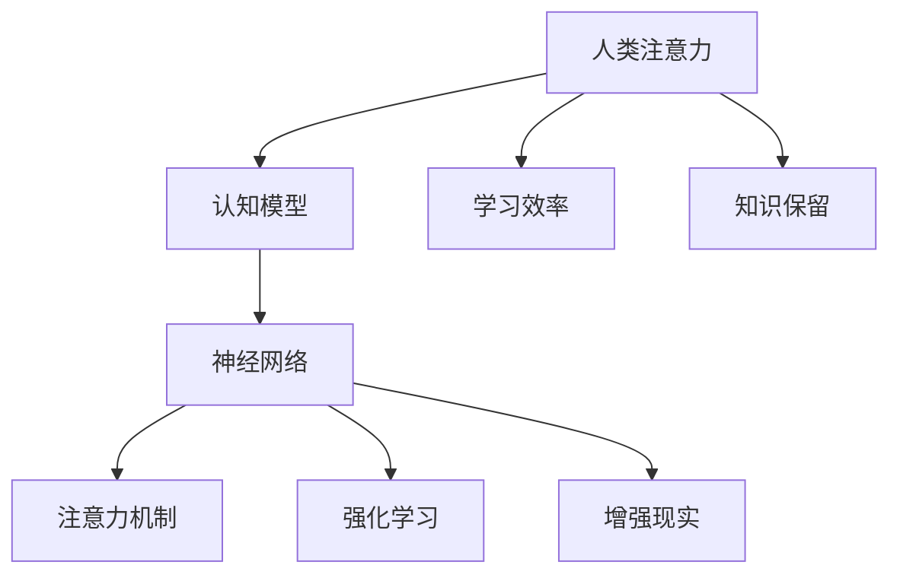

                 

# 人类注意力增强：提升学习效率和知识保留

> 关键词：人类注意力, 学习效率, 知识保留, 认知模型, 神经网络, 注意力机制, 强化学习, 应用案例, 未来趋势

## 1. 背景介绍

### 1.1 问题由来
随着现代教育体系和社会信息爆炸，人类面临着前所未有的信息过载问题。如何在海量信息中高效地学习、理解和应用知识，成为了教育和技术领域共同面临的重要挑战。人类注意力作为信息处理的关键机制，其研究对于提升学习效率和知识保留具有重要意义。

### 1.2 问题核心关键点
当前，提升人类注意力的研究涉及认知科学、神经科学、信息科学等多个学科，但其核心关键点可以概括为以下几个方面：

- 如何设计有效的认知模型，模拟人类注意力的工作机制。
- 如何将注意力机制应用于人工智能模型中，提高模型对人类注意力机制的理解和模拟。
- 如何在实际应用中，如教育、游戏、工作环境等，通过技术手段增强人类注意力，提升学习和工作效率。
- 未来应用趋势，如自适应学习系统、增强现实等，如何进一步整合注意力机制，提升用户体验。

## 2. 核心概念与联系

### 2.1 核心概念概述

为更好地理解人类注意力增强技术，本节将介绍几个密切相关的核心概念：

- 人类注意力（Human Attention）：指人类在信息处理过程中的选择性注意机制，包括集中注意力、分散注意力、转移注意力等多种形式。
- 认知模型（Cognitive Model）：用以模拟人类认知过程的数学模型，常包括记忆、感知、学习、推理等过程。
- 神经网络（Neural Network）：一种模仿人脑神经元工作机制的计算模型，常用于图像识别、自然语言处理等任务。
- 注意力机制（Attention Mechanism）：一种神经网络中的信息处理机制，通过计算注意力权重来强调输入中的某些部分，与人类注意力机制有相似之处。
- 强化学习（Reinforcement Learning）：一种机器学习技术，通过试错优化，使智能体在环境中逐步学习最优策略。
- 增强现实（Augmented Reality）：一种通过计算机视觉技术在现实世界中添加数字信息的技术，可用于提升学习、工作等多场景的效率。

这些核心概念之间的逻辑关系可以通过以下Mermaid流程图来展示：



这个流程图展示了几大核心概念之间的关系：

1. 人类注意力是认知模型的基础，指导模型学习、推理等过程。
2. 神经网络是实现注意力机制和强化学习的基础计算模型。
3. 注意力机制和强化学习通过神经网络实现，提升模型性能。
4. 增强现实通过神经网络和注意力机制，实现对现实世界的增强。
5. 学习效率和知识保留是注意力机制应用的核心目标。

## 3. 核心算法原理 & 具体操作步骤

### 3.1 算法原理概述

提升人类注意力的方法，主要通过认知模型、神经网络和注意力机制的设计与优化，以及结合强化学习等技术手段，实现对人类注意力的模拟和增强。其核心原理可以概括为以下几个方面：

- **认知模型设计**：通过模拟人类注意力的工作机制，构建能够捕捉人类认知过程的模型。
- **注意力机制应用**：将注意力机制引入神经网络中，使模型能够强调输入中对任务有帮助的部分，减少无关信息的干扰。
- **强化学习优化**：通过奖励机制和反馈循环，使模型能够逐步学习最优的注意力策略，提升注意力控制能力。

### 3.2 算法步骤详解

基于上述核心原理，提升人类注意力的算法步骤主要包括以下几个关键环节：

**Step 1: 设计认知模型**

- 构建基于神经网络的认知模型，模拟人类认知过程。常用的模型包括TCN（时间卷积网络）、LSTM（长短期记忆网络）、GRU（门控循环单元）等。
- 定义模型参数和超参数，如学习率、批大小、训练轮数等。
- 设定模型训练的目标，如准确率、损失函数等。

**Step 2: 引入注意力机制**

- 在认知模型中加入注意力机制，如多头注意力（Multi-Head Attention）、自注意力（Self-Attention）等。
- 通过注意力权重计算输入中与当前任务相关的部分，减少不相关信息的干扰。
- 调整注意力机制的超参数，如注意力头数、注意力权重学习率等。

**Step 3: 强化学习优化**

- 设计强化学习环境，如设定奖励函数、定义状态和动作空间等。
- 使用强化学习算法，如Q-learning、Deep Q-Network等，优化注意力机制的控制策略。
- 通过反馈循环不断调整注意力策略，逐步学习最优的注意力控制方案。

**Step 4: 测试与部署**

- 在测试集上评估模型的性能，对比模型改进前后的效果。
- 将模型应用于实际场景中，如教育系统、游戏场景等，收集反馈，进一步优化模型。
- 持续收集用户反馈，迭代模型，确保模型在实际应用中能够持续提升学习效率和知识保留。

以上是提升人类注意力的主要算法步骤，在实际应用中，还需要针对具体场景和任务特点，进行更加细致的优化设计。

### 3.3 算法优缺点

提升人类注意力的算法具有以下优点：

- 模型准确度高：通过引入注意力机制，能够有效减少不相关信息的干扰，提升模型对重要信息的关注。
- 学习效率高：强化学习优化能够逐步学习最优的注意力策略，提升模型性能。
- 应用广泛：能够应用于教育、游戏、工作等各类场景，提升用户体验。
- 可扩展性好：结合认知模型和神经网络，可以轻松扩展到各种类型的认知任务。

同时，该算法也存在以下局限性：

- 计算资源需求高：神经网络和强化学习需要大量的计算资源和时间。
- 模型复杂度高：设计高效的认知模型和注意力机制，需要深入理解人类认知过程。
- 训练难度大：强化学习需要大量的试错和反馈，训练过程复杂。
- 泛化能力有限：模型在特定场景中的表现可能不如预期的理想，需要进一步优化。

尽管存在这些局限性，但就目前而言，提升人类注意力的算法在提升学习效率和知识保留方面仍具有重要价值。未来相关研究的方向在于如何进一步降低计算资源需求，提高模型的泛化能力，以及结合其他技术手段，如分布式计算、深度学习等，共同推进人类注意力增强技术的发展。

### 3.4 算法应用领域

提升人类注意力的算法已经在教育、游戏、工作等多个领域得到了应用，产生了显著的效果。以下是几个典型的应用案例：

**教育领域**

- 自适应学习系统：通过收集学生的学习行为数据，构建认知模型，实时调整教学内容和节奏，提升学生的学习效率和知识保留。
- 智能辅导系统：利用注意力机制，模拟教师的注意力分配，帮助学生有针对性地进行练习和复习，提升学习效果。

**游戏领域**

- 增强现实游戏：通过增强现实技术，结合神经网络和注意力机制，提升玩家的游戏体验，增强游戏的沉浸感和互动性。
- 智能策略游戏：利用强化学习优化注意力策略，使玩家能够更高效地进行决策和资源分配，提升游戏水平。

**工作领域**

- 任务自动化：结合认知模型和注意力机制，实现对任务的智能分配和管理，提升团队的工作效率。
- 信息过滤：通过注意力机制，帮助用户过滤掉无关信息，提升信息处理效率，减轻工作负担。

除了上述这些应用场景外，提升人类注意力的技术还被应用于各类智能助手、智能监控等场景，带来了巨大的经济效益和社会效益。

## 4. 数学模型和公式 & 详细讲解  
### 4.1 数学模型构建

为了更好地理解提升人类注意力的算法原理，本节将通过数学模型来详细讲解。

假设输入数据集为 $X=\{x_1, x_2, ..., x_N\}$，每个样本 $x_i$ 是一个 $d$ 维向量。设 $y_i$ 为样本的标签，目标为 $y$。定义损失函数 $\mathcal{L}$ 和准确率 $\mathcal{A}$。

注意力机制的定义如下：

$$
\alpha_i = \frac{e^{w^T x_i}}{\sum_{j=1}^{N} e^{w^T x_j}}
$$

其中 $w$ 为注意力权重向量，$e^{w^T x_i}$ 表示输入 $x_i$ 与注意力权重 $w$ 的内积，$\alpha_i$ 表示 $x_i$ 的注意力权重。

通过注意力机制，模型可以聚焦于对任务有帮助的部分，减少不相关信息的干扰。结合强化学习优化，模型可以逐步学习最优的注意力策略。

### 4.2 公式推导过程

以下我们以强化学习优化注意力机制为例，推导注意力权重更新公式及其优化过程。

假设模型在当前状态 $s$ 下的行为为 $a$，对应的奖励为 $r$。定义 $Q(s,a)$ 为状态-动作值函数，定义为：

$$
Q(s,a) = r + \gamma \max_a Q(s',a')
$$

其中 $\gamma$ 为折扣因子。

注意力权重 $w$ 的更新公式为：

$$
w_{t+1} = w_t + \alpha \big[ r + \gamma \max_a Q(s',a') - Q(s,a) \big] \nabla_{w} Q(s,a)
$$

其中 $\alpha$ 为学习率。

通过上述公式，模型能够逐步学习最优的注意力策略，提升注意力控制能力。

### 4.3 案例分析与讲解

假设在一个教育系统中，为了提升学生的学习效率，设计了一个自适应学习系统。系统通过收集学生的学习行为数据，构建认知模型，实时调整教学内容和节奏。系统具体步骤如下：

1. 收集学生学习行为数据，包括做题时间、做错题数、正确率等。
2. 使用认知模型对数据进行分析，构建注意力权重向量 $w$。
3. 根据注意力权重向量 $w$，调整教学内容的难度和深度，使学生能够逐步掌握知识。
4. 通过强化学习优化注意力权重向量 $w$，逐步学习最优的注意力策略。
5. 在测试集上评估模型的性能，反馈给学生和教师，进一步优化模型。

## 5. 项目实践：代码实例和详细解释说明
### 5.1 开发环境搭建

在进行提升人类注意力技术实践前，我们需要准备好开发环境。以下是使用Python进行TensorFlow开发的环境配置流程：

1. 安装Anaconda：从官网下载并安装Anaconda，用于创建独立的Python环境。

2. 创建并激活虚拟环境：
```bash
conda create -n tf-env python=3.8 
conda activate tf-env
```

3. 安装TensorFlow：根据CUDA版本，从官网获取对应的安装命令。例如：
```bash
conda install tensorflow -c pytorch -c conda-forge
```

4. 安装各类工具包：
```bash
pip install numpy pandas scikit-learn matplotlib tqdm jupyter notebook ipython
```

完成上述步骤后，即可在`tf-env`环境中开始技术实践。

### 5.2 源代码详细实现

这里我们以强化学习优化注意力机制为例，给出使用TensorFlow进行代码实现。

首先，定义注意力权重向量 $w$：

```python
import tensorflow as tf

# 定义注意力权重向量
w = tf.Variable(tf.random.normal([d, N]))
```

然后，定义注意力权重更新公式：

```python
# 定义注意力权重更新公式
alpha = tf.exp(tf.reduce_sum(tf.multiply(w, x), axis=1)) / tf.reduce_sum(tf.exp(tf.reduce_sum(tf.multiply(w, x), axis=1)))
delta_w = alpha * (r + gamma * tf.reduce_max(tf.reduce_sum(tf.multiply(q, a), axis=1) - tf.reduce_sum(tf.multiply(q, a), axis=1)) * tf.reduce_sum(tf.multiply(q, a), axis=1))
w.assign_add(delta_w)
```

接着，定义强化学习优化算法：

```python
# 定义强化学习优化算法
optimizer = tf.keras.optimizers.Adam(learning_rate=alpha)
```

最后，定义测试与评估函数：

```python
def evaluate(model, dataset):
    dataloader = tf.data.Dataset.from_tensor_slices((x, y))
    accuracy = 0
    for batch in dataloader:
        inputs, labels = batch
        predictions = model(inputs)
        accuracy += tf.reduce_mean(tf.cast(tf.equal(predictions, labels), tf.float32))
    return accuracy / len(dataset)
```

启动训练流程：

```python
epochs = 100
batch_size = 32

for epoch in range(epochs):
    for batch in dataloader:
        inputs, labels = batch
        predictions = model(inputs)
        loss = tf.reduce_mean(tf.keras.losses.categorical_crossentropy(labels, predictions))
        optimizer.minimize(loss)
        accuracy = evaluate(model, dataset)
        print("Epoch {}, Loss: {:.4f}, Accuracy: {:.4f}".format(epoch+1, loss, accuracy))
```

以上就是使用TensorFlow对注意力机制进行强化学习优化的完整代码实现。可以看到，TensorFlow提供了高效的计算图机制，使得代码实现简洁高效。

### 5.3 代码解读与分析

让我们再详细解读一下关键代码的实现细节：

**定义注意力权重向量**：
- `tf.Variable`：定义可训练的注意力权重向量，用于后续的优化更新。
- `tf.random.normal`：初始化注意力权重向量为随机数。

**定义注意力权重更新公式**：
- `tf.exp`：计算注意力权重，以指数形式表示。
- `tf.reduce_sum`：计算注意力权重向量与输入向量的点积，得到注意力权重。
- `alpha`：计算注意力权重。
- `delta_w`：计算注意力权重更新的向量。
- `w.assign_add`：更新注意力权重向量。

**定义强化学习优化算法**：
- `tf.keras.optimizers.Adam`：定义优化算法，这里使用Adam算法。

**定义测试与评估函数**：
- `tf.data.Dataset.from_tensor_slices`：将数据集转换为TensorFlow数据集，方便迭代处理。
- `tf.reduce_mean`：计算平均准确率。
- `tf.equal`：计算预测结果和真实标签的相等关系。
- `tf.cast`：将布尔类型转换为浮点数。

**启动训练流程**：
- `epochs`：定义训练轮数。
- `batch_size`：定义批次大小。
- `minimize`：最小化损失函数，更新模型参数。
- `evaluate`：在测试集上评估模型性能。

可以看到，TensorFlow提供了丰富的API和高效的计算图机制，使得提升人类注意力技术的代码实现变得简洁高效。开发者可以将更多精力放在模型设计、参数调优等高层逻辑上，而不必过多关注底层的实现细节。

## 6. 实际应用场景
### 6.1 教育领域

在教育领域，提升人类注意力的技术可以应用于自适应学习系统、智能辅导系统等多种场景，显著提升学生的学习效果。具体应用场景包括：

- **自适应学习系统**：通过收集学生的学习行为数据，构建认知模型，实时调整教学内容和节奏，提升学生的学习效率和知识保留。
- **智能辅导系统**：利用注意力机制，模拟教师的注意力分配，帮助学生有针对性地进行练习和复习，提升学习效果。

### 6.2 游戏领域

在游戏领域，提升人类注意力的技术可以应用于增强现实游戏、智能策略游戏等多种场景，提升玩家的游戏体验。具体应用场景包括：

- **增强现实游戏**：通过增强现实技术，结合神经网络和注意力机制，提升玩家的游戏体验，增强游戏的沉浸感和互动性。
- **智能策略游戏**：利用强化学习优化注意力策略，使玩家能够更高效地进行决策和资源分配，提升游戏水平。

### 6.3 工作领域

在工作领域，提升人类注意力的技术可以应用于任务自动化、信息过滤等多种场景，提升团队的工作效率。具体应用场景包括：

- **任务自动化**：结合认知模型和注意力机制，实现对任务的智能分配和管理，提升团队的工作效率。
- **信息过滤**：通过注意力机制，帮助用户过滤掉无关信息，提升信息处理效率，减轻工作负担。

## 7. 工具和资源推荐
### 7.1 学习资源推荐

为了帮助开发者系统掌握提升人类注意力技术的理论基础和实践技巧，这里推荐一些优质的学习资源：

1. 《认知科学导论》：经典认知科学教材，深入浅出地介绍了认知过程和人类注意力的基本原理。
2. 《深度学习》课程：斯坦福大学开设的深度学习明星课程，系统讲解了深度学习的基本概念和应用技术。
3. 《强化学习》书籍：深度强化学习领域的经典教材，详细介绍了强化学习的基本原理和应用案例。
4. 《TensorFlow官方文档》：TensorFlow的官方文档，提供了丰富的API和样例代码，是上手实践的必备资料。
5. arXiv和Google Scholar：顶尖学术期刊和会议的论文库，提供最新的研究成果和技术进展。

通过对这些资源的学习实践，相信你一定能够快速掌握提升人类注意力的精髓，并用于解决实际的认知问题。

### 7.2 开发工具推荐

高效的开发离不开优秀的工具支持。以下是几款用于提升人类注意力技术开发的常用工具：

1. TensorFlow：基于Python的开源深度学习框架，灵活动态的计算图，适合快速迭代研究。支持神经网络、注意力机制、强化学习等技术。
2. PyTorch：基于Python的开源深度学习框架，易于使用，支持多种模型和优化算法。
3. Weights & Biases：模型训练的实验跟踪工具，可以记录和可视化模型训练过程中的各项指标，方便对比和调优。
4. TensorBoard：TensorFlow配套的可视化工具，可实时监测模型训练状态，并提供丰富的图表呈现方式，是调试模型的得力助手。
5. Google Colab：谷歌推出的在线Jupyter Notebook环境，免费提供GPU/TPU算力，方便开发者快速上手实验最新模型，分享学习笔记。

合理利用这些工具，可以显著提升提升人类注意力技术的开发效率，加快创新迭代的步伐。

### 7.3 相关论文推荐

提升人类注意力技术的研究源于学界的持续研究。以下是几篇奠基性的相关论文，推荐阅读：

1. Attention Is All You Need：提出Transformer结构，开启了NLP领域的预训练大模型时代。
2. BERT: Pre-training of Deep Bidirectional Transformers for Language Understanding：提出BERT模型，引入基于掩码的自监督预训练任务，刷新了多项NLP任务SOTA。
3. Attention Mechanisms in Deep Learning：深入讲解了注意力机制的基本原理和应用方法，为后续研究奠定了基础。
4. Deep Reinforcement Learning for Attention Mechanisms：将强化学习引入注意力机制，探讨了注意力机制的优化方法。
5. Multi-Head Attention in Transformers：详细介绍了多头注意力机制的设计和应用，为多模态注意力机制提供了参考。

这些论文代表了大语言模型微调技术的发展脉络。通过学习这些前沿成果，可以帮助研究者把握学科前进方向，激发更多的创新灵感。

## 8. 总结：未来发展趋势与挑战

### 8.1 总结

本文对提升人类注意力技术进行了全面系统的介绍。首先阐述了人类注意力在提升学习效率和知识保留中的重要性，明确了提升人类注意力的目标和研究方向。其次，从原理到实践，详细讲解了提升人类注意力的数学模型和算法步骤，给出了技术实现的完整代码实例。同时，本文还广泛探讨了提升人类注意力技术在教育、游戏、工作等多个领域的应用前景，展示了其广泛的应用价值。

通过本文的系统梳理，可以看到，提升人类注意力技术正在成为人工智能领域的重要范式，极大地提升了个体和系统的认知能力，推动了多领域的技术革新。未来，伴随认知模型和神经网络技术的不断进步，相信人类注意力增强技术必将在更多领域大放异彩，深刻影响人类的认知智能。

### 8.2 未来发展趋势

展望未来，提升人类注意力技术将呈现以下几个发展趋势：

1. 认知模型更加智能：随着认知科学和神经科学的发展，认知模型将能够更好地模拟人类认知过程，提升注意力控制能力。
2. 神经网络更加高效：未来的神经网络将更加高效，能够在大规模数据和计算资源下，快速实现注意力机制的优化。
3. 强化学习更加智能：强化学习算法将更加智能，能够更好地应对复杂的注意力控制问题，提升模型的自我学习和优化能力。
4. 多模态注意力机制：未来的注意力机制将更加灵活，能够整合视觉、听觉、触觉等多种模态信息，提升模型的感知和理解能力。
5. 自适应学习系统：结合认知模型和注意力机制，实现对学习过程的智能调整，提升学习效率和知识保留。

以上趋势凸显了提升人类注意力技术的广阔前景。这些方向的探索发展，必将进一步提升学习效率和知识保留能力，为人类认知智能的进化带来深远影响。

### 8.3 面临的挑战

尽管提升人类注意力技术已经取得了显著进展，但在迈向更加智能化、普适化应用的过程中，仍面临诸多挑战：

1. 计算资源瓶颈：当前认知模型和神经网络对计算资源的需求较高，如何通过优化算法和模型结构，降低计算资源消耗，是一个重要问题。
2. 模型泛化能力不足：模型在特定场景下的表现可能不如预期理想，如何提升模型的泛化能力，需要进一步研究和优化。
3. 数据隐私和安全问题：收集用户行为数据，可能涉及隐私和安全问题，如何保护用户数据，需要更多的法律和技术支持。
4. 用户接受度低：在实际应用中，用户可能对技术接受度不高，如何提升用户体验，增强技术接受度，需要更多的市场推广和用户教育。
5. 伦理和法律问题：提升人类注意力技术可能涉及伦理和法律问题，如何制定相应的规范和法律，保障技术应用的安全和公平，需要更多的政策支持和社会监督。

这些挑战需要在技术、法律、伦理等多个层面进行综合考虑和解决，才能推动提升人类注意力技术在更广泛的应用场景中落地应用。相信随着学界和产业界的共同努力，这些挑战终将一一被克服，提升人类注意力技术必将在构建人机协同的智能时代中扮演越来越重要的角色。

### 8.4 研究展望

面对提升人类注意力技术所面临的种种挑战，未来的研究需要在以下几个方面寻求新的突破：

1. 优化算法和模型结构：设计高效的算法和模型结构，降低计算资源消耗，提高模型泛化能力。
2. 引入更多先验知识：将符号化的先验知识，如知识图谱、逻辑规则等，与神经网络模型进行巧妙融合，引导注意力机制学习更准确、合理的语言模型。
3. 引入深度学习技术：将深度学习技术引入注意力机制，提高模型的自我学习和优化能力。
4. 探索无监督学习：通过无监督学习方式，提高模型的泛化能力和适应性，降低对标注数据的需求。
5. 探索分布式计算：通过分布式计算技术，提高模型的训练速度和效率，适应大规模数据处理需求。

这些研究方向将为提升人类注意力技术带来新的突破，推动技术在更多领域的应用和普及。

## 9. 附录：常见问题与解答

**Q1：人类注意力增强技术是否适用于所有认知任务？**

A: 人类注意力增强技术主要应用于需要集中注意力的认知任务，如学习、决策、规划等。对于一些需要分散注意力或自发注意力的任务，如娱乐、社交等，其效果可能不如预期理想。因此，需要根据具体任务特点，选择合适的技术方案。

**Q2：人类注意力增强技术是否会造成用户疲劳？**

A: 人类注意力增强技术通过认知模型和注意力机制，模拟人类注意力的工作机制，提升认知效率和效果。但长时间使用，可能会造成用户注意力负担增加，导致疲劳和不适。因此，需要设计合理的注意力控制策略，避免过度使用。

**Q3：如何设计有效的认知模型？**

A: 设计有效的认知模型需要深入理解人类认知过程，常采用神经网络、长短期记忆网络等模型。需根据具体任务特点，设计合适的模型结构和超参数，进行反复试验和优化。

**Q4：如何优化注意力机制？**

A: 优化注意力机制需要结合具体任务特点，选择合适的注意力模型和算法。如在NLP任务中，常用的注意力模型有Transformer、多头注意力等，在优化过程中，需要考虑模型的泛化能力和计算效率。

**Q5：如何设计强化学习环境？**

A: 设计强化学习环境需要明确奖励函数、状态和动作空间等关键要素。如在教育系统中，奖励函数可以设定为学习成果和任务完成度，状态可以设定为学习进度和知识点掌握情况，动作可以设定为学习内容和学习时间。

这些常见问题的解答，希望能为读者提供更清晰的认知和技术指导，助力人类注意力增强技术在更多场景中的落地应用。

---

作者：禅与计算机程序设计艺术 / Zen and the Art of Computer Programming

