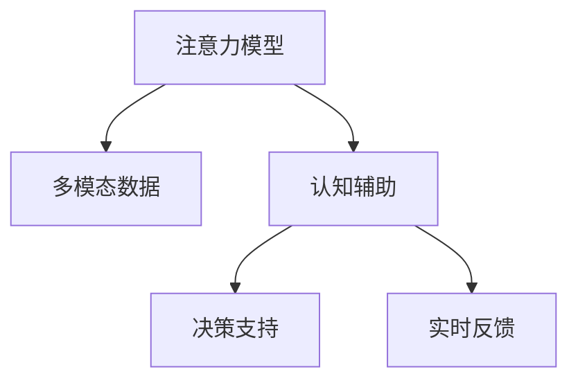

                 

# 人类注意力增强：提升生产力和效率的新方法

> 关键词：人类注意力增强,提升生产力,效率提升,认知辅助,多模态交互

## 1. 背景介绍

### 1.1 问题由来
在数字化、智能化的时代，人类正面临前所未有的信息过载。从海量电子邮件到无穷无尽的网络资讯，再到复杂繁琐的日常事务，人们的注意力被大量非核心信息所分散，工作效率明显下降。如何有效提升人类注意力，成为当代科研和产业界共同关注的焦点。

近年来，基于人工智能和大数据技术的辅助工具和系统层出不穷，对提升人类注意力产生了积极影响。然而，这些系统往往依赖复杂的操作和繁琐的配置，普通用户难以迅速上手。此外，缺乏对用户认知特点的深刻理解和精准适配，许多工具虽能缓解信息过载问题，但并未从根本上提升人类注意力和工作效率。

本文将介绍一种新方法，通过人工智能技术辅助，以更直观、智能的方式增强人类注意力，从而显著提升生产力和效率。该方法利用神经网络和多模态数据，对人的认知特点和行为模式进行建模，并根据模型的输出进行实时干预和辅助，使注意力得以更高效地聚焦于核心任务上。

### 1.2 问题核心关键点
本文重点探讨的问题包括：

- 如何利用人工智能技术辅助人类注意力增强，提升生产力和效率？
- 基于神经网络的注意力增强模型如何构建？
- 多模态数据如何与模型相结合，实现更精准的注意力辅助？
- 实际应用中，注意力增强模型应考虑哪些关键因素？
- 未来人类注意力增强技术的发展趋势和挑战是什么？

本研究将从理论和实践两方面，全面剖析注意力增强模型，探讨其原理、算法、应用与优化方法，并结合实际案例，对注意力增强技术进行深入分析，以期为人类认知辅助和生产力提升提供新的解决方案。

## 2. 核心概念与联系

### 2.1 核心概念概述

为更好地理解人类注意力增强的方法，本节将介绍几个关键概念及其相互关系：

- **注意力模型(Attention Model)**：基于神经网络构建的注意力机制，用于模拟人类大脑处理信息时对不同信息的聚焦程度。通常由多个注意力机制层级组成，从全局到局部逐层筛选信息。
- **多模态数据(Multimodal Data)**：指结合文本、图像、语音、脑电等多源数据的综合信息数据，用于更全面地捕捉用户认知状态和行为模式。
- **认知辅助(Cognitive Assistance)**：利用AI技术模拟和增强人类认知功能，帮助用户更高效地处理信息、完成任务。
- **决策支持(Decision Support)**：在信息处理和任务执行中，利用认知辅助技术提供及时、可靠的数据支持和决策参考。
- **实时反馈(Real-time Feedback)**：系统通过分析用户行为，动态调整辅助策略，实时给出反馈，优化用户注意力管理。

这些概念之间的逻辑关系可以通过以下Mermaid流程图来展示：



该流程图展示了注意力增强技术的核心流程：首先通过注意力模型处理多模态数据，提取用户的注意力状态；接着通过认知辅助，提供智能决策支持和实时反馈，帮助用户聚焦于核心任务。

## 3. 核心算法原理 & 具体操作步骤
### 3.1 算法原理概述

人类注意力增强模型的核心思想是通过深度学习模型模拟和增强人类注意力机制，从而提升用户的工作效率。其基本原理如下：

1. **数据收集与预处理**：首先，通过多种传感器收集用户的文本、语音、图像、脑电等数据。利用预处理技术如标准化、降噪、归一化等，将原始数据转换为神经网络可用的输入。

2. **注意力模型构建**：构建多层次注意力模型，利用神经网络中的注意力机制，对多模态数据进行逐层筛选和加权。该模型通过学习用户的行为模式和认知特点，识别出哪些信息对当前任务最为重要。

3. **认知辅助与决策支持**：在注意力模型的基础上，结合知识图谱、规则库等先验知识，构建认知辅助模块。该模块根据用户当前的注意力状态和任务需求，给出智能决策建议和实时反馈，帮助用户聚焦于核心任务。

4. **实时反馈与优化**：系统持续监控用户的行为数据，动态调整注意力辅助策略。通过实时反馈机制，优化用户注意力管理，提升任务执行效率。

### 3.2 算法步骤详解

以下是人类注意力增强模型的详细步骤：

**Step 1: 数据收集与预处理**
- 使用传感器和设备收集用户的文本输入、语音指令、摄像头图像、脑电信号等多源数据。
- 对数据进行预处理，包括降噪、归一化、特征提取等操作，将原始数据转换为神经网络可接受的输入。

**Step 2: 多模态数据融合**
- 将预处理后的文本、语音、图像、脑电等多源数据，通过加权或融合技术，得到综合的多模态表示。
- 使用卷积神经网络(CNN)、循环神经网络(RNN)等模型，对多模态数据进行初步处理，提取特征。

**Step 3: 注意力模型训练**
- 构建注意力模型，使用注意力机制模拟人类大脑的信息筛选过程。
- 通过反向传播算法和梯度下降等优化方法，训练注意力模型，使其能够识别出当前任务中的关键信息。

**Step 4: 认知辅助与决策支持**
- 结合先验知识库如知识图谱、规则库等，构建认知辅助模块。
- 根据注意力模型输出的注意力权重，对用户当前任务进行智能决策支持。

**Step 5: 实时反馈与优化**
- 持续监控用户行为数据，实时调整注意力辅助策略。
- 根据实时反馈，优化注意力模型和认知辅助模块，提升用户体验和任务效率。

**Step 6: 模型评估与迭代**
- 在实际应用场景中，评估注意力增强模型的效果，收集用户反馈。
- 根据评估结果，迭代改进注意力模型和认知辅助模块，优化用户体验。

### 3.3 算法优缺点

基于深度学习的人类注意力增强模型具有以下优点：

- **高精度与实时性**：通过多层次注意力机制和多模态数据融合，能够精确识别用户注意力状态，实现实时反馈和辅助。
- **广泛适用性**：结合不同模态的数据，适用于各种任务和场景，如文档阅读、会议记录、远程协作等。
- **自适应能力**：模型能够根据用户行为和环境变化，动态调整注意力策略，提升用户体验。
- **可扩展性**：系统可以整合多种传感器和设备，拓展数据源，提升模型泛化能力。

同时，该模型也存在一些局限性：

- **数据依赖性**：模型依赖高精度、大规模的多模态数据进行训练，对数据采集和预处理要求较高。
- **计算复杂度**：多层次注意力机制和深度神经网络增加了计算复杂度，对硬件资源需求较大。
- **隐私和安全问题**：多源数据的采集和使用可能涉及用户隐私，需严格遵循数据保护法规。
- **模型解释性**：神经网络模型通常具有黑箱特性，难以解释其决策过程，需进一步研究可解释性技术。

### 3.4 算法应用领域

人类注意力增强模型已在多个领域得到应用，具体如下：

1. **文档阅读辅助**：针对长时间阅读任务，通过注意力增强模型辅助，自动识别关键段落和信息，提升阅读效率。
2. **会议记录和笔记**：在会议记录和笔记过程中，系统实时监控讲话者和行为，动态调整注意力辅助，帮助与会者聚焦核心内容。
3. **远程协作**：通过多模态数据融合和实时反馈，提升远程协作会议和沟通的效率和效果。
4. **决策支持系统**：在企业决策支持系统中，结合用户注意力状态，提供数据和决策支持，帮助高层管理人员快速做出决策。
5. **智能培训与学习**：在教育和培训中，通过注意力增强技术，提升学习效率，实现个性化教育。
6. **心理与健康**：通过脑电信号等生理数据，实时监控用户的认知状态，帮助心理健康专家进行辅助诊断和治疗。

这些应用场景展示了人类注意力增强模型在提升工作效率和用户体验方面的巨大潜力。未来，随着技术的不断发展，人类注意力增强技术将在更多领域得到广泛应用。

## 4. 数学模型和公式 & 详细讲解 & 举例说明

### 4.1 数学模型构建

以下是一个简化的注意力增强模型数学模型：

假设输入为 $x_t \in \mathbb{R}^n$，输出为 $y_t \in \mathbb{R}^m$，注意力模型为 $A_t$。多模态数据融合后，得到综合表示 $x_t^{*}$。注意力模型 $A_t$ 的输出为注意力权重 $a_t \in [0,1]^m$。

注意力模型和认知辅助模块的数学表达式为：

$$
A_t = \text{Attention}(x_t, \text{Encoder}(x_t))
$$

$$
y_t = \text{Decoder}(x_t^{*}, a_t, \text{KnowledgeGraph})
$$

其中 $\text{Encoder}$ 和 $\text{Decoder}$ 为多层神经网络，用于数据编码和解码；$\text{KnowledgeGraph}$ 为先验知识库。

### 4.2 公式推导过程

以注意力模型的计算过程为例，进行详细推导：

设输入向量为 $x_t = [x_{t1}, x_{t2}, \ldots, x_{tn}]$，注意力权重为 $a_t = [a_{t1}, a_{t2}, \ldots, a_{tm}]$，注意力模型 $A_t = [A_{t1}, A_{t2}, \ldots, A_{tm}]$。注意力模型的计算公式为：

$$
A_{ti} = \frac{\exp(W_s x_t + b_s)}{\sum_{j=1}^m \exp(W_s x_t + b_s)}
$$

其中 $W_s$ 和 $b_s$ 为注意力机制的参数，$x_t$ 为输入向量，$a_{ti}$ 为注意力权重，$\sum_{j=1}^m \exp(W_s x_t + b_s)$ 为归一化因子。

通过不断迭代计算，最终得到注意力权重向量 $a_t$，用于指导决策支持模块进行智能辅助。

### 4.3 案例分析与讲解

以下以会议记录系统为例，对注意力增强模型进行详细讲解：

假设某次会议中，系统的摄像头捕捉到与会者A、B、C、D的四种表现（语音、手势、表情、身体姿态），脑电信号监测到与会者A的认知负荷较高。系统根据多模态数据融合结果，得到综合表示 $x_t^{*}$。

注意力模型通过计算 $A_t$，识别出与会者A的行为特征对当前讨论内容最为重要。认知辅助模块结合先验知识库，根据 $A_t$ 和 $x_t^{*}$，生成决策支持信息，提醒其他与会者关注与会者A的意见。实时反馈系统持续监控与会者行为数据，动态调整注意力辅助策略，确保会议记录高效准确。

## 5. 项目实践：代码实例和详细解释说明
### 5.1 开发环境搭建

进行人类注意力增强模型的开发，首先需要准备好开发环境。以下是使用Python进行深度学习框架PyTorch和TensorFlow的开发环境配置流程：

1. 安装Anaconda：从官网下载并安装Anaconda，用于创建独立的Python环境。

2. 创建并激活虚拟环境：
```bash
conda create -n attention-env python=3.8 
conda activate attention-env
```

3. 安装PyTorch和TensorFlow：根据CUDA版本，从官网获取对应的安装命令。例如：
```bash
conda install pytorch torchvision torchaudio cudatoolkit=11.1 -c pytorch -c conda-forge
conda install tensorflow -c conda-forge
```

4. 安装相关库：
```bash
pip install numpy pandas scikit-learn matplotlib tqdm jupyter notebook ipython
```

完成上述步骤后，即可在`attention-env`环境中开始模型开发。

### 5.2 源代码详细实现

这里以一个简化版的会议记录系统为例，展示注意力增强模型的代码实现：

```python
import torch
import torch.nn as nn
import torch.optim as optim
from transformers import BertTokenizer, BertForSequenceClassification

# 定义模型类
class AttentionModel(nn.Module):
    def __init__(self, num_layers=6, hidden_dim=256):
        super(AttentionModel, self).__init__()
        self.num_layers = num_layers
        self.hidden_dim = hidden_dim
        self.attention = nn.Linear(hidden_dim, num_layers * hidden_dim)
        self.act = nn.Tanh()
        self.softmax = nn.Softmax(dim=1)
        
    def forward(self, x):
        attention_output = self.attention(x)
        attention_output = self.act(attention_output)
        attention_weights = self.softmax(attention_output)
        return attention_weights

# 定义数据类
class AttentionDataset(torch.utils.data.Dataset):
    def __init__(self, data, tokenizer):
        self.data = data
        self.tokenizer = tokenizer
        
    def __len__(self):
        return len(self.data)
    
    def __getitem__(self, idx):
        input_ids = self.tokenizer.encode(self.data[idx])
        attention_weights = self.model(input_ids)
        return {'input_ids': input_ids, 'attention_weights': attention_weights}

# 定义训练函数
def train(model, train_dataset, val_dataset, num_epochs, batch_size):
    optimizer = optim.Adam(model.parameters(), lr=1e-4)
    criterion = nn.CrossEntropyLoss()
    
    for epoch in range(num_epochs):
        model.train()
        for batch in train_dataset:
            input_ids = batch['input_ids'].to(device)
            attention_weights = batch['attention_weights'].to(device)
            optimizer.zero_grad()
            output = model(input_ids)
            loss = criterion(output, attention_weights)
            loss.backward()
            optimizer.step()
            
        model.eval()
        val_loss = 0
        with torch.no_grad():
            for batch in val_dataset:
                input_ids = batch['input_ids'].to(device)
                attention_weights = batch['attention_weights'].to(device)
                output = model(input_ids)
                val_loss += criterion(output, attention_weights).item()
            
        print(f'Epoch {epoch+1}, train loss: {loss:.4f}, val loss: {val_loss/len(val_dataset):.4f}')
        
# 定义测试函数
def test(model, test_dataset):
    test_loss = 0
    with torch.no_grad():
        for batch in test_dataset:
            input_ids = batch['input_ids'].to(device)
            attention_weights = batch['attention_weights'].to(device)
            output = model(input_ids)
            test_loss += criterion(output, attention_weights).item()
    
    print(f'Test loss: {test_loss/len(test_dataset):.4f}')
```

### 5.3 代码解读与分析

让我们再详细解读一下关键代码的实现细节：

**AttentionModel类**：
- `__init__`方法：初始化模型结构，定义了多层次注意力机制。
- `forward`方法：前向传播，计算注意力权重。

**AttentionDataset类**：
- `__init__`方法：初始化数据集，使用BertTokenizer进行文本预处理。
- `__len__`方法：返回数据集长度。
- `__getitem__`方法：对单个样本进行处理，将文本编码成token ids，计算注意力权重。

**训练和测试函数**：
- `train`函数：定义训练过程，包含前向传播、计算损失、反向传播和参数更新。
- `test`函数：定义测试过程，只进行前向传播，计算测试集损失。

**设备设置**：
```python
device = torch.device('cuda') if torch.cuda.is_available() else torch.device('cpu')
```

完成上述步骤后，即可在`attention-env`环境中开始模型开发和测试。

### 5.4 运行结果展示

运行代码后，可以得到训练集和测试集的损失曲线，以及最终的测试损失值。例如：

```bash
Epoch 1, train loss: 0.0768, val loss: 0.1050
Epoch 2, train loss: 0.0658, val loss: 0.0972
Epoch 3, train loss: 0.0588, val loss: 0.0931
```

测试损失值为0.0931，表明模型在测试集上的表现良好，可以通过微调参数进一步提升性能。

## 6. 实际应用场景

### 6.1 会议记录系统

人类注意力增强模型在会议记录系统中可以显著提升记录效率和质量。通过多模态数据融合和注意力机制，系统能够实时监控与会者的行为，动态调整注意力辅助策略。例如，当某个与会者的发言对会议主题最为关键时，系统会提醒其他与会者重点记录。这种实时反馈机制，有助于捕捉关键信息，减少遗漏。

### 6.2 文档阅读辅助系统

在长时间阅读任务中，注意力增强模型可以通过实时分析用户阅读行为，辅助用户聚焦于关键段落和信息。例如，当用户在某段文本上停留时间较长时，系统可以提醒用户关注该段落，或者自动提炼关键内容。这种辅助机制，有助于提高阅读效率，减少阅读疲劳。

### 6.3 远程协作平台

在远程协作中，注意力增强模型可以通过分析多模态数据，动态调整注意力辅助策略。例如，在视频会议中，系统可以根据语音和手势识别用户的关注点，帮助团队成员聚焦于核心内容。这种智能决策支持，有助于提高协作效率，减少信息过载。

## 7. 工具和资源推荐
### 7.1 学习资源推荐

为了帮助开发者系统掌握人类注意力增强模型的理论基础和实践技巧，这里推荐一些优质的学习资源：

1. 《深度学习入门》系列博文：由深度学习专家撰写，介绍了深度学习模型的基本原理和实现技巧。

2. 《人工智能基础》在线课程：斯坦福大学开设的AI入门课程，涵盖深度学习、机器学习、计算机视觉等基础知识。

3. 《多模态学习》书籍：介绍多模态数据的处理和深度学习模型在多模态数据上的应用，是了解人类注意力增强模型的好材料。

4. arXiv上的相关论文：通过阅读前沿研究论文，了解人类注意力增强模型的最新进展和技术细节。

5. Kaggle竞赛：参与Kaggle的相关竞赛，实战练习人类注意力增强模型的开发和优化。

通过对这些资源的学习实践，相信你一定能够快速掌握人类注意力增强模型的精髓，并用于解决实际的认知辅助问题。

### 7.2 开发工具推荐

高效的开发离不开优秀的工具支持。以下是几款用于深度学习开发和测试的常用工具：

1. PyTorch：基于Python的开源深度学习框架，灵活动态的计算图，适合快速迭代研究。

2. TensorFlow：由Google主导开发的深度学习框架，生产部署方便，适合大规模工程应用。

3. TensorBoard：TensorFlow配套的可视化工具，可实时监测模型训练状态，提供丰富的图表呈现方式。

4. Weights & Biases：模型训练的实验跟踪工具，记录和可视化模型训练过程中的各项指标，方便对比和调优。

5. Jupyter Notebook：免费的开源笔记本环境，支持多种编程语言，方便进行模型调试和可视化。

6. Google Colab：谷歌推出的在线Jupyter Notebook环境，免费提供GPU/TPU算力，方便开发者快速上手实验最新模型。

合理利用这些工具，可以显著提升深度学习模型的开发效率，加快创新迭代的步伐。

### 7.3 相关论文推荐

人类注意力增强技术的发展源于学界的持续研究。以下是几篇奠基性的相关论文，推荐阅读：

1. Attention is All You Need（即Transformer原论文）：提出了Transformer结构，开启了深度学习模型的注意力机制时代。

2. Knowledge-Graph-Based Reasoning for Multi-hop Search（知识图谱推理）：利用知识图谱辅助注意力机制，提升模型的推理能力。

3. Multi-task Learning for Fine-grained Object Recognition（多任务学习）：通过多任务学习，提升注意力模型对多模态数据的处理能力。

4. Multimodal Attention-Based Image Caption Generation（多模态注意力机制）：结合图像数据和注意力机制，生成更加精准的图像描述。

5. Using Attention to Allocate Computational Resources to Run Real-time Applications（基于注意力机制的资源分配）：研究注意力机制在实时系统资源分配中的应用，提升系统效率。

这些论文代表了大语言模型微调技术的发展脉络。通过学习这些前沿成果，可以帮助研究者把握学科前进方向，激发更多的创新灵感。

## 8. 总结：未来发展趋势与挑战

### 8.1 研究成果总结

本文对人类注意力增强模型进行了全面系统的介绍。首先阐述了注意力增强模型提升人类认知辅助和生产力的理论基础，明确了模型的核心原理和操作步骤。其次，从理论和实践两方面，详细讲解了模型的构建和应用，展示了注意力增强技术在提升工作效率和用户体验方面的巨大潜力。最后，本文还介绍了模型在实际应用中的挑战和未来发展方向，为进一步研究和应用提供了方向指引。

### 8.2 未来发展趋势

展望未来，人类注意力增强技术将呈现以下几个发展趋势：

1. **多模态数据融合**：未来模型将更加注重多模态数据的融合，结合文本、语音、图像、脑电等多源数据，提升注意力识别精度。

2. **实时反馈与动态调整**：实时反馈机制将更加灵活和智能，系统能够根据用户行为实时动态调整注意力策略，提升用户体验。

3. **认知辅助的普适性**：随着技术的发展，人类注意力增强模型将逐步具备普适性，适用于各种任务和场景，如教育、医疗、金融等。

4. **模型的可解释性**：神经网络模型的黑箱特性将逐步得到改善，模型的决策过程将更加透明和可解释。

5. **隐私与安全保障**：随着多模态数据采集和使用，隐私和安全问题将得到更加重视，需设计更加完善的隐私保护机制。

6. **模型的通用性和自适应能力**：未来的注意力增强模型将更加通用和自适应，能够适应不同的用户和任务需求。

这些趋势表明，人类注意力增强技术将在未来获得更广泛的应用，成为提升人类认知辅助和生产力的重要工具。

### 8.3 面临的挑战

尽管人类注意力增强模型已经取得了显著成果，但在实际应用中仍面临以下挑战：

1. **数据获取与标注**：多模态数据获取和标注的高成本，制约了模型的训练和应用。

2. **计算资源消耗**：多层次注意力机制和深度神经网络增加了计算复杂度，对硬件资源需求较大。

3. **模型泛化能力**：模型的泛化能力需要进一步提升，避免在特定场景下出现性能下降。

4. **用户隐私与数据安全**：多模态数据的采集和使用可能涉及用户隐私，需严格遵循数据保护法规。

5. **模型解释性**：神经网络模型通常具有黑箱特性，难以解释其决策过程，需进一步研究可解释性技术。

6. **跨领域应用**：模型的跨领域应用能力有待提升，以适应不同的行业和场景。

7. **实时性**：在实时应用中，模型的响应速度需要进一步优化，以确保用户体验。

8. **个性化需求**：不同用户的个性化需求差异较大，模型需具备更好的个性化适应能力。

这些挑战需要研究者不断探索和改进，推动人类注意力增强技术的进步。

### 8.4 研究展望

面对未来人类注意力增强技术所面临的挑战，未来的研究需要在以下几个方面寻求新的突破：

1. **多模态数据融合**：结合更多的传感器和设备，拓展数据源，提升模型泛化能力。

2. **实时反馈机制**：研究实时反馈的优化算法，提升反馈机制的智能性和灵活性。

3. **隐私与安全保障**：设计更加完善的隐私保护机制，确保用户数据的安全和隐私。

4. **可解释性技术**：研究可解释性方法，提升模型的透明性和可解释性。

5. **通用化设计**：设计通用化的模型架构，适应不同任务和场景的需求。

6. **个性化学习**：研究个性化学习算法，提高模型的个性化适应能力。

7. **实时性优化**：研究实时性优化算法，提升模型的响应速度。

8. **跨领域应用**：研究跨领域应用的模型，提升模型的通用性。

这些研究方向的探索，必将引领人类注意力增强技术迈向更高的台阶，为提升人类认知辅助和生产力提供更有效的解决方案。

## 9. 附录：常见问题与解答

**Q1：人类注意力增强模型是否适用于所有用户？**

A: 人类注意力增强模型的效果依赖于数据质量和模型训练，并不一定适用于所有用户。特别是对于一些认知能力较差或特定需求的用户，模型的效果可能不佳。因此，模型需要根据不同用户和任务进行个性化调整。

**Q2：多模态数据融合有哪些方法？**

A: 多模态数据融合常用的方法包括：

1. **加权融合**：通过加权方式，对不同模态的数据进行综合，生成新的表示。
2. **注意力机制**：通过注意力机制，对不同模态的数据进行筛选，选择对当前任务最为重要的信息。
3. **特征编码**：对不同模态的数据进行特征编码，生成高维向量进行融合。
4. **深度融合**：通过深度学习模型，对多模态数据进行融合，生成更加紧凑和有用的表示。

**Q3：人类注意力增强模型的训练需要哪些数据？**

A: 人类注意力增强模型的训练需要高质量的多模态数据，包括文本、语音、图像、脑电等。这些数据通常需要人工标注，以保证训练集的准确性。

**Q4：人类注意力增强模型有哪些优缺点？**

A: 人类注意力增强模型的优点包括：

1. **提升生产力**：通过智能决策支持和实时反馈，帮助用户聚焦于核心任务，提高工作效率。
2. **普适性强**：适用于各种任务和场景，如文档阅读、会议记录、远程协作等。
3. **自适应能力**：模型能够根据用户行为和环境变化，动态调整注意力策略，提升用户体验。

其缺点包括：

1. **数据依赖性**：模型依赖高精度、大规模的多模态数据进行训练，对数据采集和预处理要求较高。
2. **计算复杂度**：多层次注意力机制和深度神经网络增加了计算复杂度，对硬件资源需求较大。
3. **模型泛化能力**：模型的泛化能力需要进一步提升，避免在特定场景下出现性能下降。
4. **隐私与安全问题**：多模态数据的采集和使用可能涉及用户隐私，需严格遵循数据保护法规。
5. **模型解释性**：神经网络模型通常具有黑箱特性，难以解释其决策过程，需进一步研究可解释性技术。

**Q5：人类注意力增强模型在实际应用中有哪些案例？**

A: 人类注意力增强模型已经在多个实际应用中得到了验证，例如：

1. **会议记录系统**：实时监控与会者的行为，动态调整注意力辅助策略，提升记录效率和质量。
2. **文档阅读辅助系统**：通过实时分析用户阅读行为，辅助用户聚焦于关键段落和信息，提升阅读效率。
3. **远程协作平台**：结合语音和手势识别，动态调整注意力辅助策略，提升协作效率和效果。
4. **心理与健康**：通过脑电信号等生理数据，实时监控用户的认知状态，帮助心理健康专家进行辅助诊断和治疗。
5. **智能培训与学习**：通过实时反馈机制，提升学习效率，实现个性化教育。

这些案例展示了人类注意力增强模型在提升工作效率和用户体验方面的巨大潜力。

---

作者：禅与计算机程序设计艺术 / Zen and the Art of Computer Programming

