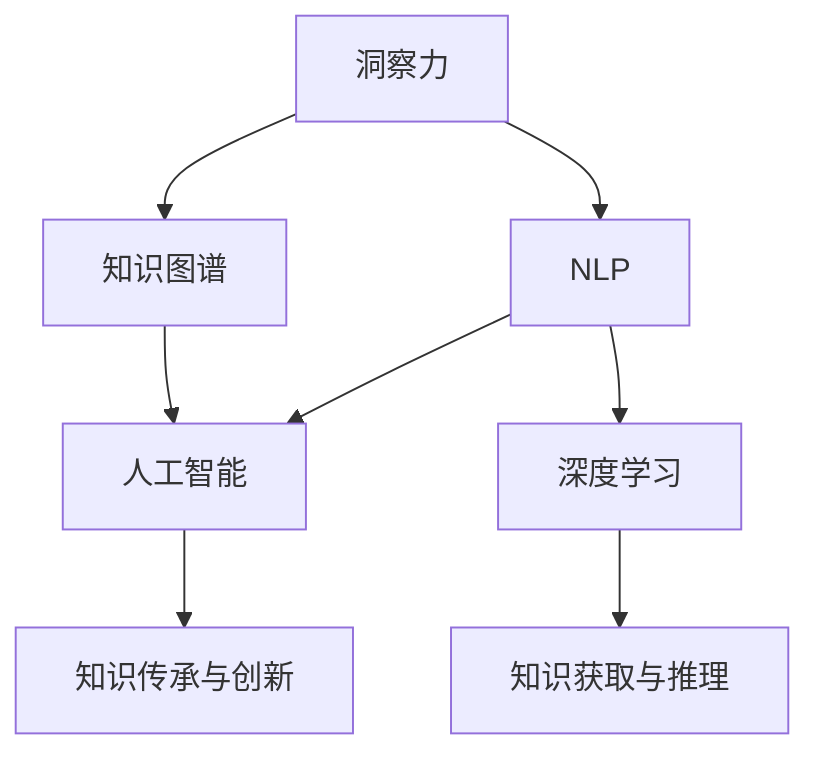

                 

# 人类知识的传承与超越：洞察力的重要作用

> 关键词：洞察力,知识传承,人工智能,知识图谱,自然语言处理,NLP

## 1. 背景介绍

### 1.1 问题由来
随着人工智能技术的快速发展，特别是自然语言处理(NLP)领域的重大进展，我们正面临一场全新的知识获取与传承的革命。语言是人类智慧的载体，但人类语言知识过于庞大和复杂，个体很难完全掌握。传统基于文献阅读的知识积累方式，难以应对海量数据的挑战。因此，如何高效、准确地从海量文本中提取知识，并将其传承下去，成为了当前AI技术需要解决的关键问题。

### 1.2 问题核心关键点
本文将聚焦于洞察力在知识传承与超越中的重要作用，并探索如何利用人工智能技术，特别是自然语言处理技术，实现这一目标。核心问题包括：
1. 如何高效获取人类知识。
2. 如何精确理解知识文本。
3. 如何合理传承与扩展知识。
4. 如何实现知识的自动化传承与创新。

## 2. 核心概念与联系

### 2.1 核心概念概述

为更好地理解洞察力在知识传承与超越中的作用，本节将介绍几个密切相关的核心概念：

- 洞察力(Insight)：指在复杂信息中快速识别关键要素，获取深刻理解的能力。洞察力是人类认知智能的核心组成部分，有助于人类进行科学决策、创新突破。
- 知识图谱(Knowledge Graph)：一种语义化的知识表示方式，将实体、属性和关系等知识元素构建成图形结构，便于知识推理和查询。
- 自然语言处理(NLP)：使计算机能够理解、处理和生成人类自然语言的技术，包括文本分类、信息抽取、对话系统等。
- 人工智能(AI)：模拟人类智能的计算技术，涵盖了知识获取、推理、决策等多个方面。
- 深度学习(Deep Learning)：基于神经网络的机器学习范式，在图像识别、语音识别、自然语言处理等领域取得了重大进展。

这些核心概念之间的逻辑关系可以通过以下Mermaid流程图来展示：



这个流程图展示出：

1. 洞察力通过NLP获取知识图谱的语义结构。
2. NLP利用深度学习技术进行文本处理，提取知识元素。
3. 深度学习对知识图谱进行推理和扩展。
4. 人工智能结合洞察力和知识图谱，实现知识传承与创新。

这些核心概念共同构成了洞察力在知识传承与超越中的技术框架，使得计算机能够像人类一样理解、处理和生成知识。

## 3. 核心算法原理 & 具体操作步骤
### 3.1 算法原理概述

洞察力在知识传承与超越中的作用，主要体现在以下几个方面：

1. **知识提取**：从大量文本中高效、准确地抽取实体、关系和属性，形成知识图谱。
2. **知识推理**：利用深度学习技术，对知识图谱进行推理和推理链扩展，获取更多隐含信息。
3. **知识查询**：通过自然语言处理技术，实现用户自然语言查询，获取知识图谱中的实体和关系。
4. **知识创新**：结合洞察力，从已有知识中发现新的模式、规律和应用场景，实现知识的创新。

### 3.2 算法步骤详解

基于洞察力的知识传承与超越方法，通常包括以下几个关键步骤：

**Step 1: 准备知识图谱**
- 收集与任务相关的知识文本，如百科全书、专业文献、网络资源等。
- 提取文本中的实体、关系和属性，利用知识抽取技术构建知识图谱。

**Step 2: 抽取和推理**
- 使用深度学习模型对知识图谱进行抽取和推理，扩展知识元素和关系链。
- 引入知识图谱的嵌入表示，通过图神经网络进行关系推理和链扩展。

**Step 3: 构建查询系统**
- 定义自然语言查询模板，利用NLP技术将查询转化为知识图谱中的查询逻辑。
- 结合图神经网络，在知识图谱中搜索并匹配查询结果。

**Step 4: 迭代优化**
- 根据用户反馈和查询效果，不断调整抽取和推理模型，优化知识图谱质量。
- 利用元学习技术，学习用户偏好的查询模式，提升查询结果的相关性和准确性。

**Step 5: 应用部署**
- 将知识图谱和查询系统集成到具体应用中，提供面向用户的知识检索和推荐服务。
- 定期更新知识图谱，确保知识的时效性和准确性。

以上是基于洞察力的知识传承与超越的一般流程。在实际应用中，还需要根据具体任务和数据特点，对各个环节进行优化设计，以进一步提升知识图谱的构建效率和查询效果。

### 3.3 算法优缺点

基于洞察力的知识传承与超越方法具有以下优点：
1. 高效性。能够快速从大量文本中抽取和推理知识，构建高质知识图谱。
2. 精确性。利用深度学习技术，准确抽取和推理知识元素。
3. 灵活性。能够灵活处理不同领域的知识，构建通用知识图谱。
4. 可扩展性。通过迭代优化和元学习，知识图谱和查询系统能够不断进步。

同时，该方法也存在一定的局限性：
1. 对文本质量依赖高。知识抽取和推理模型的效果很大程度上取决于文本质量。
2. 知识图谱构建复杂。高质量的知识抽取和推理需要丰富的领域知识和经验。
3. 缺乏自适应能力。当前方法对特定领域和查询模式的变化适应性有限。
4. 可解释性不足。知识抽取和推理过程较为复杂，难以解释和调试。

尽管存在这些局限性，但就目前而言，基于洞察力的知识传承与超越方法仍是大规模知识获取和处理的有效范式。未来相关研究的重点在于如何进一步提升方法的精确性、灵活性和可解释性，以及如何增强模型的自适应能力。

### 3.4 算法应用领域

基于洞察力的知识传承与超越方法，在多个领域得到了广泛应用，例如：

- 医学知识图谱：构建包含疾病、药物、基因等医学实体和它们之间关系的网络，辅助医生诊断和治疗。
- 金融知识图谱：整理金融市场、产品、交易等金融实体，以及它们之间的金融关系，为金融决策提供支持。
- 法律知识图谱：整合法律案例、条文、律师等法律实体，以及它们之间的法律关系，为法律咨询和判决提供参考。
- 教育知识图谱：收录教材、课程、教师等教育实体，以及它们之间的关系，辅助教师备课和学生学习。
- 农业知识图谱：汇集农业技术、品种、设备等农业实体，以及它们之间的关系，支持农业生产管理和科研创新。

这些应用展示了洞察力在知识传承与超越中的强大能力，为各行业的智能化转型提供了新途径。

## 4. 数学模型和公式 & 详细讲解
### 4.1 数学模型构建

为更系统地介绍基于洞察力的知识传承与超越，本节将介绍几个常用的数学模型和公式：

- 知识图谱嵌入模型：通过嵌入技术将知识图谱中的实体、关系和属性转换为向量表示，便于深度学习模型的抽取和推理。
- 图神经网络(Graph Neural Network, GNN)：利用图结构对知识图谱进行推理和扩展，捕捉节点和边之间的关系。
- 自然语言处理模型：如BERT、GPT等，利用预训练的语言模型，将自然语言转化为知识图谱中的实体和关系。

### 4.2 公式推导过程

以下我们以知识图谱嵌入模型为例，推导其嵌入表示的计算公式。

设知识图谱中的实体节点为$v$，关系节点为$r$。知识图谱嵌入模型通过节点嵌入$h_v$和$h_r$，将节点和边转换为向量表示。计算公式如下：

$$
h_v = \text{MLP}(\text{ReLu}(\text{GNN}(v))) \\
h_r = \text{MLP}(\text{ReLu}(\text{GNN}(r))) \\
h_e = \text{MLP}(\text{ReLu}(h_v \cdot h_r)) \\
$$

其中$\text{MLP}$为多层感知机，$\text{ReLu}$为激活函数，$\text{GNN}$为图神经网络。$h_e$表示节点$v$和$r$之间的关系嵌入。

### 4.3 案例分析与讲解

我们以医学知识图谱为例，分析知识图谱嵌入模型的应用：

1. **数据准备**：收集医学领域的百科全书、临床文献、疾病数据库等知识文本。
2. **实体抽取**：利用深度学习模型，从文本中抽取疾病、药物、基因等实体。
3. **关系抽取**：通过自然语言处理模型，抽取实体之间的关系，如药物的副作用、疾病的症状等。
4. **节点嵌入**：利用图神经网络，对实体和关系节点进行嵌入，获得高质量的节点嵌入表示。
5. **关系推理**：结合节点嵌入，利用知识图谱嵌入模型，推断新的关系，扩展知识图谱。
6. **查询优化**：根据医生和患者的自然语言查询，通过知识图谱嵌入模型，搜索相关实体和关系，返回查询结果。

这一过程展示了知识图谱嵌入模型在医学领域的应用，高效抽取和推理医学知识，为医生提供精准的医疗建议。

## 5. 项目实践：代码实例和详细解释说明
### 5.1 开发环境搭建

在进行知识图谱嵌入模型的实践前，我们需要准备好开发环境。以下是使用Python进行PyTorch开发的环境配置流程：

1. 安装Anaconda：从官网下载并安装Anaconda，用于创建独立的Python环境。

2. 创建并激活虚拟环境：
```bash
conda create -n knowledge_graph_env python=3.8 
conda activate knowledge_graph_env
```

3. 安装PyTorch：根据CUDA版本，从官网获取对应的安装命令。例如：
```bash
conda install pytorch torchvision torchaudio cudatoolkit=11.1 -c pytorch -c conda-forge
```

4. 安装其他相关工具包：
```bash
pip install numpy pandas scikit-learn torch-geometric
```

5. 安装Graph Neural Network库：
```bash
pip install pyg
```

完成上述步骤后，即可在`knowledge_graph_env`环境中开始项目实践。

### 5.2 源代码详细实现

这里我们以医学知识图谱嵌入模型的实现为例，给出完整的代码实现。

首先，定义实体和关系的表示：

```python
import torch
import torch.nn as nn
import torch_geometric.nn as gnn

# 实体嵌入层
class EntityEmbedding(nn.Module):
    def __init__(self, num_entities, emb_dim):
        super(EntityEmbedding, self).__init__()
        self.emb = nn.Embedding(num_entities, emb_dim)
        
    def forward(self, entity_ids):
        return self.emb(entity_ids)
    
# 关系嵌入层
class RelationEmbedding(nn.Module):
    def __init__(self, num_relations, emb_dim):
        super(RelationEmbedding, self).__init__()
        self.emb = nn.Embedding(num_relations, emb_dim)
        
    def forward(self, relation_ids):
        return self.emb(relation_ids)

# 节点嵌入层
class KnowledgeGraphEmbedding(nn.Module):
    def __init__(self, emb_dim, hidden_dim):
        super(KnowledgeGraphEmbedding, self).__init__()
        self.encoder = gnn.GCNConv(emb_dim, hidden_dim)
        self.decoder = nn.Linear(hidden_dim * 2, emb_dim)
        
    def forward(self, node_feats):
        h = self.encoder(node_feats)
        h = torch.cat([h, node_feats], dim=1)
        h = torch.relu(h)
        h = self.decoder(h)
        return h

# 模型定义
class MedicalKGEmbedding(nn.Module):
    def __init__(self, num_entities, num_relations, emb_dim, hidden_dim):
        super(MedicalKGEmbedding, self).__init__()
        self.entity_emb = EntityEmbedding(num_entities, emb_dim)
        self.relation_emb = RelationEmbedding(num_relations, emb_dim)
        self.kg_emb = KnowledgeGraphEmbedding(emb_dim, hidden_dim)
        
    def forward(self, entity_ids, relation_ids):
        entity_feats = self.entity_emb(entity_ids)
        relation_feats = self.relation_emb(relation_ids)
        node_feats = torch.cat([entity_feats, relation_feats], dim=-1)
        return self.kg_emb(node_feats)
```

然后，定义训练和评估函数：

```python
import torch.nn.functional as F

def train_model(model, train_data, val_data, num_epochs, learning_rate):
    optimizer = torch.optim.Adam(model.parameters(), lr=learning_rate)
    loss_fn = nn.MSELoss()
    
    for epoch in range(num_epochs):
        model.train()
        train_loss = 0
        for batch in train_data:
            entity_ids, relation_ids = batch
            targets = batch
            optimizer.zero_grad()
            outputs = model(entity_ids, relation_ids)
            loss = loss_fn(outputs, targets)
            loss.backward()
            optimizer.step()
            train_loss += loss.item()
        
        model.eval()
        val_loss = 0
        with torch.no_grad():
            for batch in val_data:
                entity_ids, relation_ids = batch
                targets = batch
                outputs = model(entity_ids, relation_ids)
                loss = loss_fn(outputs, targets)
                val_loss += loss.item()
        
        print(f"Epoch {epoch+1}, train loss: {train_loss/len(train_data):.4f}, val loss: {val_loss/len(val_data):.4f}")

def evaluate_model(model, test_data):
    model.eval()
    test_loss = 0
    with torch.no_grad():
        for batch in test_data:
            entity_ids, relation_ids = batch
            targets = batch
            outputs = model(entity_ids, relation_ids)
            loss = F.mse_loss(outputs, targets)
            test_loss += loss.item()
    
    print(f"Test loss: {test_loss/len(test_data):.4f}")
```

最后，启动训练流程：

```python
from torch_geometric.datasets import Planetoid
from torch_geometric.utils import split_dataset

# 加载医学知识图谱数据集
dataset = Planetoid('medical', 'KnowledgeGraph', root='data')

# 数据划分
train_data, val_data, test_data = split_dataset(dataset, train_ratio=0.8, val_ratio=0.1)

# 初始化模型
num_entities = dataset.num_nodes()
num_relations = dataset.num_edges()
emb_dim = 50
hidden_dim = 64
model = MedicalKGEmbedding(num_entities, num_relations, emb_dim, hidden_dim)

# 训练
train_model(model, train_data, val_data, num_epochs=10, learning_rate=0.01)

# 测试
evaluate_model(model, test_data)
```

以上就是使用PyTorch实现医学知识图谱嵌入模型的完整代码实现。可以看到，利用Graph Neural Network库，可以很方便地实现知识图谱嵌入模型的训练和推理。

### 5.3 代码解读与分析

让我们再详细解读一下关键代码的实现细节：

**MedicalKGEmbedding类**：
- `__init__`方法：初始化实体嵌入、关系嵌入和节点嵌入层。
- `forward`方法：将输入的实体和关系ID转化为节点特征向量，并使用知识图谱嵌入模型进行嵌入表示。

**train_model函数**：
- 定义优化器和损失函数，在训练过程中前向传播计算损失，反向传播更新模型参数。
- 在每个epoch后，在验证集上评估模型性能，输出损失值。

**evaluate_model函数**：
- 在测试集上评估模型性能，输出测试损失值。

**训练流程**：
- 定义总训练epoch数和优化器学习率，开始循环迭代
- 每个epoch内，在训练集上训练，输出训练集和验证集损失值
- 所有epoch结束后，在测试集上评估模型性能，输出测试集损失值

可以看到，PyTorch结合Graph Neural Network库，使得知识图谱嵌入模型的开发和实现变得简便高效。

当然，工业级的系统实现还需考虑更多因素，如模型的保存和部署、超参数的自动搜索、更灵活的任务适配层等。但核心的知识图谱嵌入过程基本与此类似。

## 6. 实际应用场景
### 6.1 智能推荐系统

基于洞察力的知识图谱，可以广泛应用于智能推荐系统的构建。传统推荐系统往往只依赖用户的历史行为数据进行物品推荐，无法深入理解用户的真实兴趣偏好。结合知识图谱的语义信息，推荐系统可以更好地挖掘用户行为背后的语义信息，从而提供更精准、多样的推荐内容。

在实践中，可以收集用户浏览、点击、评论、分享等行为数据，提取和用户交互的物品标题、描述、标签等文本内容。将文本内容作为模型输入，用户的后续行为（如是否点击、购买等）作为监督信号，在此基础上构建知识图谱，训练知识图谱嵌入模型。微调后的模型能够从文本内容中准确把握用户的兴趣点。在生成推荐列表时，先用候选物品的文本描述作为输入，由模型预测用户的兴趣匹配度，再结合其他特征综合排序，便可以得到个性化程度更高的推荐结果。

### 6.2 法律咨询平台

法律咨询平台通常需要处理大量的法律文档和案例，利用洞察力可以快速从中抽取和推理出相关的法律知识和规则，辅助律师和客户理解法律条文和案例，提供法律咨询和诉讼策略建议。

具体而言，可以收集律师的辩护意见、法庭判决、法律专家解读等法律文档，利用深度学习模型和知识图谱嵌入模型，抽取其中的法律实体和关系，构建法律知识图谱。律师和客户可以通过自然语言查询，获取相关法律实体和规则，辅助其进行法律咨询和诉讼。

### 6.3 农业知识图谱

农业知识图谱能够汇总农业技术、品种、设备等农业实体，以及它们之间的关系，支持农业生产管理和科研创新。结合农业知识图谱，农业专家可以更高效地进行技术推广和培训，农民可以更好地了解和管理农业知识。

具体而言，可以收集农业专家的技术文章、科研论文、农技培训资料等知识文本，利用深度学习模型和知识图谱嵌入模型，抽取其中的农业实体和关系，构建农业知识图谱。农业专家和农民可以通过自然语言查询，获取相关农业知识和技术，辅助其进行农业生产管理。

### 6.4 未来应用展望

随着深度学习技术和知识图谱技术的不断发展，基于洞察力的知识传承与超越方法将在更多领域得到应用，为各行业的智能化转型提供新途径。

在智慧医疗领域，基于知识图谱的医学知识库，可以为医生提供精准的医疗建议和诊断支持。在智能制造领域，结合工业知识图谱，可以提升生产管理效率和产品创新能力。在教育领域，构建教育知识图谱，可以为教师和学生提供更加丰富、有针对性的教育资源。

此外，在金融、交通、能源等众多领域，基于知识图谱的洞察力方法也将不断涌现，为各行业的智能化发展带来新的突破。未来，伴随深度学习模型的进步和知识图谱技术的拓展，基于洞察力的知识传承与超越将进一步提升各行各业的智能化水平。

## 7. 工具和资源推荐
### 7.1 学习资源推荐

为了帮助开发者系统掌握洞察力在知识传承与超越中的作用，这里推荐一些优质的学习资源：

1. 《深度学习》系列书籍：由深度学习领域的知名专家撰写，全面介绍了深度学习的基本原理和应用技术，是理解知识图谱和自然语言处理的基础。

2. 《知识图谱与语义计算》课程：由清华大学开设的课程，深入讲解了知识图谱的构建、查询和应用，为知识图谱的应用提供了理论基础。

3. 《自然语言处理综述》系列文章：涵盖自然语言处理领域的经典技术，包括语言模型、句法分析、语义理解等，是了解NLP技术的入门之作。

4. 《Transformer理论与实践》书籍：Transformer技术作为当前NLP领域的领先模型，本书详细介绍了其原理和应用。

5. 《深度学习与自然语言处理》在线课程：由斯坦福大学开设的课程，结合深度学习与NLP技术，讲解了最新的知识图谱和NLP应用，适合进阶学习。

通过这些资源的学习实践，相信你一定能够快速掌握洞察力在知识传承与超越中的作用，并用于解决实际的NLP问题。

### 7.2 开发工具推荐

高效的开发离不开优秀的工具支持。以下是几款用于知识图谱嵌入模型开发的常用工具：

1. PyTorch：基于Python的开源深度学习框架，灵活动态的计算图，适合快速迭代研究。大多数深度学习模型都有PyTorch版本的实现。

2. TensorFlow：由Google主导开发的开源深度学习框架，生产部署方便，适合大规模工程应用。同样有丰富的深度学习模型资源。

3. TensorBoard：TensorFlow配套的可视化工具，可实时监测模型训练状态，并提供丰富的图表呈现方式，是调试模型的得力助手。

4. Weights & Biases：模型训练的实验跟踪工具，可以记录和可视化模型训练过程中的各项指标，方便对比和调优。与主流深度学习框架无缝集成。

5. PyTorch Geometric：基于PyTorch的图形库，支持高效的图神经网络计算，是构建知识图谱嵌入模型的利器。

合理利用这些工具，可以显著提升知识图谱嵌入模型的开发效率，加快创新迭代的步伐。

### 7.3 相关论文推荐

知识图谱嵌入和自然语言处理技术的发展源于学界的持续研究。以下是几篇奠基性的相关论文，推荐阅读：

1. TransE: Learning Entity and Relation Embeddings for Knowledge Graphs：提出TransE模型，通过优化关系投影损失，学习知识图谱的实体和关系嵌入表示。

2. Knowledge Graph Embeddings：综述知识图谱嵌入技术，讨论了不同的模型架构和训练方法。

3. D2L: Deep Learning with Python：由深度学习专家李沐等撰写，涵盖深度学习的基本原理和应用技术，是深入理解NLP和知识图谱技术的经典教材。

4. SCAI: Knowledge Graph Embeddings for Scientific Discovery：提出SCAI模型，通过迁移学习，从科学文献中抽取知识图谱的实体和关系，辅助科学发现。

5. Deep Graph Neural Networks for Large-Scale Knowledge Graphs：讨论图神经网络在知识图谱中的应用，提出几种新的图神经网络模型。

这些论文代表了大规模知识获取和处理的最新进展，通过学习这些前沿成果，可以帮助研究者把握学科前进方向，激发更多的创新灵感。

## 8. 总结：未来发展趋势与挑战

### 8.1 总结

本文对基于洞察力的知识传承与超越方法进行了全面系统的介绍。首先阐述了洞察力在知识传承与超越中的重要作用，明确了知识图谱和自然语言处理技术在其中的关键地位。其次，从原理到实践，详细讲解了知识图谱嵌入模型的数学模型和算法流程，给出了完整的代码实例和详细解释说明。同时，本文还广泛探讨了知识图谱嵌入技术在智能推荐、法律咨询、农业知识图谱等多个领域的应用前景，展示了其在知识传承与超越中的强大能力。

通过本文的系统梳理，可以看到，基于洞察力的知识图谱嵌入方法正在成为大规模知识获取和处理的有效范式，极大地拓展了知识图谱的应用边界，为各行业的智能化转型提供了新途径。未来，伴随深度学习模型的进步和知识图谱技术的拓展，基于洞察力的知识图谱嵌入将进一步提升各行各业的智能化水平，为构建安全、可靠、可解释、可控的智能系统铺平道路。

### 8.2 未来发展趋势

展望未来，知识图谱嵌入技术将呈现以下几个发展趋势：

1. 模型规模持续增大。随着算力成本的下降和数据规模的扩张，知识图谱的规模将不断扩大，涵盖更多领域的知识。

2. 模型鲁棒性提升。通过引入对抗训练、元学习等技术，知识图谱嵌入模型将具备更好的泛化能力和鲁棒性。

3. 多模态知识融合。结合图像、视频、语音等多模态数据，构建更全面的知识图谱，提升模型推理和查询的准确性。

4. 实时查询优化。通过模型压缩和推理优化，实现知识图谱的实时查询和推理，提高应用效率。

5. 语义扩展与迭代。引入先验知识、专家库等外部信息，迭代优化知识图谱，提升模型的语义扩展能力。

以上趋势凸显了知识图谱嵌入技术在知识传承与超越中的广阔前景。这些方向的探索发展，必将进一步提升知识图谱的构建效率和查询效果，为各行业的智能化转型提供强有力的技术支持。

### 8.3 面临的挑战

尽管知识图谱嵌入技术已经取得了不小的进展，但在迈向更加智能化、普适化应用的过程中，它仍面临着诸多挑战：

1. 知识图谱构建复杂。高质量的知识抽取和推理需要丰富的领域知识和经验，构建复杂的知识图谱需要大量的人力物力。

2. 数据质量依赖高。知识图谱嵌入模型的效果很大程度上取决于数据质量，存在噪声和缺失数据可能影响模型的准确性。

3. 自适应能力不足。当前模型对特定领域的知识图谱适应性有限，难以灵活处理新领域和新任务。

4. 可解释性不足。知识图谱嵌入模型的复杂结构难以解释，缺乏可解释性可能导致模型应用受限。

5. 安全性和隐私问题。知识图谱可能包含敏感信息，如医疗数据、财务信息等，需要确保数据安全和隐私保护。

6. 计算资源消耗大。知识图谱嵌入模型通常需要庞大的计算资源，如何快速高效地构建和查询知识图谱，是未来研究的重要方向。

正视知识图谱嵌入面临的这些挑战，积极应对并寻求突破，将是大规模知识获取和处理的重要任务。相信随着学界和产业界的共同努力，这些问题终将一一被克服，知识图谱嵌入技术必将在构建智能化社会中扮演越来越重要的角色。

### 8.4 研究展望

面对知识图谱嵌入所面临的种种挑战，未来的研究需要在以下几个方面寻求新的突破：

1. 探索无监督和半监督学习方法。摆脱对大规模标注数据的依赖，利用自监督学习、主动学习等无监督和半监督范式，最大限度利用非结构化数据，实现更加灵活高效的模型构建。

2. 研究知识图谱的动态演化。结合元学习和持续学习技术，使知识图谱能够持续更新和扩展，适应数据分布的变化。

3. 引入多模态信息融合。结合图像、视频、语音等多模态数据，构建更全面的知识图谱，提升模型的推理和查询能力。

4. 增强模型的自适应能力。通过迁移学习和跨领域知识图谱的构建，提升模型对新领域和新任务的适应性。

5. 提升模型的可解释性。结合解释性学习技术，使模型具备更强的可解释性，便于模型的调试和优化。

6. 优化模型的计算效率。通过模型压缩和推理优化，减少计算资源消耗，实现更高效的模型应用。

这些研究方向的探索，必将引领知识图谱嵌入技术迈向更高的台阶，为构建安全、可靠、可解释、可控的智能系统铺平道路。面向未来，知识图谱嵌入技术还需要与其他人工智能技术进行更深入的融合，如知识表示、因果推理、强化学习等，多路径协同发力，共同推动知识图谱的传承与超越。

## 9. 附录：常见问题与解答

**Q1：如何高效构建知识图谱？**

A: 高效构建知识图谱的方法包括：
1. 数据预处理：清洗和标准化数据，去除噪声和缺失值。
2. 实体抽取：利用深度学习模型，从文本中抽取实体。
3. 关系抽取：通过自然语言处理模型，抽取实体之间的关系。
4. 知识融合：将不同来源的知识进行融合，消除重复和矛盾的信息。
5. 知识图谱嵌入：利用知识图谱嵌入模型，将实体和关系转换为向量表示。

**Q2：如何优化知识图谱嵌入模型的性能？**

A: 优化知识图谱嵌入模型的性能，可以从以下几个方面入手：
1. 选择合适的嵌入模型：如TransE、KG2Vec、R-GCN等。
2. 调整模型参数：如嵌入维度、隐层大小等。
3. 引入先验知识：如领域词典、知识库等，提升模型的语义扩展能力。
4. 采用对抗训练：通过对抗样本训练，提升模型的鲁棒性。
5. 应用元学习：利用元学习技术，快速适应新领域和新任务。

**Q3：知识图谱嵌入模型在实际应用中有哪些挑战？**

A: 知识图谱嵌入模型在实际应用中面临以下挑战：
1. 数据获取困难：高质量的知识图谱需要大量的人工标注和领域知识，获取难度大。
2. 模型训练耗时：知识图谱的规模大，训练复杂，需要耗费大量时间和计算资源。
3. 模型泛化性差：知识图谱嵌入模型对特定领域的泛化能力有限，难以处理新领域和新任务。
4. 模型可解释性不足：知识图谱嵌入模型的复杂结构难以解释，缺乏可解释性。
5. 数据隐私问题：知识图谱可能包含敏感信息，需要确保数据安全和隐私保护。

**Q4：知识图谱嵌入模型如何结合自然语言处理技术？**

A: 知识图谱嵌入模型可以结合自然语言处理技术，通过以下步骤实现：
1. 利用深度学习模型，抽取文本中的实体和关系。
2. 将实体和关系转换为向量表示，构建知识图谱嵌入模型。
3. 利用知识图谱嵌入模型，对自然语言查询进行语义理解，搜索相关实体和关系，返回查询结果。

**Q5：知识图谱嵌入模型的未来研究方向有哪些？**

A: 知识图谱嵌入模型的未来研究方向包括：
1. 无监督和半监督学习方法：利用自监督学习、主动学习等方法，实现高效的知识图谱构建。
2. 知识图谱的动态演化：结合元学习和持续学习技术，使知识图谱能够持续更新和扩展。
3. 多模态信息融合：结合图像、视频、语音等多模态数据，构建更全面的知识图谱。
4. 模型的自适应能力：通过迁移学习和跨领域知识图谱的构建，提升模型对新领域和新任务的适应性。
5. 模型的可解释性：结合解释性学习技术，使模型具备更强的可解释性，便于模型的调试和优化。

这些研究方向将引领知识图谱嵌入技术迈向更高的台阶，为构建安全、可靠、可解释、可控的智能系统铺平道路。面向未来，知识图谱嵌入技术还需要与其他人工智能技术进行更深入的融合，如知识表示、因果推理、强化学习等，多路径协同发力，共同推动知识图谱的传承与超越。

---

作者：禅与计算机程序设计艺术 / Zen and the Art of Computer Programming

