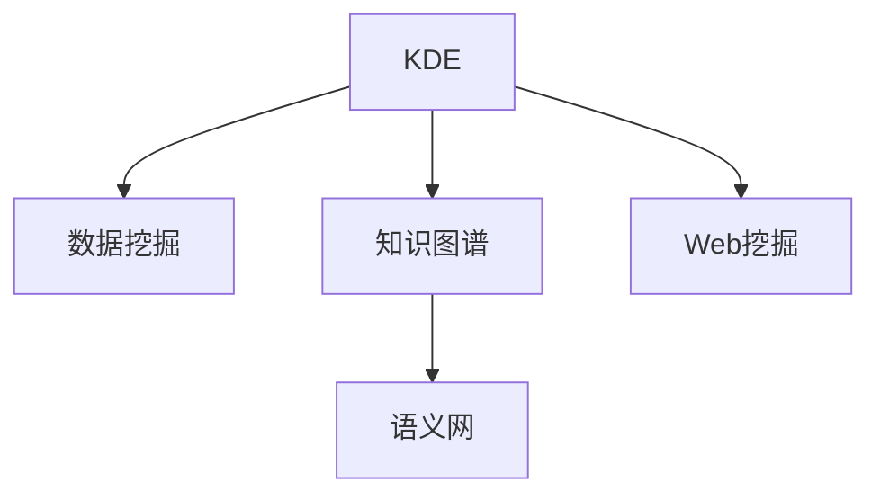

                 

## 1. 背景介绍

### 1.1 问题由来

在信息化飞速发展的今天，人类知识的积累速度远远超出了以往任何一个时代。从互联网到社交媒体，从大数据到人工智能，各种新兴技术的涌现让知识的获取、共享和利用变得更加便捷高效。然而，海量知识虽然触手可及，但如何从中提取有价值的信息，如何构建起知识的网络，如何促进知识的共享，依然是摆在每一个研究者和工程师面前的巨大挑战。

知识发现引擎（Knowledge Discovery Engine, KDE）作为将数据转化为知识的工具，能够从海量数据中自动发现隐含的、未知的、潜在的知识和规律，广泛应用于科学研究、商业智能、决策支持等领域。而基于这些发现的知识，进一步通过合理的管理和共享机制，能够让更多人受益，实现知识的共享和利用。

### 1.2 问题核心关键点

知识发现引擎的核心问题在于如何从大规模、多源、异构的数据中高效地发现、整理和共享知识。核心关键点包括：

1. **数据预处理**：如何处理数据的不确定性、不一致性、冗余性等问题，提高数据质量。
2. **知识提取**：如何从数据中挖掘出有价值的信息，构建知识图谱，实现知识表示和表示学习。
3. **知识融合**：如何将不同源的知识进行整合，形成统一的视角和理解，增强知识的全面性和准确性。
4. **知识管理**：如何存储、检索和管理知识，使得知识易于访问和利用。
5. **知识共享**：如何通过合理的机制促进知识共享和传播，实现知识的社会价值。

这些核心问题构成了一个完整的知识发现和共享体系，是实现知识共享时代的关键。

### 1.3 问题研究意义

知识发现引擎的研究对于构建知识共享社会具有深远的意义：

1. **促进知识创新**：通过知识发现引擎，可以快速获取前沿科技、最新研究成果等，促进科学创新和知识传播。
2. **提升决策效率**：在商业、医疗、教育等领域，决策者可以通过知识发现引擎获取数据支持和洞察，提升决策质量。
3. **增强协作能力**：知识发现引擎可以为团队提供共享的知识基础，增强协作效率和效果。
4. **支持可持续发展**：在环境保护、社会治理等领域，知识发现引擎可以帮助发现可持续发展的策略和路径。
5. **推动社会进步**：通过知识共享，可以实现知识的普惠，推动社会整体的进步和发展。

## 2. 核心概念与联系

### 2.1 核心概念概述

为更好地理解知识发现引擎的工作原理和应用场景，本节将介绍几个密切相关的核心概念：

1. **知识发现引擎（Knowledge Discovery Engine, KDE）**：自动从数据中挖掘出有价值的信息和知识，并形成可供利用的知识库的工具。
2. **数据挖掘（Data Mining）**：从大规模数据集中挖掘出有意义的知识和模式，用于指导决策、优化策略等。
3. **知识图谱（Knowledge Graph）**：使用图结构表示知识的一种方式，能够清晰地表达实体间的关系和属性。
4. **语义网（Semantic Web）**：通过语义描述和链接，实现知识在网络中的精准传递和自动推理。
5. **Web挖掘（Web Mining）**：从Web页面、Web日志等网络数据中提取信息，用于支持科学研究、市场营销等。

这些概念之间的逻辑关系可以通过以下Mermaid流程图来展示：



这个流程图展示了一些核心概念及其之间的关系：

1. KDE通过数据挖掘技术，从数据中发现知识。
2. 知识以图谱的形式进行表示，并通过语义网进行精准传递。
3. Web挖掘则是KDE在网络数据上的一个具体应用。

这些概念共同构成了知识共享的基础框架，使得KDE能够在大规模数据中高效地发现和传递知识。

## 3. 核心算法原理 & 具体操作步骤
### 3.1 算法原理概述

知识发现引擎的核心算法原理是数据挖掘和知识表示。数据挖掘通过机器学习和统计方法，从数据中挖掘出模式、规律和关联；而知识表示则是将挖掘出的知识以图谱、向量等形式进行结构化，便于存储和利用。

具体而言，知识发现引擎的一般流程包括：

1. **数据预处理**：清洗数据，处理缺失值、噪声、冗余等问题，提高数据质量。
2. **特征工程**：提取和构建数据特征，为模型训练做准备。
3. **模型训练**：选择合适的模型进行训练，如分类、聚类、关联规则等。
4. **知识表示**：将模型输出的知识进行编码，构建知识图谱或向量空间。
5. **知识管理**：通过索引、搜索等技术，实现知识的存储和检索。
6. **知识共享**：通过API、数据库等形式，实现知识的社会化传播。

### 3.2 算法步骤详解

#### 3.2.1 数据预处理

数据预处理是知识发现的前提，其主要目的是提高数据质量，使其更适于进一步的挖掘和分析。数据预处理包括数据清洗、特征提取、数据转换等步骤。

1. **数据清洗**：去除重复数据、处理缺失值、处理异常值等。
2. **特征提取**：选择和构造对任务有帮助的特征。
3. **数据转换**：将原始数据转换为适合挖掘的格式，如进行归一化、标准化等。

#### 3.2.2 特征工程

特征工程是数据挖掘中的重要环节，其目的是提取和构造对任务有帮助的特征，提高模型的准确性和泛化能力。

1. **特征选择**：选择对目标变量有较强预测能力的特征。
2. **特征构建**：通过计算、组合等方式构造新的特征。
3. **特征变换**：对特征进行缩放、离散化等处理，提高模型效果。

#### 3.2.3 模型训练

模型训练是知识发现的中心环节，其主要目的是通过训练模型，从数据中挖掘出有价值的模式和规律。常用的模型包括决策树、随机森林、支持向量机、神经网络等。

1. **选择合适的模型**：根据任务特点和数据特性选择合适的模型。
2. **模型训练**：使用训练数据对模型进行训练，优化模型参数。
3. **模型评估**：使用验证集或测试集评估模型效果，选择合适的模型进行进一步优化。

#### 3.2.4 知识表示

知识表示是将模型输出的知识进行结构化编码的过程，常见的知识表示方法包括知识图谱和向量空间模型。

1. **知识图谱**：使用图结构表示实体和关系，便于理解和推理。
2. **向量空间模型**：将知识编码为向量，便于存储和检索。

#### 3.2.5 知识管理

知识管理是将挖掘出的知识进行存储、检索和利用的过程，常见的知识管理方法包括数据库、搜索引擎等。

1. **知识存储**：使用数据库、知识图谱等形式存储知识。
2. **知识检索**：通过搜索、索引等技术实现知识的快速访问。
3. **知识利用**：将知识应用于决策、推荐等场景。

#### 3.2.6 知识共享

知识共享是将知识通过API、数据库等形式进行传播的过程，常见的知识共享方法包括API、知识图谱等。

1. **API接口**：通过开放API，使得外部系统能够访问和利用知识。
2. **知识图谱**：通过语义网技术，实现知识的精准传递和自动推理。

### 3.3 算法优缺点

知识发现引擎的优点包括：

1. **自动性高**：能够自动从大规模数据中挖掘知识，减少人工干预。
2. **泛化能力强**：能够在多源、异构数据中发现普遍的知识规律。
3. **应用广泛**：适用于科学研究、商业智能、决策支持等多个领域。

知识发现引擎的缺点包括：

1. **数据质量要求高**：对数据的质量要求较高，需要处理数据的不确定性、不一致性等问题。
2. **模型选择困难**：不同任务可能需要不同的模型，选择不当可能影响效果。
3. **知识表示复杂**：知识表示技术复杂，需要选择合适的编码方法。
4. **资源消耗大**：在大规模数据上运行，需要较高的计算资源。

尽管存在这些局限性，但就目前而言，知识发现引擎仍然是知识挖掘和共享的重要工具，广泛应用于科学研究、商业决策等领域。未来相关研究将聚焦于提高算法效率、增强知识表示能力、优化知识共享机制等方面。

### 3.4 算法应用领域

知识发现引擎在多个领域都得到了广泛的应用，具体包括：

1. **科学研究**：通过挖掘科学数据，发现新知识，推动科学创新。
2. **商业智能**：通过挖掘商业数据，发现市场趋势，优化商业决策。
3. **医疗健康**：通过挖掘医疗数据，发现疾病规律，提高诊疗效果。
4. **金融风控**：通过挖掘金融数据，发现风险因素，提高风险控制能力。
5. **教育领域**：通过挖掘教育数据，发现学习规律，提高教育效果。
6. **环境治理**：通过挖掘环境数据，发现污染源，推动环境治理。

这些领域的应用展示了知识发现引擎的强大潜力和广泛适用性，为其未来的发展提供了坚实的基础。

## 4. 数学模型和公式 & 详细讲解 & 举例说明
### 4.1 数学模型构建

知识发现引擎的数学模型主要涉及数据预处理、特征工程、模型训练等环节，下面我们以一个简单的分类任务为例，来介绍其数学模型构建过程。

设训练数据集为 $D=\{(x_i, y_i)\}_{i=1}^N$，其中 $x_i$ 为输入特征，$y_i$ 为分类标签。我们的目标是训练一个分类模型 $M$，使得其对新的输入数据 $x$ 能够进行准确的分类。

知识发现引擎的一般数学模型构建过程如下：

1. **数据预处理**：对原始数据进行清洗、特征提取、数据转换等预处理操作。
2. **特征工程**：选择和构造特征 $x_i$。
3. **模型训练**：使用训练数据对模型进行训练，优化模型参数 $\theta$。
4. **知识表示**：将模型输出的分类结果 $M(x)$ 进行编码，构建知识图谱或向量空间。

### 4.2 公式推导过程

以下是分类任务的详细数学推导过程：

#### 4.2.1 数据预处理

1. **数据清洗**：去除重复数据、处理缺失值、处理异常值等。
2. **特征提取**：选择和构造特征 $x_i$。
3. **数据转换**：对特征进行归一化、标准化等处理。

#### 4.2.2 特征工程

选择和构造特征 $x_i$ 的过程可以使用多种方法，如主成分分析（PCA）、独立成分分析（ICA）、特征选择算法等。

#### 4.2.3 模型训练

以决策树模型为例，其训练过程可以表示为：

$$
\hat{\theta} = \mathop{\arg\min}_{\theta} \sum_{i=1}^N \ell(M_{\theta}(x_i), y_i)
$$

其中，$\ell$ 为损失函数，$M_{\theta}(x)$ 为模型输出，$y_i$ 为标签。常见的损失函数包括交叉熵损失、均方误差损失等。

#### 4.2.4 知识表示

分类结果 $M(x)$ 可以通过向量形式进行编码，如将分类结果映射为向量 $v$，构建知识图谱或向量空间。

### 4.3 案例分析与讲解

以金融风险评估为例，介绍知识发现引擎的具体应用过程。

#### 4.3.1 数据预处理

金融风险评估的数据包括客户的个人信息、交易记录、信用评分等，需要进行数据清洗、特征提取等预处理操作。

#### 4.3.2 特征工程

选择和构造特征，如客户的年龄、性别、职业、信用评分等，构建特征向量 $x_i$。

#### 4.3.3 模型训练

使用决策树模型对客户进行风险评估，使用训练数据对模型进行训练，优化模型参数 $\theta$。

#### 4.3.4 知识表示

将模型输出的风险等级 $M(x)$ 编码为向量形式，构建知识图谱或向量空间。

## 5. 项目实践：代码实例和详细解释说明
### 5.1 开发环境搭建

在进行知识发现引擎项目开发前，我们需要准备好开发环境。以下是使用Python进行TensorFlow开发的Python环境配置流程：

1. 安装Anaconda：从官网下载并安装Anaconda，用于创建独立的Python环境。

2. 创建并激活虚拟环境：
```bash
conda create -n tf-env python=3.8 
conda activate tf-env
```

3. 安装TensorFlow：根据CUDA版本，从官网获取对应的安装命令。例如：
```bash
conda install tensorflow -c conda-forge
```

4. 安装TensorFlow Addons：用于提供更多高级特性，如GNN、AutoML等。
```bash
conda install tensorflow-addons
```

5. 安装各类工具包：
```bash
pip install numpy pandas scikit-learn matplotlib tqdm jupyter notebook ipython
```

完成上述步骤后，即可在`tf-env`环境中开始项目实践。

### 5.2 源代码详细实现

这里我们以分类任务为例，使用TensorFlow构建一个简单的知识发现引擎。

首先，定义数据集和模型：

```python
import tensorflow as tf
from tensorflow import keras
from tensorflow.keras import layers

# 定义数据集
train_dataset = tf.data.Dataset.from_tensor_slices(train_data)
test_dataset = tf.data.Dataset.from_tensor_slices(test_data)

# 定义模型
model = keras.Sequential([
    layers.Dense(64, activation='relu'),
    layers.Dense(32, activation='relu'),
    layers.Dense(1, activation='sigmoid')
])
```

然后，定义训练过程：

```python
# 定义优化器
optimizer = tf.keras.optimizers.Adam()

# 定义损失函数
loss_fn = tf.keras.losses.BinaryCrossentropy()

# 定义评估指标
eval_metric = tf.keras.metrics.BinaryAccuracy()

# 定义训练函数
def train_step(inputs, labels):
    with tf.GradientTape() as tape:
        logits = model(inputs)
        loss_value = loss_fn(labels, logits)
    gradients = tape.gradient(loss_value, model.trainable_variables)
    optimizer.apply_gradients(zip(gradients, model.trainable_variables))
    return loss_value

# 训练模型
for epoch in range(epochs):
    for inputs, labels in train_dataset:
        loss_value = train_step(inputs, labels)
    # 计算评估指标
    eval_loss, eval_accuracy = model.evaluate(test_dataset)
    print(f'Epoch {epoch+1}, Loss: {loss_value:.4f}, Accuracy: {eval_accuracy:.4f}')
```

最后，测试和评估模型：

```python
# 测试模型
test_loss, test_accuracy = model.evaluate(test_dataset)
print(f'Test Loss: {test_loss:.4f}, Test Accuracy: {test_accuracy:.4f}')
```

以上就是使用TensorFlow构建简单的分类任务知识发现引擎的代码实现。可以看到，TensorFlow提供了丰富的工具和库，使得模型构建和训练变得简单易行。

### 5.3 代码解读与分析

让我们再详细解读一下关键代码的实现细节：

**train_step函数**：
- 使用梯度下降算法更新模型参数，最小化损失函数。
- 记录当前损失值，供后续计算和输出。

**训练函数**：
- 遍历训练集，对每个样本进行前向传播和后向传播。
- 计算损失函数，并使用优化器更新模型参数。
- 返回当前损失值，用于后续计算和输出。

**评估函数**：
- 使用测试集评估模型的性能。
- 输出模型在测试集上的损失和准确率。

**训练流程**：
- 循环迭代训练过程，计算每个epoch的平均损失值和准确率。
- 输出每个epoch的训练结果。

可以看到，TensorFlow提供了高效的模型训练和评估工具，可以显著提升知识发现引擎的开发效率。开发者可以将更多精力放在模型设计和特征工程等高层逻辑上，而不必过多关注底层的实现细节。

当然，工业级的系统实现还需考虑更多因素，如模型的保存和部署、超参数的自动搜索、更灵活的任务适配层等。但核心的知识发现范式基本与此类似。

## 6. 实际应用场景
### 6.1 智能客服系统

基于知识发现引擎的智能客服系统，可以通过对历史客服对话的挖掘，发现客户最常问的问题、常见问题和回答，构建知识库。

具体而言，可以收集企业内部的历史客服对话记录，提取问题和最佳答复，构建监督数据。通过知识发现引擎挖掘出客服对话中的关键特征和模式，构建知识图谱或向量空间，用于引导智能客服系统生成回复。当客户提出问题时，系统根据输入文本，在知识图谱或向量空间中进行搜索匹配，给出最合适的回答。

### 6.2 金融舆情监测

金融机构需要实时监测市场舆论动向，以便及时应对负面信息传播，规避金融风险。通过知识发现引擎，可以从金融领域相关的新闻、报道、评论等文本数据中挖掘出重要的舆情信息，构建知识图谱或向量空间。

具体而言，可以收集金融领域相关的新闻、报道、评论等文本数据，并对其进行主题标注和情感标注。通过知识发现引擎挖掘出文本中包含的重要舆情信息，构建知识图谱或向量空间。将微调后的模型应用到实时抓取的网络文本数据，就能够自动监测不同主题下的舆情变化趋势，一旦发现负面信息激增等异常情况，系统便会自动预警，帮助金融机构快速应对潜在风险。

### 6.3 个性化推荐系统

当前的推荐系统往往只依赖用户的历史行为数据进行物品推荐，无法深入理解用户的真实兴趣偏好。通过知识发现引擎，可以挖掘用户浏览、点击、评论、分享等行为数据，提取和用户交互的物品标题、描述、标签等文本内容。将文本内容作为模型输入，用户的后续行为（如是否点击、购买等）作为监督信号，在此基础上微调预训练语言模型。

具体而言，可以收集用户浏览、点击、评论、分享等行为数据，提取和用户交互的物品标题、描述、标签等文本内容。将文本内容作为模型输入，用户的后续行为（如是否点击、购买等）作为监督信号，在此基础上微调预训练语言模型。微调后的模型能够从文本内容中准确把握用户的兴趣点。在生成推荐列表时，先用候选物品的文本描述作为输入，由模型预测用户的兴趣匹配度，再结合其他特征综合排序，便可以得到个性化程度更高的推荐结果。

### 6.4 未来应用展望

随着知识发现引擎和微调方法的不断发展，基于微调的知识发现范式将拓展到更多的场景，为各行各业带来变革性影响。

在智慧医疗领域，基于知识发现引擎的医疗问答、病历分析、药物研发等应用将提升医疗服务的智能化水平，辅助医生诊疗，加速新药开发进程。

在智能教育领域，知识发现引擎可应用于作业批改、学情分析、知识推荐等方面，因材施教，促进教育公平，提高教学质量。

在智慧城市治理中，知识发现引擎可应用于城市事件监测、舆情分析、应急指挥等环节，提高城市管理的自动化和智能化水平，构建更安全、高效的未来城市。

此外，在企业生产、社会治理、文娱传媒等众多领域，基于知识发现引擎的知识共享技术也将不断涌现，为传统行业数字化转型升级提供新的技术路径。相信随着技术的日益成熟，知识发现范式将成为人工智能技术落地应用的重要手段，推动人工智能向更广阔的领域加速渗透。

## 7. 工具和资源推荐
### 7.1 学习资源推荐

为了帮助开发者系统掌握知识发现引擎的理论基础和实践技巧，这里推荐一些优质的学习资源：

1. **《TensorFlow实战指南》**：谷歌TensorFlow官方发布的实战指南，提供了丰富的代码示例和实践案例，是学习TensorFlow的绝佳入门书籍。
2. **《深度学习入门：基于TensorFlow的理论与实现》**：由深度学习专家撰写，系统介绍了深度学习的理论基础和TensorFlow实践技巧。
3. **《Python数据科学手册》**：由数据科学专家撰写，全面介绍了Python在数据科学和机器学习中的应用。
4. **Kaggle竞赛平台**：提供了大量开源数据集和Kaggle竞赛，可以实际练习知识发现和数据挖掘技能。
5. **Coursera深度学习课程**：由斯坦福大学和谷歌提供的深度学习课程，涵盖了深度学习的理论基础和TensorFlow实践技巧。

通过对这些资源的学习实践，相信你一定能够快速掌握知识发现引擎的精髓，并用于解决实际的NLP问题。

### 7.2 开发工具推荐

高效的开发离不开优秀的工具支持。以下是几款用于知识发现引擎开发的常用工具：

1. TensorFlow：由谷歌主导开发的深度学习框架，提供了丰富的深度学习工具和算法支持。
2. PyTorch：由Facebook主导开发的深度学习框架，提供了灵活的动态计算图和丰富的算法支持。
3. Apache Spark：用于大规模数据处理和分布式计算的开源框架，支持各种数据挖掘和机器学习算法。
4. Scikit-learn：Python中的机器学习库，提供了丰富的机器学习算法和数据处理工具。
5. Jupyter Notebook：一个开源的Web应用程序，支持Python、R等语言的开发和交互式计算。
6. Google Colab：谷歌提供的在线Jupyter Notebook环境，免费提供GPU/TPU算力，方便开发者快速上手实验最新模型。

合理利用这些工具，可以显著提升知识发现引擎的开发效率，加快创新迭代的步伐。

### 7.3 相关论文推荐

知识发现引擎和数据挖掘领域的研究发展迅速，以下是几篇奠基性的相关论文，推荐阅读：

1. **《Knowledge Discovery in Databases》**：由知识发现领域的先驱者之一J Han撰写，系统介绍了知识发现的基本原理和算法。
2. **《Mining Massive Datasets》**：由J Han等人撰写，介绍了大规模数据挖掘的算法和技术。
3. **《The Mining of Machine Learning Knowledge》**：由机器学习领域的先驱者之一H Zhang撰写，介绍了机器学习知识挖掘的理论和方法。
4. **《The Web Mining Handbook》**：由Web挖掘领域的先驱者之一M Zaki撰写，介绍了Web挖掘的基本原理和算法。

这些论文代表了大数据和知识发现领域的研究进展，为后续研究提供了重要的理论基础和实践指导。

## 8. 总结：未来发展趋势与挑战
### 8.1 总结

本文对基于知识发现引擎的知识共享技术进行了全面系统的介绍。首先阐述了知识共享的重要意义和面临的挑战，明确了知识发现引擎在知识共享中的核心作用。其次，从原理到实践，详细讲解了知识发现引擎的数学模型和具体操作步骤，给出了知识发现引擎的代码实现实例。同时，本文还广泛探讨了知识发现引擎在智能客服、金融舆情、个性化推荐等多个行业领域的应用前景，展示了知识共享技术的强大潜力和广泛适用性。

通过本文的系统梳理，可以看到，基于知识发现引擎的知识共享技术正在成为构建知识共享社会的关键，能够从大规模数据中高效地发现和传递知识，促进知识的共享和利用。未来，伴随知识发现引擎和微调方法的持续演进，基于知识共享的社会将逐步形成，为人类认知智能的进化带来深远影响。

### 8.2 未来发展趋势

展望未来，知识发现引擎将呈现以下几个发展趋势：

1. **智能化程度提升**：随着深度学习和大数据技术的发展，知识发现引擎的智能化程度将进一步提升，能够处理更加复杂多变的数据和任务。
2. **跨领域融合**：知识发现引擎将与其他人工智能技术进行更深入的融合，如因果推理、强化学习等，多路径协同发力，共同推动知识发现技术的进步。
3. **知识图谱扩展**：知识图谱将更加丰富和全面，涵盖更广泛的知识领域和实体关系，提升知识的准确性和全面性。
4. **知识共享平台**：基于知识图谱的知识共享平台将逐步普及，实现知识的精准传递和自动推理。
5. **知识管理自动化**：知识管理过程将更加自动化和智能化，通过机器学习和自动化技术，提升知识检索和利用的效率。

以上趋势凸显了知识发现引擎技术的广阔前景，这些方向的探索发展，必将进一步提升知识共享的效果和应用范围，为知识共享社会的构建奠定坚实基础。

### 8.3 面临的挑战

尽管知识发现引擎在知识共享领域取得了诸多进展，但在迈向更加智能化、普适化应用的过程中，它仍面临着诸多挑战：

1. **数据质量瓶颈**：如何处理数据的不确定性、不一致性、冗余性等问题，提高数据质量。
2. **模型复杂度问题**：知识发现引擎的模型复杂度高，如何降低模型的复杂度，提升模型的效率和准确性。
3. **知识表示难度**：知识表示技术复杂，需要选择合适的编码方法，提高知识的可理解和可利用性。
4. **资源消耗大**：在大规模数据上运行，需要较高的计算资源，如何优化计算资源的使用。
5. **知识共享问题**：如何构建合理的知识共享机制，避免知识共享中的隐私和版权问题。

这些挑战需要在未来的研究中进一步探索和解决，以实现知识共享技术的广泛应用和可持续发展。

### 8.4 研究展望

面向未来，知识发现引擎的研究需要在以下几个方面寻求新的突破：

1. **自动化知识发现**：通过自动化技术，降低知识发现过程中的人工干预，提升知识发现的效率和效果。
2. **跨领域知识整合**：将不同领域的知识进行整合，形成统一的视角和理解，增强知识的全面性和准确性。
3. **知识表示优化**：开发更加高效和可解释的知识表示方法，提高知识的可理解和可利用性。
4. **知识共享机制**：设计合理的知识共享机制，避免知识共享中的隐私和版权问题，推动知识共享技术的广泛应用。
5. **知识管理自动化**：通过机器学习和自动化技术，提升知识检索和利用的效率，实现知识的精准传递和自动推理。

这些研究方向的探索，必将引领知识发现引擎技术迈向更高的台阶，为构建知识共享社会提供强有力的技术支持。

## 9. 附录：常见问题与解答

**Q1：知识发现引擎是否适用于所有领域？**

A: 知识发现引擎适用于各种领域，但其应用效果取决于数据的类型、规模和质量。例如，在科学研究、商业智能、医疗健康等领域，数据丰富且具有代表性，知识发现引擎能够取得较好的效果；而在一些特定领域，如医学、法律等，由于数据的稀疏性，知识发现引擎的应用效果可能有限。

**Q2：如何选择合适的知识发现方法？**

A: 选择合适的知识发现方法需要考虑数据类型、任务特点、模型复杂度等因素。例如，对于分类任务，可以使用决策树、随机森林等方法；对于聚类任务，可以使用K-means、层次聚类等方法；对于关联规则挖掘，可以使用Apriori算法等。

**Q3：知识发现引擎的资源消耗问题如何解决？**

A: 解决知识发现引擎的资源消耗问题，可以从以下几个方面入手：
1. 数据预处理：通过数据清洗、特征选择等方法，提高数据质量和效率。
2. 模型优化：选择高效的模型和算法，减少计算资源消耗。
3. 分布式计算：使用分布式计算框架，如Apache Spark等，提升计算效率。
4. 硬件优化：使用GPU、TPU等高性能设备，加速计算过程。

**Q4：知识发现引擎的模型评估指标有哪些？**

A: 知识发现引擎的模型评估指标包括但不限于：
1. 准确率（Accuracy）：模型预测结果与实际结果的匹配度。
2. 召回率（Recall）：模型对实际结果的覆盖率。
3. F1分数（F1 Score）：综合考虑准确率和召回率的指标。
4. ROC曲线（ROC Curve）：绘制模型在不同阈值下的真阳性率和假阳性率关系图。
5. AUC（Area Under Curve）：ROC曲线下的面积，用于衡量模型的整体性能。

**Q5：知识发现引擎在落地部署时需要注意哪些问题？**

A: 知识发现引擎在落地部署时需要注意以下问题：
1. 模型裁剪：去除不必要的层和参数，减小模型尺寸，加快推理速度。
2. 量化加速：将浮点模型转为定点模型，压缩存储空间，提高计算效率。
3. 服务化封装：将模型封装为标准化服务接口，便于集成调用。
4. 弹性伸缩：根据请求流量动态调整资源配置，平衡服务质量和成本。
5. 监控告警：实时采集系统指标，设置异常告警阈值，确保服务稳定性。
6. 安全防护：采用访问鉴权、数据脱敏等措施，保障数据和模型安全。

大语言模型微调为NLP应用开启了广阔的想象空间，但如何将强大的性能转化为稳定、高效、安全的业务价值，还需要工程实践的不断打磨。总之，微调需要开发者根据具体任务，不断迭代和优化模型、数据和算法，方能得到理想的效果。

---

作者：禅与计算机程序设计艺术 / Zen and the Art of Computer Programming

