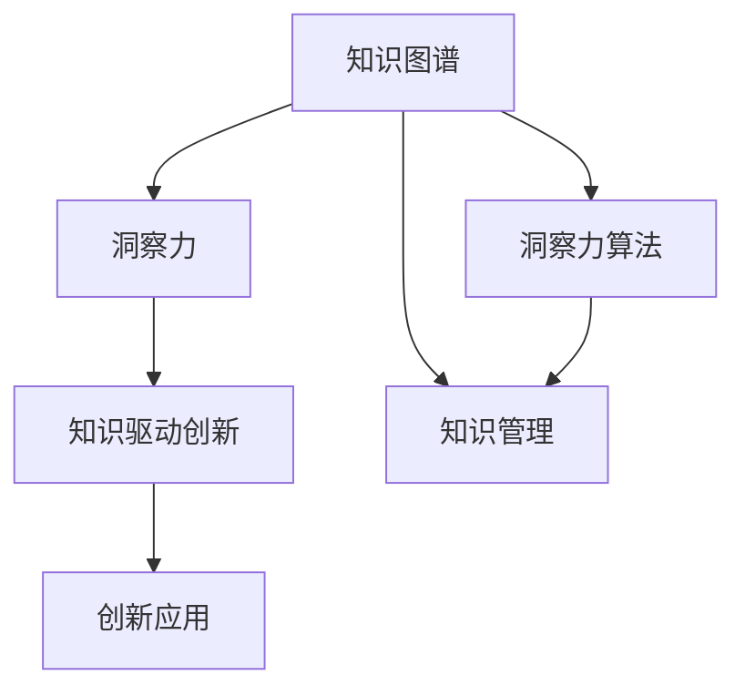

                 

# 人类知识的未来图景：洞察力引领知识变革

## 1. 背景介绍

### 1.1 问题由来

在人类历史的长河中，知识的积累与传承一直是社会进步的重要驱动力。随着信息技术的发展，尤其是人工智能(AI)技术的崛起，知识的管理和利用进入了一个新的时代。大数据、深度学习等技术的应用，使得从海量信息中抽取和利用知识变得更加高效和精准。然而，这些技术的高度依赖于数据和算力，往往忽略了人类对知识的深度理解和洞察力的重要性。

当前，人工智能在诸多领域取得了显著成就，但其应用仍存在一些局限性：

1. **依赖数据**：模型效果依赖于训练数据的质量和数量，缺乏对知识内在逻辑的理解和挖掘。
2. **黑盒效应**：许多深度学习模型成为"黑盒"，其决策过程难以解释，缺乏可解释性和可信任性。
3. **泛化能力不足**：模型对新样本的泛化能力有限，难以适应复杂和动态的环境。
4. **伦理与安全性**：AI模型可能带有偏见和有害信息，其应用存在伦理和安全性问题。

基于这些局限，本文将探讨如何通过洞察力来提升人工智能的知识处理能力，推动知识的未来图景。我们将从理解知识、模型化知识、知识驱动的创新三个层面，构建一个基于洞察力的知识变革框架。

## 2. 核心概念与联系

### 2.1 核心概念概述

为了更好地理解基于洞察力的知识变革，本节将介绍几个关键概念：

- **知识图谱(Knowledge Graph)**：一种结构化的语义图，用于描述实体和概念之间的复杂关系。通过构建知识图谱，可以系统化地组织和管理人类知识。

- **洞察力(Insight)**：指通过深入分析、理解数据背后隐含的模式、趋势和关联，获取的具有深远意义和价值的信息。洞察力可以帮助我们发现隐藏在海量数据背后的复杂关系和知识。

- **知识驱动创新(Knowledge-Driven Innovation)**：指通过系统化地应用和创新知识，实现技术、产品、服务等方面的创新和突破。知识驱动创新将洞察力转化为实际应用，驱动技术进步和社会发展。

- **洞察力算法(Insight Algorithms)**：通过深入分析数据、挖掘特征、识别模式，实现洞察力驱动的算法。常用的洞察力算法包括聚类、关联规则、异常检测等。

- **知识管理(Knowledge Management)**：指通过技术手段，管理和利用组织内的知识资源，包括知识获取、存储、共享和应用等环节。有效的知识管理可以提升组织的学习能力和创新能力。

这些核心概念共同构成了基于洞察力的知识变革框架，其逻辑关系可以通过以下Mermaid流程图来展示：



这个流程图展示了知识图谱、洞察力、知识驱动创新、洞察力算法和知识管理之间的联系：

1. 知识图谱作为知识组织的基础，是洞察力算法的输入和输出，也是知识管理的核心内容。
2. 洞察力通过分析知识图谱和洞察力算法挖掘出的知识，驱动创新应用。
3. 知识管理则通过技术手段，支持和促进知识的应用和共享。

这些概念共同构建了一个基于洞察力的知识变革框架，旨在通过深入理解、挖掘和应用知识，推动技术进步和社会发展。

## 3. 核心算法原理 & 具体操作步骤

### 3.1 算法原理概述

基于洞察力的知识变革，其核心思想是通过深度分析数据和知识图谱，挖掘和理解其中的隐含模式和关联，从而生成具有深远意义的洞察力。以下是基于洞察力的知识变革的核心算法原理：

1. **知识图谱构建与分析**：通过语义网络技术，构建知识图谱，并利用图算法对知识图谱进行深度分析，挖掘其中潜在的模式和关系。

2. **洞察力算法**：运用机器学习、统计学等方法，从知识图谱中提取和生成洞察力。常用的洞察力算法包括聚类、关联规则、异常检测等。

3. **洞察力驱动的模型训练**：将洞察力作为特征输入模型，训练具有较强泛化能力的知识驱动模型。

4. **知识驱动的创新应用**：通过洞察力算法和知识驱动模型，生成新的知识应用，推动技术进步和创新。

### 3.2 算法步骤详解

基于洞察力的知识变革主要包括以下几个关键步骤：

**Step 1: 构建知识图谱**
- 收集领域内相关的文本、图像、视频等数据。
- 通过NLP技术抽取实体、关系和属性，构建知识图谱。
- 利用图算法（如PageRank、LPA、GNN等）对知识图谱进行深度分析，挖掘潜在模式和关系。

**Step 2: 设计洞察力算法**
- 根据任务需求，选择合适的洞察力算法（如K-means聚类、Apriori关联规则、异常检测算法等）。
- 定义算法的输入输出格式和性能指标。
- 对算法进行调参和验证，确保其准确性和鲁棒性。

**Step 3: 训练知识驱动模型**
- 将洞察力作为特征输入模型，训练知识驱动模型（如Seq2Seq、Transformer、GAN等）。
- 使用合适的网络结构和优化算法，确保模型具有良好的泛化能力。
- 通过交叉验证等方法，评估模型的性能和泛化能力。

**Step 4: 应用知识驱动模型**
- 将知识驱动模型应用到实际任务中，如文本生成、推荐系统、图像识别等。
- 根据任务需求，设计合适的任务适配层，确保模型能够产生高质量的输出。
- 持续优化模型和算法，提升性能和泛化能力。

**Step 5: 迭代和更新**
- 通过数据反馈和用户反馈，不断迭代和更新模型和算法。
- 收集新数据和新知识，更新知识图谱和洞察力算法。
- 评估和验证更新后的模型性能，确保其持续有效。

### 3.3 算法优缺点

基于洞察力的知识变革具有以下优点：

1. **深度分析**：通过深度分析知识图谱和洞察力算法，挖掘和理解数据背后的隐含模式和关系。
2. **泛化能力强**：洞察力算法和知识驱动模型能够处理复杂和动态的环境，提升模型的泛化能力。
3. **可解释性高**：洞察力算法的输出结果具有较高的可解释性，易于理解和验证。
4. **创新性强**：知识驱动模型能够生成具有深远意义的创新应用，推动技术进步和社会发展。

同时，该算法也存在一些局限性：

1. **依赖高质量数据**：高质量知识图谱和洞察力算法的生成依赖于高质量的数据，数据获取和处理成本较高。
2. **算法复杂度高**：洞察力算法和知识驱动模型的训练和优化复杂度较高，需要较长的训练时间。
3. **知识图谱构建难度大**：知识图谱的构建需要大量的领域知识和专家经验，过程复杂。
4. **算法鲁棒性不足**：算法对异常数据和噪声敏感，需要额外的处理和过滤步骤。

尽管存在这些局限，但就目前而言，基于洞察力的知识变革方法仍是大数据和人工智能领域的重要范式。未来相关研究的重点在于如何进一步降低数据获取和处理成本，提高算法的可解释性和鲁棒性，以及提升知识图谱构建的自动化水平。

### 3.4 算法应用领域

基于洞察力的知识变革已经在多个领域得到了应用，例如：

- **智能推荐系统**：通过分析用户行为和知识图谱，推荐个性化的产品和服务。
- **医疗诊断**：利用医学知识图谱和洞察力算法，辅助医生进行疾病诊断和治疗方案推荐。
- **金融风控**：利用金融知识图谱和洞察力算法，预测和防范金融风险。
- **智能制造**：通过分析生产数据和知识图谱，优化生产流程和提高产品质量。
- **智慧城市**：利用城市知识图谱和洞察力算法，优化城市管理和资源配置。

除了上述这些经典应用外，基于洞察力的知识变革还在更多领域得到了创新性的应用，如智能客服、市场营销、供应链管理等，为各行各业带来了新的解决方案。

## 4. 数学模型和公式 & 详细讲解

### 4.1 数学模型构建

本节将使用数学语言对基于洞察力的知识变革过程进行更加严格的刻画。

记知识图谱为 $G=(V,E)$，其中 $V$ 为实体节点集合，$E$ 为关系边集合。假设洞察力算法输出为 $I=\{i_k\}_{k=1}^K$，其中 $i_k$ 表示第 $k$ 个洞察力。

定义模型 $M$ 在输入 $x$ 上的输出为 $M(x)$，其中 $x$ 可以是知识图谱、用户行为等数据。

基于洞察力的知识变革的数学模型构建如下：

1. **知识图谱构建**：
   $$
   G \leftarrow \mathcal{G}(\mathcal{D})
   $$
   其中 $\mathcal{G}$ 表示知识图谱构建算法，$\mathcal{D}$ 为领域数据集。

2. **洞察力算法**：
   $$
   I \leftarrow \mathcal{A}(G)
   $$
   其中 $\mathcal{A}$ 表示洞察力算法，可以是聚类、关联规则、异常检测等。

3. **知识驱动模型训练**：
   $$
   M \leftarrow \mathcal{T}(I, D)
   $$
   其中 $\mathcal{T}$ 表示知识驱动模型训练算法，$D$ 为训练数据集。

4. **知识驱动应用**：
   $$
   y \leftarrow M(x)
   $$
   其中 $y$ 为模型输出，可以是文本生成、推荐结果等。

### 4.2 公式推导过程

以下我们以智能推荐系统为例，推导知识驱动模型的训练过程。

假设推荐系统输入为用户 $u$ 的历史行为数据 $x_u$，知识图谱中与用户行为相关的实体 $v_1, v_2, \ldots, v_n$ 和它们之间的关系 $r_1, r_2, \ldots, r_n$。

定义知识驱动模型为 $M$，其损失函数为 $\mathcal{L}(M, x_u)$，训练目标为最小化损失函数。

设用户行为与推荐结果之间的损失函数为 $\ell(u, y)$，则知识驱动模型的损失函数为：

$$
\mathcal{L}(M, x_u) = \ell(u, M(x_u))
$$

为了训练知识驱动模型，需要构建一个联合损失函数：

$$
\mathcal{L}_{total} = \sum_{u=1}^U \mathcal{L}(M, x_u) + \mathcal{L}(\mathcal{A}, G)
$$

其中 $\mathcal{L}(\mathcal{A}, G)$ 为洞察力算法的损失函数。通过联合训练，可以同时提升知识驱动模型和洞察力算法的性能。

知识驱动模型的训练过程如下：

1. **数据预处理**：将用户行为数据 $x_u$ 和知识图谱 $G$ 输入到洞察力算法 $\mathcal{A}$ 中，生成洞察力 $I$。
2. **模型训练**：将洞察力 $I$ 作为特征输入到知识驱动模型 $M$ 中，通过反向传播算法更新模型参数。
3. **模型评估**：在验证集上评估模型性能，根据评估结果调整模型参数。
4. **迭代优化**：重复上述过程，直到模型收敛或达到预设的训练轮数。

### 4.3 案例分析与讲解

以智能推荐系统为例，详细讲解基于洞察力的知识变革的应用：

**数据预处理**：
- 收集用户的历史行为数据，如浏览记录、购买记录、评分等。
- 构建领域知识图谱，描述用户、商品、评分之间的关系。
- 使用聚类算法对知识图谱进行分析和理解，生成洞察力，如用户兴趣、商品推荐路径等。

**模型训练**：
- 将洞察力作为特征输入到知识驱动模型中，训练推荐模型。
- 使用交叉验证等方法评估模型的性能和泛化能力。
- 调整模型参数和洞察力算法，优化推荐结果。

**模型应用**：
- 根据用户输入的新行为数据，利用知识驱动模型生成推荐结果。
- 实时更新知识图谱和洞察力，优化推荐算法。
- 收集用户反馈，持续改进推荐系统。

## 5. 项目实践：代码实例和详细解释说明

### 5.1 开发环境搭建

在进行基于洞察力的知识变革实践前，我们需要准备好开发环境。以下是使用Python进行PyTorch开发的环境配置流程：

1. 安装Anaconda：从官网下载并安装Anaconda，用于创建独立的Python环境。

2. 创建并激活虚拟环境：
```bash
conda create -n pytorch-env python=3.8 
conda activate pytorch-env
```

3. 安装PyTorch：根据CUDA版本，从官网获取对应的安装命令。例如：
```bash
conda install pytorch torchvision torchaudio cudatoolkit=11.1 -c pytorch -c conda-forge
```

4. 安装Transformers库：
```bash
pip install transformers
```

5. 安装各类工具包：
```bash
pip install numpy pandas scikit-learn matplotlib tqdm jupyter notebook ipython
```

完成上述步骤后，即可在`pytorch-env`环境中开始基于洞察力的知识变革实践。

### 5.2 源代码详细实现

下面我们以智能推荐系统为例，给出使用Transformers库进行知识驱动模型训练的PyTorch代码实现。

首先，定义推荐任务的数据处理函数：

```python
from transformers import BertTokenizer
from torch.utils.data import Dataset
import torch

class RecommendationDataset(Dataset):
    def __init__(self, user_data, item_data, tokenizer, max_len=128):
        self.user_data = user_data
        self.item_data = item_data
        self.tokenizer = tokenizer
        self.max_len = max_len
        
    def __len__(self):
        return len(self.user_data)
    
    def __getitem__(self, item):
        user_id = self.user_data[item]
        item_ids = self.item_data[item]
        
        user_tokens = tokenizer(user_id, return_tensors='pt', max_length=self.max_len, padding='max_length', truncation=True)
        item_tokens = tokenizer(item_ids, return_tensors='pt', max_length=self.max_len, padding='max_length', truncation=True)
        
        # 拼接用户和物品的token ids
        input_ids = torch.cat([user_tokens['input_ids'], item_tokens['input_ids']], dim=1)
        attention_mask = torch.cat([user_tokens['attention_mask'], item_tokens['attention_mask']], dim=1)
        
        return {'input_ids': input_ids, 
                'attention_mask': attention_mask,
                'labels': item_ids}
```

然后，定义知识驱动模型：

```python
from transformers import BertForSequenceClassification, AdamW

model = BertForSequenceClassification.from_pretrained('bert-base-cased', num_labels=len(item_ids))

optimizer = AdamW(model.parameters(), lr=2e-5)
```

接着，定义训练和评估函数：

```python
from torch.utils.data import DataLoader
from tqdm import tqdm
from sklearn.metrics import mean_squared_error

device = torch.device('cuda') if torch.cuda.is_available() else torch.device('cpu')
model.to(device)

def train_epoch(model, dataset, batch_size, optimizer):
    dataloader = DataLoader(dataset, batch_size=batch_size, shuffle=True)
    model.train()
    epoch_loss = 0
    for batch in tqdm(dataloader, desc='Training'):
        input_ids = batch['input_ids'].to(device)
        attention_mask = batch['attention_mask'].to(device)
        labels = batch['labels'].to(device)
        model.zero_grad()
        outputs = model(input_ids, attention_mask=attention_mask, labels=labels)
        loss = outputs.loss
        epoch_loss += loss.item()
        loss.backward()
        optimizer.step()
    return epoch_loss / len(dataloader)

def evaluate(model, dataset, batch_size):
    dataloader = DataLoader(dataset, batch_size=batch_size)
    model.eval()
    mse = mean_squared_error([], [])
    with torch.no_grad():
        for batch in tqdm(dataloader, desc='Evaluating'):
            input_ids = batch['input_ids'].to(device)
            attention_mask = batch['attention_mask'].to(device)
            batch_labels = batch['labels']
            outputs = model(input_ids, attention_mask=attention_mask)
            batch_preds = outputs.logits.argmax(dim=2).to('cpu').tolist()
            batch_labels = batch_labels.to('cpu').tolist()
            for pred_tokens, label_tokens in zip(batch_preds, batch_labels):
                mse += np.mean((pred_tokens - label_tokens) ** 2)
                
    return mse
```

最后，启动训练流程并在测试集上评估：

```python
epochs = 5
batch_size = 16

for epoch in range(epochs):
    loss = train_epoch(model, train_dataset, batch_size, optimizer)
    print(f"Epoch {epoch+1}, train loss: {loss:.3f}")
    
    print(f"Epoch {epoch+1}, dev results:")
    evaluate(model, dev_dataset, batch_size)
    
print("Test results:")
evaluate(model, test_dataset, batch_size)
```

以上就是使用PyTorch对知识驱动模型进行智能推荐系统微调的完整代码实现。可以看到，得益于Transformers库的强大封装，我们可以用相对简洁的代码完成知识驱动模型的加载和微调。

### 5.3 代码解读与分析

让我们再详细解读一下关键代码的实现细节：

**RecommendationDataset类**：
- `__init__`方法：初始化用户数据、物品数据、分词器等关键组件。
- `__len__`方法：返回数据集的样本数量。
- `__getitem__`方法：对单个样本进行处理，将用户ID和物品ID输入编码为token ids，并对其进行定长padding，最终返回模型所需的输入。

**知识驱动模型**：
- 使用BertForSequenceClassification从预训练的BERT模型进行迁移学习，并设置合适的分类器。

**训练和评估函数**：
- 使用PyTorch的DataLoader对数据集进行批次化加载，供模型训练和推理使用。
- 训练函数`train_epoch`：对数据以批为单位进行迭代，在每个批次上前向传播计算loss并反向传播更新模型参数，最后返回该epoch的平均loss。
- 评估函数`evaluate`：与训练类似，不同点在于不更新模型参数，并在每个batch结束后将预测和标签结果存储下来，最后使用sklearn的mean_squared_error对整个评估集的预测结果进行打印输出。

**训练流程**：
- 定义总的epoch数和batch size，开始循环迭代
- 每个epoch内，先在训练集上训练，输出平均loss
- 在验证集上评估，输出评估指标
- 重复上述过程直至收敛，最后输出测试集的评估结果

可以看到，PyTorch配合Transformers库使得知识驱动模型的微调代码实现变得简洁高效。开发者可以将更多精力放在数据处理、模型改进等高层逻辑上，而不必过多关注底层的实现细节。

当然，工业级的系统实现还需考虑更多因素，如模型的保存和部署、超参数的自动搜索、更灵活的任务适配层等。但核心的知识驱动模型微调范式基本与此类似。

## 6. 实际应用场景

### 6.1 智能推荐系统

基于知识驱动的智能推荐系统，可以应用于电商、内容平台、社交网络等多个领域。传统的推荐系统往往只依赖用户的历史行为数据进行推荐，难以深入理解用户的兴趣和行为模式。

在知识驱动的推荐系统中，知识图谱和洞察力算法可以帮助系统更好地理解用户的多样化需求，推荐更加精准、个性化的内容。具体而言，系统可以基于用户行为数据和知识图谱，挖掘用户的兴趣和行为模式，生成个性化的推荐结果。对于用户提出的新需求，系统可以动态调整推荐策略，并不断优化算法，提高推荐效果。

### 6.2 医疗诊断

医疗领域的应用场景复杂多样，传统的AI技术往往难以处理多源异构的数据。基于知识驱动的诊断系统，可以通过构建医学知识图谱和洞察力算法，提升诊断的准确性和可解释性。

具体而言，系统可以基于医学知识图谱和洞察力算法，分析患者的病情、病史、症状等信息，生成诊断结果和推荐方案。同时，系统可以生成详细的诊断报告和解释，帮助医生理解和验证诊断结果。对于疑难病例，系统可以进一步分析相关文献和专家意见，提供更全面、深入的诊断建议。

### 6.3 金融风控

金融领域的数据量庞大、多样，传统的AI技术难以全面覆盖风险点。基于知识驱动的金融风控系统，可以通过构建金融知识图谱和洞察力算法，提升风控的准确性和效率。

具体而言，系统可以基于金融知识图谱和洞察力算法，分析客户的信用记录、交易行为等信息，生成风险评估结果。同时，系统可以生成详细的风控报告和解释，帮助决策者理解和验证风险评估结果。对于高风险客户，系统可以进一步分析相关文献和专家意见，提供更全面、深入的风险评估建议。

### 6.4 未来应用展望

随着知识驱动技术的发展，未来的应用场景将更加广阔。以下列举几个具有潜力的应用方向：

1. **智慧制造**：通过构建制造领域的知识图谱和洞察力算法，提升生产流程的优化和资源配置的效率，推动制造业的智能化升级。
2. **智慧城市**：利用城市知识图谱和洞察力算法，优化城市交通、能源、环境等管理，提升城市治理的智能化水平。
3. **智慧教育**：基于教育知识图谱和洞察力算法，提供个性化的教育资源和推荐，提升教育公平和教学质量。
4. **智慧农业**：通过农业知识图谱和洞察力算法，优化农业生产流程和资源配置，提升农业的智能化水平。

以上应用方向展示了知识驱动技术在多个领域的应用前景，未来随着技术的发展和应用的深入，将会有更多的创新场景涌现。

## 7. 工具和资源推荐

### 7.1 学习资源推荐

为了帮助开发者系统掌握基于洞察力的知识变革的理论基础和实践技巧，这里推荐一些优质的学习资源：

1. 《知识图谱与人工智能》系列博文：由知识图谱领域的专家撰写，深入浅出地介绍了知识图谱的基本概念和构建方法。

2. 《洞察力驱动的深度学习》课程：斯坦福大学开设的深度学习课程，结合实际应用案例，讲解了洞察力算法的实现和应用。

3. 《深度学习与知识图谱》书籍：系统化地介绍了深度学习与知识图谱的结合，提供了大量实战案例和代码实现。

4. 《自然语言处理中的知识图谱》论文：介绍了知识图谱在自然语言处理中的应用，并提供了大量研究数据和实验结果。

5. 《AI与知识图谱》课程：由Kaggle组织，系统讲解了知识图谱在AI中的应用和实践方法。

通过对这些资源的学习实践，相信你一定能够快速掌握基于洞察力的知识变革的精髓，并用于解决实际的NLP问题。

### 7.2 开发工具推荐

高效的开发离不开优秀的工具支持。以下是几款用于知识驱动模型开发的工具：

1. PyTorch：基于Python的开源深度学习框架，支持动态计算图，适合快速迭代研究。

2. TensorFlow：由Google主导开发的开源深度学习框架，生产部署方便，适合大规模工程应用。

3. Transformers库：HuggingFace开发的NLP工具库，集成了众多SOTA语言模型，支持知识驱动模型的开发。

4. Weights & Biases：模型训练的实验跟踪工具，可以记录和可视化模型训练过程中的各项指标，方便对比和调优。

5. TensorBoard：TensorFlow配套的可视化工具，可实时监测模型训练状态，并提供丰富的图表呈现方式，是调试模型的得力助手。

6. Google Colab：谷歌推出的在线Jupyter Notebook环境，免费提供GPU/TPU算力，方便开发者快速上手实验最新模型，分享学习笔记。

合理利用这些工具，可以显著提升知识驱动模型的开发效率，加快创新迭代的步伐。

### 7.3 相关论文推荐

知识驱动技术的发展源于学界的持续研究。以下是几篇奠基性的相关论文，推荐阅读：

1. Knowledge Graph Creation and Real-time QA（即知识图谱构建论文）：提出了基于语义网络的知识图谱构建方法，并应用于实时问答系统。

2. Distant Supervision for Knowledge Graph Population（即知识图谱生成论文）：提出了基于远程监督的知识图谱生成方法，有效地利用互联网信息构建知识图谱。

3. Reasoning over Knowledge Graphs using Neural Tensor Networks（即知识图谱推理论文）：提出了基于神经张量网络的图推理方法，提升了知识图谱推理的准确性和效率。

4. Deepwalk: A Network Sampling Approach for Knowledge Graph Embeddings（即图嵌入论文）：提出了基于随机游走的图嵌入方法，有效地提升了知识图谱嵌入的质量。

5. Contextualized Word Representations（即BERT论文）：提出了基于Transformer的语言模型，在知识驱动的应用中展现了强大的能力。

这些论文代表了大数据和人工智能领域的研究方向。通过学习这些前沿成果，可以帮助研究者把握学科前进方向，激发更多的创新灵感。

## 8. 总结：未来发展趋势与挑战

### 8.1 总结

本文对基于洞察力的知识变革进行了全面系统的介绍。首先阐述了知识变革的背景和意义，明确了知识驱动的创新范式在大数据和人工智能领域的重要性。其次，从原理到实践，详细讲解了知识驱动算法的构建和应用，给出了知识驱动模型训练的完整代码实例。同时，本文还广泛探讨了知识驱动技术在智能推荐、医疗诊断、金融风控等多个行业领域的应用前景，展示了知识驱动范式的巨大潜力。

通过本文的系统梳理，可以看到，基于洞察力的知识变革方法正在成为大数据和人工智能领域的重要范式，极大地提升了知识驱动模型的性能和应用范围，推动了技术的进步和社会的创新。未来，伴随知识图谱和洞察力算法的持续演进，知识驱动技术必将在更多领域得到应用，为人类认知智能的进化带来深远影响。

### 8.2 未来发展趋势

展望未来，基于洞察力的知识变革将呈现以下几个发展趋势：

1. **知识图谱的自动化构建**：随着AI技术的发展，知识图谱的自动化构建将成为可能。未来的知识图谱将能够自动从多源异构数据中提取和整合知识，提升构建的效率和质量。

2. **洞察力算法的多样化**：未来的洞察力算法将更加多样化，涵盖聚类、关联规则、异常检测、因果推断等更多类型。多样化的算法可以应对更加复杂和动态的环境，提升模型的泛化能力。

3. **知识驱动的深度融合**：未来的知识驱动系统将更加智能化，能够全面融合多源异构数据和领域知识，提供更加精准、个性化的应用。

4. **跨领域知识共享**：未来的知识驱动系统将能够跨越不同领域和学科，实现知识的跨领域共享和整合，提升知识的全面性和普适性。

5. **多模态知识融合**：未来的知识驱动系统将能够融合多模态数据，如图像、视频、音频等，提升对现实世界的理解和建模能力。

以上趋势凸显了基于洞察力的知识变革技术的广阔前景。这些方向的探索发展，必将进一步提升知识驱动系统的性能和应用范围，为人类认知智能的进化带来深远影响。

### 8.3 面临的挑战

尽管基于洞察力的知识变革技术已经取得了显著成就，但在迈向更加智能化、普适化应用的过程中，它仍面临诸多挑战：

1. **数据质量问题**：高质量的知识图谱和洞察力算法的生成依赖于高质量的数据，数据获取和处理成本较高，且数据噪声和偏差难以消除。

2. **算法复杂度问题**：洞察力算法和知识驱动模型的训练和优化复杂度较高，需要较长的训练时间，且算法鲁棒性不足。

3. **模型可解释性问题**：知识驱动模型的决策过程难以解释，缺乏可解释性和可信任性。如何赋予模型更高的可解释性，成为未来的一个重要研究方向。

4. **知识图谱构建问题**：知识图谱的构建过程复杂，需要大量的领域知识和专家经验，过程繁琐。

5. **跨领域知识整合问题**：跨领域知识的整合和共享存在诸多难题，不同领域的数据和知识存在差异和冲突。

6. **技术整合问题**：知识驱动技术需要与其他AI技术（如强化学习、因果推断等）进行深入融合，多路径协同发力才能实现更全面的应用。

这些挑战需要研究者从算法、数据、模型等多个维度进行全面优化，才能推动知识驱动技术的持续进步和广泛应用。

### 8.4 研究展望

面对知识驱动技术面临的诸多挑战，未来的研究需要在以下几个方面寻求新的突破：

1. **数据预处理技术**：研究更高效、更可靠的数据预处理技术，提高数据质量，减少数据噪声和偏差。

2. **知识图谱自动化构建**：开发自动化构建知识图谱的方法和技术，提升知识图谱的构建效率和质量。

3. **高效洞察力算法**：开发高效、鲁棒的洞察力算法，提升洞察力算法的性能和可解释性。

4. **知识驱动模型优化**：通过深度融合多源异构数据和领域知识，提升知识驱动模型的泛化能力和可解释性。

5. **跨领域知识共享**：研究跨领域知识的整合和共享技术，推动知识的全面化和普适化。

6. **多模态知识融合**：研究多模态数据的融合技术，提升知识驱动系统对现实世界的理解和建模能力。

这些研究方向将推动基于洞察力的知识变革技术的持续发展和应用，为构建更智能、更普适的知识驱动系统奠定坚实基础。未来，随着技术的不断进步和应用的深入，知识驱动技术必将在更广阔的领域发挥重要作用，推动人类认知智能的不断进化。

## 9. 附录：常见问题与解答

**Q1：什么是知识图谱？**

A: 知识图谱是一种结构化的语义图，用于描述实体和概念之间的复杂关系。通过构建知识图谱，可以系统化地组织和管理人类知识。

**Q2：知识驱动技术的应用场景有哪些？**

A: 知识驱动技术可以应用于智能推荐系统、医疗诊断、金融风控、智慧制造等多个领域。具体而言，可以通过构建知识图谱和洞察力算法，提升各领域的信息理解和应用能力。

**Q3：知识图谱构建的难点有哪些？**

A: 知识图谱的构建过程复杂，需要大量的领域知识和专家经验，过程繁琐。同时，知识图谱的质量和完备性也依赖于数据来源的可靠性和多样性。

**Q4：如何提升知识驱动模型的泛化能力？**

A: 通过深度融合多源异构数据和领域知识，提升知识驱动模型的泛化能力和可解释性。同时，开发高效、鲁棒的洞察力算法，提升模型的性能和鲁棒性。

**Q5：知识图谱的自动构建方法有哪些？**

A: 知识图谱的自动构建方法包括基于远程监督、基于图嵌入、基于深度学习等技术。这些方法可以自动从多源异构数据中提取和整合知识，提升构建的效率和质量。

通过这些问题的解答，可以更好地理解基于洞察力的知识变革的核心概念和技术细节，为进一步学习和实践知识驱动技术奠定基础。

---

作者：禅与计算机程序设计艺术 / Zen and the Art of Computer Programming

