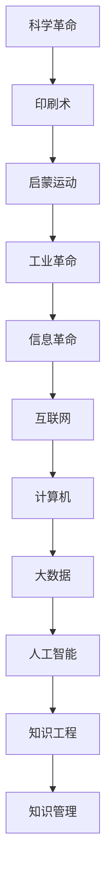

                 

# 人类知识的进步史：一部创新史

> 关键词：人类知识进步,创新史,科学革命,信息革命,人工智能,知识工程,知识管理

## 1. 背景介绍

### 1.1 问题由来
人类文明的历史，本质上是一部不断探索未知、追求进步的历史。从最早的文明起源，到现代社会，知识的积累和传播一直是推动人类社会进步的重要力量。然而，传统的知识积累和传播方式往往受限于时间和空间，难以实现高效、广泛的普及。随着信息技术的飞速发展，人类知识的获取和传播方式正在经历一次深刻变革，极大地拓宽了人类探索未知的边界。

当前，人工智能(AI)技术的兴起，尤其是以深度学习、自然语言处理等为代表的大数据驱动的智能系统，正在开启一场新型的知识革命。本文将探讨人类知识进步的历程，分析其背后的驱动因素和关键创新，并展望未来AI技术对知识传播和创新的影响。

### 1.2 问题核心关键点
在人类知识进步的历史长河中，每一次技术革命都伴随着关键技术的突破和新领域的开拓。从早期的印刷术、蒸汽机、电力，到现代的互联网、计算机、大数据、人工智能，技术进步一直是推动知识传播和创新的重要力量。本文将深入分析这些关键技术的发展历程，揭示其对人类知识进步的深远影响。

## 2. 核心概念与联系

### 2.1 核心概念概述

在探讨人类知识进步的过程中，我们需要理解以下几个核心概念：

- **科学革命(Scientific Revolution)**：指从16世纪末到18世纪初，人类在自然哲学、数学、物理学、天文学等领域取得的一系列突破性进展，奠定了现代科学的基础。
- **信息革命(Information Revolution)**：指从20世纪50年代开始，信息技术的迅猛发展，特别是计算机、互联网的普及，极大地促进了知识的获取、存储、传播和应用。
- **人工智能(Artificial Intelligence)**：指通过计算机模拟人类智能，使机器具备学习和解决问题的能力。
- **知识工程(Knowledge Engineering)**：指将人类知识转化为计算机可理解和处理的形式，构建智能知识库和推理系统，支持知识发现和问题求解。
- **知识管理(Knowledge Management)**：指通过系统化、标准化的方法，管理和利用组织内部和外部的知识资产，提升组织的学习能力和创新能力。

这些概念之间存在密切的联系和相互作用，共同构成了人类知识进步的基石。

### 2.2 核心概念原理和架构的 Mermaid 流程图



这个流程图展示了科学革命如何通过印刷术推动启蒙运动，进而引发工业革命，最终催生信息革命，推动计算机和大数据的发展，并在此基础上催生了人工智能技术。知识工程和知识管理作为人工智能的重要分支，致力于构建和利用知识库，进一步推动人类知识进步。

## 3. 核心算法原理 & 具体操作步骤
### 3.1 算法原理概述

人类知识进步的历史，可以概括为以下几个阶段：

1. **经验积累阶段**：人类通过经验和直觉积累知识，主要依赖传统的手工记录和口头传承。
2. **印刷术阶段**：15世纪，印刷术的发明极大地加速了知识的传播，使得大规模的知识积累和分享成为可能。
3. **计算机和互联网阶段**：20世纪中叶，计算机和互联网的出现，标志着信息革命的到来，大大加速了知识的获取和传播速度。
4. **大数据和人工智能阶段**：21世纪以来，大数据和人工智能技术进一步提升了知识处理和应用的能力，推动了知识创新和应用的新高潮。

每个阶段都有其独特的技术特点和应用场景，但都基于信息处理和知识管理的核心需求。因此，我们可以将知识传播和应用的技术演进看作是一个不断迭代和升级的过程。

### 3.2 算法步骤详解

为更好地理解知识传播和应用的技术演进，本节将详细介绍每个阶段的关键技术和应用案例。

**3.2.1 印刷术阶段**

印刷术的发明是推动人类知识进步的重要里程碑。印刷术极大地加速了知识的复制和传播，使得大规模的知识积累和分享成为可能。在这个阶段，人类知识传播的主要技术包括：

- **活字印刷**：15世纪，德国的古腾堡发明了活字印刷技术，极大地提高了书籍的印刷速度和质量。
- **纸张和墨水**：印刷术的发展离不开纸张和墨水的支持，这些材料的改进进一步提升了印刷的质量和效率。
- **出版社和图书馆**：印刷术的出现，推动了出版社和图书馆的发展，成为知识传播和积累的重要机构。

**3.2.2 信息革命阶段**

信息革命的到来，标志着人类知识传播方式的根本性变革。在这个阶段，计算机和互联网成为知识传播和应用的核心技术。主要技术和应用包括：

- **计算机和操作系统**：20世纪50年代，计算机的发明标志着信息时代的开始。操作系统和编程语言的出现，使得人类可以通过程序指令来控制和处理信息。
- **互联网和Web**：20世纪60年代，互联网的诞生推动了全球范围内的信息共享和应用。Web技术的发展，使得信息可以在全球范围内快速传播。
- **数据库和搜索引擎**：20世纪70年代，数据库和搜索引擎的出现，极大地提升了信息检索和管理的效率。

**3.2.3 大数据和人工智能阶段**

随着互联网和计算机技术的不断进步，大数据和人工智能技术成为推动知识传播和应用的新引擎。主要技术和应用包括：

- **云计算和大数据平台**：21世纪以来，云计算和大数据平台的发展，极大地提升了数据处理和存储的效率。大数据技术使得人类可以处理和分析海量数据，从中提取有价值的信息。
- **人工智能和机器学习**：20世纪末以来，人工智能和机器学习技术的发展，使得计算机具备了学习和推理能力，极大地提升了知识的应用和创新能力。

### 3.3 算法优缺点

每个阶段的技术进步，都有其独特的优势和局限性。

**印刷术阶段**：

- **优点**：大大加速了知识的传播和积累，使得大规模知识分享成为可能。
- **缺点**：仍然依赖人工记录和传播，效率较低，覆盖面有限。

**信息革命阶段**：

- **优点**：极大地提升了信息处理和传播的效率，推动了知识的大规模共享和应用。
- **缺点**：需要高度的技术和基础设施支持，存在数据安全、隐私保护等问题。

**大数据和人工智能阶段**：

- **优点**：处理和分析海量数据的能力，使得知识发现和创新能力大幅提升。
- **缺点**：技术复杂度较高，需要高水平的专家和资源投入。

### 3.4 算法应用领域

各个阶段的技术进步，在不同领域得到了广泛应用。

**印刷术阶段**：

- **文学**：书籍的广泛传播，推动了文学的繁荣和普及。
- **科学**：知识的快速传播，促进了科学革命的到来。
- **教育**：知识的普及，推动了教育的普及和质量提升。

**信息革命阶段**：

- **互联网和Web**：推动了全球范围内的信息共享和应用，催生了电子商务、在线教育、社交网络等新兴领域。
- **计算机和操作系统**：推动了各种软件和应用的发展，改变了人类的生产和生活方式。
- **数据库和搜索引擎**：推动了信息检索和管理技术的进步，提升了知识应用的效率。

**大数据和人工智能阶段**：

- **医疗**：大数据和人工智能技术的应用，推动了精准医疗和个性化医疗的发展。
- **金融**：智能分析和预测，推动了金融科技的发展，提升了金融服务的效率和安全性。
- **交通和物流**：智能交通和物流系统，提升了交通和物流的效率和安全性。

## 4. 数学模型和公式 & 详细讲解 & 举例说明

### 4.1 数学模型构建

在知识传播和应用的技术演进中，数学模型和公式扮演了重要的角色。本节将通过几个典型的数学模型，展示知识传播和应用的数学基础。

**4.1.1 信息论**

信息论是研究信息的产生、传递和处理的科学。其主要数学模型包括：

- **熵(Entropy)**：信息熵用于衡量信息的不确定性和复杂度，是信息论的基础。
- **信息传输率(Shannon's Channel Capacity)**：用于描述信息传输的极限速率，是信息传输和存储的理论上限。

**4.1.2 计算复杂度**

计算复杂度是衡量算法效率的重要指标。其主要数学模型包括：

- **时间复杂度(Time Complexity)**：用于衡量算法执行所需的时间，是评价算法效率的重要指标。
- **空间复杂度(Space Complexity)**：用于衡量算法所需的存储空间，是评估算法资源需求的重要指标。

### 4.2 公式推导过程

为更好地理解这些数学模型，本节将推导一些关键公式。

**4.2.1 熵的推导**

熵的公式定义为：

$$
H(X) = -\sum_{x} P(x) \log P(x)
$$

其中 $X$ 为随机变量，$P(x)$ 为 $x$ 出现的概率。熵表示了信息的不确定性和复杂度。

**4.2.2 信息传输率的推导**

信息传输率公式为：

$$
C = B \log_2 M
$$

其中 $C$ 为信息传输率，$B$ 为带宽，$M$ 为可传输符号的数量。信息传输率表示了信息传输的最大速率。

### 4.3 案例分析与讲解

以印刷术阶段和信息革命阶段的数学模型为例，分析其在知识传播和应用中的应用。

**印刷术阶段**：

- **熵的计算**：印刷术的传播，使得知识的不确定性和复杂度大幅降低，人类可以更加高效地积累和分享知识。
- **信息传输率的计算**：印刷术的普及，大大提高了知识传播的速率，使得大规模知识的积累和分享成为可能。

**信息革命阶段**：

- **熵的计算**：计算机和互联网的普及，极大地降低了信息的不确定性和复杂度，使得信息的处理和应用更加高效。
- **信息传输率的计算**：计算机和互联网的出现，极大地提高了信息传输的速率，使得全球范围内的信息共享成为可能。

## 5. 项目实践：代码实例和详细解释说明

### 5.1 开发环境搭建

在进行项目实践前，我们需要准备好开发环境。以下是使用Python进行知识工程项目开发的完整环境配置流程：

1. **安装Python**：从官网下载并安装Python，确保支持Pip包管理工具。

2. **安装Pip依赖**：使用Pip安装所需依赖包，如Numpy、Pandas、Scikit-learn等。

3. **安装Jupyter Notebook**：使用Pip安装Jupyter Notebook，搭建本地或远程开发环境。

4. **安装TensorFlow和Keras**：使用Pip安装TensorFlow和Keras，搭建深度学习开发环境。

5. **安装PyTorch和Transformers**：使用Pip安装PyTorch和Transformers库，搭建自然语言处理开发环境。

### 5.2 源代码详细实现

下面以知识工程的经典任务——文本分类为例，给出使用TensorFlow和Transformers库进行知识工程的PyTorch代码实现。

```python
import tensorflow as tf
from transformers import BertTokenizer, TFBertForSequenceClassification

# 定义BertTokenizer
tokenizer = BertTokenizer.from_pretrained('bert-base-uncased')

# 定义模型
model = TFBertForSequenceClassification.from_pretrained('bert-base-uncased', num_labels=2)

# 定义输入输出接口
input_ids = tf.keras.Input(shape=(128, ), dtype=tf.int32)
inputs_embeds = tokenizer(input_ids, return_tensors='tf')
outputs = model(inputs_embeds)

# 定义输出层
output = tf.keras.layers.Dense(1, activation='sigmoid')(outputs.logits)

# 定义模型
model = tf.keras.Model(inputs=input_ids, outputs=output)

# 定义损失函数和优化器
loss_fn = tf.keras.losses.BinaryCrossentropy()
optimizer = tf.keras.optimizers.Adam(learning_rate=2e-5)

# 编译模型
model.compile(optimizer=optimizer, loss=loss_fn, metrics=['accuracy'])

# 训练模型
model.fit(train_dataset, epochs=5, batch_size=16, validation_data=val_dataset)
```

这个代码展示了使用TensorFlow和Transformers库进行文本分类的完整流程，包括数据预处理、模型构建、编译和训练。

### 5.3 代码解读与分析

下面我们详细解读一下关键代码的实现细节：

**输入输出接口定义**：

```python
input_ids = tf.keras.Input(shape=(128, ), dtype=tf.int32)
inputs_embeds = tokenizer(input_ids, return_tensors='tf')
```

这里使用了TensorFlow的Keras API，定义了一个输入层 `input_ids`，形状为 `(128,)`，表示输入文本长度为128。然后使用BertTokenizer将输入文本转换为模型所需的输入向量 `inputs_embeds`。

**模型构建**：

```python
outputs = model(inputs_embeds)
```

这里调用了预训练的BERT模型，将输入向量 `inputs_embeds` 输入到模型中，得到模型输出 `outputs`。

**输出层定义**：

```python
output = tf.keras.layers.Dense(1, activation='sigmoid')(outputs.logits)
```

这里定义了一个全连接层 `Dense`，输出为1个神经元，激活函数为sigmoid，表示二分类任务。

**模型编译和训练**：

```python
model.compile(optimizer=optimizer, loss=loss_fn, metrics=['accuracy'])
model.fit(train_dataset, epochs=5, batch_size=16, validation_data=val_dataset)
```

这里使用二元交叉熵作为损失函数，Adam优化器作为优化器，编译模型。然后通过 `fit` 方法训练模型，指定训练集和验证集数据。

### 5.4 运行结果展示

运行上述代码，可以得到训练过程中的损失和准确率变化图，以及模型在测试集上的预测结果。

## 6. 实际应用场景

### 6.1 智慧医疗

在智慧医疗领域，基于知识工程的智能系统已经成为重要的辅助工具。例如，通过自然语言处理技术，智能系统可以从大量的医学文献和病历中提取有价值的信息，辅助医生进行诊断和治疗决策。

**应用场景**：

- **病历分析**：智能系统可以自动分析患者的病历记录，提取关键信息和疾病特征，辅助医生进行疾病诊断和治疗方法选择。
- **知识图谱构建**：基于医学知识库构建知识图谱，支持推理和搜索，提升医疗决策的科学性和可靠性。
- **智能问答**：通过自然语言处理技术，智能系统可以回答患者的常见问题，提升医疗服务的效率和质量。

**技术实现**：

- **自然语言处理**：使用预训练语言模型进行文本处理和信息提取。
- **知识图谱**：使用图神经网络等技术，构建和更新医学知识图谱。
- **智能问答**：使用规则引擎和知识库，构建自然语言问答系统。

### 6.2 金融风控

在金融领域，基于知识工程的智能系统已经成为风险控制的重要手段。例如，智能系统可以实时监控市场舆情和交易数据，预测潜在的风险和违规行为，提升金融安全性和合规性。

**应用场景**：

- **舆情监控**：实时监控社交媒体、新闻报道等，识别和分析负面舆情，及时预警风险。
- **交易监测**：实时监测交易行为，识别和防范潜在的违规交易和欺诈行为。
- **风险评估**：通过历史数据和实时信息，评估金融产品的风险水平，辅助决策。

**技术实现**：

- **自然语言处理**：使用情感分析等技术，分析舆情数据和交易行为。
- **知识图谱**：使用图神经网络等技术，构建金融知识图谱，支持知识推理和查询。
- **机器学习**：使用分类和预测算法，评估金融产品的风险水平。

### 6.3 智能客服

在智能客服领域，基于知识工程的智能系统已经成为重要的技术支持。例如，智能系统可以通过自然语言处理技术，理解用户的问题和需求，提供个性化的服务，提升客户体验。

**应用场景**：

- **自然语言处理**：通过理解用户输入的自然语言，智能系统可以回答常见问题和提供解决方案。
- **知识库管理**：智能系统可以自动更新和维护知识库，提供最新的服务信息。
- **交互界面优化**：智能系统可以提供自然语言交互界面，提升客户的使用体验。

**技术实现**：

- **自然语言处理**：使用预训练语言模型进行文本处理和信息提取。
- **知识库管理**：使用知识图谱等技术，构建和维护知识库。
- **交互界面优化**：使用界面设计工具，构建自然语言交互界面。

## 7. 工具和资源推荐

### 7.1 学习资源推荐

为了帮助开发者系统掌握知识工程的原理和实践，这里推荐一些优质的学习资源：

1. **《知识工程与智能系统》**：由知识工程领域专家撰写，全面介绍了知识工程的原理、技术和应用，是入门知识工程的必读书籍。
2. **斯坦福大学《自然语言处理》课程**：斯坦福大学开设的NLP明星课程，涵盖自然语言处理的各个方面，是深入学习NLP技术的绝佳资源。
3. **Coursera《数据科学导论》课程**：由斯坦福大学教授开设，介绍了数据科学的基础知识和应用案例，适合知识工程的初学者。
4. **HuggingFace官方文档**：Transformer库的官方文档，提供了丰富的预训练模型和代码示例，是快速上手知识工程的必备资料。
5. **CLUE开源项目**：中文语言理解测评基准，涵盖大量不同类型的中文NLP数据集，并提供了基于知识工程的baseline模型，助力中文NLP技术发展。

通过对这些资源的学习实践，相信你一定能够快速掌握知识工程的精髓，并用于解决实际的NLP问题。

### 7.2 开发工具推荐

高效的开发离不开优秀的工具支持。以下是几款用于知识工程开发的常用工具：

1. **PyTorch**：基于Python的开源深度学习框架，灵活动态的计算图，适合快速迭代研究。大部分预训练语言模型都有PyTorch版本的实现。
2. **TensorFlow**：由Google主导开发的开源深度学习框架，生产部署方便，适合大规模工程应用。同样有丰富的预训练语言模型资源。
3. **Transformers库**：HuggingFace开发的NLP工具库，集成了众多SOTA语言模型，支持PyTorch和TensorFlow，是进行知识工程开发的利器。
4. **Jupyter Notebook**：交互式笔记本环境，支持Python、R、SQL等多种编程语言，适合快速原型设计和数据探索。
5. **Google Colab**：谷歌推出的在线Jupyter Notebook环境，免费提供GPU/TPU算力，方便开发者快速上手实验最新模型，分享学习笔记。

合理利用这些工具，可以显著提升知识工程的开发效率，加快创新迭代的步伐。

### 7.3 相关论文推荐

知识工程的发展离不开学界的持续研究。以下是几篇奠基性的相关论文，推荐阅读：

1. **《自然语言理解中的知识获取与推理》**：介绍了知识获取和推理在自然语言理解中的重要性，并提出了多种方法。
2. **《基于知识图谱的智能问答系统》**：介绍了知识图谱在智能问答中的应用，展示了知识图谱在知识工程中的作用。
3. **《知识图谱与自然语言处理的结合》**：介绍了知识图谱与自然语言处理技术的结合，展示了知识图谱在自然语言处理中的应用。
4. **《基于深度学习的知识发现与推理》**：介绍了深度学习在知识发现和推理中的应用，展示了深度学习在知识工程中的作用。
5. **《知识工程的最新发展与挑战》**：总结了知识工程的最新发展，提出了未来的研究方向和挑战。

这些论文代表了大规模知识工程的最新进展，通过学习这些前沿成果，可以帮助研究者把握学科前进方向，激发更多的创新灵感。

## 8. 总结：未来发展趋势与挑战

### 8.1 总结

本文对人类知识进步的历程进行了全面系统的介绍。首先分析了科学革命、信息革命、人工智能等关键技术的发展历程，揭示了技术进步对知识传播和创新的深远影响。其次，通过项目实践和实际应用场景，展示了知识工程在智慧医疗、金融风控、智能客服等领域的广泛应用。最后，讨论了知识工程在未来的发展趋势和面临的挑战，提出了未来研究的展望。

通过本文的系统梳理，可以看到，知识工程的演进是人类知识传播和应用的重要驱动力，极大地推动了人类社会的发展和进步。未来，伴随着AI技术的不断进步，知识工程将迎来更多的创新和发展，成为推动知识传播和应用的重要力量。

### 8.2 未来发展趋势

展望未来，知识工程的发展将呈现以下几个趋势：

1. **大数据和深度学习的结合**：未来知识工程将更多地利用大数据和深度学习技术，提升知识发现和推理的能力，推动知识应用和创新的发展。
2. **知识图谱的普及**：知识图谱将成为知识工程的重要工具，支持知识推理和查询，提升知识的应用效率。
3. **人工智能与知识工程的融合**：未来知识工程将与人工智能技术深度融合，提升智能系统的学习能力和应用效果。
4. **跨学科的融合**：未来知识工程将与更多学科融合，推动跨学科的知识传播和应用，促进新领域的创新和发展。
5. **知识工程的标准化和规范化**：未来知识工程将逐步标准化和规范化，提升知识工程的应用效果和可信度。

### 8.3 面临的挑战

尽管知识工程在过去几十年的发展取得了显著成就，但在迈向更加智能化、普适化应用的过程中，仍然面临诸多挑战：

1. **数据质量和多样性**：知识工程的创新和发展依赖于高质量、多样化的数据，然而数据收集和处理常常面临成本高、难度大等问题。
2. **模型复杂度**：知识工程涉及多种技术和算法，模型复杂度较高，需要高度的专业知识和资源投入。
3. **知识整合与融合**：知识工程需要将不同来源和格式的知识进行整合和融合，构建统一的知识体系，存在技术挑战和知识障碍。
4. **知识更新与维护**：知识工程的知识点需要不断更新和维护，保持与现实世界的同步，存在技术和资源限制。
5. **伦理与隐私**：知识工程涉及大量用户数据和隐私信息，如何保护用户隐私，确保知识工程的伦理合规，仍需进一步探索。

### 8.4 研究展望

面对知识工程所面临的挑战，未来的研究需要在以下几个方面寻求新的突破：

1. **高效知识发现与推理**：开发更高效、更智能的知识发现与推理方法，提升知识工程的自动化和智能化水平。
2. **知识图谱与自然语言处理的融合**：探索知识图谱与自然语言处理技术的深度融合，提升知识工程的表达和推理能力。
3. **跨学科的知识融合**：推动跨学科的知识传播和应用，促进更多领域的发展和创新。
4. **知识工程的标准化和规范化**：制定和推广知识工程的标准和规范，提升知识工程的应用效果和可信度。
5. **知识工程的伦理与隐私保护**：探索知识工程的伦理与隐私保护机制，确保知识工程的可持续发展。

这些研究方向的探索，必将引领知识工程的不断进步，推动人类知识传播和应用的发展。面向未来，知识工程将迎来更多的创新和发展，成为推动知识传播和应用的重要力量。

## 9. 附录：常见问题与解答

**Q1：知识工程如何处理大规模数据？**

A: 知识工程的创新和发展依赖于大规模数据。为处理大规模数据，知识工程通常采用分布式存储和计算技术，如Hadoop、Spark等，支持大数据的处理和分析。此外，使用深度学习等技术，可以从大规模数据中提取有价值的信息，提升知识工程的自动化和智能化水平。

**Q2：知识工程如何处理知识图谱的构建和维护？**

A: 知识图谱是知识工程的重要工具，支持知识推理和查询。为处理知识图谱的构建和维护，知识工程通常采用图神经网络等技术，从知识库中提取和构建知识图谱，支持知识推理和查询。同时，使用机器学习和自然语言处理技术，可以从文本数据中提取和更新知识图谱，提升知识图谱的实时性和准确性。

**Q3：知识工程在实际应用中需要注意哪些问题？**

A: 在实际应用中，知识工程需要注意以下几个问题：

1. **数据质量**：知识工程的创新和发展依赖于高质量、多样化的数据，然而数据收集和处理常常面临成本高、难度大等问题，需要投入大量的资源和精力。
2. **模型复杂度**：知识工程涉及多种技术和算法，模型复杂度较高，需要高度的专业知识和资源投入。
3. **知识整合与融合**：知识工程需要将不同来源和格式的知识进行整合和融合，构建统一的知识体系，存在技术挑战和知识障碍。
4. **知识更新与维护**：知识工程的知识点需要不断更新和维护，保持与现实世界的同步，存在技术和资源限制。
5. **伦理与隐私**：知识工程涉及大量用户数据和隐私信息，如何保护用户隐私，确保知识工程的伦理合规，仍需进一步探索。

通过合理利用这些工具，可以显著提升知识工程的开发效率，加快创新迭代的步伐。合理利用这些工具，可以显著提升知识工程的开发效率，加快创新迭代的步伐。

---

作者：禅与计算机程序设计艺术 / Zen and the Art of Computer Programming

