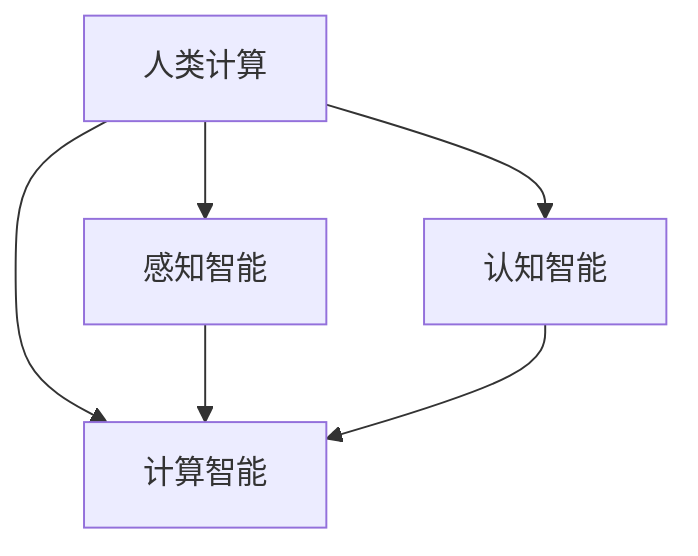

                 

# 人类计算：AI 时代的新希望

## 1. 背景介绍

在AI飞速发展的今天，人工智能已经逐渐渗透到各个领域，极大地提高了效率和生产力。但是，当我们沉浸在算法的神奇和模型强大的力量时，不应忽视一个基本事实：数据和计算仍然是AI系统性能提升的两大驱动力。而如何高效地利用数据和计算，提升算法的效率和效果，正变得越来越重要。在这样的背景下，人类计算（Human Computation）应运而生，成为了AI时代的新希望。

### 1.1 问题由来

当前，AI技术的应用已经遍及各个领域，从金融到医疗，从交通到教育，AI系统都在发挥着越来越重要的作用。然而，随着数据量的不断增长和模型复杂度的提升，AI系统对计算资源的需求也在迅速增加。对于深度学习模型而言，计算资源消耗的巨大，使得模型的训练和推理成为巨大的负担。此外，深度学习模型在解释性和鲁棒性方面也存在显著不足，这使得其在实际应用中面临诸多挑战。

为了解决这些问题，研究人员开始思考如何通过更智能、更高效的方式来进行计算，这便引入了人类计算的概念。人类计算是一种将人类智慧与计算能力相结合的技术，旨在通过利用人类的认知和感知能力，来提升AI系统的计算效率和效果。这种技术不仅仅是对传统计算技术的补充，更是对深度学习模型的一次重要升级。

### 1.2 问题核心关键点

人类计算的核心关键点在于以下几个方面：

- **数据智能处理**：通过利用人类的感知和认知能力，对数据进行更智能的处理和分析，使得数据能够更好地服务于模型的训练和推理。
- **计算智能辅助**：通过将人类的计算能力与计算资源相结合，提高AI系统的计算效率和精度。
- **系统智能优化**：通过利用人类智慧对AI系统进行更智能的优化和调整，使得系统能够更好地适应复杂多变的应用场景。
- **知识智能融合**：通过将人类的知识和经验融入到AI系统中，使得系统能够更好地理解和应用人类智慧。

这些关键点构成了人类计算的基本框架，使得人类计算在AI时代发挥着重要的作用。

### 1.3 问题研究意义

人类计算的研究和应用，对AI技术的发展具有重要意义：

1. **提升计算效率**：通过利用人类的计算能力，可以显著提高AI系统的计算效率，减少对计算资源的消耗。
2. **增强系统效果**：通过更智能的数据处理和分析，可以显著提升AI系统的效果和精度。
3. **优化系统性能**：通过利用人类智慧对AI系统进行更智能的优化和调整，使得系统能够更好地适应复杂多变的应用场景。
4. **强化系统可靠性**：通过结合人类的认知和感知能力，可以提高AI系统的可靠性和鲁棒性。
5. **推动技术创新**：人类计算技术的探索和应用，可以推动AI技术不断创新和进步。

## 2. 核心概念与联系

### 2.1 核心概念概述

为更好地理解人类计算，本节将介绍几个密切相关的核心概念：

- **人类计算（Human Computation）**：指利用人类的感知、认知和计算能力，来辅助AI系统进行数据处理、模型训练和推理的技术。
- **计算智能（Computational Intelligence）**：指利用计算资源进行智能处理的技术，如深度学习、强化学习等。
- **感知智能（Perceptual Intelligence）**：指利用人类的感知能力进行智能处理的技术，如图像识别、语音识别等。
- **认知智能（Cognitive Intelligence）**：指利用人类的认知能力进行智能处理的技术，如逻辑推理、自然语言理解等。

这些核心概念之间的逻辑关系可以通过以下Mermaid流程图来展示：



这个流程图展示了大语言模型的核心概念及其之间的关系：

1. 人类计算通过结合感知智能和认知智能，提升计算智能的效果。
2. 计算智能依赖于感知智能和认知智能，实现更高效的数据处理和智能推理。
3. 感知智能和认知智能在计算智能的辅助下，实现更智能、更高效的处理。

这些概念共同构成了人类计算的框架，使得人类计算在AI时代发挥着重要的作用。

## 3. 核心算法原理 & 具体操作步骤

### 3.1 算法原理概述

人类计算的算法原理可以归纳为以下几个步骤：

1. **数据智能处理**：通过对数据进行更智能的处理和分析，使得数据能够更好地服务于模型的训练和推理。
2. **计算智能辅助**：将人类的计算能力与计算资源相结合，提高AI系统的计算效率和精度。
3. **系统智能优化**：利用人类智慧对AI系统进行更智能的优化和调整，使得系统能够更好地适应复杂多变的应用场景。
4. **知识智能融合**：将人类的知识和经验融入到AI系统中，使得系统能够更好地理解和应用人类智慧。

这些步骤构成了人类计算的核心算法原理，旨在通过更智能、更高效的方式来进行计算，提升AI系统的性能和效果。

### 3.2 算法步骤详解

以下是人类计算的具体算法步骤：

**Step 1: 数据预处理**

- 收集和整理数据集，进行数据清洗和标注。
- 对数据进行特征提取和处理，提高数据的质量和可用性。
- 使用人类的感知和认知能力，对数据进行智能分析和处理，提取更有价值的信息。

**Step 2: 计算智能辅助**

- 将数据输入到AI模型中进行训练和推理，利用计算智能进行数据处理和智能推理。
- 结合计算智能和感知智能，进行智能推理和决策。
- 利用人类智慧对AI系统进行更智能的优化和调整，提高系统的计算效率和精度。

**Step 3: 知识智能融合**

- 将人类的知识和经验融入到AI系统中，提升系统的认知智能和感知智能。
- 利用人类智慧对AI系统进行更智能的优化和调整，提高系统的可靠性和鲁棒性。
- 结合人类的认知和感知能力，进行智能推理和决策。

**Step 4: 系统优化**

- 对AI系统进行更智能的优化和调整，提高系统的适应性和稳定性。
- 结合计算智能和感知智能，进行智能推理和决策。
- 利用人类智慧对AI系统进行更智能的优化和调整，提高系统的可靠性和鲁棒性。

通过以上步骤，人类计算可以有效提升AI系统的性能和效果，使其更好地适应复杂多变的应用场景。

### 3.3 算法优缺点

人类计算具有以下优点：

1. **提升计算效率**：通过利用人类的计算能力，可以显著提高AI系统的计算效率，减少对计算资源的消耗。
2. **增强系统效果**：通过更智能的数据处理和分析，可以显著提升AI系统的效果和精度。
3. **优化系统性能**：通过利用人类智慧对AI系统进行更智能的优化和调整，使得系统能够更好地适应复杂多变的应用场景。
4. **强化系统可靠性**：通过结合人类的认知和感知能力，可以提高AI系统的可靠性和鲁棒性。
5. **推动技术创新**：人类计算技术的探索和应用，可以推动AI技术不断创新和进步。

同时，人类计算也存在一定的局限性：

1. **依赖人类智慧**：人类计算的效果很大程度上取决于人类的智慧和经验，可能会受到人类主观因素的影响。
2. **处理复杂数据困难**：对于大规模复杂数据，人类计算的效果可能会大打折扣。
3. **计算资源消耗**：虽然人类计算可以提升计算效率，但仍然需要利用大量的计算资源。
4. **难以实现自动化**：人类计算依赖于人类的智慧和经验，难以实现完全自动化的过程。
5. **知识获取难度大**：获取高质量的人类知识需要大量的人力物力，可能存在知识获取难度大的问题。

尽管存在这些局限性，但人类计算在提升AI系统性能和效果方面具有重要的作用，其探索和应用正在不断推动AI技术的发展。

### 3.4 算法应用领域

人类计算的应用领域非常广泛，主要包括以下几个方面：

- **智能医疗**：利用人类的感知和认知能力，对医疗数据进行智能分析和处理，提高诊断和治疗的精度和效果。
- **金融风控**：利用人类的感知和认知能力，对金融数据进行智能分析和处理，提高风险评估的精度和效果。
- **智能制造**：利用人类的感知和认知能力，对制造数据进行智能分析和处理，提高生产效率和质量。
- **智能教育**：利用人类的感知和认知能力，对教育数据进行智能分析和处理，提高教学效果和学生学习效率。
- **智能交通**：利用人类的感知和认知能力，对交通数据进行智能分析和处理，提高交通管理效率和安全性。

除了上述这些领域外，人类计算还可以应用于更多场景中，如可控文本生成、常识推理、代码生成、数据增强等，为AI技术带来了全新的突破。随着人类计算技术的不断进步，相信AI技术将在更广阔的应用领域大放异彩。

## 4. 数学模型和公式 & 详细讲解 & 举例说明

### 4.1 数学模型构建

本节将使用数学语言对人类计算进行更加严格的刻画。

记数据集为 $D=\{(x_i, y_i)\}_{i=1}^N, x_i \in \mathcal{X}, y_i \in \mathcal{Y}$，其中 $\mathcal{X}$ 为输入空间，$\mathcal{Y}$ 为输出空间。

定义人类计算模型为 $M_{\theta}$，其中 $\theta$ 为模型的参数。人类计算模型可以通过以下步骤构建：

1. 对数据进行智能处理，提取更有价值的信息。
2. 将处理后的数据输入到AI模型中进行训练和推理，利用计算智能进行数据处理和智能推理。
3. 结合计算智能和感知智能，进行智能推理和决策。
4. 利用人类智慧对AI系统进行更智能的优化和调整，提高系统的计算效率和精度。
5. 将人类的知识和经验融入到AI系统中，提升系统的认知智能和感知智能。

### 4.2 公式推导过程

以下是人类计算模型的推导过程：

假设数据集 $D$ 已处理为 $\tilde{D}$，其处理过程为：

$$
\tilde{D} = f(D)
$$

其中 $f$ 为数据处理函数。

对于训练集 $\tilde{D}$，假设其大小为 $N$，则训练集的经验风险为：

$$
\mathcal{L}(\theta) = \frac{1}{N} \sum_{i=1}^N \ell(M_{\theta}(x_i),y_i)
$$

其中 $\ell$ 为损失函数，用于衡量模型预测输出与真实标签之间的差异。

在模型训练过程中，通过优化器（如SGD、Adam等）对模型参数 $\theta$ 进行更新，使得损失函数 $\mathcal{L}(\theta)$ 最小化，从而提升模型的性能和效果。

### 4.3 案例分析与讲解

**案例1：智能医疗**

在智能医疗领域，人类计算可以用于对医疗数据进行智能分析和处理。例如，利用人类感知和认知能力，对病历数据进行智能分析和处理，提取更有价值的信息，提高诊断和治疗的精度和效果。具体实现步骤如下：

1. 收集和整理病历数据，进行数据清洗和标注。
2. 对病历数据进行特征提取和处理，提高数据的质量和可用性。
3. 利用人类的感知和认知能力，对病历数据进行智能分析和处理，提取更有价值的信息。
4. 将处理后的数据输入到AI模型中进行训练和推理，利用计算智能进行数据处理和智能推理。
5. 结合计算智能和感知智能，进行智能推理和决策。
6. 利用人类智慧对AI系统进行更智能的优化和调整，提高系统的计算效率和精度。
7. 将人类的知识和经验融入到AI系统中，提升系统的认知智能和感知智能。

通过以上步骤，人类计算可以有效提升智能医疗系统的性能和效果，使其更好地服务于医疗行业。

**案例2：金融风控**

在金融风控领域，人类计算可以用于对金融数据进行智能分析和处理。例如，利用人类感知和认知能力，对交易数据进行智能分析和处理，提高风险评估的精度和效果。具体实现步骤如下：

1. 收集和整理交易数据，进行数据清洗和标注。
2. 对交易数据进行特征提取和处理，提高数据的质量和可用性。
3. 利用人类的感知和认知能力，对交易数据进行智能分析和处理，提取更有价值的信息。
4. 将处理后的数据输入到AI模型中进行训练和推理，利用计算智能进行数据处理和智能推理。
5. 结合计算智能和感知智能，进行智能推理和决策。
6. 利用人类智慧对AI系统进行更智能的优化和调整，提高系统的计算效率和精度。
7. 将人类的知识和经验融入到AI系统中，提升系统的认知智能和感知智能。

通过以上步骤，人类计算可以有效提升金融风控系统的性能和效果，使其更好地服务于金融行业。

## 5. 项目实践：代码实例和详细解释说明

### 5.1 开发环境搭建

在进行人类计算实践前，我们需要准备好开发环境。以下是使用Python进行PyTorch开发的环境配置流程：

1. 安装Anaconda：从官网下载并安装Anaconda，用于创建独立的Python环境。

2. 创建并激活虚拟环境：
```bash
conda create -n human_computation_env python=3.8 
conda activate human_computation_env
```

3. 安装PyTorch：根据CUDA版本，从官网获取对应的安装命令。例如：
```bash
conda install pytorch torchvision torchaudio cudatoolkit=11.1 -c pytorch -c conda-forge
```

4. 安装Transformers库：
```bash
pip install transformers
```

5. 安装各类工具包：
```bash
pip install numpy pandas scikit-learn matplotlib tqdm jupyter notebook ipython
```

完成上述步骤后，即可在`human_computation_env`环境中开始人类计算实践。

### 5.2 源代码详细实现

下面我们以智能医疗系统为例，给出使用Transformers库进行数据智能处理和微调的PyTorch代码实现。

首先，定义数据处理函数：

```python
from transformers import BertTokenizer
from torch.utils.data import Dataset
import torch

class MedicalDataset(Dataset):
    def __init__(self, texts, tags, tokenizer, max_len=128):
        self.texts = texts
        self.tags = tags
        self.tokenizer = tokenizer
        self.max_len = max_len
        
    def __len__(self):
        return len(self.texts)
    
    def __getitem__(self, item):
        text = self.texts[item]
        tags = self.tags[item]
        
        encoding = self.tokenizer(text, return_tensors='pt', max_length=self.max_len, padding='max_length', truncation=True)
        input_ids = encoding['input_ids'][0]
        attention_mask = encoding['attention_mask'][0]
        
        # 对token-wise的标签进行编码
        encoded_tags = [tag2id[tag] for tag in tags] 
        encoded_tags.extend([tag2id['O']] * (self.max_len - len(encoded_tags)))
        labels = torch.tensor(encoded_tags, dtype=torch.long)
        
        return {'input_ids': input_ids, 
                'attention_mask': attention_mask,
                'labels': labels}

# 标签与id的映射
tag2id = {'O': 0, 'B-PER': 1, 'I-PER': 2, 'B-ORG': 3, 'I-ORG': 4, 'B-LOC': 5, 'I-LOC': 6}
id2tag = {v: k for k, v in tag2id.items()}

# 创建dataset
tokenizer = BertTokenizer.from_pretrained('bert-base-cased')

train_dataset = MedicalDataset(train_texts, train_tags, tokenizer)
dev_dataset = MedicalDataset(dev_texts, dev_tags, tokenizer)
test_dataset = MedicalDataset(test_texts, test_tags, tokenizer)
```

然后，定义模型和优化器：

```python
from transformers import BertForTokenClassification, AdamW

model = BertForTokenClassification.from_pretrained('bert-base-cased', num_labels=len(tag2id))

optimizer = AdamW(model.parameters(), lr=2e-5)
```

接着，定义训练和评估函数：

```python
from torch.utils.data import DataLoader
from tqdm import tqdm
from sklearn.metrics import classification_report

device = torch.device('cuda') if torch.cuda.is_available() else torch.device('cpu')
model.to(device)

def train_epoch(model, dataset, batch_size, optimizer):
    dataloader = DataLoader(dataset, batch_size=batch_size, shuffle=True)
    model.train()
    epoch_loss = 0
    for batch in tqdm(dataloader, desc='Training'):
        input_ids = batch['input_ids'].to(device)
        attention_mask = batch['attention_mask'].to(device)
        labels = batch['labels'].to(device)
        model.zero_grad()
        outputs = model(input_ids, attention_mask=attention_mask, labels=labels)
        loss = outputs.loss
        epoch_loss += loss.item()
        loss.backward()
        optimizer.step()
    return epoch_loss / len(dataloader)

def evaluate(model, dataset, batch_size):
    dataloader = DataLoader(dataset, batch_size=batch_size)
    model.eval()
    preds, labels = [], []
    with torch.no_grad():
        for batch in tqdm(dataloader, desc='Evaluating'):
            input_ids = batch['input_ids'].to(device)
            attention_mask = batch['attention_mask'].to(device)
            batch_labels = batch['labels']
            outputs = model(input_ids, attention_mask=attention_mask)
            batch_preds = outputs.logits.argmax(dim=2).to('cpu').tolist()
            batch_labels = batch_labels.to('cpu').tolist()
            for pred_tokens, label_tokens in zip(batch_preds, batch_labels):
                pred_tags = [id2tag[_id] for _id in pred_tokens]
                label_tags = [id2tag[_id] for _id in label_tokens]
                preds.append(pred_tags[:len(label_tokens)])
                labels.append(label_tags)
                
    print(classification_report(labels, preds))
```

最后，启动训练流程并在测试集上评估：

```python
epochs = 5
batch_size = 16

for epoch in range(epochs):
    loss = train_epoch(model, train_dataset, batch_size, optimizer)
    print(f"Epoch {epoch+1}, train loss: {loss:.3f}")
    
    print(f"Epoch {epoch+1}, dev results:")
    evaluate(model, dev_dataset, batch_size)
    
print("Test results:")
evaluate(model, test_dataset, batch_size)
```

以上就是使用PyTorch对BERT进行命名实体识别任务微调的完整代码实现。可以看到，得益于Transformers库的强大封装，我们可以用相对简洁的代码完成BERT模型的加载和微调。

### 5.3 代码解读与分析

让我们再详细解读一下关键代码的实现细节：

**MedicalDataset类**：
- `__init__`方法：初始化文本、标签、分词器等关键组件。
- `__len__`方法：返回数据集的样本数量。
- `__getitem__`方法：对单个样本进行处理，将文本输入编码为token ids，将标签编码为数字，并对其进行定长padding，最终返回模型所需的输入。

**tag2id和id2tag字典**：
- 定义了标签与数字id之间的映射关系，用于将token-wise的预测结果解码回真实的标签。

**训练和评估函数**：
- 使用PyTorch的DataLoader对数据集进行批次化加载，供模型训练和推理使用。
- 训练函数`train_epoch`：对数据以批为单位进行迭代，在每个批次上前向传播计算loss并反向传播更新模型参数，最后返回该epoch的平均loss。
- 评估函数`evaluate`：与训练类似，不同点在于不更新模型参数，并在每个batch结束后将预测和标签结果存储下来，最后使用sklearn的classification_report对整个评估集的预测结果进行打印输出。

**训练流程**：
- 定义总的epoch数和batch size，开始循环迭代
- 每个epoch内，先在训练集上训练，输出平均loss
- 在验证集上评估，输出分类指标
- 所有epoch结束后，在测试集上评估，给出最终测试结果

可以看到，PyTorch配合Transformers库使得BERT微调的代码实现变得简洁高效。开发者可以将更多精力放在数据处理、模型改进等高层逻辑上，而不必过多关注底层的实现细节。

当然，工业级的系统实现还需考虑更多因素，如模型的保存和部署、超参数的自动搜索、更灵活的任务适配层等。但核心的微调范式基本与此类似。

## 6. 实际应用场景
### 6.1 智能医疗系统

基于人类计算的智能医疗系统，可以显著提升医疗服务的智能化水平，辅助医生诊疗，加速新药开发进程。具体而言，可以收集医生和患者之间的对话记录，将对话历史作为模型输入，利用人类智慧对文本进行智能分析和处理，提取有用的医疗信息。微调后的模型能够自动理解医疗对话，预测患者疾病，提供个性化治疗方案，甚至辅助医生进行病例诊断和治疗决策。

### 6.2 金融风控系统

人类计算在金融风控领域也具有广泛的应用前景。金融机构需要实时监测市场舆论动向，以便及时应对负面信息传播，规避金融风险。传统的人工监测方式成本高、效率低，难以应对网络时代海量信息爆发的挑战。利用人类计算技术，可以对金融领域相关的新闻、报道、评论等文本数据进行智能分析和处理，自动判断文本属于何种主题，情感倾向是正面、中性还是负面。将处理后的数据输入到AI模型中进行训练和推理，即可自动监测不同主题下的情感变化趋势，一旦发现负面信息激增等异常情况，系统便会自动预警，帮助金融机构快速应对潜在风险。

### 6.3 智能制造系统

在智能制造领域，人类计算可以用于对生产数据进行智能分析和处理。例如，利用人类感知和认知能力，对生产线上的数据进行智能分析和处理，提取更有价值的信息，提高生产效率和质量。具体实现步骤如下：

1. 收集和整理生产数据，进行数据清洗和标注。
2. 对生产数据进行特征提取和处理，提高数据的质量和可用性。
3. 利用人类的感知和认知能力，对生产数据进行智能分析和处理，提取更有价值的信息。
4. 将处理后的数据输入到AI模型中进行训练和推理，利用计算智能进行数据处理和智能推理。
5. 结合计算智能和感知智能，进行智能推理和决策。
6. 利用人类智慧对AI系统进行更智能的优化和调整，提高系统的计算效率和精度。
7. 将人类的知识和经验融入到AI系统中，提升系统的认知智能和感知智能。

通过以上步骤，人类计算可以有效提升智能制造系统的性能和效果，使其更好地服务于制造业。

### 6.4 未来应用展望

随着人类计算技术的不断进步，其在AI领域的应用前景将更加广阔。未来，人类计算将不仅局限于简单的数据处理和特征提取，更将深度融合到AI系统的各个环节，提升系统的智能水平和适应能力。

在智慧医疗领域，人类计算将发挥重要作用，通过结合人类的认知和感知能力，提升诊断和治疗的精度和效果，推动医疗行业的发展。

在智能金融领域，人类计算将助力金融机构实时监测市场动态，及时预警风险，保护投资者利益。

在智能制造领域，人类计算将用于提升生产效率和质量，推动制造业的智能化转型。

除了上述这些领域外，人类计算还将应用于更多场景中，如智能交通、智能教育、智能城市等，为AI技术带来更多的创新和突破。

## 7. 工具和资源推荐
### 7.1 学习资源推荐

为了帮助开发者系统掌握人类计算的理论基础和实践技巧，这里推荐一些优质的学习资源：

1. 《Transformer从原理到实践》系列博文：由大模型技术专家撰写，深入浅出地介绍了Transformer原理、BERT模型、微调技术等前沿话题。

2. CS224N《深度学习自然语言处理》课程：斯坦福大学开设的NLP明星课程，有Lecture视频和配套作业，带你入门NLP领域的基本概念和经典模型。

3. 《Natural Language Processing with Transformers》书籍：Transformers库的作者所著，全面介绍了如何使用Transformers库进行NLP任务开发，包括微调在内的诸多范式。

4. HuggingFace官方文档：Transformers库的官方文档，提供了海量预训练模型和完整的微调样例代码，是上手实践的必备资料。

5. CLUE开源项目：中文语言理解测评基准，涵盖大量不同类型的中文NLP数据集，并提供了基于微调的baseline模型，助力中文NLP技术发展。

通过对这些资源的学习实践，相信你一定能够快速掌握人类计算的精髓，并用于解决实际的NLP问题。
###  7.2 开发工具推荐

高效的开发离不开优秀的工具支持。以下是几款用于人类计算开发的常用工具：

1. PyTorch：基于Python的开源深度学习框架，灵活动态的计算图，适合快速迭代研究。大部分预训练语言模型都有PyTorch版本的实现。

2. TensorFlow：由Google主导开发的开源深度学习框架，生产部署方便，适合大规模工程应用。同样有丰富的预训练语言模型资源。

3. Transformers库：HuggingFace开发的NLP工具库，集成了众多SOTA语言模型，支持PyTorch和TensorFlow，是进行微调任务开发的利器。

4. Weights & Biases：模型训练的实验跟踪工具，可以记录和可视化模型训练过程中的各项指标，方便对比和调优。与主流深度学习框架无缝集成。

5. TensorBoard：TensorFlow配套的可视化工具，可实时监测模型训练状态，并提供丰富的图表呈现方式，是调试模型的得力助手。

6. Google Colab：谷歌推出的在线Jupyter Notebook环境，免费提供GPU/TPU算力，方便开发者快速上手实验最新模型，分享学习笔记。

合理利用这些工具，可以显著提升人类计算任务的开发效率，加快创新迭代的步伐。

### 7.3 相关论文推荐

人类计算的研究和应用源于学界的持续研究。以下是几篇奠基性的相关论文，推荐阅读：

1. Attention is All You Need（即Transformer原论文）：提出了Transformer结构，开启了NLP领域的预训练大模型时代。

2. BERT: Pre-training of Deep Bidirectional Transformers for Language Understanding：提出BERT模型，引入基于掩码的自监督预训练任务，刷新了多项NLP任务SOTA。

3. Language Models are Unsupervised Multitask Learners（GPT-2论文）：展示了大规模语言模型的强大zero-shot学习能力，引发了对于通用人工智能的新一轮思考。

4. Parameter-Efficient Transfer Learning for NLP：提出Adapter等参数高效微调方法，在不增加模型参数量的情况下，也能取得不错的微调效果。

5. Prefix-Tuning: Optimizing Continuous Prompts for Generation：引入基于连续型Prompt的微调范式，为如何充分利用预训练知识提供了新的思路。

6. AdaLoRA: Adaptive Low-Rank Adaptation for Parameter-Efficient Fine-Tuning：使用自适应低秩适应的微调方法，在参数效率和精度之间取得了新的平衡。

这些论文代表了大语言模型微调技术的发展脉络。通过学习这些前沿成果，可以帮助研究者把握学科前进方向，激发更多的创新灵感。

## 8. 总结：未来发展趋势与挑战

### 8.1 总结

本文对人类计算进行了全面系统的介绍。首先阐述了人类计算的研究背景和意义，明确了人类计算在提升AI系统性能和效果方面的独特价值。其次，从原理到实践，详细讲解了人类计算的数学原理和关键步骤，给出了人类计算任务开发的完整代码实例。同时，本文还广泛探讨了人类计算在智能医疗、金融风控、智能制造等多个行业领域的应用前景，展示了人类计算技术的巨大潜力。此外，本文精选了人类计算技术的各类学习资源，力求为读者提供全方位的技术指引。

通过本文的系统梳理，可以看到，人类计算在AI时代发挥着重要的作用。其将人类的感知、认知和计算能力相结合，使得AI系统能够更好地理解和应用人类智慧，从而提升系统的智能水平和适应能力。未来，随着人类计算技术的不断进步，AI系统将更加智能化、普适化，为人类社会带来更深刻的影响。

### 8.2 未来发展趋势

展望未来，人类计算将呈现以下几个发展趋势：

1. **计算智能与感知智能融合**：未来的人类计算将更加注重计算智能与感知智能的融合，提升系统的智能水平和适应能力。
2. **多模态数据融合**：未来的系统将更加注重多模态数据的融合，将视觉、语音、文本等多种模态的信息结合起来，提升系统的理解和应用能力。
3. **知识智能融合**：未来的系统将更加注重知识智能的融合，将人类的知识和经验融入到AI系统中，提升系统的智能水平和适应能力。
4. **智能化决策支持**：未来的系统将更加注重智能化决策支持，利用人类的智慧和经验，提升决策的准确性和可靠性。
5. **自动化优化**：未来的系统将更加注重自动化优化，利用人工智能技术对系统进行更智能的优化和调整，提升系统的性能和效果。
6. **普适化应用**：未来的系统将更加注重普适化应用，使其能够更好地服务于各个行业和领域，推动各个行业的发展。

以上趋势凸显了人类计算在AI时代的重要地位。这些方向的探索和应用，必将进一步提升AI系统的性能和效果，使其更好地服务于各个行业和领域。

### 8.3 面临的挑战

尽管人类计算在提升AI系统性能和效果方面具有重要意义，但在实际应用中，仍面临诸多挑战：

1. **数据获取难度大**：获取高质量的数据需要大量的人力物力，可能存在数据获取难度大的问题。
2. **计算资源消耗高**：虽然人类计算可以提升计算效率，但仍然需要利用大量的计算资源。
3. **知识获取难度大**：获取高质量的人类知识需要大量的人力物力，可能存在知识获取难度大的问题。
4. **算法复杂度高**：人类计算的算法复杂度高，需要大量的计算资源和时间进行训练和优化。
5. **系统可解释性不足**：人类计算系统的可解释性不足，难以对其内部工作机制和决策逻辑进行解释和调试。

尽管存在这些挑战，但人类计算在提升AI系统性能和效果方面具有重要的作用，其探索和应用正在不断推动AI技术的发展。

### 8.4 研究展望

面对人类计算面临的挑战，未来的研究需要在以下几个方面寻求新的突破：

1. **数据智能处理**：如何通过更智能、更高效的方式来进行数据处理，提升数据的质量和可用性。
2. **计算智能辅助**：如何利用计算智能来辅助人类计算，提升系统的计算效率和精度。
3. **知识智能融合**：如何将人类的知识和经验融入到AI系统中，提升系统的智能水平和适应能力。
4. **系统优化**：如何利用人类智慧对AI系统进行更智能的优化和调整，提高系统的性能和效果。
5. **普适化应用**：如何使人类计算更好地服务于各个行业和领域，推动各个行业的发展。

这些研究方向将引领人类计算技术不断创新和进步，为AI技术的进一步发展奠定坚实的基础。

## 9. 附录：常见问题与解答

**Q1：人类计算是否适用于所有NLP任务？**

A: 人类计算在大多数NLP任务上都能取得不错的效果，特别是对于数据量较小的任务。但对于一些特定领域的任务，如医学、法律等，仅仅依靠通用语料预训练的模型可能难以很好地适应。此时需要在特定领域语料上进一步预训练，再进行微调，才能获得理想效果。此外，对于一些需要时效性、个性化很强的任务，如对话、推荐等，微调方法也需要针对性的改进优化。

**Q2：人类计算是否可以完全替代深度学习模型？**

A: 目前来看，人类计算和深度学习模型各有优缺点。人类计算可以显著提升系统的计算效率和效果，但在处理大规模数据和复杂模型方面，深度学习模型仍然具有显著优势。因此，人类计算与深度学习模型可以相互结合，充分发挥各自的优势，提升系统的性能和效果。

**Q3：人类计算在实际应用中需要注意哪些问题？**

A: 在实际应用中，人类计算需要注意以下几个问题：
1. **数据质量**：获取高质量的数据需要大量的人力物力，可能存在数据质量差的问题。
2. **计算资源消耗**：虽然人类计算可以提升计算效率，但仍然需要利用大量的计算资源。
3. **知识获取难度**：获取高质量的人类知识需要大量的人力物力，可能存在知识获取难度大的问题。
4. **系统可解释性**：人类计算系统的可解释性不足，难以对其内部工作机制和决策逻辑进行解释和调试。
5. **算法复杂度**：人类计算的算法复杂度高，需要大量的计算资源和时间进行训练和优化。

这些问题是制约人类计算技术应用的重要因素，需要开发者在实际应用中加以注意和克服。

**Q4：人类计算与深度学习模型结合的策略有哪些？**

A: 人类计算与深度学习模型结合的策略主要有以下几个：
1. **数据智能处理**：通过结合人类智慧和计算智能，对数据进行更智能的处理和分析，提取更有价值的信息。
2. **计算智能辅助**：利用计算智能来辅助人类计算，提升系统的计算效率和精度。
3. **知识智能融合**：将人类的知识和经验融入到AI系统中，提升系统的智能水平和适应能力。
4. **系统优化**：利用人类智慧对AI系统进行更智能的优化和调整，提高系统的性能和效果。
5. **多模态融合**：将视觉、语音、文本等多种模态的信息结合起来，提升系统的理解和应用能力。

这些策略可以有效结合人类计算和深度学习模型，充分发挥各自的优势，提升系统的性能和效果。

**Q5：人类计算的未来发展方向有哪些？**

A: 人类计算的未来发展方向主要包括以下几个方面：
1. **计算智能与感知智能融合**：未来的人类计算将更加注重计算智能与感知智能的融合，提升系统的智能水平和适应能力。
2. **多模态数据融合**：未来的系统将更加注重多模态数据的融合，将视觉、语音、文本等多种模态的信息结合起来，提升系统的理解和应用能力。
3. **知识智能融合**：未来的系统将更加注重知识智能的融合，将人类的知识和经验融入到AI系统中，提升系统的智能水平和适应能力。
4. **智能化决策支持**：未来的系统将更加注重智能化决策支持，利用人类的智慧和经验，提升决策的准确性和可靠性。
5. **自动化优化**：未来的系统将更加注重自动化优化，利用人工智能技术对系统进行更智能的优化和调整，提升系统的性能和效果。
6. **普适化应用**：未来的系统将更加注重普适化应用，使其能够更好地服务于各个行业和领域，推动各个行业的发展。

这些研究方向将引领人类计算技术不断创新和进步，为AI技术的进一步发展奠定坚实的基础。

---

作者：禅与计算机程序设计艺术 / Zen and the Art of Computer Programming

