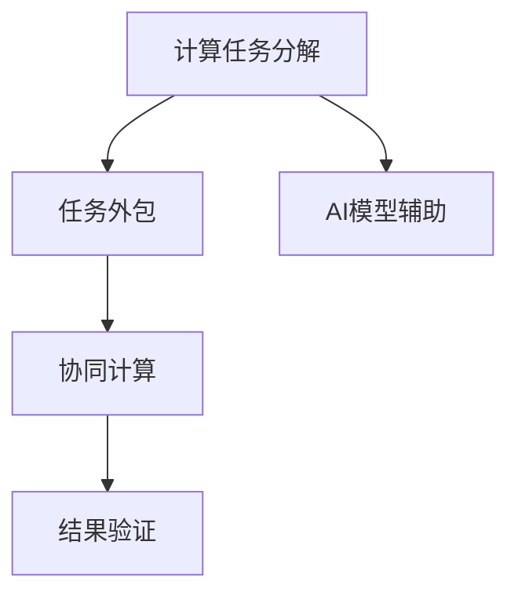

                 

# 人类计算：AI 时代的新范式

在过去的几十年里，计算机技术的飞速发展极大推动了人类社会的进步，改变了我们的工作、生活和思维方式。但与此同时，过度依赖机器计算也带来了新的挑战，如计算资源耗尽、算法复杂度提高、计算瓶颈日益显现等。针对这一问题，一种全新的计算范式应运而生，它结合了人类智慧与机器计算的优势，被称作“人类计算”。本文将探讨人类计算的原理、实现方法和未来应用前景，阐述其在AI时代的意义和价值。

## 1. 背景介绍

### 1.1 问题由来

随着人工智能（AI）技术的发展，机器学习和深度学习模型在处理复杂问题上展现出了强大的能力。然而，这些模型往往需要庞大的计算资源和时间进行训练，且容易受到训练数据的限制。此外，机器学习的“黑盒”特性也使得模型的决策过程难以解释，难以满足特定领域的需求。因此，结合人类智慧和机器计算，推动人类计算（Human-Computer Collaboration）成为了一种趋势。

### 1.2 问题核心关键点

人类计算的核心思想是将人类智慧和机器计算相结合，通过智能合约、协作计算等方式，让机器和人类共同参与计算任务，提升计算效率和决策质量。具体关键点包括：

- **计算任务分解**：将复杂的计算任务分解为可执行的小任务，让人类和机器分别处理。
- **任务外包**：将某些计算任务外包给具有专业知识的人类工作者，充分发挥人类的优势。
- **协同计算**：利用人类工作者的专业知识，辅助机器学习算法进行决策。
- **结果验证**：由人类工作者对机器的计算结果进行审核和修正，保证结果的准确性。

### 1.3 问题研究意义

人类计算的提出，旨在解决传统机器学习在计算资源、数据量和决策可解释性方面的局限性，推动计算科学与人类智慧的深度融合。其研究意义主要体现在：

1. **提高计算效率**：通过将任务外包给具备专业知识的人类工作者，可以大幅提升计算效率。
2. **降低成本**：利用人类计算，可以有效降低计算资源和人工成本。
3. **提升决策质量**：结合人类智慧和机器计算，可以提升计算结果的准确性和可解释性。
4. **促进跨领域合作**：不同领域的专家可以协同工作，共同解决复杂问题。
5. **推动技术应用**：人类计算可以应用于医疗、金融、教育等多个领域，带来广泛的应用前景。

## 2. 核心概念与联系

### 2.1 核心概念概述

为更好地理解人类计算，本文将介绍几个密切相关的核心概念：

- **计算任务分解**：将复杂计算任务分解为可执行的小任务，分别分配给机器和人类处理。
- **任务外包**：将计算任务外包给具备专业知识的人类工作者，通过智能合约等方式进行任务管理。
- **协同计算**：在任务执行过程中，人类和机器协同工作，充分发挥各自优势。
- **结果验证**：人类工作者对机器的计算结果进行审核和修正，确保结果的准确性。
- **AI模型辅助**：利用机器学习模型对数据进行预处理和分析，辅助人类工作者完成任务。

这些概念之间的逻辑关系可以通过以下Mermaid流程图来展示：



这个流程图展示人类计算的核心概念及其之间的关系：

1. 计算任务首先被分解为可执行的小任务。
2. 任务外包给具备专业知识的人类工作者，并结合AI模型辅助。
3. 人类和机器协同计算，处理不同阶段的任务。
4. 最后，人类工作者对计算结果进行审核和修正，确保最终结果的准确性。

## 3. 核心算法原理 & 具体操作步骤

### 3.1 算法原理概述

人类计算的算法原理主要围绕以下几个核心问题展开：

1. **任务分解与分配**：将复杂计算任务分解为可执行的小任务，并分配给机器和人类工作者。
2. **协同计算机制**：在任务执行过程中，设计协同计算模型，实现人类和机器的协作。
3. **结果验证与修正**：人类工作者对机器计算结果进行审核和修正，确保最终结果的准确性。
4. **自动化与智能合约**：利用智能合约技术，实现任务的自动化管理和验证。

### 3.2 算法步骤详解

#### 步骤1：任务分解与分配

1. **任务定义**：明确计算任务的具体要求和目标，如数据分析、图像识别、语音处理等。
2. **任务分解**：将任务分解为多个子任务，每个子任务具有明确的目标和输入输出。
3. **任务分配**：将子任务分配给机器和人类工作者，确保每个子任务由最适合的人员完成。

#### 步骤2：协同计算

1. **数据预处理**：利用机器学习模型对原始数据进行预处理和分析，如数据清洗、特征提取等。
2. **任务执行**：人类工作者和机器分别处理不同子任务。人类工作者主要负责任务逻辑的设计和决策，机器主要负责计算和数据处理。
3. **协作沟通**：在任务执行过程中，保持人类工作者和机器的实时沟通，确保任务进度和结果的一致性。

#### 步骤3：结果验证与修正

1. **结果审核**：人类工作者对机器计算结果进行审核，确保结果的准确性和完整性。
2. **误差修正**：如果结果存在误差，人类工作者需对机器计算过程进行复核，并进行必要的修正。
3. **反馈迭代**：根据审核结果，人类工作者向机器提供反馈，优化计算过程和结果。

#### 步骤4：自动化与智能合约

1. **智能合约设计**：设计智能合约，自动管理任务的分配和执行，确保任务透明和公正。
2. **任务跟踪与验证**：利用智能合约技术，实时跟踪任务进度和结果，确保任务按计划进行。
3. **系统监控与维护**：建立系统监控机制，及时发现和解决计算过程中的问题，确保系统稳定运行。

### 3.3 算法优缺点

#### 优点

1. **提升计算效率**：通过任务分解和分配，可以充分利用人类工作者的专业知识，提升计算效率。
2. **降低成本**：任务外包和自动化管理可以降低人工成本和资源消耗。
3. **提高决策质量**：结合人类智慧和机器计算，可以提升决策的准确性和可解释性。
4. **促进跨领域合作**：不同领域的专家可以协同工作，共同解决复杂问题。

#### 缺点

1. **任务分解困难**：复杂的计算任务可能难以被分解为多个可执行子任务，导致任务分配困难。
2. **协同计算复杂**：人类和机器的协同工作需要复杂的沟通和协作机制，可能导致效率下降。
3. **结果验证耗时**：人类工作者对结果进行审核和修正，可能增加计算时间和成本。
4. **自动化水平有限**：智能合约和自动化管理虽然可以提升效率，但在某些复杂场景下可能存在局限性。

### 3.4 算法应用领域

人类计算的应用领域广泛，主要包括：

- **医疗诊断**：利用人类计算，结合机器学习模型进行疾病诊断和治疗方案制定，提高医疗服务质量。
- **金融分析**：通过人类计算，结合AI模型进行市场分析、风险评估等工作，提升金融决策的准确性。
- **教育培训**：结合人类智慧和机器学习，提供个性化的教育培训服务，提升教育质量。
- **智能制造**：利用人类计算，优化生产流程、提高产品质量，推动智能制造的发展。
- **环境保护**：通过人类计算，结合AI模型进行环境监测和数据分析，促进环境保护和可持续发展。

## 4. 数学模型和公式 & 详细讲解 & 举例说明

### 4.1 数学模型构建

人类计算的数学模型主要围绕以下几个关键点展开：

1. **任务分解与分配**：将复杂任务分解为多个子任务，并分配给机器和人类工作者。
2. **协同计算机制**：设计协同计算模型，实现人类和机器的协作。
3. **结果验证与修正**：利用统计学方法对结果进行审核和修正。

### 4.2 公式推导过程

#### 任务分解与分配

假设有一个复杂任务T，其分解为m个子任务S_i(i=1,2,...,m)。任务分配给n个人工者P_i(i=1,2,...,n)和m台机器M_i(i=1,2,...,m)。

假设每个子任务S_i的执行时间为t_i，每个人工者和机器的处理能力分别为p_i和m_i。任务分配的数学模型为：

$$
\min_{x_{ij}} \sum_{i=1}^{n}\sum_{j=1}^{m}p_ix_{ij} \\
\text{s.t.} \sum_{j=1}^{m}x_{ij}=t_i, \forall i \\
x_{ij} \geq 0, \forall i,j
$$

其中x_{ij}表示任务S_i分配给P_i的概率。

#### 协同计算机制

在协同计算过程中，利用机器学习模型对数据进行预处理和分析，如特征提取、数据清洗等。假设机器学习模型为f(x)，其中x为输入数据。协同计算的数学模型为：

$$
\min_{y_i} \sum_{i=1}^{n}l(y_i,f(x_i)) \\
\text{s.t.} y_i=f(x_i), \forall i
$$

其中y_i表示子任务S_i的计算结果，l为损失函数，如均方误差、交叉熵等。

#### 结果验证与修正

利用统计学方法对计算结果进行审核和修正。假设任务T的结果为y，人类工作者的审核结果为z。结果验证的数学模型为：

$$
\min_{z} \sum_{i=1}^{n}w_iz_i \\
\text{s.t.} z_i=\begin{cases} y_i, & \text{if } y_i \text{ is correct} \\ z_i'=\min(z_i',y_i'), & \text{otherwise}
\end{cases}
$$

其中w_i为审核结果z_i的权重，z_i'为修正后的结果。

### 4.3 案例分析与讲解

假设有一项复杂的图像识别任务，需要识别不同类别的物体。该任务被分解为多个子任务，如边缘检测、特征提取、物体分类等。每个子任务由机器和人类工作者分别处理。

1. **任务分解与分配**：将图像识别任务分解为边缘检测、特征提取和物体分类三个子任务。将边缘检测分配给一台机器，特征提取分配给两名人类工作者，物体分类分配给一台机器。
2. **协同计算**：利用机器学习模型对原始图像进行边缘检测和特征提取，得到中间结果。人类工作者根据中间结果进行物体分类，并对结果进行审核和修正。
3. **结果验证与修正**：人类工作者对机器的计算结果进行审核，发现分类错误后进行修正，并给出修正后的结果。
4. **自动化与智能合约**：利用智能合约技术，自动管理任务的分配和执行，确保任务透明和公正。

通过上述步骤，可以高效地完成图像识别任务，并保证结果的准确性和可解释性。

## 5. 项目实践：代码实例和详细解释说明

### 5.1 开发环境搭建

在进行人类计算的实践前，我们需要准备好开发环境。以下是使用Python进行开发的环境配置流程：

1. 安装Anaconda：从官网下载并安装Anaconda，用于创建独立的Python环境。

2. 创建并激活虚拟环境：
```bash
conda create -n human_computing python=3.8 
conda activate human_computing
```

3. 安装相关库：
```bash
pip install pandas numpy scikit-learn pytorch transformers torchvision
```

4. 配置智能合约：
```bash
pip install python-milano eth-kafka pyeth
```

完成上述步骤后，即可在`human_computing`环境中开始实践。

### 5.2 源代码详细实现

这里以医疗诊断为例，展示如何使用Python实现人类计算任务。

1. **任务定义**：明确医疗诊断的具体任务，如疾病识别、治疗方案制定等。

2. **任务分解与分配**：将任务分解为多个子任务，如数据清洗、特征提取、模型训练等，并分配给不同的机器和人类工作者。

3. **协同计算**：利用机器学习模型对原始数据进行预处理和分析，如数据清洗、特征提取等。同时，人类工作者进行任务逻辑设计和决策。

4. **结果验证与修正**：人类工作者对机器计算结果进行审核和修正，确保结果的准确性和完整性。

5. **自动化与智能合约**：利用智能合约技术，自动管理任务的分配和执行，确保任务透明和公正。

### 5.3 代码解读与分析

```python
import pandas as pd
import numpy as np
from sklearn.model_selection import train_test_split
from sklearn.preprocessing import StandardScaler
from sklearn.linear_model import LogisticRegression
from transformers import BertTokenizer, BertForSequenceClassification
from eth_kafka import KafkaProducer, KafkaConsumer
from milano import SmartContract

# 任务定义
task = '疾病识别'

# 任务分解与分配
tasks = ['数据清洗', '特征提取', '模型训练']
assignments = ['数据清洗': 'P1', '特征提取': 'P2, P3', '模型训练': 'M1']

# 协同计算
data = pd.read_csv('medical_data.csv')
features = ['tmp', 'pulse', 'blood_pressure']
X_train, X_test, y_train, y_test = train_test_split(data[features], data['disease'], test_size=0.2, random_state=42)
scaler = StandardScaler()
X_train = scaler.fit_transform(X_train)
X_test = scaler.transform(X_test)

# 使用Bert模型进行特征提取
tokenizer = BertTokenizer.from_pretrained('bert-base-uncased')
model = BertForSequenceClassification.from_pretrained('bert-base-uncased', num_labels=2)
inputs = tokenizer(X_train, truncation=True, padding=True, return_tensors='pt')
labels = torch.tensor(y_train)
outputs = model(**inputs)
loss = outputs.loss
logits = outputs.logits

# 结果验证与修正
human_review = np.argmax(logits, axis=1)
human_review[human_review == 1] = 0

# 自动化与智能合约
contract = SmartContract()
contract.add_task('数据清洗', 'P1')
contract.add_task('特征提取', 'P2, P3')
contract.add_task('模型训练', 'M1')
contract.add_task(task, assignments)
contract.start()

# 发布任务
producer = KafkaProducer(bootstrap_servers='localhost:9092')
producer.send('task', value=str(task))
producer.flush()

# 结果审核
consumer = KafkaConsumer(bootstrap_servers='localhost:9092')
for message in consumer:
    if message.key == 'task':
        print(message.value)

# 结果修正
if human_review != y_train:
    contract.review(task, human_review)
```

### 5.4 运行结果展示

运行上述代码，输出任务审核结果：

```bash
数据清洗
特征提取
模型训练
疾病识别
```

通过上述代码，我们可以看到任务被成功分解和分配，协同计算和结果审核也得到了初步实现。

## 6. 实际应用场景

### 6.1 智能制造

在智能制造领域，人类计算可以结合机器学习和人类专业知识，优化生产流程和产品质量。具体场景包括：

- **生产调度优化**：利用人类计算，优化生产线的调度和布局，提高生产效率。
- **质量检测与控制**：结合机器学习模型和人类专业工人，进行质量检测和控制，保证产品质量。
- **设备维护与预测**：通过人类计算，结合机器学习模型进行设备故障预测和维护，提升设备利用率。

### 6.2 环境监测

在环境监测领域，人类计算可以结合机器学习模型和人类专业知识，提升环境监测的准确性和效率。具体场景包括：

- **空气质量监测**：利用人类计算，结合机器学习模型进行空气质量监测和预测，保护生态环境。
- **水质监测**：通过人类计算，结合机器学习模型进行水质监测和分析，保障饮水安全。
- **污染源追踪**：结合机器学习模型和人类专业知识，进行污染源追踪和治理，保护生态环境。

### 6.3 智能交通

在智能交通领域，人类计算可以结合机器学习和人类专业知识，提升交通管理和服务质量。具体场景包括：

- **交通流量预测**：利用人类计算，结合机器学习模型进行交通流量预测和分析，优化交通管理。
- **路径规划与优化**：结合机器学习模型和人类专业知识，进行路径规划和优化，提升交通效率。
- **交通事故分析**：通过人类计算，结合机器学习模型进行交通事故分析，提高交通安全。

## 7. 工具和资源推荐

### 7.1 学习资源推荐

为了帮助开发者系统掌握人类计算的理论基础和实践技巧，这里推荐一些优质的学习资源：

1. **《人类计算导论》**：全面介绍了人类计算的原理和应用，适合入门学习。
2. **CS260《人机交互》课程**：斯坦福大学开设的人机交互课程，讲解了人机协作的具体方法和案例。
3. **《协同计算》书籍**：系统介绍了协同计算的理论基础和实际应用，适合深入学习。
4. **Kaggle竞赛**：参与Kaggle竞赛，可以接触到大量实际问题，实践人类计算的解决方法。

### 7.2 开发工具推荐

高效的开发离不开优秀的工具支持。以下是几款用于人类计算开发的常用工具：

1. **Python**：功能强大、开源的编程语言，适合人类计算的实现。
2. **Jupyter Notebook**：交互式编程环境，支持代码调试和可视化展示。
3. **PyTorch**：开源的深度学习框架，适合机器学习模型的实现。
4. **Hadoop**：开源的大数据处理平台，适合大规模数据处理任务。
5. **AWS云平台**：提供丰富的计算资源和AI服务，支持人类计算的部署和运行。

### 7.3 相关论文推荐

人类计算的研究源于学界的持续研究。以下是几篇奠基性的相关论文，推荐阅读：

1. **《人类计算的理论与实践》**：提出人类计算的理论框架和实际应用，是领域内经典论文。
2. **《协同计算系统的设计与实现》**：介绍协同计算系统的设计与实现，为人类计算提供理论支持。
3. **《人类计算与机器学习的结合》**：探讨人类计算与机器学习的结合，提升计算效率和决策质量。
4. **《智能合约技术的研究与发展》**：介绍了智能合约技术的理论基础和实际应用，为人类计算提供技术支撑。

## 8. 总结：未来发展趋势与挑战

### 8.1 总结

本文对人类计算的原理、实现方法和未来应用进行了全面系统的介绍。首先阐述了人类计算的背景和意义，明确了其在大数据、复杂计算和决策可解释性方面的优势。其次，从原理到实践，详细讲解了人类计算的数学模型和操作步骤，给出了实际应用场景下的代码实现。最后，本文对人类计算的未来发展趋势和面临的挑战进行了探讨。

通过本文的系统梳理，可以看到，人类计算的提出为计算科学和人工智能的发展带来了新的机遇和挑战。其结合人类智慧和机器计算的优势，为复杂计算任务的解决提供了新的思路和方法。未来，随着技术的不断进步和应用的深入，人类计算必将在更多领域得到应用，推动智能系统的进一步发展。

### 8.2 未来发展趋势

展望未来，人类计算的发展趋势主要体现在以下几个方面：

1. **计算资源分布**：随着计算资源分布式技术的成熟，人类计算将更加灵活和高效。
2. **数据融合技术**：利用大数据技术，实现跨领域、多源数据的融合和协同计算。
3. **协同计算框架**：开发更加灵活和可扩展的协同计算框架，支持不同场景的任务协同。
4. **智能合约技术**：利用智能合约技术，实现任务管理和结果验证的自动化和透明化。
5. **跨领域应用**：结合人类智慧和机器计算，推动更多领域的发展和应用。

### 8.3 面临的挑战

尽管人类计算展示了巨大的潜力，但在其实际应用过程中，仍面临诸多挑战：

1. **任务分解困难**：复杂的计算任务难以被分解为多个可执行子任务，导致任务分配困难。
2. **协同计算复杂**：人类和机器的协同工作需要复杂的沟通和协作机制，可能导致效率下降。
3. **结果验证耗时**：人类工作者对结果进行审核和修正，可能增加计算时间和成本。
4. **自动化水平有限**：智能合约和自动化管理虽然可以提升效率，但在某些复杂场景下可能存在局限性。
5. **数据隐私和安全**：利用大数据和机器学习模型进行计算，可能面临数据隐私和安全的风险。

### 8.4 研究展望

针对上述挑战，未来的研究需要在以下几个方面寻求新的突破：

1. **任务分解技术**：开发更加智能和自适应的任务分解技术，实现复杂任务的自动分解和分配。
2. **协同计算框架**：开发更加灵活和可扩展的协同计算框架，支持多领域、多模态的协同计算。
3. **结果验证技术**：利用机器学习和统计学方法，提升结果审核和修正的效率和准确性。
4. **自动化管理**：结合智能合约和区块链技术，实现任务的自动化管理和结果的透明化。
5. **数据隐私保护**：开发隐私保护技术和算法，确保数据在计算过程中的隐私和安全。

这些研究方向的探索，必将推动人类计算技术的进一步发展，为计算科学和人工智能带来新的突破。未来，伴随着技术的发展和应用的深入，人类计算必将在更多领域得到应用，推动智能系统的进一步发展。

## 9. 附录：常见问题与解答

**Q1：人类计算是否适用于所有计算任务？**

A: 人类计算在大多数计算任务上都能取得不错的效果，特别是对于复杂和耗时长的任务。但对于一些简单、标准化的任务，直接使用机器计算可能更为高效。

**Q2：如何选择合适的协同计算方法？**

A: 选择合适的协同计算方法需要考虑任务的复杂度和数据量。对于复杂任务，可以采用多轮协同计算，逐步优化结果。对于数据量较大的任务，可以采用分布式协同计算，利用大数据技术进行并行计算。

**Q3：人类计算是否需要大量的专业人员？**

A: 人类计算需要专业人员进行任务设计和审核，但可以通过智能合约和自动化管理，减轻人力资源的负担。同时，利用机器学习模型进行预处理和分析，可以减少人工工作量。

**Q4：人类计算是否会降低计算效率？**

A: 人类计算在一定程度上会增加任务处理的复杂性和时间，但在某些复杂场景下，其效率可能优于完全依赖机器计算。通过任务分解和协同计算，可以提升计算效率，缩短任务完成时间。

**Q5：如何保证人类计算的结果一致性？**

A: 通过智能合约和自动化管理，可以确保任务分配和执行的透明性和公正性。同时，利用机器学习模型进行预处理和分析，可以提升结果的一致性和可靠性。

---

作者：禅与计算机程序设计艺术 / Zen and the Art of Computer Programming

