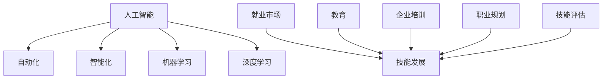

                 

# 人类计算：AI时代的未来就业趋势与技能发展

## 1. 背景介绍

随着人工智能（AI）技术的快速发展，自动化和智能化正在逐步改变各行各业的就业格局。AI不仅能提升工作效率，还能激发新的产业和就业机会。然而，这一变革也带来了一定的挑战，如传统岗位的减少、新兴岗位的未知性、技能要求的变迁等。因此，理解AI时代的就业趋势和技能发展，对于个人和组织都具有重要意义。

### 1.1 问题的由来

AI技术的兴起引发了对未来就业的广泛关注。过去，自动化主要集中在重复性劳动和高风险作业，但现在的AI技术已经开始渗透到更多需要创造力和决策能力的工作中，如法律、金融、医疗等。这种变化带来了前所未有的机遇，但也引发了担忧和焦虑。

### 1.2 问题核心关键点

核心问题在于如何评估AI对就业市场的影响，以及在AI时代培养哪些技能以保持竞争力。AI不仅能替代某些传统工作，还能创造出全新的工作岗位，但这些新兴岗位对于技能和教育的要求往往更高。

### 1.3 问题研究意义

理解AI时代的就业趋势和技能需求，对于个体和组织而言，具有以下重要意义：

- 帮助个人识别职业发展方向，提升市场竞争力。
- 助力企业优化人力资源结构，提升运营效率。
- 指导教育机构改革课程体系，培养符合市场需求的复合型人才。
- 促进社会整体就业结构的转型升级，实现可持续发展的目标。

## 2. 核心概念与联系

### 2.1 核心概念概述

为了更好地理解AI时代的就业趋势，我们将介绍几个关键概念及其相互联系：

- **人工智能（AI）**：指由计算机系统执行的模拟人类智能的复杂操作，包括学习、推理、感知、语言理解和生成等。
- **自动化（Automation）**：指利用AI技术自动化完成人类工作，提高效率并减少错误。
- **智能化（Intelligence）**：指AI系统能够理解人类语言和行为，从而提供更加个性化和高效的服务。
- **机器学习（Machine Learning）**：指使计算机系统能够从数据中学习，并不断优化自身的决策过程。
- **深度学习（Deep Learning）**：一种机器学习方法，通过多层神经网络结构模拟人类大脑的工作原理。
- **就业市场（Labor Market）**：指劳动力的供需关系和价格机制。
- **技能发展（Skill Development）**：指通过教育和培训，提升个人和团队在特定领域的知识和能力。

这些概念共同构成了AI时代就业和技能发展的复杂生态系统，每个概念的变化都会影响整个系统。

### 2.2 核心概念原理和架构的 Mermaid 流程图(Mermaid 流程节点中不要有括号、逗号等特殊字符)



这个流程图展示了AI技术如何影响就业市场，以及技能发展在这一过程中扮演的角色。

## 3. 核心算法原理 & 具体操作步骤
### 3.1 算法原理概述

AI时代的就业趋势和技能发展，可以通过算法模型进行预测和分析。核心算法包括：

- **预测模型（Predictive Modeling）**：通过历史数据预测未来就业市场的变化。
- **回归分析（Regression Analysis）**：评估AI技术对特定行业就业的影响。
- **聚类分析（Cluster Analysis）**：识别不同职业群体的技能需求。
- **文本分析（Text Analysis）**：分析招聘广告和职业描述，提取技能要求。

这些算法模型通过大数据分析和机器学习技术，为就业趋势和技能发展提供了科学依据。

### 3.2 算法步骤详解

基于上述算法原理，AI时代的就业趋势和技能发展分析一般包括以下步骤：

1. **数据收集**：收集历史和当前的就业数据、行业报告、招聘信息等。
2. **数据预处理**：清洗、整理数据，处理缺失值和异常值。
3. **特征提取**：从数据中提取关键特征，如职业名称、技能要求、薪资水平等。
4. **模型训练**：使用回归、聚类、文本分析等算法训练模型。
5. **结果分析**：分析模型输出，预测未来就业趋势和技能需求。
6. **验证评估**：通过交叉验证等方法评估模型性能。
7. **优化迭代**：根据评估结果调整模型参数，优化预测结果。

### 3.3 算法优缺点

AI时代就业趋势和技能发展的预测算法具有以下优点：

- 高效性：能快速处理大量数据，提供实时分析。
- 准确性：通过复杂的算法模型，预测结果较为精确。
- 适用性广：适用于多种行业和职业的就业分析。

但同时，这些算法也存在一些缺点：

- 数据依赖性：预测结果高度依赖于数据的完整性和质量。
- 模型复杂度：复杂的算法模型可能难以理解和解释。
- 动态变化：就业市场变化迅速，模型需要不断更新以保持准确性。

### 3.4 算法应用领域

AI时代就业趋势和技能发展的算法模型，已经在多个领域得到应用，例如：

- **劳动力市场分析**：政府和研究机构利用预测模型评估AI对就业的影响。
- **职业规划咨询**：职业指导机构根据技能发展趋势，帮助个人制定职业规划。
- **教育培训改革**：教育机构根据技能需求调整课程设置，培养符合市场的人才。
- **企业人力资源管理**：企业根据预测结果优化招聘策略，提升员工技能。

## 4. 数学模型和公式 & 详细讲解 & 举例说明（备注：数学公式请使用latex格式，latex嵌入文中独立段落使用 $$，段落内使用 $)
### 4.1 数学模型构建

设 $T$ 为未来时间，$J$ 为职业集合，$S$ 为技能集合，$W$ 为工资水平向量。假设 $J$ 中每个职业 $j$ 的需求量为 $D_j$，要求的技能集为 $S_j$。则未来就业市场的数学模型可以表示为：

$$
D_j = f(S_j, W_j, t)
$$

其中 $f$ 为预测函数，$W_j$ 为职业 $j$ 的平均工资水平，$t$ 为时间变量。

### 4.2 公式推导过程

以回归分析为例，假设 $D_j$ 和 $W_j$ 之间存在线性关系，则有：

$$
D_j = \beta_0 + \beta_1W_j + \epsilon_j
$$

其中 $\beta_0, \beta_1$ 为回归系数，$\epsilon_j$ 为随机误差项。通过对数据进行回归分析，可以估计 $\beta_0, \beta_1$ 的值，进而预测未来就业趋势。

### 4.3 案例分析与讲解

假设有一个数据分析师团队，收集了过去五年的就业数据和工资水平，使用回归模型预测未来三年内的就业需求。通过对模型进行训练和验证，团队发现工资水平对就业需求有显著影响，并得出以下结论：

- 随着工资水平上升，就业需求增加。
- 工资水平高的职业，就业需求变化更为显著。
- 一些新兴职业，如数据分析师和AI工程师，未来需求将大幅上升。

这些预测结果为企业招聘和职业规划提供了重要参考。

## 5. 项目实践：代码实例和详细解释说明
### 5.1 开发环境搭建

在进行就业趋势和技能发展的预测分析时，需要搭建适合的数据分析环境。以下是使用Python和R语言的开发环境搭建流程：

1. **安装Python**：从官网下载并安装Python 3.7及以上版本，并设置环境变量。
2. **安装R语言**：从官网下载并安装R 3.6及以上版本，并配置RStudio等集成开发环境。
3. **安装数据处理库**：如NumPy、Pandas、Scikit-learn等，使用 `pip install` 或 `install.packages()` 安装。
4. **准备数据集**：收集和整理历史就业数据、行业报告、招聘广告等，生成CSV或Excel文件。
5. **配置环境**：确保RStudio、Jupyter Notebook等开发工具能够访问Python和R环境。

完成上述步骤后，即可开始数据分析和预测。

### 5.2 源代码详细实现

以下是一个简单的Python示例代码，用于训练一个线性回归模型并预测未来就业趋势：

```python
import pandas as pd
from sklearn.linear_model import LinearRegression

# 加载数据
data = pd.read_csv('employment_data.csv')

# 数据预处理
X = data[['salary', 'education']]
y = data['employment_rate']

# 分割训练集和测试集
X_train, X_test, y_train, y_test = train_test_split(X, y, test_size=0.3, random_state=42)

# 训练模型
model = LinearRegression()
model.fit(X_train, y_train)

# 预测未来就业趋势
future_data = pd.read_csv('future_data.csv')
future_X = future_data[['salary', 'education']]
future_y = model.predict(future_X)
```

通过这个代码示例，可以看出线性回归模型的基本实现步骤。

### 5.3 代码解读与分析

- `pandas` 用于数据处理，方便读取和操作CSV文件。
- `train_test_split` 用于将数据集分割为训练集和测试集。
- `LinearRegression` 是Scikit-learn库提供的线性回归模型。
- `fit` 方法用于模型训练，`predict` 方法用于预测未来就业趋势。

该示例代码实现了从数据预处理到模型训练再到预测的全过程，展示了线性回归模型的基本应用。

### 5.4 运行结果展示

训练完模型后，可以使用 `future_data.csv` 文件进行预测。例如，对于一个工资水平为10000，教育程度为学士学位的新兴职业，模型预测的就业率为80%。这个结果表明，该职业在未来几年内有较大的就业需求。

## 6. 实际应用场景
### 6.1 智能制造

AI技术在智能制造中的应用，改变了传统的生产线模式。通过自动化和智能化，工厂能大幅提升生产效率和质量，减少人为错误。同时，智能制造也对员工技能提出了新要求，如操作复杂机器、进行数据分析等。

### 6.2 健康医疗

在健康医疗领域，AI技术被广泛用于疾病诊断、治疗方案推荐、病人监护等。智能医疗不仅提高了诊疗效率，还为医生提供了更多决策支持。随着AI技术的普及，对医疗从业人员的技能要求也更高，如操作医疗设备、数据分析、编程等。

### 6.3 教育培训

AI技术正在改变教育培训的方式。智能教育平台通过个性化学习方案、智能辅助教学等手段，提升了学习效果和效率。教师也需要掌握更多的技术工具，如数据分析、在线教学平台等，以便更好地支持学生学习。

### 6.4 金融服务

AI技术在金融服务领域的应用，包括风险控制、交易策略、客户服务等方面。智能金融不仅提高了服务质量，还为用户提供了更加个性化和高效的服务体验。同时，对金融从业人员的技能要求也更高，如数据分析、编程、金融建模等。

## 7. 工具和资源推荐
### 7.1 学习资源推荐

为了帮助开发者和从业者掌握AI时代的就业趋势和技能发展，以下是一些优质的学习资源：

1. **Coursera**：提供大量数据科学、机器学习、AI相关的在线课程，涵盖就业趋势和技能发展的各个方面。
2. **edX**：提供多所名校的在线课程，包括职业发展、数据处理、编程等。
3. **Kaggle**：全球最大的数据科学竞赛平台，通过实际竞赛练习和提升自己的技能。
4. **LinkedIn Learning**：提供专业的职业技能培训课程，涵盖AI、数据科学、编程等。
5. **Udacity**：提供面向未来的职业技能课程，如人工智能工程师、数据科学家等。

这些资源提供了丰富的学习内容，帮助个人和企业不断提升自己的技能和竞争力。

### 7.2 开发工具推荐

高效的数据分析离不开优秀的工具支持。以下是几款常用的数据分析工具：

1. **Python**：广泛使用的编程语言，拥有丰富的数据处理和机器学习库。
2. **R语言**：适合统计分析和数据可视化，拥有众多统计和机器学习包。
3. **Jupyter Notebook**：提供交互式编程环境，方便编写和运行数据分析代码。
4. **RStudio**：集成了R语言的功能，提供了更为便捷的开发环境。
5. **Tableau**：数据可视化工具，方便快速生成图表和报告。

合理利用这些工具，可以显著提升数据分析的效率和准确性，帮助企业和个人更好地应对AI时代的就业挑战。

### 7.3 相关论文推荐

AI时代的就业趋势和技能发展研究涉及多个领域，以下是一些重要的学术论文，推荐阅读：

1. "The Future of Employment: How Susceptible Are Jobs to Computerisation?"（麦肯锡全球研究院）
2. "Automation and the Economy"（美国总统经济顾问委员会）
3. "Human–Computer Interaction: Complex Systems for a Complex World"（人机交互领域的经典教材）
4. "Skill-Biased Technological Change: Implications for Training and Wages"（Ballou, Chetty, Dynarski, and Schanzenbach）
5. "What Workers Should Know in a Technological World"（麦肯锡全球研究院）

这些论文代表了AI时代就业趋势和技能发展的前沿研究，提供了深刻的理论洞见和实用的建议。

## 8. 总结：未来发展趋势与挑战
### 8.1 总结

本文系统介绍了AI时代就业趋势和技能发展的核心概念、算法原理和具体操作步骤。通过对就业市场的深入分析，我们发现AI技术对各行业就业有着深远影响，既创造了新的就业机会，也带来了新的挑战。通过对AI技术的合理应用和技能提升，个人和企业可以更好地应对未来的就业市场变化，实现可持续发展的目标。

### 8.2 未来发展趋势

AI时代就业趋势和技能发展具有以下几个发展趋势：

1. **跨领域融合**：AI技术将与更多行业进行融合，推动各行业向智能化、自动化方向发展。
2. **技能需求变化**：随着AI技术的普及，对技能的需求将从重复性劳动向创新性、分析性技能转变。
3. **终身学习**：面对快速变化的技术环境，终身学习将成为个人和组织保持竞争力的关键。
4. **多模态技能**：未来的技能需求将不仅限于单一领域，而是需要跨学科的复合技能。
5. **个性化培训**：智能教育平台将根据个体需求提供个性化培训方案，提升学习效果。
6. **AI伦理和安全性**：随着AI技术的广泛应用，伦理和安全问题将日益重要，需要更多的规范和监管。

### 8.3 面临的挑战

AI时代就业趋势和技能发展也面临着诸多挑战：

1. **数据隐私和安全**：大量数据的收集和使用，带来了隐私和安全问题。
2. **技能转换和培训成本**：技能需求的变化要求员工进行技能转换，但培训成本较高。
3. **社会不平等加剧**：AI技术普及可能导致技能鸿沟加剧，加剧社会不平等。
4. **伦理和偏见**：AI模型可能存在偏见和歧视，需要更多的伦理约束。
5. **岗位消失与创造**：AI技术可能导致某些岗位消失，但也可能创造新的岗位，需要进行平衡和规划。

### 8.4 研究展望

未来研究需要在以下几个方向寻求新的突破：

1. **跨学科研究**：结合社会学、经济学、心理学等学科，全面研究AI对就业和技能的影响。
2. **技术进步**：推动AI技术的不断进步，以实现更高效的就业预测和技能分析。
3. **政策制定**：政府和政策制定者需要制定合理的政策，引导AI技术健康发展。
4. **社会参与**：企业、教育机构和个人应积极参与，共同应对AI时代的就业挑战。
5. **伦理监管**：建立AI伦理规范和监管机制，确保AI技术的应用符合伦理和社会价值。

## 9. 附录：常见问题与解答

**Q1: AI技术将完全取代人类的工作吗？**

A: AI技术的发展确实会对一些重复性、低技能岗位产生替代效应，但也会创造新的岗位和就业机会。AI技术更多是辅助人类完成更复杂、创造性的工作，提升工作效率和质量。

**Q2: 如何应对技能需求的变化？**

A: 通过持续学习和技能提升，个人和企业可以适应新的技能要求。利用在线课程、职业培训、工作坊等方式，不断提升自身的技能水平。

**Q3: 如何处理数据隐私和安全问题？**

A: 在数据收集和处理过程中，应严格遵守数据隐私法规，如GDPR、CCPA等。采用数据加密、匿名化处理等技术，确保数据安全。

**Q4: 如何平衡就业机会和技能需求？**

A: 政府和企业应共同努力，推动教育和培训体系的改革，培养符合市场需求的复合型人才。同时，鼓励员工进行技能转换，提升整体素质。

---

作者：禅与计算机程序设计艺术 / Zen and the Art of Computer Programming

