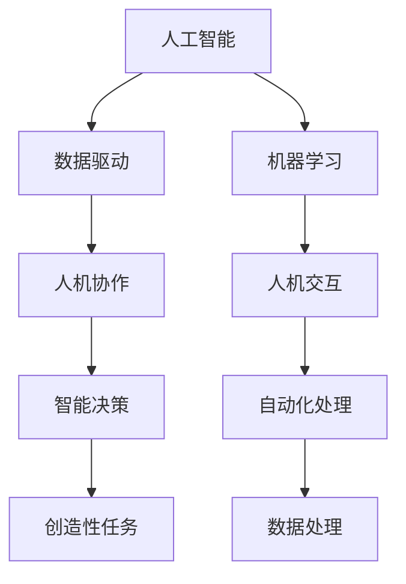
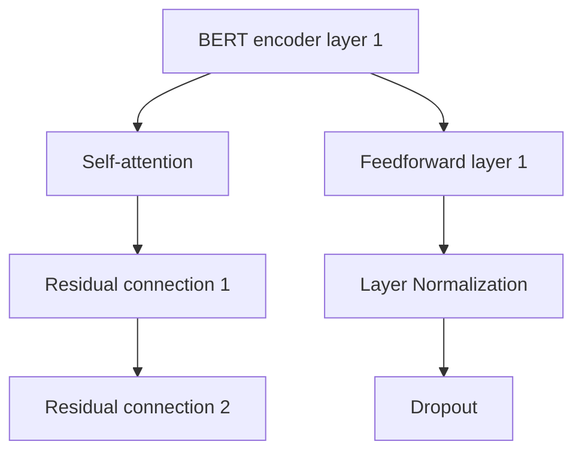

                 

# 人类计算：人机协作的新时代

## 1. 背景介绍

### 1.1 问题由来
随着信息技术的飞速发展，计算已经从人类辅助转向了人类计算。人机协作，尤其是人机计算（Human-Computer Interaction, HCI）已经成为信息时代的主流。大语言模型、人工智能（AI）、机器学习（ML）等技术的崛起，将计算能力从机器延伸到人类，实现了人机协作的新范式。

然而，这种新兴的人机协作方式，既带来了前所未有的便利，也带来了新的挑战。在高度自动化、智能化的背后，如何平衡机器与人类角色，发挥各自优势，成为当下热议的话题。

### 1.2 问题核心关键点
现代计算的核心在于实现信息的自动化处理。人工智能和大数据技术的突破，使得机器能够在很多领域内完成人类原来需要耗时耗力的任务，大幅度提升了工作效率。然而，这种自动化往往伴随着对人类智慧的替代，容易导致工作岗位的流失、人类技能的老化等问题。

在这种情况下，人类计算的概念应运而生。所谓人类计算，即利用人类智慧与机器能力结合的计算模式，实现计算与创造、技术与智能的协同发展，让机器和人类共同承担计算任务，发挥各自优势。

人类计算的核心在于以下几点：

- 计算与创造并重：利用机器自动化处理信息，让人类能够专注于更有创造性和策略性的任务。
- 技术与智能协同：将人的直觉与经验与机器的高速处理能力结合，实现更高效的决策与判断。
- 复杂问题解构：将复杂问题分解为多个简单的子问题，由人机协同解决。
- 人机交互优化：构建更加友好、自然的交互方式，提升人机协作的效率与体验。

### 1.3 问题研究意义
研究人类计算，对于推动信息技术与人类社会深度融合，提升社会生产力，具有重要意义：

1. 促进经济发展：通过人机协作，释放人类的创造力，提升劳动生产率，推动经济增长。
2. 强化技能转型：适应自动化时代，通过技能提升和职业培训，让员工能够适应新的工作环境。
3. 保障就业稳定：将机器自动化处理信息，使得人类能够从事更具挑战性的工作，保障就业稳定。
4. 推动教育革新：利用智能辅助教学，个性化教育，让教育资源更加公平地惠及每一个人。
5. 改善社会福祉：利用信息技术提高生活质量，解决医疗、交通、环境等社会问题。

## 2. 核心概念与联系

### 2.1 核心概念概述

为了更好地理解人类计算的概念，我们将从几个核心概念入手：

- **人机协作**：利用机器的自动化处理能力，提升人类决策和创造的效率。
- **人工智能**：模拟人类智能过程，实现信息的自动处理与分析。
- **机器学习**：使机器通过学习数据自动提升性能，实现数据的智能处理。
- **数据驱动**：以数据为基础，实现信息的自动化处理和智能决策。
- **人机交互**：通过友好的交互方式，提升人机协作的效率与体验。

这些核心概念构成了人类计算的基本框架，通过它们的相互作用，实现了人类计算的广泛应用。

### 2.2 核心概念原理和架构的 Mermaid 流程图(Mermaid 流程节点中不要有括号、逗号等特殊字符)


此流程图展示了大语言模型在人类计算中的作用及其与核心概念之间的关系：

- 人工智能通过模拟人类的智能过程，实现信息的自动处理与分析。
- 数据驱动以数据为基础，支持人工智能进行智能决策。
- 机器学习使机器通过学习数据自动提升性能，实现数据的智能处理。
- 人机协作将机器的自动化处理能力与人类智慧结合，提升决策和创造效率。
- 人机交互通过友好的交互方式，提升人机协作的效率与体验。
- 智能决策支持自动化处理，提升决策效率。
- 自动化处理进一步处理数据，提升数据质量。
- 创造性任务结合智能决策与自动化处理，实现复杂问题的解决。

## 3. 核心算法原理 & 具体操作步骤
### 3.1 算法原理概述

基于人类计算的概念，我们将探讨一些核心算法原理与具体操作步骤：

**Step 1: 数据收集与预处理**
- 收集与任务相关的数据集，清洗数据，去除噪声和无用信息。
- 进行特征提取，将原始数据转化为机器可处理的形式。
- 进行数据增强，扩充数据集，减少过拟合风险。

**Step 2: 模型选择与训练**
- 选择合适的模型，如深度神经网络、大语言模型、Transformer等。
- 利用数据集对模型进行训练，优化模型参数。
- 通过交叉验证等方法评估模型性能，选择最优模型。

**Step 3: 模型集成与优化**
- 集成多个模型，提升预测准确性。
- 进行超参数优化，找到最优参数组合。
- 进行模型压缩与优化，提升模型效率。

**Step 4: 人机协作与任务分解**
- 确定人机协作的分工，将复杂任务分解为简单子任务。
- 设计友好的交互界面，提升人机协作的效率与体验。
- 建立任务反馈机制，不断优化协作过程。

### 3.2 算法步骤详解
以自然语言处理（NLP）为例，展示人类计算的应用：

**Step 1: 数据收集与预处理**
- 收集文本数据，如新闻、评论、社交媒体等。
- 清洗数据，去除垃圾信息、拼写错误等。
- 进行分词、去停用词等特征提取。
- 进行数据增强，如回译、近义词替换等。

**Step 2: 模型选择与训练**
- 选择大语言模型，如GPT、BERT等。
- 利用标注数据对模型进行微调，优化模型参数。
- 通过验证集评估模型性能，选择最优模型。

**Step 3: 模型集成与优化**
- 集成多个微调模型，提升预测准确性。
- 进行超参数优化，如学习率、批大小、迭代次数等。
- 进行模型压缩与优化，如剪枝、量化、蒸馏等。

**Step 4: 人机协作与任务分解**
- 确定人机协作的分工，如人负责标注数据，机器负责自动分类。
- 设计友好的交互界面，如自然语言界面。
- 建立任务反馈机制，如通过点击、打分等方式反馈结果。

### 3.3 算法优缺点
人类计算的算法具有以下优点：
1. 提升工作效率：通过自动化处理信息，提升人类决策效率。
2. 释放人类智慧：让人类专注于更有创造性和策略性的任务。
3. 降低成本：减少人力投入，提升生产效率。

然而，也存在以下缺点：
1. 依赖数据：需要大量标注数据进行模型训练与优化。
2. 机器依赖：机器故障或数据异常可能导致系统失效。
3. 人机协同：需要设计友好的交互界面，提升人机协作的效率。

### 3.4 算法应用领域

人类计算在多个领域有广泛的应用，具体如下：

**医疗领域**
- 医学影像分析：利用深度学习进行图像分类、检测。
- 诊断决策支持：基于医学数据进行诊断与决策。
- 健康管理：通过可穿戴设备收集数据，进行健康预测与干预。

**教育领域**
- 个性化教学：根据学生表现，智能推荐学习内容。
- 作业批改：自动批改作业，提升教师效率。
- 教学辅助：利用智能教学系统，辅助教学。

**金融领域**
- 风险评估：基于金融数据进行风险预测与评估。
- 投资建议：根据市场数据进行投资建议。
- 欺诈检测：利用机器学习检测金融欺诈行为。

**制造领域**
- 供应链管理：基于数据分析进行供应链优化。
- 质量控制：利用机器视觉进行质量检测。
- 设备维护：通过传感器数据进行设备维护预测。

**智能家居**
- 智能控制：利用语音、图像识别进行家居控制。
- 环境监测：通过传感器监测室内环境，提供健康建议。
- 智能安防：利用机器视觉进行安防监测。

## 4. 数学模型和公式 & 详细讲解 & 举例说明（备注：数学公式请使用latex格式，latex嵌入文中独立段落使用 $$，段落内使用 $)
### 4.1 数学模型构建

大语言模型在人类计算中起着关键作用。以BERT为例，其模型架构如下图所示：



BERT利用Transformer模型进行编码，通过自注意力机制（Self-attention）对输入进行编码，再通过前馈网络（Feedforward layer）进行特征映射，最后进行残差连接（Residual connection）、层归一化（Layer Normalization）和dropout，最终输出向量表示。

### 4.2 公式推导过程

在BERT中，对于一个输入的句子，其编码过程可以表示为：

$$
\mathbf{H} = \text{BERT}(\mathbf{X}) = \text{Multi-head Attention}(\text{Embedding}(\mathbf{X})) + \text{Feedforward}(\text{Multi-head Attention}(\text{Embedding}(\mathbf{X})))
$$

其中，$\mathbf{H}$ 表示输出向量，$\mathbf{X}$ 表示输入的词嵌入向量，$\text{Embedding}$ 表示词嵌入层，$\text{Multi-head Attention}$ 表示多头注意力机制，$\text{Feedforward}$ 表示前馈网络。

### 4.3 案例分析与讲解

以情感分析为例，展示人类计算的应用：

**Step 1: 数据收集与预处理**
- 收集包含情感标签的评论数据。
- 清洗数据，去除垃圾信息、拼写错误等。
- 进行分词、去停用词等特征提取。

**Step 2: 模型选择与训练**
- 选择BERT模型进行情感分类。
- 利用标注数据对模型进行微调，优化模型参数。
- 通过验证集评估模型性能，选择最优模型。

**Step 3: 模型集成与优化**
- 集成多个微调模型，提升预测准确性。
- 进行超参数优化，如学习率、批大小、迭代次数等。
- 进行模型压缩与优化，如剪枝、量化、蒸馏等。

**Step 4: 人机协作与任务分解**
- 确定人机协作的分工，如人负责标注数据，机器负责自动分类。
- 设计友好的交互界面，如自然语言界面。
- 建立任务反馈机制，如通过点击、打分等方式反馈结果。

## 5. 项目实践：代码实例和详细解释说明
### 5.1 开发环境搭建

在进行人类计算实践前，我们需要准备好开发环境。以下是使用Python进行PyTorch开发的环境配置流程：

1. 安装Anaconda：从官网下载并安装Anaconda，用于创建独立的Python环境。

2. 创建并激活虚拟环境：
```bash
conda create -n pytorch-env python=3.8 
conda activate pytorch-env
```

3. 安装PyTorch：根据CUDA版本，从官网获取对应的安装命令。例如：
```bash
conda install pytorch torchvision torchaudio cudatoolkit=11.1 -c pytorch -c conda-forge
```

4. 安装Transformers库：
```bash
pip install transformers
```

5. 安装各类工具包：
```bash
pip install numpy pandas scikit-learn matplotlib tqdm jupyter notebook ipython
```

完成上述步骤后，即可在`pytorch-env`环境中开始人类计算实践。

### 5.2 源代码详细实现

下面我们以情感分析任务为例，给出使用Transformers库对BERT模型进行微调的PyTorch代码实现。

首先，定义情感分析任务的数据处理函数：

```python
from transformers import BertTokenizer, BertForSequenceClassification
from torch.utils.data import Dataset
import torch

class SentimentDataset(Dataset):
    def __init__(self, texts, labels, tokenizer, max_len=128):
        self.texts = texts
        self.labels = labels
        self.tokenizer = tokenizer
        self.max_len = max_len
        
    def __len__(self):
        return len(self.texts)
    
    def __getitem__(self, item):
        text = self.texts[item]
        label = self.labels[item]
        
        encoding = self.tokenizer(text, return_tensors='pt', max_length=self.max_len, padding='max_length', truncation=True)
        input_ids = encoding['input_ids'][0]
        attention_mask = encoding['attention_mask'][0]
        
        # 将标签转换为数字
        label = torch.tensor([label], dtype=torch.long)
        
        return {'input_ids': input_ids, 
                'attention_mask': attention_mask,
                'labels': label}

# 标签映射
label2id = {'positive': 1, 'negative': 0}
id2label = {v: k for k, v in label2id.items()}

# 创建dataset
tokenizer = BertTokenizer.from_pretrained('bert-base-cased')

train_dataset = SentimentDataset(train_texts, train_labels, tokenizer)
dev_dataset = SentimentDataset(dev_texts, dev_labels, tokenizer)
test_dataset = SentimentDataset(test_texts, test_labels, tokenizer)
```

然后，定义模型和优化器：

```python
from transformers import AdamW

model = BertForSequenceClassification.from_pretrained('bert-base-cased', num_labels=2)

optimizer = AdamW(model.parameters(), lr=2e-5)
```

接着，定义训练和评估函数：

```python
from torch.utils.data import DataLoader
from tqdm import tqdm
from sklearn.metrics import classification_report

device = torch.device('cuda') if torch.cuda.is_available() else torch.device('cpu')
model.to(device)

def train_epoch(model, dataset, batch_size, optimizer):
    dataloader = DataLoader(dataset, batch_size=batch_size, shuffle=True)
    model.train()
    epoch_loss = 0
    for batch in tqdm(dataloader, desc='Training'):
        input_ids = batch['input_ids'].to(device)
        attention_mask = batch['attention_mask'].to(device)
        labels = batch['labels'].to(device)
        model.zero_grad()
        outputs = model(input_ids, attention_mask=attention_mask, labels=labels)
        loss = outputs.loss
        epoch_loss += loss.item()
        loss.backward()
        optimizer.step()
    return epoch_loss / len(dataloader)

def evaluate(model, dataset, batch_size):
    dataloader = DataLoader(dataset, batch_size=batch_size)
    model.eval()
    preds, labels = [], []
    with torch.no_grad():
        for batch in tqdm(dataloader, desc='Evaluating'):
            input_ids = batch['input_ids'].to(device)
            attention_mask = batch['attention_mask'].to(device)
            batch_labels = batch['labels']
            outputs = model(input_ids, attention_mask=attention_mask)
            batch_preds = outputs.logits.argmax(dim=1).to('cpu').tolist()
            batch_labels = batch_labels.to('cpu').tolist()
            for pred, label in zip(batch_preds, batch_labels):
                preds.append(pred)
                labels.append(label)
                
    print(classification_report(labels, preds))
```

最后，启动训练流程并在测试集上评估：

```python
epochs = 5
batch_size = 16

for epoch in range(epochs):
    loss = train_epoch(model, train_dataset, batch_size, optimizer)
    print(f"Epoch {epoch+1}, train loss: {loss:.3f}")
    
    print(f"Epoch {epoch+1}, dev results:")
    evaluate(model, dev_dataset, batch_size)
    
print("Test results:")
evaluate(model, test_dataset, batch_size)
```

以上就是使用PyTorch对BERT进行情感分析任务微调的完整代码实现。可以看到，得益于Transformers库的强大封装，我们可以用相对简洁的代码完成BERT模型的加载和微调。

### 5.3 代码解读与分析

让我们再详细解读一下关键代码的实现细节：

**SentimentDataset类**：
- `__init__`方法：初始化文本、标签、分词器等关键组件。
- `__len__`方法：返回数据集的样本数量。
- `__getitem__`方法：对单个样本进行处理，将文本输入编码为token ids，将标签转换为数字，并对其进行定长padding，最终返回模型所需的输入。

**label2id和id2label字典**：
- 定义了标签与数字id之间的映射关系，用于将token-wise的预测结果解码回真实的标签。

**训练和评估函数**：
- 使用PyTorch的DataLoader对数据集进行批次化加载，供模型训练和推理使用。
- 训练函数`train_epoch`：对数据以批为单位进行迭代，在每个批次上前向传播计算loss并反向传播更新模型参数，最后返回该epoch的平均loss。
- 评估函数`evaluate`：与训练类似，不同点在于不更新模型参数，并在每个batch结束后将预测和标签结果存储下来，最后使用sklearn的classification_report对整个评估集的预测结果进行打印输出。

**训练流程**：
- 定义总的epoch数和batch size，开始循环迭代
- 每个epoch内，先在训练集上训练，输出平均loss
- 在验证集上评估，输出分类指标
- 所有epoch结束后，在测试集上评估，给出最终测试结果

可以看到，PyTorch配合Transformers库使得BERT微调的代码实现变得简洁高效。开发者可以将更多精力放在数据处理、模型改进等高层逻辑上，而不必过多关注底层的实现细节。

当然，工业级的系统实现还需考虑更多因素，如模型的保存和部署、超参数的自动搜索、更灵活的任务适配层等。但核心的微调范式基本与此类似。

## 6. 实际应用场景
### 6.1 智能客服系统

基于大语言模型的人类计算，可以广泛应用于智能客服系统的构建。传统客服往往需要配备大量人力，高峰期响应缓慢，且一致性和专业性难以保证。而使用微调后的对话模型，可以7x24小时不间断服务，快速响应客户咨询，用自然流畅的语言解答各类常见问题。

在技术实现上，可以收集企业内部的历史客服对话记录，将问题和最佳答复构建成监督数据，在此基础上对预训练对话模型进行微调。微调后的对话模型能够自动理解用户意图，匹配最合适的答案模板进行回复。对于客户提出的新问题，还可以接入检索系统实时搜索相关内容，动态组织生成回答。如此构建的智能客服系统，能大幅提升客户咨询体验和问题解决效率。

### 6.2 金融舆情监测

金融机构需要实时监测市场舆论动向，以便及时应对负面信息传播，规避金融风险。传统的人工监测方式成本高、效率低，难以应对网络时代海量信息爆发的挑战。基于大语言模型的人类计算技术，为金融舆情监测提供了新的解决方案。

具体而言，可以收集金融领域相关的新闻、报道、评论等文本数据，并对其进行主题标注和情感标注。在此基础上对预训练语言模型进行微调，使其能够自动判断文本属于何种主题，情感倾向是正面、中性还是负面。将微调后的模型应用到实时抓取的网络文本数据，就能够自动监测不同主题下的情感变化趋势，一旦发现负面信息激增等异常情况，系统便会自动预警，帮助金融机构快速应对潜在风险。

### 6.3 个性化推荐系统

当前的推荐系统往往只依赖用户的历史行为数据进行物品推荐，无法深入理解用户的真实兴趣偏好。基于大语言模型的人类计算技术，个性化推荐系统可以更好地挖掘用户行为背后的语义信息，从而提供更精准、多样的推荐内容。

在实践中，可以收集用户浏览、点击、评论、分享等行为数据，提取和用户交互的物品标题、描述、标签等文本内容。将文本内容作为模型输入，用户的后续行为（如是否点击、购买等）作为监督信号，在此基础上微调预训练语言模型。微调后的模型能够从文本内容中准确把握用户的兴趣点。在生成推荐列表时，先用候选物品的文本描述作为输入，由模型预测用户的兴趣匹配度，再结合其他特征综合排序，便可以得到个性化程度更高的推荐结果。

### 6.4 未来应用展望

随着人类计算技术的不断发展，其在更多领域的应用前景将更加广阔。

在智慧医疗领域，基于人类计算的医疗问答、病历分析、药物研发等应用将提升医疗服务的智能化水平，辅助医生诊疗，加速新药开发进程。

在智能教育领域，人类计算可应用于作业批改、学情分析、知识推荐等方面，因材施教，促进教育公平，提高教学质量。

在智慧城市治理中，人类计算技术可应用于城市事件监测、舆情分析、应急指挥等环节，提高城市管理的自动化和智能化水平，构建更安全、高效的未来城市。

此外，在企业生产、社会治理、文娱传媒等众多领域，基于人类计算的人工智能应用也将不断涌现，为NLP技术带来全新的突破。

## 7. 工具和资源推荐
### 7.1 学习资源推荐

为了帮助开发者系统掌握人类计算的理论基础和实践技巧，这里推荐一些优质的学习资源：

1. 《深度学习与人类智慧》系列博文：由大模型技术专家撰写，深入浅出地介绍了深度学习在人类智慧中的应用。

2. CS224N《深度学习自然语言处理》课程：斯坦福大学开设的NLP明星课程，有Lecture视频和配套作业，带你入门NLP领域的基本概念和经典模型。

3. 《Human-Computer Interaction》书籍：系统介绍了人机交互的理论与实践，涵盖用户研究、交互设计等多个方面。

4. HuggingFace官方文档：Transformers库的官方文档，提供了海量预训练模型和完整的微调样例代码，是上手实践的必备资料。

5. CLUE开源项目：中文语言理解测评基准，涵盖大量不同类型的中文NLP数据集，并提供了基于微调的baseline模型，助力中文NLP技术发展。

通过对这些资源的学习实践，相信你一定能够快速掌握人类计算的精髓，并用于解决实际的NLP问题。

### 7.2 开发工具推荐

高效的开发离不开优秀的工具支持。以下是几款用于人类计算开发的常用工具：

1. PyTorch：基于Python的开源深度学习框架，灵活动态的计算图，适合快速迭代研究。大部分预训练语言模型都有PyTorch版本的实现。

2. TensorFlow：由Google主导开发的开源深度学习框架，生产部署方便，适合大规模工程应用。同样有丰富的预训练语言模型资源。

3. Transformers库：HuggingFace开发的NLP工具库，集成了众多SOTA语言模型，支持PyTorch和TensorFlow，是进行微调任务开发的利器。

4. Weights & Biases：模型训练的实验跟踪工具，可以记录和可视化模型训练过程中的各项指标，方便对比和调优。与主流深度学习框架无缝集成。

5. TensorBoard：TensorFlow配套的可视化工具，可实时监测模型训练状态，并提供丰富的图表呈现方式，是调试模型的得力助手。

6. Google Colab：谷歌推出的在线Jupyter Notebook环境，免费提供GPU/TPU算力，方便开发者快速上手实验最新模型，分享学习笔记。

合理利用这些工具，可以显著提升人类计算任务的开发效率，加快创新迭代的步伐。

### 7.3 相关论文推荐

人类计算和微调技术的不断发展源于学界的持续研究。以下是几篇奠基性的相关论文，推荐阅读：

1. Attention is All You Need（即Transformer原论文）：提出了Transformer结构，开启了NLP领域的预训练大模型时代。

2. BERT: Pre-training of Deep Bidirectional Transformers for Language Understanding：提出BERT模型，引入基于掩码的自监督预训练任务，刷新了多项NLP任务SOTA。

3. Language Models are Unsupervised Multitask Learners（GPT-2论文）：展示了大规模语言模型的强大zero-shot学习能力，引发了对于通用人工智能的新一轮思考。

4. Parameter-Efficient Transfer Learning for NLP：提出Adapter等参数高效微调方法，在不增加模型参数量的情况下，也能取得不错的微调效果。

5. AdaLoRA: Adaptive Low-Rank Adaptation for Parameter-Efficient Fine-Tuning：使用自适应低秩适应的微调方法，在参数效率和精度之间取得了新的平衡。

这些论文代表了大语言模型微调技术的发展脉络。通过学习这些前沿成果，可以帮助研究者把握学科前进方向，激发更多的创新灵感。

## 8. 总结：未来发展趋势与挑战

### 8.1 总结

本文对基于人类计算的概念进行了全面系统的介绍。首先阐述了人类计算的研究背景和意义，明确了其在使用大语言模型进行计算与创造、技术与智能协同发展的核心价值。其次，从原理到实践，详细讲解了人类计算的数学原理和关键步骤，给出了微调任务开发的完整代码实例。同时，本文还广泛探讨了人类计算在智能客服、金融舆情、个性化推荐等多个行业领域的应用前景，展示了人类计算的广泛应用。

通过本文的系统梳理，可以看到，基于大语言模型的人类计算，不仅将计算能力延伸到人类，更将人机协作推向了新的高度，拓展了计算与创造、技术与智能的协同发展空间。未来，伴随技术的不断进步，人类计算必将成为智能技术落地应用的重要范式，为构建人机协同的智能社会奠定基础。

### 8.2 未来发展趋势

展望未来，人类计算技术将呈现以下几个发展趋势：

1. 多模态计算的兴起：将图像、视频、语音等多模态数据融合，提升计算的全面性和准确性。
2. 低成本计算的普及：得益于芯片技术的发展，计算能力将更加普及，每个人都能轻松使用高性能计算。
3. 智能化决策的提升：通过深度学习、因果推理等技术，提升计算的智能化水平，实现更高效的决策与判断。
4. 协作计算的深化：通过协作计算，实现计算与创造、技术与智能的深度融合，提升工作效率与创造力。
5. 个性化计算的普及：利用大数据技术，实现个性化计算，提升用户体验。
6. 计算伦理的强化：关注计算伦理问题，构建公平、透明、可控的计算环境。

这些趋势凸显了人类计算技术的广阔前景，为信息技术与人类社会的深度融合提供了新的可能。未来，计算与创造、技术与智能的协同发展，将不断拓展计算能力的应用边界，为构建人机协同的智能社会提供新的动力。

### 8.3 面临的挑战

尽管人类计算技术已经取得了瞩目成就，但在迈向更加智能化、普适化应用的过程中，它仍面临诸多挑战：

1. 数据隐私保护：计算过程中涉及到大量个人隐私数据，如何保障数据安全、隐私保护是重要挑战。
2. 算法偏见与歧视：计算过程中可能会引入偏见和歧视，如何构建公平、无偏见的计算模型是亟待解决的问题。
3. 计算伦理与责任：计算过程中涉及伦理问题，如何构建透明、可控的计算环境，明确计算责任，是重要课题。
4. 用户接受度：如何将复杂的高科技计算普及到大众，提升用户接受度和信任度，是重要挑战。
5. 技术标准与规范：制定统一的技术标准与规范，保障计算技术的一致性和可互操作性，是重要课题。
6. 人才培养与教育：培养具备计算与创造能力的人才，提升人才素质，是重要挑战。

正视人类计算面临的这些挑战，积极应对并寻求突破，将使其在构建人机协同的智能社会中发挥更大的作用。

### 8.4 研究展望

面向未来，人类计算技术还需要在以下几个方面进行深入研究：

1. 计算伦理与责任：构建透明、可控的计算环境，确保计算过程中涉及的伦理与责任问题。
2. 公平、无偏见的计算：通过算法设计与训练，减少计算过程中的偏见与歧视，构建公平、无偏见的计算模型。
3. 数据隐私保护：通过加密、匿名化等技术，保护数据隐私，保障用户权益。
4. 用户友好与可接受性：提升计算的友好度，降低用户使用门槛，提升用户接受度。
5. 多模态计算的融合：将图像、视频、语音等多模态数据融合，提升计算的全面性和准确性。
6. 低成本计算的普及：通过芯片技术的发展，降低计算成本，让每个人都能轻松使用高性能计算。

这些研究方向的探索，必将引领人类计算技术迈向更高的台阶，为构建人机协同的智能社会提供新的动力。面向未来，人类计算技术还需要与其他人工智能技术进行更深入的融合，如知识表示、因果推理、强化学习等，多路径协同发力，共同推动智能技术的发展。只有勇于创新、敢于突破，才能不断拓展人类计算的边界，让人机协同的智能社会成为现实。

## 9. 附录：常见问题与解答

**Q1：人类计算是否适用于所有NLP任务？**

A: 人类计算在大多数NLP任务上都能取得不错的效果，特别是对于数据量较小的任务。但对于一些特定领域的任务，如医学、法律等，仅仅依靠通用语料预训练的模型可能难以很好地适应。此时需要在特定领域语料上进一步预训练，再进行微调，才能获得理想效果。此外，对于一些需要时效性、个性化很强的任务，如对话、推荐等，人类计算方法也需要针对性的改进优化。

**Q2：如何进行人类计算的优化？**

A: 人类计算的优化可以从以下几个方面入手：
1. 数据增强：通过回译、近义词替换等方式扩充训练集，减少过拟合风险。
2. 模型压缩与优化：如剪枝、量化、蒸馏等，提升模型效率。
3. 超参数优化：通过网格搜索、随机搜索等方法找到最优参数组合。
4. 人机协作优化：设计友好的交互界面，提升人机协作效率。
5. 多模态融合：将图像、视频、语音等多模态数据融合，提升计算的全面性和准确性。

这些优化策略往往需要根据具体任务和数据特点进行灵活组合。只有在数据、模型、训练、推理等各环节进行全面优化，才能最大限度地发挥人类计算的威力。

**Q3：如何衡量人类计算的效果？**

A: 人类计算的效果可以从以下几个方面进行衡量：
1. 准确率：通过模型预测结果与真实标签的匹配程度，衡量模型的准确率。
2. 召回率：通过模型预测结果与真实标签的匹配程度，衡量模型的召回率。
3. F1值：综合准确率和召回率，衡量模型的综合表现。
4. 预测时间：衡量模型推理速度，即预测一个样本所需要的时间。
5. 用户体验：通过用户满意度、系统响应时间等指标，衡量人机协作的效率与体验。

这些指标可以从不同角度全面衡量人类计算的效果，帮助优化计算过程。

**Q4：人类计算在落地部署时需要注意哪些问题？**

A: 将人类计算模型转化为实际应用，还需要考虑以下因素：
1. 模型裁剪：去除不必要的层和参数，减小模型尺寸，加快推理速度。
2. 量化加速：将浮点模型转为定点模型，压缩存储空间，提高计算效率。
3. 服务化封装：将模型封装为标准化服务接口，便于集成调用。
4. 弹性伸缩：根据请求流量动态调整资源配置，平衡服务质量和成本。
5. 监控告警：实时采集系统指标，设置异常告警阈值，确保服务稳定性。
6. 安全防护：采用访问鉴权、数据脱敏等措施，保障数据和模型安全。

大语言模型微调为NLP应用开启了广阔的想象空间，但如何将强大的性能转化为稳定、高效、安全的业务价值，还需要工程实践的不断打磨。唯有从数据、算法、工程、业务等多个维度协同发力，才能真正实现人工智能技术在垂直行业的规模化落地。总之，微调需要开发者根据具体任务，不断迭代和优化模型、数据和算法，方能得到理想的效果。

**Q5：如何确保计算的公平性与透明性？**

A: 确保计算的公平性与透明性可以从以下几个方面入手：
1. 算法设计：通过算法设计与训练，减少计算过程中的偏见与歧视，构建公平、无偏见的计算模型。
2. 数据治理：通过数据治理，确保数据的质量和公平性，减少数据偏见。
3. 结果解释：通过可解释性技术，提高计算结果的可理解性和透明度。
4. 用户反馈：通过用户反馈机制，及时发现并纠正计算中的偏见与歧视。
5. 伦理审核：构建伦理审核机制，确保计算过程的合法性与公正性。

这些措施能够从数据、算法、结果解释等多个层面，确保计算的公平性与透明性，构建可信赖的计算环境。

---

作者：禅与计算机程序设计艺术 / Zen and the Art of Computer Programming

