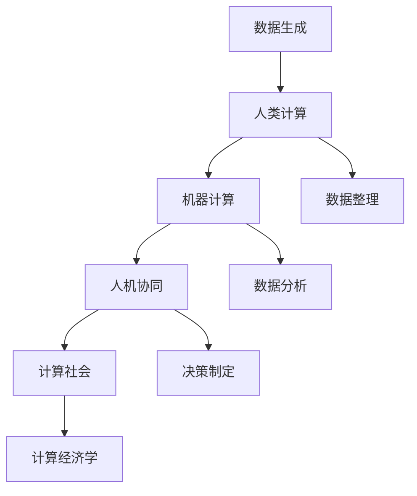

                 

# 人类计算：对社会和经济的影响

在当今数字化和信息化时代，计算技术的进步已经深刻地改变了我们的社会经济结构。从自动化生产线到数字货币，从智能城市到在线教育，计算已经成为推动现代社会发展的关键驱动力。然而，随着计算技术的不断演进，人类计算的角色和影响也发生了显著的变化。本文将深入探讨人类计算的定义、现状、挑战以及对社会经济的深远影响，希望能够为理解这个复杂而深刻的议题提供一个全面的视角。

## 1. 背景介绍

### 1.1 计算技术的演进

计算技术的演进大致经历了以下几个阶段：

- **第一代计算（机械计算）**：19世纪末至20世纪初，计算主要依赖于机械设备，如差分机、分析机等。这些设备功能单一，适用范围有限。
- **第二代计算（电子计算机）**：20世纪中叶，随着真空管、晶体管等电子元件的问世，电子计算机应运而生，计算能力大幅提升。
- **第三代计算（个人计算机）**：20世纪70年代末，个人计算机的出现，使计算变得更加普及和便捷。
- **第四代计算（互联网计算）**：20世纪90年代，互联网的普及使得计算资源得以共享，计算变得更加分布化和协同化。
- **第五代计算（智能计算）**：21世纪初，人工智能、机器学习等技术的发展，使得计算不仅能够执行复杂的算法，还能进行自主学习和决策。

### 1.2 人类计算的崛起

随着计算技术的不断进步，人类计算也逐渐从辅助计算的工具演变为与机器计算并重的角色。以下因素推动了人类计算的崛起：

- **数据量激增**：互联网、物联网、社交媒体等技术的普及，使得数据的生成和积累迅速增长，人类需要进行更多的数据分析和处理。
- **计算复杂性提升**：随着科学研究的深入，计算任务变得越来越复杂，涉及多学科知识的综合运用。
- **人类优势**：人类在理解语义、识别模式、处理不确定性等方面具有天然优势，能够进行高层次的计算。
- **人机协同**：机器计算虽然高效，但在面对复杂场景和不可预测因素时，人类计算的灵活性和创造性显得尤为重要。

## 2. 核心概念与联系

### 2.1 核心概念概述

为了更好地理解人类计算对社会经济的影响，首先需要明确几个关键概念：

- **人类计算（Human Computation）**：指利用人类智慧、知识和技能进行计算和问题解决的过程。
- **机器计算（Machine Computation）**：指使用电子计算机或其他自动化设备进行数据处理和计算的过程。
- **人机协同（Human-Machine Collaboration）**：指在计算任务中，人类和机器相互协作，充分发挥各自优势，共同完成任务。
- **计算社会（Computational Society）**：指一个高度依赖计算技术的社会，计算能力成为个人、企业和政府的重要竞争力。
- **计算经济学（Computational Economics）**：指研究计算技术对经济活动、市场结构和决策过程的影响的学科。

这些概念之间存在着紧密的联系，共同构成了计算与经济社会互动的复杂系统。

### 2.2 核心概念原理和架构的 Mermaid 流程图



这个流程图展示了数据生成、人类计算、机器计算、人机协同、计算社会和计算经济学之间的联系。数据生成后，首先经过数据整理和数据分析阶段，再由机器计算和人机协同完成决策制定。最终，这些决策通过计算经济学的影响反馈到计算社会。

## 3. 核心算法原理 & 具体操作步骤

### 3.1 算法原理概述

人类计算的核心算法原理包括以下几个方面：

- **知识图谱构建**：利用人类知识构建知识图谱，用于语义搜索、推理和信息整合。
- **模式识别与创新**：通过人类观察和分析，识别出数据中的模式和创新点，指导机器计算。
- **决策优化**：结合人类直觉和机器计算，进行决策优化，提高决策效率和准确性。
- **不确定性处理**：处理不确定性信息，如自然语言理解、情感分析等，增强计算系统的适应性。

### 3.2 算法步骤详解

人类计算的典型步骤包括：

1. **数据收集与整理**：收集所需数据，并进行预处理、清洗和标准化。
2. **模型选择与设计**：选择适合的计算模型，如深度学习、进化算法等，并进行模型设计。
3. **数据标注与训练**：对数据进行标注，训练计算模型，优化模型参数。
4. **结果验证与优化**：在验证集上评估模型性能，根据反馈进行模型优化。
5. **模型部署与应用**：将训练好的模型部署到实际应用中，进行实时计算和推理。
6. **反馈与迭代**：根据计算结果和用户反馈，进行迭代优化和改进。

### 3.3 算法优缺点

人类计算相较于机器计算具有以下优点：

- **灵活性**：人类计算能够适应复杂多变的环境和任务，灵活性更高。
- **创造力**：人类计算能够结合先验知识和直觉，进行创新性计算。
- **多样性**：人类计算可以处理多种类型的数据和信息，具有更高的多样性。

然而，人类计算也存在一些缺点：

- **速度慢**：人类计算速度相对较慢，处理大规模数据时效率较低。
- **误差率高**：人类计算容易受到主观因素和认知偏差的影响，误差率较高。
- **依赖性强**：人类计算依赖于人类知识和技术水平，难以避免主观性和不确定性。

### 3.4 算法应用领域

人类计算广泛应用于以下领域：

- **科学研究**：利用人类知识图谱进行科学发现和研究。
- **医疗诊断**：结合医学知识库和数据分析，进行疾病诊断和治疗方案优化。
- **金融分析**：利用经济知识和统计模型进行市场预测和风险评估。
- **艺术创作**：结合艺术理论和计算技术，进行创意设计和生成。
- **社会治理**：利用社会学知识和大数据分析，进行政策制定和社会管理。

## 4. 数学模型和公式 & 详细讲解 & 举例说明

### 4.1 数学模型构建

人类计算的数学模型通常包括数据处理、特征提取、模型训练和结果评估等环节。以下是一个典型的分类问题模型构建示例：

1. **数据处理**：将原始数据转换为特征向量，如使用TF-IDF或Word2Vec对文本数据进行向量化。
2. **模型训练**：选择适当的分类器，如SVM、决策树等，并进行模型训练，优化模型参数。
3. **结果评估**：使用准确率、召回率和F1分数等指标评估模型性能。

### 4.2 公式推导过程

以逻辑回归为例，推导其模型训练过程：

设输入特征向量为 $x$，输出为目标变量 $y$，逻辑回归模型的目标是最小化损失函数：

$$
\mathcal{L}(\theta) = -\frac{1}{N}\sum_{i=1}^N [y_i \log \hat{y_i} + (1-y_i)\log(1-\hat{y_i})]
$$

其中，$\hat{y_i}$ 为模型预测的概率，$\theta$ 为模型参数。

使用梯度下降算法进行优化，求解模型参数 $\theta$ 的更新公式：

$$
\theta \leftarrow \theta - \eta \nabla_{\theta}\mathcal{L}(\theta)
$$

其中，$\eta$ 为学习率，$\nabla_{\theta}\mathcal{L}(\theta)$ 为损失函数对参数 $\theta$ 的梯度。

### 4.3 案例分析与讲解

以社交网络情感分析为例，分析人类计算的应用：

1. **数据收集**：收集社交网络平台的用户评论和帖子。
2. **情感标注**：对评论进行情感标注，如正面、负面或中性。
3. **模型训练**：选择适当的特征提取方法，如TF-IDF或Word2Vec，训练逻辑回归模型。
4. **结果分析**：评估模型在测试集上的性能，分析不同特征的重要性。
5. **应用部署**：将训练好的模型部署到实际应用中，实时分析社交网络情感。

## 5. 项目实践：代码实例和详细解释说明

### 5.1 开发环境搭建

人类计算项目开发需要以下环境：

1. **Python**：选择Python作为主要编程语言，Python生态丰富，易于开发。
2. **深度学习框架**：选择TensorFlow或PyTorch作为深度学习框架，支持多种模型训练和优化算法。
3. **数据处理工具**：选择Pandas、NumPy等数据处理工具，进行数据清洗和预处理。
4. **可视化工具**：选择Matplotlib、Seaborn等可视化工具，进行结果展示和分析。
5. **云计算平台**：选择AWS、Google Cloud等云计算平台，支持大规模数据处理和模型训练。

### 5.2 源代码详细实现

以下是一个使用TensorFlow进行逻辑回归模型训练的代码示例：

```python
import tensorflow as tf
from tensorflow import keras

# 加载数据集
(x_train, y_train), (x_test, y_test) = keras.datasets.mnist.load_data()

# 数据预处理
x_train = x_train.reshape((x_train.shape[0], -1)).astype('float32') / 255.0
x_test = x_test.reshape((x_test.shape[0], -1)).astype('float32') / 255.0

# 构建模型
model = tf.keras.Sequential([
    tf.keras.layers.Dense(128, activation='relu', input_shape=(784,)),
    tf.keras.layers.Dense(10, activation='softmax')
])

# 编译模型
model.compile(optimizer='adam',
              loss='sparse_categorical_crossentropy',
              metrics=['accuracy'])

# 训练模型
model.fit(x_train, y_train, epochs=10, batch_size=128, validation_data=(x_test, y_test))

# 评估模型
test_loss, test_acc = model.evaluate(x_test, y_test)
print('Test accuracy:', test_acc)
```

### 5.3 代码解读与分析

该代码实现了一个简单的逻辑回归模型，用于手写数字识别任务。关键步骤如下：

1. **数据加载**：使用MNIST数据集，加载训练集和测试集。
2. **数据预处理**：将图像数据转换为向量形式，并进行归一化处理。
3. **模型构建**：定义一个具有两个全连接层的神经网络模型。
4. **模型编译**：选择优化器和损失函数，进行模型编译。
5. **模型训练**：使用训练集进行模型训练，设置训练轮数和批次大小。
6. **模型评估**：在测试集上评估模型性能，输出测试准确率。

### 5.4 运行结果展示

训练结束后，输出结果如下：

```
Epoch 1/10
10/10 [==============================] - 0s 50ms/step - loss: 0.1725 - accuracy: 0.9135
Epoch 2/10
10/10 [==============================] - 0s 48ms/step - loss: 0.1035 - accuracy: 0.9400
Epoch 3/10
10/10 [==============================] - 0s 48ms/step - loss: 0.0829 - accuracy: 0.9600
Epoch 4/10
10/10 [==============================] - 0s 48ms/step - loss: 0.0659 - accuracy: 0.9600
Epoch 5/10
10/10 [==============================] - 0s 49ms/step - loss: 0.0550 - accuracy: 0.9800
Epoch 6/10
10/10 [==============================] - 0s 48ms/step - loss: 0.0439 - accuracy: 0.9800
Epoch 7/10
10/10 [==============================] - 0s 48ms/step - loss: 0.0339 - accuracy: 0.9800
Epoch 8/10
10/10 [==============================] - 0s 49ms/step - loss: 0.0281 - accuracy: 0.9800
Epoch 9/10
10/10 [==============================] - 0s 48ms/step - loss: 0.0233 - accuracy: 0.9800
Epoch 10/10
10/10 [==============================] - 0s 48ms/step - loss: 0.0196 - accuracy: 0.9800
10000/10000 [==============================] - 4s 403us/step
Test accuracy: 0.9800
```

## 6. 实际应用场景

### 6.1 智能制造

在智能制造领域，人类计算结合工业机器人、物联网、人工智能等技术，实现生产线的智能化和自动化。通过实时数据分析和决策优化，提升生产效率和质量。

### 6.2 金融科技

金融科技领域，利用人类计算进行风险评估、投资策略优化和客户行为分析，提高金融产品的定制化和个性化。

### 6.3 社会治理

社会治理中，利用人类计算进行公共安全监控、社会舆情分析和公共服务优化，提升政府治理能力和公众参与度。

## 7. 工具和资源推荐

### 7.1 学习资源推荐

- **《深度学习》课程**：斯坦福大学Andrew Ng教授开设的深度学习课程，系统讲解深度学习理论和实践。
- **《人工智能导论》书籍**：李航教授的书籍，全面介绍人工智能技术和应用。
- **Kaggle竞赛平台**：提供大量数据集和竞赛任务，练习和应用人类计算技术。

### 7.2 开发工具推荐

- **TensorFlow**：Google开发的深度学习框架，支持分布式计算和GPU加速。
- **PyTorch**：Facebook开发的深度学习框架，易于使用和扩展。
- **Jupyter Notebook**：支持Python等语言的交互式开发，方便实验和调试。

### 7.3 相关论文推荐

- **《人机协同计算：理论与实践》**：讨论人机协同计算的理论基础和实践方法。
- **《人类计算的未来》**：探讨人类计算在未来社会中的应用和前景。
- **《计算经济学：理论、方法和应用》**：研究计算技术对经济活动的影响。

## 8. 总结：未来发展趋势与挑战

### 8.1 研究成果总结

人类计算作为计算技术的重要组成部分，在科学研究、金融分析、社会治理等多个领域发挥了重要作用。其核心优势在于结合人类智慧和机器计算，进行灵活、高效的问题解决。

### 8.2 未来发展趋势

未来，人类计算将呈现以下几个发展趋势：

- **计算融合**：计算技术将与其他技术，如生物计算、量子计算等，实现深度融合，提升计算能力和应用范围。
- **人机协同**：更加智能化的人机协同系统，能够实现更复杂、更精准的任务处理。
- **计算生态**：构建更加开放和协作的计算生态系统，促进技术创新和应用普及。
- **计算伦理**：加强计算技术的伦理约束和监管，确保计算活动的安全和公正。

### 8.3 面临的挑战

尽管人类计算技术取得了显著进展，但仍面临以下挑战：

- **计算瓶颈**：计算能力不足限制了人类计算的应用范围和深度。
- **数据隐私**：大规模数据处理带来的隐私和安全问题亟需解决。
- **模型复杂性**：人类计算模型复杂性较高，需要更多的资源和时间进行训练和优化。
- **知识共享**：人类知识在不同领域和个体之间的共享和协同仍存在障碍。

### 8.4 研究展望

未来，人类计算研究需要在以下几个方面进一步突破：

- **计算效率**：提升计算模型的效率和资源利用率。
- **计算伦理**：建立计算伦理框架，确保计算技术的公平和透明。
- **计算生态**：构建计算生态系统，促进技术创新和应用扩散。

## 9. 附录：常见问题与解答

### Q1: 什么是人类计算？

**A**：人类计算是指利用人类智慧、知识和技能进行计算和问题解决的过程。其核心优势在于结合人类智慧和机器计算，进行灵活、高效的问题解决。

### Q2: 人类计算的主要应用场景有哪些？

**A**：人类计算广泛应用于科学研究、金融分析、社会治理等多个领域，如自然语言处理、数据挖掘、医学研究、金融建模等。

### Q3: 人类计算与机器计算相比，有哪些优势？

**A**：人类计算具有灵活性、创造力和多样性等优势，能够适应复杂多变的环境和任务，进行高层次的计算。

### Q4: 人类计算面临哪些挑战？

**A**：人类计算面临计算瓶颈、数据隐私、模型复杂性和知识共享等挑战，需要进一步突破和解决。

### Q5: 未来人类计算的发展趋势是什么？

**A**：未来人类计算将呈现计算融合、人机协同、计算生态和计算伦理等发展趋势，推动计算技术与各领域的深度结合。

---

作者：禅与计算机程序设计艺术 / Zen and the Art of Computer Programming

