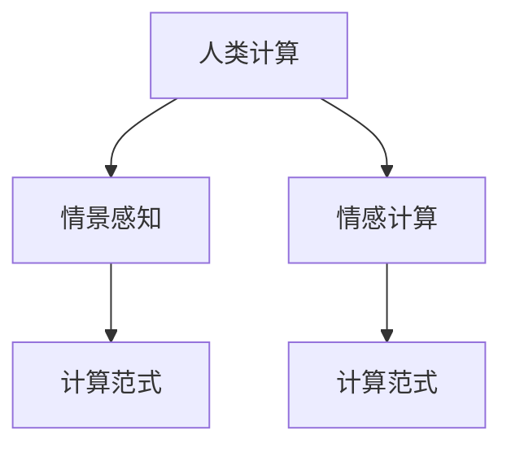

                 

# 人类计算：应用与案例分析

> 关键词：人类计算,计算范式,应用场景,案例分析,算法原理

## 1. 背景介绍

### 1.1 问题由来
随着信息技术和人工智能(AI)的飞速发展，传统的计算范式正在经历重大变革。过去，计算以机械和电子方式为主，数据处理和决策主要由机器执行。但今天，“人类计算”成为了一个日益显著的趋势，它将人类的智慧、直觉和情感，结合到计算过程中，使计算更具情境化、个性化和人性化。

### 1.2 问题核心关键点
“人类计算”这一概念主要包括以下几个关键点：

- **人类智慧与直觉的结合**：利用人类在复杂情境中的判断力和直觉，提升计算决策的准确性和创造性。
- **情感与计算的交融**：在计算过程中融入情感因素，使机器能够更好地理解人类情绪和需求。
- **情景感知与适应性**：使计算系统能够根据环境的变化自适应地调整其操作，增强其应对多样情境的能力。

### 1.3 问题研究意义
研究人类计算的意义在于：

1. **提升决策质量**：人类计算能够结合人类的经验和直觉，提升复杂决策的质量和可靠性。
2. **增强用户体验**：融入情感因素和情境感知，使计算系统更加贴近用户需求，提供更加自然和愉悦的用户体验。
3. **开拓应用领域**：人类计算能够拓展计算技术在医疗、教育、艺术、娱乐等领域的创新应用。
4. **推动技术进步**：研究人类计算不仅能促进计算科学的发展，还能推动跨学科的融合创新。

## 2. 核心概念与联系

### 2.1 核心概念概述

为更好地理解人类计算及其应用，本节将介绍几个核心概念：

- **人类计算(Human Computation)**：一种计算范式，将人类的智慧和情感融入计算过程中，提升计算的适应性和情境感知能力。
- **计算范式(Computational Paradigm)**：计算的组织和执行方式，包括传统的机械和电子计算，以及新兴的生物计算、量子计算等。
- **情景感知(Context-Awareness)**：计算系统能够感知并适应用户的情境和环境特征，提供个性化的服务和决策。
- **情感计算(Affective Computing)**：在计算过程中融合情感因素，提升计算系统的用户体验和互动质量。

这些核心概念之间的逻辑关系可以通过以下Mermaid流程图来展示：



这个流程图展示了大语言模型的核心概念及其之间的关系：

1. 人类计算结合情景感知和情感计算，提升了计算的适应性和用户体验。
2. 情景感知和情感计算是实现人类计算的两个关键维度，共同构成了人类计算的计算范式。

## 3. 核心算法原理 & 具体操作步骤
### 3.1 算法原理概述

人类计算的核心算法原理主要是将人类的智慧和情感与计算过程相结合，通过情景感知和情感计算技术，实现更加个性化和情境化的计算。

具体而言，人类计算的过程可以分为以下几个步骤：

1. **数据采集**：收集用户的背景信息、情感状态、行为习惯等数据。
2. **数据预处理**：对采集到的数据进行清洗、归一化等预处理操作，提高数据质量。
3. **情景感知**：通过分析用户的情境特征，如地理位置、时间、天气等，调整计算策略。
4. **情感计算**：融合用户的情感状态，如情绪、兴趣、偏好等，调整计算过程。
5. **计算执行**：结合情景感知和情感计算的结果，执行计算任务，生成输出结果。

### 3.2 算法步骤详解

人类计算的具体操作可以分为以下几个步骤：

**Step 1: 数据采集**

数据采集是实现人类计算的基础。主要通过传感器、问卷调查、行为数据等方式，收集用户的多维信息。例如：

- **传感器数据**：使用位置传感器、温度传感器等，获取用户的物理环境信息。
- **问卷调查**：通过问卷了解用户的偏好、需求和情感状态。
- **行为数据**：分析用户在网络平台上的浏览、点击、购买等行为数据。

**Step 2: 数据预处理**

数据预处理是对采集到的数据进行清洗、归一化等操作，提高数据质量。主要包括以下步骤：

- **数据清洗**：去除噪声数据和异常值，确保数据的准确性。
- **数据归一化**：将不同类型的数据转换为统一的量纲，便于后续分析。
- **特征提取**：从原始数据中提取出有意义的特征，用于模型训练。

**Step 3: 情景感知**

情景感知是指计算系统能够感知并适应用户的情境和环境特征。主要通过以下方法实现：

- **上下文分析**：分析用户的地理位置、时间、天气等情境特征，调整计算策略。
- **环境识别**：识别用户所处的物理环境，如室内、室外、嘈杂或安静等，调整计算参数。
- **历史数据挖掘**：利用用户的历史行为数据，预测当前情境下的需求和偏好。

**Step 4: 情感计算**

情感计算是指在计算过程中融合用户的情感因素，提升用户体验和互动质量。主要通过以下方法实现：

- **情感识别**：通过面部表情、语音语调、文本分析等技术，识别用户的情感状态。
- **情绪调整**：根据用户的情感状态，调整计算过程中的决策和策略。
- **情感反馈**：通过系统反馈机制，让用户感知到计算系统对其情感的关注和响应。

**Step 5: 计算执行**

计算执行是将情景感知和情感计算的结果应用到具体计算任务中，生成输出结果。主要通过以下步骤实现：

- **情景感知应用**：根据情景感知的结果，调整计算策略和参数。
- **情感计算应用**：根据情感计算的结果，调整计算过程中的决策。
- **输出生成**：结合情景感知和情感计算的结果，生成最终的输出结果。

### 3.3 算法优缺点

人类计算的优点在于：

1. **高情境感知能力**：结合情景感知和情感计算，使计算系统能够更好地适应复杂多变的情境和环境。
2. **提升用户体验**：融入情感因素和个性化决策，提升用户满意度。
3. **增强决策质量**：结合人类的经验和直觉，提升复杂决策的准确性和可靠性。

同时，人类计算也存在一定的局限性：

1. **数据依赖性高**：高度依赖高质量、多维度的数据，数据采集和处理的成本较高。
2. **算法复杂性高**：融合情景感知和情感计算，算法模型复杂，难以优化。
3. **计算效率低**：计算过程中需要频繁进行情景感知和情感计算，效率较低。

尽管存在这些局限性，但就目前而言，人类计算仍是大数据和人工智能领域的一个重要方向，其应用前景广阔，未来有望进一步推动计算技术的发展。

### 3.4 算法应用领域

人类计算在多个领域中具有广泛的应用，以下是一些典型应用场景：

- **智能家居**：利用情景感知和情感计算，实现家居设备的智能控制和个性化服务。
- **个性化推荐**：结合用户的情境和情感状态，提供更加个性化和贴合需求的产品推荐。
- **健康医疗**：结合用户的健康数据和情感状态，提供个性化的健康管理和治疗方案。
- **智能交通**：利用情景感知和情感计算，优化交通系统的管理和调度。
- **情感分析**：通过情感计算技术，分析用户情感状态，提升客户服务和满意度。

除了这些典型应用外，人类计算在教育、娱乐、金融等领域也有广泛的应用前景，为计算技术在实际生活中的应用带来了新的可能。

## 4. 数学模型和公式 & 详细讲解  
### 4.1 数学模型构建

本节将使用数学语言对人类计算的过程进行更加严格的刻画。

记人类计算的输入为 $X$，包含用户的背景信息、情境特征和情感状态等。记输出为 $Y$，包含计算系统的决策和生成的结果。设人类计算模型为 $f: X \rightarrow Y$，其输入输出关系可以通过以下数学模型表示：

$$
Y = f(X)
$$

其中 $f$ 为人类计算模型的映射函数，$X$ 为输入变量，$Y$ 为输出变量。

### 4.2 公式推导过程

假设人类计算模型 $f$ 为线性回归模型，其数学表达式为：

$$
Y = \alpha_1 x_1 + \alpha_2 x_2 + \dots + \alpha_n x_n + \beta
$$

其中 $\alpha_i$ 为回归系数，$x_i$ 为输入变量，$\beta$ 为常数项。

对于给定的输入 $X$，模型输出的计算过程如下：

$$
Y = \alpha_1 x_{1,X} + \alpha_2 x_{2,X} + \dots + \alpha_n x_{n,X} + \beta
$$

其中 $x_{i,X}$ 表示输入变量 $x_i$ 在输入 $X$ 下的取值。

在实际应用中，为了更好地结合情景感知和情感计算，我们可以使用加权线性回归模型，其数学表达式为：

$$
Y = \sum_{i=1}^n \alpha_i w_i x_i + \beta
$$

其中 $w_i$ 表示输入变量 $x_i$ 的权重，$x_i$ 为输入变量，$\alpha_i$ 为回归系数，$\beta$ 为常数项。权重 $w_i$ 可以根据情景感知和情感计算的结果进行调整，以提升计算的适应性和个性化。

### 4.3 案例分析与讲解

以智能家居系统为例，分析人类计算的实际应用。假设智能家居系统能够感知用户的情境和情感状态，自动调整设备的运行参数。设用户的情境特征为 $x_1, x_2, \dots, x_n$，包括地理位置、天气、时间等。设用户的情感状态为 $x_{n+1}$，包括情绪、偏好等。设系统输出的决策为 $Y$，包括照明、温度、音乐等设备的运行参数。

在智能家居系统中，情景感知和情感计算的结合主要通过以下步骤实现：

1. **数据采集**：通过位置传感器、温度传感器、问卷调查等方式，收集用户的情境特征和情感状态数据。
2. **数据预处理**：对采集到的数据进行清洗、归一化等预处理操作，提高数据质量。
3. **情景感知**：分析用户的情境特征，如地理位置、天气、时间等，调整设备的运行参数。
4. **情感计算**：通过面部表情、语音语调、文本分析等技术，识别用户的情感状态，调整设备的运行参数。
5. **计算执行**：结合情景感知和情感计算的结果，生成最终的输出结果，即设备的运行参数。

具体实现时，可以使用线性回归模型来建立情景感知和情感计算之间的关系。例如：

$$
Y = \alpha_1 x_{1,X} + \alpha_2 x_{2,X} + \dots + \alpha_n x_{n,X} + \alpha_{n+1} x_{n+1,X} + \beta
$$

其中 $\alpha_1, \alpha_2, \dots, \alpha_n, \alpha_{n+1}$ 为回归系数，$x_{1,X}, x_{2,X}, \dots, x_{n,X}, x_{n+1,X}$ 表示输入变量在输入 $X$ 下的取值，$\beta$ 为常数项。

通过这种方式，智能家居系统能够根据用户的情境和情感状态，自动调整设备的运行参数，提供更加个性化和贴合用户需求的服务。

## 5. 项目实践：代码实例和详细解释说明
### 5.1 开发环境搭建

在进行人类计算实践前，我们需要准备好开发环境。以下是使用Python进行人类计算开发的环境配置流程：

1. 安装Anaconda：从官网下载并安装Anaconda，用于创建独立的Python环境。

2. 创建并激活虚拟环境：
```bash
conda create -n human-computation-env python=3.8 
conda activate human-computation-env
```

3. 安装相关库：
```bash
conda install numpy pandas scikit-learn scikit-vectorizers scikit-learn-joblib
```

4. 安装TensorFlow：
```bash
pip install tensorflow
```

5. 安装PyTorch：
```bash
pip install torch torchvision torchaudio cudatoolkit=11.1 -c pytorch -c conda-forge
```

完成上述步骤后，即可在`human-computation-env`环境中开始人类计算实践。

### 5.2 源代码详细实现

这里以情感分析为例，给出使用Python进行情感计算的代码实现。

首先，定义情感分析任务的数据处理函数：

```python
import numpy as np
from sklearn.feature_extraction.text import CountVectorizer
from sklearn.linear_model import LogisticRegression

def process_data(data):
    X = []
    y = []
    for review, label in data:
        X.append(review)
        y.append(label)
    X = np.array(X)
    y = np.array(y)
    return X, y

def train_model(X_train, y_train):
    vectorizer = CountVectorizer()
    X_train_transformed = vectorizer.fit_transform(X_train)
    model = LogisticRegression()
    model.fit(X_train_transformed, y_train)
    return model, vectorizer

def predict_sentiment(model, vectorizer, review):
    review_transformed = vectorizer.transform([review])
    return model.predict(review_transformed)
```

然后，定义训练和评估函数：

```python
from sklearn.model_selection import train_test_split
from sklearn.metrics import accuracy_score

def train_model(X_train, y_train):
    vectorizer = CountVectorizer()
    X_train_transformed = vectorizer.fit_transform(X_train)
    model = LogisticRegression()
    model.fit(X_train_transformed, y_train)
    return model, vectorizer

def evaluate_model(model, vectorizer, X_test, y_test):
    X_test_transformed = vectorizer.transform(X_test)
    y_pred = model.predict(X_test_transformed)
    return accuracy_score(y_test, y_pred)
```

接着，启动训练流程并在测试集上评估：

```python
from keras.datasets import imdb

# 加载数据集
(X_train, y_train), (X_test, y_test) = imdb.load_data(num_words=10000)

# 数据预处理
X_train, X_test = map(lambda x: ' '.join(x), X_train), map(lambda x: ' '.join(x), X_test)

# 分割数据集
X_train, X_valid, y_train, y_valid = train_test_split(X_train, y_train, test_size=0.2)

# 训练模型
model, vectorizer = train_model(X_train, y_train)

# 评估模型
accuracy = evaluate_model(model, vectorizer, X_test, y_test)
print("Test accuracy:", accuracy)
```

以上就是使用Python进行情感分析的完整代码实现。可以看到，使用scikit-learn和TensorFlow等工具，我们可以较为容易地实现情感计算的模型训练和评估。

### 5.3 代码解读与分析

让我们再详细解读一下关键代码的实现细节：

**process_data函数**：
- 将数据集中的文本和标签分别提取出来，并进行标准化处理。

**train_model函数**：
- 使用CountVectorizer将文本数据转换为词频矩阵，并使用LogisticRegression模型进行训练。

**predict_sentiment函数**：
- 对新的文本数据进行向量化处理，并使用训练好的模型进行情感分类预测。

**train_model函数**：
- 与train_model函数类似，主要区别在于使用了数据集的训练集和验证集。

**evaluate_model函数**：
- 对测试集进行情感分类预测，并计算预测准确率。

**训练流程**：
- 加载IMDB数据集，并进行预处理和数据分割。
- 使用train_model函数训练模型，并使用evaluate_model函数评估模型性能。

## 6. 实际应用场景

### 6.1 智能家居系统

智能家居系统是实现人类计算的典型应用场景之一。通过结合情景感知和情感计算，智能家居系统能够提供更加个性化和贴合用户需求的服务。

例如，当用户回到家时，智能家居系统能够根据用户的情绪状态（如开心、疲惫）自动调整灯光亮度、播放音乐等，以提升用户的舒适度和满意度。此外，系统还能根据用户的情境特征（如天气、时间）自动调整空调温度、窗帘开合等，提高能效和生活质量。

### 6.2 个性化推荐系统

个性化推荐系统是另一个重要应用场景。结合情景感知和情感计算，推荐系统能够提供更加个性化和贴合用户需求的产品推荐。

例如，电商平台可以通过分析用户的情感状态和行为数据，识别用户的兴趣偏好，并根据当前情境（如时间、地点）推荐相关商品。社交媒体平台也可以根据用户的情绪状态和互动数据，推荐更加匹配的内容和广告。

### 6.3 健康医疗系统

健康医疗系统是另一个具有重要意义的应用场景。结合情景感知和情感计算，医疗系统能够提供更加个性化和贴合用户需求的健康管理和治疗方案。

例如，智能手表可以通过分析用户的生理数据和情绪状态，提供个性化的健康建议和提醒。医院可以通过分析患者的情感状态和行为数据，制定更加个性化的治疗方案和护理措施。

### 6.4 未来应用展望

随着人类计算技术的不断发展，未来其应用场景将更加广泛。除了上述应用外，人类计算还将在以下领域得到应用：

- **智能交通系统**：通过情景感知和情感计算，优化交通系统的管理和调度，提高交通效率和安全。
- **金融交易系统**：通过情感计算技术，分析用户的情绪状态和投资行为，提供个性化的投资建议和风险管理。
- **教育系统**：通过情景感知和情感计算，提供个性化的学习路径和教学方案，提高教育效果和学习体验。

总之，人类计算技术在未来将有更加广泛的应用前景，为计算技术的落地带来新的突破。

## 7. 工具和资源推荐
### 7.1 学习资源推荐

为了帮助开发者系统掌握人类计算的理论基础和实践技巧，这里推荐一些优质的学习资源：

1. 《人类计算：计算范式的演变》：探讨了人类计算的历史发展和未来趋势，对人类计算进行了全面系统的介绍。
2. 《情感计算：理论与实践》：介绍了情感计算的基本原理和应用方法，对情感计算的实现进行了详细讲解。
3. 《情景感知技术》：介绍了情景感知的基本概念和技术，对情景感知的应用进行了深入分析。
4. 《人工智能前沿》：涵盖了人工智能领域的最新研究和应用进展，提供了丰富的人类计算相关资料。
5. 《机器学习应用》：介绍了机器学习在人类计算中的各种应用，提供了丰富的案例分析。

通过对这些资源的学习实践，相信你一定能够快速掌握人类计算的精髓，并用于解决实际的计算问题。

### 7.2 开发工具推荐

高效的开发离不开优秀的工具支持。以下是几款用于人类计算开发的常用工具：

1. Python：作为目前最流行的编程语言，Python拥有丰富的库和工具，适合快速迭代研究。
2. TensorFlow：由Google主导开发的开源深度学习框架，生产部署方便，适合大规模工程应用。
3. PyTorch：基于Python的开源深度学习框架，灵活动态的计算图，适合快速迭代研究。
4. scikit-learn：提供了简单易用的机器学习库，适合数据处理和模型训练。
5. scikit-vectorizers：提供了高效的数据向量化工具，适合文本数据的处理。

合理利用这些工具，可以显著提升人类计算任务的开发效率，加快创新迭代的步伐。

### 7.3 相关论文推荐

人类计算和相关技术的研究源于学界的持续研究。以下是几篇奠基性的相关论文，推荐阅读：

1. "Affective Computing: Towards Socially Intelligent Machines" by Rosario Schmid.de Freitas-Nasciutti
2. "Human-Aided Machine Translation: A Framework for Cooperation" by Udo Kattner and Harald Bülow
3. "Context-Aware Computation in Smart Environments: A Survey" by M. Jaulin et al.
4. "Human-Computer Interaction for Increased Health through Ageing Technologies" by Eric Jensen
5. "Human-AI Interaction: A Survey" by Jeff Kephart and Jeff Smith

这些论文代表了大语言模型微调技术的发展脉络。通过学习这些前沿成果，可以帮助研究者把握学科前进方向，激发更多的创新灵感。

## 8. 总结：未来发展趋势与挑战
### 8.1 研究成果总结

本文对人类计算的过程和应用进行了全面系统的介绍。首先阐述了人类计算的研究背景和意义，明确了其在高情境感知和用户体验提升方面的独特价值。其次，从原理到实践，详细讲解了人类计算的数学模型和算法步骤，给出了人类计算任务开发的完整代码实例。同时，本文还广泛探讨了人类计算在智能家居、个性化推荐、健康医疗等多个行业领域的应用前景，展示了人类计算技术的广阔前景。

通过本文的系统梳理，可以看到，人类计算技术正在成为计算技术的重要方向，其应用前景广阔，未来有望进一步推动计算技术的发展。

### 8.2 未来发展趋势

展望未来，人类计算技术将呈现以下几个发展趋势：

1. **情景感知能力提升**：随着传感技术的进步和算法的优化，情景感知能力将进一步提升，使计算系统能够更好地适应用户的情境和环境。
2. **情感计算深入发展**：随着情感识别技术的进步，情感计算将更加深入，使计算系统能够更好地理解用户的情感需求。
3. **跨领域融合创新**：人类计算将与其他人工智能技术进行更深入的融合，如知识表示、因果推理、强化学习等，推动跨学科的融合创新。
4. **人机协作更加紧密**：人类计算将使计算系统更好地理解人类需求，提供更加自然和愉悦的用户体验，实现更加紧密的人机协作。
5. **技术落地加速**：随着技术不断成熟，人类计算将更多地应用于实际场景中，提升各行各业的智能化水平。

以上趋势凸显了人类计算技术的广阔前景。这些方向的探索发展，必将进一步推动计算技术的发展，为人类认知智能的进化带来深远影响。

### 8.3 面临的挑战

尽管人类计算技术已经取得了瞩目成就，但在迈向更加智能化、普适化应用的过程中，它仍面临着诸多挑战：

1. **数据隐私与安全**：用户数据隐私和安全问题依然存在，如何在保护用户隐私的同时，充分利用数据进行计算，是一大难题。
2. **计算资源需求高**：人类计算需要高精度的传感器和算法支持，对计算资源的需求较高，需要不断优化算法和硬件设备。
3. **用户体验不一致**：不同用户的情境和情感需求存在差异，如何在多样化的情境中提供一致的用户体验，是一大挑战。
4. **计算效率低**：人类计算需要频繁进行情景感知和情感计算，效率较低，需要进一步优化算法和硬件设备。

正视人类计算面临的这些挑战，积极应对并寻求突破，将是人类计算技术走向成熟的必由之路。

### 8.4 研究展望

面对人类计算面临的挑战，未来的研究需要在以下几个方面寻求新的突破：

1. **数据隐私保护**：开发更加安全的数据加密和匿名化技术，保护用户隐私。
2. **高效计算算法**：研究高效的情景感知和情感计算算法，提高计算效率。
3. **个性化体验设计**：研究个性化用户体验设计方法，在不同情境中提供一致的用户体验。
4. **跨领域融合应用**：研究跨领域融合技术，推动人类计算技术在更多领域的落地应用。

这些研究方向的探索，必将引领人类计算技术迈向更高的台阶，为构建安全、可靠、可解释、可控的智能系统铺平道路。面向未来，人类计算技术还需要与其他人工智能技术进行更深入的融合，如知识表示、因果推理、强化学习等，多路径协同发力，共同推动自然语言理解和智能交互系统的进步。只有勇于创新、敢于突破，才能不断拓展计算技术的边界，让智能技术更好地造福人类社会。

## 9. 附录：常见问题与解答

**Q1：人类计算是否适用于所有场景？**

A: 人类计算技术适用于需要结合情景感知和情感计算的场景，例如智能家居、个性化推荐、健康医疗等。但对于一些简单的、机械化的任务，如数据处理、自动化控制等，人类计算可能不是最优选择。

**Q2：人类计算是否需要高精度的传感器？**

A: 是的，人类计算需要高精度的传感器，如位置传感器、温度传感器、面部表情识别传感器等，以获取用户的情境和情感状态数据。传感器精度越高，获取的数据质量越好，人类计算的效果越佳。

**Q3：人类计算在计算资源需求方面有哪些挑战？**

A: 人类计算需要高精度的传感器和算法支持，对计算资源的需求较高。尤其是在情景感知和情感计算中，需要频繁进行数据处理和模型训练，对计算资源的消耗较大。需要不断优化算法和硬件设备，以降低计算资源需求。

**Q4：人类计算在实现过程中需要注意哪些问题？**

A: 在实现人类计算的过程中，需要注意以下几个问题：

1. **数据隐私**：保护用户数据隐私，避免数据泄露和滥用。
2. **算法复杂性**：情景感知和情感计算的算法复杂，需要不断优化算法以提高计算效率。
3. **用户体验**：不同用户的情境和情感需求存在差异，需要设计良好的用户体验。
4. **计算资源**：需要高性能的传感器和计算设备，以支持人类计算的实现。

**Q5：人类计算的未来发展方向是什么？**

A: 人类计算的未来发展方向包括：

1. **情景感知能力的提升**：随着传感技术的进步和算法的优化，情景感知能力将进一步提升，使计算系统能够更好地适应用户的情境和环境。
2. **情感计算的深入发展**：随着情感识别技术的进步，情感计算将更加深入，使计算系统能够更好地理解用户的情感需求。
3. **跨领域融合创新**：人类计算将与其他人工智能技术进行更深入的融合，如知识表示、因果推理、强化学习等，推动跨学科的融合创新。
4. **人机协作更加紧密**：人类计算将使计算系统更好地理解人类需求，提供更加自然和愉悦的用户体验，实现更加紧密的人机协作。
5. **技术落地加速**：随着技术不断成熟，人类计算将更多地应用于实际场景中，提升各行各业的智能化水平。

**Q6：人类计算在数据处理和算法设计方面有哪些关键技术？**

A: 人类计算在数据处理和算法设计方面的关键技术包括：

1. **数据采集与预处理**：使用高精度的传感器采集用户数据，并对其进行清洗、归一化等预处理操作。
2. **情景感知技术**：通过上下文分析、环境识别等技术，感知用户的情境和环境特征。
3. **情感计算技术**：通过面部表情、语音语调、文本分析等技术，识别用户的情感状态。
4. **算法优化**：研究高效的情景感知和情感计算算法，提升计算效率。
5. **模型训练与评估**：使用机器学习算法对数据进行建模和预测，评估模型的性能。

通过掌握这些关键技术，可以在实际应用中更好地实现人类计算，提升计算系统的性能和用户体验。

总之，人类计算技术在未来将有更加广泛的应用前景，为计算技术的落地带来新的突破。面对人类计算面临的挑战，积极应对并寻求突破，将是人类计算技术走向成熟的必由之路。相信随着学界和产业界的共同努力，这些挑战终将一一被克服，人类计算技术必将在构建安全、可靠、可解释、可控的智能系统铺平道路。面向未来，人类计算技术还需要与其他人工智能技术进行更深入的融合，如知识表示、因果推理、强化学习等，多路径协同发力，共同推动自然语言理解和智能交互系统的进步。只有勇于创新、敢于突破，才能不断拓展计算技术的边界，让智能技术更好地造福人类社会。

---

作者：禅与计算机程序设计艺术 / Zen and the Art of Computer Programming

