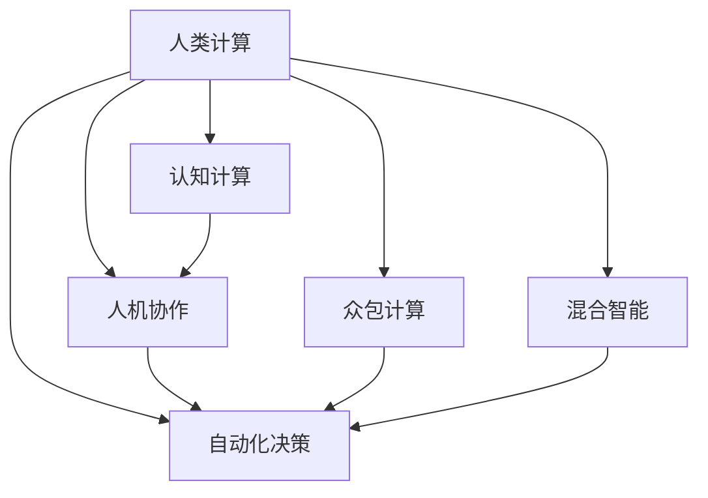

                 

# 人类计算：探索人类潜力的无限可能

在当前科技高速发展的时代，人工智能（AI）和计算机技术已经渗透到生活的方方面面，从日常对话的智能助手到复杂的科学计算，再到高度自动化的工业生产，AI和计算机的计算能力不断拓展，推动着人类社会的进步。然而，在这背后，有一股不可忽视的力量，那就是人类计算（Human Computation），即利用人类的认知能力与计算机系统相结合，共同完成复杂任务的方法。本文将深入探讨人类计算的核心概念、算法原理与操作步骤，并分析其优缺点与应用领域，最后展望未来发展趋势与面临的挑战。

## 1. 背景介绍

### 1.1 问题由来

人工智能与计算机技术虽然为社会发展带来了巨大便利，但其核心计算逻辑依然基于预先设计好的算法和规则，这些算法往往需要大量的数据训练才能达到最佳效果。但在某些场景下，这些基于数据驱动的计算方法难以全面覆盖人类认知能力的复杂性和多样性。人类计算便应运而生，它将人类认知与计算机计算相结合，利用人类的直觉、经验、判断等优势，弥补机器算法的不足，从而解决传统机器学习难以应对的复杂问题。

### 1.2 问题核心关键点

人类计算的核心在于如何充分利用人类智慧与计算机技术的优势，实现更高效、更准确、更灵活的计算。具体来说，包括以下几个方面：
1. **认知计算**：利用人类认知能力，如直觉、经验、常识推理等，进行复杂的逻辑判断与决策。
2. **人机协作**：通过人机交互界面，将人类认知与计算机系统相结合，共同完成任务。
3. **众包计算**：利用大规模人类劳动力，通过在线平台收集大众智慧，解决大规模复杂问题。
4. **自动化决策**：结合人工智能和人类认知，实现自动化决策系统，提高决策效率和质量。
5. **混合智能**：将人类智能与机器智能进行有机结合，发挥各自优势，提升整体计算能力。

## 2. 核心概念与联系

### 2.1 核心概念概述

为更好地理解人类计算的原理和应用，本节将介绍几个关键概念：

- **人类计算（Human Computation）**：利用人类的认知能力与计算机系统相结合，共同完成复杂任务的方法。
- **认知计算（Cognitive Computation）**：结合心理学、认知科学、人工智能等领域的知识，模拟人类认知过程的计算方法。
- **人机协作（Human-Computer Collaboration）**：通过人机交互界面，将人类智慧与计算机系统相结合，完成复杂任务。
- **众包计算（Crowdsourcing）**：利用大规模人类劳动力，通过在线平台收集大众智慧，解决大规模复杂问题。
- **自动化决策（Automated Decision-Making）**：结合人工智能和人类认知，实现自动化决策系统，提高决策效率和质量。
- **混合智能（Hybrid Intelligence）**：将人类智能与机器智能进行有机结合，发挥各自优势，提升整体计算能力。

这些核心概念之间的逻辑关系可以通过以下Mermaid流程图来展示：



这个流程图展示出人类计算的核心概念及其之间的关系：

1. 人类计算通过认知计算、人机协作、众包计算、自动化决策和混合智能等途径，充分利用人类智慧与计算机系统相结合的优势。
2. 认知计算模拟人类认知过程，为人类计算提供核心支持。
3. 人机协作通过交互界面实现，使人类智慧与计算机系统无缝结合。
4. 众包计算利用大规模人类劳动力，快速解决复杂问题。
5. 自动化决策结合人工智能和人类认知，提高决策效率。
6. 混合智能将人类智能与机器智能进行有机结合，提升整体计算能力。

## 3. 核心算法原理 & 具体操作步骤

### 3.1 算法原理概述

人类计算的核心算法原理主要包括以下几个方面：

- **认知计算算法**：通过模拟人类认知过程，利用心理学、认知科学等领域的知识，进行复杂的逻辑判断与决策。
- **人机协作算法**：通过设计高效的人机交互界面，将人类智慧与计算机系统相结合，共同完成任务。
- **众包计算算法**：利用在线平台收集大众智慧，设计合理的任务分配策略和激励机制，解决大规模复杂问题。
- **自动化决策算法**：结合人工智能和人类认知，通过优化决策模型和设计合理的算法，实现自动化决策系统。
- **混合智能算法**：将人类智能与机器智能进行有机结合，利用各自优势，提升整体计算能力。

### 3.2 算法步骤详解

以**人机协作算法**为例，介绍其具体操作步骤：

1. **任务设计**：首先，明确需要完成的具体任务，如医疗诊断、金融分析、游戏策略制定等。
2. **交互界面设计**：设计易于理解、操作方便的人机交互界面，确保用户能够直观、高效地输入输出信息。
3. **数据预处理**：将任务相关的数据进行预处理，包括数据清洗、特征提取等，确保输入数据的质量。
4. **模型训练**：利用机器学习算法对数据进行训练，建立模型，用于指导人机协作。
5. **人机交互**：通过交互界面，将用户输入的数据和指令传输给计算机系统进行处理，同时将计算结果反馈给用户。
6. **结果评估**：对计算结果进行评估，判断其是否符合预期，如果不符合，调整算法或用户输入。
7. **循环迭代**：重复上述步骤，直至达到满意的计算结果。

### 3.3 算法优缺点

人类计算具有以下优点：

1. **灵活性高**：能够适应复杂的、非结构化的问题，利用人类的直觉、经验、常识推理等优势，弥补机器算法的不足。
2. **效率高**：通过人机协作，能够快速解决大规模复杂问题，提高任务处理速度。
3. **成本低**：利用大规模人类劳动力，通过在线平台收集大众智慧，降低任务处理成本。
4. **适应性强**：能够根据具体任务需求，灵活调整算法和用户输入，适应不同场景。

同时，人类计算也存在一些缺点：

1. **依赖人类智慧**：人类计算的效率和质量高度依赖于参与者的认知能力，如直觉、经验、知识等，难以量化和评估。
2. **主观性大**：人类认知具有主观性，不同人之间的判断和决策可能存在差异，难以统一标准。
3. **数据质量难以保证**：参与者可能存在输入错误、遗漏等问题，导致数据质量难以保证。
4. **隐私和安全问题**：人类计算涉及大量个人数据，隐私保护和安全问题需要特别注意。

### 3.4 算法应用领域

人类计算广泛应用于以下领域：

- **医疗诊断**：利用人机协作和认知计算，帮助医生进行复杂的病情分析与诊断，提高诊断准确率。
- **金融分析**：结合自动化决策和众包计算，对金融市场进行预测和分析，提供投资建议。
- **游戏策略制定**：通过人机协作和认知计算，制定游戏策略，提升游戏智能化水平。
- **智能客服**：利用自动化决策和混合智能，提升客户服务质量和效率。
- **教育培训**：通过人机协作和众包计算，提供个性化的教育培训服务。
- **环境保护**：结合自动化决策和混合智能，优化环境保护策略，提升环境治理效果。

## 4. 数学模型和公式 & 详细讲解 & 举例说明

### 4.1 数学模型构建

以**认知计算算法**为例，构建其数学模型：

设任务为 $T$，人类计算系统为 $H$，计算机系统为 $C$。假设人类认知系统 $H$ 和计算机系统 $C$ 在任务 $T$ 上的计算能力分别为 $h_T$ 和 $c_T$。

**任务复杂度模型**：任务复杂度 $C(T)$ 可以表示为任务难度 $D(T)$ 与任务规模 $S(T)$ 的乘积：

$$
C(T) = D(T) \times S(T)
$$

**认知计算能力模型**：人类认知系统 $H$ 在任务 $T$ 上的计算能力 $h_T$ 可以表示为人类直觉 $I$、经验和常识推理能力 $E$、知识储备 $K$ 的函数：

$$
h_T = f(I, E, K)
$$

**计算机系统能力模型**：计算机系统 $C$ 在任务 $T$ 上的计算能力 $c_T$ 可以表示为计算速度 $V$、算法复杂度 $A$、数据处理能力 $D$ 的函数：

$$
c_T = g(V, A, D)
$$

**人机协作能力模型**：人机协作系统在任务 $T$ 上的计算能力 $H_T$ 可以表示为人类计算能力 $h_T$ 和计算机系统能力 $c_T$ 的加权和：

$$
H_T = w \times h_T + (1-w) \times c_T
$$

其中 $w$ 为人机协作权重，根据任务复杂度和具体场景调整。

### 4.2 公式推导过程

通过上述模型，可以推导出人机协作系统在任务 $T$ 上的总计算能力 $H_T$：

$$
H_T = w \times f(I, E, K) + (1-w) \times g(V, A, D)
$$

在实际应用中，可以根据任务特点调整 $w$ 的值，以达到最佳人机协作效果。例如，在医疗诊断任务中，由于疾病分析涉及大量复杂细节和知识储备，可以增大 $w$ 的值，使人类智慧在计算中占据更大比重；而在金融分析任务中，由于计算速度和算法复杂度对结果影响较大，可以减小 $w$ 的值，使计算机系统在计算中占据更大比重。

### 4.3 案例分析与讲解

以**医疗诊断**为例，分析人类计算的应用：

1. **任务设计**：医疗诊断任务需要综合考虑患者的症状、病史、影像学资料等复杂信息。
2. **交互界面设计**：设计易于理解、操作方便的人机交互界面，医生可以输入患者的症状、病史等信息，计算机系统处理后输出诊断结果。
3. **数据预处理**：对患者的症状、病史、影像学资料等进行预处理，提取特征，建立模型。
4. **模型训练**：利用机器学习算法对数据进行训练，建立诊断模型。
5. **人机交互**：医生通过交互界面输入患者的症状、病史等信息，计算机系统处理后输出初步诊断结果。
6. **结果评估**：医生根据初步诊断结果进行复核，调整算法或输入数据。
7. **循环迭代**：重复上述步骤，直至达到满意的诊断结果。

## 5. 项目实践：代码实例和详细解释说明

### 5.1 开发环境搭建

在进行人类计算项目实践前，我们需要准备好开发环境。以下是使用Python进行Flask开发的环境配置流程：

1. 安装Anaconda：从官网下载并安装Anaconda，用于创建独立的Python环境。

2. 创建并激活虚拟环境：
```bash
conda create -n human_computation_env python=3.8 
conda activate human_computation_env
```

3. 安装Flask：
```bash
pip install flask
```

4. 安装各类工具包：
```bash
pip install numpy pandas scikit-learn matplotlib tqdm jupyter notebook ipython
```

完成上述步骤后，即可在`human_computation_env`环境中开始项目实践。

### 5.2 源代码详细实现

下面我们以医疗诊断任务为例，给出使用Flask进行人类计算的Python代码实现。

首先，定义Flask应用和路由：

```python
from flask import Flask, render_template, request

app = Flask(__name__)

@app.route('/', methods=['GET', 'POST'])
def home():
    if request.method == 'POST':
        symptoms = request.form['symptoms']
        results = diagnose_symptoms(symptoms)
        return render_template('results.html', results=results)
    else:
        return render_template('home.html')
```

然后，定义医疗诊断函数：

```python
def diagnose_symptoms(symptoms):
    # 数据预处理
    symptoms = preprocess_symptoms(symptoms)
    
    # 调用机器学习模型进行诊断
    results = model.predict(symptoms)
    
    # 结合人类智慧进行综合诊断
    results = human_diag(results)
    
    return results
```

最后，定义数据预处理和人类智慧综合诊断函数：

```python
def preprocess_symptoms(symptoms):
    # 对输入的文本进行分词、提取特征等处理
    # ...
    
def human_diag(results):
    # 将机器学习结果与人类智慧进行综合
    # ...
    
    return results
```

完整代码如下：

```python
from flask import Flask, render_template, request

app = Flask(__name__)

@app.route('/', methods=['GET', 'POST'])
def home():
    if request.method == 'POST':
        symptoms = request.form['symptoms']
        results = diagnose_symptoms(symptoms)
        return render_template('results.html', results=results)
    else:
        return render_template('home.html')

def diagnose_symptoms(symptoms):
    # 数据预处理
    symptoms = preprocess_symptoms(symptoms)
    
    # 调用机器学习模型进行诊断
    results = model.predict(symptoms)
    
    # 结合人类智慧进行综合诊断
    results = human_diag(results)
    
    return results

def preprocess_symptoms(symptoms):
    # 对输入的文本进行分词、提取特征等处理
    # ...
    
def human_diag(results):
    # 将机器学习结果与人类智慧进行综合
    # ...
    
    return results
```

### 5.3 代码解读与分析

让我们再详细解读一下关键代码的实现细节：

**Flask应用和路由定义**：
- `app` 实例化 Flask 应用。
- `@app.route('/')` 定义路由，处理 GET 和 POST 请求。
- `request.form['symptoms']` 获取用户输入的症状。

**医疗诊断函数定义**：
- `preprocess_symptoms(symptoms)`：对用户输入的症状进行预处理，包括分词、提取特征等。
- `model.predict(symptoms)`：使用机器学习模型对预处理后的症状进行诊断，返回初步诊断结果。
- `human_diag(results)`：将机器学习结果与人类智慧进行综合诊断，返回最终的诊断结果。

**数据预处理和人类智慧综合诊断函数**：
- `preprocess_symptoms(symptoms)`：对输入的文本进行分词、提取特征等处理，确保数据质量。
- `human_diag(results)`：将机器学习结果与人类智慧进行综合，考虑医生经验、知识储备等因素，进行综合诊断。

**完整代码实现**：
- `diagnose_symptoms(symptoms)`：结合数据预处理、机器学习诊断和人类智慧综合诊断，实现完整的医疗诊断功能。

## 6. 实际应用场景

### 6.1 医疗诊断

基于人机协作和认知计算的智能医疗诊断系统，可以显著提升诊断准确率和效率，帮助医生更准确地判断病情，提供个性化治疗方案。

在技术实现上，可以收集大量医学案例，利用机器学习算法进行预训练，构建智能诊断模型。系统通过人机交互界面接收患者症状、病史等信息，结合机器学习诊断结果，由医生进行复核和综合诊断。系统可以根据医生的反馈，不断优化模型和算法，提升诊断精度。

### 6.2 金融分析

利用人机协作和自动化决策，智能金融分析系统可以在市场动荡时快速响应，提供投资建议，降低投资风险。

在技术实现上，可以收集历史金融数据，利用机器学习算法进行预训练，构建智能分析模型。系统通过人机交互界面接收金融市场数据和分析请求，结合历史数据和市场动态，自动生成投资建议，并提供实时监控和风险预警。系统可以根据市场变化和用户反馈，不断优化模型和算法，提升分析精度。

### 6.3 游戏策略制定

通过人机协作和认知计算，智能游戏策略系统可以制定复杂的游戏策略，提升游戏智能化水平。

在技术实现上，可以收集历史游戏数据，利用机器学习算法进行预训练，构建智能策略模型。系统通过人机交互界面接收游戏数据和策略请求，结合历史数据和当前游戏状态，自动生成游戏策略，并提供实时监控和调整建议。系统可以根据游戏变化和用户反馈，不断优化模型和算法，提升策略制定精度。

## 7. 工具和资源推荐

### 7.1 学习资源推荐

为了帮助开发者系统掌握人类计算的理论基础和实践技巧，这里推荐一些优质的学习资源：

1. **《人类计算概论》**：由大计算领域专家撰写，全面介绍了人类计算的基本概念、核心技术和实际应用。

2. **《认知计算与人工智能》**：介绍了认知计算的基本原理和算法，结合人工智能技术，探讨了人机协作的实现方法。

3. **《人机协作：实现智能决策系统》**：介绍了人机协作的实现方法和技术，结合实际案例，讲解了智能决策系统的构建过程。

4. **《混合智能：融合人类与机器智慧》**：介绍了混合智能的基本概念和实现方法，探讨了人机协作的深度融合。

5. **《众包计算：利用大众智慧解决复杂问题》**：介绍了众包计算的基本原理和应用场景，讲解了如何利用大规模人类劳动力解决复杂问题。

通过对这些资源的学习实践，相信你一定能够快速掌握人类计算的精髓，并用于解决实际的复杂问题。

### 7.2 开发工具推荐

高效的开发离不开优秀的工具支持。以下是几款用于人类计算开发的常用工具：

1. **Flask**：基于Python的轻量级Web框架，简单易用，适合快速开发人机交互界面。

2. **TensorFlow**：由Google主导开发的开源深度学习框架，生产部署方便，适合大规模工程应用。

3. **PyTorch**：基于Python的开源深度学习框架，灵活动态，适合快速迭代研究。

4. **WeChat Bot API**：通过微信公众平台，可以开发人机交互界面，收集大众智慧，实现众包计算。

5. **Amazon Mechanical Turk**：在线众包平台，可以灵活设计任务，吸引大量人类劳动力，实现大规模众包计算。

合理利用这些工具，可以显著提升人类计算项目的开发效率，加快创新迭代的步伐。

### 7.3 相关论文推荐

人类计算的发展源于学界的持续研究。以下是几篇奠基性的相关论文，推荐阅读：

1. **《人类计算：一种新型计算范式》**：提出人类计算的概念和基本原理，探讨了人机协作的实现方法。

2. **《认知计算与人工智能的结合》**：介绍了认知计算的基本原理和算法，结合人工智能技术，探讨了人机协作的实现方法。

3. **《人机协作系统的设计与实现》**：介绍了人机协作系统的设计与实现方法，结合实际案例，讲解了智能决策系统的构建过程。

4. **《混合智能：融合人类与机器智慧》**：介绍了混合智能的基本概念和实现方法，探讨了人机协作的深度融合。

5. **《众包计算：利用大众智慧解决复杂问题》**：介绍了众包计算的基本原理和应用场景，讲解了如何利用大规模人类劳动力解决复杂问题。

这些论文代表了大计算技术的发展脉络。通过学习这些前沿成果，可以帮助研究者把握学科前进方向，激发更多的创新灵感。

## 8. 总结：未来发展趋势与挑战

### 8.1 总结

本文对人类计算的核心概念、算法原理与操作步骤进行了全面系统的介绍。首先阐述了人类计算的基本概念、核心技术和实际应用，明确了人类计算在提升计算能力、优化决策系统方面的独特价值。其次，从原理到实践，详细讲解了人类计算的数学模型和操作步骤，给出了具体的应用案例。最后，本文还广泛探讨了人类计算在医疗诊断、金融分析、游戏策略制定等多个领域的应用前景，展示了人类计算的巨大潜力。

通过本文的系统梳理，可以看到，人类计算正成为解决复杂问题的有力工具，充分发挥了人类智慧与计算机系统相结合的优势。未来，伴随人工智能和计算机技术的不断进步，人类计算必将在更广泛的应用场景中大放异彩，深刻影响人类的生产生活方式。

### 8.2 未来发展趋势

展望未来，人类计算技术将呈现以下几个发展趋势：

1. **多模态计算**：结合视觉、听觉、触觉等多模态信息，实现更加全面、丰富的认知计算。

2. **实时计算**：通过云计算和大数据技术，实现实时数据处理和计算，提升人机协作效率。

3. **自主学习**：利用机器学习算法，使人类计算系统具备自主学习能力，不断优化自身表现。

4. **跨领域融合**：将人类计算与更多领域的技术进行融合，如医疗、金融、教育等，实现更广泛的应用。

5. **伦理与安全**：建立健全伦理和安全机制，确保人类计算系统符合人类价值观和道德规范，保护隐私和安全。

6. **标准化与规范**：制定人类计算的标准化规范，确保不同系统和平台之间的互操作性和兼容性。

以上趋势凸显了人类计算技术的广阔前景。这些方向的探索发展，必将进一步提升人机协作系统的性能和应用范围，为构建安全、可靠、可解释、可控的智能系统铺平道路。面向未来，人类计算技术还需要与其他人工智能技术进行更深入的融合，共同推动人类计算技术的进步。

### 8.3 面临的挑战

尽管人类计算技术已经取得了显著进展，但在迈向更加智能化、普适化应用的过程中，它仍面临诸多挑战：

1. **数据质量与隐私问题**：人机协作需要大量数据支持，但数据质量难以保证，隐私保护和安全问题需要特别注意。

2. **算法透明性与可解释性**：人类计算系统涉及多层次计算，难以进行全面解释，影响系统可信度和可靠性。

3. **计算资源与成本**：大规模数据处理和计算资源消耗大，需要高效的算法和优化技术，降低计算成本。

4. **跨学科协作**：人类计算需要结合心理学、认知科学、人工智能等多个领域的知识，跨学科协作难度较大。

5. **标准化与规范**：目前缺乏统一的人类计算标准化规范，不同系统和平台之间的互操作性和兼容性存在问题。

正视人类计算面临的这些挑战，积极应对并寻求突破，将是人类计算技术走向成熟的必由之路。相信随着学界和产业界的共同努力，这些挑战终将一一被克服，人类计算技术必将在构建智能社会中扮演越来越重要的角色。

### 8.4 研究展望

面对人类计算面临的种种挑战，未来的研究需要在以下几个方面寻求新的突破：

1. **优化算法与模型**：开发更高效、更透明、更可解释的算法和模型，提升人机协作系统的性能和可信度。

2. **数据收集与处理**：利用大数据技术和数据标准化规范，提升数据质量，确保隐私保护和安全。

3. **跨学科研究**：加强心理学、认知科学、人工智能等多个领域的合作，推动跨学科研究的深入。

4. **标准化与规范**：制定统一的人类计算标准化规范，确保不同系统和平台之间的互操作性和兼容性。

5. **伦理与安全**：建立健全伦理和安全机制，确保人类计算系统符合人类价值观和道德规范，保护隐私和安全。

这些研究方向的探索，必将引领人类计算技术迈向更高的台阶，为构建安全、可靠、可解释、可控的智能系统铺平道路。面向未来，人类计算技术还需要与其他人工智能技术进行更深入的融合，共同推动人类计算技术的进步。

## 9. 附录：常见问题与解答

**Q1：人类计算是否适用于所有复杂问题？**

A: 人类计算适用于大多数复杂问题，特别是那些需要高度人类智慧和经验的问题。但对于一些特定领域的问题，如科学计算、金融数学等，传统的计算机算法仍然具有优势。

**Q2：人机协作系统如何实现？**

A: 人机协作系统通常包括三个关键部分：交互界面、数据处理和决策算法。交互界面用于人机交互，数据处理用于数据预处理和特征提取，决策算法用于优化决策结果。系统通过这三个部分协同工作，实现高效的人机协作。

**Q3：人类计算的局限性有哪些？**

A: 人类计算的局限性主要包括以下几个方面：
1. 数据质量难以保证。
2. 隐私保护和安全问题。
3. 算法透明性与可解释性。
4. 计算资源与成本。
5. 跨学科协作难度大。

**Q4：未来人类计算的应用前景如何？**

A: 未来人类计算的应用前景广阔，包括医疗诊断、金融分析、游戏策略制定等多个领域。随着人工智能和计算机技术的不断进步，人类计算技术必将在更广泛的应用场景中大放异彩，深刻影响人类的生产生活方式。

通过本文的系统梳理，可以看到，人类计算正成为解决复杂问题的有力工具，充分发挥了人类智慧与计算机系统相结合的优势。未来，伴随人工智能和计算机技术的不断进步，人类计算必将在更广泛的应用场景中大放异彩，深刻影响人类的生产生活方式。

