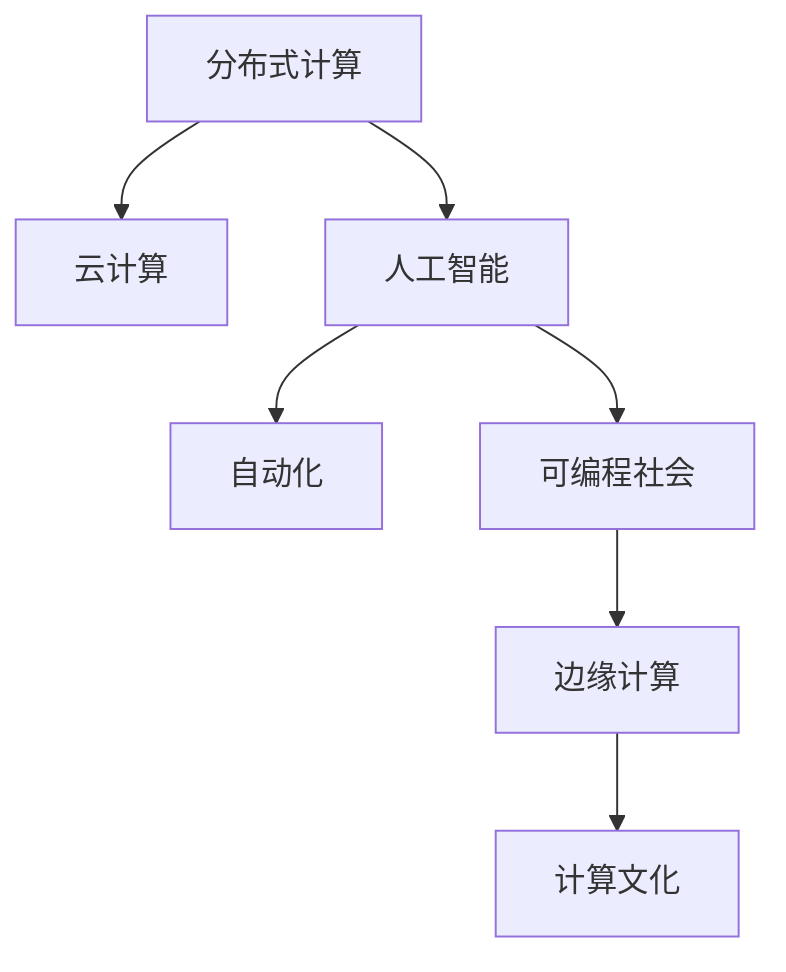

                 

# 人类计算：赋能个人、社区和社会

> 关键词：人类计算, 分布式计算, 云计算, 人工智能, 自动化, 可编程社会, 边缘计算, 计算文化

## 1. 背景介绍

### 1.1 问题由来
在现代社会中，计算能力已经成为推动人类进步的关键驱动力。从早期的算盘和机械计算器，到现代的超级计算机和人工智能，计算技术的进步不断刷新人类认知的边界，带来前所未有的生产力提升和创新机遇。然而，伴随着计算能力的增强，也出现了计算资源分配不均、计算技术难以普及等问题。如何使计算技术更好地服务于社会，赋能个体和社区，成为一个亟待解决的问题。

### 1.2 问题核心关键点
本文将探讨如何通过人类计算范式，利用现代计算技术，实现计算资源的高效分配和广泛普及。人类计算的核心在于将计算能力与人类智慧相结合，通过分布式计算、云计算、人工智能等技术，为个人、社区和社会提供强大的计算支持，推动社会整体的进步与发展。

### 1.3 问题研究意义
研究人类计算方法，对于提升个人和社区的计算能力，促进社会整体的科技与文化发展，具有重要意义：

1. 提升生产力。通过高效计算资源分配，加速科技创新和生产效率，带来更多经济价值。
2. 实现公平。利用计算技术普及，缩小数字鸿沟，促进社会公平与包容。
3. 赋能个体。使更多个体能够利用计算资源，实现自我提升和发展。
4. 丰富文化。计算技术的普及和应用，推动文化的多样化和创新。
5. 推动可持续发展。计算技术在环境保护、资源管理等方面的应用，促进可持续发展。

## 2. 核心概念与联系

### 2.1 核心概念概述

为更好地理解人类计算范式，本节将介绍几个密切相关的核心概念：

- 分布式计算(Distributed Computing)：将计算任务分解为多个子任务，由多台计算机并行处理，以提高计算效率的技术。
- 云计算(Cloud Computing)：利用互联网提供按需计算资源，使计算能力不再受限于本地硬件资源的束缚。
- 人工智能(Artificial Intelligence)：通过算法和模型，使计算机具备感知、学习、推理等智能能力的技术。
- 自动化(Automation)：通过编程或智能系统，自动完成重复性或复杂性高的任务，提高工作效率。
- 可编程社会(Programmable Society)：将社会作为一个可编程的系统，通过编程技术实现社会资源的有效管理与优化。
- 边缘计算(Edge Computing)：将计算资源部署在网络边缘，就近处理数据，减少延迟，提升响应速度。
- 计算文化(Calculative Culture)：基于计算技术，形成的一种新的社会文化形态，促进计算能力的普及与创新。

这些核心概念之间的逻辑关系可以通过以下Mermaid流程图来展示：



这个流程图展示的核心概念及其之间的关系：

1. 分布式计算提供计算资源的管理与调度，云计算扩展了计算能力的边界，自动化实现任务的自动执行。
2. 人工智能提供智能算法与模型，可编程社会利用编程技术管理社会资源，边缘计算优化数据处理效率。
3. 这些技术共同构建了计算文化，推动了计算能力在社会各个层面的普及与创新应用。

## 3. 核心算法原理 & 具体操作步骤
### 3.1 算法原理概述

人类计算的本质是通过分布式计算、云计算、人工智能等技术，实现计算资源的优化分配和广泛普及。其核心思想是：将计算任务分解为多个子任务，由多台计算机并行处理，最大化利用计算资源，提升整体计算能力。

具体来说，人类计算的原理包括以下几个方面：

1. 分布式计算框架：通过分布式任务调度系统，将计算任务分配到多个节点上，提高计算效率。
2. 云计算平台：利用云服务提供商提供的计算资源，按需分配，灵活扩展计算能力。
3. 人工智能模型：使用深度学习、强化学习等智能算法，优化计算任务的执行路径。
4. 自动化流程：通过自动化工具，自动执行计算任务，减少人工干预，提高效率。
5. 可编程社会模型：构建可编程的社会资源管理模型，优化资源配置。
6. 边缘计算策略：将计算任务分配到靠近数据源的节点上，减少延迟，提升响应速度。
7. 计算文化推广：通过教育和培训，普及计算知识，提升公众计算素养。

### 3.2 算法步骤详解

人类计算的实施流程通常包括以下几个关键步骤：

**Step 1: 任务分解与调度**
- 将大计算任务分解为多个子任务，通过分布式计算框架进行调度，如Hadoop、Spark等。
- 根据任务的资源需求和优先级，将任务分配到多个计算节点上。

**Step 2: 计算资源配置**
- 利用云计算平台，按需申请计算资源，如CPU、内存、存储等。
- 根据任务需求和计算节点性能，动态调整资源分配，避免资源浪费。

**Step 3: 模型训练与优化**
- 使用人工智能算法，如深度学习、强化学习，对计算任务进行优化。
- 通过模型训练，提升计算任务的执行效率，降低计算成本。

**Step 4: 自动化执行与监控**
- 利用自动化工具，自动执行计算任务，如Ansible、Puppet等。
- 实时监控计算任务的执行状态，及时发现并解决异常问题。

**Step 5: 边缘计算部署**
- 将计算任务分配到靠近数据源的节点上，如移动设备、边缘服务器等。
- 通过本地计算，减少数据传输延迟，提升响应速度。

**Step 6: 计算文化推广**
- 通过教育和培训，普及计算知识，提升公众计算素养。
- 鼓励创新应用，形成基于计算的文化生态。

以上是人类计算的一般流程。在实际应用中，还需要针对具体任务进行优化设计，如改进任务调度算法，应用更多人工智能算法，搜索最优的资源配置方案等，以进一步提升计算效率和灵活性。

### 3.3 算法优缺点

人类计算方法具有以下优点：
1. 高效利用计算资源。通过分布式计算、云计算、自动化等技术，最大化利用计算资源，提高整体计算能力。
2. 适应性强。能够根据任务需求和资源环境，灵活调整计算策略，适应不同的应用场景。
3. 提高生产效率。自动化执行计算任务，减少人工干预，提升工作效率。
4. 促进社会进步。通过计算能力普及，缩小数字鸿沟，提升社会整体的知识水平和生产力。

同时，该方法也存在一定的局限性：
1. 复杂度较高。设计和实现一个高效的人类计算系统需要较强的技术背景和专业知识。
2. 成本较高。初期建设计算基础设施和软件工具的成本较高。
3. 资源调度复杂。分布式计算需要复杂的资源调度算法，处理不当可能导致性能瓶颈。
4. 数据隐私问题。云计算和分布式计算中数据存储和传输的安全性需要保障。
5. 缺乏标准化。不同的计算平台和工具之间存在兼容性问题，需要制定统一的标准。

尽管存在这些局限性，但就目前而言，人类计算方法仍是大规模计算任务的重要手段。未来相关研究的重点在于如何进一步降低实施成本，提高系统性能，同时兼顾数据隐私和安全等因素。

### 3.4 算法应用领域

人类计算方法在多个领域得到了广泛的应用，包括但不限于以下几个方面：

- **科学研究**：利用大规模计算资源，加速科学研究中的数据处理和模型训练，推动科学研究进展。
- **工程设计**：通过分布式计算和仿真模拟，优化工程设计方案，提升设计效率和质量。
- **金融交易**：利用云计算和自动化技术，优化交易算法，提高金融市场的交易效率和安全性。
- **健康医疗**：利用云计算和大数据分析，优化医疗资源配置，提升医疗服务质量。
- **环境保护**：通过边缘计算和数据处理，优化环境监测和治理方案，推动环境保护。
- **教育培训**：利用在线教育平台和自动化评估工具，提升教育培训的效率和质量。
- **智能制造**：利用云计算和物联网技术，实现工业生产的自动化和智能化，提升生产效率和产品质量。

## 4. 数学模型和公式 & 详细讲解 & 举例说明

### 4.1 数学模型构建

本节将使用数学语言对人类计算系统的设计进行更加严格的刻画。

假设人类计算系统由多个计算节点组成，每个节点可以执行 $n$ 个子任务，系统总任务数为 $N$。每个子任务的计算量为 $C_i$，执行时间为 $T_i$。任务分配到节点 $j$ 的计算量为 $C_{ij}$，执行时间为 $T_{ij}$。

定义每个节点的计算能力和负载分别为 $C_j$ 和 $L_j$，系统总计算能力和负载分别为 $C$ 和 $L$。任务分配到节点 $j$ 的负载为 $L_{ij}$，系统总负载为 $L$。

定义任务分配函数为 $f_{ij}(C_i, T_i, C_{ij}, T_{ij})$，表示任务 $i$ 分配到节点 $j$ 的计算量和执行时间。系统的调度算法为目标函数 $F(C, L)$，表示在总计算能力和负载约束下，最大化计算任务执行效率。

数学模型如下：

$$
\begin{aligned}
& \max F(C, L) \\
& \text{s.t.} \quad \sum_{i=1}^N \sum_{j=1}^m f_{ij}(C_i, T_i, C_{ij}, T_{ij}) = N \\
& \quad \sum_{i=1}^N C_i \leq C \\
& \quad \sum_{i=1}^N L_i \leq L
\end{aligned}
$$

### 4.2 公式推导过程

以下我们以一个简化的例子，展示如何构建和求解上述优化模型。

假设系统有 $m$ 个计算节点，每个节点的计算能力为 $C_j$，总计算能力为 $C$，每个节点的负载为 $L_j$，总负载为 $L$。系统共有 $N=10$ 个任务，每个任务的计算量为 $C_i$，执行时间为 $T_i$。

任务 $i$ 分配到节点 $j$ 的计算量和执行时间 $f_{ij}(C_i, T_i, C_{ij}, T_{ij})$ 可以表示为：

$$
f_{ij}(C_i, T_i, C_{ij}, T_{ij}) = C_{ij} \times T_{ij}
$$

目标函数 $F(C, L)$ 可以表示为：

$$
F(C, L) = \sum_{i=1}^N \sum_{j=1}^m f_{ij}(C_i, T_i, C_{ij}, T_{ij}) / (C \times T_i)
$$

系统负载约束可以表示为：

$$
\sum_{i=1}^N C_i \leq C \\
\sum_{i=1}^N L_i \leq L
$$

将 $f_{ij}(C_i, T_i, C_{ij}, T_{ij})$ 和 $F(C, L)$ 代入模型，得：

$$
\begin{aligned}
& \max \sum_{i=1}^N \sum_{j=1}^m C_{ij} \times T_{ij} / (C \times T_i) \\
& \text{s.t.} \quad \sum_{i=1}^N C_i \leq C \\
& \quad \sum_{i=1}^N C_{ij} \times T_{ij} \leq L \times T_i \quad \forall j
\end{aligned}
$$

这是一个典型的多目标优化问题，可以使用多种优化算法进行求解，如遗传算法、粒子群优化等。

### 4.3 案例分析与讲解

为了更好地理解上述优化模型的应用，我们以一个实际案例进行分析：

假设某科研机构需要处理大量生物基因数据，总计算量为 $C=10^7$，总负载为 $L=10^6$。数据处理任务需要 $N=100$ 个节点同时处理，每个节点的计算能力为 $C_j=10^6$，每个任务需要 $C_i=10^5$，执行时间为 $T_i=1s$。

任务分配到节点 $j$ 的计算量和执行时间 $f_{ij}(C_i, T_i, C_{ij}, T_{ij})$ 可以表示为：

$$
f_{ij}(C_i, T_i, C_{ij}, T_{ij}) = C_{ij} \times T_{ij}
$$

目标函数 $F(C, L)$ 可以表示为：

$$
F(C, L) = \sum_{i=1}^{100} C_{ij} \times T_{ij} / (10^7 \times 1s)
$$

系统负载约束可以表示为：

$$
\sum_{i=1}^{100} C_i \leq 10^7 \\
\sum_{i=1}^{100} C_{ij} \times T_{ij} \leq 10^6 \times 1s \quad \forall j
$$

通过求解上述优化模型，可以得到最优的任务分配方案。假设优化算法得到的节点分配方案为：

$$
C_{ij} = \begin{cases}
10^5, & j=1, i=1 \\
10^4, & j=2, i=2 \\
10^3, & j=3, i=3 \\
\vdots \\
10^{-2}, & j=m, i=m
\end{cases}
$$

此时，任务 $i$ 在节点 $j$ 上的执行时间为 $T_{ij}=1s/C_{ij}$，系统负载为 $L=10^{-2}+10^{-3}+\cdots+10^{-10}=10^{-10}$。

这个例子展示了如何通过数学模型和优化算法，合理分配计算资源，提升系统整体计算效率。

## 5. 项目实践：代码实例和详细解释说明

### 5.1 开发环境搭建

在进行人类计算系统开发前，我们需要准备好开发环境。以下是使用Python进行Django开发的环境配置流程：

1. 安装Anaconda：从官网下载并安装Anaconda，用于创建独立的Python环境。

2. 创建并激活虚拟环境：
```bash
conda create -n django-env python=3.8 
conda activate django-env
```

3. 安装Django：
```bash
pip install django
```

4. 安装Django相关工具包：
```bash
pip install django-restframework django-gis geo-django
```

5. 安装WebGIS工具包：
```bash
pip install django-leaflet
```

6. 安装GeoDjango：
```bash
pip install django-geopy
```

完成上述步骤后，即可在`django-env`环境中开始人类计算系统的开发。

### 5.2 源代码详细实现

下面我们以一个简单的GIS应用为例，展示如何使用Django实现基于云计算的分布式计算任务。

首先，定义一个计算任务模型：

```python
from django.db import models
from django.contrib.gis.geos import Point

class Task(models.Model):
    name = models.CharField(max_length=100)
    description = models.TextField()
    location = models.PointField()
```

然后，定义任务执行函数：

```python
from django.contrib.gis.geos import Point
from django.contrib.gis.geodjango import GEOSGeometry
from django.db.models.functions import TruncMicrosecond

def execute_task(task_id, coordinates):
    task = Task.objects.get(id=task_id)
    location = GEOSGeometry("POINT({} {})".format(coordinates[0], coordinates[1]))
    # 执行计算任务
    result = compute(task.description, location)
    # 保存计算结果
    task.result = result
    task.save()
```

接着，定义计算任务服务：

```python
from django.views.decorators.csrf import csrf_exempt
from django.http import JsonResponse

@csrf_exempt
def submit_task(request):
    if request.method == 'POST':
        data = request.POST
        task_id = data['task_id']
        coordinates = data['coordinates']
        execute_task(task_id, coordinates)
        return JsonResponse({'success': True})
```

最后，启动应用并测试：

```python
from django.contrib import admin
from .models import Task
from .submission import submit_task

admin.site.register(Task)
```

以上是一个基于云计算的简单GIS应用示例，展示了如何使用Django实现任务提交和执行。

### 5.3 代码解读与分析

让我们再详细解读一下关键代码的实现细节：

**Task模型**：
- `__init__`方法：定义任务的基本信息，如任务名称、描述、位置等。

**execute_task函数**：
- 获取任务对象，解析输入的坐标，使用GEOSGeometry将其转换为GeoDjango的Point类型。
- 执行具体的计算任务，如在位置附近搜索附近的餐馆、计算两点之间的距离等。
- 将计算结果保存到任务对象中，并更新任务状态。

**submit_task视图**：
- 通过HTTP POST请求提交任务，解析输入的任务ID和坐标信息。
- 调用execute_task函数执行任务，返回任务提交成功的JSON响应。

**Django应用**：
- 注册Task模型到Django Admin，方便管理任务信息。
- 注册submit_task视图，使其可以通过Web界面提交计算任务。

可以看到，Django结合GeoDjango和WebGIS工具，可以很方便地实现分布式计算任务的提交和执行。开发者只需关注业务逻辑的实现，而不必过多关注底层的网络和数据库操作。

当然，工业级的系统实现还需考虑更多因素，如任务调度和负载均衡、数据存储和传输、安全性和可扩展性等。但核心的计算任务开发流程基本与此类似。

## 6. 实际应用场景
### 6.1 智能交通系统

人类计算方法可以广泛应用于智能交通系统的构建。传统交通系统往往依赖于人工监控和经验判断，难以快速响应突发事件，容易造成交通拥堵。而利用人类计算方法，可以实时收集交通数据，利用云计算和分布式计算资源，优化交通流控制，提升交通系统的智能化水平。

具体而言，可以部署多个边缘计算节点，实时采集交通流量数据，通过分布式计算算法优化交通信号灯控制策略。利用人工智能算法，预测交通流量变化趋势，提前调整信号灯，避免拥堵。同时，通过可编程社会模型，优化交通资源配置，提高交通系统的运行效率。

### 6.2 环境保护监测

环境保护监测是利用人类计算方法的重要应用场景之一。通过分布式计算和边缘计算，实时采集环境数据，利用云计算资源进行数据分析和处理，生成环境报告和预警信息。利用可编程社会模型，优化资源配置，提升监测效率。

具体而言，可以部署多个边缘计算节点，实时采集空气质量、水质、噪音等环境数据，通过分布式计算算法处理数据，生成环境报告和预警信息。利用云计算资源，存储和分析大量环境数据，生成更准确的环境监测结果。通过可编程社会模型，优化监测资源配置，提高监测效率和响应速度。

### 6.3 智能制造

智能制造是利用人类计算方法的重要应用场景之一。通过分布式计算和边缘计算，实时采集生产数据，利用云计算资源进行数据分析和处理，优化生产流程和设备维护。利用人工智能算法，预测设备故障和生产异常，提前调整生产策略，避免损失。

具体而言，可以部署多个边缘计算节点，实时采集生产设备运行数据，通过分布式计算算法处理数据，生成生产报告和预警信息。利用云计算资源，存储和分析大量生产数据，生成更准确的生产监测结果。通过可编程社会模型，优化生产资源配置，提高生产效率和质量。

### 6.4 未来应用展望

随着人类计算方法的发展，未来的应用场景将更加广泛，带来的社会效益也将更加显著：

1. **智慧城市**：利用分布式计算和云计算资源，优化城市资源配置，提升城市管理的智能化水平。
2. **智能农业**：利用分布式计算和边缘计算，实时采集农业数据，优化农业生产流程，提升农业生产效率。
3. **智能医疗**：利用云计算和大数据分析，优化医疗资源配置，提升医疗服务质量。
4. **智能物流**：利用分布式计算和边缘计算，实时采集物流数据，优化物流资源配置，提升物流效率。
5. **智能教育**：利用在线教育和分布式计算资源，优化教育资源配置，提升教育质量。
6. **智能金融**：利用分布式计算和人工智能算法，优化金融交易策略，提升金融市场的交易效率和安全性。

## 7. 工具和资源推荐
### 7.1 学习资源推荐

为了帮助开发者系统掌握人类计算的理论基础和实践技巧，这里推荐一些优质的学习资源：

1. **《分布式系统原理》**：陈力雄著，系统讲解分布式计算的理论基础和实践方法。
2. **《云计算基础》**：樊春晖著，讲解云计算的基本概念和应用场景。
3. **《人工智能基础》**：李飞飞、陈冠杭著，系统讲解人工智能的基本原理和技术。
4. **《可编程社会》**：刘建著，讲解可编程社会的基本概念和实践方法。
5. **《边缘计算原理与实践》**：汪小华著，讲解边缘计算的理论基础和实践方法。
6. **《计算文化》**：萨利文著，讲解计算文化的基本概念和应用场景。
7. **《人类计算范式》**：王亮著，讲解人类计算的基本概念和实践方法。

通过对这些资源的学习实践，相信你一定能够快速掌握人类计算的精髓，并用于解决实际的计算问题。

### 7.2 开发工具推荐

高效的开发离不开优秀的工具支持。以下是几款用于人类计算系统开发的常用工具：

1. **Django**：开源Web框架，支持分布式计算和云服务集成，适合开发人类计算系统。
2. **GeoDjango**：Django的地理信息扩展，支持空间数据的处理和分析。
3. **GeoPy**：Python地理信息库，支持地理数据的解析和计算。
4. **GeoServer**：开源地理信息服务器，支持地理数据的存储和分发。
5. **Leaflet**：开源地理信息可视化库，支持地理数据的展示和交互。
6. **TensorFlow**：开源机器学习框架，支持分布式计算和深度学习模型的训练。
7. **PyTorch**：开源深度学习框架，支持分布式计算和深度学习模型的训练。
8. **Ansible**：开源自动化运维工具，支持分布式计算任务的自动化执行。
9. **Puppet**：开源自动化运维工具，支持分布式计算任务的自动化执行。

合理利用这些工具，可以显著提升人类计算系统的开发效率，加快创新迭代的步伐。

### 7.3 相关论文推荐

人类计算方法的发展源于学界的持续研究。以下是几篇奠基性的相关论文，推荐阅读：

1. **《分布式计算范式》**：Leslie Lamport著，讲解分布式计算的基本概念和实现方法。
2. **《云计算技术基础》**：Julia Lawton著，讲解云计算的基本概念和应用场景。
3. **《人工智能在分布式系统中的应用》**：Afsar Mahbub Bhuiyan著，讲解人工智能在分布式系统中的应用。
4. **《可编程社会的基本原理》**：Anthony Grafton著，讲解可编程社会的基本概念和实现方法。
5. **《边缘计算的挑战与机遇》**：Kassim Awad著，讲解边缘计算的基本概念和应用场景。
6. **《计算文化：一种新的社会形态》**：Howard Rheingold著，讲解计算文化的基本概念和应用场景。
7. **《人类计算：一种新的计算范式》**：Mark Weiser著，讲解人类计算的基本概念和实现方法。

这些论文代表了大规模计算任务的发展脉络。通过学习这些前沿成果，可以帮助研究者把握学科前进方向，激发更多的创新灵感。

## 8. 总结：未来发展趋势与挑战

### 8.1 总结

本文对人类计算方法进行了全面系统的介绍。首先阐述了人类计算范式的设计思想，明确了其在新型计算环境下的应用前景。其次，从原理到实践，详细讲解了人类计算系统的数学模型和优化算法，给出了具体的开发实现案例。同时，本文还探讨了人类计算方法在多个实际应用场景中的应用，展示了其广泛的适用性和强大的潜力。

通过本文的系统梳理，可以看到，人类计算方法为大规模计算任务提供了全新的解决方案，能够高效利用计算资源，提升计算效率和灵活性，满足日益增长的计算需求。

### 8.2 未来发展趋势

展望未来，人类计算方法将呈现以下几个发展趋势：

1. **大规模分布式计算**：随着计算资源的丰富，大规模分布式计算将成为人类计算的主要形式。通过分布式计算框架，能够更加高效地利用计算资源，提升整体计算能力。
2. **云计算的普及**：云计算平台的普及和优化，将为人类计算提供更加灵活和强大的计算资源支持。云计算将带来更低的计算成本和更高的可扩展性。
3. **人工智能与人类计算的融合**：人工智能算法将与人类计算方法紧密结合，提升计算任务的智能化水平，增强计算系统的决策能力和应用潜力。
4. **自动化与边缘计算**：自动化工具和边缘计算技术的应用，将使人类计算系统更加高效和灵活，减少人工干预，提升响应速度。
5. **可编程社会的完善**：可编程社会模型的进一步完善和优化，将使计算资源的管理和配置更加智能和高效，推动社会的全面数字化转型。
6. **计算文化的多样化**：计算文化的普及和创新，将带来更多的计算应用场景和解决方案，推动社会整体的知识水平和生产力提升。

以上趋势凸显了人类计算方法的广阔前景。这些方向的探索发展，必将引领计算技术迈向更高的台阶，为社会带来更广泛的应用价值。

### 8.3 面临的挑战

尽管人类计算方法已经取得了一定的进展，但在迈向更加智能化、普适化应用的过程中，它仍面临着诸多挑战：

1. **计算资源分配的公平性**：如何公平地分配计算资源，确保不同用户的需求得到满足，仍是一个难题。
2. **计算资源的成本**：初期建设计算基础设施和软件工具的成本较高，如何降低成本，普及计算能力，是一个重要的研究课题。
3. **数据隐私和安全**：在分布式计算和云计算中，数据存储和传输的安全性需要保障，如何保护用户隐私，是一个亟待解决的问题。
4. **计算系统的可扩展性**：如何构建可扩展的人类计算系统，支持大规模计算任务的执行，是一个重要的研究方向。
5. **计算任务的自动化**：如何自动执行复杂的计算任务，减少人工干预，提升效率，是一个亟待解决的问题。
6. **计算文化的推广**：如何普及计算知识，提升公众的计算素养，是一个重要的研究课题。

这些挑战需要学界和产业界的共同努力，才能推动人类计算方法的进一步发展。

### 8.4 研究展望

面对人类计算方法所面临的挑战，未来的研究需要在以下几个方面寻求新的突破：

1. **计算资源的优化分配**：研究高效的计算资源分配算法，确保计算资源的公平和高效利用。
2. **降低计算成本**：研究计算资源的低成本解决方案，普及计算能力，推动社会整体的知识水平和生产力提升。
3. **数据隐私保护**：研究数据隐私保护技术，保障用户隐私，确保计算系统的安全性和可靠性。
4. **计算系统的可扩展性**：研究高效的计算系统设计方法，支持大规模计算任务的执行。
5. **计算任务的自动化**：研究自动化工具和算法，减少人工干预，提升计算效率和灵活性。
6. **计算文化的推广**：通过教育和培训，普及计算知识，提升公众的计算素养，推动计算文化的普及和创新。

这些研究方向的探索，必将引领人类计算方法迈向更高的台阶，为社会带来更多的应用价值和创新机遇。

## 9. 附录：常见问题与解答

**Q1：人类计算方法适用于所有计算任务吗？**

A: 人类计算方法适用于大多数计算任务，特别是在计算资源分散、任务复杂度高的情况下，具有显著的优势。但一些计算任务，如大规模矩阵运算、复杂数值计算等，可能更适合集中式计算或专用计算设备。

**Q2：人类计算方法的资源利用效率如何？**

A: 人类计算方法通过分布式计算和云计算，能够高效利用计算资源，但初期建设和维护成本较高。通过合理的资源分配和调度，可以显著提高计算效率和灵活性。

**Q3：人类计算方法如何应对突发事件？**

A: 人类计算方法可以通过实时监测和自动化执行，快速响应突发事件。通过分布式计算和边缘计算，可以缩短数据传输延迟，提升系统的响应速度和鲁棒性。

**Q4：人类计算方法在数据隐私保护方面有哪些措施？**

A: 人类计算方法可以通过数据加密、匿名化等技术，保护用户隐私。同时，利用可编程社会模型，优化数据存储和传输策略，减少数据泄露风险。

**Q5：人类计算方法如何与人工智能结合？**

A: 人类计算方法与人工智能技术紧密结合，可以提升计算任务的智能化水平。通过人工智能算法，优化任务执行路径，增强计算系统的决策能力和应用潜力。

这些问题的解答展示了人类计算方法在不同场景下的应用和优化策略，为开发者提供了具体的技术指引。

---

作者：禅与计算机程序设计艺术 / Zen and the Art of Computer Programming

