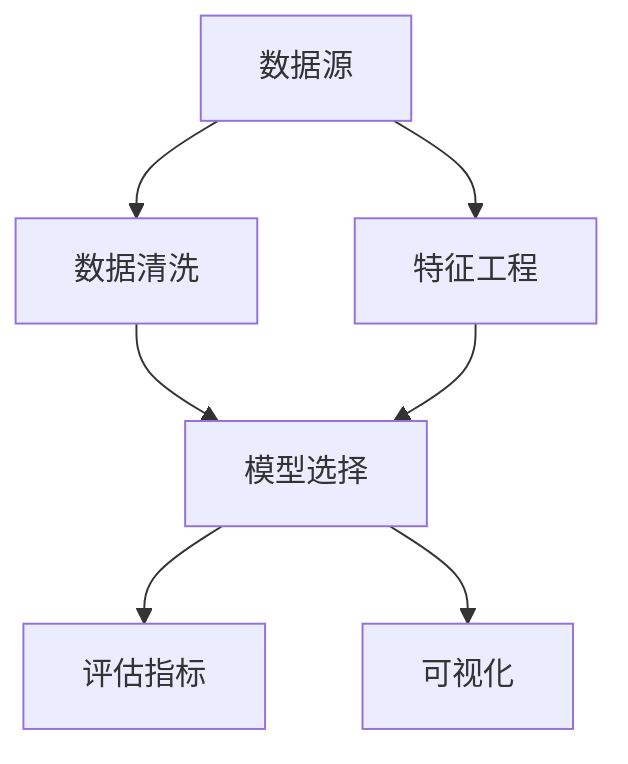

                 

# 从0到1：构建你的第一个知识发现引擎

## 1. 背景介绍

### 1.1 问题由来

在数据驱动的时代，如何从海量数据中提取有价值的知识，是每个数据科学家和工程师面临的挑战。数据科学被称作第四范式，即从数据中发现知识（Data Mining），与实验科学（Experimentation）、理论科学（Theory）、计算科学（Computation）三者并列，成为科学研究的主要方法。知识发现（Knowledge Discovery），顾名思义，是通过数据分析和算法挖掘，从原始数据中发现隐藏的知识。然而，实现知识发现并非易事，需要构建完备的数据处理流程、有效的算法模型以及合理的策略方法。本文旨在带领读者从0到1，构建并部署一个初步的知识发现引擎，理解其基本原理和实现过程，为后续深入研究和应用打下基础。

### 1.2 问题核心关键点

知识发现是数据科学中的一个核心问题，涉及数据的预处理、特征工程、模型训练、评估与优化等环节。构建一个有效的知识发现引擎，需要明确以下几个关键点：

- 数据源的选择与清洗
- 特征的提取与选择
- 模型的选择与调参
- 评估指标的设定与优化
- 业务需求的理解与适配

只有系统化、规范化的处理数据和建模流程，才能保证知识发现的可靠性和有效性。

### 1.3 问题研究意义

构建一个知识发现引擎，不仅能够帮助企业提取数据中的潜藏知识，提供决策支持，还能通过可视化结果，帮助决策者直观理解数据背后的复杂关系，从而做出更科学、更有价值的决策。此外，知识发现的应用领域广泛，包括金融风险预测、市场趋势分析、客户行为研究等，能够推动各行各业向智能化、自动化方向发展。因此，掌握知识发现的基本方法和实现技巧，对于数据科学家和工程师而言，具有重要的理论和实践意义。

## 2. 核心概念与联系

### 2.1 核心概念概述

为了更好地理解知识发现的流程，我们将介绍几个核心概念：

- **数据源（Data Source）**：数据的来源，可以是结构化数据库、非结构化文档、社交媒体等。
- **数据清洗（Data Cleaning）**：处理数据中的噪声、缺失值、异常值等，保证数据的完整性和准确性。
- **特征工程（Feature Engineering）**：从原始数据中提取、选择、构造有意义的特征，提升模型的预测能力。
- **模型选择（Model Selection）**：根据数据特点和业务需求，选择合适的算法模型。
- **评估指标（Evaluation Metrics）**：评估模型预测结果的准确性、鲁棒性、泛化能力等。
- **可视化（Visualization）**：将模型结果通过图表、图形等方式展示出来，帮助理解和决策。

这些概念构成了知识发现的整个流程，通过理解这些核心概念的原理和架构，我们可以系统化地处理数据和构建模型，从而实现知识发现的目标。

### 2.2 核心概念原理和架构的 Mermaid 流程图(Mermaid 流程节点中不要有括号、逗号等特殊字符)



### 2.3 核心概念之间的联系

从上述流程图可以看出，数据源、数据清洗、特征工程、模型选择、评估指标和可视化之间的联系与顺序：

- 数据源是整个流程的起点，数据质量的好坏直接影响后续处理和建模的效果。
- 数据清洗是预处理阶段的核心环节，处理干净的数据是模型训练的基础。
- 特征工程是提升模型性能的关键步骤，通过提取和构造有意义的特征，帮助模型更好地理解数据。
- 模型选择是构建知识发现引擎的核心，不同的模型适用于不同的数据和业务场景。
- 评估指标是判断模型效果的重要标准，不同的指标反映了模型在准确性、鲁棒性等方面的性能。
- 可视化是结果展示的环节，直观展示模型预测结果，帮助理解和决策。

这些核心概念之间相互依赖、相互影响，共同构成了知识发现引擎的完整流程。

## 3. 核心算法原理 & 具体操作步骤

### 3.1 算法原理概述

知识发现的核心算法主要包括数据预处理、特征选择、模型训练和评估等步骤。下面将分别介绍这些步骤的原理和操作过程。

### 3.2 算法步骤详解

#### 数据预处理

数据预处理是知识发现的第一步，主要包括以下几个环节：

- **数据清洗**：去除缺失值、异常值和噪声数据，确保数据的完整性和准确性。
- **数据规范化**：将数据转换为标准格式，如统一日期格式、处理缺失值等。
- **特征提取**：从原始数据中提取有意义的特征，如文本中的词频、TF-IDF值等。

#### 特征选择

特征选择是提升模型性能的关键步骤，主要包括以下几个环节：

- **特征提取**：使用统计方法、降维算法等从原始数据中提取特征。
- **特征选择**：使用过滤式、包裹式或嵌入式方法选择最相关、最有用的特征。
- **特征构造**：通过多项式扩展、特征交叉等方法构造新的特征。

#### 模型训练

模型训练是知识发现的核心环节，主要包括以下几个环节：

- **模型选择**：根据数据特点和业务需求，选择合适的算法模型，如决策树、随机森林、神经网络等。
- **模型调参**：通过交叉验证、网格搜索等方法，调整模型超参数，优化模型性能。
- **模型训练**：使用训练集数据，对模型进行训练，得到模型参数。

#### 模型评估

模型评估是判断模型效果的重要步骤，主要包括以下几个环节：

- **数据分割**：将数据集分为训练集、验证集和测试集，避免过拟合和欠拟合。
- **指标计算**：计算模型在验证集和测试集上的准确率、召回率、F1值等评估指标。
- **模型优化**：根据评估结果，调整模型参数，优化模型性能。

#### 可视化

可视化是结果展示的重要环节，主要包括以下几个环节：

- **图表绘制**：使用Matplotlib、Seaborn等工具绘制散点图、柱状图、饼图等。
- **图形展示**：将可视化结果展示在仪表盘或web页面上，供决策者直观理解。

### 3.3 算法优缺点

知识发现算法的优点主要包括：

- **自动化**：通过自动化处理和建模流程，节省大量时间和人力成本。
- **可解释性**：通过可视化结果，直观展示模型预测结果，帮助理解和决策。
- **适用范围广**：适用于各种数据类型和业务场景，具有较强的通用性。

然而，知识发现算法也存在一些缺点：

- **数据质量依赖**：数据质量和预处理效果直接影响模型的性能。
- **特征工程复杂**：特征提取和构造需要一定的专业知识和经验，操作复杂。
- **模型调参困难**：模型调参过程繁琐，需要大量实验和调试。

### 3.4 算法应用领域

知识发现算法在各行各业都有广泛的应用，例如：

- **金融风险预测**：通过分析历史交易数据，预测市场风险和投资回报。
- **客户行为分析**：通过分析客户交易记录，预测客户流失和转化行为。
- **医疗诊断**：通过分析患者病历数据，预测疾病发展和治疗效果。
- **市场营销**：通过分析用户行为数据，优化营销策略和产品推荐。
- **供应链管理**：通过分析物流数据，优化供应链流程，降低成本和风险。

## 4. 数学模型和公式 & 详细讲解 & 举例说明

### 4.1 数学模型构建

知识发现的数学模型通常包括数据预处理、特征工程、模型训练和评估等步骤。以下将以一个简单的分类问题为例，介绍基本的数学模型构建过程。

假设我们有一组数据集 $D=\{(x_i,y_i)\}_{i=1}^N$，其中 $x_i$ 表示样本特征，$y_i$ 表示样本标签。我们的目标是构建一个分类模型 $M$，使得 $M(x)$ 能够根据样本特征 $x$，预测其对应的标签 $y$。

#### 数据预处理

数据预处理通常包括以下几个环节：

- **数据清洗**：去除缺失值和异常值，确保数据的完整性和准确性。
- **数据规范化**：将数据转换为标准格式，如0-1归一化。

假设原始数据中存在缺失值，我们可以使用均值填补或删除方法进行处理。归一化公式如下：

$$
x'_i=\frac{x_i-\mu}{\sigma}
$$

其中 $\mu$ 和 $\sigma$ 分别为数据集 $D$ 的均值和标准差。

#### 特征工程

特征工程是提升模型性能的关键步骤，主要包括以下几个环节：

- **特征提取**：使用统计方法、降维算法等从原始数据中提取特征。
- **特征选择**：使用过滤式、包裹式或嵌入式方法选择最相关、最有用的特征。
- **特征构造**：通过多项式扩展、特征交叉等方法构造新的特征。

假设我们有 $n$ 个特征，可以将其表示为 $x_i=[x_{i1},x_{i2},...,x_{in}]$。通过多项式扩展，我们可以构造新的特征 $x'_i$，如：

$$
x'_i=[x_{i1},x_{i2},x_{i3}^2,x_{i4}x_{i5},...]
$$

#### 模型训练

模型训练是知识发现的核心环节，主要包括以下几个环节：

- **模型选择**：根据数据特点和业务需求，选择合适的算法模型，如决策树、随机森林、神经网络等。
- **模型调参**：通过交叉验证、网格搜索等方法，调整模型超参数，优化模型性能。
- **模型训练**：使用训练集数据，对模型进行训练，得到模型参数。

假设我们选择决策树模型，其基本结构如下：

- **树根节点**：选择最优特征作为节点划分。
- **子节点**：根据特征值将数据分为多个子集，递归构建子树。
- **叶子节点**：预测样本标签，停止递归。

#### 模型评估

模型评估是判断模型效果的重要步骤，主要包括以下几个环节：

- **数据分割**：将数据集分为训练集、验证集和测试集，避免过拟合和欠拟合。
- **指标计算**：计算模型在验证集和测试集上的准确率、召回率、F1值等评估指标。
- **模型优化**：根据评估结果，调整模型参数，优化模型性能。

假设我们使用混淆矩阵计算模型在验证集和测试集上的准确率、召回率和F1值：

$$
\begin{bmatrix}
TP & FN \\
FP & TN \\
\end{bmatrix}
$$

其中 $TP$ 表示真正例，$FP$ 表示假正例，$TN$ 表示真负例，$FN$ 表示假负例。准确率、召回率和F1值的计算公式如下：

$$
\text{Accuracy}=\frac{TP+TN}{TP+FP+TN+FN}
$$

$$
\text{Recall}=\frac{TP}{TP+FN}
$$

$$
\text{F1 Score}=\frac{2\times\text{Precision}\times\text{Recall}}{\text{Precision}+\text{Recall}}
$$

#### 可视化

可视化是结果展示的重要环节，主要包括以下几个环节：

- **图表绘制**：使用Matplotlib、Seaborn等工具绘制散点图、柱状图、饼图等。
- **图形展示**：将可视化结果展示在仪表盘或web页面上，供决策者直观理解。

假设我们绘制出模型在验证集和测试集上的混淆矩阵：

```python
import matplotlib.pyplot as plt
import seaborn as sns

# 构建混淆矩阵
cm = confusion_matrix(y_true, y_pred)

# 绘制混淆矩阵图
plt.figure(figsize=(8, 6))
sns.heatmap(cm, annot=True, fmt='d', cmap='Blues')
plt.xlabel('Actual Label')
plt.ylabel('Predicted Label')
plt.title('Confusion Matrix')
plt.show()
```

### 4.2 公式推导过程

假设我们选择线性回归模型，其基本结构如下：

$$
y_i = \beta_0 + \beta_1x_{i1} + \beta_2x_{i2} + \epsilon_i
$$

其中 $\beta_0$ 为截距，$\beta_1$ 和 $\beta_2$ 为回归系数，$\epsilon_i$ 为随机误差项。

模型训练的目标是最小化残差平方和（RSS）：

$$
\min_{\beta_0,\beta_1,\beta_2}\sum_{i=1}^N(y_i - (\beta_0 + \beta_1x_{i1} + \beta_2x_{i2}))^2
$$

使用梯度下降法求解最小化问题，得到模型的参数 $\beta_0,\beta_1,\beta_2$。

### 4.3 案例分析与讲解

假设我们有一组房价数据集，包括面积、位置、房龄等特征，以及对应的房价。我们的目标是构建一个线性回归模型，预测房价。

首先，进行数据预处理和特征工程，得到处理后的数据集 $D$。然后，选择线性回归模型作为建模方法，通过交叉验证和网格搜索调参。最后，在测试集上评估模型性能，并使用可视化工具展示结果。

## 5. 项目实践：代码实例和详细解释说明

### 5.1 开发环境搭建

在进行知识发现项目的开发前，我们需要准备好开发环境。以下是使用Python进行Scikit-Learn开发的环境配置流程：

1. 安装Anaconda：从官网下载并安装Anaconda，用于创建独立的Python环境。

2. 创建并激活虚拟环境：
```bash
conda create -n sklearn-env python=3.8 
conda activate sklearn-env
```

3. 安装Scikit-Learn：
```bash
conda install scikit-learn
```

4. 安装各类工具包：
```bash
pip install numpy pandas matplotlib scikit-learn seaborn matplotlib
```

完成上述步骤后，即可在`sklearn-env`环境中开始知识发现项目开发。

### 5.2 源代码详细实现

下面我们以线性回归为例，给出使用Scikit-Learn进行数据预处理、特征工程、模型训练、评估与可视化的PyTorch代码实现。

首先，定义数据集：

```python
from sklearn.datasets import load_boston
from sklearn.model_selection import train_test_split
from sklearn.preprocessing import StandardScaler

# 加载数据集
boston = load_boston()

# 将数据集分为特征和标签
X = boston.data
y = boston.target

# 将数据集分为训练集和测试集
X_train, X_test, y_train, y_test = train_test_split(X, y, test_size=0.2, random_state=42)

# 标准化数据集
scaler = StandardScaler()
X_train = scaler.fit_transform(X_train)
X_test = scaler.transform(X_test)
```

然后，定义线性回归模型：

```python
from sklearn.linear_model import LinearRegression

# 创建线性回归模型
model = LinearRegression()
```

接着，进行模型训练和评估：

```python
from sklearn.metrics import mean_squared_error

# 训练模型
model.fit(X_train, y_train)

# 预测测试集结果
y_pred = model.predict(X_test)

# 计算R^2
r2_score = model.score(X_test, y_test)
```

最后，进行可视化：

```python
import matplotlib.pyplot as plt

# 绘制预测结果图
plt.figure(figsize=(8, 6))
plt.scatter(X_test, y_test, color='blue', label='Actual')
plt.plot(X_test, y_pred, color='red', label='Predicted')
plt.xlabel('X')
plt.ylabel('Y')
plt.title('Linear Regression Prediction')
plt.legend()
plt.show()

# 绘制R^2值图
plt.figure(figsize=(8, 6))
plt.plot([0, 1], [0, 1], linestyle='--', color='gray')
plt.scatter([0, 1], [r2_score, r2_score], color='red', label='R^2 Score')
plt.xlabel('X')
plt.ylabel('Y')
plt.title('R^2 Score')
plt.legend()
plt.show()
```

以上就是使用Scikit-Learn进行线性回归的完整代码实现。可以看到，通过Scikit-Learn的封装，我们可以用相对简洁的代码完成数据预处理、模型训练和结果可视化。

### 5.3 代码解读与分析

让我们再详细解读一下关键代码的实现细节：

**数据预处理**：
- 使用`load_boston`函数加载Boston房价数据集。
- 将数据集分为特征和标签。
- 使用`train_test_split`函数将数据集分为训练集和测试集，保持20%的数据作为测试集。
- 使用`StandardScaler`对数据集进行标准化处理。

**模型训练**：
- 使用`LinearRegression`类创建线性回归模型。
- 使用`fit`方法对模型进行训练，输入训练集数据。

**模型评估**：
- 使用`predict`方法对测试集数据进行预测。
- 使用`score`方法计算模型的R^2值，评估模型在测试集上的预测效果。

**可视化**：
- 使用Matplotlib绘制预测结果图和R^2值图。

可以看到，Scikit-Learn提供了简单易用的API，能够帮助我们快速实现知识发现项目。同时，Scikit-Learn也支持多种模型和评估指标，满足了不同场景下的需求。

当然，工业级的系统实现还需考虑更多因素，如模型的保存和部署、超参数的自动搜索、更灵活的任务适配等。但核心的知识发现流程基本与此类似。

## 6. 实际应用场景

### 6.1 智能推荐系统

知识发现技术在智能推荐系统中有广泛应用，可以帮助系统根据用户的历史行为和兴趣，推荐符合用户需求的商品、文章、视频等内容。

在推荐系统中，知识发现主要涉及以下几个环节：

- **用户画像**：通过分析用户的历史行为数据，构建用户画像，如用户兴趣、偏好等。
- **商品分析**：对商品的属性、评价等信息进行预处理和特征工程，提取有意义的特征。
- **模型训练**：选择推荐算法模型，如协同过滤、矩阵分解、深度学习等，对模型进行训练和调参。
- **效果评估**：通过A/B测试、点击率等指标评估模型效果，优化推荐策略。
- **结果可视化**：使用可视化工具展示推荐结果，供用户直观理解。

### 6.2 金融风险预测

在金融领域，知识发现技术可以帮助银行和金融机构预测贷款违约风险、股票价格波动等。

在金融风险预测中，知识发现主要涉及以下几个环节：

- **数据预处理**：对金融数据进行清洗和规范化处理。
- **特征提取**：从金融数据中提取有用的特征，如客户信用评分、资产负债表等。
- **模型训练**：选择适合的机器学习模型，如逻辑回归、决策树、随机森林等，对模型进行训练和调参。
- **模型评估**：通过ROC曲线、AUC值等指标评估模型效果，优化模型性能。
- **结果可视化**：使用可视化工具展示预测结果，供决策者直观理解。

### 6.3 医疗诊断系统

在医疗领域，知识发现技术可以帮助医生预测疾病发展和治疗效果。

在医疗诊断系统中，知识发现主要涉及以下几个环节：

- **数据预处理**：对医疗数据进行清洗和规范化处理。
- **特征提取**：从医疗数据中提取有用的特征，如患者病历、基因序列等。
- **模型训练**：选择适合的机器学习模型，如神经网络、支持向量机等，对模型进行训练和调参。
- **模型评估**：通过准确率、召回率、F1值等指标评估模型效果，优化模型性能。
- **结果可视化**：使用可视化工具展示预测结果，供医生直观理解。

## 7. 工具和资源推荐

### 7.1 学习资源推荐

为了帮助开发者系统掌握知识发现的理论基础和实践技巧，这里推荐一些优质的学习资源：

1. 《机器学习实战》：一本实用的Python机器学习教程，详细介绍了Scikit-Learn等机器学习库的使用。
2. 《Python数据科学手册》：一本全面的数据科学入门教程，涵盖数据预处理、特征工程、模型训练等环节。
3. 《深度学习》：吴恩达教授的深度学习课程，涵盖神经网络、卷积神经网络、循环神经网络等前沿技术。
4. Coursera上的《数据科学基础》课程：由约翰·霍普金斯大学教授讲授，涵盖数据预处理、特征工程、模型训练等环节。
5. Kaggle数据科学竞赛平台：提供大量数据集和竞赛项目，帮助开发者实践和提升知识发现技能。

通过对这些资源的学习实践，相信你一定能够快速掌握知识发现的精髓，并用于解决实际的业务问题。

### 7.2 开发工具推荐

高效的开发离不开优秀的工具支持。以下是几款用于知识发现开发的常用工具：

1. Scikit-Learn：基于Python的机器学习库，提供丰富的算法和评估指标，适合快速原型开发。
2. Pandas：基于Python的数据处理库，提供高效的数据清洗和预处理功能。
3. Matplotlib：基于Python的可视化库，支持绘制各种图表和图形。
4. Seaborn：基于Matplotlib的高级可视化库，支持更美观的图表绘制。
5. Jupyter Notebook：基于Python的交互式开发环境，支持代码、数据和文档的集成。

合理利用这些工具，可以显著提升知识发现的开发效率，加快创新迭代的步伐。

### 7.3 相关论文推荐

知识发现技术的进步源于学界的持续研究。以下是几篇奠基性的相关论文，推荐阅读：

1. E. Alpaydin，《Introduction to Machine Learning with Python》：介绍Python中的机器学习库和算法，涵盖知识发现的基本方法和应用。
2. T. M. Khoshgoftaar，《A Systematic Review and Knowledge Base of Feature Selection Techniques in Data and Knowledge Discovery》：综述了特征选择的技术和方法，提供了丰富的知识发现参考资料。
3. C. M. Bishop，《Pattern Recognition and Machine Learning》：详细介绍了机器学习的基本概念和算法，包括知识发现的相关内容。
4. G. Hinton，《A NeuralODE for Efficient Time-Series Forecasting》：介绍了一种新的神经网络架构，用于时间序列预测和知识发现。
5. I. Goodfellow，《Generative Adversarial Nets》：介绍了一种新的生成对抗网络，用于数据生成和知识发现。

这些论文代表了大数据和机器学习领域的研究进展，通过学习这些前沿成果，可以帮助研究者把握学科前进方向，激发更多的创新灵感。

## 8. 总结：未来发展趋势与挑战

### 8.1 总结

本文对知识发现的基本流程和方法进行了全面系统的介绍。首先，介绍了知识发现的重要性和核心关键点，明确了数据预处理、特征工程、模型选择、评估指标和可视化之间的逻辑关系。其次，通过详细的数学模型和公式推导，帮助读者理解知识发现的核心算法原理和具体操作步骤。最后，通过实际的代码实例和分析，展示了知识发现的实践流程和效果展示方法。

通过本文的系统梳理，可以看到，知识发现是数据科学中的重要环节，能够帮助从原始数据中提取有价值的知识，为决策支持提供坚实基础。掌握知识发现的基本方法和实现技巧，对于数据科学家和工程师而言，具有重要的理论和实践意义。

### 8.2 未来发展趋势

展望未来，知识发现技术将呈现以下几个发展趋势：

1. **自动化**：随着自动化技术的发展，知识发现过程将更加自动化和智能化，能够快速处理大量数据，提取有意义的知识。
2. **集成化**：知识发现与其他技术如深度学习、自然语言处理等将更加集成化，形成更加全面的智能系统。
3. **多模态化**：知识发现将逐步拓展到多模态数据，如图像、语音、视频等，能够更好地融合各种信息。
4. **实时化**：知识发现将逐步实现实时化，能够及时处理和分析实时数据，提供动态决策支持。
5. **可解释性**：知识发现将更加注重可解释性，能够提供透明的算法过程和结果解释，满足用户和决策者的需求。

以上趋势将推动知识发现技术的不断进步，为各行各业提供更加高效、可靠、智能的决策支持。

### 8.3 面临的挑战

尽管知识发现技术已经取得了显著进展，但在实际应用中仍面临诸多挑战：

1. **数据质量**：数据质量和预处理效果直接影响知识发现的效果，数据的完整性、准确性和一致性需要进一步提升。
2. **特征工程**：特征提取和构造需要一定的专业知识和经验，特征工程过程复杂繁琐。
3. **模型调参**：模型调参过程繁琐，需要大量实验和调试，难以找到最优参数组合。
4. **可解释性**：知识发现算法的可解释性不足，模型内部机制难以理解和调试。
5. **计算资源**：知识发现算法通常需要大量的计算资源，如何在保证效果的同时降低计算成本，需要进一步探索。

这些挑战需要在技术层面和应用层面进行持续优化和改进，才能实现知识发现的可持续发展。

### 8.4 研究展望

面对知识发现面临的种种挑战，未来的研究需要在以下几个方面寻求新的突破：

1. **自动化特征工程**：通过自动化技术，实现特征自动提取和选择，减少人工干预。
2. **可解释性提升**：引入可解释性算法，提高模型的透明度和可理解性，提供透明的决策依据。
3. **多模态知识发现**：拓展到多模态数据，提升信息融合能力和跨模态推理能力。
4. **实时知识发现**：探索实时数据处理和分析方法，实现动态决策支持。
5. **计算资源优化**：探索轻量化模型和高效算法，降低计算成本，提升计算效率。

这些研究方向的探索，必将引领知识发现技术迈向更高的台阶，为构建智能决策系统提供更强大的支撑。

## 9. 附录：常见问题与解答

**Q1：如何选择合适的特征？**

A: 特征选择是知识发现中非常重要的一环，选择合适的特征可以提高模型效果。可以从以下几个方面考虑：

1. **领域知识**：根据领域知识，选择有意义的特征。
2. **相关性**：选择与目标变量相关性高的特征。
3. **稳定性**：选择在不同数据集上表现稳定的特征。
4. **稀疏性**：选择稀疏性高的特征，避免过拟合。

**Q2：如何选择适合的模型？**

A: 模型选择需要考虑数据类型、业务需求、数据量和计算资源等因素。可以从以下几个方面考虑：

1. **数据类型**：根据数据类型选择合适的模型，如分类数据选择决策树、随机森林等，回归数据选择线性回归、神经网络等。
2. **业务需求**：根据业务需求选择合适的模型，如推荐系统选择协同过滤、矩阵分解等，金融风险预测选择逻辑回归、随机森林等。
3. **数据量和计算资源**：根据数据量和计算资源选择合适的模型，如小规模数据选择简单的模型，大规模数据选择复杂模型。

**Q3：如何评估模型的效果？**

A: 模型评估是判断模型效果的重要环节，可以从以下几个方面考虑：

1. **评估指标**：选择合适的评估指标，如准确率、召回率、F1值等。
2. **数据分割**：将数据集分为训练集、验证集和测试集，避免过拟合和欠拟合。
3. **交叉验证**：使用交叉验证方法，评估模型在不同数据集上的性能。
4. **超参数调优**：使用网格搜索、贝叶斯优化等方法，优化模型超参数，提升模型性能。

**Q4：如何实现知识发现的自动化？**

A: 知识发现的自动化可以通过以下几个步骤实现：

1. **自动化特征工程**：使用自动化工具，如AutoML库，自动进行特征提取和选择。
2. **自动化模型选择**：使用自动化工具，如AutoML库，自动进行模型选择和调参。
3. **自动化评估**：使用自动化工具，如AutoML库，自动进行模型评估和优化。
4. **自动化部署**：使用自动化工具，如Kubernetes、Docker等，自动部署和监控模型。

这些步骤可以帮助实现知识发现的自动化流程，提高效率和效果。

---

作者：禅与计算机程序设计艺术 / Zen and the Art of Computer Programming

