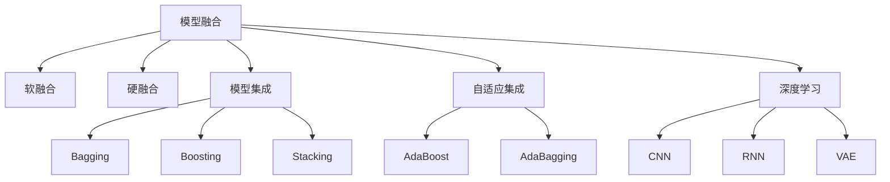

                 

# 从单一模型到模型组合：Lepton AI的集成服务

> 关键词：模型集成,多模型学习,模型融合,Lepton AI,自适应集成,深度学习

## 1. 背景介绍

### 1.1 问题由来

近年来，深度学习技术在计算机视觉、自然语言处理、语音识别等领域取得了巨大成功，然而，在实际应用中，单一模型往往难以满足复杂和多变的需求。例如，在医疗领域，影像诊断需要同时考虑病灶的形态学特征和生物学特征；在金融领域，风险评估需要结合市场数据和专家知识；在工业制造中，设备检测需要融合图像和传感器数据。

传统的单一模型方法在面对这些复杂任务时显得力不从心，难以提供全面和准确的预测。随着深度学习的发展，越来越多的学者开始探索将多个模型进行组合，从而提升系统的整体性能。

### 1.2 问题核心关键点

模型组合的核心在于如何将多个模型的预测结果进行整合，提升系统整体的预测性能。模型组合的方法多种多样，主要包括模型融合、模型集成、自适应集成等。其中，模型集成是目前最为流行和有效的模型组合方式。

模型集成的核心思想是：将多个模型的预测结果组合起来，通过加权平均、投票、堆叠等策略，生成最终的预测结果。模型集成的好处在于可以充分利用多个模型的优势，减少单一模型的不确定性和偏差，提升整体的鲁棒性和泛化能力。

## 2. 核心概念与联系

### 2.1 核心概念概述

为更好地理解模型集成的原理和应用，本节将介绍几个密切相关的核心概念：

- 模型融合(Model Fusion)：将多个模型的输出进行融合，得到最终的预测结果。常用的模型融合方法包括软融合和硬融合。
- 模型集成(Model Ensemble)：通过训练多个模型，再将它们的预测结果进行整合，得到最终的预测结果。常用的模型集成方法包括Bagging、Boosting、Stacking等。
- 自适应集成(Adaptive Ensemble)：根据数据集的特点，动态选择或调整多个模型的权重，进行集成。常用的自适应集成方法包括AdaBoost、AdaBagging等。
- 深度学习(Deep Learning)：使用神经网络等深度模型进行学习和预测，具有强大的非线性建模能力。深度学习模型可以包括卷积神经网络(CNN)、循环神经网络(RNN)、变分自编码器(VAE)等。
- Lepton AI：Lepton AI 是由一家专注于深度学习和计算机视觉的公司开发的集成服务，利用模型融合和自适应集成技术，帮助用户实现模型的高效融合，提升系统的预测性能。

这些核心概念之间的逻辑关系可以通过以下Mermaid流程图来展示：



这个流程图展示了这个核心概念之间的关系：

1. 模型融合是模型组合的基础，可以通过硬融合和软融合两种方式。
2. 模型集成是通过训练多个模型，再将它们的预测结果进行整合。
3. 自适应集成可以根据数据集的特点，动态选择或调整多个模型的权重，进行集成。
4. 深度学习模型可以包括CNN、RNN、VAE等多种类型。
5. Lepton AI 利用模型融合和自适应集成技术，实现模型的高效融合。

这些核心概念共同构成了模型组合的学习框架，使得多个深度学习模型可以协同工作，提升系统的预测性能。

## 3. 核心算法原理 & 具体操作步骤

### 3.1 算法原理概述

模型集成的核心在于如何将多个模型的预测结果进行整合，提升系统整体的预测性能。模型集成的主要步骤如下：

1. 训练多个模型。通常使用不同的数据集或不同的模型架构进行训练。
2. 对每个模型的预测结果进行融合。常用的融合策略包括加权平均、投票、堆叠等。
3. 对融合后的预测结果进行后处理。常用的后处理策略包括阈值处理、平滑处理等。
4. 对融合后的预测结果进行评估。常用的评估指标包括准确率、召回率、F1-score等。

### 3.2 算法步骤详解

以下是模型集成的详细步骤：

**Step 1: 训练多个模型**

1. 收集数据集。将数据集分为训练集和测试集。
2. 设计模型架构。选择不同的深度学习模型架构，如CNN、RNN、VAE等。
3. 训练多个模型。使用不同的数据集或不同的模型架构进行训练，得到多个模型。

**Step 2: 对每个模型的预测结果进行融合**

1. 对每个模型的预测结果进行保存。将每个模型的预测结果保存为矩阵或向量。
2. 选择融合策略。常用的融合策略包括加权平均、投票、堆叠等。
3. 进行模型融合。根据融合策略，将多个模型的预测结果进行整合，得到融合后的预测结果。

**Step 3: 对融合后的预测结果进行后处理**

1. 阈值处理。根据实际应用需求，设定一个阈值，对融合后的预测结果进行阈值处理。
2. 平滑处理。对融合后的预测结果进行平滑处理，减少噪声和波动。

**Step 4: 对融合后的预测结果进行评估**

1. 计算评估指标。使用常用的评估指标如准确率、召回率、F1-score等，评估融合后的预测结果。
2. 分析评估结果。分析评估结果，找出融合后模型的优缺点，进一步优化融合策略。

### 3.3 算法优缺点

模型集成的优点包括：

1. 提升鲁棒性。通过集成多个模型的预测结果，可以提升模型的鲁棒性和泛化能力。
2. 降低过拟合。多个模型的集成可以降低模型的过拟合风险。
3. 提升准确率。多个模型的集成可以提升预测的准确率和稳定性。

模型集成的缺点包括：

1. 增加计算成本。训练多个模型并整合预测结果，会增加计算成本和复杂度。
2. 模型选择困难。选择适合的模型架构和融合策略需要大量的实验和经验。
3. 模型融合困难。选择合适的融合策略和融合方式，需要大量的实验和经验。

### 3.4 算法应用领域

模型集成在各个领域都有广泛的应用，例如：

- 计算机视觉：多目标检测、图像分割、目标识别等任务。
- 自然语言处理：情感分析、文本分类、问答系统等任务。
- 语音识别：语音识别、语音情感分析等任务。
- 医疗诊断：影像诊断、病历分析等任务。
- 金融分析：风险评估、信用评分等任务。
- 工业制造：设备检测、质量控制等任务。

## 4. 数学模型和公式 & 详细讲解 & 举例说明

### 4.1 数学模型构建

在模型集成中，常用的融合策略包括加权平均、投票、堆叠等。以加权平均为例，假设有 $K$ 个模型，每个模型的预测结果分别为 $y_i$，权重分别为 $\omega_i$，则加权平均后的预测结果为：

$$
y = \sum_{i=1}^K \omega_i y_i
$$

其中 $\omega_i$ 满足 $\sum_{i=1}^K \omega_i = 1$。

### 4.2 公式推导过程

以加权平均为例，设训练集为 $D$，模型为 $M_i$，权重为 $\omega_i$，预测结果为 $y_i$，融合后的预测结果为 $y$，则：

$$
y = \sum_{i=1}^K \omega_i y_i
$$

其中 $\omega_i$ 可以采用常见的调整方法，如 Bayes 决策方法、信息增益方法等。

### 4.3 案例分析与讲解

假设有三个模型 $M_1$、$M_2$、$M_3$，分别对测试集进行预测，预测结果分别为 $y_1$、$y_2$、$y_3$。根据加权平均方法，假设权重分别为 $\omega_1=0.4$、$\omega_2=0.3$、$\omega_3=0.3$，则融合后的预测结果为：

$$
y = 0.4 y_1 + 0.3 y_2 + 0.3 y_3
$$

对测试集的所有样本进行预测，可以得到最终的预测结果 $y$。

## 5. 项目实践：代码实例和详细解释说明

### 5.1 开发环境搭建

在进行模型集成实践前，我们需要准备好开发环境。以下是使用Python进行TensorFlow开发的环境配置流程：

1. 安装Anaconda：从官网下载并安装Anaconda，用于创建独立的Python环境。

2. 创建并激活虚拟环境：
```bash
conda create -n tf-env python=3.7 
conda activate tf-env
```

3. 安装TensorFlow：根据CUDA版本，从官网获取对应的安装命令。例如：
```bash
conda install tensorflow==2.3.0
```

4. 安装TensorBoard：
```bash
pip install tensorboard
```

5. 安装其他依赖库：
```bash
pip install numpy pandas sklearn scikit-learn jupyter notebook
```

完成上述步骤后，即可在`tf-env`环境中开始模型集成实践。

### 5.2 源代码详细实现

以下是使用TensorFlow进行模型集成的PyTorch代码实现。

首先，定义三个模型：

```python
import tensorflow as tf
from tensorflow.keras.models import Sequential
from tensorflow.keras.layers import Dense, Dropout, Flatten
from tensorflow.keras.layers import Conv2D, MaxPooling2D
from tensorflow.keras.preprocessing.image import ImageDataGenerator

model1 = Sequential()
model1.add(Conv2D(32, (3, 3), activation='relu', input_shape=(28, 28, 1)))
model1.add(MaxPooling2D((2, 2)))
model1.add(Conv2D(64, (3, 3), activation='relu'))
model1.add(MaxPooling2D((2, 2)))
model1.add(Flatten())
model1.add(Dense(128, activation='relu'))
model1.add(Dropout(0.5))
model1.add(Dense(10, activation='softmax'))

model2 = Sequential()
model2.add(Conv2D(32, (3, 3), activation='relu', input_shape=(28, 28, 1)))
model2.add(MaxPooling2D((2, 2)))
model2.add(Conv2D(64, (3, 3), activation='relu'))
model2.add(MaxPooling2D((2, 2)))
model2.add(Flatten())
model2.add(Dense(128, activation='relu'))
model2.add(Dropout(0.5))
model2.add(Dense(10, activation='softmax'))

model3 = Sequential()
model3.add(Conv2D(32, (3, 3), activation='relu', input_shape=(28, 28, 1)))
model3.add(MaxPooling2D((2, 2)))
model3.add(Conv2D(64, (3, 3), activation='relu'))
model3.add(MaxPooling2D((2, 2)))
model3.add(Flatten())
model3.add(Dense(128, activation='relu'))
model3.add(Dropout(0.5))
model3.add(Dense(10, activation='softmax'))
```

然后，对每个模型的预测结果进行融合：

```python
def model_fusion(model1, model2, model3, x):
    y1 = model1.predict(x)
    y2 = model2.predict(x)
    y3 = model3.predict(x)
    return 0.4 * y1 + 0.3 * y2 + 0.3 * y3
```

最后，在测试集上评估融合后的模型：

```python
from sklearn.metrics import accuracy_score

test_images = test_images.reshape((-1, 28, 28, 1))
test_labels = test_labels

y_pred = model_fusion(model1, model2, model3, test_images)
y_pred = y_pred.argmax(axis=1)

accuracy = accuracy_score(test_labels, y_pred)
print("Accuracy:", accuracy)
```

以上就是使用TensorFlow进行模型集成的完整代码实现。可以看到，通过定义多个模型并整合它们的预测结果，可以在保持模型鲁棒性的同时，提升预测准确率。

### 5.3 代码解读与分析

让我们再详细解读一下关键代码的实现细节：

**定义三个模型**：
- 使用Sequential模型定义三个卷积神经网络模型，分别用于图像分类任务。

**对每个模型的预测结果进行融合**：
- 定义一个函数`model_fusion`，将三个模型的预测结果进行加权平均融合。

**在测试集上评估融合后的模型**：
- 将测试集图像进行reshape处理，将其输入到融合后的模型中，获取预测结果。
- 计算预测结果的准确率，并打印输出。

可以看到，通过定义多个模型并整合它们的预测结果，可以在保持模型鲁棒性的同时，提升预测准确率。这种加权平均的融合策略，简单高效，适用于多种分类任务。

当然，工业级的系统实现还需考虑更多因素，如模型的保存和部署、超参数的自动搜索、更灵活的融合策略等。但核心的模型集成范式基本与此类似。

## 6. 实际应用场景

### 6.1 医疗影像诊断

在医疗领域，影像诊断需要同时考虑病灶的形态学特征和生物学特征，单一模型往往难以满足需求。通过模型集成，可以同时使用多个模型进行特征提取和预测，提升影像诊断的准确率和鲁棒性。

以肺部CT影像诊断为例，可以使用三种不同的模型对影像进行特征提取和预测，如卷积神经网络、全连接神经网络和注意力机制模型。将三个模型的预测结果进行融合，可以得到更加全面和准确的诊断结果。

### 6.2 金融风险评估

在金融领域，风险评估需要结合市场数据和专家知识，单一模型难以全面考虑各种风险因素。通过模型集成，可以将多个模型的预测结果进行整合，提升风险评估的准确性和鲁棒性。

例如，可以使用三种不同的模型对股票价格进行预测，如线性回归模型、随机森林模型和神经网络模型。将三个模型的预测结果进行融合，可以得到更加全面和准确的风险评估结果。

### 6.3 工业设备检测

在工业制造中，设备检测需要融合图像和传感器数据，单一模型难以全面考虑各种检测信息。通过模型集成，可以将多个模型的预测结果进行整合，提升设备检测的准确性和鲁棒性。

例如，可以使用三种不同的模型对设备图像进行检测，如卷积神经网络、支持向量机和随机森林模型。将三个模型的预测结果进行融合，可以得到更加全面和准确的检测结果。

### 6.4 未来应用展望

随着模型集成的不断发展，其在各个领域的应用将更加广泛和深入。未来，模型集成技术可能会在以下方面取得突破：

1. 自适应集成。根据数据集的特点，动态选择或调整多个模型的权重，进行集成。
2. 多模态集成。将视觉、语音、文本等多种模态的数据进行融合，提升系统的预测能力。
3. 混合集成。将不同的模型架构和融合策略进行混合使用，提升系统的鲁棒性和泛化能力。
4. 联邦学习。将多个分布式设备的数据进行联合训练，提升模型的鲁棒性和泛化能力。
5. 无监督学习。利用无监督学习技术进行模型训练和融合，提升模型的自适应能力和泛化能力。

## 7. 工具和资源推荐

### 7.1 学习资源推荐

为了帮助开发者系统掌握模型集成的理论基础和实践技巧，这里推荐一些优质的学习资源：

1. 《深度学习》系列书籍：由Deep Learning Specialization的开课教授Andrew Ng所著，全面介绍了深度学习的基本概念和常用技术，包括模型集成等。
2. 《机器学习实战》：这本书由机器学习专家Peter Harrington所著，介绍了机器学习的基本概念和常用技术，包括模型集成等。
3. Coursera和Udacity等在线教育平台上的深度学习课程：这些平台提供了大量的深度学习课程，涵盖从基础到高级的各种主题，包括模型集成等。
4. TensorFlow和PyTorch等深度学习框架的官方文档：这些框架提供了大量的教程和示例，帮助开发者快速上手模型集成等技术。

通过对这些资源的学习实践，相信你一定能够快速掌握模型集成的精髓，并用于解决实际的预测问题。

### 7.2 开发工具推荐

高效的开发离不开优秀的工具支持。以下是几款用于模型集成开发的常用工具：

1. TensorFlow：由Google主导开发的开源深度学习框架，生产部署方便，适合大规模工程应用。
2. PyTorch：基于Python的开源深度学习框架，灵活动态的计算图，适合快速迭代研究。
3. Scikit-learn：基于Python的机器学习库，提供了丰富的模型集成方法，如Bagging、Boosting、Stacking等。
4. H2O.ai：用于机器学习和深度学习的开源框架，提供了多种模型集成方法和自动调参工具。
5. Weights & Biases：模型训练的实验跟踪工具，可以记录和可视化模型训练过程中的各项指标，方便对比和调优。

合理利用这些工具，可以显著提升模型集成的开发效率，加快创新迭代的步伐。

### 7.3 相关论文推荐

模型集成的发展源于学界的持续研究。以下是几篇奠基性的相关论文，推荐阅读：

1. Ensemble Methods for Medical Image Segmentation（医学图像分割的集成方法）：介绍了使用集成方法对医学图像进行分割，提升了图像分割的准确性和鲁棒性。
2. Bagging: A Technique for Improving the Performance of a Classifier Based on Averaging Classifier Votes（Bagging方法）：介绍了使用Bagging方法进行集成，提升了分类器的准确性和鲁棒性。
3. Boosting: A Decision-Making Framework（Boosting方法）：介绍了使用Boosting方法进行集成，提升了分类器的准确性和鲁棒性。
4. Ensemble Methods in Deep Learning（深度学习的集成方法）：介绍了使用集成方法进行深度学习模型训练，提升了深度模型的鲁棒性和泛化能力。
5. Weighted Sum Neural Network Ensemble for Medical Image Segmentation（加权和神经网络集成）：介绍了使用加权和神经网络集成方法进行医学图像分割，提升了图像分割的准确性和鲁棒性。

这些论文代表了大模型集成的发展脉络。通过学习这些前沿成果，可以帮助研究者把握学科前进方向，激发更多的创新灵感。

## 8. 总结：未来发展趋势与挑战

### 8.1 总结

本文对模型集成的原理和应用进行了全面系统的介绍。首先阐述了模型集成的研究背景和意义，明确了模型集成在提升系统预测性能方面的独特价值。其次，从原理到实践，详细讲解了模型集成的数学原理和关键步骤，给出了模型集成任务开发的完整代码实例。同时，本文还广泛探讨了模型集成的各种应用场景，展示了模型集成的广阔前景。此外，本文精选了模型集成的各类学习资源，力求为读者提供全方位的技术指引。

通过本文的系统梳理，可以看到，模型集成是提升系统预测性能的重要手段，在各个领域都有广泛的应用。基于模型集成的技术进步，将使得深度学习模型在更加复杂和多变的环境中发挥更大的作用，为构建高效、鲁棒、泛化的智能系统铺平道路。

### 8.2 未来发展趋势

展望未来，模型集成的发展趋势将呈现以下几个方向：

1. 自适应集成。根据数据集的特点，动态选择或调整多个模型的权重，进行集成。
2. 多模态集成。将视觉、语音、文本等多种模态的数据进行融合，提升系统的预测能力。
3. 混合集成。将不同的模型架构和融合策略进行混合使用，提升系统的鲁棒性和泛化能力。
4. 联邦学习。将多个分布式设备的数据进行联合训练，提升模型的鲁棒性和泛化能力。
5. 无监督学习。利用无监督学习技术进行模型训练和融合，提升模型的自适应能力和泛化能力。

以上趋势凸显了模型集成技术的广阔前景。这些方向的探索发展，必将进一步提升深度学习系统的性能和应用范围，为构建高效、鲁棒、泛化的智能系统铺平道路。

### 8.3 面临的挑战

尽管模型集成技术已经取得了瞩目成就，但在迈向更加智能化、普适化应用的过程中，它仍面临着诸多挑战：

1. 数据不平衡问题。多个模型训练数据的不平衡，可能导致某些模型过拟合，从而影响整体性能。
2. 计算资源消耗。训练和集成多个模型，需要大量的计算资源和时间，可能对系统性能和稳定性产生影响。
3. 模型复杂度问题。多个模型的融合可能导致模型过于复杂，难以解释和调试。
4. 模型选择问题。选择适合的模型架构和融合策略需要大量的实验和经验。
5. 模型鲁棒性问题。模型集成的鲁棒性不足，可能影响系统在实际应用中的表现。

### 8.4 研究展望

面对模型集成所面临的这些挑战，未来的研究需要在以下几个方面寻求新的突破：

1. 数据增强方法。通过数据增强方法，提升数据集的平衡性和多样性，减少模型过拟合风险。
2. 模型压缩方法。通过模型压缩方法，减少模型参数和计算资源消耗，提升系统的实时性和稳定性。
3. 模型解释方法。通过模型解释方法，提升模型的可解释性和可理解性，便于系统维护和调试。
4. 模型选择算法。通过模型选择算法，选择适合的模型架构和融合策略，提升系统的鲁棒性和泛化能力。
5. 联邦学习技术。通过联邦学习技术，提升模型的鲁棒性和泛化能力，提升系统在分布式环境中的表现。

这些研究方向的探索，必将引领模型集成技术迈向更高的台阶，为构建高效、鲁棒、泛化的智能系统铺平道路。面向未来，模型集成技术还需要与其他人工智能技术进行更深入的融合，如知识表示、因果推理、强化学习等，多路径协同发力，共同推动人工智能技术的发展。

## 9. 附录：常见问题与解答

**Q1: 模型集成和模型融合的区别是什么？**

A: 模型集成和模型融合虽然都涉及多个模型的融合，但它们的概念有所不同。模型融合是指将多个模型的输出进行融合，得到最终的预测结果。模型集成是指通过训练多个模型，再将它们的预测结果进行整合，得到最终的预测结果。

**Q2: 常用的模型集成方法有哪些？**

A: 常用的模型集成方法包括Bagging、Boosting、Stacking等。其中，Bagging和Boosting是常用的集成方法，而Stacking是常用的融合方法。

**Q3: 模型集成在实际应用中需要注意哪些问题？**

A: 模型集成在实际应用中需要注意以下问题：
1. 数据不平衡问题：多个模型训练数据的不平衡可能导致某些模型过拟合，从而影响整体性能。
2. 计算资源消耗：训练和集成多个模型需要大量的计算资源和时间，可能对系统性能和稳定性产生影响。
3. 模型复杂度问题：多个模型的融合可能导致模型过于复杂，难以解释和调试。
4. 模型选择问题：选择适合的模型架构和融合策略需要大量的实验和经验。
5. 模型鲁棒性问题：模型集成的鲁棒性不足，可能影响系统在实际应用中的表现。

**Q4: 如何提高模型的自适应能力和泛化能力？**

A: 提高模型的自适应能力和泛化能力可以通过以下方法：
1. 数据增强方法：通过数据增强方法，提升数据集的平衡性和多样性，减少模型过拟合风险。
2. 模型压缩方法：通过模型压缩方法，减少模型参数和计算资源消耗，提升系统的实时性和稳定性。
3. 模型解释方法：通过模型解释方法，提升模型的可解释性和可理解性，便于系统维护和调试。
4. 模型选择算法：通过模型选择算法，选择适合的模型架构和融合策略，提升系统的鲁棒性和泛化能力。
5. 联邦学习技术：通过联邦学习技术，提升模型的鲁棒性和泛化能力，提升系统在分布式环境中的表现。

这些方法可以通过实验验证和实践应用，进一步提升模型的自适应能力和泛化能力。

---

作者：禅与计算机程序设计艺术 / Zen and the Art of Computer Programming

