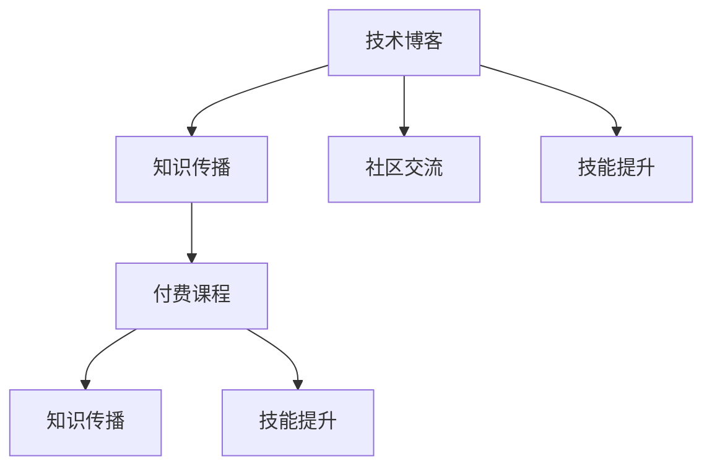

                 

# 从技术博客到付费课程：程序员的成长之路

> 关键词：技术博客,程序员成长,技术写作,付费课程,编程教育,技术分享,社区交流,知识传播

## 1. 背景介绍

### 1.1 问题由来

在快速发展的IT行业，技术知识更新迭代迅速，新框架、新工具、新技术层出不穷。作为一名程序员，如何高效地学习和掌握这些新知识，同时分享自己的经验和见解，成为了一个重要且紧迫的问题。技术博客和付费课程，成为了程序员学习和交流的重要平台，特别是在社区交流和技术分享方面。

技术博客作为技术知识传播的一种形式，能够快速、广泛地分享个人的技术心得和实践经验，是程序员之间沟通交流的重要桥梁。而付费课程则提供了更为系统、深入的知识体系，为程序员提供了一个系统学习、提升技能的机会。

### 1.2 问题核心关键点

1. **技术博客与付费课程的异同**：理解技术博客和付费课程的本质区别，以及它们在知识传播和技能提升中的不同作用。
2. **技术博客与付费课程的协同应用**：探讨如何结合技术博客和付费课程，构建一个全面的学习路径，加速程序员的成长。
3. **技术博客与付费课程的商业模式**：分析技术博客和付费课程背后的商业模式，以及它们如何为程序员提供价值。

## 2. 核心概念与联系

### 2.1 核心概念概述

为更好地理解技术博客与付费课程的关系，本节将介绍几个关键概念：

- **技术博客**：程序员在个人或社区平台上发布的技术文章，包括但不限于编程技巧、问题解决、项目案例等。
- **付费课程**：开发者为学习特定技术或提升技能而付费购买的教育课程，通常包含视频教程、实践项目、作业反馈等。
- **社区交流**：程序员在技术社区中进行的交流讨论，包括代码分享、问题解答、技术讨论等。
- **知识传播**：通过技术博客、付费课程等形式，将技术知识传递给更多人群的过程。
- **技能提升**：通过系统学习和实践，提高编程能力、技术深度、问题解决能力等。

这些概念之间的联系可以通过以下Mermaid流程图来展示：



这个流程图展示了技术博客和付费课程在知识传播、社区交流和技能提升中的相互促进作用。技术博客为知识传播提供了广阔的平台，付费课程则通过系统化的学习，提升了技能水平。社区交流则进一步加强了技术博客和付费课程之间的连接，形成了一个良性循环。

## 3. 核心算法原理 & 具体操作步骤
### 3.1 算法原理概述

技术博客与付费课程的协同应用，本质上是利用两种形式的知识传播手段，构建一个全面的学习路径。这个学习路径可以概述为：

1. **初始化**：通过阅读技术博客，获取零散的知识碎片，建立初步的技术理解。
2. **系统学习**：通过参加付费课程，获得系统化的知识体系，深入理解技术原理和实现细节。
3. **实践应用**：将所学知识应用于实际项目中，通过解决实际问题，提升技能水平。
4. **社区交流**：在技术社区中，分享学习心得、解决问题，与他人交流探讨，进一步加深理解。
5. **持续优化**：通过不断迭代和优化学习路径，构建个人知识体系，提升技术深度。

### 3.2 算法步骤详解

以下是一个基于技术博客和付费课程的学习路径设计：

**Step 1: 选择工具和平台**
- 选择一个适合的技术博客平台（如CSDN、Medium等）和一个受欢迎的付费课程平台（如Coursera、Udacity等）。
- 关注技术领域的顶尖博客作者和课程讲师，获取最新、最有价值的信息。

**Step 2: 阅读技术博客**
- 阅读高质量的技术博客文章，理解技术原理和实现细节。
- 通过代码片段和实际案例，深入了解技术应用场景。
- 注意总结文章的精华内容，形成自己的技术笔记。

**Step 3: 参加付费课程**
- 选择适合自己水平和需求的付费课程，系统学习相关技术。
- 完成课程中的编程练习和项目，实践所学知识。
- 认真观看课程视频和文档，理解技术实现细节。
- 参与课程论坛讨论，解答疑惑，交流经验。

**Step 4: 应用实践**
- 将所学知识应用到实际项目中，解决实际问题。
- 参与开源项目，实践编程技巧和团队协作能力。
- 不断迭代和优化代码，提高代码质量和可读性。

**Step 5: 社区交流**
- 在技术社区（如Stack Overflow、GitHub等）分享自己的项目和问题。
- 积极回答问题，帮助他人解决问题，提升自身技术影响力。
- 参与技术讨论和代码审查，学习他人代码和问题解决思路。

**Step 6: 持续优化**
- 定期回顾和总结自己的技术学习路径，识别知识盲点。
- 选择合适的付费课程和博客文章，填补知识盲点。
- 持续实践和优化，构建自己的技术知识体系。

### 3.3 算法优缺点

**优点：**
1. **系统性和全面性**：结合技术博客和付费课程，能够获得系统化、全面的知识体系，提升技能水平。
2. **可扩展性**：通过选择不同的博客和课程，可以灵活调整学习路径，适应不同技术需求。
3. **互动性**：社区交流提供了丰富的互动机会，能够加深理解和技能提升。
4. **持续学习**：通过持续更新知识，保持技术前沿和深度。

**缺点：**
1. **时间和资源投入较大**：需要投入大量时间和精力阅读博客和参加课程。
2. **个体差异**：每个人的学习节奏和理解能力不同，需要根据自身情况灵活调整学习路径。
3. **质量参差不齐**：技术博客和付费课程质量参差不齐，需要筛选和甄别。

## 4. 数学模型和公式 & 详细讲解  
### 4.1 数学模型构建

假设技术博客和付费课程的知识传播效能为 $E$，技能提升效能为 $S$，社区交流效能为 $C$。则一个完整的学习路径可以表示为：

$$
P = E \times S \times C
$$

其中：
- $E$ 表示技术博客和付费课程的知识传播效能。
- $S$ 表示实践应用和系统学习的效果。
- $C$ 表示社区交流的效能。

### 4.2 公式推导过程

为了计算各部分的效能，我们可以引入以下变量：

- $E_{blog}$：技术博客的知识传播效能。
- $E_{course}$：付费课程的知识传播效能。
- $S_{blog}$：技术博客的实践应用效果。
- $S_{course}$：付费课程的实践应用效果。
- $C_{blog}$：技术博客的社区交流效能。
- $C_{course}$：付费课程的社区交流效能。

则整体的效能为：

$$
P = E \times S \times C = (E_{blog} + E_{course}) \times (S_{blog} + S_{course}) \times (C_{blog} + C_{course})
$$

### 4.3 案例分析与讲解

假设某技术博客的效能为 $E_{blog}=0.8$，付费课程的效能为 $E_{course}=0.9$，技术博客的实践应用效果为 $S_{blog}=0.7$，付费课程的实践应用效果为 $S_{course}=0.9$，技术博客的社区交流效能为 $C_{blog}=0.6$，付费课程的社区交流效能为 $C_{course}=0.5$。则整体的效能为：

$$
P = (0.8 + 0.9) \times (0.7 + 0.9) \times (0.6 + 0.5) = 1.7 \times 1.6 \times 1.1 = 2.72
$$

这意味着结合技术博客和付费课程，整体的学习效果显著优于单独使用技术博客或付费课程。

## 5. 项目实践：代码实例和详细解释说明
### 5.1 开发环境搭建

在进行项目实践前，我们需要准备好开发环境。以下是使用Python进行开发的环境配置流程：

1. 安装Anaconda：从官网下载并安装Anaconda，用于创建独立的Python环境。

2. 创建并激活虚拟环境：
```bash
conda create -n python-env python=3.8 
conda activate python-env
```

3. 安装必要的开发工具：
```bash
pip install flask numpy pandas matplotlib
```

完成上述步骤后，即可在`python-env`环境中开始项目开发。

### 5.2 源代码详细实现

下面是一个简单的技术博客项目实现示例，包括博客文章的发布、阅读和评论功能：

```python
from flask import Flask, request, render_template
import pandas as pd
import os

app = Flask(__name__)

# 加载博客文章数据
def load_blog_posts():
    data = pd.read_csv('blog_posts.csv')
    return data

# 保存博客文章
def save_blog_posts(data):
    data.to_csv('blog_posts.csv', index=False)

# 获取博客文章
@app.route('/')
def get_blog_posts():
    blog_posts = load_blog_posts()
    return render_template('blog_posts.html', posts=blog_posts)

# 发布新博客文章
@app.route('/new_post', methods=['POST'])
def new_blog_post():
    blog_posts = load_blog_posts()
    blog_posts = blog_posts.append(request.form.to_dict(orient='records'), ignore_index=True)
    save_blog_posts(blog_posts)
    return render_template('success.html', message='文章发布成功！')

# 评论博客文章
@app.route('/comment', methods=['POST'])
def comment_blog_post():
    blog_posts = load_blog_posts()
    blog_posts['comments'] = blog_posts['comments'].append(request.form.getlist('comments'))
    save_blog_posts(blog_posts)
    return render_template('success.html', message='评论成功！')

if __name__ == '__main__':
    app.run(debug=True)
```

### 5.3 代码解读与分析

让我们再详细解读一下关键代码的实现细节：

**load_blog_posts函数**：
- 从本地读取博客文章数据，返回一个Pandas DataFrame对象。

**save_blog_posts函数**：
- 将Pandas DataFrame对象保存到本地CSV文件中。

**get_blog_posts函数**：
- 加载所有博客文章数据，渲染博客页面模板。

**new_blog_post函数**：
- 从请求中获取新博客文章的表单数据，将其添加到现有博客文章中，并保存。
- 渲染成功页面模板。

**comment_blog_post函数**：
- 从请求中获取博客文章的评论，添加到现有博客文章中，并保存。
- 渲染成功页面模板。

### 5.4 运行结果展示

启动开发服务器后，可以通过访问`http://localhost:5000`查看博客文章列表。点击某个博客文章，可以查看该文章的详细信息和评论，并进行新评论的发布。

## 6. 实际应用场景

### 6.1 技术博客在企业中的应用

在企业内部，技术博客可以作为内部技术分享和知识传播的重要渠道。通过建立内部的技术博客平台，员工可以分享自己的技术心得、项目经验、问题解决思路等，形成一个技术交流的社区。

企业可以通过定期评选“最佳博客文章”等形式，激励员工积极撰写博客，提升技术氛围。同时，企业可以借助博客平台进行知识管理，建立一个统一的知识库，方便员工查找和参考技术资料。

### 6.2 付费课程在教育中的应用

在教育领域，付费课程为学生提供了一个系统、深入的学习平台。通过系统的课程学习，学生可以全面掌握某个技术领域的知识，掌握实际操作技巧。

学校和培训机构可以利用付费课程，开展在线教学和项目实践，提升学生的学习效率。同时，付费课程还可以帮助学生了解最新的技术趋势，保持技术的前沿性。

### 6.3 社区交流在技术社群中的应用

在技术社群中，社区交流是技术交流和知识传播的重要手段。通过社区交流，程序员可以分享自己的技术见解、解决技术难题，相互学习和进步。

技术社区（如Stack Overflow、GitHub）提供了丰富的交流平台，程序员可以通过参与社区讨论，解决实际问题，学习他人经验。同时，社区交流也提供了展示自我和建立技术影响力的机会。

### 6.4 未来应用展望

随着技术的不断进步，技术博客和付费课程将有更广阔的应用场景：

1. **多模态技术应用**：未来的技术博客和付费课程将不仅限于文本，还将涵盖视频、图像、音频等多种形式，提供更丰富的学习体验。
2. **虚拟现实与增强现实**：通过虚拟现实和增强现实技术，技术博客和付费课程将更加生动、直观，提升学习效果。
3. **人工智能辅助**：利用人工智能技术，技术博客和付费课程将能够提供更加个性化和高效的学习推荐，提升学习效率。
4. **区块链技术应用**：通过区块链技术，技术博客和付费课程将能够实现去中心化的知识传播和收益分配，保护知识版权和激励知识传播。
5. **跨领域应用**：技术博客和付费课程将不仅仅局限于IT领域，还将应用于更多行业，如医学、教育、金融等，推动各行业的数字化转型。

## 7. 工具和资源推荐

### 7.1 学习资源推荐

为了帮助开发者系统掌握技术博客与付费课程的理论基础和实践技巧，这里推荐一些优质的学习资源：

1. **技术博客平台**：Medium、CSDN、Stack Overflow等，提供大量高质量的技术文章。
2. **付费课程平台**：Coursera、Udacity、edX等，提供系统化、结构化的课程学习。
3. **编程社区**：GitHub、Stack Overflow等，提供丰富的代码分享和问题解答。
4. **编程书籍**：《Clean Code》、《Effective Python》、《Design Patterns》等，提供深入的编程技术和设计模式。
5. **在线教程**：YouTube、Codecademy等，提供实用的编程教程和编程练习。

通过对这些资源的学习实践，相信你一定能够快速掌握技术博客与付费课程的精髓，并用于解决实际的编程问题。

### 7.2 开发工具推荐

高效的开发离不开优秀的工具支持。以下是几款用于技术博客和付费课程开发的常用工具：

1. **Markdown编辑器**：Typora、Dillinger等，提供简洁的语法支持，方便撰写博客文章。
2. **代码托管平台**：GitHub、GitLab等，提供代码版本控制和协作功能。
3. **博客平台**：Medium、WordPress等，提供博客文章发布和管理功能。
4. **在线教育平台**：Coursera、Udacity等，提供视频教程、作业反馈、课程社区等功能。
5. **协作工具**：Slack、Microsoft Teams等，提供团队沟通和项目管理功能。

合理利用这些工具，可以显著提升技术博客和付费课程的开发效率，加快创新迭代的步伐。

### 7.3 相关论文推荐

技术博客和付费课程的发展源于学界的持续研究。以下是几篇奠基性的相关论文，推荐阅读：

1. **技术博客的传播效应**：“The Spread of Online Innovation”，Bakshy等，分析了技术博客对新技术传播的影响。
2. **付费课程的互动学习**：“Online Learning Communities: Exploring the Effectiveness of Interaction”，Lakemeyer等，探讨了付费课程中互动学习的效果。
3. **社区交流的技术传递**：“Technology Transfer in Online Communities”，Kozar等，分析了社区交流在技术传递中的作用。
4. **技术博客的实践效果**：“Effectiveness of Online Coding Communities for Beginners”，Karpinski等，探讨了技术博客对初学者编程能力提升的效果。
5. **付费课程的学习效果**：“The Effectiveness of Online Learning Platforms”，Bryan等，分析了在线教育平台的学习效果。

这些论文代表了大语言模型微调技术的发展脉络。通过学习这些前沿成果，可以帮助研究者把握学科前进方向，激发更多的创新灵感。

## 8. 总结：未来发展趋势与挑战

### 8.1 总结

本文对技术博客与付费课程的协同应用进行了全面系统的介绍。首先阐述了技术博客与付费课程的研究背景和意义，明确了二者在知识传播和技能提升中的重要角色。其次，从原理到实践，详细讲解了技术博客与付费课程的协同学习路径，给出了完整的代码实例。同时，本文还广泛探讨了技术博客与付费课程在企业、教育、社区等多个领域的应用前景，展示了协同应用的价值。

通过本文的系统梳理，可以看到，技术博客与付费课程的协同应用，为程序员提供了全面、系统的学习路径，能够快速、高效地提升技术能力。随着技术的不断进步和应用的广泛推广，这种协同学习方式必将在未来技术教育中发挥更加重要的作用。

### 8.2 未来发展趋势

展望未来，技术博客与付费课程的协同应用将呈现以下几个发展趋势：

1. **技术博客的多样化**：技术博客不仅限于文本，还将涵盖视频、图像、音频等多种形式，提供更丰富的学习体验。
2. **付费课程的个性化**：利用人工智能技术，付费课程将能够提供更加个性化和高效的学习推荐，提升学习效率。
3. **社区交流的智能化**：通过智能推荐和实时互动，社区交流将更加高效，帮助用户更快速地解决问题。
4. **知识传播的去中心化**：利用区块链技术，技术博客和付费课程将能够实现去中心化的知识传播和收益分配，保护知识版权和激励知识传播。
5. **跨领域应用的普及**：技术博客与付费课程将不仅仅局限于IT领域，还将应用于更多行业，推动各行业的数字化转型。

这些趋势将进一步提升技术博客与付费课程的实用性和普及度，为程序员提供更全面、高效的技术学习途径。

### 8.3 面临的挑战

尽管技术博客与付费课程在技术教育中发挥了重要作用，但在推广过程中仍面临诸多挑战：

1. **内容质量参差不齐**：技术博客和付费课程的内容质量参差不齐，需要筛选和甄别。
2. **学习效果不一致**：不同平台、不同课程的学习效果差异较大，需要根据自身需求选择合适的学习资源。
3. **时间和资源投入大**：需要投入大量时间和精力阅读博客和参加课程。
4. **互动性不足**：社区交流的互动性和反馈机制有待提升。
5. **学习路径不连贯**：技术博客与付费课程的学习路径不连贯，需要结合使用。

这些挑战需要开发者不断探索和优化，逐步提升技术博客与付费课程的协同应用效果。

### 8.4 研究展望

面对技术博客与付费课程面临的挑战，未来的研究需要在以下几个方面寻求新的突破：

1. **内容质量控制**：建立高效的内容筛选机制，提升技术博客和付费课程的内容质量。
2. **学习效果评估**：开发通用的学习效果评估工具，帮助用户选择高效的学习资源。
3. **学习路径优化**：结合技术博客和付费课程，构建系统化的学习路径，提升学习效果。
4. **互动性提升**：利用智能推荐和实时互动技术，提升社区交流的互动性和反馈机制。
5. **跨平台融合**：建立跨平台的知识管理和协作机制，实现知识传播的互联互通。

这些研究方向的探索，必将引领技术博客与付费课程的协同应用迈向更高的台阶，为程序员提供更加全面、高效的技术学习途径。

## 9. 附录：常见问题与解答

**Q1：技术博客与付费课程的异同是什么？**

A: 技术博客和付费课程的本质区别在于传播方式和结构化程度。技术博客通过文章形式，零散地传播技术知识，适合快速获取零散的知识碎片。付费课程则通过系统化的课程设计，提供结构化的知识体系，适合系统学习。

**Q2：如何选择适合自己的技术博客和付费课程？**

A: 选择技术博客和付费课程时，可以参考以下几个方面：
1. 平台和讲师的知名度和信誉度。
2. 课程或博客内容的实用性、深度和时效性。
3. 社区交流的活跃度和互动性。
4. 个人需求和学习目标，选择与自身技术水平和兴趣相符的学习资源。

**Q3：技术博客与付费课程的协同应用需要注意哪些问题？**

A: 协同应用时需要注意以下几个问题：
1. 内容的筛选和甄别，选择高质量的技术博客和付费课程。
2. 学习路径的连贯性，合理组合技术博客和付费课程。
3. 互动性和反馈机制，积极参与社区交流。
4. 时间和资源的投入，合理安排学习计划。

**Q4：如何提升技术博客与付费课程的学习效果？**

A: 提升学习效果可以从以下几个方面入手：
1. 选择合适的学习资源，选择与自身需求和目标相符的内容。
2. 结合实际项目进行学习，将所学知识应用于实践。
3. 定期总结和回顾，识别知识盲点和薄弱环节。
4. 参加社区交流，与他人分享和交流学习心得。

**Q5：如何利用技术博客和付费课程构建个人知识体系？**

A: 构建个人知识体系可以遵循以下几个步骤：
1. 选择优质的技术博客和付费课程，建立系统化的知识框架。
2. 将知识应用于实际项目中，通过实践提升技能水平。
3. 积极参与社区交流，学习他人的经验和见解。
4. 不断更新和优化知识体系，保持技术的前沿性和深度。

通过技术博客与付费课程的协同应用，相信每一个程序员都能系统、高效地提升技术能力，构建属于自己的技术知识体系。

