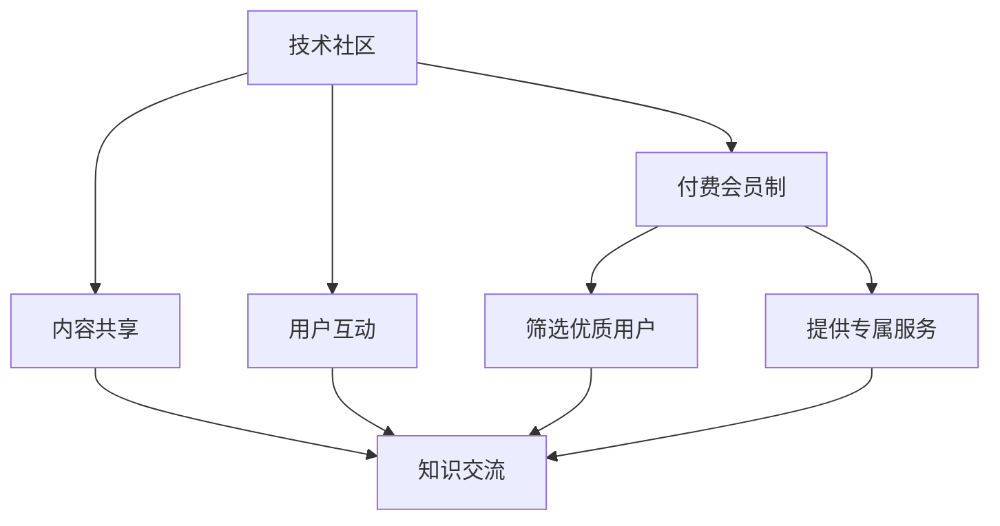

                 

# 从技术社区到付费会员制：程序员的社群运营之路

> 关键词：技术社区, 程序员社群, 付费会员制, 社群运营, 用户参与度, 商业模式

## 1. 背景介绍

### 1.1 问题由来
在过去几十年里，技术社区一直是程序员互相交流、分享知识和经验的重要场所。无论是GitHub、Stack Overflow还是各种开源论坛，这些平台极大地促进了技术交流与创新。然而，随着互联网用户群体的不断扩大和技术的飞速发展，技术社区也面临着诸多挑战：

- **内容质量参差不齐**：随着社区规模的扩大，用户质量有所下降，部分低质量内容的泛滥影响了整体用户体验。
- **商业模式的困境**：技术社区普遍依赖广告收入和会员订阅，但这些模式难以覆盖广泛的开发者群体，导致运营成本高企。
- **用户参与度下降**：尽管存在大量技术内容，但用户互动减少，社区活跃度逐渐下降。

这些问题促使社区管理者不断探索新的运营模式，以提升用户体验，实现可持续发展。

## 2. 核心概念与联系

### 2.1 核心概念概述

为了深入理解技术社区向付费会员制转型的逻辑，我们首先需要介绍几个关键概念：

- **技术社区**：以技术交流和分享为核心目标，聚集了大量程序员和开发者，供求双方通过提供和获取知识和资源，促进技术创新和产业发展。
- **社区运营**：通过组织活动、维护平台、吸引用户等手段，确保社区的健康发展。
- **付费会员制**：用户为获取高级权限、专属内容、增值服务支付会员费用的模式。

这些概念之间存在着紧密的联系：通过付费会员制，社区可以筛选出高质量用户，确保社区内容的质量，同时通过优质服务吸引用户订阅，形成良性的正反馈循环，推动社区可持续发展。

### 2.2 核心概念原理和架构的 Mermaid 流程图(Mermaid 流程节点中不要有括号、逗号等特殊字符)



该流程图展示了技术社区、内容共享、用户互动、付费会员制之间的联系和转化路径：

1. 技术社区提供内容共享和用户互动平台。
2. 社区用户通过分享和互动，促进知识交流。
3. 付费会员制筛选优质用户，确保社区内容质量。
4. 提供专属服务吸引更多用户，形成良性循环。

## 3. 核心算法原理 & 具体操作步骤

### 3.1 算法原理概述

社区从免费向付费转型的关键在于通过付费机制筛选优质用户，同时提供差异化服务以提升用户满意度。其基本算法原理如下：

1. **筛选优质用户**：设计会员资格的评估标准，如活跃度、贡献度等，筛选出高质量用户。
2. **提供专属服务**：根据会员等级，提供不同层次的专属内容和服务，如个性化推荐、优先支持、高级权限等。
3. **吸引用户订阅**：通过免费试用、特别优惠、社区活动等手段，吸引用户加入会员。

### 3.2 算法步骤详解

以下是付费会员制社区运营的具体操作步骤：

**Step 1: 用户分类与会员设计**
- 定义不同等级的会员类型，如初级会员、中级会员、高级会员等。
- 根据活跃度、贡献度、参与度等指标，设置不同会员类型的筛选条件。

**Step 2: 提供专属服务**
- 针对不同会员等级，提供个性化推荐、技术支持、定制化资源等专属服务。
- 高级会员享有优先获取新内容、参加专属活动等特权。

**Step 3: 设置付费策略**
- 设计灵活的付费策略，如按月、按年订阅，以及首次注册免费、续费优惠等。
- 推出限时优惠、会员推荐奖励等激励措施，吸引用户订阅。

**Step 4: 运营与维护**
- 通过数据分析工具，监控会员动态，及时调整会员策略。
- 组织社区活动，增强用户互动，提升社区活跃度。
- 通过反馈机制，不断优化会员服务。

**Step 5: 反馈与优化**
- 收集会员反馈，优化服务体验和功能。
- 根据反馈调整付费策略和会员等级，提升用户满意度。

### 3.3 算法优缺点

**优点：**

- **提升社区质量**：通过筛选机制，确保社区内容的高质量，提升用户体验。
- **增加收入**：通过会员收费，提高社区的商业化能力，实现经济可持续性。
- **增强用户粘性**：通过专属服务，增加用户参与度和留存率。

**缺点：**

- **运营成本高**：需要构建复杂的数据分析系统、定制化服务，投入较大。
- **市场接受度待验证**：部分用户可能对付费会员制存在抵触情绪，需要进一步市场教育。
- **公平性问题**：如何平衡会员与非会员之间的差异，避免过度商业化影响社区氛围。

### 3.4 算法应用领域

付费会员制社区运营模式适用于各种技术社区和开发者平台，包括：

- **开源项目社区**：如GitHub、GitLab等，为开发者提供代码托管、协作开发等平台。
- **技术论坛**：如Stack Overflow、知乎等，供开发者交流技术问题、分享经验。
- **学习平台**：如Coursera、Udacity等，为开发者提供在线课程和认证服务。
- **技术博客与文章平台**：如Medium、CSDN等，供开发者撰写技术文章，积累知识。

## 4. 数学模型和公式 & 详细讲解 & 举例说明

### 4.1 数学模型构建

为了更好地量化付费会员制的效果，我们可以构建一个简单的数学模型，描述会员数量、质量、收入与社区活跃度之间的关系。

设：
- $U$ 为社区总用户数。
- $M$ 为付费会员数。
- $Q$ 为优质用户占比，$Q = \frac{M}{U}$。
- $I$ 为收入，$I = P \times M$，其中 $P$ 为单月会员费用。
- $A$ 为社区活跃度，$A = A_0 + \alpha M$，其中 $A_0$ 为社区自然活跃度，$\alpha$ 为会员对活跃度的贡献系数。

目标是最优化会员数量 $M$，以最大化社区收入和活跃度。

### 4.2 公式推导过程

优化目标函数为：

$$
\maximize \ I
$$

约束条件为：

$$
Q \geq q_0 \\
M \leq U
$$

其中 $q_0$ 为优质用户的最低占比阈值。

通过拉格朗日乘数法，可以求解最优的 $M$ 和 $Q$：

设拉格朗日乘子 $\lambda$ 和 $\mu$，构建拉格朗日函数：

$$
\mathcal{L}(M, Q, \lambda, \mu) = I + \lambda (Q - q_0) + \mu (M - U)
$$

对 $M$ 和 $Q$ 求偏导，得到：

$$
\frac{\partial \mathcal{L}}{\partial M} = \frac{\partial I}{\partial M} + \lambda \frac{\partial Q}{\partial M} + \mu = 0 \\
\frac{\partial \mathcal{L}}{\partial Q} = \frac{\partial I}{\partial Q} + \lambda = 0 \\
\frac{\partial \mathcal{L}}{\partial \lambda} = Q - q_0 = 0 \\
\frac{\partial \mathcal{L}}{\partial \mu} = M - U = 0
$$

由此可得：

$$
P = \frac{A_0 + \alpha M}{Q} \\
Q = \frac{M}{U}
$$

将 $Q$ 代入 $P$ 中，解得：

$$
M = \frac{U A_0}{A_0 + \alpha U}
$$

这就是会员数量与社区活跃度之间的数学关系。

### 4.3 案例分析与讲解

以Stack Overflow为例，通过数据分析发现，高质量问题与回答的占比与社区活跃度之间存在正相关关系。通过设置高质量会员等级，提供优先审核、表彰奖励等专属服务，吸引优质用户加入，最终提升整体社区质量，实现经济可持续性。

## 5. 项目实践：代码实例和详细解释说明

### 5.1 开发环境搭建

要实现社区的付费会员制，需要搭建一个完整的开发环境，包括以下几个关键组件：

- **社区平台**：如Discourse、Meta等，提供论坛、博客、讨论等功能。
- **数据分析工具**：如Google Analytics、Mixpanel等，用于用户行为分析和会员策略优化。
- **会员管理系统**：如Auth0、Okta等，用于用户身份认证和权限管理。
- **支付系统**：如Stripe、PayPal等，提供便捷的支付解决方案。

以下是一个简单的社区平台搭建流程：

1. 选择合适的社区平台，如Discourse。
2. 配置用户身份认证系统，如Auth0。
3. 集成支付系统，如Stripe。
4. 搭建数据分析工具，如Google Analytics。
5. 设计会员等级和服务，如初级会员、高级会员等。

### 5.2 源代码详细实现

以下是一个简单的会员管理系统实现示例：

1. **用户注册与登录**
```python
from flask import Flask, render_template, request
from flask_sqlalchemy import SQLAlchemy
from flask_login import LoginManager, login_user, logout_user, login_required, current_user

app = Flask(__name__)
app.config['SQLALCHEMY_DATABASE_URI'] = 'sqlite:///users.db'
db = SQLAlchemy(app)
login_manager = LoginManager(app)

# 定义用户模型
class User(db.Model):
    id = db.Column(db.Integer, primary_key=True)
    username = db.Column(db.String(50), unique=True, nullable=False)
    password = db.Column(db.String(80), nullable=False)
    email = db.Column(db.String(120), unique=True, nullable=False)

@login_manager.user_loader
def load_user(user_id):
    return User.query.get(int(user_id))

@app.route('/login', methods=['GET', 'POST'])
def login():
    if request.method == 'POST':
        username = request.form['username']
        password = request.form['password']
        user = User.query.filter_by(username=username).first()
        if user and user.password == password:
            login_user(user)
            return 'Logged in successfully'
        return 'Invalid username or password'
    return render_template('login.html')

@app.route('/logout')
@login_required
def logout():
    logout_user()
    return 'Logged out successfully'

@app.route('/')
@login_required
def index():
    return 'Hello, {}!'.format(current_user.username)
```

2. **会员订阅与支付**
```python
from flask import Flask, render_template, request
from flask_sqlalchemy import SQLAlchemy
from flask_login import LoginManager, login_user, logout_user, login_required, current_user
from flask_stripe import Stripe

app = Flask(__name__)
app.config['SQLALCHEMY_DATABASE_URI'] = 'sqlite:///users.db'
db = SQLAlchemy(app)
login_manager = LoginManager(app)

stripe = Stripe('sk_test_XXXXXXXXXXXXXXXXXXXXXXXXXXXXXXXX')

# 定义会员模型
class Member(db.Model):
    id = db.Column(db.Integer, primary_key=True)
    user_id = db.Column(db.Integer, db.ForeignKey('user.id'))
    subscription_id = db.Column(db.String(50))

@login_manager.user_loader
def load_user(user_id):
    return User.query.get(int(user_id))

@app.route('/subscribe', methods=['GET', 'POST'])
@login_required
def subscribe():
    if request.method == 'POST':
        stripe.Plan.create(
            name='Premium',
            amount=1200, # 每月收费12美元
            interval='month',
            product_id='product_XXXXXXXXXXXXXXXXXXXXXXXXXXXXXXXX'
        )
        member = Member(user_id=current_user.id, subscription_id=stripe.subscription_create())
        db.session.add(member)
        db.session.commit()
        return 'Subscription created successfully'
    return render_template('subscribe.html')

@app.route('/')
@login_required
def index():
    return 'Hello, {}!'.format(current_user.username)
```

3. **数据分析与优化**
```python
from flask import Flask, render_template, request
from flask_sqlalchemy import SQLAlchemy
from flask_login import LoginManager, login_user, logout_user, login_required, current_user
from flask_stripe import Stripe

app = Flask(__name__)
app.config['SQLALCHEMY_DATABASE_URI'] = 'sqlite:///users.db'
db = SQLAlchemy(app)
login_manager = LoginManager(app)

stripe = Stripe('sk_test_XXXXXXXXXXXXXXXXXXXXXXXXXXXXXXXX')

# 定义会员模型
class Member(db.Model):
    id = db.Column(db.Integer, primary_key=True)
    user_id = db.Column(db.Integer, db.ForeignKey('user.id'))
    subscription_id = db.Column(db.String(50))

@login_manager.user_loader
def load_user(user_id):
    return User.query.get(int(user_id))

@app.route('/subscribe', methods=['GET', 'POST'])
@login_required
def subscribe():
    if request.method == 'POST':
        stripe.Plan.create(
            name='Premium',
            amount=1200, # 每月收费12美元
            interval='month',
            product_id='product_XXXXXXXXXXXXXXXXXXXXXXXXXXXXXXXX'
        )
        member = Member(user_id=current_user.id, subscription_id=stripe.subscription_create())
        db.session.add(member)
        db.session.commit()
        return 'Subscription created successfully'
    return render_template('subscribe.html')

@app.route('/')
@login_required
def index():
    return 'Hello, {}!'.format(current_user.username)

@app.route('/analysis')
@login_required
def analysis():
    # 查询会员信息
    members = Member.query.all()
    # 统计会员数量
    num_members = len(members)
    # 计算优质用户占比
    num_qualitative_members = members.filter(Member.subscription_id).all()
    qualitative_ratio = len(num_qualitative_members) / num_members
    # 返回结果
    return render_template('analysis.html', num_members=num_members, qualitative_ratio=qualitative_ratio)
```

### 5.3 代码解读与分析

在以上代码中，我们通过Flask框架实现了用户注册、登录、订阅和数据分析功能。以下是代码的主要功能解读：

- **用户注册与登录**：用户通过注册页面填写信息，服务器端验证用户名和密码是否匹配，验证通过后使用flask_login库进行用户身份认证。
- **会员订阅与支付**：用户通过订阅页面选择付费计划，服务器端调用Stripe API创建订阅并存储信息。
- **数据分析与优化**：通过查询会员信息和计算优质用户占比，实现会员质量的分析功能。

### 5.4 运行结果展示

运行上述代码后，可以通过访问`http://localhost:5000/login`进行用户登录，访问`http://localhost:5000/subscribe`进行订阅，访问`http://localhost:5000/analysis`查看会员质量分析结果。

## 6. 实际应用场景

### 6.1 智能客服系统

智能客服系统利用社区运营理念，通过用户订阅和专属服务提升客服质量。用户可以通过订阅获取优先响应、人工客服等多种服务，同时客服团队也能通过专属服务获取更多激励，提升服务质量。

### 6.2 金融风险管理

金融公司通过社区运营提升风险管理效率。用户订阅高级会员后，能够获取更详细的风险分析报告和个性化的风险管理建议，同时金融公司也能通过专属服务获取更多的用户反馈和改进建议。

### 6.3 游戏开发社区

游戏开发社区通过社区运营吸引开发者加入，提升社区活跃度和开发效率。高级会员享有优先提交游戏、参加游戏发布会等特权，同时社区管理者也能通过专属服务获取更多的开发者支持和社区反馈。

### 6.4 未来应用展望

未来，社区运营将更加普及和深入，涵盖更多行业和应用场景。例如：

- **医疗健康社区**：医生和患者通过订阅获取更多专业知识和咨询，提升医疗服务质量。
- **教育学习社区**：教师和学生通过订阅获取更多教育资源和个性化辅导，提升学习效果。
- **娱乐传媒社区**：创作者和观众通过订阅获取更多独家内容和互动，提升娱乐体验。

## 7. 工具和资源推荐

### 7.1 学习资源推荐

为了深入学习社区运营和付费会员制的实践，以下是几本推荐书籍：

- 《社区运营实战》：详细介绍了社区运营的各种策略和技巧。
- 《付费会员制商业模型》：介绍了付费会员制在多个行业的应用和效果。
- 《数据分析与决策》：介绍了数据驱动的社区运营和会员策略优化。

### 7.2 开发工具推荐

社区运营和付费会员制的开发需要多种工具的协同工作，以下是几款推荐工具：

- **社区平台**：如Discourse、Meta等，提供论坛、博客、讨论等功能。
- **数据分析工具**：如Google Analytics、Mixpanel等，用于用户行为分析和会员策略优化。
- **会员管理系统**：如Auth0、Okta等，用于用户身份认证和权限管理。
- **支付系统**：如Stripe、PayPal等，提供便捷的支付解决方案。

### 7.3 相关论文推荐

以下是几篇推荐论文，详细介绍了社区运营和付费会员制的理论和实践：

- 《社区运营策略研究》：分析了社区运营的各种策略和效果。
- 《付费会员制商业模型设计》：介绍了付费会员制在多个行业的应用和效果。
- 《数据分析与会员策略优化》：介绍了数据驱动的社区运营和会员策略优化方法。

## 8. 总结：未来发展趋势与挑战

### 8.1 研究成果总结

社区运营和付费会员制已成为技术社区发展的重要方向。通过付费会员制，社区能够筛选优质用户，提供差异化服务，实现商业化和可持续发展。

### 8.2 未来发展趋势

未来，社区运营将更加普及和深入，涵盖更多行业和应用场景。社区管理者和用户都将更加重视社区质量和服务，推动社区持续健康发展。

### 8.3 面临的挑战

尽管社区运营和付费会员制具有广泛的应用前景，但也面临诸多挑战：

- **运营成本高**：需要构建复杂的数据分析和会员管理系统，投入较大。
- **市场接受度待验证**：部分用户可能对付费会员制存在抵触情绪，需要进一步市场教育。
- **公平性问题**：如何平衡会员与非会员之间的差异，避免过度商业化影响社区氛围。

### 8.4 研究展望

社区运营和付费会员制的研究需要进一步深化，关注以下几个方向：

- **用户行为分析**：通过数据分析提升社区运营效率和用户体验。
- **会员策略优化**：通过差异化服务提升会员满意度和留存率。
- **多渠道融合**：结合线上线下渠道，提升社区的影响力和互动性。

## 9. 附录：常见问题与解答

### 常见问题与解答

**Q1: 如何衡量社区运营的效果？**

A: 社区运营的效果可以从用户增长、用户活跃度、会员订阅率等指标进行衡量。具体来说，可以通过用户增长率、月活跃用户数、日均访问量、会员订阅数等数据进行分析。

**Q2: 如何设计会员等级和服务？**

A: 会员等级和服务的设计需要考虑社区的需求和用户的支付意愿。一般来说，可以根据用户活跃度、贡献度等指标，设计不同等级的会员，提供差异化的专属服务。例如，初级会员可以享受基础功能，中级会员可以享受高级功能，高级会员可以享受优先服务和专属资源等。

**Q3: 如何吸引用户订阅？**

A: 吸引用户订阅的关键在于提供优质内容和个性化服务。可以通过推出限时优惠、会员推荐奖励、专属活动等手段，吸引用户加入会员。同时，保证社区内容的优质和丰富，提升用户体验和满意度，促进用户主动订阅。

**Q4: 如何确保会员质量？**

A: 确保会员质量的关键在于筛选机制和专属服务。通过设定会员资格的评估标准，如活跃度、贡献度等指标，筛选出高质量用户。同时，提供差异化服务，如个性化推荐、技术支持、高级权限等，提升会员满意度和留存率，确保社区内容的优质。

**Q5: 如何应对市场接受度不足的问题？**

A: 应对市场接受度不足的问题，可以从市场教育和社区活动两个方面入手。通过市场教育，向用户传达社区运营的价值和优势，提升用户对付费会员制的接受度。通过社区活动，增强用户互动和参与感，提升用户粘性。

通过本文的系统梳理，我们可以看到，社区运营和付费会员制具有广阔的应用前景，能够为技术社区带来持续的发展动力和商业价值。未来，社区管理者和开发者需不断探索和创新，才能实现社区的可持续发展和商业化成功。

