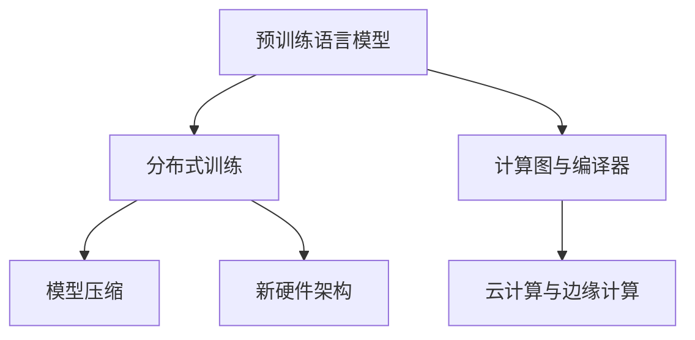

                 

## 1. 背景介绍

### 1.1 问题由来

在计算机科学的历史长河中，硬件与软件的关系一直密不可分。但近年来，随着人工智能的迅猛发展，特别是在自然语言处理领域，预训练语言模型（Large Language Models, LLMs）的出现，两者之间的关系似乎发生了某种根本性的转变。LLM通过在大规模无标签文本语料上进行预训练，学习到了丰富的语言知识和常识，具备了强大的语言理解和生成能力。这不仅仅是一个简单的模型设计，更是对硬件计算能力的巨大挑战，并且正在引发一场从硬件到软件，从底层基础设施到上层应用的计算革命。

### 1.2 问题核心关键点

这一转变核心在于几个关键的突破：

- **大规模数据与模型**：LLM需要处理和训练的海量数据集和超大规模的模型参数，对计算资源提出了极高的要求。
- **并行计算与分布式训练**：为了提高训练效率，需要充分利用GPU、TPU等并行计算资源，并采用分布式训练技术。
- **模型压缩与加速**：为了在实际应用中达到性能与效率的平衡，需要对模型进行压缩与加速，如剪枝、量化、混合精度训练等。
- **新硬件架构与设计**：为了满足LLM的计算需求，新的硬件架构（如专用的AI芯片）应运而生，成为计算革命的重要组成部分。

这些关键点的突破，不仅推动了LLM在自然语言处理领域的应用，也对整个计算机科学的硬件基础架构和软件系统产生了深远的影响。

### 1.3 问题研究意义

研究从硬件到软件的计算革命，不仅对理解LLM的技术机制和应用前景具有重要意义，还能为未来AI技术的发展提供借鉴。这一研究有助于：

- 深入理解LLM对硬件需求的驱动作用，促进硬件和软件技术的协同发展。
- 推动计算硬件的创新，如开发高效的AI芯片，以满足日益增长的计算需求。
- 促进软件架构的优化，如设计高效的分布式系统，优化算法与模型，提升软件性能。
- 探索新的计算范式，如云、边缘计算、量化计算等，为更广泛的应用场景提供支持。

## 2. 核心概念与联系

### 2.1 核心概念概述

为了更好地理解LLM引发的计算革命，本节将介绍几个核心概念及其相互联系：

- **预训练语言模型 (Pre-trained Language Model, LLM)**：如GPT、BERT等模型，通过在大规模无标签文本数据上进行预训练，学习到了丰富的语言知识和常识，具备强大的语言理解和生成能力。

- **分布式训练 (Distributed Training)**：为了加快训练速度，将大规模的模型参数和数据分布在多个计算节点上，并行执行计算，以提高训练效率。

- **模型压缩 (Model Compression)**：包括剪枝、量化、混合精度训练等技术，对大模型进行压缩，以提高计算效率和推理速度。

- **新硬件架构 (New Hardware Architecture)**：如专用AI芯片、光子芯片等，专为AI计算需求设计，提高计算速度和效率。

- **计算图与编译器 (Computational Graph & Compiler)**：包括自动微分、编译优化等技术，用于构建高效的计算图，并自动生成高效的机器码，优化模型计算效率。

- **云计算与边缘计算 (Cloud Computing & Edge Computing)**：通过云计算和边缘计算，将计算资源灵活分配，支持大规模模型的训练和推理。

这些概念之间的逻辑关系可以通过以下Mermaid流程图来展示：



这个流程图展示了LLM在计算革命中的关键角色，及其与分布式训练、模型压缩、新硬件架构、计算图与编译器、云计算与边缘计算等概念的紧密联系。

## 3. 核心算法原理 & 具体操作步骤

### 3.1 算法原理概述

LLM引发的计算革命，其核心在于如何高效地训练和推理大规模语言模型，并在实际应用中提升性能和效率。这一过程包括预训练、微调、分布式训练、模型压缩、新硬件架构设计等环节。

### 3.2 算法步骤详解

#### 3.2.1 预训练阶段

预训练阶段是LLM模型的核心，其主要目的是在大规模无标签文本数据上，学习到语言的基本规则和上下文信息。常见的预训练任务包括自回归语言模型、掩码语言模型等。预训练过程通过反向传播算法更新模型参数，使得模型能够更好地理解语言的结构和语义。

#### 3.2.2 微调阶段

微调阶段是LLM模型在特定任务上的进一步优化。在微调过程中，LLM模型被赋予了特定的任务目标，如文本分类、情感分析、问答等。通过在少量标注数据上进行有监督学习，微调模型可以更好地适应特定任务的需求，从而提升模型的性能。

#### 3.2.3 分布式训练

为了提高训练效率，分布式训练将大规模的模型参数和数据分布在多个计算节点上，并行执行计算。通过合理分配任务，不同节点可以并行处理部分计算，从而显著缩短训练时间。

#### 3.2.4 模型压缩

模型压缩是对大规模模型的参数进行优化，以提高计算效率和推理速度。常见的压缩技术包括剪枝、量化、混合精度训练等。剪枝技术去除不必要的参数，量化技术将高精度浮点参数转换为低精度整数参数，混合精度训练则通过混合使用高精度和低精度参数，提高训练效率。

#### 3.2.5 新硬件架构设计

新硬件架构设计是针对LLM模型的高计算需求，专门设计的硬件系统。如专用的AI芯片（如Google TPU、NVIDIA A100等），可以显著提高计算效率和能效比。这些硬件架构优化，使得LLM模型能够在实际应用中快速运行。

### 3.3 算法优缺点

LLM引发的计算革命，带来了许多好处，但也存在一些局限：

#### 3.3.1 优点

- **提升计算效率**：分布式训练、模型压缩和新硬件架构设计，显著提高了训练和推理的效率，加速了模型的开发和应用。
- **优化计算资源**：合理的硬件资源分配和利用，使得计算资源得到更高效的利用，降低计算成本。
- **提高模型性能**：通过分布式训练和微调，模型在特定任务上的性能得到了显著提升。

#### 3.3.2 缺点

- **资源消耗高**：大规模模型的训练和推理需要大量的计算资源，对硬件设备和能耗提出了较高要求。
- **算法复杂度高**：分布式训练和模型压缩等技术，增加了算法的复杂度，对开发人员提出了更高的要求。
- **数据隐私问题**：分布式训练和云计算环境下的数据传输和存储，可能涉及数据隐私和安全问题。

### 3.4 算法应用领域

LLM引发的计算革命，已经在许多领域得到了广泛应用，例如：

- **自然语言处理**：文本分类、情感分析、问答、机器翻译、文本摘要等任务。
- **图像识别**：图像分类、目标检测、图像生成等任务。
- **语音识别**：语音转文本、文本转语音等任务。
- **推荐系统**：商品推荐、音乐推荐、新闻推荐等任务。
- **游戏与娱乐**：游戏AI、智能对话、虚拟现实等任务。
- **医疗健康**：病历分析、疾病预测、医学影像分析等任务。
- **金融领域**：风险评估、投资分析、客户服务等任务。

## 4. 数学模型和公式 & 详细讲解 & 举例说明

### 4.1 数学模型构建

LLM引发的计算革命，其数学模型主要围绕预训练模型、分布式训练模型、模型压缩模型和新硬件架构模型展开。

#### 4.1.1 预训练模型

预训练模型通过自回归或掩码语言模型，在大规模无标签文本数据上进行预训练。预训练模型的一般形式为：

$$
M_{\theta}(x) = \text{Encoder-Decoder}(x, \theta)
$$

其中，$x$ 表示输入文本，$\theta$ 表示模型参数。

#### 4.1.2 分布式训练模型

分布式训练模型通过将计算任务分配到多个计算节点上，并行执行计算，以提高训练效率。分布式训练的一般形式为：

$$
M_{\theta}^{(i)}(x, \theta) = \text{Encoder-Decoder}(x, \theta^{(i)})
$$

其中，$i$ 表示计算节点编号，$\theta^{(i)}$ 表示节点$i$上的模型参数。

#### 4.1.3 模型压缩模型

模型压缩模型通过剪枝、量化、混合精度训练等技术，对大模型进行优化，以提高计算效率和推理速度。模型压缩的一般形式为：

$$
M_{\theta}^{\text{compressed}}(x, \theta) = \text{Encoder-Decoder}(x, \theta^{\text{compressed}})
$$

其中，$\theta^{\text{compressed}}$ 表示压缩后的模型参数。

#### 4.1.4 新硬件架构模型

新硬件架构模型通过专门设计的硬件系统，如专用AI芯片，提高计算效率和能效比。新硬件架构模型的一般形式为：

$$
M_{\theta}^{\text{hardware}}(x, \theta) = \text{Encoder-Decoder}(x, \theta^{\text{hardware}})
$$

其中，$\theta^{\text{hardware}}$ 表示在专用硬件上训练的模型参数。

### 4.2 公式推导过程

#### 4.2.1 预训练阶段

预训练阶段的目标是最大化自回归语言模型或掩码语言模型的对数似然。对于自回归模型，其训练目标是最大化如下公式：

$$
L_{\text{pretrain}} = \sum_{i=1}^{N} \log P(x_i|x_{<i})
$$

其中，$N$ 表示训练集大小，$x_{<i}$ 表示文本序列的子序列。

#### 4.2.2 微调阶段

微调阶段的目标是最大化特定任务的目标函数，如文本分类任务的交叉熵损失函数：

$$
L_{\text{fine-tune}} = -\sum_{i=1}^{N} y_i \log P(y_i|x_i)
$$

其中，$y_i$ 表示文本的分类标签。

#### 4.2.3 分布式训练

分布式训练通过多节点并行计算，最大化分布式训练的总体损失函数：

$$
L_{\text{dist-train}} = \sum_{i=1}^{K} \frac{1}{N_i} \sum_{j=1}^{N_i} \ell_j
$$

其中，$K$ 表示计算节点数量，$N_i$ 表示节点$i$的训练样本数量，$\ell_j$ 表示样本$j$的损失函数。

#### 4.2.4 模型压缩

模型压缩的目标是在保持模型性能的前提下，减少计算资源的消耗。通过剪枝技术去除不必要的参数，量化技术将高精度参数转换为低精度参数，混合精度训练则通过混合使用高精度和低精度参数，提高计算效率。

#### 4.2.5 新硬件架构

新硬件架构设计的目标是提高计算效率和能效比。如专用AI芯片，通过优化硬件电路设计和算法优化，提高计算速度和能效比。

### 4.3 案例分析与讲解

#### 4.3.1 预训练阶段案例

以BERT模型为例，其预训练过程通过掩码语言模型，在大规模无标签文本数据上进行预训练，学习到语言的上下文信息和语义关系。BERT模型的预训练过程如下：

1. 随机掩码一部分输入文本，将掩码部分替换为[MASK]标记。
2. 输入文本通过Transformer编码器，计算掩码部分的概率分布。
3. 计算掩码部分的负对数似然损失。

#### 4.3.2 微调阶段案例

以情感分析任务为例，微调过程通过在少量标注数据上进行有监督学习，训练模型对情感极性进行分类。微调过程如下：

1. 将文本和情感标签作为输入，计算模型的输出概率分布。
2. 计算交叉熵损失函数，更新模型参数。
3. 在验证集上评估模型性能，调整超参数和正则化策略。

#### 4.3.3 分布式训练案例

以GPT-2模型为例，分布式训练过程通过将模型参数分布在多个节点上，并行执行计算，显著提高了训练效率。分布式训练过程如下：

1. 将模型参数分布在多个节点上，每个节点处理一部分计算任务。
2. 每个节点计算梯度，并将梯度发送到中央协调器。
3. 中央协调器汇总梯度，计算全局梯度，并更新模型参数。

#### 4.3.4 模型压缩案例

以BERT模型为例，模型压缩过程通过剪枝和量化技术，对模型参数进行优化，提高计算效率和推理速度。模型压缩过程如下：

1. 对模型进行剪枝，去除冗余参数。
2. 对剪枝后的模型进行量化，将高精度参数转换为低精度参数。
3. 在推理过程中使用量化后的模型，提高计算速度。

#### 4.3.5 新硬件架构案例

以Google TPU为例，新硬件架构通过专用电路设计和算法优化，显著提高了计算效率和能效比。新硬件架构设计过程如下：

1. 设计专用电路，优化数据流和计算单元。
2. 优化算法，减少计算冗余，提高计算效率。
3. 使用TPU进行模型训练和推理，显著提高计算速度。

## 5. 项目实践：代码实例和详细解释说明

### 5.1 开发环境搭建

在进行LLM引发的计算革命实践前，我们需要准备好开发环境。以下是使用Python进行PyTorch开发的环境配置流程：

1. 安装Anaconda：从官网下载并安装Anaconda，用于创建独立的Python环境。

2. 创建并激活虚拟环境：
```bash
conda create -n pytorch-env python=3.8 
conda activate pytorch-env
```

3. 安装PyTorch：根据CUDA版本，从官网获取对应的安装命令。例如：
```bash
conda install pytorch torchvision torchaudio cudatoolkit=11.1 -c pytorch -c conda-forge
```

4. 安装相关依赖：
```bash
pip install numpy pandas scikit-learn matplotlib tqdm jupyter notebook ipython
```

完成上述步骤后，即可在`pytorch-env`环境中开始LLM引发的计算革命实践。

### 5.2 源代码详细实现

这里我们以BERT模型为例，给出使用Transformers库对BERT模型进行微调的PyTorch代码实现。

首先，定义模型和优化器：

```python
from transformers import BertForTokenClassification, AdamW

model = BertForTokenClassification.from_pretrained('bert-base-cased', num_labels=2)

optimizer = AdamW(model.parameters(), lr=2e-5)
```

然后，定义训练和评估函数：

```python
from torch.utils.data import DataLoader
from tqdm import tqdm
from sklearn.metrics import classification_report

device = torch.device('cuda') if torch.cuda.is_available() else torch.device('cpu')
model.to(device)

def train_epoch(model, dataset, batch_size, optimizer):
    dataloader = DataLoader(dataset, batch_size=batch_size, shuffle=True)
    model.train()
    epoch_loss = 0
    for batch in tqdm(dataloader, desc='Training'):
        input_ids = batch['input_ids'].to(device)
        attention_mask = batch['attention_mask'].to(device)
        labels = batch['labels'].to(device)
        model.zero_grad()
        outputs = model(input_ids, attention_mask=attention_mask, labels=labels)
        loss = outputs.loss
        epoch_loss += loss.item()
        loss.backward()
        optimizer.step()
    return epoch_loss / len(dataloader)

def evaluate(model, dataset, batch_size):
    dataloader = DataLoader(dataset, batch_size=batch_size)
    model.eval()
    preds, labels = [], []
    with torch.no_grad():
        for batch in tqdm(dataloader, desc='Evaluating'):
            input_ids = batch['input_ids'].to(device)
            attention_mask = batch['attention_mask'].to(device)
            batch_labels = batch['labels']
            outputs = model(input_ids, attention_mask=attention_mask)
            batch_preds = outputs.logits.argmax(dim=2).to('cpu').tolist()
            batch_labels = batch_labels.to('cpu').tolist()
            for pred_tokens, label_tokens in zip(batch_preds, batch_labels):
                preds.append(pred_tokens[:len(label_tokens)])
                labels.append(label_tokens)
                
    print(classification_report(labels, preds))
```

最后，启动训练流程并在测试集上评估：

```python
epochs = 5
batch_size = 16

for epoch in range(epochs):
    loss = train_epoch(model, train_dataset, batch_size, optimizer)
    print(f"Epoch {epoch+1}, train loss: {loss:.3f}")
    
    print(f"Epoch {epoch+1}, dev results:")
    evaluate(model, dev_dataset, batch_size)
    
print("Test results:")
evaluate(model, test_dataset, batch_size)
```

以上就是使用PyTorch对BERT进行情感分析任务微调的完整代码实现。可以看到，得益于Transformers库的强大封装，我们可以用相对简洁的代码完成BERT模型的加载和微调。

### 5.3 代码解读与分析

让我们再详细解读一下关键代码的实现细节：

**train_epoch函数**：
- `__init__`方法：初始化模型、优化器、训练集等关键组件。
- `__len__`方法：返回数据集的样本数量。
- `__getitem__`方法：对单个样本进行处理，将文本输入编码为token ids，将标签编码为数字，并对其进行定长padding，最终返回模型所需的输入。

**tag2id和id2tag字典**：
- 定义了标签与数字id之间的映射关系，用于将token-wise的预测结果解码回真实的标签。

**训练和评估函数**：
- 使用PyTorch的DataLoader对数据集进行批次化加载，供模型训练和推理使用。
- 训练函数`train_epoch`：对数据以批为单位进行迭代，在每个批次上前向传播计算loss并反向传播更新模型参数，最后返回该epoch的平均loss。
- 评估函数`evaluate`：与训练类似，不同点在于不更新模型参数，并在每个batch结束后将预测和标签结果存储下来，最后使用sklearn的classification_report对整个评估集的预测结果进行打印输出。

**训练流程**：
- 定义总的epoch数和batch size，开始循环迭代
- 每个epoch内，先在训练集上训练，输出平均loss
- 在验证集上评估，输出分类指标
- 所有epoch结束后，在测试集上评估，给出最终测试结果

可以看到，PyTorch配合Transformers库使得BERT微调的代码实现变得简洁高效。开发者可以将更多精力放在数据处理、模型改进等高层逻辑上，而不必过多关注底层的实现细节。

当然，工业级的系统实现还需考虑更多因素，如模型的保存和部署、超参数的自动搜索、更灵活的任务适配层等。但核心的微调范式基本与此类似。

## 6. 实际应用场景

### 6.1 智能客服系统

基于大语言模型微调的对话技术，可以广泛应用于智能客服系统的构建。传统客服往往需要配备大量人力，高峰期响应缓慢，且一致性和专业性难以保证。而使用微调后的对话模型，可以7x24小时不间断服务，快速响应客户咨询，用自然流畅的语言解答各类常见问题。

在技术实现上，可以收集企业内部的历史客服对话记录，将问题和最佳答复构建成监督数据，在此基础上对预训练对话模型进行微调。微调后的对话模型能够自动理解用户意图，匹配最合适的答案模板进行回复。对于客户提出的新问题，还可以接入检索系统实时搜索相关内容，动态组织生成回答。如此构建的智能客服系统，能大幅提升客户咨询体验和问题解决效率。

### 6.2 金融舆情监测

金融机构需要实时监测市场舆论动向，以便及时应对负面信息传播，规避金融风险。传统的人工监测方式成本高、效率低，难以应对网络时代海量信息爆发的挑战。基于大语言模型微调的文本分类和情感分析技术，为金融舆情监测提供了新的解决方案。

具体而言，可以收集金融领域相关的新闻、报道、评论等文本数据，并对其进行主题标注和情感标注。在此基础上对预训练语言模型进行微调，使其能够自动判断文本属于何种主题，情感倾向是正面、中性还是负面。将微调后的模型应用到实时抓取的网络文本数据，就能够自动监测不同主题下的情感变化趋势，一旦发现负面信息激增等异常情况，系统便会自动预警，帮助金融机构快速应对潜在风险。

### 6.3 个性化推荐系统

当前的推荐系统往往只依赖用户的历史行为数据进行物品推荐，无法深入理解用户的真实兴趣偏好。基于大语言模型微调技术，个性化推荐系统可以更好地挖掘用户行为背后的语义信息，从而提供更精准、多样的推荐内容。

在实践中，可以收集用户浏览、点击、评论、分享等行为数据，提取和用户交互的物品标题、描述、标签等文本内容。将文本内容作为模型输入，用户的后续行为（如是否点击、购买等）作为监督信号，在此基础上微调预训练语言模型。微调后的模型能够从文本内容中准确把握用户的兴趣点。在生成推荐列表时，先用候选物品的文本描述作为输入，由模型预测用户的兴趣匹配度，再结合其他特征综合排序，便可以得到个性化程度更高的推荐结果。

### 6.4 未来应用展望

随着大语言模型微调技术的发展，基于微调范式将在更多领域得到应用，为传统行业带来变革性影响。

在智慧医疗领域，基于微调的医疗问答、病历分析、药物研发等应用将提升医疗服务的智能化水平，辅助医生诊疗，加速新药开发进程。

在智能教育领域，微调技术可应用于作业批改、学情分析、知识推荐等方面，因材施教，促进教育公平，提高教学质量。

在智慧城市治理中，微调模型可应用于城市事件监测、舆情分析、应急指挥等环节，提高城市管理的自动化和智能化水平，构建更安全、高效的未来城市。

此外，在企业生产、社会治理、文娱传媒等众多领域，基于大模型微调的人工智能应用也将不断涌现，为经济社会发展注入新的动力。相信随着技术的日益成熟，微调方法将成为人工智能落地应用的重要范式，推动人工智能技术在垂直行业的规模化落地。

## 7. 工具和资源推荐

### 7.1 学习资源推荐

为了帮助开发者系统掌握LLM引发的计算革命的理论基础和实践技巧，这里推荐一些优质的学习资源：

1. 《Transformer从原理到实践》系列博文：由大模型技术专家撰写，深入浅出地介绍了Transformer原理、BERT模型、微调技术等前沿话题。

2. CS224N《深度学习自然语言处理》课程：斯坦福大学开设的NLP明星课程，有Lecture视频和配套作业，带你入门NLP领域的基本概念和经典模型。

3. 《Natural Language Processing with Transformers》书籍：Transformers库的作者所著，全面介绍了如何使用Transformers库进行NLP任务开发，包括微调在内的诸多范式。

4. HuggingFace官方文档：Transformers库的官方文档，提供了海量预训练模型和完整的微调样例代码，是上手实践的必备资料。

5. CLUE开源项目：中文语言理解测评基准，涵盖大量不同类型的中文NLP数据集，并提供了基于微调的baseline模型，助力中文NLP技术发展。

通过对这些资源的学习实践，相信你一定能够快速掌握LLM引发的计算革命的精髓，并用于解决实际的NLP问题。
###  7.2 开发工具推荐

高效的开发离不开优秀的工具支持。以下是几款用于LLM引发的计算革命开发的常用工具：

1. PyTorch：基于Python的开源深度学习框架，灵活动态的计算图，适合快速迭代研究。大部分预训练语言模型都有PyTorch版本的实现。

2. TensorFlow：由Google主导开发的开源深度学习框架，生产部署方便，适合大规模工程应用。同样有丰富的预训练语言模型资源。

3. Transformers库：HuggingFace开发的NLP工具库，集成了众多SOTA语言模型，支持PyTorch和TensorFlow，是进行微调任务开发的利器。

4. Weights & Biases：模型训练的实验跟踪工具，可以记录和可视化模型训练过程中的各项指标，方便对比和调优。与主流深度学习框架无缝集成。

5. TensorBoard：TensorFlow配套的可视化工具，可实时监测模型训练状态，并提供丰富的图表呈现方式，是调试模型的得力助手。

6. Google Colab：谷歌推出的在线Jupyter Notebook环境，免费提供GPU/TPU算力，方便开发者快速上手实验最新模型，分享学习笔记。

合理利用这些工具，可以显著提升LLM引发的计算革命任务的开发效率，加快创新迭代的步伐。

### 7.3 相关论文推荐

LLM引发的计算革命源于学界的持续研究。以下是几篇奠基性的相关论文，推荐阅读：

1. Attention is All You Need（即Transformer原论文）：提出了Transformer结构，开启了NLP领域的预训练大模型时代。

2. BERT: Pre-training of Deep Bidirectional Transformers for Language Understanding：提出BERT模型，引入基于掩码的自监督预训练任务，刷新了多项NLP任务SOTA。

3. Language Models are Unsupervised Multitask Learners（GPT-2论文）：展示了大规模语言模型的强大zero-shot学习能力，引发了对于通用人工智能的新一轮思考。

4. Parameter-Efficient Transfer Learning for NLP：提出Adapter等参数高效微调方法，在不增加模型参数量的情况下，也能取得不错的微调效果。

5. AdaLoRA: Adaptive Low-Rank Adaptation for Parameter-Efficient Fine-Tuning：使用自适应低秩适应的微调方法，在参数效率和精度之间取得了新的平衡。

这些论文代表了大语言模型微调技术的发展脉络。通过学习这些前沿成果，可以帮助研究者把握学科前进方向，激发更多的创新灵感。

## 8. 总结：未来发展趋势与挑战

### 8.1 总结

本文对LLM引发的计算革命进行了全面系统的介绍。首先阐述了LLM的兴起背景和研究意义，明确了预训练模型、分布式训练、模型压缩、新硬件架构等概念的相互联系。其次，从原理到实践，详细讲解了LLM引发的计算革命的数学模型和算法步骤，给出了微调任务开发的完整代码实例。同时，本文还广泛探讨了LLM在智能客服、金融舆情、个性化推荐等多个行业领域的应用前景，展示了微调范式的巨大潜力。此外，本文精选了微调技术的各类学习资源，力求为读者提供全方位的技术指引。

通过本文的系统梳理，可以看到，LLM引发的计算革命已经在大规模模型训练、分布式系统设计、硬件架构优化等方面取得了显著进展，推动了NLP技术在实际应用中的快速落地。未来，随着硬件技术的不断进步和算力资源的不断丰富，基于LLM的计算革命将继续拓展其应用范围，为人工智能技术带来更多创新和突破。

### 8.2 未来发展趋势

展望未来，LLM引发的计算革命将呈现以下几个发展趋势：

1. **更高效的分布式训练**：随着分布式系统设计和优化技术的不断进步，未来分布式训练的效率将进一步提升，支持更大规模的模型训练。

2. **更先进的硬件架构**：未来将出现更多高性能的AI芯片，如光子芯片、量子计算芯片等，极大提升计算效率和能效比。

3. **更智能的模型压缩**：未来模型压缩技术将更加精细化，包括更有效的剪枝算法、更准确的量化方法等，显著提升计算效率。

4. **更广泛的应用场景**：LLM引发的计算革命将更多地应用于智能决策、自动驾驶、智能制造等领域，推动更多产业的数字化转型。

5. **更智能的自动化工具**：未来自动化工具将更加智能，能够自动化完成模型优化、超参数调优、数据增强等任务，减少开发人员的负担。

6. **更高效的云计算**：未来云计算将更加智能化、高效化，支持更大规模的模型训练和推理，优化资源分配和成本控制。

### 8.3 面临的挑战

尽管LLM引发的计算革命已经取得了瞩目成就，但在迈向更加智能化、普适化应用的过程中，它仍面临着诸多挑战：

1. **资源消耗高**：大规模模型的训练和推理需要大量的计算资源，对硬件设备和能耗提出了较高要求。

2. **算法复杂度高**：分布式训练和模型压缩等技术，增加了算法的复杂度，对开发人员提出了更高的要求。

3. **数据隐私问题**：分布式训练和云计算环境下的数据传输和存储，可能涉及数据隐私和安全问题。

4. **计算效率有待提升**：虽然分布式训练和新硬件架构设计提高了计算效率，但仍然存在一定的瓶颈，需要进一步优化。

5. **可解释性不足**：当前大语言模型的决策过程通常缺乏可解释性，难以对其推理逻辑进行分析和调试。

6. **计算成本高**：大规模模型的训练和推理成本仍然较高，需要探索更高效、更经济的计算方式。

### 8.4 研究展望

面对LLM引发的计算革命所面临的挑战，未来的研究需要在以下几个方面寻求新的突破：

1. **更高效的分布式训练算法**：研究更高效的分布式训练算法，如联邦学习、梯度压缩等，进一步提高分布式训练效率。

2. **更优化的硬件架构设计**：研究更优化的硬件架构设计，如光子芯片、量子计算芯片等，提升计算效率和能效比。

3. **更智能的模型压缩方法**：研究更智能的模型压缩方法，如稀疏化剪枝、动态量化等，提升模型压缩效果。

4. **更智能的自动化工具**：开发更智能的自动化工具，如自动化微调、自动化模型优化等，减少人工干预，提高开发效率。

5. **更高效的数据传输与存储**：研究更高效的数据传输与存储技术，如分布式文件系统、数据压缩技术等，优化数据传输和存储效率。

6. **更智能的模型解释方法**：研究更智能的模型解释方法，如因果推断、可解释AI等，提升模型的可解释性和可信任度。

7. **更经济的计算方式**：探索更经济的计算方式，如边缘计算、云计算等，降低计算成本，提高计算效率。

这些研究方向的探索，必将引领LLM引发的计算革命技术迈向更高的台阶，为构建更智能、更高效、更经济的AI系统提供强有力的支撑。面向未来，我们期待LLM引发的计算革命能够实现更多突破，推动人工智能技术在更多领域实现普适化应用。

## 9. 附录：常见问题与解答

**Q1：大语言模型引发的计算革命是否适用于所有NLP任务？**

A: 大语言模型引发的计算革命在大多数NLP任务上都能取得不错的效果，特别是对于数据量较小的任务。但对于一些特定领域的任务，如医学、法律等，仅仅依靠通用语料预训练的模型可能难以很好地适应。此时需要在特定领域语料上进一步预训练，再进行微调，才能获得理想效果。此外，对于一些需要时效性、个性化很强的任务，如对话、推荐等，微调方法也需要针对性的改进优化。

**Q2：如何优化大语言模型引发的计算革命中的分布式训练？**

A: 优化大语言模型引发的计算革命中的分布式训练，主要从以下几个方面入手：

1. **选择合适的算法**：选择适合分布式训练的算法，如SGD、Adam等，并调整超参数，如学习率、批大小等。

2. **合理分配任务**：将训练任务合理分配到多个计算节点上，避免某些节点的计算任务过重，导致训练不均衡。

3. **优化通信开销**：采用异步更新、流水线并行等技术，减少通信开销，提高并行计算效率。

4. **使用数据并行**：采用数据并行技术，将数据分配到多个节点上，每个节点处理一部分数据，提高训练效率。

5. **使用混合精度训练**：使用混合精度训练技术，将高精度和低精度参数混合使用，提高训练速度和效率。

6. **优化模型参数**：对模型参数进行优化，如剪枝、量化等，减少计算资源消耗，提高计算效率。

7. **使用分布式文件系统**：使用高效分布式文件系统，如Hadoop、Spark等，优化数据存储和传输效率。

通过以上优化措施，可以显著提高大语言模型引发的计算革命中的分布式训练效率，降低计算成本。

**Q3：如何优化大语言模型引发的计算革命中的模型压缩？**

A: 优化大语言模型引发的计算革命中的模型压缩，主要从以下几个方面入手：

1. **剪枝技术**：采用剪枝技术，去除模型中冗余和不重要的参数，减少计算资源消耗。

2. **量化技术**：采用量化技术，将高精度浮点参数转换为低精度整数参数，减少计算资源消耗，提高推理速度。

3. **混合精度训练**：采用混合精度训练技术，将高精度和低精度参数混合使用，提高训练速度和效率。

4. **动态剪枝**：采用动态剪枝技术，根据模型在实际推理中的表现，动态调整剪枝策略，提高压缩效果。

5. **知识蒸馏**：采用知识蒸馏技术，将大模型知识迁移到小模型中，提高小模型的性能，减少计算资源消耗。

6. **模块化压缩**：采用模块化压缩技术，对不同模块进行单独压缩，提高压缩效果，同时保持模型整体性能。

通过以上优化措施，可以显著提高大语言模型引发的计算革命中的模型压缩效率，减少计算资源消耗，提高计算效率和推理速度。

**Q4：如何在LLM引发的计算革命中进行有效的硬件资源分配和优化？**

A: 在LLM引发的计算革命中进行有效的硬件资源分配和优化，主要从以下几个方面入手：

1. **选择合适的硬件设备**：根据任务需求和计算资源，选择合适的硬件设备，如GPU、TPU、专用AI芯片等。

2. **优化硬件加速**：使用硬件加速技术，如GPU并行计算、TPU专用计算等，提高计算效率和能效比。

3. **合理分配资源**：将计算资源合理分配到不同的计算节点上，避免某些节点的计算任务过重，导致资源浪费。

4. **优化内存管理**：采用内存管理技术，如GPU内存管理、TPU内存管理等，优化内存使用，提高计算效率。

5. **使用分布式计算**：使用分布式计算技术，将计算任务分配到多个计算节点上，并行执行计算，提高计算效率。

6. **优化数据传输**：采用高效数据传输技术，如网络优化、数据压缩等，减少数据传输延迟，提高计算效率。

7. **使用优化工具**：使用优化工具，如TensorBoard、Weights & Biases等，实时监测和分析计算性能，优化资源分配和调度。

通过以上优化措施，可以显著提高LLM引发的计算革命中的硬件资源利用效率，降低计算成本，提高计算效率和能效比。

**Q5：如何应对LLM引发的计算革命中面临的数据隐私和安全问题？**

A: 在LLM引发的计算革命中，数据隐私和安全问题需要特别关注。以下是一些应对策略：

1. **数据加密**：对数据进行加密处理，防止数据泄露和被恶意篡改。

2. **访问控制**：采用访问控制技术，限制对敏感数据的访问权限，确保数据安全。

3. **数据匿名化**：对数据进行匿名化处理，去除个人隐私信息，保护用户隐私。

4. **联邦学习**：采用联邦学习技术，将数据分布在多个节点上进行模型训练，不将数据集中存储，保护数据隐私。

5. **差分隐私**：采用差分隐私技术，在模型训练过程中添加噪声，保护数据隐私。

6. **安全计算**：采用安全计算技术，如多方安全计算、同态加密等，确保数据在传输和计算过程中不被泄露。

通过以上措施，可以显著提高LLM引发的计算革命中的数据隐私和安全保障，保护用户隐私，防止数据泄露和被恶意利用。

---

作者：禅与计算机程序设计艺术 / Zen and the Art of Computer Programming

