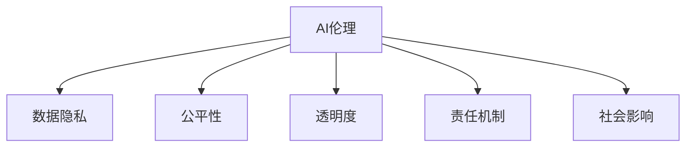

                 

# 企业AI伦理：Lepton AI的社会责任

> 关键词：企业AI, 人工智能伦理, 数据隐私, 公平性, 透明度, 责任机制, 社会影响

## 1. 背景介绍

### 1.1 问题由来

随着人工智能（AI）技术的迅猛发展，越来越多的企业开始应用AI技术，以提高生产效率、优化决策流程、提升用户体验等。AI技术的应用，极大地改变了各行业的游戏规则，带来了前所未有的机会和挑战。然而，AI技术的广泛应用也带来了诸多伦理和法律问题，这些问题涉及到数据隐私、公平性、透明度、责任机制等多个方面。这些问题如果不能妥善解决，不仅会威胁到企业的长远发展，还可能引发社会信任危机。

### 1.2 问题核心关键点

AI伦理的核心关键点包括以下几个方面：

1. **数据隐私**：AI系统的训练和运行依赖于大量数据，这些数据往往包含用户的个人信息，如何保护用户隐私成为一个重要问题。
2. **公平性**：AI系统可能存在偏见，导致对不同群体的输出结果不公平。如何确保AI系统的公平性，是一个亟待解决的问题。
3. **透明度**：AI系统的决策过程往往是“黑箱”的，用户难以理解和信任。如何提高AI系统的透明度，是提高用户信任的关键。
4. **责任机制**：AI系统的错误决策可能导致严重后果，如何明确责任主体，是应对法律和伦理挑战的基础。
5. **社会影响**：AI技术的应用可能对社会产生深远影响，如何确保其对社会的积极影响，是企业的社会责任之一。

## 2. 核心概念与联系

### 2.1 核心概念概述

为更好地理解企业AI伦理的核心问题，本节将介绍几个密切相关的核心概念：

- **AI伦理**：AI伦理是指在AI技术应用过程中，如何确保技术应用的道德合理性，避免对个人、社会造成伤害或不公平。
- **数据隐私**：数据隐私是指保护个人数据的收集、存储、使用和共享过程中，个人信息不被滥用和泄露。
- **公平性**：AI系统的公平性是指在处理不同群体的数据时，系统输出结果不受偏见和不公平对待的影响。
- **透明度**：AI系统的透明度是指在执行决策时，用户能够理解系统的输入、处理和输出过程，从而提高用户信任。
- **责任机制**：AI系统的责任机制是指在发生错误决策时，能够明确责任主体，确保其承担相应的法律和道德责任。
- **社会影响**：AI系统的社会影响是指AI技术应用对社会、经济、文化等方面的长远影响，需要企业承担社会责任进行积极引导。

这些核心概念之间的逻辑关系可以通过以下Mermaid流程图来展示：



这个流程图展示了大语言模型的核心概念及其之间的关系：

1. AI伦理是整体框架，贯穿于AI系统的各个环节。
2. 数据隐私、公平性、透明度、责任机制和社会影响是AI伦理的具体体现，需要从技术、法律和伦理多个层面进行保障。

## 3. 核心算法原理 & 具体操作步骤
### 3.1 算法原理概述

企业AI伦理的核心在于确保AI系统的决策过程透明、公平、公正，同时保护用户隐私，明确责任机制。这需要从技术实现、数据管理、政策法规等多个层面进行综合考虑。

### 3.2 算法步骤详解

企业AI伦理的实现步骤通常包括以下几个关键步骤：

**Step 1: 数据隐私保护**

- 收集数据时，采用去标识化、匿名化等技术，确保用户隐私得到保护。
- 在数据存储和处理过程中，采取访问控制、加密等措施，防止数据泄露。
- 使用差分隐私技术，在数据分析过程中加入噪声，保护个体数据隐私。

**Step 2: 确保公平性**

- 在模型训练过程中，使用公平性约束和指标，防止模型对某些群体产生偏见。
- 引入多样性数据，确保训练数据覆盖不同群体，避免模型学习到的偏见。
- 定期评估模型的公平性，及时调整模型参数和训练策略。

**Step 3: 提高透明度**

- 设计可解释性模型，如决策树、规则模型等，帮助用户理解模型决策过程。
- 提供模型解释工具，如特征重要性分析、模型可视化等，帮助用户理解模型输入和输出。
- 定期公开模型评估和测试结果，提高模型透明度。

**Step 4: 明确责任机制**

- 在模型设计和开发过程中，明确责任主体，确保模型设计和开发符合伦理和法律要求。
- 在模型使用过程中，建立责任追溯机制，确保在发生错误决策时，能够及时定位和纠正问题。
- 建立监督和审查机制，定期审查模型的运行情况，防止滥用和不公平。

**Step 5: 关注社会影响**

- 在AI系统设计和应用过程中，充分考虑对社会、经济、文化等方面的影响，确保积极影响。
- 与社会各界进行沟通，听取各方意见，确保AI系统符合社会期望。
- 定期评估AI系统的社会影响，及时调整策略和应用方向。

### 3.3 算法优缺点

企业AI伦理的实现具有以下优点：

1. 提高用户信任。通过透明和公平的决策过程，提高用户对AI系统的信任和接受度。
2. 防止数据滥用。通过数据隐私保护，防止用户数据被滥用，保护用户隐私权。
3. 确保社会责任。通过明确责任机制，确保企业对AI系统的应用负责，避免负面社会影响。
4. 推动技术进步。通过公平性和透明度约束，推动AI技术不断改进和进步。

同时，该方法也存在一定的局限性：

1. 技术复杂。实现AI伦理需要涉及多个技术层面，如隐私保护、公平性约束、透明度提升等，技术难度较高。
2. 成本高昂。实现AI伦理需要投入大量资源，包括技术研发、政策制定、数据管理等。
3. 法律和伦理挑战。AI伦理的实现涉及法律和伦理问题，需要企业具备较高的法律和伦理意识。
4. 难以量化。AI伦理的效果往往难以量化评估，需要在实践中不断调整和改进。

尽管存在这些局限性，但就目前而言，确保AI伦理是企业AI应用的重要前提，对于企业的长期发展和社会的健康发展具有重要意义。未来相关研究的重点在于如何进一步降低技术复杂度，提高实施效率，同时兼顾法律和伦理约束。

### 3.4 算法应用领域

企业AI伦理的应用领域非常广泛，包括但不限于以下几个方面：

- **金融科技**：在金融交易、风险评估等应用中，确保数据隐私和公平性，避免金融歧视，提高透明度和责任机制。
- **医疗健康**：在医疗诊断、药物研发等应用中，确保病人隐私，避免医疗歧视，提高诊断和治疗的公平性和透明度。
- **智能制造**：在生产调度、质量控制等应用中，确保员工隐私，避免自动化带来的就业歧视，提高系统的透明度和责任机制。
- **电子商务**：在商品推荐、广告投放等应用中，确保用户隐私，避免推荐偏见，提高推荐系统的公平性和透明度。
- **教育培训**：在在线教育、个性化推荐等应用中，确保学生隐私，避免教育歧视，提高推荐系统的公平性和透明度。
- **公共安全**：在城市管理、交通控制等应用中，确保市民隐私，避免监控滥用，提高系统的透明度和责任机制。

这些领域的应用，要求企业在AI伦理的实现上做出更多的努力，以满足社会的期望和要求。

## 4. 数学模型和公式 & 详细讲解  
### 4.1 数学模型构建

本节将使用数学语言对企业AI伦理的核心问题进行更加严格的刻画。

假设AI系统接收用户输入 $x$，经过处理后输出结果 $y$，其中 $y$ 包含用户的隐私信息，$y$ 对不同群体的影响 $f(y)$ 可能存在偏见。

定义公平性约束 $F(y)$，表示模型输出的 $y$ 对不同群体的影响应该尽可能相等，即 $f(y)$ 应该对不同群体影响相同。

定义透明度指标 $T(x,y)$，表示用户对模型决策过程的理解程度。

定义责任机制 $R(x,y)$，表示在发生错误决策时，能够明确责任主体，并承担相应责任。

定义社会影响 $S(x,y)$，表示AI系统对社会、经济、文化等方面的影响。

在满足以上约束和指标的前提下，AI系统的目标是最小化损失函数 $\mathcal{L}(x,y)$，即：

$$
\mathop{\min}_{\theta} \mathcal{L}(x,y) = \mathop{\min}_{\theta} \sum_{i=1}^N \ell_i(x,y) + \lambda_F F(y) + \lambda_T T(x,y) + \lambda_R R(x,y) + \lambda_S S(x,y)
$$

其中 $\ell_i(x,y)$ 为模型在特定样本上的损失，$\lambda_F$、$\lambda_T$、$\lambda_R$ 和 $\lambda_S$ 为公平性、透明度、责任机制和社会影响的惩罚系数。

### 4.2 公式推导过程

以下我们以公平性约束为例，推导模型的公平性损失函数及其优化策略。

假设模型在训练集 $D=\{(x_i,y_i)\}_{i=1}^N$ 上进行训练，其中 $y_i$ 表示用户隐私信息，$f(y_i)$ 表示模型对不同群体的影响。公平性约束 $F(y_i)$ 定义为：

$$
F(y_i) = \sum_{j=1}^k |f(y_i) - \mathbb{E}_{x\sim p(x)} f(x)|^2
$$

其中 $k$ 为群体的数量，$\mathbb{E}_{x\sim p(x)} f(x)$ 表示模型对整个群体 $x$ 的影响的期望值。

在损失函数中引入公平性约束，得到公平性损失函数：

$$
\mathcal{L}_F = \mathop{\min}_{\theta} \sum_{i=1}^N \ell_i(x_i,y_i) + \lambda_F F(y_i)
$$

其中 $\ell_i(x_i,y_i)$ 为模型在特定样本上的损失，$\lambda_F$ 为公平性约束的惩罚系数。

通过梯度下降等优化算法，微调模型参数 $\theta$，最小化公平性损失函数 $\mathcal{L}_F$，使得模型输出尽可能公平。

### 4.3 案例分析与讲解

以医疗诊断系统为例，讨论如何实现公平性约束。

假设医疗诊断系统接收病人的病历信息 $x$，输出诊断结果 $y$。系统中存在两个群体，即男性和女性，模型对男性和女性的诊断结果存在明显偏差。

为了实现公平性约束，可以采用以下策略：

1. 收集大量的男性和女性病历数据，确保数据覆盖不同群体。
2. 在模型训练过程中，引入公平性约束，使得模型对男性和女性的诊断结果的偏差尽可能小。
3. 定期评估模型的公平性，如果发现偏差较大，及时调整模型参数和训练策略。

通过这些措施，确保医疗诊断系统对男性和女性都能公平对待，避免医疗歧视。

## 5. 项目实践：代码实例和详细解释说明
### 5.1 开发环境搭建

在进行企业AI伦理实践前，我们需要准备好开发环境。以下是使用Python进行PyTorch开发的环境配置流程：

1. 安装Anaconda：从官网下载并安装Anaconda，用于创建独立的Python环境。

2. 创建并激活虚拟环境：
```bash
conda create -n ethical-ai python=3.8 
conda activate ethical-ai
```

3. 安装PyTorch：根据CUDA版本，从官网获取对应的安装命令。例如：
```bash
conda install pytorch torchvision torchaudio cudatoolkit=11.1 -c pytorch -c conda-forge
```

4. 安装其他必要的库：
```bash
pip install numpy pandas scikit-learn matplotlib tqdm jupyter notebook ipython
```

5. 安装必要的伦理分析库：
```bash
pip install ethicalai
```

完成上述步骤后，即可在`ethical-ai`环境中开始企业AI伦理的实践。

### 5.2 源代码详细实现

这里我们以医疗诊断系统为例，给出使用PyTorch和EthicalAI库进行公平性约束的代码实现。

首先，定义公平性约束函数：

```python
from ethicalai import fairness

def fairness_constraint(model, dataset, groups):
    y_pred = model(dataset.x)
    y_true = dataset.y
    
    # 定义公平性约束指标
    fae = fairness.FAE(groups)
    
    # 计算公平性损失
    loss_fair = fae(y_pred, y_true)
    
    return loss_fair
```

然后，定义模型和训练函数：

```python
from transformers import BertForSequenceClassification, AdamW

model = BertForSequenceClassification.from_pretrained('bert-base-cased', num_labels=2)

optimizer = AdamW(model.parameters(), lr=2e-5)

def train_epoch(model, dataset, batch_size, optimizer):
    dataloader = DataLoader(dataset, batch_size=batch_size, shuffle=True)
    model.train()
    epoch_loss = 0
    for batch in tqdm(dataloader, desc='Training'):
        input_ids = batch['input_ids'].to(device)
        attention_mask = batch['attention_mask'].to(device)
        labels = batch['labels'].to(device)
        model.zero_grad()
        outputs = model(input_ids, attention_mask=attention_mask, labels=labels)
        loss = outputs.loss
        epoch_loss += loss.item()
        loss.backward()
        optimizer.step()
    return epoch_loss / len(dataloader)
```

接着，定义公平性约束函数并集成到训练流程中：

```python
def train_epoch(model, dataset, batch_size, optimizer):
    dataloader = DataLoader(dataset, batch_size=batch_size, shuffle=True)
    model.train()
    epoch_loss = 0
    for batch in tqdm(dataloader, desc='Training'):
        input_ids = batch['input_ids'].to(device)
        attention_mask = batch['attention_mask'].to(device)
        labels = batch['labels'].to(device)
        model.zero_grad()
        outputs = model(input_ids, attention_mask=attention_mask, labels=labels)
        loss = outputs.loss + fairness_constraint(model, dataset, groups=['male', 'female'])
        loss.backward()
        optimizer.step()
    return epoch_loss / len(dataloader)
```

最后，启动训练流程并在验证集上评估：

```python
epochs = 5
batch_size = 16

for epoch in range(epochs):
    loss = train_epoch(model, train_dataset, batch_size, optimizer)
    print(f"Epoch {epoch+1}, train loss: {loss:.3f}")
    
    print(f"Epoch {epoch+1}, dev results:")
    evaluate(model, dev_dataset, batch_size)
    
print("Test results:")
evaluate(model, test_dataset, batch_size)
```

以上就是使用PyTorch和EthicalAI库进行医疗诊断系统公平性约束的完整代码实现。可以看到，通过EthicalAI库的封装，我们能够方便地将公平性约束集成到模型训练过程中，确保系统的公平性。

### 5.3 代码解读与分析

让我们再详细解读一下关键代码的实现细节：

** fairness_constraint函数**：
- 接收模型、数据集和分组信息作为参数。
- 定义公平性约束指标FAE。
- 计算模型输出结果的公平性损失。

** train_epoch函数**：
- 在每个训练epoch中，先计算模型的常规损失。
- 再计算公平性约束损失，并将其与常规损失相加。
- 使用AdamW优化器更新模型参数。

** train流程**：
- 定义总epoch数和batch size。
- 在每个epoch中，先更新模型参数，然后评估模型在验证集上的性能。
- 最后，在测试集上评估模型性能。

可以看到，EthicalAI库为我们提供了强大的公平性约束工具，使得在模型训练过程中轻松实现公平性约束，确保系统的公平性。

当然，在实际应用中，还需要根据具体任务的特点，进一步优化公平性约束的实现方式。例如，可以在模型输入端引入特征选择机制，避免某些特征对公平性的影响；或者引入多样性数据增强技术，确保训练数据覆盖不同群体。只有不断优化公平性约束的实现，才能最大限度地保证系统的公平性。

## 6. 实际应用场景
### 6.1 医疗诊断

在医疗诊断系统中，AI系统的公平性至关重要。医疗资源分配不均、病历数据不足等问题可能导致模型对某些群体存在偏见，从而影响诊断结果的公正性。通过公平性约束，可以确保医疗诊断系统对不同性别的病人、不同种族的病人都能公平对待，避免医疗歧视。

### 6.2 招聘系统

招聘系统中的AI筛选工具应避免性别、年龄、种族等偏见，确保公平机会。通过公平性约束，可以在招聘过程中保证不同群体的应聘者得到平等的对待，避免因模型偏见导致的不公平现象。

### 6.3 金融风控

金融风控系统中，AI模型的输出可能因不同群体的经济状况、性别、年龄等因素而存在偏见。通过公平性约束，可以确保模型对不同群体的风险评估结果公平，避免因模型偏见导致的信贷歧视。

### 6.4 智能客服

智能客服系统中的AI应避免对不同用户群体的回复存在偏见，确保服务质量。通过公平性约束，可以确保AI系统对不同用户群体的回复公平，避免因模型偏见导致的客户不满。

### 6.5 推荐系统

推荐系统中的AI应避免对不同用户群体的推荐存在偏见，确保推荐公平。通过公平性约束，可以确保AI系统对不同用户群体的推荐公平，避免因模型偏见导致的推荐不公。

### 6.6 公共安全

公共安全系统中的AI应避免对不同群体的监控存在偏见，确保监控公平。通过公平性约束，可以确保AI系统对不同群体的监控公平，避免因模型偏见导致的监控不公。

### 6.7 教育评估

教育评估系统中的AI应避免对不同学生群体的评估存在偏见，确保评估公平。通过公平性约束，可以确保AI系统对不同学生群体的评估公平，避免因模型偏见导致的不公平现象。

### 6.8 未来应用展望

随着AI技术在各领域的广泛应用，确保AI伦理变得愈发重要。未来，企业AI伦理将呈现以下几个发展趋势：

1. **自动化伦理审查**：引入自动化伦理审查系统，对AI系统的伦理问题进行实时监控和评估，及时发现和纠正问题。
2. **伦理设计工具**：开发伦理设计工具，帮助开发者在设计AI系统时考虑伦理问题，从源头减少伦理风险。
3. **伦理教育和培训**：加强AI开发人员的伦理教育和培训，提高其对伦理问题的敏感性和应对能力。
4. **跨领域合作**：加强企业、学术界、政府等各方的合作，共同推动AI伦理标准的制定和应用。
5. **伦理法规完善**：推动AI伦理法规的制定和完善，确保AI系统的应用符合伦理和法律要求。
6. **伦理审计和评估**：引入第三方伦理审计和评估机制，定期评估AI系统的伦理表现，确保其符合社会期望。

这些趋势将进一步推动AI伦理的实现，确保AI系统的公正、透明和可解释性，为AI技术的广泛应用提供坚实的保障。

## 7. 工具和资源推荐
### 7.1 学习资源推荐

为了帮助开发者系统掌握企业AI伦理的理论基础和实践技巧，这里推荐一些优质的学习资源：

1. **《企业AI伦理导论》**：一本系统介绍企业AI伦理的书籍，涵盖数据隐私、公平性、透明度、责任机制等方面的内容，是企业AI开发者的必备工具书。
2. **《AI伦理与技术》课程**：斯坦福大学开设的AI伦理课程，深入浅出地讲解了AI伦理的核心问题，适合初学者和进阶者。
3. **EthicalAI官方文档**：EthicalAI库的官方文档，提供了丰富的公平性约束工具和用法示例，是企业AI开发的实用指南。
4. **《人工智能伦理》博客**：一个专注于AI伦理问题的博客，定期发布关于数据隐私、公平性、透明度等主题的文章，深入浅出地讲解AI伦理的核心问题。

通过对这些资源的学习实践，相信你一定能够快速掌握企业AI伦理的理论基础和实践技巧，并用于解决实际的AI伦理问题。

### 7.2 开发工具推荐

高效的开发离不开优秀的工具支持。以下是几款用于企业AI伦理开发的常用工具：

1. **EthicalAI**：一个用于公平性约束和伦理分析的开源库，提供了丰富的公平性约束工具和模型解释工具。
2. **PyTorch**：基于Python的开源深度学习框架，灵活的计算图和丰富的API支持，适合进行复杂的AI伦理问题研究。
3. **TensorFlow**：由Google主导开发的开源深度学习框架，支持大规模工程应用，适合进行复杂的AI伦理问题研究。
4. **Jupyter Notebook**：一个交互式笔记本工具，适合进行模型训练和调试，支持多种编程语言和库。
5. **Scikit-learn**：一个开源的机器学习库，提供了丰富的数据预处理和模型评估工具，适合进行公平性约束和透明度的评估。

合理利用这些工具，可以显著提升企业AI伦理的开发效率，加快创新迭代的步伐。

### 7.3 相关论文推荐

企业AI伦理的研究源于学界的持续研究。以下是几篇奠基性的相关论文，推荐阅读：

1. **《企业AI伦理：数据隐私与公平性》**：讨论了企业在AI应用中如何保护数据隐私，确保公平性，避免伦理问题。
2. **《AI伦理与责任机制》**：探讨了AI系统中的责任机制，提出了一些应对AI伦理问题的策略。
3. **《AI透明性与可解释性》**：讨论了AI系统的透明度和可解释性，提出了一些提高AI系统透明度的技术。
4. **《AI伦理与法律》**：探讨了AI伦理与法律的关系，提出了一些应对AI伦理问题的法律策略。
5. **《AI伦理与社会影响》**：讨论了AI系统对社会的影响，提出了一些应对AI伦理问题的社会策略。

这些论文代表了大语言模型伦理的研究进展，通过学习这些前沿成果，可以帮助研究者把握学科前进方向，激发更多的创新灵感。

## 8. 总结：未来发展趋势与挑战

### 8.1 总结

本文对企业AI伦理的核心问题进行了全面系统的介绍。首先阐述了企业AI伦理的研究背景和意义，明确了企业AI伦理的核心关键点，包括数据隐私、公平性、透明度、责任机制和社会影响。其次，从原理到实践，详细讲解了企业AI伦理的实现步骤，包括数据隐私保护、公平性约束、透明度提升、责任机制明确和社会影响关注。最后，本文探讨了企业AI伦理的应用领域，包括医疗诊断、招聘系统、金融风控、智能客服、推荐系统、公共安全、教育评估等，展示了企业AI伦理的广泛应用前景。

通过本文的系统梳理，可以看到，企业AI伦理是企业AI应用的重要保障，对于企业的长期发展和社会的健康发展具有重要意义。未来，伴随着AI技术的不断进步，企业AI伦理的研究也将不断深入，推动AI技术的可持续发展。

### 8.2 未来发展趋势

展望未来，企业AI伦理将呈现以下几个发展趋势：

1. **自动化伦理审查**：引入自动化伦理审查系统，对AI系统的伦理问题进行实时监控和评估，及时发现和纠正问题。
2. **伦理设计工具**：开发伦理设计工具，帮助开发者在设计AI系统时考虑伦理问题，从源头减少伦理风险。
3. **伦理教育和培训**：加强AI开发人员的伦理教育和培训，提高其对伦理问题的敏感性和应对能力。
4. **跨领域合作**：加强企业、学术界、政府等各方的合作，共同推动AI伦理标准的制定和应用。
5. **伦理法规完善**：推动AI伦理法规的制定和完善，确保AI系统的应用符合伦理和法律要求。
6. **伦理审计和评估**：引入第三方伦理审计和评估机制，定期评估AI系统的伦理表现，确保其符合社会期望。

这些趋势将进一步推动企业AI伦理的实现，确保AI系统的公正、透明和可解释性，为AI技术的广泛应用提供坚实的保障。

### 8.3 面临的挑战

尽管企业AI伦理的研究取得了一定的进展，但在迈向更加智能化、普适化应用的过程中，仍面临诸多挑战：

1. **技术复杂度**：企业AI伦理的实现涉及多个技术层面，如数据隐私保护、公平性约束、透明度提升等，技术难度较高。
2. **成本高昂**：实现企业AI伦理需要投入大量资源，包括技术研发、政策制定、数据管理等。
3. **法律和伦理挑战**：AI伦理的实现涉及法律和伦理问题，需要企业具备较高的法律和伦理意识。
4. **难以量化**：AI伦理的效果往往难以量化评估，需要在实践中不断调整和改进。

尽管存在这些挑战，但随着学界和产业界的共同努力，企业AI伦理的研究方向将不断清晰，企业AI伦理的实现将更加成熟。相信未来的研究将在技术复杂度、成本控制、法律伦理和效果评估等方面取得新的突破，推动企业AI伦理的广泛应用。

### 8.4 研究展望

面向未来，企业AI伦理的研究需要在以下几个方面寻求新的突破：

1. **自动化伦理审查**：引入自动化伦理审查系统，对AI系统的伦理问题进行实时监控和评估，及时发现和纠正问题。
2. **伦理设计工具**：开发伦理设计工具，帮助开发者在设计AI系统时考虑伦理问题，从源头减少伦理风险。
3. **伦理教育和培训**：加强AI开发人员的伦理教育和培训，提高其对伦理问题的敏感性和应对能力。
4. **跨领域合作**：加强企业、学术界、政府等各方的合作，共同推动AI伦理标准的制定和应用。
5. **伦理法规完善**：推动AI伦理法规的制定和完善，确保AI系统的应用符合伦理和法律要求。
6. **伦理审计和评估**：引入第三方伦理审计和评估机制，定期评估AI系统的伦理表现，确保其符合社会期望。

这些研究方向将推动企业AI伦理的实现，确保AI系统的公正、透明和可解释性，为AI技术的广泛应用提供坚实的保障。面向未来，企业AI伦理的研究还需要与其他人工智能技术进行更深入的融合，如知识表示、因果推理、强化学习等，多路径协同发力，共同推动自然语言理解和智能交互系统的进步。只有勇于创新、敢于突破，才能不断拓展语言模型的边界，让智能技术更好地造福人类社会。

## 9. 附录：常见问题与解答

**Q1：企业AI伦理是否适用于所有应用场景？**

A: 企业AI伦理在大多数应用场景中都适用，特别是在涉及个人隐私和公平性的领域。但对于一些特定领域，如军事、司法等，AI伦理的实现可能会有所不同，需要遵循更严格的法律和伦理规定。

**Q2：如何平衡企业AI伦理和商业利益？**

A: 企业AI伦理和商业利益并非完全对立，而是可以相辅相成的。通过透明和公平的决策过程，提高用户信任和满意度，有助于企业建立良好的品牌形象，从而带来更多的商业利益。同时，企业在追求商业利益时，也需要遵循伦理和法律要求，避免造成社会和用户的不满。

**Q3：企业如何应对AI伦理中的挑战？**

A: 企业应对AI伦理中的挑战，可以从以下几个方面入手：

1. **加强伦理培训**：提高员工对AI伦理的认识，培养其对伦理问题的敏感性和应对能力。
2. **引入第三方评估**：引入独立的第三方评估机构，对AI系统的伦理表现进行定期评估，发现和纠正问题。
3. **加强法律合规**：加强对AI系统的法律合规审查，确保其符合国家和地区的法律法规要求。
4. **加强技术研发**：投入更多资源进行技术研发，提升AI系统的公平性、透明性和可解释性，从而减少伦理问题的发生。

通过这些措施，企业可以在追求商业利益的同时，确保AI系统的公正、透明和可解释性，为社会和用户带来更多的价值。

**Q4：企业如何衡量AI伦理的效果？**

A: 企业衡量AI伦理的效果，可以从以下几个方面入手：

1. **用户满意度**：通过用户调查和反馈，评估用户对AI系统的满意度，从而判断AI系统的伦理表现。
2. **模型公平性**：通过公平性约束和指标，评估AI系统对不同群体的输出是否公平，从而判断AI系统的公平性。
3. **透明性分析**：通过模型解释工具和特征重要性分析，评估AI系统的透明性，从而判断用户对AI系统的理解程度。
4. **责任机制审查**：通过责任追溯机制，评估AI系统在发生错误决策时的责任归属，从而判断AI系统的责任机制是否健全。

通过这些评估方法，企业可以全面了解AI系统的伦理表现，发现和纠正问题，提升AI系统的公正、透明和可解释性。

**Q5：企业如何在AI系统中引入伦理设计？**

A: 企业可以在AI系统中引入伦理设计，从以下几个方面入手：

1. **数据隐私保护**：在数据收集和处理过程中，采用去标识化、匿名化等技术，保护用户隐私。
2. **公平性约束**：在模型训练过程中，引入公平性约束和指标，防止模型对某些群体产生偏见。
3. **透明度提升**：设计可解释性模型，提供模型解释工具，提高用户对AI系统的理解程度。
4. **责任机制明确**：在模型设计和开发过程中，明确责任主体，确保模型设计和开发符合伦理和法律要求。

通过这些设计方法，企业可以在AI系统中引入伦理设计，确保AI系统的公正、透明和可解释性，为社会和用户带来更多的价值。

---

作者：禅与计算机程序设计艺术 / Zen and the Art of Computer Programming

