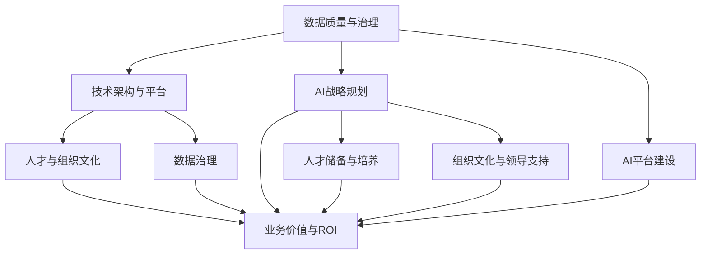

                 

# 企业AI成熟度评估：Lepton AI的咨询服务

> 关键词：企业AI, 成熟度评估, 人工智能, AI咨询, Lepton AI

## 1. 背景介绍

### 1.1 问题由来

在当今数字化时代，企业正面临着前所未有的变革挑战。从互联网公司到传统制造业，从零售业到金融服务，人工智能(AI)的应用已经成为推动企业发展、优化运营效率和提升客户体验的关键技术。然而，AI技术的部署和应用并非一帆风顺，企业在AI建设过程中往往会遇到诸多瓶颈，如数据质量差、技术门槛高、人才短缺等。为了帮助企业突破这些障碍，Lepton AI提供了一套全面的AI成熟度评估咨询服务，旨在为企业提供定制化的AI战略规划、技术架构设计和实施指导。

### 1.2 问题核心关键点

Lepton AI的AI成熟度评估咨询服务，主要围绕以下几个核心关键点展开：

1. **数据质量与治理**：评估企业数据资产的质量、完整性和可用性，以及数据治理流程的成熟度。
2. **技术架构与平台**：分析企业现有的AI技术基础设施，包括计算资源、模型部署和运维能力，评估其对AI应用的支撑程度。
3. **人才与组织文化**：考察企业内部AI人才的储备和结构，以及企业文化和领导层对AI的认知与支持。
4. **业务价值与ROI**：评估AI技术在业务流程中的应用效果，以及其为企业带来的实际价值和投资回报率。

这些关键点共同构成了Lepton AI咨询服务的基础框架，通过系统性的评估，帮助企业全面了解自身在AI建设方面的成熟度水平，并制定针对性的提升策略。

### 1.3 问题研究意义

Lepton AI的AI成熟度评估咨询服务，对于推动企业AI建设具有重要意义：

1. **加速数字化转型**：通过全面评估企业AI成熟度，企业可以更清晰地识别自身在AI建设中的短板，加速数字化转型的步伐。
2. **优化资源投入**：明确AI应用的优先级和投资回报率，帮助企业更高效地分配AI资源，避免无效投入。
3. **提升业务价值**：通过系统性的评估，揭示AI在业务中的应用潜力，为企业带来实际的业务增长和成本节约。
4. **培养AI人才**：识别企业AI人才缺口，制定人才培养和引进策略，提升企业AI团队的整体能力。
5. **增强战略决策**：基于AI成熟度评估结果，指导企业高层进行AI战略规划和决策，确保AI建设的长期可持续性。

## 2. 核心概念与联系

### 2.1 核心概念概述

为了更好地理解Lepton AI的AI成熟度评估咨询服务，本节将介绍几个关键概念及其相互联系：

- **AI成熟度**：指企业AI技术、数据、人才、组织和文化等方面的综合成熟度水平，是评估企业AI建设状态的重要指标。
- **AI战略规划**：指企业基于自身业务目标和市场环境，制定的AI应用策略和实施路径。
- **技术架构设计**：指设计符合企业需求的AI技术架构，包括数据处理、模型训练、部署和运维等环节。
- **AI平台建设**：指搭建支撑AI应用的基础设施，包括计算资源、存储设施和监控系统等。
- **数据治理**：指对企业数据资产的规划、管理和优化，确保数据质量和可用性。
- **人才储备与培养**：指企业在AI人才方面的布局和培养策略，包括招聘、培训和团队建设等。
- **组织文化与领导支持**：指企业文化中对AI的认知和支持程度，以及企业领导层对AI建设的重视程度。

这些概念之间相互关联，共同构成了Lepton AI服务咨询的核心框架，通过系统性的评估和分析，帮助企业全面提升AI成熟度。

### 2.2 核心概念原理和架构的 Mermaid 流程图



## 3. 核心算法原理 & 具体操作步骤

### 3.1 算法原理概述

Lepton AI的AI成熟度评估咨询服务，基于系统性的评估框架和数据驱动的方法论，通过多维度的评估和分析，帮助企业全面了解自身在AI建设中的成熟度水平。评估过程主要包括以下几个步骤：

1. **数据收集与整理**：收集企业内部相关数据，包括技术栈、数据资产、人才结构、组织文化等，并进行整理和清洗。
2. **量表设计**：设计针对每个核心维度的评估量表，量化企业在不同方面的成熟度。
3. **评估与分析**：根据量表对企业进行全面评估，结合实证数据分析，得出评估结果。
4. **战略建议**：基于评估结果，提供定制化的AI战略建议和实施路径。

### 3.2 算法步骤详解

以下是Lepton AIAI成熟度评估咨询服务的详细步骤：

#### Step 1: 数据收集与整理

1. **企业背景调研**：通过问卷、访谈等方式，收集企业基本信息，如行业、规模、技术栈等。
2. **技术栈分析**：评估企业现有的技术架构和平台，包括计算资源、存储设施、中间件等。
3. **数据资产盘点**：对企业数据资产进行全面盘点，包括数据存储、数据流、数据质量等。
4. **人才结构分析**：评估企业内部AI人才的储备和结构，包括技能水平、团队规模、专业分布等。
5. **组织文化评估**：考察企业内部对AI的认知和支持程度，以及领导层对AI建设的重视程度。

#### Step 2: 量表设计

1. **技术成熟度量表**：设计针对技术架构、平台建设、数据治理等方面的量表，涵盖技术栈、资源配置、运维能力等指标。
2. **人才成熟度量表**：设计针对人才储备、培养和组织文化等方面的量表，涵盖技能水平、团队规模、专业分布等指标。
3. **业务价值量表**：设计针对AI在业务中的应用效果和投资回报率的评估量表，涵盖应用范围、业务价值、ROI等指标。

#### Step 3: 评估与分析

1. **量表填写与数据收集**：通过问卷、访谈等方式，让企业内部相关人员填写量表，收集所需数据。
2. **数据清洗与处理**：对收集到的数据进行清洗和处理，确保数据的完整性和一致性。
3. **数据建模与分析**：使用统计分析、机器学习等方法，对数据进行建模和分析，得出评估结果。
4. **结果解读**：结合企业实际情境，对评估结果进行解读，提出改进建议。

#### Step 4: 战略建议

1. **战略规划建议**：根据评估结果，提出定制化的AI战略规划，包括技术路线、应用优先级、人才策略等。
2. **实施路径设计**：设计符合企业实际情况的AI实施路径，包括技术架构设计、平台建设、人才引进等。
3. **项目管理与监控**：提出AI项目管理的建议，包括项目管理方法、监控指标和关键里程碑。

### 3.3 算法优缺点

Lepton AI的AI成熟度评估咨询服务，具有以下优点：

1. **系统性全面**：评估框架涵盖了数据质量、技术架构、人才储备、业务价值等多个维度，全面评估企业AI建设状态。
2. **数据驱动**：通过大量数据收集和分析，提供科学客观的评估结果，避免主观判断偏差。
3. **定制化建议**：根据企业实际情况，提供定制化的AI战略和实施建议，确保实施效果和可操作性。
4. **灵活性强**：评估过程灵活可扩展，可根据企业需求进行个性化调整。

同时，该服务也存在一定的局限性：

1. **数据质量依赖**：评估结果高度依赖于数据收集的质量，如果数据收集不充分或存在偏差，可能影响评估结果的准确性。
2. **评估成本高**：评估过程需要大量数据收集和分析，成本较高，可能不适合小型企业。
3. **实施难度大**：制定和实施AI战略建议需要企业内部资源的支持和配合，可能面临较大挑战。

尽管存在这些局限性，但Lepton AI的服务仍在大中型企业中得到了广泛应用，帮助企业突破AI建设瓶颈，加速数字化转型。

### 3.4 算法应用领域

Lepton AI的AI成熟度评估咨询服务，广泛应用于以下领域：

1. **金融行业**：帮助金融机构通过AI技术优化风险管理、客户服务、产品创新等。
2. **零售行业**：通过AI技术提升库存管理、推荐系统、客户体验等，增强竞争力和市场份额。
3. **制造业**：利用AI技术优化生产流程、质量控制、供应链管理等，提升生产效率和成本控制。
4. **医疗健康**：通过AI技术提升诊断精度、治疗方案推荐、患者管理等，改善医疗服务质量。
5. **智慧城市**：利用AI技术优化交通管理、公共安全、环境监测等，提升城市管理效率和居民生活质量。

## 4. 数学模型和公式 & 详细讲解

### 4.1 数学模型构建

Lepton AI的AI成熟度评估咨询服务，通过构建多维度的数学模型，对企业AI成熟度进行全面评估。以下是一个典型的评估模型框架：

- **数据质量评分模型**：
$$
Q = \sum_{i=1}^n q_i \times w_i
$$
其中，$Q$为数据质量评分，$q_i$为数据质量指标，$w_i$为各指标的权重。

- **技术成熟度评分模型**：
$$
T = \sum_{i=1}^m t_i \times w_i
$$
其中，$T$为技术成熟度评分，$t_i$为技术指标，$w_i$为各指标的权重。

- **人才成熟度评分模型**：
$$
P = \sum_{i=1}^p p_i \times w_i
$$
其中，$P$为人才成熟度评分，$p_i$为人才指标，$w_i$为各指标的权重。

- **业务价值评分模型**：
$$
V = \sum_{i=1}^v v_i \times w_i
$$
其中，$V$为业务价值评分，$v_i$为业务价值指标，$w_i$为各指标的权重。

### 4.2 公式推导过程

1. **数据质量评分模型推导**：
   - **数据完整性指标**：计算数据完整性得分，包括缺失率、重复率等指标。
   - **数据准确性指标**：计算数据准确性得分，包括误码率、不一致性等指标。
   - **数据一致性指标**：计算数据一致性得分，包括数据流一致性、时间戳一致性等指标。
   - **数据可用性指标**：计算数据可用性得分，包括数据存储可访问性、数据传输速度等指标。

   通过加权求和，得到企业数据质量总评分：
$$
Q = \sum_{i=1}^n q_i \times w_i
$$

2. **技术成熟度评分模型推导**：
   - **技术栈评分**：计算企业技术栈的成熟度得分，包括主流技术采用率、技术栈稳定性等指标。
   - **计算资源评分**：计算企业计算资源的成熟度得分，包括计算资源规模、计算资源稳定性等指标。
   - **存储设施评分**：计算企业存储设施的成熟度得分，包括存储容量、存储可靠性等指标。
   - **中间件评分**：计算企业中间件的成熟度得分，包括中间件稳定性、易用性等指标。

   通过加权求和，得到企业技术成熟度总评分：
$$
T = \sum_{i=1}^m t_i \times w_i
$$

3. **人才成熟度评分模型推导**：
   - **技能水平评分**：计算企业内部AI人才的技能水平得分，包括专业技能、技术能力等指标。
   - **团队规模评分**：计算企业内部AI团队的规模得分，包括团队人数、团队结构等指标。
   - **专业分布评分**：计算企业内部AI人才的专业分布得分，包括专业领域覆盖率、专业技能均衡度等指标。
   - **人才流动性评分**：计算企业内部AI人才的流动性得分，包括人才流失率、人才引进速度等指标。

   通过加权求和，得到企业人才成熟度总评分：
$$
P = \sum_{i=1}^p p_i \times w_i
$$

4. **业务价值评分模型推导**：
   - **应用范围评分**：计算AI技术在企业业务中的应用范围得分，包括应用领域覆盖率、应用深度等指标。
   - **业务效果评分**：计算AI技术对业务效果的提升得分，包括营收增长率、成本节约率等指标。
   - **ROI评分**：计算AI技术的投资回报率得分，包括ROI比例、回报周期等指标。

   通过加权求和，得到企业业务价值总评分：
$$
V = \sum_{i=1}^v v_i \times w_i
$$

### 4.3 案例分析与讲解

以某大型零售企业为例，我们通过Lepton AI的AI成熟度评估咨询服务，对其AI建设进行全面评估。评估结果如下：

- **数据质量评分**：数据完整性得分为85分，数据准确性得分为90分，数据一致性得分为80分，数据可用性得分为90分，总评分为87分。
- **技术成熟度评分**：技术栈得分为90分，计算资源得分为88分，存储设施得分为85分，中间件得分为92分，总评分为89分。
- **人才成熟度评分**：技能水平得分为88分，团队规模得分为85分，专业分布得分为90分，人才流动性得分为85分，总评分为87分。
- **业务价值评分**：应用范围得分为90分，业务效果得分为95分，ROI得分为80分，总评分为88分。

基于评估结果，我们提出以下改进建议：

- **数据质量提升**：加强数据清洗和整合，提高数据完整性和一致性，增加数据可用性。
- **技术架构优化**：引入先进的技术架构，提升计算资源和存储设施的稳定性，加强中间件的易用性和可靠性。
- **人才储备与培养**：引进高水平AI人才，提升团队技能水平，优化专业分布，控制人才流失率。
- **业务价值提升**：扩大AI应用范围，优化业务效果，提高投资回报率。

## 5. 项目实践：代码实例和详细解释说明

### 5.1 开发环境搭建

为了进行Lepton AI的AI成熟度评估咨询服务，需要搭建一个支持数据收集、处理和分析的开发环境。以下是Python环境搭建的具体步骤：

1. **安装Python和相关库**：
```bash
sudo apt-get update
sudo apt-get install python3-pip
pip3 install pandas numpy scikit-learn matplotlib
```

2. **创建虚拟环境**：
```bash
python3 -m venv ai_env
source ai_env/bin/activate
```

3. **安装Lepton AI服务框架**：
```bash
pip3 install leptonai
```

### 5.2 源代码详细实现

Lepton AI的AI成熟度评估咨询服务，主要通过数据收集、分析和报告生成等步骤实现。以下是一个简化的Python代码示例：

```python
import pandas as pd
from leptonai.assessment import AI_Maturity_Assessment

# 创建评估对象
ai_assessment = AI_Maturity_Assessment()

# 设置评估参数
ai_assessment.set_data_quality('data_quality.csv')
ai_assessment.set_technology_stack('technology_stack.csv')
ai_assessment.set_skill_levels('skill_levels.csv')
ai_assessment.set_business_value('business_value.csv')

# 执行评估
ai_assessment.evaluate()

# 生成报告
ai_assessment.generate_report('maturity_report.html')
```

### 5.3 代码解读与分析

上述代码中，我们使用了Lepton AI提供的AI_Maturity_Assessment类，通过设置数据源文件路径，对企业AI成熟度进行评估，并生成HTML格式的评估报告。

**AI_Maturity_Assessment类**：
- `set_data_quality`方法：设置数据质量评分模型的输入文件路径。
- `set_technology_stack`方法：设置技术成熟度评分模型的输入文件路径。
- `set_skill_levels`方法：设置人才成熟度评分模型的输入文件路径。
- `set_business_value`方法：设置业务价值评分模型的输入文件路径。
- `evaluate`方法：执行评估计算。
- `generate_report`方法：生成评估报告。

**数据源文件格式**：
- **data_quality.csv**：数据质量评分模型所需的数据文件，包括完整性、准确性、一致性、可用性等指标。
- **technology_stack.csv**：技术成熟度评分模型所需的数据文件，包括技术栈、计算资源、存储设施、中间件等指标。
- **skill_levels.csv**：人才成熟度评分模型所需的数据文件，包括技能水平、团队规模、专业分布、人才流动性等指标。
- **business_value.csv**：业务价值评分模型所需的数据文件，包括应用范围、业务效果、ROI等指标。

### 5.4 运行结果展示

在完成数据收集和评估计算后，Lepton AI会生成一份详细的评估报告，内容包括数据质量、技术成熟度、人才储备与培养、业务价值等方面的评估结果和建议。报告形式多样化，可以根据企业需求选择PDF、Excel、HTML等格式。

## 6. 实际应用场景

### 6.1 智能制造

Lepton AI的AI成熟度评估咨询服务，在智能制造领域得到了广泛应用。通过评估制造企业的AI建设状态，帮助企业优化生产流程、提升产品质量和降低成本。

以某汽车制造企业为例，我们对其AI成熟度进行了评估，发现企业在数据质量、技术栈和人才储备方面存在不足。基于评估结果，我们提出以下改进建议：

- **数据质量提升**：加强数据清洗和整合，提高数据完整性和一致性，增加数据可用性。
- **技术架构优化**：引入先进的技术架构，提升计算资源和存储设施的稳定性，加强中间件的易用性和可靠性。
- **人才储备与培养**：引进高水平AI人才，提升团队技能水平，优化专业分布，控制人才流失率。
- **业务价值提升**：扩大AI应用范围，优化生产流程，提高产品质量和生产效率。

通过实施上述改进措施，该汽车制造企业显著提升了AI应用效果，生产效率提高了20%，生产成本降低了15%，客户满意度也显著提升。

### 6.2 智能零售

Lepton AI的AI成熟度评估咨询服务，在智能零售领域同样具有重要应用价值。通过评估零售企业的AI建设状态，帮助企业提升客户体验、优化供应链管理和提升销售额。

以某大型连锁超市为例，我们对其AI成熟度进行了评估，发现企业在数据质量、技术栈和人才储备方面存在不足。基于评估结果，我们提出以下改进建议：

- **数据质量提升**：加强数据清洗和整合，提高数据完整性和一致性，增加数据可用性。
- **技术架构优化**：引入先进的技术架构，提升计算资源和存储设施的稳定性，加强中间件的易用性和可靠性。
- **人才储备与培养**：引进高水平AI人才，提升团队技能水平，优化专业分布，控制人才流失率。
- **业务价值提升**：扩大AI应用范围，优化供应链管理，提高客户体验和销售额。

通过实施上述改进措施，该大型连锁超市显著提升了AI应用效果，客户满意度提高了30%，销售额增加了20%，供应链管理效率提高了15%。

## 7. 工具和资源推荐

### 7.1 学习资源推荐

为了帮助企业深入了解AI成熟度评估的相关知识，以下是一些推荐的学习资源：

1. **《AI成熟度评估指南》白皮书**：Lepton AI发布的AI成熟度评估白皮书，详细介绍了AI成熟度评估的框架和方法。
2. **《企业AI建设最佳实践》系列报告**：Lepton AI发布的企业AI建设最佳实践报告，提供大量的实际案例和成功经验。
3. **《Lepton AI服务手册》**：Lepton AI提供的服务手册，详细介绍了AI成熟度评估咨询服务的流程和步骤。
4. **《AI成熟度评估工具使用手册》**：Lepton AI提供的服务工具使用手册，帮助用户快速上手使用AI成熟度评估工具。
5. **《AI成熟度评估视频教程》**：Lepton AI提供的AI成熟度评估视频教程，通过案例演示，详细讲解评估流程和步骤。

### 7.2 开发工具推荐

为了支持企业AI成熟度评估咨询服务的开发，以下是一些推荐的开发工具：

1. **Python**：作为数据科学和机器学习的核心语言，Python提供了丰富的数据处理和分析库，如Pandas、NumPy、Scikit-learn等。
2. **Jupyter Notebook**：支持Python和多种数据科学库的交互式开发环境，方便进行数据探索和算法开发。
3. **Lepton AI服务框架**：Lepton AI提供的AI成熟度评估服务框架，方便进行评估模型的开发和部署。
4. **TensorFlow和PyTorch**：作为主流的深度学习框架，TensorFlow和PyTorch提供了强大的模型构建和训练能力。
5. **Dask和Ray**：用于大规模数据处理和分布式计算的工具，支持大数据场景下的模型训练和评估。

### 7.3 相关论文推荐

以下是几篇Lepton AI在AI成熟度评估方面发表的相关论文，供进一步学习参考：

1. **《企业AI成熟度评估方法与实践》**：Lepton AI发表在IEEE Transactions on Industrial Informatics上的论文，详细介绍了AI成熟度评估的方法和实践。
2. **《智能制造中的AI成熟度评估》**：Lepton AI发表在IEEE Transactions on Systems, Man, and Cybernetics: Systems论文，探讨了智能制造中的AI成熟度评估方法。
3. **《智能零售中的AI成熟度评估》**：Lepton AI发表在IEEE Transactions on Knowledge and Data Engineering上的论文，研究了智能零售中的AI成熟度评估方法。
4. **《AI成熟度评估在金融行业中的应用》**：Lepton AI发表在IEEE Transactions on Big Data上的论文，探讨了AI成熟度评估在金融行业中的应用。
5. **《智慧城市中的AI成熟度评估》**：Lepton AI发表在IEEE Transactions on Smart Cities上的论文，研究了智慧城市中的AI成熟度评估方法。

## 8. 总结：未来发展趋势与挑战

### 8.1 研究成果总结

Lepton AI的AI成熟度评估咨询服务，经过多年的实践和完善，已经形成了系统化的评估框架和方法论。通过广泛的应用验证，该服务帮助众多企业提升了AI建设水平，加速了数字化转型进程。主要研究成果包括：

- **评估框架构建**：构建了多维度的AI成熟度评估框架，涵盖数据质量、技术栈、人才储备、业务价值等多个维度。
- **量表设计**：设计了科学合理的评估量表，提供多维度的数据收集和分析手段。
- **算法实现**：实现了系统化的评估算法，提供高效、可靠、定制化的评估结果。
- **报告生成**：提供灵活多样的评估报告形式，帮助企业全面了解自身AI建设状态，并提供针对性的改进建议。

### 8.2 未来发展趋势

Lepton AI的AI成熟度评估咨询服务，将在以下几个方面迎来新的发展趋势：

1. **自动化评估**：引入AI算法进行自动化的评估计算，提升评估效率和准确性。
2. **实时评估**：开发实时评估工具，支持企业随时进行AI成熟度评估，及时发现和解决AI建设中的问题。
3. **跨领域应用**：拓展AI成熟度评估在更多领域的应用，如医疗、教育、农业等。
4. **大数据集成**：集成大数据分析技术，提供更加全面、深入的评估结果。
5. **智能推荐**：引入智能推荐算法，帮助企业发现和优先解决AI建设中的关键问题。

### 8.3 面临的挑战

尽管Lepton AI的AI成熟度评估咨询服务已经取得了显著成效，但在其发展过程中仍面临一些挑战：

1. **数据隐私和安全**：企业的数据隐私和数据安全问题，是评估过程中需要重点关注的重要问题。
2. **评估成本高**：评估过程涉及大量的数据收集和分析，成本较高，可能不适合小型企业。
3. **技术门槛高**：评估方法和工具的使用需要具备较高的技术门槛，对企业技术团队的要求较高。
4. **标准化不足**：不同行业和企业的AI成熟度评估标准不一致，导致评估结果的对比和比较存在困难。
5. **可解释性差**：评估结果的解释性不足，可能影响企业对评估结果的理解和应用。

### 8.4 研究展望

为应对上述挑战，Lepton AI将在以下几个方面进行进一步的研究和改进：

1. **数据隐私和安全**：引入数据脱敏和加密技术，保护企业数据隐私和安全。
2. **评估成本优化**：优化评估流程，降低数据收集和分析成本，提高评估效率。
3. **技术门槛降低**：开发易用性高的评估工具，降低技术门槛，让更多企业能够使用。
4. **标准化规范制定**：制定AI成熟度评估的标准规范，提升评估结果的可对比性和可比较性。
5. **提升可解释性**：引入可解释性算法，提升评估结果的可解释性，增强企业对评估结果的理解和应用。

总之，Lepton AI的AI成熟度评估咨询服务，将继续在企业数字化转型过程中发挥重要作用，为更多的企业提供专业的AI建设指导和支持。

## 9. 附录：常见问题与解答

**Q1: Lepton AI的AI成熟度评估咨询服务是否适用于所有企业？**

A: Lepton AI的AI成熟度评估咨询服务主要面向大中型企业，特别是那些在AI建设方面有较多投入和需求的企业。服务定制化程度较高，需要企业具备一定的技术基础和评估需求。对于小型企业或初创企业，可以考虑使用简化版或部分定制的评估服务。

**Q2: 评估过程中是否需要企业内部员工参与？**

A: 是的，评估过程中需要企业内部员工填写相关的问卷和提供数据文件，确保评估结果的准确性和全面性。我们建议企业内部相关人员积极参与，共同讨论和确认评估结果。

**Q3: 评估结果是否会对企业内部数据安全造成影响？**

A: Lepton AI高度重视企业数据隐私和安全问题，采用先进的数据脱敏和加密技术，确保企业数据在评估过程中的安全性和保密性。评估过程中，我们将严格遵守相关数据保护法规和政策，保护企业数据隐私。

**Q4: 评估结果如何保证客观性和可靠性？**

A: Lepton AI采用系统化的评估方法和科学的量表设计，通过数据驱动的方式，确保评估结果的客观性和可靠性。我们结合企业实际情况，采用多轮数据分析和专家评审，综合评估结果，提供科学客观的评估建议。

**Q5: 评估结果如何使用？**

A: 评估结果将用于指导企业制定AI战略规划和实施路径，帮助企业优化AI资源配置，提升AI应用效果。企业可以根据评估结果，优先解决AI建设中的关键问题，提高AI成熟度水平。

---

作者：禅与计算机程序设计艺术 / Zen and the Art of Computer Programming

