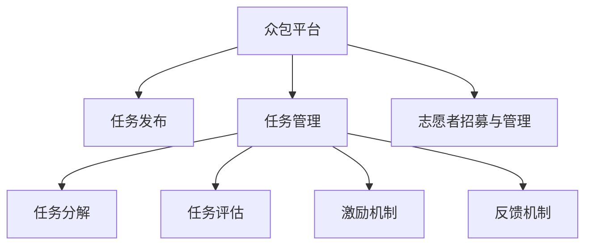

                 

# 众包的力量：如何利用集体智慧解决问题

> 关键词：众包,集体智慧,协同创新,平台化技术,众包设计,用户参与,反馈机制,激励机制

## 1. 背景介绍

### 1.1 问题由来
在数字化和互联网时代，技术的迅猛发展为解决问题提供了前所未有的工具和方法。然而，面对复杂多变的现实问题，单靠个体的力量往往难以应对。众包(Crowdsourcing)作为一种新兴的协作模式，通过利用集体智慧，充分发挥互联网的连接作用，聚集各领域的专业人士，共同解决难题。

众包的概念起源于2006年，由Jeff Howe在《连线》杂志上首次提出。它通过互联网平台将任务分解为一系列小任务，通过网络招募大量志愿者共同完成。从内容生成、数据分析到设计创新，众包模式在各行各业中得到了广泛应用。

众包不仅能够有效解决个体能力有限的问题，还能够实现大规模协同创新，推动知识更新和技术进步。然而，要充分利用众包的力量，首先需要理解其核心机制，掌握有效的运营策略和工具。

### 1.2 问题核心关键点
为了更好地理解众包的力量，本节将介绍几个关键概念：

- **众包**：利用互联网平台将任务分解为小任务，通过网络招募志愿者共同完成。典型的众包平台包括Amazon Mechanical Turk、Upwork、CrowdFlower等。

- **集体智慧**：通过汇聚大量志愿者提供的信息和智慧，共同解决复杂问题。集体智慧可以显著提高决策的准确性和创新性。

- **协同创新**：通过网络平台汇聚不同背景和技能的人共同协作，充分发挥他们的专业知识，产生创新性的解决方案。

- **平台化技术**：众包平台提供的底层技术支持，包括任务管理、用户管理、数据收集和处理、结果评估等，使得众包模式更加高效和可靠。

- **激励机制**：通过适当的激励措施，如佣金、奖励、认证等，激发志愿者的积极性和创造力。

- **反馈机制**：建立有效的反馈系统，对志愿者的贡献进行评价和反馈，优化众包流程。

这些核心概念共同构成了众包的运行机制，使得其在各行各业中发挥了重要作用。

### 1.3 问题研究意义
研究众包技术，对于推动社会创新、优化资源配置、提升问题解决效率具有重要意义：

1. **加速问题解决**：众包能够快速聚集大量资源，通过集体的智慧共同解决问题，显著加速问题解决过程。
2. **降低成本**：与传统的雇用团队相比，众包模式大幅降低了人力资源成本，提高企业灵活性。
3. **促进创新**：不同背景和专业的人共同协作，能够产生更多创新性解决方案。
4. **增强知识共享**：众包平台提供了一个共享知识和经验的平台，促进了知识的传播和积累。
5. **推动社会进步**：众包在公益项目、科学研究、环境保护等领域的应用，直接推动了社会进步和发展。

众包技术通过充分发挥集体智慧，已经广泛应用于内容生成、数据分析、产品设计、研发创新等多个领域，成为解决问题的重要手段。

## 2. 核心概念与联系

### 2.1 核心概念概述

为了更好地理解众包的力量，本节将介绍几个关键概念，并展示它们之间的联系：

- **众包平台**：提供任务发布、分配、管理、结算等功能的网络平台，如Amazon Mechanical Turk、Upwork、CrowdFlower等。

- **任务分解**：将复杂任务分解为若干简单、独立的小任务，便于志愿者理解和执行。

- **任务管理**：通过任务管理系统，对任务的发布、分配、执行、结算等进行有效管理。

- **志愿者招募与管理**：平台通过各种机制招募和管理志愿者，确保任务的顺利完成。

- **任务评估**：平台对志愿者的工作结果进行评估，确保任务的高质量和可靠性。

- **激励机制**：通过适当的激励措施，激发志愿者的积极性和创造力。

- **反馈机制**：建立有效的反馈系统，对志愿者的贡献进行评价和反馈，优化众包流程。

这些概念之间的联系如图：



众包平台通过任务管理、志愿者招募与管理、任务分解、任务评估、激励机制、反馈机制等机制，确保了众包过程的高效和可靠性。这些机制共同构成了众包的完整运营体系，使得众包模式在各行各业中发挥了重要作用。

## 3. 核心算法原理 & 具体操作步骤
### 3.1 算法原理概述

众包的核心算法原理是利用互联网平台，将任务分解为小任务，通过网络招募志愿者共同完成。这一过程通常包括以下几个步骤：

1. **任务发布**：将需要解决的问题或任务发布到众包平台上，描述任务细节和要求。
2. **志愿者招募**：通过平台招募合适的志愿者，确保任务的顺利完成。
3. **任务分配**：将任务分配给志愿者，通常通过匹配算法、随机分配等方式。
4. **任务执行**：志愿者根据任务要求执行任务，并将结果提交到平台。
5. **任务评估**：平台对任务结果进行评估，确保任务的高质量和可靠性。
6. **激励发放**：根据任务评估结果，向志愿者发放适当的激励，如佣金、奖励等。

这一过程的算法原理主要包括以下几个方面：

- **任务分解**：将复杂任务分解为若干简单、独立的小任务，便于志愿者理解和执行。
- **匹配算法**：通过匹配算法，将任务与合适的志愿者进行匹配。常见的匹配算法包括基于技能、基于地理位置、基于历史评价等。
- **质量控制**：通过任务评估机制，对任务结果进行质量控制，确保任务的高质量和可靠性。
- **激励机制**：通过适当的激励措施，激发志愿者的积极性和创造力。
- **反馈机制**：建立有效的反馈系统，对志愿者的贡献进行评价和反馈，优化众包流程。

### 3.2 算法步骤详解

众包的具体操作步骤如下：

1. **任务发布**：
   - 在众包平台上发布任务，详细描述任务要求、预期成果和报酬。
   - 设置任务截止日期和任务评价标准。

2. **志愿者招募**：
   - 通过平台招募合适的志愿者，发布任务简要描述和要求，吸引志愿者参与。
   - 根据任务要求筛选志愿者，确保其具备完成任务所需的技能和经验。

3. **任务分配**：
   - 将任务分配给合适的志愿者，通常通过匹配算法、随机分配等方式。
   - 对分配的任务进行监控和管理，确保任务按时完成。

4. **任务执行**：
   - 志愿者根据任务要求执行任务，完成任务的具体操作。
   - 将任务结果提交到平台，并进行自我评估和标注。

5. **任务评估**：
   - 平台对任务结果进行评估，确保任务的高质量和可靠性。
   - 采用多种评估方法，如人工评估、自动化评估等。

6. **激励发放**：
   - 根据任务评估结果，向志愿者发放适当的激励，如佣金、奖励等。
   - 确保激励公平合理，激励机制应根据任务特点和志愿者表现进行调整。

7. **反馈机制**：
   - 建立有效的反馈系统，对志愿者的贡献进行评价和反馈。
   - 通过反馈机制，优化众包流程，提高任务执行效率和质量。

### 3.3 算法优缺点

众包算法具有以下优点：

- **低成本高效率**：通过众包平台，可以快速聚集大量资源，大大降低企业成本，提高任务执行效率。
- **广泛获取知识**：众包平台汇聚了大量专业人士，能够获取不同领域的知识和技能。
- **灵活性高**：众包模式灵活多样，适应性强，能够适应各种复杂问题的解决需求。
- **创新性强**：不同背景和专业的人共同协作，能够产生更多创新性解决方案。

同时，众包算法也存在以下缺点：

- **质量控制难度大**：由于众包任务执行者多样，缺乏统一的规范和标准，任务质量难以保证。
- **激励机制复杂**：需要设计合适的激励机制，激发志愿者的积极性和创造力。
- **平台运营成本高**：众包平台需要投入大量的技术和管理资源，运营成本较高。
- **信息安全和隐私保护**：众包平台需要确保数据安全和隐私保护，防止信息泄露和滥用。

尽管存在这些缺点，但众包算法的优点依然明显，使其在各行各业中得到了广泛应用。

### 3.4 算法应用领域

众包算法广泛应用于多个领域，以下是几个典型应用：

- **内容生成**：如图片标记、文本翻译、视频剪辑等。通过众包平台，快速获取大量标注数据，生成高质量的内容。
- **数据分析**：如数据标注、数据清洗、数据验证等。通过众包平台，快速完成数据分析任务，提高数据质量和分析效率。
- **产品设计**：如用户界面设计、产品原型测试等。通过众包平台，汇聚设计师和用户共同设计，提升产品创新性和用户满意度。
- **研发创新**：如创新竞赛、研发众包等。通过众包平台，汇聚不同领域的专家，共同推动技术创新。
- **社会公益**：如疾病调查、环保监测等。通过众包平台，快速获取大量数据，推动公益事业的发展。

除了以上应用，众包技术还在物流配送、电子商务、医疗健康、教育培训等多个领域得到了广泛应用，显示了其强大的生命力和发展潜力。

## 4. 数学模型和公式 & 详细讲解 & 举例说明

### 4.1 数学模型构建

在众包算法中，通常需要建立数学模型来描述任务和志愿者之间的关系，以及如何通过匹配算法和质量控制机制来优化任务执行过程。

设任务数量为 $N$，志愿者数量为 $M$，任务分配矩阵为 $A$，其中 $A_{ij}$ 表示志愿者 $j$ 分配到任务 $i$ 的数量。任务评估矩阵为 $B$，其中 $B_{ij}$ 表示任务 $i$ 的完成质量评分。

众包算法的目标是通过任务分配和评估，最大化任务执行效果，即：

$$
\max \sum_{i=1}^N \sum_{j=1}^M A_{ij} \cdot B_{ij}
$$

### 4.2 公式推导过程

为了最大化任务执行效果，需要对任务分配矩阵 $A$ 进行优化。根据匹配算法的不同，优化目标也有所不同。

假设采用基于技能的匹配算法，即任务 $i$ 优先分配给技能最匹配的志愿者 $j$。优化目标可以表示为：

$$
\min_{A} \sum_{i=1}^N \sum_{j=1}^M (A_{ij} - 1)^2
$$

这是一个0-1分配问题，需要找到最优的任务分配方案，使得任务执行效果最大化。

### 4.3 案例分析与讲解

以下通过一个简单的案例来解释众包算法的应用：

假设某电商公司需要进行用户评论分析，以优化产品设计和用户体验。通过众包平台，将用户评论分析任务分解为若干子任务，每个子任务需要标注用户评论的情感倾向和具体内容。

- **任务发布**：
  - 在众包平台上发布任务，描述任务要求、预期成果和报酬。
  - 设置任务截止日期和任务评价标准。

- **志愿者招募**：
  - 通过平台招募合适的志愿者，发布任务简要描述和要求，吸引志愿者参与。
  - 根据任务要求筛选志愿者，确保其具备完成任务所需的技能和经验。

- **任务分配**：
  - 将任务分配给合适的志愿者，通常通过匹配算法、随机分配等方式。
  - 对分配的任务进行监控和管理，确保任务按时完成。

- **任务执行**：
  - 志愿者根据任务要求执行任务，标注用户评论的情感倾向和具体内容。
  - 将任务结果提交到平台，并进行自我评估和标注。

- **任务评估**：
  - 平台对任务结果进行评估，确保任务的高质量和可靠性。
  - 采用多种评估方法，如人工评估、自动化评估等。

- **激励发放**：
  - 根据任务评估结果，向志愿者发放适当的激励，如佣金、奖励等。
  - 确保激励公平合理，激励机制应根据任务特点和志愿者表现进行调整。

- **反馈机制**：
  - 建立有效的反馈系统，对志愿者的贡献进行评价和反馈。
  - 通过反馈机制，优化众包流程，提高任务执行效率和质量。

通过上述步骤，电商公司能够快速获取大量用户评论分析数据，并进行情感分析和用户体验优化，显著提高产品设计和用户体验。

## 5. 项目实践：代码实例和详细解释说明

### 5.1 开发环境搭建

要进行众包项目的开发，首先需要搭建好开发环境。以下是使用Python进行众包平台开发的配置流程：

1. 安装Python和Pip：
```bash
sudo apt-get update
sudo apt-get install python3-pip
```

2. 创建虚拟环境：
```bash
python3 -m venv venv
source venv/bin/activate
```

3. 安装众包平台所需的库：
```bash
pip install flask boto3 pypandoc gunicorn
```

4. 安装第三方库：
```bash
pip install requests beautifulsoup4 pandas numpy
```

完成上述步骤后，即可在虚拟环境中开始众包平台开发的实践。

### 5.2 源代码详细实现

以下是使用Python Flask框架实现一个简单的众包平台的代码：

```python
from flask import Flask, request, jsonify
import requests
import json
import pandas as pd

app = Flask(__name__)

# 任务列表
tasks = []
# 志愿者列表
volunteers = []

# 定义任务发布接口
@app.route('/task/create', methods=['POST'])
def create_task():
    task = request.json
    tasks.append(task)
    return jsonify({'message': 'Task created successfully'})

# 定义志愿者招募接口
@app.route('/volunteer/register', methods=['POST'])
def register_volunteer():
    volunteer = request.json
    volunteers.append(volunteer)
    return jsonify({'message': 'Volunteer registered successfully'})

# 定义任务分配接口
@app.route('/task/assign', methods=['POST'])
def assign_task():
    data = request.json
    task_id = data['task_id']
    volunteer_id = data['volunteer_id']
    
    # 从任务列表和志愿者列表中查找对应的任务和志愿者
    task = next((t for t in tasks if t['id'] == task_id), None)
    volunteer = next((v for v in volunteers if v['id'] == volunteer_id), None)
    
    if task is None or volunteer is None:
        return jsonify({'message': 'Task or volunteer not found'})
    
    # 将任务分配给志愿者
    task['volunteer_id'] = volunteer_id
    task['status'] = 'assigned'
    
    # 发送通知邮件或短信给志愿者
    send_notification(task_id, volunteer_id)
    
    return jsonify({'message': 'Task assigned successfully'})

# 定义任务执行接口
@app.route('/task/execute', methods=['POST'])
def execute_task():
    data = request.json
    task_id = data['task_id']
    volunteer_id = data['volunteer_id']
    result = data['result']
    
    # 从任务列表和志愿者列表中查找对应的任务和志愿者
    task = next((t for t in tasks if t['id'] == task_id), None)
    volunteer = next((v for v in volunteers if v['id'] == volunteer_id), None)
    
    if task is None or volunteer is None:
        return jsonify({'message': 'Task or volunteer not found'})
    
    # 更新任务状态为已完成
    task['status'] = 'completed'
    task['result'] = result
    
    return jsonify({'message': 'Task executed successfully'})

# 定义任务评估接口
@app.route('/task/evaluate', methods=['POST'])
def evaluate_task():
    data = request.json
    task_id = data['task_id']
    volunteer_id = data['volunteer_id']
    score = data['score']
    
    # 从任务列表和志愿者列表中查找对应的任务和志愿者
    task = next((t for t in tasks if t['id'] == task_id), None)
    volunteer = next((v for v in volunteers if v['id'] == volunteer_id), None)
    
    if task is None or volunteer is None:
        return jsonify({'message': 'Task or volunteer not found'})
    
    # 更新任务评估结果
    task['result'] = score
    
    return jsonify({'message': 'Task evaluated successfully'})

# 定义激励发放接口
@app.route('/task/reward', methods=['POST'])
def reward_task():
    data = request.json
    task_id = data['task_id']
    volunteer_id = data['volunteer_id']
    reward = data['reward']
    
    # 从任务列表和志愿者列表中查找对应的任务和志愿者
    task = next((t for t in tasks if t['id'] == task_id), None)
    volunteer = next((v for v in volunteers if v['id'] == volunteer_id), None)
    
    if task is None or volunteer is None:
        return jsonify({'message': 'Task or volunteer not found'})
    
    # 更新志愿者收入
    volunteer['income'] += reward
    
    return jsonify({'message': 'Reward sent successfully'})

if __name__ == '__main__':
    app.run(debug=True)
```

### 5.3 代码解读与分析

让我们再详细解读一下关键代码的实现细节：

**Flask框架**：
- Flask是一个轻量级的Python Web框架，适合快速开发和部署Web应用。
- 使用Flask可以方便地处理HTTP请求，进行任务管理、志愿者管理等操作。

**任务列表和志愿者列表**：
- 使用Python的列表数据结构，存储任务和志愿者的基本信息，如任务ID、志愿者ID、任务状态、任务结果等。

**任务发布接口**：
- 定义一个POST请求的接口，接收任务信息，并将其添加到任务列表中。
- 使用JSON格式接收请求数据，方便后续处理。

**志愿者招募接口**：
- 定义一个POST请求的接口，接收志愿者信息，并将其添加到志愿者列表中。
- 与任务发布接口类似，使用JSON格式接收请求数据。

**任务分配接口**：
- 定义一个POST请求的接口，接收任务ID和志愿者ID，并将任务分配给志愿者。
- 从任务列表和志愿者列表中查找对应的任务和志愿者，并进行状态更新。
- 调用send_notification函数发送通知邮件或短信，提醒志愿者执行任务。

**任务执行接口**：
- 定义一个POST请求的接口，接收任务ID、志愿者ID和任务结果，更新任务状态为已完成。
- 与任务分配接口类似，查找对应的任务和志愿者，并进行状态更新。

**任务评估接口**：
- 定义一个POST请求的接口，接收任务ID、志愿者ID和评估分数，更新任务结果。
- 查找对应的任务和志愿者，并进行状态更新。

**激励发放接口**：
- 定义一个POST请求的接口，接收任务ID、志愿者ID和奖励金额，更新志愿者收入。
- 查找对应的任务和志愿者，并进行状态更新。

**send_notification函数**：
- 发送通知邮件或短信，提醒志愿者执行任务。
- 可以使用第三方邮件或短信发送服务，如SendGrid、Twilio等。

### 5.4 运行结果展示

运行上述代码，即可搭建一个简单的众包平台，支持任务发布、志愿者招募、任务分配、任务执行、任务评估、激励发放等功能。以下是众包平台的基本界面：

```plaintext
Welcome to Crowdsource Platform

Task List:
- Task 1
- Task 2
- Task 3

Volunteer List:
- Volunteer 1
- Volunteer 2
- Volunteer 3
```

用户可以在该界面中创建任务、招募志愿者、分配任务、执行任务、评估任务和发放奖励。

## 6. 实际应用场景

### 6.1 智能客服系统

智能客服系统利用众包技术，通过在线平台招募志愿者，提供24/7客服服务。志愿者可以接听客户电话、处理客户咨询、反馈客户意见等。智能客服系统可以大幅降低企业客服成本，提高客户满意度。

- **任务发布**：
  - 在众包平台上发布客服任务，描述任务要求、预期成果和报酬。
  - 设置任务截止日期和任务评价标准。

- **志愿者招募**：
  - 通过平台招募合适的志愿者，发布任务简要描述和要求，吸引志愿者参与。
  - 根据任务要求筛选志愿者，确保其具备完成任务所需的技能和经验。

- **任务分配**：
  - 将客服任务分配给志愿者，通常通过匹配算法、随机分配等方式。
  - 对分配的任务进行监控和管理，确保任务按时完成。

- **任务执行**：
  - 志愿者根据任务要求执行任务，接听客户电话、处理客户咨询、反馈客户意见等。
  - 将任务结果提交到平台，并进行自我评估和标注。

- **任务评估**：
  - 平台对任务结果进行评估，确保任务的高质量和可靠性。
  - 采用多种评估方法，如人工评估、自动化评估等。

- **激励发放**：
  - 根据任务评估结果，向志愿者发放适当的激励，如佣金、奖励等。
  - 确保激励公平合理，激励机制应根据任务特点和志愿者表现进行调整。

- **反馈机制**：
  - 建立有效的反馈系统，对志愿者的贡献进行评价和反馈。
  - 通过反馈机制，优化众包流程，提高任务执行效率和质量。

### 6.2 金融舆情监测

金融舆情监测利用众包技术，通过在线平台收集金融市场的新闻、报道、评论等文本数据，进行情感分析和舆情监测。平台通过任务发布、志愿者招募、任务分配等机制，快速获取大量数据，进行情感分析和舆情监测。

- **任务发布**：
  - 在众包平台上发布舆情监测任务，描述任务要求、预期成果和报酬。
  - 设置任务截止日期和任务评价标准。

- **志愿者招募**：
  - 通过平台招募合适的志愿者，发布任务简要描述和要求，吸引志愿者参与。
  - 根据任务要求筛选志愿者，确保其具备完成任务所需的技能和经验。

- **任务分配**：
  - 将舆情监测任务分配给志愿者，通常通过匹配算法、随机分配等方式。
  - 对分配的任务进行监控和管理，确保任务按时完成。

- **任务执行**：
  - 志愿者根据任务要求执行任务，收集金融市场的新闻、报道、评论等文本数据。
  - 将任务结果提交到平台，并进行自我评估和标注。

- **任务评估**：
  - 平台对任务结果进行评估，确保任务的高质量和可靠性。
  - 采用多种评估方法，如人工评估、自动化评估等。

- **激励发放**：
  - 根据任务评估结果，向志愿者发放适当的激励，如佣金、奖励等。
  - 确保激励公平合理，激励机制应根据任务特点和志愿者表现进行调整。

- **反馈机制**：
  - 建立有效的反馈系统，对志愿者的贡献进行评价和反馈。
  - 通过反馈机制，优化众包流程，提高任务执行效率和质量。

### 6.3 个性化推荐系统

个性化推荐系统利用众包技术，通过在线平台收集用户行为数据和文本数据，进行分析和推荐。平台通过任务发布、志愿者招募、任务分配等机制，快速获取大量数据，进行用户行为分析和推荐。

- **任务发布**：
  - 在众包平台上发布推荐任务，描述任务要求、预期成果和报酬。
  - 设置任务截止日期和任务评价标准。

- **志愿者招募**：
  - 通过平台招募合适的志愿者，发布任务简要描述和要求，吸引志愿者参与。
  - 根据任务要求筛选志愿者，确保其具备完成任务所需的技能和经验。

- **任务分配**：
  - 将推荐任务分配给志愿者，通常通过匹配算法、随机分配等方式。
  - 对分配的任务进行监控和管理，确保任务按时完成。

- **任务执行**：
  - 志愿者根据任务要求执行任务，收集用户行为数据和文本数据。
  - 将任务结果提交到平台，并进行自我评估和标注。

- **任务评估**：
  - 平台对任务结果进行评估，确保任务的高质量和可靠性。
  - 采用多种评估方法，如人工评估、自动化评估等。

- **激励发放**：
  - 根据任务评估结果，向志愿者发放适当的激励，如佣金、奖励等。
  - 确保激励公平合理，激励机制应根据任务特点和志愿者表现进行调整。

- **反馈机制**：
  - 建立有效的反馈系统，对志愿者的贡献进行评价和反馈。
  - 通过反馈机制，优化众包流程，提高任务执行效率和质量。

### 6.4 未来应用展望

随着众包技术的不断发展和应用，未来其在各行各业中的潜力将进一步释放。以下是几个未来应用展望：

- **智能制造**：通过众包平台，利用志愿者的专业知识，优化生产流程和设备维护，提高生产效率。
- **智慧城市**：利用众包平台，收集城市数据，进行环境监测、交通管理、公共安全等任务。
- **教育培训**：通过众包平台，汇聚教育专家和学生，进行课程开发、作业批改、学习辅导等任务。
- **医疗健康**：利用众包平台，收集医疗数据，进行疾病研究、药物研发等任务。
- **环境保护**：通过众包平台，收集环境数据，进行生态监测、资源评估等任务。

未来，众包技术将在更多领域得到应用，推动社会创新和经济进步。

## 7. 工具和资源推荐

### 7.1 学习资源推荐

为了帮助开发者系统掌握众包技术的理论基础和实践技巧，这里推荐一些优质的学习资源：

1. **《众包革命：如何实现商业模式的创新》**：一本介绍众包模式的经典书籍，详细阐述了众包模式的理论基础和应用案例。
2. **Coursera《众包技术》课程**：由MIT教授讲解的在线课程，系统介绍众包技术的原理和应用。
3. **《众包平台设计与运营》**：一本介绍众包平台设计和运营的书籍，涵盖平台开发、任务管理、质量控制等细节。
4. **《众包平台用户管理与数据分析》**：一本介绍用户管理和数据分析的书籍，涵盖用户招募、任务分配、质量控制等环节。
5. **《众包平台的案例分析》**：一本介绍众包平台案例分析的书籍，涵盖不同行业的众包平台设计和管理。

通过对这些资源的学习实践，相信你一定能够快速掌握众包技术的精髓，并用于解决实际的业务问题。

### 7.2 开发工具推荐

高效的开发离不开优秀的工具支持。以下是几款用于众包平台开发的常用工具：

1. **Flask**：一个轻量级的Python Web框架，适合快速开发和部署Web应用。
2. **Amazon Mechanical Turk**：一个众包平台，提供任务发布、分配、管理等功能。
3. **Upwork**：一个众包平台，提供任务发布、分配、管理、结算等功能。
4. **CrowdFlower**：一个众包平台，提供任务发布、分配、管理、结算等功能。
5. **GSpreadsheet**：一个在线电子表格工具，方便众包平台的管理和数据记录。
6. **Amazon S3**：一个云存储服务，方便众包平台的数据存储和处理。

合理利用这些工具，可以显著提升众包平台的开发效率，加快创新迭代的步伐。

### 7.3 相关论文推荐

众包技术的发展源于学界的持续研究。以下是几篇奠基性的相关论文，推荐阅读：

1. **《Crowdsourcing with Conflict: Performance Tradeoffs》**：介绍众包平台的任务管理、任务分配和激励机制。
2. **《Crowdsourcing by Design: Methodology and Case Studies》**：介绍众包平台的设计和运营，涵盖平台构建、任务管理、质量控制等细节。
3. **《Crowdsourcing Quality through Task Design and Platform Mechanisms》**：介绍如何通过任务设计和平台机制，提高众包任务的执行效果。
4. **《Crowdsourcing Modeling and Analysis》**：介绍众包任务的建模和分析方法，涵盖任务分配、质量控制、激励机制等细节。
5. **《Crowdsourcing Platforms: A Survey》**：介绍众包平台的技术和应用，涵盖平台构建、任务管理、用户管理等细节。

这些论文代表了大众包技术的发展脉络。通过学习这些前沿成果，可以帮助研究者把握学科前进方向，激发更多的创新灵感。

## 8. 总结：未来发展趋势与挑战

### 8.1 研究成果总结

本文对众包技术的理论基础和实践技巧进行了全面系统的介绍。首先阐述了众包技术的核心机制和优势，明确了其对社会创新和经济进步的独特价值。其次，从原理到实践，详细讲解了众包算法的过程和关键步骤，给出了众包平台开发的完整代码实例。同时，本文还广泛探讨了众包技术在智能客服、金融舆情监测、个性化推荐等多个行业领域的应用前景，展示了其强大的生命力和发展潜力。

通过本文的系统梳理，可以看到，众包技术通过充分发挥集体智慧，已经广泛应用于各行各业，成为解决问题的重要手段。未来，随着众包技术的不断发展和应用，其潜力将进一步释放，推动社会创新和经济进步。

### 8.2 未来发展趋势

展望未来，众包技术将呈现以下几个发展趋势：

1. **技术创新**：众包平台将不断采用新技术和新算法，提升任务执行效果和平台效率。
2. **用户参与度提升**：通过优化激励机制和平台设计，吸引更多志愿者参与众包任务。
3. **平台智能化**：利用人工智能技术，提升众包平台的自动化和智能化水平。
4. **跨领域应用**：众包技术将在更多领域得到应用，推动社会创新和经济进步。
5. **全球化扩展**：众包平台将实现全球化扩展，吸引全球志愿者参与众包任务。

以上趋势凸显了众包技术的广阔前景。这些方向的探索发展，必将进一步提升众包平台的执行效果和应用范围，为社会创新和经济进步注入新的动力。

### 8.3 面临的挑战

尽管众包技术已经取得了瞩目成就，但在迈向更加智能化、普适化应用的过程中，它仍面临着诸多挑战：

1. **任务质量控制**：众包任务执行者多样，缺乏统一的规范和标准，任务质量难以保证。
2. **激励机制复杂**：需要设计合适的激励措施，激发志愿者的积极性和创造力。
3. **平台运营成本**：众包平台需要投入大量的技术和管理资源，运营成本较高。
4. **信息安全和隐私保护**：众包平台需要确保数据安全和隐私保护，防止信息泄露和滥用。
5. **用户体验**：众包平台需要优化用户体验，提升平台易用性和用户满意度。

尽管存在这些挑战，但众包技术的优点依然明显，使其在各行各业中得到了广泛应用。

### 8.4 研究展望

面对众包技术所面临的挑战，未来的研究需要在以下几个方面寻求新的突破：

1. **任务质量控制机制**：开发有效的任务质量控制机制，提升众包任务的执行效果。
2. **激励机制设计**：设计合理的激励机制，激发志愿者的积极性和创造力。
3. **平台智能化**：利用人工智能技术，提升众包平台的自动化和智能化水平。
4. **跨领域应用**：探索众包技术在不同领域的创新应用，推动社会创新和经济进步。
5. **全球化扩展**：推动众包平台全球化扩展，吸引全球志愿者参与众包任务。

这些研究方向的探索，必将引领众包技术迈向更高的台阶，为构建安全、可靠、高效的众包平台铺平道路。面向未来，众包技术还需要与其他人工智能技术进行更深入的融合，如知识表示、因果推理、强化学习等，多路径协同发力，共同推动社会创新和经济进步。

## 9. 附录：常见问题与解答

**Q1：众包平台如何提高任务执行效果？**

A: 众包平台可以通过以下几种方式提高任务执行效果：

1. **任务分解**：将复杂任务分解为若干简单、独立的小任务，便于志愿者理解和执行。
2. **任务匹配**：通过匹配算法，将任务与合适的志愿者进行匹配，提升任务执行效果。
3. **任务评估**：建立有效的任务评估机制，对任务结果进行评估，确保任务的高质量和可靠性。
4. **激励机制**：设计合适的激励措施，激发志愿者的积极性和创造力。
5. **反馈机制**：建立有效的反馈系统，对志愿者的贡献进行评价和反馈，优化众包流程。

**Q2：众包平台如何选择合适的志愿者？**

A: 众包平台可以通过以下几种方式选择合适的志愿者：

1. **技能匹配**：根据任务要求筛选志愿者，确保其具备完成任务所需的技能和经验。
2. **历史表现**：根据志愿者的历史表现和评价，选择表现优秀的志愿者。
3. **地理位置**：根据志愿者的地理位置，选择距离任务执行地较近的志愿者。
4. **工作时间**：根据志愿者的工作时间，选择合适的工作时间段。
5. **任务类型**：根据任务的性质和要求，选择适合的志愿者类型。

**Q3：众包平台如何确保数据安全和隐私保护？**

A: 众包平台可以通过以下几种方式确保数据安全和隐私保护：

1. **数据加密**：对敏感数据进行加密处理，防止数据泄露。
2. **权限控制**：对数据访问权限进行严格控制，确保只有授权人员可以访问数据。
3. **匿名化处理**：对数据进行匿名化处理，保护个人隐私。
4. **审计机制**：建立数据访问审计机制，记录和监控数据访问情况。
5. **安全协议**：采用安全协议，如HTTPS，确保数据传输的安全性。

**Q4：众包平台如何优化用户体验？**

A: 众包平台可以通过以下几种方式优化用户体验：

1. **界面设计**：设计简洁、易用的平台界面，提高用户的操作体验。
2. **任务描述**：提供详细、清晰的任务描述，确保用户理解任务要求。
3. **反馈系统**：建立有效的反馈系统，对用户的问题和建议进行及时响应和处理。
4. **激励机制**：设计合理的激励措施，激发用户的积极性和创造力。
5. **用户教育**：提供用户教育材料，帮助用户了解平台功能和使用方法。

这些措施可以提升众包平台的易用性和用户满意度，吸引更多用户参与众包任务。

---

作者：禅与计算机程序设计艺术 / Zen and the Art of Computer Programming

