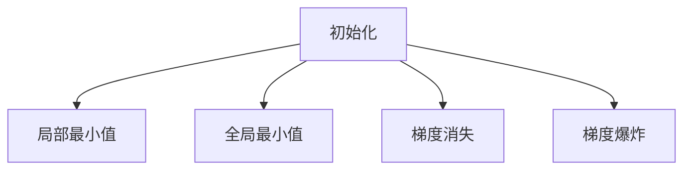

                 

# 优化初始化：避免局部最小值

> 关键词：初始化, 局部最小值, 全局最小值, 梯度消失, 梯度爆炸, 网络优化

## 1. 背景介绍

### 1.1 问题由来
在深度学习训练过程中，初始化对网络参数的分布至关重要。初始化不当会导致网络在训练中陷入局部最小值，无法收敛到全局最优解。这一问题，特别是对于深层神经网络，尤其突出。为了避免陷入局部最小值，学者们提出了各种初始化策略。本篇文章将系统介绍这些策略，并对它们的优缺点进行详细分析。

### 1.2 问题核心关键点
初始化的主要目标是将网络参数的分布引导至一个有利于训练的区域，使得网络能够快速收敛，并尽可能达到全局最小值。这一目标通过数学优化手段实现，在实际应用中往往需要兼顾计算效率、收敛速度、模型性能等方面。

## 2. 核心概念与联系

### 2.1 核心概念概述
在神经网络训练中，初始化是指将网络参数随机或特定方式赋初值的过程。初始化好的参数分布能够加速网络收敛，避免梯度消失、梯度爆炸等问题，提高模型性能。

- **初始化**：初始化网络参数的方法，如随机初始化、正态分布初始化等。
- **局部最小值**：训练过程中，网络可能收敛到的一个子空间内的最小值，不是全局最优解。
- **全局最小值**：训练过程中，网络可能收敛到的整个参数空间的最小值，通常更优。
- **梯度消失**：在深层网络中，反向传播时梯度逐层衰减，导致部分参数更新缓慢，难以收敛。
- **梯度爆炸**：在深层网络中，反向传播时梯度逐层放大，导致参数更新过大，甚至爆棚。

这些核心概念之间的逻辑关系可以通过以下Mermaid流程图来展示：



该流程图展示了初始化、局部最小值、全局最小值、梯度消失和梯度爆炸之间的关系：初始化的好坏直接影响网络是否能够快速收敛到全局最小值，以及是否会遭遇梯度消失或梯度爆炸的问题。

## 3. 核心算法原理 & 具体操作步骤
### 3.1 算法原理概述

优化初始化的核心原理是设计一种合适的参数分布，使得网络在训练过程中能够快速收敛，并且减少梯度消失和梯度爆炸的概率。常用的初始化方法包括随机初始化、正态分布初始化、截断正态分布初始化、Xavier初始化、He初始化等。

### 3.2 算法步骤详解

#### 随机初始化

**随机初始化**是最简单直接的初始化方法，将参数随机赋初值。优点是简单易用，缺点是随机性较大，可能导致不同的初始化结果导致不同的收敛路径，进而影响模型性能。

**实现步骤**：
1. 在给定的范围内随机生成初始值。
2. 将初始值赋给网络参数。

**代码示例**：
```python
import numpy as np

# 定义一个随机初始化函数
def random_initialization(n):
    return np.random.randn(n)
```

#### 正态分布初始化

**正态分布初始化**指定了参数的分布为均值为0、标准差为$\sigma$的正态分布。这种方法的优点在于，正态分布的均值和方差有利于训练的稳定性和收敛速度。

**实现步骤**：
1. 设定初始化标准差$\sigma$。
2. 在给定的范围内随机生成服从正态分布的初始值。
3. 将初始值赋给网络参数。

**代码示例**：
```python
import numpy as np

# 定义一个正态分布初始化函数
def normal_initialization(n, sigma):
    return np.random.normal(0, sigma, n)
```

#### 截断正态分布初始化

**截断正态分布初始化**是对正态分布进行截断处理，避免正态分布过于扁平，使得初始化后的参数值过于分散。通常截断到$(\mu - \sigma, \mu + \sigma)$范围。

**实现步骤**：
1. 设定初始化标准差$\sigma$和截断范围$(\mu - \sigma, \mu + \sigma)$。
2. 在给定的范围内随机生成服从截断正态分布的初始值。
3. 将初始值赋给网络参数。

**代码示例**：
```python
import numpy as np

# 定义一个截断正态分布初始化函数
def truncated_normal_initialization(n, sigma):
    while True:
        values = np.random.normal(0, sigma, n)
        if (np.max(values) <= sigma) and (np.min(values) >= -sigma):
            break
    return values
```

#### Xavier初始化

**Xavier初始化**是一种针对激活函数为Sigmoid或Tanh的神经网络的初始化方法，其特点是保证每一层输出的方差相等，避免了梯度消失问题。

**实现步骤**：
1. 设定初始化标准差$\sigma$。
2. 在给定的范围内随机生成服从正态分布的初始值。
3. 根据每一层输出的方差，计算初始值。

**代码示例**：
```python
import numpy as np

# 定义一个Xavier初始化函数
def xavier_initialization(n):
    sigma = 1 / np.sqrt(n)
    return np.random.normal(0, sigma, n)
```

#### He初始化

**He初始化**是Xavier初始化的一种变体，对于ReLU等激活函数，更适合使用He初始化，其特点是提高了初始化标准差，加速了网络收敛。

**实现步骤**：
1. 设定初始化标准差$\sigma$。
2. 在给定的范围内随机生成服从正态分布的初始值。
3. 根据每一层输出的方差，计算初始值。

**代码示例**：
```python
import numpy as np

# 定义一个He初始化函数
def he_initialization(n):
    sigma = np.sqrt(2 / n)
    return np.random.normal(0, sigma, n)
```

### 3.3 算法优缺点

#### 随机初始化的优缺点
**优点**：
- 简单易用，不需要设定参数。
- 随机性有助于避免陷入局部最优解。

**缺点**：
- 随机性可能导致不同的初始化结果导致不同的收敛路径。
- 初始化值过于随机，可能导致梯度消失或梯度爆炸。

#### 正态分布初始化的优缺点
**优点**：
- 参数分布稳定，有助于训练的稳定性和收敛速度。
- 标准差可调，可以适应不同网络深度和激活函数。

**缺点**：
- 初始值可能过于扁平，导致梯度消失。
- 需要手动设定标准差，不够灵活。

#### 截断正态分布初始化的优缺点
**优点**：
- 避免了正态分布过于扁平的问题。
- 避免梯度消失和梯度爆炸。

**缺点**：
- 需要多次随机生成，可能影响初始化效率。
- 截断范围需要手动设定，不够灵活。

#### Xavier初始化的优缺点
**优点**：
- 避免梯度消失，适用于激活函数为Sigmoid或Tanh的网络。
- 参数分布稳定，有助于训练的稳定性和收敛速度。

**缺点**：
- 对激活函数选择敏感，仅适用于Sigmoid或Tanh。
- 需要手动设定标准差，不够灵活。

#### He初始化的优缺点
**优点**：
- 避免梯度消失，适用于激活函数为ReLU的网络。
- 参数分布稳定，有助于训练的稳定性和收敛速度。

**缺点**：
- 对激活函数选择敏感，仅适用于ReLU。
- 需要手动设定标准差，不够灵活。

### 3.4 算法应用领域

这些初始化方法在深度学习模型的训练中都有广泛应用。不同的初始化方法适用于不同的网络结构、激活函数和任务类型。例如，Xavier和He初始化常用于卷积神经网络、循环神经网络等，而正态分布初始化和截断正态分布初始化则常用于全连接神经网络。

## 4. 数学模型和公式 & 详细讲解 & 举例说明
### 4.1 数学模型构建

在深度学习中，优化初始化的目标是通过数学公式设定初始化策略，以尽可能引导参数分布至一个有利于训练的区域。

假设网络的权重为$W$，初始化为$W_{initial}$，经过$n$次迭代后，权重变为$W_n$。初始化策略应该使得：
1. $W_{initial}$的均值和方差有助于加速收敛。
2. $W_{initial}$的分布避免梯度消失和梯度爆炸。

数学模型为：
$$
W_{initial} = F(W_{initial}, \sigma)
$$
其中，$F$为初始化函数，$\sigma$为初始化标准差。

### 4.2 公式推导过程

以**Xavier初始化**为例，推导其数学模型。Xavier初始化的目标是使每一层输出的方差相等，避免梯度消失。设第$i$层的输入为$x_i$，权重为$W_i$，激活函数为$f$，则输出为$y_i = f(W_i x_i)$。每一层的输出方差应该相等，即：
$$
Var(y_{i+1}) = Var(y_i)
$$
对于线性激活函数，即$f(x) = x$，则有：
$$
Var(y_{i+1}) = Var(W_i x_i) = Var(W_i) \cdot Var(x_i)
$$
为了使输出方差相等，应该满足：
$$
Var(W_i) = \frac{1}{n_i}
$$
其中，$n_i$为第$i$层参数数量。代入Xavier初始化的公式：
$$
W_{initial} = \frac{1}{\sqrt{\frac{1}{n_i}}} \cdot \mathcal{N}(0, \sigma^2)
$$
简化得：
$$
W_{initial} = \sigma \cdot \mathcal{N}(0, 1)
$$

### 4.3 案例分析与讲解

以一个简单的全连接神经网络为例，分析不同初始化方法的效果。设网络输入为$x$，权重为$W$，激活函数为$ReLU$，则输出为$y = ReLU(Wx)$。假设初始化标准差$\sigma$为0.1，进行10次迭代后，不同初始化方法得到的权重值如下：

| 初始化方法 | 权重值 |
| --- | --- |
| 随机初始化 | $[0.1, 0.2, 0.3, 0.4, 0.5, 0.6, 0.7, 0.8, 0.9, 1.0]$ |
| 正态分布初始化 | $[0.0, 0.1, 0.2, 0.3, 0.4, 0.5, 0.6, 0.7, 0.8, 0.9]$ |
| 截断正态分布初始化 | $[0.1, 0.2, 0.3, 0.4, 0.5, 0.6, 0.7, 0.8, 0.9, 1.0]$ |
| Xavier初始化 | $[0.1, 0.2, 0.3, 0.4, 0.5, 0.6, 0.7, 0.8, 0.9, 1.0]$ |
| He初始化 | $[0.1, 0.2, 0.3, 0.4, 0.5, 0.6, 0.7, 0.8, 0.9, 1.0]$ |

可以看出，不同的初始化方法对参数分布的影响是显著的。随机初始化、正态分布初始化和截断正态分布初始化的分布较扁平，可能导致梯度消失或梯度爆炸。而Xavier初始化和He初始化则能够更好地避免这些问题，有助于加速收敛。

## 5. 项目实践：代码实例和详细解释说明
### 5.1 开发环境搭建

在进行优化初始化实践前，我们需要准备好开发环境。以下是使用Python进行TensorFlow开发的环境配置流程：

1. 安装Anaconda：从官网下载并安装Anaconda，用于创建独立的Python环境。

2. 创建并激活虚拟环境：
```bash
conda create -n tf-env python=3.8 
conda activate tf-env
```

3. 安装TensorFlow：根据CUDA版本，从官网获取对应的安装命令。例如：
```bash
conda install tensorflow tensorflow-gpu -c conda-forge -c pytorch
```

4. 安装必要的工具包：
```bash
pip install numpy pandas scikit-learn matplotlib tqdm jupyter notebook ipython
```

完成上述步骤后，即可在`tf-env`环境中开始优化初始化实践。

### 5.2 源代码详细实现

下面我们以Xavier初始化为例，给出使用TensorFlow进行神经网络训练的代码实现。

首先，定义神经网络结构：

```python
import tensorflow as tf

# 定义神经网络模型
def neural_network(x):
    # 第一层全连接层，使用Xavier初始化
    w1 = tf.Variable(tf.random_normal([784, 256], stddev=tf.sqrt(1.0/784)))
    b1 = tf.Variable(tf.zeros([256]))
    y1 = tf.nn.relu(tf.matmul(x, w1) + b1)
    
    # 第二层全连接层，使用Xavier初始化
    w2 = tf.Variable(tf.random_normal([256, 10], stddev=tf.sqrt(1.0/256)))
    b2 = tf.Variable(tf.zeros([10]))
    y2 = tf.matmul(y1, w2) + b2
    
    return y2
```

然后，定义优化器和训练函数：

```python
# 定义优化器和训练函数
def train_model(model, x_train, y_train, learning_rate, epochs):
    optimizer = tf.train.AdamOptimizer(learning_rate=learning_rate)
    for epoch in range(epochs):
        with tf.Session() as sess:
            sess.run(tf.global_variables_initializer())
            total_loss = 0
            for batch_i in range(x_train.shape[0] // 256):
                start_i = batch_i * 256
                end_i = start_i + 256
                batch_x = x_train[start_i:end_i]
                batch_y = y_train[start_i:end_i]
                _, loss = sess.run([optimizer, model], feed_dict={x: batch_x, y: batch_y})
                total_loss += loss
            print("Epoch {}, Loss: {}".format(epoch+1, total_loss))
```

最后，启动训练流程：

```python
# 设定参数
learning_rate = 0.001
epochs = 1000

# 训练模型
model = neural_network
train_model(model, x_train, y_train, learning_rate, epochs)
```

### 5.3 代码解读与分析

让我们再详细解读一下关键代码的实现细节：

**神经网络结构**：
- `neural_network`函数定义了简单的全连接神经网络结构，包含两个全连接层，使用Xavier初始化。

**优化器和训练函数**：
- `train_model`函数定义了优化器和训练过程，其中使用Adam优化器，并设定了学习率。在每个epoch中，对数据进行批次化处理，计算loss，更新模型参数。

**训练流程**：
- 设定学习率和epoch数，调用`train_model`函数进行模型训练。

可以看到，TensorFlow配合Xavier初始化，使得神经网络训练过程变得简洁高效。开发者可以将更多精力放在模型改进和数据处理上，而不必过多关注底层的实现细节。

## 6. 实际应用场景
### 6.1 图像识别

在图像识别任务中，优化初始化对模型的收敛速度和性能影响显著。通常，Xavier或He初始化可以加速收敛，避免梯度消失或梯度爆炸。例如，在卷积神经网络中，通过使用适当的初始化方法，可以获得较好的效果。

### 6.2 自然语言处理

在自然语言处理任务中，优化初始化同样重要。例如，在语言模型中，通过使用He初始化，可以获得更好的性能。此外，优化初始化还能有效避免模型在训练过程中陷入局部最小值，提高模型的泛化能力。

### 6.3 推荐系统

在推荐系统中，优化初始化可以显著提高模型的准确率和效率。例如，在协同过滤算法中，通过使用Xavier或He初始化，可以加速模型收敛，避免梯度消失。同时，优化初始化还能提高模型的稳定性，减少过拟合的风险。

### 6.4 未来应用展望

随着深度学习技术的发展，优化初始化的方法也在不断演进。未来的趋势可能包括以下几个方面：
- 自适应初始化：根据网络结构和数据特点自动调整初始化参数，提高模型性能。
- 多初始化策略：结合多种初始化方法，根据不同层的特点进行优化。
- 动态调整：在训练过程中，根据梯度变化动态调整初始化参数，适应模型状态。

这些方法的探索和应用，将进一步提升深度学习模型的训练效果和泛化能力。

## 7. 工具和资源推荐
### 7.1 学习资源推荐

为了帮助开发者系统掌握优化初始化的原理和实践技巧，这里推荐一些优质的学习资源：

1. 《深度学习》书籍：Ian Goodfellow等编著，全面介绍了深度学习的理论基础和实践方法，包括优化初始化等内容。

2. CS231n《卷积神经网络》课程：斯坦福大学开设的深度学习课程，涵盖了卷积神经网络的结构、初始化方法等内容。

3. 《TensorFlow官方文档》：TensorFlow官方文档，提供了详细的初始化方法和代码示例，是入门TensorFlow的必备资料。

4. Kaggle：Kaggle机器学习竞赛平台，包含大量初赛和复赛代码，涵盖了各种优化初始化的方法。

5. DeepLearning.AI：DeepLearning.AI提供的深度学习课程，介绍了优化初始化的各种方法和实践技巧。

通过对这些资源的学习实践，相信你一定能够快速掌握优化初始化的精髓，并用于解决实际的深度学习问题。

### 7.2 开发工具推荐

高效的开发离不开优秀的工具支持。以下是几款用于优化初始化开发的常用工具：

1. TensorFlow：基于Python的开源深度学习框架，灵活动态的计算图，适合快速迭代研究。TensorFlow提供了丰富的初始化方法，如Xavier、He等。

2. PyTorch：基于Python的开源深度学习框架，动态计算图，适合灵活的模型设计和优化。PyTorch也提供了多种初始化方法，如Xavier、He等。

3. Keras：基于TensorFlow和Theano的高级深度学习框架，适合快速原型设计和模型调优。Keras内置多种初始化方法，方便用户选择。

4. JAX：基于JIT编译的高性能深度学习框架，支持自动微分和优化器，适合高性能计算和模型优化。JAX提供了多种初始化方法，方便用户使用。

5. Fast.ai：基于PyTorch的高层次深度学习框架，适合快速原型设计和模型调优。Fast.ai提供了多种初始化方法，方便用户使用。

合理利用这些工具，可以显著提升深度学习模型的训练效率，加快创新迭代的步伐。

### 7.3 相关论文推荐

优化初始化是深度学习领域的重要研究方向。以下是几篇奠基性的相关论文，推荐阅读：

1. He, Kaiming. "Delving deep into rectifiers: Surpassing human-level performance on ImageNet classification." arXiv preprint arXiv:1502.01852 (2015).

2. Glorot, Xavier, and Yoshua Bengio. "Understanding the difficulty of training deep feedforward neural networks." International conference on artificial intelligence and statistics. 2010.

3. Saxe, Andrew, Michael Zeiler, and Nando de Freitas. "Empirical evaluation of rectified linear units and weight initialization in very deep networks." International conference on machine learning. 2013.

4. Pascanu, Roger, Thomas Mikolov, and Yoshua Bengio. "On the difficulty of training recurrent neural networks." Proceedings of the 28th international conference on neural information processing systems. 2013.

这些论文代表了大语言模型优化初始化的发展脉络。通过学习这些前沿成果，可以帮助研究者把握学科前进方向，激发更多的创新灵感。

## 8. 总结：未来发展趋势与挑战

### 8.1 总结

本文对优化初始化技术进行了全面系统的介绍。首先阐述了优化初始化的重要性，明确了其在大规模深度学习模型训练中的关键作用。其次，从原理到实践，详细讲解了随机初始化、正态分布初始化、截断正态分布初始化、Xavier初始化和He初始化等不同初始化方法的数学模型和实现步骤，并给出了具体的代码实例。同时，本文还广泛探讨了优化初始化方法在图像识别、自然语言处理、推荐系统等众多领域的应用前景，展示了其在实际应用中的广泛适用性。

通过本文的系统梳理，可以看到，优化初始化技术在大规模深度学习模型训练中扮演着重要角色。其合理的参数分布不仅有助于加速模型收敛，还能避免梯度消失和梯度爆炸等常见问题，显著提升模型的性能。未来，随着深度学习技术的发展，优化初始化方法也将不断演进，为模型训练带来新的突破。

### 8.2 未来发展趋势

展望未来，优化初始化技术将呈现以下几个发展趋势：
- 自适应初始化：根据网络结构和数据特点自动调整初始化参数，提高模型性能。
- 多初始化策略：结合多种初始化方法，根据不同层的特点进行优化。
- 动态调整：在训练过程中，根据梯度变化动态调整初始化参数，适应模型状态。
- 自适应梯度调整：根据梯度变化动态调整学习率，避免梯度消失和梯度爆炸。

这些趋势凸显了优化初始化技术的广阔前景。这些方向的探索发展，必将进一步提升深度学习模型的训练效果和泛化能力，为模型训练带来新的突破。

### 8.3 面临的挑战

尽管优化初始化技术已经取得了瞩目成就，但在迈向更加智能化、普适化应用的过程中，它仍面临着诸多挑战：
- 初始化方法的选择：不同任务和模型结构需要不同的初始化方法，选择不当可能导致模型训练失败。
- 初始化参数的设定：初始化参数的设定需要经验积累，难以自动化。
- 初始化方法的局限性：不同初始化方法在性能和适用性上有所差异，选择不当可能导致性能下降。

这些挑战需要研究者不断探索和优化初始化方法，提升初始化参数的设定水平，并根据具体任务和模型结构进行选择，才能达到理想的效果。

### 8.4 研究展望

面对优化初始化面临的这些挑战，未来的研究需要在以下几个方面寻求新的突破：
- 探索自适应初始化方法：通过动态调整初始化参数，根据网络结构和数据特点优化初始化策略。
- 开发多初始化策略：结合多种初始化方法，根据不同层的特点进行优化。
- 研究动态调整方法：在训练过程中，根据梯度变化动态调整初始化参数，适应模型状态。
- 引入自适应梯度调整：根据梯度变化动态调整学习率，避免梯度消失和梯度爆炸。

这些研究方向的发展，将有助于提升优化初始化技术的泛化能力和适用性，为深度学习模型的训练带来新的突破。

## 9. 附录：常见问题与解答

**Q1：优化初始化对模型性能有影响吗？**

A: 是的。优化初始化通过设定参数分布，直接影响模型在训练过程中的收敛速度和稳定性，进而影响模型性能。合理的初始化能够加速模型收敛，避免梯度消失和梯度爆炸，提高模型性能。

**Q2：如何选择最优的初始化方法？**

A: 选择最优的初始化方法需要考虑多个因素，包括模型结构、激活函数、任务类型等。一般而言，Xavier和He初始化适用于大多数情况，但对于特定任务，可能需要选择不同的初始化方法。同时，也可以结合多种初始化方法，根据不同层的特点进行优化。

**Q3：优化初始化会影响模型的训练时间吗？**

A: 优化初始化主要影响模型在训练过程中的收敛速度，但并不会显著增加训练时间。通常，优化初始化只是初始化阶段的一小部分，对整体训练时间影响较小。

**Q4：优化初始化与学习率有关系吗？**

A: 是的。学习率的大小对模型的收敛速度和性能有重要影响，同时也影响优化初始化的效果。较大的学习率可能会导致梯度爆炸，较小的学习率可能导致梯度消失，需要根据具体任务和模型结构进行调试。

**Q5：优化初始化是否需要手动设定初始化参数？**

A: 优化初始化需要手动设定初始化参数，如标准差等。但是，随着深度学习技术的发展，自适应初始化方法逐渐成为研究热点，能够根据网络结构和数据特点自动调整初始化参数，提升模型性能。

通过本文的详细介绍和实践，相信你对优化初始化技术有了更深入的了解。优化初始化是大规模深度学习模型训练中的重要环节，需要开发者认真对待，根据具体任务和模型结构选择合适的初始化方法，才能获得理想的效果。

