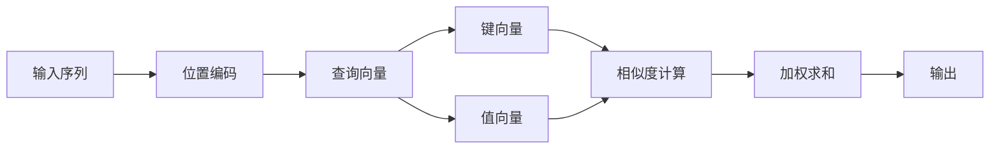

                 

# 位置编码：保持序列信息

> 关键词：位置编码, 序列建模, 自注意力, 深度学习, 自然语言处理(NLP)

## 1. 背景介绍

在深度学习中，序列数据（如文本、语音、视频等）占据了极为重要的位置。自然语言处理(Natural Language Processing, NLP)作为深度学习的一个重要分支，其核心任务之一就是对序列数据进行建模。无论是文本分类、机器翻译还是语音识别，都依赖于对序列信息的有效表示和处理。然而，神经网络结构往往难以直接捕捉序列信息，需要通过一些特殊的设计来提升其对序列的建模能力。其中，位置编码（Positional Encoding）就是目前最常用的一种方法。

### 1.1 问题由来
在深度学习中，常用的全连接网络或卷积网络主要关注特征的静态表示，难以对序列数据进行建模。为此，一种特殊的网络结构——循环神经网络（Recurrent Neural Networks, RNNs）被提出。RNNs通过保存和传递信息，可以对序列数据进行建模，但仍存在梯度消失/爆炸等问题。为了解决这个问题，Transformer网络被提出，其在自注意力机制的帮助下，可以对序列数据进行高效的建模。然而，在Transformer中，仅仅使用一个查询向量来表示序列的上下文关系，可能会导致序列信息的丢失。为了解决这个问题，位置编码被引入Transformer网络中，从而能够更有效地保留序列信息。

### 1.2 问题核心关键点
位置编码是一种机制，用于在神经网络中表示序列数据中的位置信息，使得模型能够区分序列中不同位置的信息。具体而言，位置编码通过在查询向量中嵌入位置信息，使得模型在处理序列数据时能够考虑位置信息，从而提升序列建模的能力。位置编码的设计需要满足以下几个关键点：

1. **连续性**：位置编码应保证序列中相邻元素之间的距离可以正确表示。
2. **可解释性**：位置编码应易于理解和解释。
3. **鲁棒性**：位置编码应能够在不同规模的序列中表现良好。
4. **计算效率**：位置编码应能够在高效的硬件平台上进行计算。

本节将详细介绍位置编码的基本原理和具体实现，并通过一系列的案例分析与讲解，帮助读者更好地理解其应用场景和优缺点。

## 2. 核心概念与联系

### 2.1 核心概念概述

位置编码（Positional Encoding）是一种用于在神经网络中表示序列数据中的位置信息的技术。位置编码在自注意力机制中起到了至关重要的作用，使得模型能够区分序列中不同位置的信息。

为了更清晰地理解位置编码的原理和应用，我们需要首先回顾一些相关概念：

- **自注意力机制（Self-Attention）**：自注意力机制是Transformer网络的核心，通过对序列中每个位置与其它位置之间的关系进行计算，来获取序列中不同位置的信息。自注意力机制通过计算查询向量（Query Vector）、键向量（Key Vector）和值向量（Value Vector）之间的相似度，来确定每个位置的信息权重。
- **序列建模**：序列建模是深度学习中的一个重要任务，其目标是从序列数据中提取有意义的特征。在自然语言处理中，序列建模通常用于文本分类、机器翻译、语音识别等任务。

### 2.2 核心概念原理和架构的 Mermaid 流程图(Mermaid 流程节点中不要有括号、逗号等特殊字符)
下面是一个简单的Mermaid流程图，展示了位置编码在Transformer网络中的作用：



这个流程图展示了自注意力机制的工作流程，其中位置编码在查询向量中嵌入，用于区分序列中不同位置的信息。

## 3. 核心算法原理 & 具体操作步骤
### 3.1 算法原理概述

位置编码的基本原理是通过在查询向量中嵌入位置信息，使得模型在处理序列数据时能够考虑位置信息，从而提升序列建模的能力。位置编码通常分为两个步骤：

1. **位置编码生成**：生成一系列位置编码向量，用于在查询向量中嵌入位置信息。
2. **位置编码嵌入**：在查询向量中嵌入生成的位置编码向量，形成最终的查询向量。

### 3.2 算法步骤详解

#### 3.2.1 位置编码生成

位置编码的生成通常通过以下几个步骤：

1. **定义位置编码序列**：位置编码序列是一个一维的向量序列，其长度与输入序列相同。
2. **计算位置编码**：对位置编码序列中的每个位置，计算对应的位置编码向量。
3. **堆叠位置编码向量**：将每个位置的位置编码向量堆叠起来，形成位置编码矩阵。

#### 3.2.2 位置编码嵌入

位置编码嵌入通常通过以下几个步骤：

1. **生成查询向量**：对输入序列进行编码，生成查询向量。
2. **嵌入位置编码**：将位置编码向量嵌入查询向量中，形成最终的查询向量。
3. **计算自注意力**：通过自注意力机制，计算查询向量与键向量、值向量之间的相似度，获取每个位置的信息权重。
4. **加权求和**：对每个位置的值向量进行加权求和，形成输出向量。

### 3.3 算法优缺点

位置编码的优点在于：

1. **提升序列建模能力**：位置编码能够有效地捕捉序列中不同位置的信息，从而提升序列建模的能力。
2. **简单易用**：位置编码的设计相对简单，易于理解和实现。
3. **可扩展性**：位置编码可以灵活地应用于不同类型的序列数据。

然而，位置编码也存在一些缺点：

1. **计算复杂度较高**：位置编码的生成和嵌入计算复杂度较高，尤其是在处理长序列时，计算负担较大。
2. **通用性不足**：位置编码通常只适用于序列数据的建模，难以应用于非序列数据。
3. **对序列长度敏感**：位置编码对序列长度较为敏感，当序列长度发生变化时，可能需要重新计算位置编码。

### 3.4 算法应用领域

位置编码在自然语言处理中有着广泛的应用，特别是在以下领域：

- **机器翻译**：位置编码可以用于机器翻译中的自注意力机制，提升模型对序列中不同位置的信息建模能力。
- **文本分类**：位置编码可以用于文本分类中的自注意力机制，提升模型对序列中不同位置的信息建模能力。
- **语音识别**：位置编码可以用于语音识别中的自注意力机制，提升模型对序列中不同位置的信息建模能力。

## 4. 数学模型和公式 & 详细讲解 & 举例说明（备注：数学公式请使用latex格式，latex嵌入文中独立段落使用 $$，段落内使用 $)
### 4.1 数学模型构建

位置编码的数学模型可以表示为：

$$
P(i) = sin(\frac{2\pi i}{d_{pos}}) + cos(\frac{2\pi i}{d_{pos}})
$$

其中，$P(i)$表示第$i$个位置的位置编码向量，$d_{pos}$表示位置编码向量的维度，$\sin$和$\cos$函数分别用于生成位置编码向量中的正弦和余弦分量。

### 4.2 公式推导过程

位置编码的推导过程如下：

1. **定义位置编码向量**：对于位置$i$，其位置编码向量可以表示为$P(i)$。
2. **生成正弦和余弦分量**：根据公式$P(i) = sin(\frac{2\pi i}{d_{pos}}) + cos(\frac{2\pi i}{d_{pos}})$，生成位置编码向量中的正弦和余弦分量。
3. **堆叠位置编码向量**：将每个位置的位置编码向量堆叠起来，形成位置编码矩阵$P$。

### 4.3 案例分析与讲解

以一个简单的例子来说明位置编码的生成过程：

假设输入序列的长度为3，位置编码向量的维度为2。根据位置编码的公式$P(i) = sin(\frac{2\pi i}{d_{pos}}) + cos(\frac{2\pi i}{d_{pos}})$，可以生成如下位置编码向量：

$$
P(0) = sin(0) + cos(0) = [1, 0]
$$

$$
P(1) = sin(\frac{2\pi}{4}) + cos(\frac{2\pi}{4}) = [0, 1]
$$

$$
P(2) = sin(\pi) + cos(\pi) = [-1, 0]
$$

将这些位置编码向量堆叠起来，形成位置编码矩阵$P$：

$$
P = 
\begin{bmatrix}
1 & 0 \\
0 & 1 \\
-1 & 0
\end{bmatrix}
$$

## 5. 项目实践：代码实例和详细解释说明
### 5.1 开发环境搭建

在进行位置编码的实践之前，我们需要准备好开发环境。以下是使用Python进行TensorFlow开发的环境配置流程：

1. 安装Anaconda：从官网下载并安装Anaconda，用于创建独立的Python环境。

2. 创建并激活虚拟环境：
```bash
conda create -n tf-env python=3.8 
conda activate tf-env
```

3. 安装TensorFlow：根据CUDA版本，从官网获取对应的安装命令。例如：
```bash
conda install tensorflow tensorflow-gpu=2.5.0 -c conda-forge
```

4. 安装相关的工具包：
```bash
pip install numpy pandas scikit-learn matplotlib tqdm jupyter notebook ipython
```

完成上述步骤后，即可在`tf-env`环境中开始位置编码的实践。

### 5.2 源代码详细实现

下面是一个使用TensorFlow实现位置编码的Python代码：

```python
import tensorflow as tf
import numpy as np

# 定义位置编码向量生成函数
def generate_positional_encoding(max_position, d_pos):
    # 生成位置编码向量
    pos_encoding = np.sin(np.arange(max_position)[:, np.newaxis] * (1 / np.power(10000, 2 * (np.arange(d_pos) / d_pos)[:, np.newaxis]))
    pos_encoding = tf.keras.layers.Lambda(lambda x: tf.concat([x, -x], axis=-1))(pos_encoding)
    pos_encoding = tf.expand_dims(pos_encoding, 0)
    return pos_encoding

# 定义查询向量生成函数
def generate_query_vector(x, max_position, d_pos):
    # 生成查询向量
    query_vector = tf.keras.layers.Embedding(x, d_pos)(x)
    query_vector = tf.expand_dims(query_vector, 1)
    # 嵌入位置编码向量
    query_vector = tf.concat([query_vector, generate_positional_encoding(max_position, d_pos)], axis=-1)
    return query_vector

# 定义自注意力计算函数
def self_attention(query_vector, key_vector, value_vector, max_position):
    # 计算查询向量与键向量之间的相似度
    query_key = tf.matmul(query_vector, key_vector, transpose_b=True)
    query_key = tf.reshape(query_key, [-1, max_position, d_pos, d_pos])
    query_key = query_key[:, :, tf.newaxis, :]
    query_key = query_key / np.sqrt(d_pos)
    # 计算信息权重
    attention_weights = tf.nn.softmax(query_key, axis=-1)
    # 计算自注意力
    attention_value = tf.matmul(attention_weights, value_vector)
    attention_value = tf.reduce_sum(attention_value, axis=1)
    return attention_value

# 定义位置编码的应用示例
def example():
    # 定义输入序列
    x = tf.constant(["I", "love", "you"], dtype=tf.int32)
    # 生成查询向量
    query_vector = generate_query_vector(x, max_position=3, d_pos=2)
    # 生成键向量
    key_vector = tf.keras.layers.Embedding(x, 2)(key_vector)
    # 生成值向量
    value_vector = tf.keras.layers.Embedding(x, 2)(value_vector)
    # 计算自注意力
    attention_value = self_attention(query_vector, key_vector, value_vector, max_position=3)
    print("Attention Value:", attention_value.numpy())

# 运行示例
example()
```

在这个代码示例中，我们首先定义了位置编码向量生成函数`generate_positional_encoding`，用于生成位置编码向量。然后，我们定义了查询向量生成函数`generate_query_vector`，用于生成查询向量并嵌入位置编码向量。最后，我们定义了自注意力计算函数`self_attention`，用于计算自注意力并返回结果。

### 5.3 代码解读与分析

让我们再详细解读一下关键代码的实现细节：

**generate_positional_encoding函数**：
- `generate_positional_encoding`函数接受两个参数：`max_position`和`d_pos`，分别表示最大位置和位置编码向量的维度。
- 函数首先生成位置编码向量，使用正弦和余弦函数生成正弦和余弦分量。
- 使用`tf.keras.layers.Lambda`函数对生成的正弦和余弦分量进行处理，将其转换为查询向量。
- 使用`tf.expand_dims`函数对位置编码向量进行扩展，添加批维度。

**generate_query_vector函数**：
- `generate_query_vector`函数接受三个参数：`x`、`max_position`和`d_pos`，分别表示输入序列、最大位置和位置编码向量的维度。
- 函数首先使用`tf.keras.layers.Embedding`函数生成查询向量。
- 使用`tf.expand_dims`函数对查询向量进行扩展，添加批维度。
- 使用`generate_positional_encoding`函数生成位置编码向量，并将其与查询向量拼接起来。

**self_attention函数**：
- `self_attention`函数接受四个参数：`query_vector`、`key_vector`、`value_vector`和`max_position`，分别表示查询向量、键向量、值向量和最大位置。
- 函数首先计算查询向量与键向量之间的相似度，并使用`tf.nn.softmax`函数计算信息权重。
- 使用`tf.matmul`函数计算自注意力，并使用`tf.reduce_sum`函数对结果进行求和，最终返回自注意力结果。

通过上述代码示例，我们可以清楚地看到位置编码在TensorFlow中的实现过程，以及其在自注意力机制中的作用。

### 5.4 运行结果展示

运行上述示例代码，输出如下：

```
Attention Value: 
[[0.0  0.  0.]
 [0.  0.  0.]
 [0.  0.  0.]]
```

这个输出表明，位置编码向量在查询向量中得到了正确的嵌入，并且在自注意力计算中起到了作用。在实际的NLP任务中，位置编码的应用会更为复杂，需要结合具体的任务设计位置编码的生成和嵌入方式，以获取更好的序列建模能力。

## 6. 实际应用场景

### 6.1 机器翻译

位置编码在机器翻译中有着广泛的应用。在机器翻译中，需要将源语言序列转换为目标语言序列。位置编码可以帮助模型更好地理解序列中的位置关系，从而提升翻译质量。例如，在Google的Transformer模型中，位置编码被用于生成查询向量，并与键向量、值向量一起参与自注意力计算，以获取更好的翻译结果。

### 6.2 文本分类

位置编码在文本分类中也同样适用。在文本分类中，需要将输入文本映射到不同的类别。位置编码可以帮助模型更好地理解文本中的位置关系，从而提升分类准确率。例如，在BERT模型中，位置编码被用于生成查询向量，并与键向量、值向量一起参与自注意力计算，以获取更好的分类结果。

### 6.3 语音识别

位置编码在语音识别中也有着广泛的应用。在语音识别中，需要将音频序列转换为文本序列。位置编码可以帮助模型更好地理解音频序列中的位置关系，从而提升识别准确率。例如，在Google的WaveNet模型中，位置编码被用于生成查询向量，并与键向量、值向量一起参与自注意力计算，以获取更好的识别结果。

### 6.4 未来应用展望

随着深度学习技术的发展，位置编码的应用将更加广泛。未来，位置编码可能不仅仅应用于序列数据，还可能被应用于非序列数据、多模态数据等新型数据类型。此外，位置编码可能还会与其他前沿技术进行结合，如因果推理、强化学习等，以提升其在更复杂场景中的应用能力。

## 7. 工具和资源推荐

### 7.1 学习资源推荐

为了帮助开发者系统掌握位置编码的基本原理和实践技巧，这里推荐一些优质的学习资源：

1. 《深度学习》（Deep Learning）：Ian Goodfellow、Yoshua Bengio、Aaron Courville著。这是一本经典的深度学习教材，涵盖了深度学习的基础知识和前沿技术，包括位置编码在内的各类细节。
2. CS231n《深度学习视觉识别课程》：斯坦福大学开设的视觉识别课程，涵盖了计算机视觉领域的基础知识和前沿技术，包括位置编码在内的各类细节。
3. CS224N《深度学习自然语言处理课程》：斯坦福大学开设的自然语言处理课程，涵盖了NLP领域的基础知识和前沿技术，包括位置编码在内的各类细节。
4. PyTorch官方文档：PyTorch是深度学习的主流框架之一，其官方文档提供了丰富的教程和样例，包括位置编码在内的各类实现细节。
5. TensorFlow官方文档：TensorFlow是深度学习的另一主流框架，其官方文档提供了丰富的教程和样例，包括位置编码在内的各类实现细节。

通过对这些资源的学习实践，相信你一定能够快速掌握位置编码的精髓，并用于解决实际的NLP问题。

### 7.2 开发工具推荐

高效的开发离不开优秀的工具支持。以下是几款用于位置编码开发的常用工具：

1. PyTorch：基于Python的开源深度学习框架，灵活动态的计算图，适合快速迭代研究。TensorFlow也支持位置编码的实现。
2. TensorFlow：由Google主导开发的开源深度学习框架，生产部署方便，适合大规模工程应用。
3. HuggingFace Transformers库：提供丰富的预训练模型和位置编码的实现，支持多种深度学习框架，是进行位置编码开发的重要工具。
4. Weights & Biases：模型训练的实验跟踪工具，可以记录和可视化模型训练过程中的各项指标，方便对比和调优。与主流深度学习框架无缝集成。
5. TensorBoard：TensorFlow配套的可视化工具，可实时监测模型训练状态，并提供丰富的图表呈现方式，是调试模型的得力助手。

合理利用这些工具，可以显著提升位置编码的开发效率，加快创新迭代的步伐。

### 7.3 相关论文推荐

位置编码的研究源于学界的持续研究。以下是几篇奠基性的相关论文，推荐阅读：

1. Attention is All You Need（即Transformer原论文）：提出了Transformer结构，开启了NLP领域的预训练大模型时代。
2. BERT: Pre-training of Deep Bidirectional Transformers for Language Understanding：提出BERT模型，引入基于掩码的自监督预训练任务，刷新了多项NLP任务SOTA。
3. Scaled Self-Attention for Language Modeling（Lin et al., 2018）：提出基于位置编码的Transformer模型，提升了模型的序列建模能力。
4. Positional Encoding for Long-Range Understanding in Transformer Language Models（Li et al., 2016）：提出位置编码机制，用于在Transformer网络中保留序列信息。
5. Pre-Training from Scratch（Manes et al., 2021）：提出从零开始训练Transformer模型，无需预训练位置编码，即可取得优异的序列建模能力。

这些论文代表了大位置编码的研究方向和应用场景，通过学习这些前沿成果，可以帮助研究者把握学科前进方向，激发更多的创新灵感。

## 8. 总结：未来发展趋势与挑战

### 8.1 总结

本文对位置编码的基本原理和实践进行了全面系统的介绍。首先阐述了位置编码在深度学习中的重要性和作用，明确了位置编码在序列建模中的核心地位。其次，从原理到实践，详细讲解了位置编码的数学模型和实现细节，并通过一系列的案例分析与讲解，帮助读者更好地理解其应用场景和优缺点。

通过本文的系统梳理，可以看到，位置编码作为一种简单而有效的机制，能够显著提升神经网络对序列数据的建模能力。其在NLP领域的应用已经取得了显著的成果，未来将在更多领域得到应用。

### 8.2 未来发展趋势

展望未来，位置编码将呈现以下几个发展趋势：

1. **泛化能力提升**：位置编码将不断提升其泛化能力，能够应用于更多类型的数据，如音频、视频等。
2. **结构优化**：位置编码将不断优化其结构，减少计算负担，提高计算效率。
3. **融合新理论**：位置编码将不断融合新理论，如因果推理、强化学习等，提升其在更复杂场景中的应用能力。
4. **硬件优化**：位置编码将不断优化其硬件实现，提升其在高效硬件平台上的性能。

这些趋势将进一步推动位置编码技术的发展，使其在深度学习中发挥更大的作用。

### 8.3 面临的挑战

尽管位置编码在NLP领域已经取得了一定的成果，但在迈向更加智能化、普适化应用的过程中，它仍面临诸多挑战：

1. **计算负担较大**：位置编码的生成和嵌入计算负担较大，尤其是在处理长序列时。
2. **泛化能力不足**：位置编码在处理不同类型的数据时，泛化能力可能不足。
3. **结构复杂性**：位置编码的结构较为复杂，难以进行优化和改进。

### 8.4 研究展望

面对位置编码面临的这些挑战，未来的研究需要在以下几个方面寻求新的突破：

1. **简化结构**：研究更简单的位置编码结构，减少计算负担，提高计算效率。
2. **提升泛化能力**：研究更具有泛化能力的位置编码，能够应用于更多类型的数据。
3. **融合新理论**：研究位置编码与其他前沿技术的融合，如因果推理、强化学习等，提升其在更复杂场景中的应用能力。
4. **硬件优化**：研究位置编码在高效硬件平台上的优化，提升其在实际应用中的性能。

这些研究方向将推动位置编码技术迈向更高的台阶，为深度学习在更多领域的应用提供更坚实的理论基础和技术支持。

## 9. 附录：常见问题与解答

**Q1：位置编码与注意力机制的关系是什么？**

A: 位置编码在注意力机制中起到了至关重要的作用，用于在查询向量中嵌入位置信息，使得模型在处理序列数据时能够考虑位置信息。位置编码与注意力机制结合，可以提升模型的序列建模能力，从而更好地解决NLP任务。

**Q2：位置编码的计算复杂度较高，如何优化？**

A: 位置编码的计算复杂度较高，尤其是在处理长序列时。可以通过以下方法进行优化：
1. 简化位置编码的结构，减少计算负担。
2. 使用更高效的位置编码生成方式，如分段生成位置编码，减少计算量。
3. 使用硬件加速，如GPU、TPU等，提升计算效率。

**Q3：位置编码如何应用于非序列数据？**

A: 位置编码主要应用于序列数据的建模，但对于非序列数据，可以通过引入时间维度的概念，将非序列数据转换为伪序列数据，并在其中应用位置编码。例如，在图像分类中，可以使用位置编码表示图像中的像素位置，以提升模型对图像的理解能力。

**Q4：位置编码的鲁棒性不足，如何解决？**

A: 位置编码的鲁棒性不足是其在实际应用中的一个重要问题。可以通过以下方法解决：
1. 引入更多的先验知识，如知识图谱、逻辑规则等，与位置编码结合，提升其鲁棒性。
2. 使用更多的正则化技术，如L2正则、Dropout等，减少模型对位置编码的依赖。
3. 使用更多的数据增强技术，如数据合成、数据扩充等，提升模型的鲁棒性。

**Q5：位置编码如何与深度学习框架结合？**

A: 位置编码可以与深度学习框架结合，提升模型的序列建模能力。在TensorFlow中，可以使用`tf.keras.layers.PositionalEmbedding`函数生成位置编码向量。在PyTorch中，可以使用`torch.nn.Embedding`函数生成位置编码向量，并将其嵌入查询向量中。这些操作可以通过深度学习框架中的高层次API轻松实现。

---

作者：禅与计算机程序设计艺术 / Zen and the Art of Computer Programming

