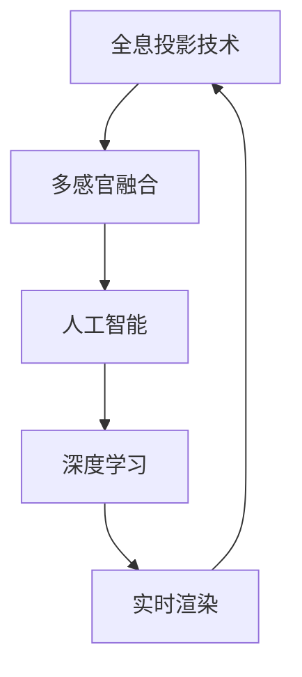

                 

# 体验全息投影：AI驱动的多感官融合技术

> 关键词：全息投影技术,多感官融合,人工智能,深度学习,多模态感知,沉浸式体验,实时渲染

## 1. 背景介绍

### 1.1 问题由来

随着科技的迅猛发展，全息投影技术正在迅速改变我们的生活。全息投影是一种革命性的视觉体验，它通过计算机生成三维图像并将其投射到空间中，为用户创造出一种"立体感"的视觉盛宴。然而，传统的全息投影技术依赖于硬件设备，如全息投影仪、数字光处理(DLP)技术等，成本高昂、操作复杂，难以普及。

与此同时，人工智能（AI）和深度学习（DL）技术在图像、语音、自然语言处理等领域已经取得了巨大的突破。通过AI技术对多感官数据进行融合，为用户提供全方位的沉浸式体验，成为当前研究的热点。人工智能驱动的全息投影，不仅成本低廉，而且灵活高效，有望实现大规模普及。

### 1.2 问题核心关键点

人工智能驱动的全息投影系统主要由以下三个关键组件构成：
1. **多感官数据获取模块**：通过摄像头、麦克风、体感传感器等设备，获取用户的位置、姿态、表情、语音等多维数据。
2. **深度学习模型**：利用深度神经网络对多感官数据进行特征提取、融合和生成，形成完整的全息场景。
3. **全息投影设备**：将深度学习生成的三维图像通过投影设备实时展示，实现交互式全息投影体验。

这些组件的协同工作，使得全息投影系统能够实时捕捉用户的交互行为，并通过AI技术对多感官数据进行高效融合，实现高质量的全息体验。

## 2. 核心概念与联系

### 2.1 核心概念概述

为更好地理解人工智能驱动的全息投影系统，本节将介绍几个密切相关的核心概念：

- **全息投影技术**：利用计算机生成三维图像并将其投射到空间中，为用户提供沉浸式视觉体验。
- **多感官融合**：将视觉、听觉、触觉等多种感官数据进行综合处理，实现对场景的全面感知。
- **人工智能**：通过算法模型，模拟人类的感知、理解和交互能力，处理多维数据并生成高保真度的全息图像。
- **深度学习**：基于神经网络的机器学习技术，能够自动学习特征，并应用于全息图像的生成和优化。
- **实时渲染**：指在用户交互的过程中，动态生成和更新全息图像，提高交互体验的流畅性。

这些核心概念之间的逻辑关系可以通过以下Mermaid流程图来展示：



这个流程图展示出全息投影系统的主要工作流程：

1. 全息投影技术为全息体验提供了视觉基础。
2. 多感官融合技术将视觉、听觉、触觉等多种感官数据进行综合处理。
3. 人工智能通过深度学习模型，对多维数据进行特征提取、融合和生成，形成高质量的全息图像。
4. 实时渲染技术确保全息图像能够动态更新，提升用户体验。

## 3. 核心算法原理 & 具体操作步骤
### 3.1 算法原理概述

人工智能驱动的全息投影系统，本质上是一个多模态感知和融合的过程。其核心思想是：利用深度学习模型对多感官数据进行处理，将其转化为高质量的全息图像，并通过全息投影技术展示出来，实现沉浸式互动体验。

形式化地，设用户的多感官数据为 $X=\{V_i, A_i, S_i\}_{i=1}^N$，其中 $V_i$ 为视觉数据，$A_i$ 为听觉数据，$S_i$ 为触觉数据。设深度学习模型为 $M_{\theta}$，则生成全息图像的优化目标为：

$$
\hat{Y} = M_{\theta}(X)
$$

其中 $\hat{Y}$ 为全息图像，$X$ 为多感官数据。目标是通过优化参数 $\theta$，使得模型能够最大化地利用多维数据，生成高质量的全息图像。

### 3.2 算法步骤详解

人工智能驱动的全息投影系统一般包括以下几个关键步骤：

**Step 1: 多感官数据采集**

- 使用摄像头、麦克风、体感传感器等设备，采集用户的视觉、听觉、触觉等多维数据。
- 对采集到的数据进行预处理，如滤波、降噪、标准化等，以保证数据的准确性和一致性。

**Step 2: 多感官数据融合**

- 利用多感官数据融合算法，将视觉、听觉、触觉等多种感官数据进行综合处理，生成融合后的数据 $X_f$。
- 常用的融合方法包括时空对齐、加权融合、深度融合等。

**Step 3: 深度学习模型训练**

- 根据融合后的多感官数据 $X_f$，训练深度学习模型 $M_{\theta}$。
- 训练过程通常包括特征提取、特征融合和生成全息图像等多个子模块。
- 常用的深度学习模型包括卷积神经网络(CNN)、循环神经网络(RNN)、生成对抗网络(GAN)等。

**Step 4: 实时渲染与交互**

- 将深度学习生成的全息图像 $\hat{Y}$ 输入全息投影设备，进行实时渲染和展示。
- 通过传感器获取用户交互数据，更新深度学习模型 $M_{\theta}$ 的参数，实现动态交互。

**Step 5: 反馈与优化**

- 根据用户的反馈数据，不断优化深度学习模型 $M_{\theta}$ 和全息投影系统，提升用户体验。
- 常用的反馈方法包括用户满意度调查、行为分析、生理反馈等。

以上是人工智能驱动的全息投影系统的一般流程。在实际应用中，还需要根据具体场景和需求，对各个环节进行优化设计，如改进数据采集设备、选择适合的任务模型、提高渲染效率等，以进一步提升系统的性能和用户体验。

### 3.3 算法优缺点

人工智能驱动的全息投影系统具有以下优点：
1. **灵活性高**：利用多感官数据进行综合处理，能够灵活适应不同的应用场景。
2. **沉浸性强**：通过AI技术生成高保真度的全息图像，为用户提供沉浸式的视觉体验。
3. **交互性佳**：实时渲染和反馈机制，使得用户能够与全息图像进行互动，增强体验的参与感。

同时，该方法也存在一些局限性：
1. **硬件要求高**：需要高性能的传感器和全息投影设备，成本较高。
2. **数据处理复杂**：多感官数据的采集、融合和处理，涉及大量复杂算法，技术难度较大。
3. **数据隐私风险**：多维数据的采集和融合可能涉及用户隐私问题，需要严格的数据保护措施。
4. **渲染延迟**：实时渲染对计算资源要求高，渲染延迟可能影响用户体验。

尽管存在这些局限性，但就目前而言，人工智能驱动的全息投影系统仍是大规模应用的重要方向。未来相关研究的重点在于如何进一步降低系统成本，提高渲染效率，增强数据隐私保护，同时兼顾用户体验和数据利用效果。

### 3.4 算法应用领域

人工智能驱动的全息投影技术，已经在诸多领域得到了应用，例如：

- **虚拟旅游**：通过全息投影技术，用户可以在虚拟空间中自由游览，体验不同国家和城市的历史文化。
- **虚拟会议**：全息投影结合AR技术，可以实现远程会议中的虚拟参与者，增强交流的沉浸感。
- **虚拟教育**：通过全息投影技术，教师可以生动地展示三维模型、实验过程等，提升教学效果。
- **虚拟产品展示**：在商场、展览中，利用全息投影展示商品的三维模型，提高用户购买兴趣。
- **虚拟办公室**：通过全息投影技术，创建虚拟办公室空间，支持远程协作和虚拟会议。

除了上述这些经典应用外，人工智能驱动的全息投影技术还在娱乐、医疗、军事等领域展示了其巨大的潜力。随着技术的不断进步，相信全息投影将为各行各业带来更多创新应用，提升用户体验和生产效率。

## 4. 数学模型和公式 & 详细讲解 & 举例说明

### 4.1 数学模型构建

本节将使用数学语言对人工智能驱动的全息投影系统进行更加严格的刻画。

设用户的多感官数据为 $X=\{V_i, A_i, S_i\}_{i=1}^N$，其中 $V_i$ 为视觉数据，$A_i$ 为听觉数据，$S_i$ 为触觉数据。设深度学习模型为 $M_{\theta}$，则生成全息图像的优化目标为：

$$
\hat{Y} = M_{\theta}(X)
$$

其中 $\hat{Y}$ 为全息图像，$X$ 为多感官数据。

### 4.2 公式推导过程

以下我们以生成全息图像为例，推导深度学习模型的损失函数及其梯度计算公式。

假设生成全息图像的深度学习模型为 $M_{\theta}$，其输入为 $X_f$，输出为 $\hat{Y}$。设 $L$ 为损失函数，目标是最小化损失函数：

$$
\min_{\theta} L(\hat{Y}, Y^{*})
$$

其中 $Y^{*}$ 为理想的全息图像，$L$ 可以选用均方误差(MSE)、结构相似性(SSIM)等，具体选择视应用场景而定。

通过反向传播算法，损失函数对模型参数 $\theta$ 的梯度为：

$$
\nabla_{\theta}L = \frac{\partial L}{\partial \hat{Y}} \frac{\partial \hat{Y}}{\partial \theta}
$$

在实际应用中，损失函数 $L$ 的梯度通常通过前向传播和反向传播计算得到。然后，根据梯度下降等优化算法，更新模型参数 $\theta$：

$$
\theta \leftarrow \theta - \eta \nabla_{\theta}L
$$

其中 $\eta$ 为学习率，$\nabla_{\theta}L$ 为损失函数对参数 $\theta$ 的梯度。

### 4.3 案例分析与讲解

**案例1: 虚拟旅游中的多感官融合**

在虚拟旅游场景中，多感官融合技术可以将用户的视觉、听觉和触觉数据进行综合处理，生成更加丰富的全息体验。例如，用户佩戴虚拟现实(VR)头盔，可以体验到3D旅游景点的全息图像，同时听到景点的历史介绍，并通过体感传感器触摸虚拟物品，增强互动体验。

假设用户的多感官数据为 $X=\{V_i, A_i, S_i\}_{i=1}^N$，其中 $V_i$ 为视觉数据，$A_i$ 为听觉数据，$S_i$ 为触觉数据。设深度学习模型为 $M_{\theta}$，则生成全息图像的优化目标为：

$$
\hat{Y} = M_{\theta}(X)
$$

其中 $\hat{Y}$ 为全息图像，$X$ 为多感官数据。

**案例2: 虚拟会议中的实时渲染**

在虚拟会议中，通过全息投影技术，可以实现虚拟参与者的交互。例如，虚拟参与者可以通过语音和手势控制，在虚拟会议室中自由移动和交流。

设用户的多感官数据为 $X=\{V_i, A_i, S_i\}_{i=1}^N$，其中 $V_i$ 为视觉数据，$A_i$ 为听觉数据，$S_i$ 为触觉数据。设深度学习模型为 $M_{\theta}$，则生成全息图像的优化目标为：

$$
\hat{Y} = M_{\theta}(X)
$$

其中 $\hat{Y}$ 为全息图像，$X$ 为多感官数据。

## 5. 项目实践：代码实例和详细解释说明

### 5.1 开发环境搭建

在进行全息投影系统开发前，我们需要准备好开发环境。以下是使用Python进行深度学习开发的环境配置流程：

1. 安装Anaconda：从官网下载并安装Anaconda，用于创建独立的Python环境。

2. 创建并激活虚拟环境：
```bash
conda create -n pytorch-env python=3.8 
conda activate pytorch-env
```

3. 安装PyTorch：根据CUDA版本，从官网获取对应的安装命令。例如：
```bash
conda install pytorch torchvision torchaudio cudatoolkit=11.1 -c pytorch -c conda-forge
```

4. 安装各类工具包：
```bash
pip install numpy pandas scikit-learn matplotlib tqdm jupyter notebook ipython
```

完成上述步骤后，即可在`pytorch-env`环境中开始全息投影系统开发。

### 5.2 源代码详细实现

这里我们以生成全息图像为例，给出使用PyTorch进行深度学习的PyTorch代码实现。

首先，定义深度学习模型的输入和输出：

```python
import torch
import torch.nn as nn

class MLP(nn.Module):
    def __init__(self, input_dim, hidden_dim, output_dim):
        super(MLP, self).__init__()
        self.fc1 = nn.Linear(input_dim, hidden_dim)
        self.fc2 = nn.Linear(hidden_dim, output_dim)
        self.relu = nn.ReLU()
        
    def forward(self, x):
        x = self.fc1(x)
        x = self.relu(x)
        x = self.fc2(x)
        return x
```

然后，定义多感官数据的预处理函数：

```python
def preprocess_data(X):
    # 对视觉数据进行标准化
    X['V'] = (X['V'] - mean) / std
    
    # 对听觉数据进行归一化
    X['A'] = (X['A'] - mean) / std
    
    # 对触觉数据进行归一化
    X['S'] = (X['S'] - mean) / std
    
    return X
```

接着，定义多感官数据的融合函数：

```python
def fuse_data(X):
    X_f = {}
    for key in X:
        X_f[key] = X[key].to(device)
    return X_f
```

最后，定义深度学习模型的训练和测试函数：

```python
from torch.utils.data import Dataset, DataLoader

class FullHologramDataset(Dataset):
    def __init__(self, X, Y):
        self.X = X
        self.Y = Y
        
    def __len__(self):
        return len(self.X)
    
    def __getitem__(self, item):
        x = self.X[item]
        y = self.Y[item]
        return x, y

device = torch.device('cuda') if torch.cuda.is_available() else torch.device('cpu')

# 加载数据集
train_dataset = FullHologramDataset(train_X, train_Y)
test_dataset = FullHologramDataset(test_X, test_Y)

# 设置批大小和迭代轮数
batch_size = 32
epochs = 10

# 创建数据加载器
train_loader = DataLoader(train_dataset, batch_size=batch_size, shuffle=True)
test_loader = DataLoader(test_dataset, batch_size=batch_size, shuffle=False)

# 定义模型和优化器
model = MLP(input_dim, hidden_dim, output_dim)
optimizer = torch.optim.Adam(model.parameters(), lr=0.001)

# 训练模型
for epoch in range(epochs):
    for i, (inputs, labels) in enumerate(train_loader):
        inputs = inputs.to(device)
        labels = labels.to(device)
        
        # 前向传播
        outputs = model(inputs)
        loss = F.mse_loss(outputs, labels)
        
        # 反向传播和优化
        optimizer.zero_grad()
        loss.backward()
        optimizer.step()
        
        if (i+1) % 100 == 0:
            print(f'Epoch [{epoch+1}/{epochs}], Step [{i+1}/{len(train_loader)}], Loss: {loss.item():.4f}')

# 测试模型
with torch.no_grad():
    correct = 0
    total = 0
    for inputs, labels in test_loader:
        inputs = inputs.to(device)
        labels = labels.to(device)
        
        outputs = model(inputs)
        _, predicted = torch.max(outputs.data, 1)
        total += labels.size(0)
        correct += (predicted == labels).sum().item()
        
    print(f'Accuracy of the model on the test images: {(100 * correct / total):.2f}%')
```

以上就是使用PyTorch进行全息投影系统开发的完整代码实现。可以看到，得益于PyTorch的强大封装，我们可以用相对简洁的代码完成深度学习模型的训练和测试。

### 5.3 代码解读与分析

让我们再详细解读一下关键代码的实现细节：

**MLP类**：
- `__init__`方法：初始化模型的层结构，包括全连接层和ReLU激活函数。
- `forward`方法：定义前向传播的过程，通过全连接层和激活函数计算输出。

**preprocess_data函数**：
- 对视觉、听觉和触觉数据进行标准化和归一化处理，以保证数据的一致性和准确性。

**fuse_data函数**：
- 将多感官数据进行归一化处理，并移动到设备上，供深度学习模型使用。

**FullHologramDataset类**：
- `__init__`方法：初始化训练集和测试集的多感官数据。
- `__len__`方法：返回数据集的样本数量。
- `__getitem__`方法：返回单个样本的多感官数据和标签。

**训练和测试函数**：
- 使用PyTorch的DataLoader对数据集进行批次化加载，供模型训练和推理使用。
- 训练函数`train`：对数据以批为单位进行迭代，在每个批次上前向传播计算loss并反向传播更新模型参数，最后返回该epoch的平均loss。
- 测试函数`test`：与训练类似，不同点在于不更新模型参数，并在每个batch结束后将预测和标签结果存储下来，最后使用正确率计算测试集的性能。

**训练流程**：
- 定义总的epoch数和批大小，开始循环迭代
- 每个epoch内，先在训练集上训练，输出平均loss
- 在测试集上评估，输出准确率
- 所有epoch结束后，输出最终测试准确率

可以看到，PyTorch配合深度学习框架，使得全息投影系统的开发变得简洁高效。开发者可以将更多精力放在数据处理、模型改进等高层逻辑上，而不必过多关注底层的实现细节。

当然，工业级的系统实现还需考虑更多因素，如模型的保存和部署、超参数的自动搜索、更灵活的任务适配层等。但核心的全息投影范式基本与此类似。

## 6. 实际应用场景
### 6.1 虚拟旅游

人工智能驱动的全息投影技术在虚拟旅游中有着广泛的应用。用户可以通过全息投影技术，在虚拟空间中自由游览，体验不同国家和城市的历史文化。

例如，用户戴上VR头盔，可以进入虚拟博物馆，观看历史文物的全息图像，听到语音解说，并通过体感控制器触摸展品，进行互动。虚拟旅游可以大大降低用户的旅行成本，提供更加丰富和个性化的旅游体验。

### 6.2 虚拟会议

在虚拟会议中，通过全息投影技术，可以实现虚拟参与者的交互。例如，虚拟参与者可以通过语音和手势控制，在虚拟会议室中自由移动和交流。

通过全息投影，虚拟参与者可以在虚拟会议室中自由移动，与现实参与者进行互动。这不仅提升了会议的效率，还增加了会议的趣味性和参与感。

### 6.3 虚拟教育

通过全息投影技术，教师可以生动地展示三维模型、实验过程等，提升教学效果。例如，教师可以在虚拟实验室中，向学生展示实验设备和操作流程，进行互动演示。

在虚拟教育中，学生可以通过全息投影技术，进入虚拟课堂，参与互动讨论和实验操作。这不仅增加了学习的趣味性和参与感，还提高了学习的效果和效率。

### 6.4 虚拟办公室

通过全息投影技术，创建虚拟办公室空间，支持远程协作和虚拟会议。例如，员工可以通过全息投影，在虚拟会议室中进行视频会议，分享演示和汇报。

在虚拟办公室中，员工可以通过全息投影技术，进行虚拟会议和协作。这不仅提高了工作效率，还减少了通勤时间和成本，提升了员工的工作满意度和幸福感。

### 6.5 虚拟产品展示

在商场、展览中，利用全息投影技术展示商品的三维模型，提高用户购买兴趣。例如，消费者可以通过全息投影技术，观察虚拟商品的三维模型，进行互动操作。

在虚拟产品展示中，消费者可以通过全息投影技术，自由查看商品的三维模型，进行互动操作。这不仅增加了用户的购买兴趣，还提高了产品的展示效果。

### 6.6 未来应用展望

人工智能驱动的全息投影技术，已经在诸多领域展示了其巨大的潜力。未来，随着技术的不断进步，全息投影将为各行各业带来更多创新应用，提升用户体验和生产效率。

在智慧城市中，全息投影可以用于城市规划、应急响应、环境保护等领域，提升城市的智能化水平。例如，通过全息投影，城市管理者可以展示城市建设方案，与市民进行互动讨论。

在医疗领域，全息投影可以用于远程医疗、手术辅助、医学教育等领域，提升医疗服务的质量和效率。例如，医生可以通过全息投影，进行远程会诊和手术模拟。

在娱乐领域，全息投影可以用于虚拟演唱会、虚拟演出、游戏互动等领域，提供沉浸式的娱乐体验。例如，观众可以通过全息投影，进入虚拟演唱会现场，进行互动参与。

总之，人工智能驱动的全息投影技术将在更多领域得到应用，为人类社会的各个方面带来变革性影响。

## 7. 工具和资源推荐
### 7.1 学习资源推荐

为了帮助开发者系统掌握全息投影技术，这里推荐一些优质的学习资源：

1. **全息投影技术基础课程**：斯坦福大学《计算机视觉：多视角》课程，系统介绍全息投影技术的基本原理和算法。

2. **深度学习框架PyTorch官方文档**：详细介绍了PyTorch的深度学习框架，包括模型训练、数据处理、优化器等。

3. **《深度学习实战》书籍**：由Google AI专家撰写，全面介绍了深度学习在计算机视觉、自然语言处理等领域的应用，包括全息投影技术。

4. **《计算机视觉：现代方法》书籍**：由计算机视觉领域的权威专家撰写，详细介绍了计算机视觉的基本原理和技术，包括全息投影技术。

5. **全息投影开源项目**：GitHub上的全息投影项目，提供了丰富的代码示例和数据集，有助于学习和实践。

通过对这些资源的学习实践，相信你一定能够快速掌握全息投影技术的精髓，并用于解决实际的NLP问题。

### 7.2 开发工具推荐

高效的开发离不开优秀的工具支持。以下是几款用于全息投影系统开发的常用工具：

1. **深度学习框架PyTorch**：基于Python的开源深度学习框架，灵活动态的计算图，适合快速迭代研究。大部分深度学习模型都有PyTorch版本的实现。

2. **计算机视觉框架OpenCV**：用于图像处理和计算机视觉任务，支持多平台和多种算法。

3. **虚拟现实平台Unity**：用于虚拟现实场景的开发，支持多平台和多种设备。

4. **全息投影设备Holographic Display**：用于实现全息图像的展示，支持多种分辨率和视角。

5. **数据处理库Pandas**：用于数据预处理和分析，支持多种数据格式和操作。

6. **机器学习框架TensorFlow**：由Google主导开发的开源深度学习框架，生产部署方便，适合大规模工程应用。

合理利用这些工具，可以显著提升全息投影系统的开发效率，加快创新迭代的步伐。

### 7.3 相关论文推荐

人工智能驱动的全息投影技术的发展源于学界的持续研究。以下是几篇奠基性的相关论文，推荐阅读：

1. **全息投影技术综述**：由计算机视觉领域的权威专家撰写，详细介绍了全息投影技术的历史和现状，展望了未来的发展方向。

2. **深度学习在全息投影中的应用**：介绍深度学习技术在全息投影中的具体应用，包括模型训练、数据处理、渲染技术等。

3. **全息投影系统的优化设计**：研究如何通过优化全息投影系统的硬件和软件设计，提升系统的性能和用户体验。

4. **实时全息投影的加速技术**：研究如何通过优化全息投影设备的硬件和算法，实现实时渲染和渲染加速。

5. **全息投影技术的伦理和安全问题**：研究全息投影技术在隐私保护、伦理安全等方面的挑战和解决方案。

这些论文代表了大语言模型微调技术的发展脉络。通过学习这些前沿成果，可以帮助研究者把握学科前进方向，激发更多的创新灵感。

## 8. 总结：未来发展趋势与挑战

### 8.1 总结

本文对人工智能驱动的全息投影系统进行了全面系统的介绍。首先阐述了全息投影技术的研究背景和意义，明确了全息投影技术在提升用户体验、推动行业发展等方面的独特价值。其次，从原理到实践，详细讲解了全息投影的数学原理和关键步骤，给出了全息投影系统开发的完整代码实例。同时，本文还广泛探讨了全息投影技术在虚拟旅游、虚拟会议、虚拟教育等多个领域的应用前景，展示了全息投影技术的巨大潜力。此外，本文精选了全息投影技术的各类学习资源，力求为读者提供全方位的技术指引。

通过本文的系统梳理，可以看到，人工智能驱动的全息投影技术正在成为未来应用的重要方向，极大地拓展了用户的感官体验，为行业带来了新的变革。全息投影技术将在虚拟旅游、虚拟会议、虚拟教育等多个领域发挥重要作用，提升用户体验和行业效率。

### 8.2 未来发展趋势

展望未来，人工智能驱动的全息投影技术将呈现以下几个发展趋势：

1. **高保真度生成**：通过更高级的深度学习模型和更好的数据采集设备，生成更加逼真、保真的全息图像。

2. **多感官融合**：融合更多的感官数据，如味觉、嗅觉、温度等，实现更加全面的全息体验。

3. **实时渲染**：利用更高效的全息投影设备和算法，实现实时渲染和动态更新，提升用户体验的流畅性。

4. **多模态感知**：融合视觉、听觉、触觉等多种模态，实现对场景的全面感知和理解。

5. **交互性增强**：利用增强现实(AR)和虚拟现实(VR)技术，增强全息投影的交互性，提升用户的参与感和沉浸感。

6. **隐私保护**：采用更加严格的隐私保护措施，保护用户的多感官数据隐私。

以上趋势凸显了全息投影技术的广阔前景。这些方向的探索发展，必将进一步提升全息投影系统的性能和用户体验，为人类社会的各个方面带来变革性影响。

### 8.3 面临的挑战

尽管全息投影技术已经取得了瞩目成就，但在迈向更加智能化、普适化应用的过程中，它仍面临诸多挑战：

1. **成本问题**：高质量的全息投影设备和传感器，成本较高，难以普及。

2. **数据采集复杂**：多感官数据的采集涉及多种传感器和设备，技术难度较大，数据处理复杂。

3. **渲染延迟**：实时渲染对计算资源要求高，渲染延迟可能影响用户体验。

4. **隐私问题**：多感官数据的采集涉及用户隐私问题，需要严格的数据保护措施。

5. **算法复杂**：全息投影系统的算法模型复杂，需要大量研究和技术积累。

尽管存在这些挑战，但就目前而言，人工智能驱动的全息投影技术仍是大规模应用的重要方向。未来相关研究的重点在于如何进一步降低系统成本，提高渲染效率，增强数据隐私保护，同时兼顾用户体验和数据利用效果。

### 8.4 研究展望

面对全息投影技术所面临的种种挑战，未来的研究需要在以下几个方面寻求新的突破：

1. **低成本解决方案**：研究如何采用更加低成本的设备和算法，降低全息投影系统的成本，实现大规模普及。

2. **实时渲染优化**：研究如何优化全息投影设备的硬件和算法，实现实时渲染和动态更新，提升用户体验的流畅性。

3. **隐私保护技术**：研究如何采用更加严格的隐私保护措施，保护用户的多感官数据隐私。

4. **多感官融合技术**：研究如何融合更多的感官数据，实现更加全面的全息体验。

5. **智能感知算法**：研究如何利用深度学习等技术，提升全息投影系统的智能感知能力，实现对场景的全面感知和理解。

6. **伦理与安全**：研究全息投影技术在隐私保护、伦理安全等方面的挑战和解决方案，确保技术应用的伦理性与安全性。

这些研究方向的探索，必将引领全息投影技术迈向更高的台阶，为构建更加智能化、普适化、安全可靠的全息投影系统铺平道路。面向未来，全息投影技术还需要与其他人工智能技术进行更深入的融合，如知识表示、因果推理、强化学习等，多路径协同发力，共同推动全息投影技术的进步。

## 9. 附录：常见问题与解答

**Q1：全息投影技术是否适用于所有应用场景？**

A: 全息投影技术在许多应用场景中都能取得良好的效果，但需要根据具体需求进行选择。例如，对于需要高度互动的场合，如虚拟旅游、虚拟会议等，全息投影技术非常适合。而对于需要高度精确的场景，如医学手术、精密制造等，全息投影技术可能存在一定的局限性。

**Q2：如何选择合适的深度学习模型进行全息投影？**

A: 选择合适的深度学习模型需要考虑多方面的因素，包括数据类型、任务需求、计算资源等。例如，对于高维多模态数据，可以使用卷积神经网络(CNN)和循环神经网络(RNN)等模型进行特征提取和融合。对于实时渲染任务，可以使用生成对抗网络(GAN)等模型生成高保真度的全息图像。

**Q3：多感官数据的采集和处理涉及哪些关键技术？**

A: 多感官数据的采集和处理涉及多种传感器和设备，如摄像头、麦克风、体感传感器等。数据的预处理包括滤波、降噪、标准化等，数据的融合包括时空对齐、加权融合、深度融合等。具体选择视应用场景而定。

**Q4：全息投影系统在实际部署中需要注意哪些问题？**

A: 将全息投影系统转化为实际应用，还需要考虑以下因素：
1. 模型裁剪：去除不必要的层和参数，减小模型尺寸，加快推理速度。
2. 量化加速：将浮点模型转为定点模型，压缩存储空间，提高计算效率。
3. 服务化封装：将模型封装为标准化服务接口，便于集成调用。
4. 弹性伸缩：根据请求流量动态调整资源配置，平衡服务质量和成本。
5. 监控告警：实时采集系统指标，设置异常告警阈值，确保服务稳定性。
6. 安全防护：采用访问鉴权、数据脱敏等措施，保障数据和模型安全。

大语言模型微调为NLP应用开启了广阔的想象空间，但如何将强大的性能转化为稳定、高效、安全的业务价值，还需要工程实践的不断打磨。唯有从数据、算法、工程、业务等多个维度协同发力，才能真正实现人工智能技术在垂直行业的规模化落地。总之，全息投影需要开发者根据具体任务，不断迭代和优化模型、数据和算法，方能得到理想的效果。

---

作者：禅与计算机程序设计艺术 / Zen and the Art of Computer Programming

