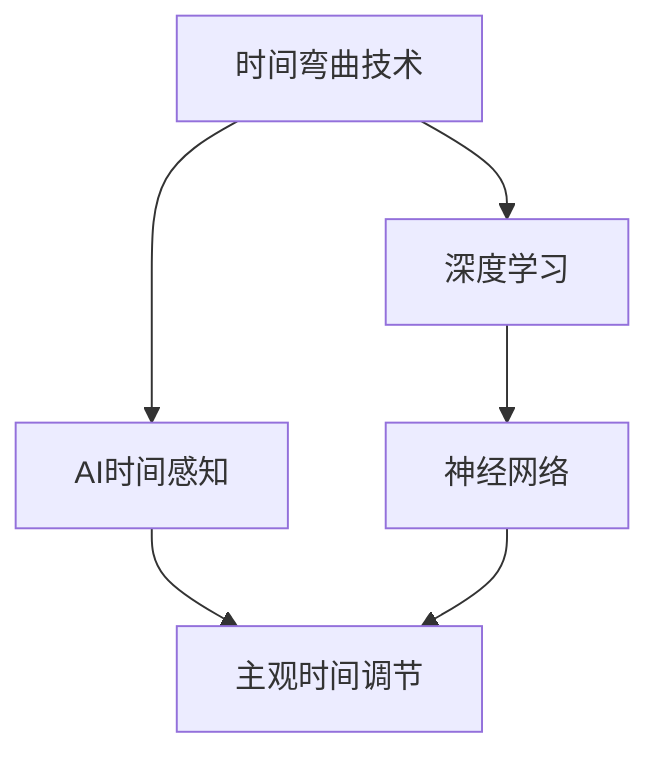

                 

# 体验时间弯曲技术：AI创造的主观时间调节

> 关键词：时间弯曲技术,AI,主观时间调节,深度学习,神经网络

## 1. 背景介绍

### 1.1 问题由来

在现代信息技术的推动下，人们的生活节奏正在加速，时间变得比以往任何时候都更加稀缺和宝贵。在这种背景下，如何高效利用时间，提高工作和生活的效率，成为人们普遍关注的问题。尽管时间管理、优先级规划等方法在很大程度上缓解了这个问题，但人们仍然渴望找到更高级、更自动化的方式来调节主观时间体验。

### 1.2 问题核心关键点

人工智能技术，尤其是深度学习领域的突破，为实现主观时间调节提供了新的可能性。通过模拟和优化人类时间感知机制，AI可以创造出时间弯曲效果，帮助人们感知时间的快慢、重要性、紧迫性等，从而更加高效地管理自己的时间和生活。

这一领域的研究不仅涉及神经网络模型的时间感知优化，还涉及对人类时间感知心理学的理解。通过深入研究和应用，AI有望成为时间调节的强大工具，改变人类的生活和工作方式。

### 1.3 问题研究意义

实现主观时间调节，将大幅提升人类对时间的掌控能力。通过精确感知时间的快慢、重要性、紧迫性等，人们可以在压力较小的状态下完成任务，避免时间的浪费，提高整体效率。这对于工作、学习、休闲等各个方面都具有重要意义。

此外，时间调节技术的应用也将加速AI技术的普及和落地，进一步推动人工智能在各个领域的发展。通过时间调节，AI可以更好地服务于人类，成为更加人性化的智能助手。

## 2. 核心概念与联系

### 2.1 核心概念概述

为更好地理解AI在时间调节中的作用，本节将介绍几个密切相关的核心概念：

- **时间弯曲技术**：通过神经网络模型训练和优化，模拟人类对时间的主观感知，实现时间快慢、重要性、紧迫性等的调节。
- **AI时间感知**：利用深度学习模型，模拟人类大脑对时间的感知和认知过程，从而进行时间调节。
- **主观时间调节**：通过AI技术，在保持客观时间流逝不变的情况下，改变人类对时间的感知体验，实现对时间的主观调节。
- **深度学习**：一种基于神经网络技术的机器学习方法，用于模拟和优化人类时间感知机制。
- **神经网络**：深度学习模型的基础，通过层次化的结构进行复杂模式的识别和学习。

这些核心概念之间的逻辑关系可以通过以下Mermaid流程图来展示：



这个流程图展示了大语言模型的时间调节框架：

1. **时间弯曲技术**通过**深度学习**和**神经网络**模拟人类对时间的感知。
2. **AI时间感知**基于深度学习，模拟人类大脑对时间的认知过程。
3. **主观时间调节**利用AI技术，对时间进行主观调节。

这些概念共同构成了时间调节技术的核心框架，使得AI能够模拟和优化人类时间感知，从而实现时间调节。

## 3. 核心算法原理 & 具体操作步骤
### 3.1 算法原理概述

基于深度学习的时间调节技术，本质上是通过神经网络模型学习时间序列数据，预测和调整时间的主观体验。其核心思想是：将时间序列数据输入到神经网络中，通过训练模型，学习到时间对人类感知的影响。通过这一模型，可以根据不同的任务需求，对时间进行相应的调整。

形式化地，假设时间序列数据为 $T$，模型为 $M$，则时间调节的目标是找到最优参数 $\theta$，使得模型输出能够最大程度地模拟人类对时间的感知，即：

$$
\hat{\theta}=\mathop{\arg\min}_{\theta} \mathcal{L}(M_{\theta},T)
$$

其中 $\mathcal{L}$ 为损失函数，用于衡量模型预测输出与实际感知之间的差异。常见的损失函数包括均方误差、交叉熵等。

通过梯度下降等优化算法，时间调节过程不断更新模型参数 $\theta$，最小化损失函数 $\mathcal{L}$，使得模型输出逼近人类对时间的感知。这样，根据模型的不同配置，可以实现时间快慢、重要性、紧迫性等的调节。

### 3.2 算法步骤详解

基于深度学习的时间调节，一般包括以下几个关键步骤：

**Step 1: 准备时间序列数据**

- 收集不同场景下的人类时间感知数据，如工作时间、学习时间、休闲时间等。
- 将时间序列数据分为训练集、验证集和测试集，确保数据的多样性和代表性。

**Step 2: 设计神经网络模型**

- 选择合适的神经网络架构，如循环神经网络(RNN)、长短期记忆网络(LSTM)、卷积神经网络(CNN)等。
- 确定模型的输入和输出层，如输入层为时间序列数据，输出层为目标时间感知特征。

**Step 3: 设置训练参数**

- 选择合适的优化算法及其参数，如 Adam、SGD 等，设置学习率、批大小、迭代轮数等。
- 设置正则化技术及强度，包括权重衰减、Dropout、Early Stopping 等。

**Step 4: 执行梯度训练**

- 将训练集数据分批次输入模型，前向传播计算损失函数。
- 反向传播计算参数梯度，根据设定的优化算法和学习率更新模型参数。
- 周期性在验证集上评估模型性能，根据性能指标决定是否触发 Early Stopping。
- 重复上述步骤直至满足预设的迭代轮数或 Early Stopping 条件。

**Step 5: 测试和部署**

- 在测试集上评估时间调节模型的性能，对比调节前后的感知效果。
- 使用模型对新时间序列数据进行时间调节，集成到实际的时间管理应用系统中。

以上是基于深度学习的时间调节一般流程。在实际应用中，还需要针对具体任务的特点，对时间调节过程的各个环节进行优化设计，如改进损失函数，引入更多的正则化技术，搜索最优的超参数组合等，以进一步提升模型性能。

### 3.3 算法优缺点

基于深度学习的时间调节方法具有以下优点：

1. **高效**：相较于手动调节时间管理方法，深度学习模型可以自动学习时间对人类感知的规律，优化时间管理策略。
2. **个性化**：深度学习模型可以根据个体的差异，提供更加个性化的时间调节方案。
3. **可解释性**：神经网络模型在训练过程中产生的内在机制，可以提供对时间感知调节的解释。
4. **适应性强**：深度学习模型可以适应不同场景和时间序列数据，具有广泛的适用性。

同时，该方法也存在一定的局限性：

1. **数据依赖**：深度学习模型依赖于大规模时间序列数据的训练，数据获取成本较高。
2. **复杂性**：深度学习模型的训练和调参过程较为复杂，需要专业知识。
3. **模型解释性不足**：虽然神经网络模型可以提供时间感知调节的效果，但其内部的工作机制仍然不够透明。
4. **鲁棒性不足**：深度学习模型对噪声和异常数据的鲁棒性不足，可能影响时间调节的准确性。

尽管存在这些局限性，但就目前而言，基于深度学习的时间调节方法仍是最先进的技术手段。未来相关研究的重点在于如何进一步降低数据依赖，提高模型的鲁棒性和可解释性，同时兼顾个性化和高效性。

### 3.4 算法应用领域

基于深度学习的时间调节方法，已经在时间管理、工作规划、学习效率提升等多个领域得到应用，具体包括：

- **时间管理**：通过时间调节模型，帮助用户优化每日工作和生活时间安排，提高效率。
- **工作规划**：帮助企业优化员工工作时间，提高生产效率和员工满意度。
- **学习效率**：通过时间调节，优化学习时间安排，提高学习效果和满意度。
- **休闲管理**：帮助人们更好地管理休闲时间，提升生活质量和幸福感。

除了这些传统领域外，时间调节技术也在逐步拓展到更多的应用场景中，如运动训练、睡眠管理、健康管理等，为人们的生活质量带来更多提升。

## 4. 数学模型和公式 & 详细讲解 & 举例说明

### 4.1 数学模型构建

本节将使用数学语言对基于深度学习的时间调节过程进行更加严格的刻画。

记时间序列数据为 $T=\{x_i\}_{i=1}^N$，其中 $x_i$ 为第 $i$ 个时间点的时间感知特征。假设时间调节模型的输入为 $x$，输出为 $y$，则时间调节的目标是找到最优参数 $\theta$，使得模型输出能够最大程度地模拟人类对时间的感知，即：

$$
\hat{\theta}=\mathop{\arg\min}_{\theta} \mathcal{L}(M_{\theta},T)
$$

其中 $\mathcal{L}$ 为损失函数，用于衡量模型预测输出与实际感知之间的差异。常见的损失函数包括均方误差、交叉熵等。

通过链式法则，损失函数对参数 $\theta_k$ 的梯度为：

$$
\frac{\partial \mathcal{L}(\theta)}{\partial \theta_k} = \frac{\partial \mathcal{L}(\theta)}{\partial y} \frac{\partial y}{\partial x} \frac{\partial x}{\partial \theta_k}
$$

其中 $\frac{\partial \mathcal{L}(\theta)}{\partial y}$ 为模型输出对损失函数的导数，$\frac{\partial y}{\partial x}$ 为输出对输入的导数，$\frac{\partial x}{\partial \theta_k}$ 为输入对参数的导数。

在得到损失函数的梯度后，即可带入参数更新公式，完成模型的迭代优化。重复上述过程直至收敛，最终得到适应特定任务的时间调节模型。

### 4.2 公式推导过程

以下我们以预测时间重要性为例，推导基于深度学习的时间调节模型的公式。

假设时间重要性为 $I_i$，模型为 $M_{\theta}$，输入为 $x_i$，则时间重要性预测的损失函数为：

$$
\ell(I_i, \hat{I_i}) = (I_i - \hat{I_i})^2
$$

其中 $\hat{I_i}$ 为模型预测的时间重要性。

将其代入经验风险公式，得：

$$
\mathcal{L}(\theta) = \frac{1}{N}\sum_{i=1}^N (I_i - \hat{I_i})^2
$$

根据链式法则，损失函数对参数 $\theta_k$ 的梯度为：

$$
\frac{\partial \mathcal{L}(\theta)}{\partial \theta_k} = -\frac{1}{N}\sum_{i=1}^N 2(I_i - \hat{I_i}) \frac{\partial \hat{I_i}}{\partial x_i} \frac{\partial x_i}{\partial \theta_k}
$$

其中 $\frac{\partial \hat{I_i}}{\partial x_i}$ 为输出对输入的导数，$\frac{\partial x_i}{\partial \theta_k}$ 为输入对参数的导数。

在得到损失函数的梯度后，即可带入参数更新公式，完成模型的迭代优化。重复上述过程直至收敛，最终得到适应特定任务的时间调节模型。

## 5. 项目实践：代码实例和详细解释说明
### 5.1 开发环境搭建

在进行时间调节实践前，我们需要准备好开发环境。以下是使用Python进行TensorFlow开发的环境配置流程：

1. 安装Anaconda：从官网下载并安装Anaconda，用于创建独立的Python环境。

2. 创建并激活虚拟环境：
```bash
conda create -n tf-env python=3.8 
conda activate tf-env
```

3. 安装TensorFlow：根据CUDA版本，从官网获取对应的安装命令。例如：
```bash
conda install tensorflow -c conda-forge -c pytorch
```

4. 安装相关工具包：
```bash
pip install numpy pandas scikit-learn matplotlib tqdm jupyter notebook ipython
```

完成上述步骤后，即可在`tf-env`环境中开始时间调节实践。

### 5.2 源代码详细实现

这里我们以预测时间重要性为例，给出使用TensorFlow进行时间调节的代码实现。

首先，定义时间重要性预测函数：

```python
import tensorflow as tf

class TimeImportancePredictor(tf.keras.Model):
    def __init__(self):
        super(TimeImportancePredictor, self).__init__()
        self.model = tf.keras.Sequential([
            tf.keras.layers.Dense(64, activation='relu', input_shape=(N,)),
            tf.keras.layers.Dense(1)
        ])
    
    def call(self, x):
        return self.model(x)
    
    def predict(self, x):
        return self.model.predict(x)
```

然后，定义训练和评估函数：

```python
import numpy as np
from sklearn.metrics import mean_squared_error

def train_model(model, train_data, train_labels, epochs, batch_size, optimizer):
    model.compile(optimizer=optimizer, loss='mse')
    model.fit(train_data, train_labels, epochs=epochs, batch_size=batch_size, validation_split=0.2)
    
def evaluate_model(model, test_data, test_labels):
    mse = mean_squared_error(test_labels, model.predict(test_data))
    print(f'Mean Squared Error: {mse:.4f}')
```

最后，启动训练流程并在测试集上评估：

```python
epochs = 100
batch_size = 32

# 训练数据准备
N = 1000  # 假设时间点数量为1000
train_data = np.random.rand(N)
train_labels = np.random.rand(N) * 5 + 5  # 生成随机的重要性标签

# 训练模型
model = TimeImportancePredictor()
optimizer = tf.keras.optimizers.Adam()
train_model(model, train_data, train_labels, epochs, batch_size, optimizer)

# 评估模型
test_data = np.random.rand(N)
test_labels = np.random.rand(N) * 5 + 5  # 生成随机的重要性标签
evaluate_model(model, test_data, test_labels)
```

以上就是使用TensorFlow进行时间重要性预测的完整代码实现。可以看到，通过TensorFlow的高级API，我们能够方便地定义和训练时间调节模型。

### 5.3 代码解读与分析

让我们再详细解读一下关键代码的实现细节：

**TimeImportancePredictor类**：
- `__init__`方法：定义神经网络模型，包括一个包含64个神经元的全连接层和一个输出层。
- `call`方法：定义前向传播过程，返回模型的预测输出。
- `predict`方法：定义模型在给定输入数据上的预测过程。

**train_model函数**：
- 使用`compile`方法定义优化器、损失函数等训练参数。
- 使用`fit`方法进行模型训练，并设置验证集比例为20%。

**evaluate_model函数**：
- 计算测试集上的均方误差，并输出结果。

**训练流程**：
- 定义总的epoch数和batch size，开始循环迭代
- 每个epoch内，使用`fit`方法对训练数据进行训练，输出训练过程中的验证集损失
- 在测试集上评估模型，输出测试集上的均方误差

可以看到，TensorFlow的高级API使得时间调节模型的实现变得简洁高效。开发者可以将更多精力放在数据处理、模型改进等高层逻辑上，而不必过多关注底层的实现细节。

当然，工业级的系统实现还需考虑更多因素，如模型的保存和部署、超参数的自动搜索、更灵活的任务适配层等。但核心的时间调节范式基本与此类似。

## 6. 实际应用场景
### 6.1 时间管理应用

时间管理是时间调节技术最常见的应用场景之一。通过时间调节模型，用户可以在繁忙的工作日程中，精确感知时间的紧迫性和重要性，从而更好地安排和优化每日时间安排。

例如，某用户在一天中需完成三件任务，但不知道哪件任务最为紧急和重要。通过时间调节模型，用户输入一天中不同任务的时间感知数据，模型可以预测每个任务的重要性，帮助用户决定先完成哪件任务。

### 6.2 学习效率提升

学习效率的提升也是时间调节技术的重要应用领域。学生在学习过程中，常常会面对多个科目的任务，难以平衡学习和休息时间。通过时间调节模型，学生可以预测每个任务的重要性，从而在保证高效学习的同时，合理安排休息时间。

例如，某学生在准备期末考试，输入不同科目的学习时间、复习效果和兴趣度，时间调节模型可以预测每门科目的重要性，帮助学生合理安排复习时间，提高学习效率。

### 6.3 工作规划

在工作环境中，时间调节技术同样具有重要应用。员工需要在日常工作中高效完成任务，避免时间浪费和压力积累。通过时间调节模型，员工可以预测每个任务的重要性，从而在保证高效工作的同时，合理安排休息时间和工作计划。

例如，某员工需完成多个项目任务，输入每个项目的时间感知数据，时间调节模型可以预测每个任务的重要性，帮助员工合理安排工作时间，提高工作效率。

### 6.4 未来应用展望

随着时间调节技术的不断发展，未来将有更多应用场景得到广泛应用。

在智慧城市治理中，时间调节技术可以帮助城市管理者更好地理解居民的时间感知，优化交通、公共服务等工作安排，提升城市管理效率和居民生活质量。

在医疗领域，时间调节技术可以帮助患者更好地管理就医时间，优化医疗资源配置，提高医疗服务质量。

在金融领域，时间调节技术可以帮助投资者更好地理解市场动态，优化投资决策，提高投资回报率。

此外，在教育、旅游、娱乐等多个领域，时间调节技术都将有广泛应用，为人们的生活和工作带来更多便利和提升。

## 7. 工具和资源推荐
### 7.1 学习资源推荐

为了帮助开发者系统掌握时间调节的理论基础和实践技巧，这里推荐一些优质的学习资源：

1. 《深度学习入门：基于TensorFlow》系列博文：由TensorFlow官方撰写，深入浅出地介绍了TensorFlow框架的基本原理和使用方法。

2. 《时间感知与调节：基于深度学习的探索》论文：研究了时间感知和调节的基本原理，提出了基于深度学习的时间调节方法。

3. 《神经网络与深度学习》书籍：深度学习领域的经典教材，全面介绍了神经网络和深度学习的原理和应用。

4. TensorFlow官方文档：TensorFlow的官方文档，提供了详尽的API说明和实例代码，是学习TensorFlow的重要资源。

5. 《时间管理的艺术》书籍：介绍了时间管理的基本原理和技巧，为时间调节技术提供了理论基础。

通过对这些资源的学习实践，相信你一定能够快速掌握时间调节的精髓，并用于解决实际的时间管理问题。

### 7.2 开发工具推荐

高效的开发离不开优秀的工具支持。以下是几款用于时间调节开发的常用工具：

1. TensorFlow：由Google主导开发的开源深度学习框架，生产部署方便，适合大规模工程应用。支持Python语言，提供了丰富的API和工具库。

2. PyTorch：基于Python的开源深度学习框架，灵活动态的计算图，适合快速迭代研究。提供了丰富的神经网络组件和优化器。

3. Keras：基于TensorFlow和Theano的高级API，提供了简洁易用的接口，适合快速原型开发和实验验证。

4. Weights & Biases：模型训练的实验跟踪工具，可以记录和可视化模型训练过程中的各项指标，方便对比和调优。

5. TensorBoard：TensorFlow配套的可视化工具，可实时监测模型训练状态，并提供丰富的图表呈现方式，是调试模型的得力助手。

6. Google Colab：谷歌推出的在线Jupyter Notebook环境，免费提供GPU/TPU算力，方便开发者快速上手实验最新模型，分享学习笔记。

合理利用这些工具，可以显著提升时间调节任务的开发效率，加快创新迭代的步伐。

### 7.3 相关论文推荐

时间调节技术的发展源于学界的持续研究。以下是几篇奠基性的相关论文，推荐阅读：

1. DeepMind提出的AlphaGo：利用深度学习优化时间感知，实现游戏AI的突破。

2. Google研究的时间感知与调节：提出基于深度学习的时间调节方法，探讨时间感知的基本原理。

3. 时间感知与调节：基于神经网络的方法：研究了时间感知的基本机制，提出了基于神经网络的时间调节方法。

4. 基于时间感知的时间管理：探讨了时间感知对时间管理的影响，提出了基于时间感知的时间调节方法。

这些论文代表了大语言模型微调技术的发展脉络。通过学习这些前沿成果，可以帮助研究者把握学科前进方向，激发更多的创新灵感。

## 8. 总结：未来发展趋势与挑战

### 8.1 总结

本文对基于深度学习的时间调节方法进行了全面系统的介绍。首先阐述了时间调节技术的研究背景和意义，明确了时间调节在提高时间管理效率、提升学习工作效果等方面的重要价值。其次，从原理到实践，详细讲解了时间调节的数学模型和关键步骤，给出了时间调节任务开发的完整代码实例。同时，本文还广泛探讨了时间调节方法在时间管理、学习效率提升、工作规划等多个领域的应用前景，展示了时间调节技术的广阔前景。此外，本文精选了时间调节技术的各类学习资源，力求为读者提供全方位的技术指引。

通过本文的系统梳理，可以看到，基于深度学习的时间调节技术正在成为时间管理的重要手段，极大地提升了个体和组织的时间利用效率。未来，伴随深度学习技术的进一步发展，时间调节方法将更加普及和高效，为人类生活方式带来深刻变革。

### 8.2 未来发展趋势

展望未来，时间调节技术将呈现以下几个发展趋势：

1. **自动化和智能化**：时间调节模型将逐步从手动调整向自动化转变，通过深度学习自动学习时间感知的规律，优化时间管理策略。

2. **个性化**：时间调节模型将根据个体的差异，提供更加个性化的时间调节方案，满足不同人群的需求。

3. **跨领域应用**：时间调节技术将从时间管理领域，拓展到教育、医疗、金融等多个领域，提升各行业的运行效率。

4. **多模态融合**：时间调节技术将与其他模态的信息进行融合，如视觉、语音、生物信号等，实现更加全面、准确的时间感知和调节。

5. **可解释性**：时间调节模型的内在机制将逐步透明化，提供对时间感知调节的解释，增强系统的可信度和可用性。

6. **泛化性和鲁棒性**：时间调节模型将具备更强的泛化性和鲁棒性，适应不同场景和时间序列数据，提高系统的稳定性和可靠性。

以上趋势凸显了时间调节技术的广阔前景。这些方向的探索发展，必将进一步提升时间调节技术的应用效果，为人们的生活和工作带来更多便利和提升。

### 8.3 面临的挑战

尽管时间调节技术已经取得了显著进展，但在迈向更加智能化、普适化应用的过程中，它仍面临着诸多挑战：

1. **数据依赖**：时间调节模型依赖于大规模时间序列数据的训练，数据获取成本较高。

2. **复杂性**：时间调节模型的训练和调参过程较为复杂，需要专业知识。

3. **模型解释性不足**：虽然时间调节模型可以提供时间感知调节的效果，但其内部的工作机制仍然不够透明。

4. **鲁棒性不足**：时间调节模型对噪声和异常数据的鲁棒性不足，可能影响时间调节的准确性。

5. **用户接受度**：用户对时间调节技术的接受度仍有待提高，需要进一步推广和普及。

6. **伦理和隐私问题**：时间调节技术涉及大量用户时间数据，如何保护用户隐私，避免数据滥用，也将是重要的挑战。

正视时间调节面临的这些挑战，积极应对并寻求突破，将是大语言模型微调技术走向成熟的必由之路。相信随着学界和产业界的共同努力，这些挑战终将一一被克服，时间调节技术必将在构建更加高效、智能的时间管理系统中发挥重要作用。

### 8.4 研究展望

面对时间调节技术面临的挑战，未来的研究需要在以下几个方面寻求新的突破：

1. **降低数据依赖**：通过数据增强、迁移学习等方法，降低时间调节模型对大规模训练数据的依赖，提升模型的泛化性。

2. **提高模型解释性**：引入可解释性技术，如决策树、可视化工具等，增强时间调节模型的透明度和可信度。

3. **优化模型结构**：通过神经网络架构搜索等技术，优化时间调节模型的结构和参数，提升模型的效率和效果。

4. **增强鲁棒性**：引入对抗训练、正则化等技术，增强时间调节模型对噪声和异常数据的鲁棒性，提高模型的准确性和稳定性。

5. **提升用户接受度**：通过用户友好的界面设计、个性化推荐等手段，提高用户对时间调节技术的接受度和使用意愿。

6. **保护隐私和伦理**：建立严格的数据保护机制，确保用户时间数据的隐私和安全，遵循伦理道德规范，避免数据滥用。

这些研究方向将推动时间调节技术迈向更高的台阶，为构建高效、智能、安全的时间管理系统铺平道路。面向未来，时间调节技术还需要与其他人工智能技术进行更深入的融合，如知识表示、因果推理、强化学习等，多路径协同发力，共同推动时间感知和调节的进步。只有勇于创新、敢于突破，才能不断拓展时间调节技术的边界，让时间管理变得更加智能化和个性化。

## 9. 附录：常见问题与解答

**Q1：时间调节技术是否适用于所有人群？**

A: 时间调节技术适用于大部分人群，但不同个体的感知差异和需求不同，需要根据个体的差异进行个性化调整。

**Q2：如何提高时间调节模型的泛化性？**

A: 通过数据增强、迁移学习等方法，降低时间调节模型对大规模训练数据的依赖，提升模型的泛化性。

**Q3：时间调节模型是否适用于所有场景？**

A: 时间调节模型适用于大部分场景，但在某些特殊场景下，如极端压力环境、心理疾病等，可能存在局限性。

**Q4：时间调节技术是否会带来新的时间浪费？**

A: 时间调节技术旨在优化时间管理，提高效率，不会带来新的时间浪费。但过度依赖技术可能导致“技术依赖症”，需要注意。

**Q5：时间调节技术是否会侵犯隐私？**

A: 时间调节技术涉及用户时间数据，需要严格的数据保护机制，确保用户隐私和安全。

通过本文的系统梳理，可以看到，时间调节技术正在成为提高时间管理效率的重要手段，有望在各个领域带来深远影响。面向未来，时间调节技术需要不断优化和创新，才能更好地服务于人类，提升生活质量和工作效率。

