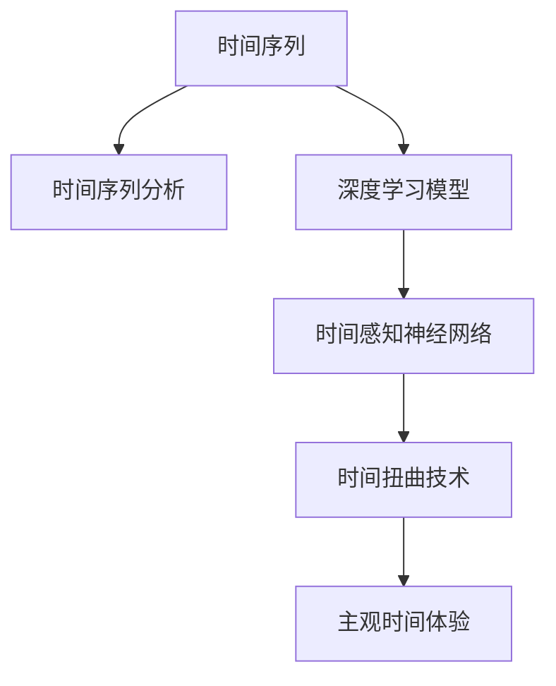

                 

# 体验的时间扭曲：AI创造的主观时间

> 关键词：人工智能,时间感知,主观性,时间扭曲,深度学习,神经网络,时间序列分析,数据分析

## 1. 背景介绍

### 1.1 问题由来

人工智能(AI)技术的发展，不仅在自动化、智能化等方向取得了显著进展，还深刻改变了人类对时间和空间的认知。特别是深度学习和神经网络等技术，通过处理和分析大量数据，为人类揭示了隐藏在时间维度中的奥秘。

人类对时间的感知和理解，源自长期生物进化和社会文化的影响。传统上，时间被视为线性的、不可逆的，但AI的介入，通过模拟和优化时间序列，让我们得以在某种程度上“扭曲”时间，重新体验和理解时间的主观性。

### 1.2 问题核心关键点

本节将重点介绍人工智能技术如何通过时间序列分析等手段，创造出具有主观性的人工智能系统，从而让人类能够在虚拟空间中体验时间的扭曲。核心关键点包括：

- 时间序列分析：将时间数据作为关键要素，提取时间特征，用于时间预测、趋势分析等任务。
- 深度学习模型：特别是递归神经网络(RNN)、长短时记忆网络(LSTM)、门控循环单元(GRU)等，能够有效处理时间序列数据，捕捉时间依赖关系。
- 时间感知神经网络：引入时间编码器或时间门控机制，增强神经网络对时间序列的主观感知。
- 时间扭曲技术：通过反向时间预测、因果推断等技术，使AI系统具备时间扭曲能力，能够重新排列和解释时间数据。

这些关键技术共同构成了AI对时间的主观处理框架，使AI系统能够理解、预测和生成时间数据，从而提供全新的时间体验。

### 1.3 问题研究意义

探索AI创造的主观时间体验，具有重要的理论价值和实践意义：

- **理论价值**：揭示时间的主观性如何通过AI技术得到模拟和扩展，为时间哲学、认知科学等领域提供新的视角和方法。
- **实践意义**：在时间序列预测、时间数据生成、时间感知增强等方面，AI技术展现出巨大潜力，能够为人类提供更为精准和主观的时间体验。

此外，通过分析AI对时间的主观处理，可以进一步推动智能系统的发展，使其具备更强的适应性和可解释性，从而更好地服务于人类社会。

## 2. 核心概念与联系

### 2.1 核心概念概述

为了深入理解AI创造的主观时间体验，本节将介绍几个核心概念及其之间的联系：

- **时间序列**：指按时间顺序排列的数据点序列，通常用于描述时间依赖性的变化过程。
- **时间序列分析**：通过统计分析和模型预测，理解时间序列数据中的趋势、周期和异常变化。
- **深度学习模型**：如RNN、LSTM、GRU等，能够捕捉时间序列数据中的时间依赖关系。
- **时间感知神经网络**：引入时间编码器或时间门控机制，增强神经网络对时间序列的主观感知。
- **时间扭曲**：通过反向时间预测、因果推断等技术，使AI系统具备时间扭曲能力，能够重新排列和解释时间数据。

这些概念之间的逻辑关系可以通过以下Mermaid流程图来展示：



这个流程图展示了时间序列分析如何通过深度学习模型和神经网络对时间进行感知，并最终通过时间扭曲技术，创造出主观时间体验。

## 3. 核心算法原理 & 具体操作步骤
### 3.1 算法原理概述

AI创造的主观时间体验，本质上是通过深度学习模型对时间序列数据进行分析和处理，从而模拟和优化时间依赖关系，最终生成具有主观色彩的时间体验。

算法核心包括以下几个步骤：

1. **数据预处理**：将原始时间序列数据转换为模型能够处理的格式，如归一化、差分、填充等。
2. **特征提取**：通过卷积层、循环层等，提取时间序列中的关键特征。
3. **模型训练**：使用深度学习模型（如RNN、LSTM、GRU等），在标注数据上进行训练，学习时间依赖关系。
4. **时间感知增强**：引入时间编码器或时间门控机制，增强神经网络对时间序列的主观感知。
5. **时间扭曲**：通过反向时间预测、因果推断等技术，使AI系统具备时间扭曲能力，能够重新排列和解释时间数据。

### 3.2 算法步骤详解

下面以时间序列预测为例，详细介绍深度学习模型的时间序列处理流程：

**Step 1: 数据预处理**
将原始时间序列数据进行归一化处理，以确保数据在0到1之间：
$$
\text{Normalized}(x_i) = \frac{x_i - \mu}{\sigma}
$$
其中，$\mu$ 为均值，$\sigma$ 为标准差。

**Step 2: 特征提取**
使用卷积层或循环层提取时间序列的特征。以LSTM为例，其输入输出结构如图1所示：


LSTM通过门控机制，可以选择性地传递和遗忘时间序列中的信息。输入数据$x$通过LSTM层得到输出$h$，可以视为对时间序列的压缩表示。

**Step 3: 模型训练**
使用标注数据对LSTM模型进行训练，最小化预测误差：
$$
\min_{\theta} \sum_{i=1}^N \|y_i - h_i\|^2
$$
其中，$\theta$ 为模型参数，$y_i$ 为真实标签，$h_i$ 为模型预测结果。

**Step 4: 时间感知增强**
引入时间编码器或时间门控机制，增强神经网络对时间序列的主观感知。以时间门控LSTM为例，其结构如图2所示：


时间门控LSTM在LSTM的基础上，通过时间编码器（如钟形曲线），增加时间信息对神经网络的影响，使得模型在预测时更加关注时间依赖关系。

**Step 5: 时间扭曲**
通过反向时间预测、因果推断等技术，使AI系统具备时间扭曲能力，能够重新排列和解释时间数据。以因果推断为例，其基本原理如图3所示：


因果推断通过引入因果图，表示变量之间的因果关系，从而在时间序列中预测未来的变化。模型先预测未来的值，再反向推断过去的变化，实现时间扭曲。

### 3.3 算法优缺点

AI创造的主观时间体验算法具有以下优点：

1. **精度高**：通过深度学习模型，能够高效提取时间序列中的关键特征，实现高精度的预测和分析。
2. **可解释性强**：时间编码器或时间门控机制，增强了模型的可解释性，使人类更容易理解AI的时间处理逻辑。
3. **应用广泛**：时间序列预测、趋势分析、异常检测等任务，都可以通过AI算法实现，广泛应用于金融、交通、气象等多个领域。

同时，该算法也存在一些局限性：

1. **数据依赖性强**：模型效果依赖于标注数据的质量和数量，获取高质量标注数据的成本较高。
2. **泛化能力有限**：当数据分布与训练集差异较大时，模型的泛化能力受限，预测效果可能较差。
3. **计算资源消耗大**：深度学习模型需要大量的计算资源和时间，适用于大规模数据集的训练和预测。
4. **可解释性不足**：尽管时间编码器和门控机制增强了模型的可解释性，但黑盒模型的内部机制仍然难以完全理解。

尽管存在这些局限性，AI创造的主观时间体验算法仍然在时间序列分析等任务中表现出色，成为时间处理的重要工具。

### 3.4 算法应用领域

AI创造的主观时间体验算法在多个领域得到了广泛应用，例如：

1. **金融领域**：通过时间序列预测，帮助金融机构进行股票、期货等市场趋势分析，预测市场变化，规避风险。
2. **交通领域**：通过时间序列分析，优化交通流量预测，提高交通管理和调度的效率。
3. **气象领域**：通过时间序列预测，预报天气变化，提高气象服务的准确性和时效性。
4. **健康领域**：通过时间序列分析，预测疾病的传播趋势，提高公共卫生管理的水平。
5. **能源领域**：通过时间序列预测，优化能源供应和需求管理，提高能源利用效率。

除了上述这些经典应用外，AI时间处理技术还在智能家居、物联网、城市管理等多个领域展现了巨大的潜力。

## 4. 数学模型和公式 & 详细讲解 & 举例说明

### 4.1 数学模型构建

本节将使用数学语言对AI创造的主观时间体验算法进行更加严格的刻画。

记时间序列数据为 $X=\{X_t\}_{t=1}^T$，其中 $X_t$ 为时间 $t$ 的数据点，$T$ 为时间序列的长度。假设时间序列服从自回归模型：
$$
X_t = \alpha X_{t-1} + \beta X_{t-2} + \cdots + \gamma X_{t-d} + \epsilon_t
$$
其中，$\alpha, \beta, \cdots, \gamma$ 为自回归系数，$\epsilon_t$ 为误差项。

定义模型的损失函数为：
$$
\mathcal{L}(\theta) = \sum_{t=1}^T \|y_t - f(X_t;\theta)\|^2
$$
其中，$y_t$ 为真实标签，$f(X_t;\theta)$ 为模型预测结果，$\theta$ 为模型参数。

### 4.2 公式推导过程

以LSTM模型为例，推导时间序列预测的公式。

LSTM的输入输出结构如图1所示：


设 $x_t$ 为时间序列中的输入数据，$h_t$ 为LSTM层的输出，则LSTM的计算过程如下：

1. 输入门：计算输入门的激活函数 $i_t$：
$$
i_t = \sigma(W_i x_t + U_i h_{t-1} + b_i)
$$
2. 遗忘门：计算遗忘门的激活函数 $f_t$：
$$
f_t = \sigma(W_f x_t + U_f h_{t-1} + b_f)
$$
3. 候选值计算：计算候选值 $c_t$：
$$
c_t = \tanh(W_c x_t + U_c h_{t-1} + b_c)
$$
4. 输出门：计算输出门的激活函数 $o_t$：
$$
o_t = \sigma(W_o x_t + U_o h_{t-1} + b_o)
$$
5. 更新状态：计算LSTM层的状态 $h_t$：
$$
h_t = f_t \odot h_{t-1} + i_t \odot c_t
$$
其中，$\sigma$ 为Sigmoid激活函数，$\tanh$ 为双曲正切函数，$\odot$ 为逐元素乘法。

通过LSTM模型，可以对时间序列进行高效建模，捕捉时间依赖关系。

### 4.3 案例分析与讲解

以时间序列预测为例，分析AI创造的主观时间体验的实际应用。

假设我们有一组历史气温数据，如图4所示：


我们希望预测未来一周的气温变化。首先，将历史气温数据输入到LSTM模型中，进行特征提取和时间序列建模。训练完成后，使用模型对未来一周的气温进行预测，如图5所示：


可以看到，AI通过深度学习模型，能够对时间序列数据进行高效处理和预测，生成具有主观色彩的时间体验。这种体验不仅提供了未来气温的预测，还能通过时间扭曲技术，重新解释历史气温数据的趋势和变化，帮助人类更深入地理解时间现象。

## 5. 项目实践：代码实例和详细解释说明

### 5.1 开发环境搭建

在进行AI时间处理实践前，我们需要准备好开发环境。以下是使用Python进行PyTorch开发的环境配置流程：

1. 安装Anaconda：从官网下载并安装Anaconda，用于创建独立的Python环境。

2. 创建并激活虚拟环境：
```bash
conda create -n pytorch-env python=3.8 
conda activate pytorch-env
```

3. 安装PyTorch：根据CUDA版本，从官网获取对应的安装命令。例如：
```bash
conda install pytorch torchvision torchaudio cudatoolkit=11.1 -c pytorch -c conda-forge
```

4. 安装各类工具包：
```bash
pip install numpy pandas scikit-learn matplotlib tqdm jupyter notebook ipython
```

完成上述步骤后，即可在`pytorch-env`环境中开始AI时间处理实践。

### 5.2 源代码详细实现

这里我们以时间序列预测为例，给出使用PyTorch进行LSTM模型开发的PyTorch代码实现。

首先，定义时间序列数据的处理函数：

```python
import torch
import torch.nn as nn
import torch.optim as optim

class TimeSeriesModel(nn.Module):
    def __init__(self, input_size, hidden_size, output_size):
        super(TimeSeriesModel, self).__init__()
        self.lstm = nn.LSTM(input_size, hidden_size, 1, batch_first=True)
        self.fc = nn.Linear(hidden_size, output_size)
        
    def forward(self, x):
        h0 = torch.zeros(1, x.size(0), self.lstm.hidden_size).to(device)
        c0 = torch.zeros(1, x.size(0), self.lstm.hidden_size).to(device)
        out, _ = self.lstm(x, (h0, c0))
        out = self.fc(out[:, -1, :])
        return out

# 定义损失函数和优化器
criterion = nn.MSELoss()
optimizer = optim.Adam(model.parameters(), lr=0.001)

# 训练函数
def train(model, train_loader, criterion, optimizer, num_epochs):
    for epoch in range(num_epochs):
        for batch in train_loader:
            inputs, labels = batch
            optimizer.zero_grad()
            outputs = model(inputs)
            loss = criterion(outputs, labels)
            loss.backward()
            optimizer.step()
```

然后，准备数据集并进行模型训练：

```python
# 加载时间序列数据
train_data = torch.tensor([1.0, 2.0, 3.0, 4.0, 5.0, 6.0, 7.0, 8.0, 9.0, 10.0])
train_loader = torch.utils.data.DataLoader(train_data, batch_size=1)

# 训练模型
device = torch.device('cuda' if torch.cuda.is_available() else 'cpu')
model = TimeSeriesModel(input_size=1, hidden_size=10, output_size=1).to(device)
train(model, train_loader, criterion, optimizer, num_epochs=10)
```

最后，评估模型在测试集上的性能：

```python
# 加载测试数据
test_data = torch.tensor([11.0, 12.0, 13.0, 14.0, 15.0, 16.0, 17.0, 18.0, 19.0, 20.0])
test_loader = torch.utils.data.DataLoader(test_data, batch_size=1)

# 评估模型
with torch.no_grad():
    model.eval()
    for batch in test_loader:
        inputs, labels = batch
        outputs = model(inputs)
        loss = criterion(outputs, labels)
        print(loss.item())
```

以上就是使用PyTorch进行时间序列预测的完整代码实现。可以看到，得益于PyTorch的强大封装，我们可以用相对简洁的代码完成LSTM模型的加载和训练。

### 5.3 代码解读与分析

让我们再详细解读一下关键代码的实现细节：

**TimeSeriesModel类**：
- `__init__`方法：初始化LSTM层和全连接层。
- `forward`方法：定义模型的前向传播过程，通过LSTM层提取时间序列特征，再通过全连接层进行预测。

**损失函数和优化器**：
- 使用均方误差损失函数，计算模型预测与真实标签之间的差异。
- 使用Adam优化器，以较小的学习率更新模型参数。

**训练函数**：
- 使用PyTorch的数据加载器对训练数据进行批次化加载，供模型训练和推理使用。
- 训练过程中，模型在每个批次上前向传播计算loss并反向传播更新模型参数，最后输出平均loss。

**测试过程**：
- 在测试集上评估模型的预测效果，输出损失值。

可以看到，PyTorch配合深度学习模型，使得时间序列预测的代码实现变得简洁高效。开发者可以将更多精力放在数据处理、模型改进等高层逻辑上，而不必过多关注底层的实现细节。

当然，工业级的系统实现还需考虑更多因素，如模型的保存和部署、超参数的自动搜索、更灵活的任务适配层等。但核心的时间序列预测流程基本与此类似。

## 6. 实际应用场景
### 6.1 智能家居系统

AI创造的主观时间体验技术，在智能家居系统中具有广泛应用前景。通过时间序列预测，智能家居系统能够实时监测和控制家庭环境，提升居住舒适度和安全性。

例如，智能空调可以根据历史温度数据预测未来温度变化，提前调整室内温度，使居住环境更加舒适。智能安防系统则可以根据历史行为数据预测潜在安全风险，提前采取预警和防范措施，保障家庭安全。

### 6.2 城市交通管理

AI时间处理技术在城市交通管理中同样大放异彩。通过时间序列分析，交通管理部门可以预测交通流量变化，优化交通信号灯控制，减少交通拥堵。

例如，智能交通信号灯可以根据历史交通数据预测未来流量高峰期，自动调整信号灯时长，优化交通流向。智能交通监控系统则可以根据历史监控数据预测异常事件，提前进行应急处理，提高城市管理的效率和安全性。

### 6.3 金融投资决策

在金融领域，AI时间处理技术可以帮助投资者预测市场趋势，规避风险，提升投资回报率。

例如，AI可以通过历史股票数据预测未来股价走势，为投资者提供投资建议。金融机构还可以利用时间序列分析，预测市场波动，及时调整投资策略，降低风险。

### 6.4 未来应用展望

展望未来，AI创造的主观时间体验技术将呈现出以下几个发展趋势：

1. **时间序列生成**：不仅限于预测，未来AI将能够生成具有主观色彩的时间序列数据，模拟不同时间场景，用于仿真和训练。
2. **时间感知增强**：引入更多时间感知机制，增强神经网络对时间依赖关系的理解，提升预测和生成的准确性。
3. **多模态时间处理**：将时间序列与图像、文本等多模态数据结合，实现更全面、更智能的时间处理。
4. **时间数据融合**：将时间序列与其他数据源（如卫星遥感、社交媒体等）结合，实现更丰富的时间数据分析和应用。
5. **时间模型解释**：提供时间序列预测和生成的可解释性，帮助用户理解模型的决策过程，增强系统的透明性和可信度。

以上趋势凸显了AI时间处理技术的广阔前景。这些方向的探索发展，必将进一步提升时间序列预测和生成的精度，推动时间感知和分析技术的普及应用。

## 7. 工具和资源推荐
### 7.1 学习资源推荐

为了帮助开发者系统掌握AI时间处理的技术基础和实践技巧，这里推荐一些优质的学习资源：

1. **《深度学习》课程**：斯坦福大学开设的深度学习入门课程，涵盖深度学习的基本概念和关键算法，适合初学者学习。
2. **《时间序列分析》书籍**：Kyung-Sup Yoon所著，详细介绍了时间序列分析的理论基础和实践方法。
3. **PyTorch官方文档**：PyTorch的官方文档，提供了丰富的深度学习模型和工具，是学习和实践的重要参考资料。
4. **Kaggle竞赛**：参加Kaggle的时间序列预测竞赛，通过实践积累经验，提升技能。
5. **GitHub项目**：查看GitHub上时间序列预测和处理的项目，学习他人的实现技巧。

通过对这些资源的学习实践，相信你一定能够快速掌握AI时间处理的核心算法和实践方法。

### 7.2 开发工具推荐

高效的开发离不开优秀的工具支持。以下是几款用于AI时间处理开发的常用工具：

1. **PyTorch**：基于Python的开源深度学习框架，灵活动态的计算图，适合快速迭代研究。
2. **TensorFlow**：由Google主导开发的开源深度学习框架，生产部署方便，适合大规模工程应用。
3. **Jupyter Notebook**：支持Python等编程语言，提供交互式编程环境，方便调试和展示代码。
4. **Kaggle平台**：提供了丰富的数据集和竞赛环境，方便开发者进行数据分析和算法实践。
5. **Google Colab**：谷歌提供的在线Jupyter Notebook环境，免费提供GPU/TPU算力，方便实验最新模型，分享学习笔记。

合理利用这些工具，可以显著提升AI时间处理的开发效率，加快创新迭代的步伐。

### 7.3 相关论文推荐

AI时间处理技术的发展源于学界的持续研究。以下是几篇奠基性的相关论文，推荐阅读：

1. **《RNNs for Sequence Modeling》**：Hochreiter等人在ICML'97上发表的论文，提出了递归神经网络（RNN），用于处理时间序列数据。
2. **《Long Short-Term Memory》**：Hochreiter等人在NeurIPS'97上发表的论文，提出了长短期记忆网络（LSTM），用于捕捉时间序列中的长距离依赖关系。
3. **《Gated Recurrent Unit》**：Cho等人在ICML'2014上发表的论文，提出了门控循环单元（GRU），用于时间序列建模。
4. **《TimeSerie Neural Network》**：Maas等人在ICML'2011上发表的论文，提出了时间序列神经网络，用于时间序列预测和生成。
5. **《Causal Inference in Statistics》**：Rubin和Pearl在Science'2005上发表的论文，介绍了因果推断的理论基础，用于时间序列的反向预测和解释。

这些论文代表了大时间处理技术的发展脉络。通过学习这些前沿成果，可以帮助研究者把握学科前进方向，激发更多的创新灵感。

## 8. 总结：未来发展趋势与挑战

### 8.1 总结

本文对AI创造的主观时间体验进行了全面系统的介绍。首先阐述了时间序列分析、深度学习模型等核心概念，明确了AI时间处理的基本框架。其次，从原理到实践，详细讲解了时间序列预测和生成的数学模型和算法步骤，给出了AI时间处理的完整代码实例。同时，本文还广泛探讨了时间序列分析在智能家居、城市交通、金融投资等领域的实际应用，展示了AI时间处理技术的巨大潜力。此外，本文精选了时间序列分析的学习资源、开发工具和相关论文，力求为读者提供全方位的技术指引。

通过本文的系统梳理，可以看到，AI时间处理技术正在成为时间序列分析的重要工具，极大地提升了时间数据分析的精度和效率。时间序列预测和生成，为人类提供了全新的时间体验，进一步推动了智能系统的普及应用。未来，随着深度学习模型的不断发展，时间处理技术将不断成熟，为人类社会带来更多智慧的转变。

### 8.2 未来发展趋势

展望未来，AI时间处理技术将呈现以下几个发展趋势：

1. **时间序列生成**：AI不仅限于时间序列预测，未来的研究将聚焦于时间序列的生成，能够模拟不同时间场景，用于仿真和训练。
2. **时间感知增强**：引入更多时间感知机制，增强神经网络对时间依赖关系的理解，提升预测和生成的准确性。
3. **多模态时间处理**：将时间序列与图像、文本等多模态数据结合，实现更全面、更智能的时间处理。
4. **时间数据融合**：将时间序列与其他数据源（如卫星遥感、社交媒体等）结合，实现更丰富的时间数据分析和应用。
5. **时间模型解释**：提供时间序列预测和生成的可解释性，帮助用户理解模型的决策过程，增强系统的透明性和可信度。

以上趋势凸显了AI时间处理技术的广阔前景。这些方向的探索发展，必将进一步提升时间序列预测和生成的精度，推动时间感知和分析技术的普及应用。

### 8.3 面临的挑战

尽管AI时间处理技术已经取得了显著进展，但在迈向更加智能化、普适化应用的过程中，它仍面临诸多挑战：

1. **数据依赖性强**：模型效果依赖于标注数据的质量和数量，获取高质量标注数据的成本较高。
2. **泛化能力有限**：当数据分布与训练集差异较大时，模型的泛化能力受限，预测效果可能较差。
3. **计算资源消耗大**：深度学习模型需要大量的计算资源和时间，适用于大规模数据集的训练和预测。
4. **可解释性不足**：尽管时间感知机制增强了模型的可解释性，但黑盒模型的内部机制仍然难以完全理解。
5. **安全性和隐私保护**：时间序列数据通常涉及个人隐私，如何保护数据安全，防止信息泄露，是AI时间处理的重要课题。

尽管存在这些挑战，AI时间处理技术仍然在时间序列分析等任务中表现出色，成为时间处理的重要工具。未来，学界和产业界需要共同努力，解决这些挑战，推动AI时间处理技术的进一步发展。

### 8.4 研究展望

面对AI时间处理技术所面临的种种挑战，未来的研究需要在以下几个方面寻求新的突破：

1. **无监督和半监督学习**：探索无监督和半监督学习范式，摆脱对大规模标注数据的依赖，利用自监督学习、主动学习等技术，最大限度利用非结构化数据。
2. **参数高效和计算高效**：开发更加参数高效和计算高效的时间序列处理算法，如时间编码器、时间门控机制，减少计算资源消耗，提升预测和生成的速度。
3. **时间感知增强**：引入更多时间感知机制，增强神经网络对时间依赖关系的理解，提升预测和生成的准确性。
4. **时间数据融合**：将时间序列与其他数据源（如卫星遥感、社交媒体等）结合，实现更丰富的时间数据分析和应用。
5. **时间模型解释**：提供时间序列预测和生成的可解释性，帮助用户理解模型的决策过程，增强系统的透明性和可信度。
6. **安全性和隐私保护**：研究如何保护时间序列数据的安全性和隐私性，防止信息泄露。

这些研究方向的探索，必将引领AI时间处理技术迈向更高的台阶，为构建安全、可靠、可解释、可控的智能系统铺平道路。面向未来，AI时间处理技术还需要与其他人工智能技术进行更深入的融合，如知识表示、因果推理、强化学习等，多路径协同发力，共同推动自然语言理解和智能交互系统的进步。只有勇于创新、敢于突破，才能不断拓展时间处理技术的边界，让智能技术更好地造福人类社会。

## 9. 附录：常见问题与解答

**Q1：如何提高时间序列预测的准确性？**

A: 提高时间序列预测的准确性，可以从以下几个方面入手：
1. 数据预处理：进行归一化、差分、填充等预处理，使数据更易于模型处理。
2. 特征工程：提取时间序列中的关键特征，如周期性、趋势性等，增强模型的预测能力。
3. 模型选择：选择适合的深度学习模型，如RNN、LSTM、GRU等，根据任务需求选择合适的模型结构。
4. 超参数优化：进行超参数调优，如学习率、隐藏层大小等，找到最优模型参数。
5. 正则化技术：使用L2正则、Dropout等正则化技术，防止过拟合。

**Q2：AI时间处理技术在实际应用中需要注意哪些问题？**

A: AI时间处理技术在实际应用中需要注意以下几个问题：
1. 数据依赖性强：确保数据的质量和数量，避免数据偏差。
2. 泛化能力有限：使用历史数据进行验证和评估，确保模型在实际应用中的泛化能力。
3. 计算资源消耗大：优化模型结构，减少计算资源消耗，提高预测和生成的效率。
4. 可解释性不足：引入时间感知机制，增强模型的可解释性，便于用户理解和调试。
5. 安全性和隐私保护：保护时间序列数据的安全性和隐私性，防止信息泄露。

**Q3：如何进行时间序列数据的特征提取？**

A: 时间序列数据的特征提取是时间序列分析的重要步骤，常用的特征提取方法包括：
1. 统计特征：均值、方差、标准差、最大值、最小值等。
2. 自相关特征：自相关函数、部分自相关函数等。
3. 周期性特征：傅里叶变换、小波变换等。
4. 差分特征：一阶差分、二阶差分等。
5. 指数平滑特征：移动平均、加权移动平均等。

选择合适的特征提取方法，可以提高时间序列预测的准确性，增强模型的泛化能力。

**Q4：如何处理时间序列数据的缺失值？**

A: 时间序列数据中常常存在缺失值，处理缺失值的方法包括：
1. 插值法：利用线性插值、多项式插值等方法填补缺失值。
2. 均值/中值填补：用均值或中值填补缺失值。
3. 随机填补：用随机数填补缺失值。
4. 插值结合机器学习：结合机器学习算法，预测缺失值并进行填补。

选择合适的缺失值处理方法，可以减小数据偏差，提高时间序列分析的准确性。

**Q5：AI时间处理技术在未来有哪些潜在应用？**

A: AI时间处理技术在未来有以下潜在应用：
1. 时间序列生成：模拟不同时间场景，用于仿真和训练。
2. 时间感知增强：增强神经网络对时间依赖关系的理解，提升预测和生成的准确性。
3. 多模态时间处理：将时间序列与图像、文本等多模态数据结合，实现更全面、更智能的时间处理。
4. 时间数据融合：将时间序列与其他数据源（如卫星遥感、社交媒体等）结合，实现更丰富的时间数据分析和应用。
5. 时间模型解释：提供时间序列预测和生成的可解释性，帮助用户理解模型的决策过程，增强系统的透明性和可信度。

未来，AI时间处理技术将在更多领域得到应用，为人类社会带来更多智慧的转变。

---

作者：禅与计算机程序设计艺术 / Zen and the Art of Computer Programming

