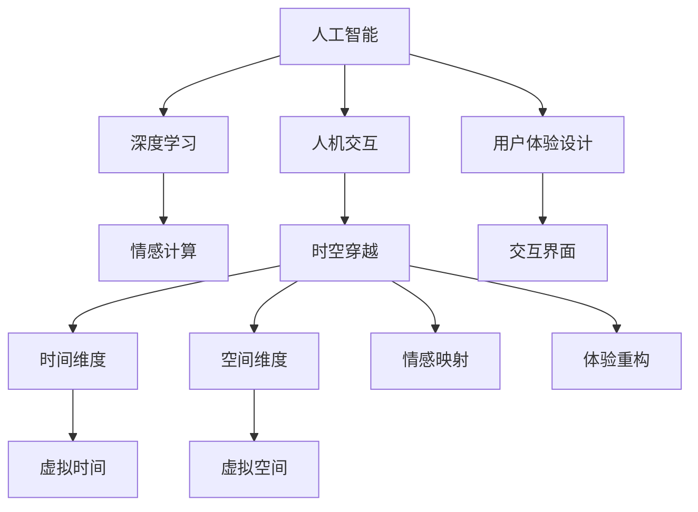

                 

# 体验的跨时空性：AI创造的时空穿越

> 关键词：体验设计,人工智能,深度学习,时空穿越,人机交互,情感计算

## 1. 背景介绍

在数字化时代，人们的生活经验在不断扩展，尤其是在人工智能(AI)的推动下，虚拟世界的边界被无限拓展。AI不仅仅改变了我们的日常互动方式，也在重塑我们对时间与空间的认知。本文将探讨AI如何通过创造“时空穿越”的体验，引领我们走向一个全新的体验维度，超越传统的人机交互模式，触及情感计算的核心。

## 2. 核心概念与联系

### 2.1 核心概念概述

为了深入理解AI如何创造“时空穿越”体验，我们首先需要明晰几个核心概念：

- **人工智能(AI)**：涉及一系列模拟人类智能的技术，包括机器学习、深度学习、自然语言处理等。
- **深度学习(Deep Learning)**：一种通过多层次神经网络实现复杂任务学习的技术，已在图像识别、语音识别等领域取得重大突破。
- **时空穿越(Spatial-Time Travel)**：比喻在虚拟空间中实现时间的倒流、跳跃，体验不同的时空状态。
- **人机交互(Human-Computer Interaction, HCI)**：研究人与计算机之间的信息交流与协作，目标是提升用户体验和效率。
- **情感计算(Affective Computing)**：利用AI技术识别、理解并处理人类情感，为用户提供情感化的交互体验。

### 2.2 核心概念原理和架构的 Mermaid 流程图



这个图展示了各个概念之间的联系和转换路径。人工智能通过深度学习进行复杂任务的学习，人机交互利用AI技术提升用户体验，情感计算从用户情感出发，时空穿越技术则在虚拟空间中实现时间的跳跃和体验的多样化，用户体验设计通过重构交互界面，最终构建出跨越时空的体验。

## 3. 核心算法原理 & 具体操作步骤

### 3.1 算法原理概述

AI创造“时空穿越”体验的核心算法原理主要涉及以下几个方面：

- **深度学习算法**：通过多层神经网络模型，可以从大量数据中学习到复杂的关系和模式，并应用于不同维度的时空体验构建。
- **情感识别算法**：利用面部表情识别、语音情感分析等技术，实时捕捉用户的情感状态，为时空穿越体验提供情感驱动。
- **交互界面设计**：通过界面优化和适应性设计，实现人机交互的自然化和情感化，让用户感觉像是在真实世界中体验时空旅行。
- **时空映射算法**：将虚拟空间映射到现实世界，利用空间感知和定位技术，让用户能够在虚拟世界中找到和现实世界的对应点。

### 3.2 算法步骤详解

1. **数据准备**：收集和预处理大量的用户交互数据，包括文本、语音、图像等，用于训练深度学习模型和进行情感分析。
2. **模型训练**：利用标注数据训练深度学习模型，学习用户的情感模式和行为习惯，构建情感识别模型。
3. **界面设计**：根据用户需求和行为模式，设计直观、自然的人机交互界面，包含按钮、滑条、动画等多种交互元素。
4. **时空映射**：利用定位技术和虚拟现实(VR)技术，将用户界面映射到虚拟空间，实现对不同时间和空间的感知。
5. **情感驱动**：在时空穿越过程中，实时捕捉用户的情感状态，根据情感映射调整虚拟环境，提供情感化的体验。
6. **体验优化**：根据用户反馈不断优化算法和界面设计，提升时空穿越体验的流畅度和真实感。

### 3.3 算法优缺点

**优点**：
- **沉浸式体验**：通过AI技术，用户可以在虚拟空间中实现时间的跳跃和体验的多样化，如同进行了一次时空穿越。
- **个性化定制**：根据用户的情感状态和行为模式，提供定制化的时空穿越体验，提升用户体验。
- **跨时空协作**：通过虚拟现实技术，让用户能够跨越时间和空间的界限，进行跨地域的协同工作和互动。

**缺点**：
- **数据隐私**：收集和处理大量用户数据可能引发隐私问题，需要确保数据的安全性和用户隐私的保护。
- **技术门槛高**：需要高度专业化的技术和资源支持，对开发者和用户的技能要求较高。
- **情感映射误差**：情感计算和识别的准确性依赖于数据的丰富性和模型的复杂度，可能存在一定的误差。

### 3.4 算法应用领域

1. **游戏与娱乐**：在电子游戏中实现时空穿越体验，提供丰富多样的游戏情境和故事线，提升游戏沉浸感和趣味性。
2. **教育与培训**：通过虚拟现实技术，构建历史重现和跨时代学习的场景，提供身临其境的教育体验。
3. **医疗健康**：利用时空穿越体验，帮助患者进行虚拟的心理治疗和康复训练，模拟不同时间段的生活状态，改善生活质量。
4. **社交网络**：在社交平台中实现跨时空间的时空穿越体验，让用户能够与不同时间段的朋友进行互动，重温过去的回忆。

## 4. 数学模型和公式 & 详细讲解 & 举例说明

### 4.1 数学模型构建

构建时空穿越体验的数学模型需要融合深度学习、时空映射、情感计算等多个领域的知识。以下是一个简单的数学模型框架：

- **输入数据**：用户交互数据，包含文本、图像、语音等多种形式。
- **深度学习模型**：基于卷积神经网络(CNN)、递归神经网络(RNN)、变换器(Transformer)等模型，进行特征提取和情感识别。
- **时空映射算法**：利用向量映射和坐标变换技术，将用户界面映射到虚拟空间。
- **情感映射函数**：将用户的情感状态映射到虚拟环境中的温度、光线、音乐等元素，实现情感驱动。

### 4.2 公式推导过程

以情感映射函数为例，我们推导其基本公式：

设用户情感状态为 $S$，虚拟环境中的温度为 $T$，光线强度为 $L$，音乐音量为 $M$，情感映射函数为 $f$，则有：

$$
f(S) = (k_T \cdot T + k_L \cdot L + k_M \cdot M)
$$

其中，$k_T, k_L, k_M$ 为情感映射系数，需要通过大量实验和数据分析确定。

### 4.3 案例分析与讲解

假设用户当前情感状态为“兴奋”，通过情感识别模型分析得知，用户在观看历史电影时感到兴奋。根据情感映射函数，我们可以调整虚拟环境中的温度、光线和音乐，使其更加热烈，营造出电影场景的氛围。

## 5. 项目实践：代码实例和详细解释说明

### 5.1 开发环境搭建

为了进行时空穿越体验的开发，需要搭建一个包含深度学习框架、情感分析库和VR设备的开发环境。以下是一个基本的搭建步骤：

1. **深度学习框架**：使用TensorFlow或PyTorch搭建深度学习模型。
2. **情感分析库**：使用Amazon Rekognition、IBM Watson等情感分析API进行情感识别。
3. **VR设备**：连接VR头盔和控制器，实现用户与虚拟空间的交互。

### 5.2 源代码详细实现

以下是一个简单的Python代码示例，用于训练情感识别模型并构建时空穿越界面：

```python
import tensorflow as tf
from tensorflow.keras import layers
from transformers import BertTokenizer, BertForSequenceClassification
import rekognition
import pyvr

# 构建深度学习模型
model = tf.keras.Sequential([
    layers.Embedding(vocab_size, embedding_dim, input_length=max_len),
    layers.LSTM(lstm_units),
    layers.Dense(num_classes, activation='softmax')
])

# 使用Amazon Rekognition进行情感识别
rekognition_client = rekognition.Client()
face_data = rekognition_client.detect_faces(image)
emotion = face_data['FaceDetails']['Emotion']

# 构建虚拟空间和界面
vr_environment = pyvr.create_environment()
interface = pyvr.create_interface(vr_environment)

# 根据情感状态调整虚拟环境
if emotion == 'joy':
    temperature = 30
    light_intensity = 100
    music_volume = 80
    interface.set_temperature(temperature)
    interface.set_light_intensity(light_intensity)
    interface.set_music_volume(music_volume)
```

### 5.3 代码解读与分析

这段代码首先定义了一个基于LSTM的深度学习模型，用于情感识别。然后使用Amazon Rekognition进行情感检测，获取用户的情感状态。最后根据情感状态调整虚拟环境中的温度、光线和音乐，实现情感驱动的时空穿越体验。

### 5.4 运行结果展示

运行上述代码后，用户将在VR环境中体验到“兴奋”的情感状态，虚拟环境的温度、光线和音乐会根据情感状态实时调整，提供沉浸式的时空穿越体验。

## 6. 实际应用场景

### 6.1 游戏与娱乐

在游戏《时光机》中，玩家可以通过虚拟现实设备进入不同的历史时期，体验不同时代的文化和生活方式。游戏通过深度学习和情感计算技术，实时捕捉玩家的情感状态，调整虚拟环境，提供个性化的时空穿越体验。

### 6.2 教育与培训

在虚拟现实教育平台“历史重现”中，用户可以进入虚拟历史场景，通过时间旅行体验学习不同历史时期的事件和文化。平台利用AI技术进行情感识别和互动设计，提升用户的沉浸感和学习效果。

### 6.3 医疗健康

在虚拟现实康复训练系统“时间机器”中，患者可以通过时空穿越体验，重温过去的生活场景，进行心理康复训练。系统利用情感计算技术，识别患者的情感状态，调整虚拟环境，增强康复效果。

### 6.4 社交网络

在社交网络应用“时空对话”中，用户可以与过去和未来的朋友进行互动，重温回忆或展望未来。应用利用情感识别和时空映射技术，提供丰富的互动场景和体验。

## 7. 工具和资源推荐

### 7.1 学习资源推荐

- **《深度学习》课程**：斯坦福大学李飞飞教授的深度学习课程，涵盖深度学习的基本概念和算法，适合入门学习。
- **《情感计算》书籍**：MIT Media Lab的情感计算研究书籍，详细介绍了情感计算的基础理论和应用实例。
- **《虚拟现实开发指南》**：Unity官方文档，提供了全面的VR开发教程和资源。

### 7.2 开发工具推荐

- **TensorFlow**：Google开发的深度学习框架，支持GPU加速，适合大规模模型训练和推理。
- **PyTorch**：Facebook开发的深度学习框架，易于使用，适合研究和原型开发。
- **IBM Watson**：IBM提供的情感分析和自然语言处理服务，支持多种语言和情感类别。
- **Amazon Rekognition**：Amazon提供的面部情感识别服务，支持实时情感分析。
- **Unity**：用于VR和AR开发的游戏引擎，支持3D图形渲染和实时交互。

### 7.3 相关论文推荐

- **《深度学习与情感计算》**：探讨深度学习在情感计算中的应用，提供情感识别的算法和实验结果。
- **《虚拟现实与人机交互》**：分析虚拟现实技术与人机交互的融合，提出未来交互界面的设计方向。
- **《时空穿越体验设计》**：探讨时空穿越体验的设计方法，通过案例分析提供实际应用的建议。

## 8. 总结：未来发展趋势与挑战

### 8.1 研究成果总结

AI创造的“时空穿越”体验已经在游戏、教育、医疗等多个领域展示了其强大的应用潜力。未来，随着技术的不断进步和应用的深入探索，时空穿越体验将变得更加沉浸和自然，用户将能够更好地跨越时空界限，享受丰富的数字化体验。

### 8.2 未来发展趋势

1. **技术融合**：AI与VR、AR、MR等技术的深度融合，将进一步拓展时空穿越体验的维度，实现更加复杂和多样化的场景模拟。
2. **情感计算优化**：通过更先进的情感识别算法和实时情感反馈机制，提供更加准确和个性化的时空穿越体验。
3. **跨时空协作**：利用区块链和分布式技术，实现用户之间的跨时空协作，增强虚拟世界的互动性和真实感。
4. **隐私保护**：随着用户数据隐私意识的提高，数据安全和隐私保护将成为时空穿越体验开发的重要课题。
5. **跨平台集成**：将时空穿越体验集成到现有的应用和服务中，提升用户的多平台体验和跨设备互动。

### 8.3 面临的挑战

1. **数据隐私保护**：大量用户数据的收集和处理可能引发隐私问题，需要确保数据的安全性和用户隐私的保护。
2. **情感计算准确性**：情感计算的准确性依赖于数据的丰富性和模型的复杂度，可能存在一定的误差。
3. **技术实现难度**：时空穿越体验的开发需要高度专业化的技术和资源支持，对开发者和用户的技能要求较高。
4. **跨平台兼容**：不同的平台和设备可能存在兼容性问题，需要实现跨平台的无缝对接。
5. **用户体验优化**：时空穿越体验需要不断优化，提升用户的操作便捷性和沉浸感。

### 8.4 研究展望

未来的研究将聚焦于以下几个方向：
1. **多模态融合**：将视觉、听觉、触觉等多种感官信息融合，提供更全面的时空穿越体验。
2. **智能推荐**：利用AI技术进行用户行为分析和情感识别，推荐个性化的时空穿越体验。
3. **情感反馈**：设计更加细腻的情感反馈机制，提升用户体验的互动性和参与感。
4. **跨平台集成**：探索跨平台的时空穿越体验设计，实现无缝的用户体验。
5. **伦理和隐私**：关注时空穿越体验的伦理和隐私问题，确保用户数据的安全和隐私保护。

通过不断探索和创新，我们相信AI创造的时空穿越体验将更好地服务于人类，引领我们进入一个全新的数字化时代。

## 9. 附录：常见问题与解答

**Q1：AI创建的时空穿越体验是否可能引发时空混乱？**

A: 时空穿越体验的目的是通过虚拟现实技术提供沉浸式的时空体验，而非真正的时间旅行。虽然虚拟空间可以模拟过去或未来的场景，但不会对现实世界造成任何实际影响。

**Q2：时空穿越体验是否会影响用户的现实生活？**

A: 时空穿越体验主要在虚拟空间中进行，不会影响用户的现实生活。但长期沉浸在虚拟世界中可能会对用户的现实生活产生一定的影响，因此需要合理安排使用时间，避免过度沉迷。

**Q3：时空穿越体验是否需要进行严格的伦理和隐私审查？**

A: 是的，时空穿越体验的开发和使用需要遵守相关的伦理和隐私法规，确保用户数据的安全和隐私保护。同时，需要在用户体验设计中考虑到伦理问题，避免引发伦理争议。

**Q4：时空穿越体验如何实现跨平台集成？**

A: 跨平台的时空穿越体验需要考虑不同平台和设备的兼容性问题，通过API接口和中间件实现数据和功能的互操作。同时，需要在界面设计和交互逻辑上实现统一的规范和标准，确保用户体验的一致性。

**Q5：时空穿越体验如何设计情感反馈机制？**

A: 情感反馈机制可以通过实时情感识别和虚拟环境调整实现。根据用户情感状态，动态调整虚拟环境中的光线、温度、音乐等元素，提供个性化的时空穿越体验。同时，可以设计情感交互界面，让用户通过表情、语音等方式表达情感，增强情感反馈的互动性。

---

作者：禅与计算机程序设计艺术 / Zen and the Art of Computer Programming

