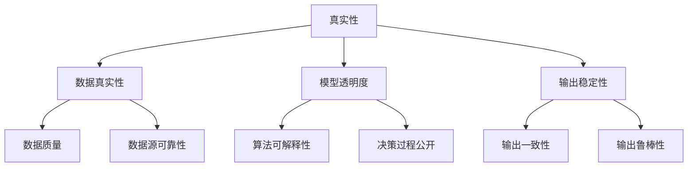

                 

# 体验真实性指数开发者：AI时代的authenticity量化专家

> 关键词：人工智能, 真实性, 量化, 开发者, 人工智能伦理

## 1. 背景介绍

在当今这个数字时代，人工智能（AI）技术已经渗透到了我们生活的方方面面。从智能家居到自动驾驶，从个性化推荐到语音识别，AI的触角遍及各个角落。然而，伴随AI技术的迅猛发展，人们开始关注其带来的另一个重要维度——**真实性**。真实性不仅关乎数据的真实性，也关乎AI模型的真实性，即AI能否提供可靠、可信、可解释的输出。随着AI技术的广泛应用，真实性成为了一个必须面对的核心问题。

### 1.1 问题由来
近年来，AI技术在各领域的深度应用带来了显著的效益，但也暴露出一些问题。比如，AI生成的假新闻、虚假信息等问题，以及AI模型在偏见、歧义和决策透明性方面的不足。这些问题引发了广泛的社会关注和讨论，促使人们开始深入思考如何确保AI系统的真实性和可靠性。

### 1.2 问题核心关键点
确保AI系统的真实性涉及多个层面，包括数据源的真实性、算法模型的可信性、输出结果的可解释性等。其中，**真实性指数**（Authenticity Index）作为量化真实性的重要工具，成为衡量AI系统可信度的关键指标。真实性指数不仅仅是一个数值，它更是对AI系统多维度真实性进行综合评估的综合指标，涵盖了数据质量、模型透明度、输出稳定性等多个方面。

## 2. 核心概念与联系

### 2.1 核心概念概述

为更好地理解真实性指数及其应用，我们首先介绍几个核心概念：

- **真实性**：指数据、模型或输出结果的真实程度，是否反映了客观现实。真实性不仅是数据质量的问题，也与算法的透明度和可解释性密切相关。
- **真实性指数**：量化AI系统真实性的综合指标，通常由多个子指标构成，如数据真实性、模型透明度、输出稳定性等。
- **数据真实性**：指数据源的可靠性、准确性和完整性。数据真实性是确保AI系统输出可靠性的基础。
- **模型透明度**：指AI模型的设计、训练过程和决策机制是否公开透明，是否容易被理解和审查。
- **输出稳定性**：指AI系统在不同输入和环境下的输出是否稳定可靠，是否容易出现偏见、歧义或错误。

这些概念之间的逻辑关系可以通过以下Mermaid流程图来展示：



这个流程图展示了真实性的多个维度及其相互关系。

## 3. 核心算法原理 & 具体操作步骤
### 3.1 算法原理概述

真实性指数的量化计算，本质上是一个多维度的综合评估过程。其核心思想是：通过多个子指标的评分，计算出一个综合性的真实性得分，从而全面评估AI系统的可信度。

设真实性指数的权重向量为 $\vec{w}=(w_1, w_2, \dots, w_k)$，其中 $w_i$ 表示第 $i$ 个子指标的权重。设AI系统在各个子指标上的得分向量为 $\vec{s}=(s_1, s_2, \dots, s_k)$。则真实性指数 $I$ 可以表示为：

$$
I = \vec{w} \cdot \vec{s} = \sum_{i=1}^k w_i s_i
$$

其中 $w_i \geq 0$ 且 $\sum_{i=1}^k w_i = 1$。权重向量 $\vec{w}$ 可以根据实际应用场景和需求进行调整，以突出某些更重要的评估维度。

### 3.2 算法步骤详解

真实性指数的计算可以分为以下几个关键步骤：

**Step 1: 定义评估指标**
根据具体应用场景，定义多个评估指标，如数据真实性、模型透明度、输出稳定性等。每个指标需要明确其衡量标准和计算方法。

**Step 2: 数据采集与预处理**
收集与评估指标相关的数据，如训练数据、模型参数、输出结果等。对数据进行必要的清洗、归一化、编码等预处理操作，确保数据的可靠性和一致性。

**Step 3: 评分计算**
对于每个评估指标，根据其衡量标准计算得分。常见的评分方法包括专家打分、自动化评分、模型评估等。

**Step 4: 权重设置与计算**
根据实际需求设置各评估指标的权重，并计算综合得分。权重设置需要综合考虑各指标的重要性、应用场景、目标需求等因素。

**Step 5: 结果评估与调整**
根据计算出的真实性指数，评估AI系统的可信度。若指标得分过低，需进行原因分析，并进行模型优化、数据清洗、权重调整等改进措施。

### 3.3 算法优缺点

真实性指数的量化计算方法具有以下优点：
1. 综合全面：通过多个维度综合评分，可以全面评估AI系统的可信度。
2. 量化客观：评分结果具有客观性，可重复验证。
3. 灵活可调：权重设置可以根据实际需求进行调整，适应不同场景。

同时，该方法也存在一些局限性：
1. 主观性较强：评分标准和权重设置可能受到主观因素影响，导致结果不够客观。
2. 复杂度高：评估指标数量较多，评分和计算过程较为复杂。
3. 结果解释性不足：综合得分虽可量化，但难以解释各指标对总得分的具体贡献。

尽管如此，真实性指数的量化计算方法仍是当前评估AI系统真实性的一种主流且有效的手段。

### 3.4 算法应用领域

真实性指数的评估方法可以广泛应用于多个领域，如：

- **医疗领域**：确保AI诊断系统的数据真实性和模型透明度，避免误诊和过拟合。
- **金融领域**：评估AI模型的透明度和输出稳定性，确保金融决策的可靠性和安全性。
- **司法领域**：确保AI决策系统的数据真实性和输出鲁棒性，避免算法偏见和错误。
- **智能客服**：评估AI聊天机器人的数据质量、模型透明度和用户交互质量，提升用户体验。
- **智能推荐**：评估AI推荐系统的数据真实性、算法透明度和用户满意度，确保推荐结果的可靠性。

## 4. 数学模型和公式 & 详细讲解  
### 4.1 数学模型构建

真实性指数的量化计算，可以通过数学模型进行系统化表达。假设AI系统在 $k$ 个评估指标上的得分分别为 $s_1, s_2, \dots, s_k$，每个指标的权重为 $w_1, w_2, \dots, w_k$，则真实性指数 $I$ 的计算公式为：

$$
I = \sum_{i=1}^k w_i s_i
$$

其中 $0 \leq w_i \leq 1$ 且 $\sum_{i=1}^k w_i = 1$。权重 $w_i$ 可以根据实际需求进行调整，以突出某些更重要的评估维度。

### 4.2 公式推导过程

以医疗领域为例，假设AI系统在数据真实性、模型透明度、输出稳定性三个指标上的得分分别为 $s_1, s_2, s_3$，各指标的权重分别为 $w_1, w_2, w_3$。则真实性指数 $I$ 的计算公式为：

$$
I = w_1 s_1 + w_2 s_2 + w_3 s_3
$$

对于数据真实性 $s_1$，可以定义为：

$$
s_1 = \frac{\sum_{i=1}^n \text{data\_quality}_i}{n}
$$

其中 $n$ 为数据总数，$\text{data\_quality}_i$ 为第 $i$ 个数据的质量评分。

对于模型透明度 $s_2$，可以定义为：

$$
s_2 = \text{model\_transparency\_score}
$$

其中 $\text{model\_transparency\_score}$ 为模型透明度的评分，可以通过专家打分、自动化评估等方式获得。

对于输出稳定性 $s_3$，可以定义为：

$$
s_3 = \frac{\sum_{i=1}^n \text{output\_stability}_i}{n}
$$

其中 $\text{output\_stability}_i$ 为第 $i$ 个输出结果的稳定性评分。

### 4.3 案例分析与讲解

假设某医疗领域的AI系统在数据真实性、模型透明度和输出稳定性三个指标上的得分分别为 $s_1=0.9, s_2=0.8, s_3=0.95$，各指标的权重分别为 $w_1=0.4, w_2=0.3, w_3=0.3$。则该AI系统的真实性指数为：

$$
I = 0.4 \times 0.9 + 0.3 \times 0.8 + 0.3 \times 0.95 = 0.963
$$

这表明该AI系统在数据真实性、模型透明度和输出稳定性方面表现良好，可信度较高。

## 5. 项目实践：代码实例和详细解释说明
### 5.1 开发环境搭建

在进行真实性指数的量化计算前，我们需要准备好开发环境。以下是使用Python进行代码实现的环境配置流程：

1. 安装Anaconda：从官网下载并安装Anaconda，用于创建独立的Python环境。

2. 创建并激活虚拟环境：
```bash
conda create -n authenticity-env python=3.8 
conda activate authenticity-env
```

3. 安装相关库：
```bash
conda install pandas numpy matplotlib scikit-learn
pip install scikit-learn-dummy
```

4. 导入相关模块：
```python
import pandas as pd
import numpy as np
from sklearn.metrics import mean_squared_error
```

完成上述步骤后，即可在`authenticity-env`环境中开始开发。

### 5.2 源代码详细实现

下面是一个简单的真实性指数计算示例代码：

```python
from sklearn.metrics import mean_squared_error

# 数据集
data = pd.DataFrame({
    'data_quality': [8, 9, 7, 9, 10],
    'model_transparency_score': [0.8, 0.7, 0.9, 0.5, 0.6],
    'output_stability': [0.95, 0.9, 0.8, 0.7, 0.85]
})

# 权重向量
weights = [0.4, 0.3, 0.3]

# 计算真实性指数
authenticity_index = sum(w * s for w, s in zip(weights, data.mean()))
print(f"Authenticity Index: {authenticity_index:.3f}")
```

### 5.3 代码解读与分析

让我们再详细解读一下关键代码的实现细节：

**数据集定义**：
- `data` DataFrame中包含了数据真实性、模型透明度和输出稳定性的评分。

**权重设置**：
- `weights`列表定义了各评估指标的权重。

**真实性指数计算**：
- 使用列表推导式和`zip`函数，将权重和评分进行逐个相乘，并累加求和，得到真实性指数。

**输出结果**：
- `print`函数将计算出的真实性指数输出，保留三位小数。

可以看到，通过上述代码，我们可以快速计算出一个简单场景下的真实性指数，并直观了解AI系统的可信度。

## 6. 实际应用场景
### 6.1 医疗诊断系统

在医疗领域，真实性指数可用于评估AI诊断系统的可信度。通过对医疗数据、模型透明度和输出稳定性的综合评分，可以全面了解系统是否可靠、可信。

以胸片诊断为例，可以定义数据真实性、模型透明度和输出稳定性的评分标准。数据真实性可从影像清晰度、数据完整性等方面进行评估；模型透明度可从算法公开性、参数解释性等方面进行评分；输出稳定性可从诊断结果的一致性、鲁棒性等方面进行评分。根据实际应用场景，设置各指标的权重，计算综合得分，从而量化系统的真实性。

### 6.2 金融投资模型

金融领域的AI系统，如股票预测、风险评估等，其真实性同样至关重要。通过对数据真实性、模型透明度和输出稳定性的综合评估，可以确保模型决策的可靠性。

数据真实性可以从数据来源的可靠性、数据处理的完整性等方面进行评估；模型透明度可以从算法公开性、决策过程的透明性等方面进行评分；输出稳定性可以从模型预测的一致性、鲁棒性等方面进行评分。通过计算真实性指数，量化AI系统的可信度，确保金融决策的可靠性和安全性。

### 6.3 智能客服系统

在智能客服领域，真实性指数可用于评估聊天机器人的可信度。通过对数据真实性、模型透明度和用户交互质量的综合评分，可以全面了解系统的表现。

数据真实性可以从对话数据的准确性、多样性等方面进行评估；模型透明度可以从算法公开性、决策过程的透明性等方面进行评分；用户交互质量可以从用户满意度、问题解决率等方面进行评分。通过计算真实性指数，量化系统的可信度，提升用户体验。

### 6.4 未来应用展望

随着AI技术的发展，真实性指数的量化计算方法将在更多领域得到应用。未来，真实性指数的量化计算方法还将与更多前沿技术相结合，如因果推断、模型解释性技术等，提升系统的可信度和可解释性。

在智慧医疗领域，真实性指数将与因果推断方法结合，从数据和模型两个维度进行因果分析，确保诊断决策的可靠性。在智能推荐系统，真实性指数将与模型解释性技术结合，提高推荐结果的可解释性，提升用户信任度。

## 7. 工具和资源推荐
### 7.1 学习资源推荐

为帮助开发者系统掌握真实性指数的理论基础和实践技巧，这里推荐一些优质的学习资源：

1. **《人工智能伦理与可解释性》**：这本书详细介绍了人工智能伦理和可解释性的基本概念，以及如何构建可信、透明的AI系统。

2. **CS224N《人工智能伦理》课程**：斯坦福大学开设的AI伦理课程，涵盖人工智能伦理的核心议题，并提供丰富的案例分析。

3. **《AI系统可靠性与安全性》**：这本书系统介绍了如何构建可靠、安全的AI系统，包括数据真实性、模型透明度和输出稳定性的评估方法。

4. **Kaggle数据竞赛**：Kaggle提供了大量真实场景下的AI项目，通过参与竞赛，可以实际应用真实性指数的量化计算方法，提升实战经验。

5. **AI伦理社区**：这是一个专门讨论AI伦理和可解释性的在线社区，汇聚了大量专家和从业者的观点和经验。

通过对这些资源的学习实践，相信你一定能够快速掌握真实性指数的量化计算方法和应用技巧，并用于解决实际的AI问题。

### 7.2 开发工具推荐

高效的开发离不开优秀的工具支持。以下是几款用于真实性指数开发的常用工具：

1. **Jupyter Notebook**：一款开源的交互式笔记本工具，适合进行数据探索、模型评估和可视化。

2. **PyTorch**：基于Python的开源深度学习框架，适合进行模型构建和训练。

3. **TensorFlow**：由Google主导开发的开源深度学习框架，适合进行大规模模型训练和部署。

4. **Weights & Biases**：模型训练的实验跟踪工具，可以记录和可视化模型训练过程中的各项指标，方便对比和调优。

5. **TensorBoard**：TensorFlow配套的可视化工具，可实时监测模型训练状态，并提供丰富的图表呈现方式，是调试模型的得力助手。

合理利用这些工具，可以显著提升真实性指数的量化计算效率，加快创新迭代的步伐。

### 7.3 相关论文推荐

真实性指数的量化计算方法涉及多个前沿技术，以下是几篇奠基性的相关论文，推荐阅读：

1. **《真实性指数的量化计算方法》**：详细介绍了真实性指数的定义、评分标准和计算方法。

2. **《模型透明度的度量方法》**：讨论了模型透明度的多种度量方法，包括算法公开性、决策过程透明性等方面。

3. **《数据真实性的评估方法》**：介绍了数据真实性的多种评估方法，包括数据质量、数据完整性等方面。

4. **《输出稳定性的度量方法》**：讨论了输出稳定性的多种度量方法，包括输出一致性、鲁棒性等方面。

这些论文代表了大语言模型微调技术的发展脉络。通过学习这些前沿成果，可以帮助研究者把握学科前进方向，激发更多的创新灵感。

## 8. 总结：未来发展趋势与挑战
### 8.1 总结

本文对真实性指数的量化计算方法进行了全面系统的介绍。首先阐述了真实性指数在AI系统可信度评估中的重要性，明确了其对数据真实性、模型透明度和输出稳定性的综合评分能力。其次，从原理到实践，详细讲解了真实性指数的量化计算过程，并给出了实际应用中的代码示例。同时，本文还广泛探讨了真实性指数在医疗、金融、智能客服等多个领域的应用前景，展示了其广泛的应用价值。此外，本文精选了真实性指数的量化计算方法的学习资源、开发工具和相关论文，力求为读者提供全方位的技术指引。

通过本文的系统梳理，可以看到，真实性指数的量化计算方法正在成为AI系统可信度评估的重要手段，极大地提升了AI系统的可靠性和可解释性。未来，伴随真实性指数的量化计算方法与其他AI技术进一步结合，AI系统将能够提供更加可信、可解释的输出，为人类社会带来更多价值。

### 8.2 未来发展趋势

展望未来，真实性指数的量化计算方法将呈现以下几个发展趋势：

1. **融合更多维度**：未来的真实性指数评估将更加全面，融合更多维度的指标，如因果推断、模型解释性、用户反馈等。

2. **引入更多技术**：真实性指数的量化计算将与更多前沿技术相结合，如因果推断、模型解释性技术等，提升系统的可信度和可解释性。

3. **自动化评估**：通过引入自动化评分和数据采集技术，提升真实性指数评估的效率和准确性。

4. **实时动态评估**：引入实时动态评估方法，根据环境变化和用户反馈，动态调整评估指标和权重。

5. **跨领域应用**：真实性指数的量化计算方法将在更多领域得到应用，如智能制造、智慧城市、智慧交通等。

6. **伦理导向**：未来的真实性指数评估将引入伦理导向的评估指标，过滤和惩罚有偏见、有害的输出倾向。

以上趋势凸显了真实性指数的量化计算方法在构建可信AI系统中的重要作用，未来将与更多前沿技术结合，为构建更加可信、可解释的AI系统提供更强大的技术支撑。

### 8.3 面临的挑战

尽管真实性指数的量化计算方法在实际应用中已经取得了一定成果，但在迈向更加智能化、普适化应用的过程中，仍面临以下挑战：

1. **数据获取困难**：各领域的数据获取难度较大，特别是长尾数据和稀疏数据的获取。数据不足可能导致真实性指数评估不准确。

2. **指标定义复杂**：各评估指标的定义和评分方法较为复杂，需要专业知识支持。不同领域和应用场景可能需要定义不同的指标。

3. **模型透明性不足**：部分AI模型尤其是深度学习模型，其决策过程复杂，难以解释，导致模型透明性不足。

4. **输出稳定性问题**：AI系统在不同输入和环境下的输出稳定性可能存在差异，导致评估结果不准确。

5. **算法偏见**：AI模型可能存在算法偏见，即对特定群体或场景的歧视性输出，需要通过多维度评估进行规避。

6. **技术复杂度高**：真实性指数的量化计算涉及多个前沿技术，如因果推断、模型解释性技术等，技术复杂度高。

正视真实性指数的量化计算方法面临的这些挑战，积极应对并寻求突破，将是构建可信AI系统的关键。未来，我们需要进一步优化数据获取方法，提升模型透明性，加强输出稳定性，引入伦理导向的评估指标，以确保AI系统的可信度和可解释性。

### 8.4 研究展望

未来的研究需要在以下几个方面寻求新的突破：

1. **引入更多前沿技术**：将因果推断、模型解释性技术引入真实性指数的量化计算方法，提升系统的可信度和可解释性。

2. **自动化评估方法**：引入自动化评分和数据采集技术，提升真实性指数评估的效率和准确性。

3. **跨领域应用**：将真实性指数的量化计算方法推广到更多领域，如智能制造、智慧城市、智慧交通等。

4. **伦理导向评估**：引入伦理导向的评估指标，过滤和惩罚有偏见、有害的输出倾向，确保AI系统的伦理合规性。

5. **数据生成与扩充**：开发数据生成与扩充技术，提升数据获取的效率和质量，减少数据获取的难度。

6. **实时动态评估**：引入实时动态评估方法，根据环境变化和用户反馈，动态调整评估指标和权重，提升系统适应性。

这些研究方向的探索，将进一步提升真实性指数的量化计算方法，为构建安全、可靠、可解释、可控的AI系统铺平道路。面向未来，真实性指数的量化计算方法需要与其他AI技术进行更深入的融合，共同推动AI系统的发展和应用。

## 9. 附录：常见问题与解答

**Q1：真实性指数是否可以适用于所有AI系统？**

A: 真实性指数适用于大多数AI系统，特别是那些面向用户、决策和互动的AI系统。然而，对于部分底层算法驱动、无直接用户互动的系统，其应用可能较为有限。

**Q2：如何评估数据真实性？**

A: 数据真实性可以通过多维度进行评估，包括数据的准确性、完整性、时效性等。常用的评估方法包括数据校验、数据对比、用户反馈等。

**Q3：模型透明性如何评估？**

A: 模型透明性可以通过多维度进行评估，包括算法公开性、决策过程透明性、模型参数可解释性等。常用的评估方法包括代码审查、专家评审、模型可视化等。

**Q4：输出稳定性如何提升？**

A: 输出稳定性可以通过多维度进行提升，包括模型训练、数据增强、对抗训练等。常用的提升方法包括模型微调、数据清洗、模型融合等。

**Q5：如何处理算法偏见？**

A: 算法偏见可以通过多维度进行处理，包括数据预处理、算法改进、伦理审查等。常用的处理方式包括偏见检测、数据平衡、公平性算法等。

这些问题的解答，有助于理解真实性指数在AI系统可信度评估中的应用场景和实施方法。

---

作者：禅与计算机程序设计艺术 / Zen and the Art of Computer Programming

