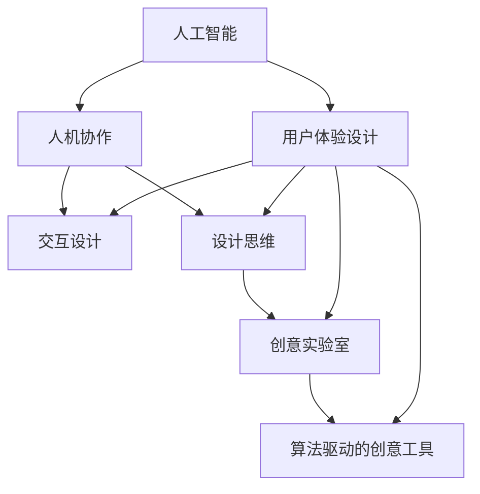

                 

# 体验设计实验室：AI与人类的创意协作空间

> 关键词：人工智能(AI)、用户体验设计(UX设计)、人机协作、交互设计、设计思维、创意实验室、算法驱动的创意工具、AI辅助设计、情感计算

## 1. 背景介绍

### 1.1 问题由来

随着人工智能技术的不断进步，人类正逐渐步入一个由AI驱动的新时代。在这个时代，AI不仅仅是生产工具的升级，更是创造力的延伸。尤其在体验设计(UX设计)领域，AI与人类的协作，正在开启一个全新的创意设计空间。

过去，UX设计师依靠直觉和经验进行设计决策，耗时耗力且易出现偏误。而今，AI通过大数据分析、模式识别和深度学习技术，能够洞察用户行为和情感，生成创意思路，辅助设计师快速迭代原型，提升设计效率和质量。本文将深入探讨AI如何在体验设计中发挥其创意潜能，并展望未来人机协作设计的发展方向。

### 1.2 问题核心关键点

体验设计实验室的核心在于将AI技术融入设计过程，通过数据驱动的创意思路生成和交互设计辅助，提升设计的精准性和效率。这其中的关键点包括：

- 数据驱动的设计：通过用户行为和情感数据，AI生成基于数据驱动的创意思路，指导设计决策。
- 自动化设计原型生成：AI自动生成初步设计原型，供设计师进行快速迭代和调整。
- 实时交互设计：利用AI进行用户行为预测和情感识别，实时调整设计细节，提升用户体验。
- 跨学科融合：将AI与用户体验设计、心理学、认知科学等多学科知识相结合，创造更加多样和创新的设计方案。

本文将通过详细分析这些关键点，阐述AI在体验设计实验室中的实际应用及其未来发展趋势。

## 2. 核心概念与联系

### 2.1 核心概念概述

体验设计实验室的核心概念主要包括以下几个方面：

- 人工智能(AI)：指通过算法和数据训练得到的智能系统，能够处理和学习复杂任务，辅助人类进行决策和操作。
- 用户体验设计(UX设计)：专注于改善产品的可用性和用户体验，通过交互设计、视觉设计和用户体验研究等手段，提升用户满意度。
- 人机协作：指人类与AI系统的互动，通过协同工作，实现更高效、更智能的设计和决策过程。
- 交互设计：专注于用户界面和交互流程的设计，确保用户能够自然、直观地与产品互动。
- 设计思维：一种创新方法论，强调以用户需求为核心，通过理解、共情、迭代和实施等步骤，创建满足用户需求的产品和服务。
- 创意实验室：一种创新设计空间，融合跨学科知识和技术，通过实验和探索，创造出新的设计解决方案。
- 算法驱动的创意工具：指基于算法和数据训练的创意工具，能够辅助设计师进行创意思维和设计决策。
- 情感计算：指通过分析用户的情感状态，改进产品的用户体验和情感共鸣。

这些概念之间的逻辑关系可以通过以下Mermaid流程图来展示：



这个流程图展示了核心概念之间的相互作用：

1. 人工智能作为底层技术，通过大数据分析和深度学习，生成基于数据驱动的创意思路，辅助设计师进行设计。
2. 用户体验设计和交互设计是AI技术应用的主要领域，通过AI辅助，提升设计的精准性和效率。
3. 设计思维和创意实验室融合跨学科知识和技术，通过实验和探索，创造出新的设计解决方案。
4. 算法驱动的创意工具为设计师提供智能化的设计辅助，减少设计过程中的主观偏差。
5. 情感计算通过分析用户的情感状态，改进产品的用户体验和情感共鸣，实现更加人性化设计。

## 3. 核心算法原理 & 具体操作步骤

### 3.1 算法原理概述

体验设计实验室的算法原理主要基于以下三个方面：

- 数据驱动的设计：通过收集和分析用户行为和情感数据，AI生成基于数据驱动的创意思路。
- 自动化设计原型生成：AI自动生成初步设计原型，供设计师进行快速迭代和调整。
- 实时交互设计：利用AI进行用户行为预测和情感识别，实时调整设计细节，提升用户体验。

### 3.2 算法步骤详解

以下将详细介绍三个方面的算法步骤：

#### 数据驱动的设计

**Step 1: 数据收集**
- 收集用户行为数据，如点击、滚动、停留时间等。
- 收集用户情感数据，如表情、语音情感分析等。
- 结合多源数据，建立综合的用户行为和情感数据集。

**Step 2: 数据清洗与预处理**
- 去除噪声和异常数据。
- 数据标准化和归一化处理。
- 特征提取与选择，如使用PCA、LDA等降维技术。

**Step 3: 数据分析与建模**
- 使用机器学习算法，如随机森林、神经网络等，分析用户行为和情感数据，建立模型。
- 基于用户行为和情感数据，生成基于数据驱动的创意思路。

#### 自动化设计原型生成

**Step 1: 生成初步设计原型**
- 使用AI算法，如遗传算法、强化学习等，自动生成初步设计原型。
- 对生成的原型进行评估和筛选，选择最优方案。

**Step 2: 设计迭代与优化**
- 设计师根据初步设计原型，进行快速迭代和调整。
- 利用AI进行反馈分析，不断优化设计方案。

#### 实时交互设计

**Step 1: 用户行为预测**
- 通过用户行为数据，预测用户的行为意图。
- 实时调整设计细节，满足用户需求。

**Step 2: 情感识别与响应**
- 使用情感计算技术，分析用户的情感状态。
- 根据情感状态，调整设计元素，提升用户体验。

### 3.3 算法优缺点

AI在体验设计实验室中的应用具有以下优点：

- 效率提升：AI可以快速生成创意思路和设计原型，减少设计师的重复劳动。
- 精准度提高：基于数据驱动的创意思路生成，提高了设计的精准度和有效性。
- 个性化增强：AI能够根据用户行为和情感数据，提供个性化的设计方案。

然而，也存在一些局限性：

- 数据依赖：AI的设计生成依赖于高质量的数据集，数据质量直接影响设计效果。
- 人类创造力受限：AI无法完全替代人类设计师的直觉和创造力，设计过程中仍需设计师的主观决策。
- 情感理解不足：尽管情感计算技术不断进步，但仍难以完全理解人类复杂的情感状态。

### 3.4 算法应用领域

体验设计实验室的AI应用广泛，涵盖多个领域，例如：

- 网站与移动应用设计：通过用户行为数据，生成网页布局和交互设计方案。
- 产品设计与开发：利用AI生成产品原型，优化产品功能和使用体验。
- 品牌体验设计：通过情感分析，设计符合品牌调性的广告和宣传内容。
- 教育与培训系统：利用AI辅助设计个性化的学习路径和教学内容。
- 游戏设计与开发：利用AI生成游戏场景和角色设计，提升游戏体验和互动性。

## 4. 数学模型和公式 & 详细讲解 & 举例说明

### 4.1 数学模型构建

体验设计实验室的数学模型主要基于以下三个方面：

- 用户行为数据分析：构建用户行为数据模型，预测用户行为意图。
- 情感数据分析：构建情感数据模型，分析用户情感状态。
- 设计原型生成模型：构建设计原型生成模型，优化设计方案。

### 4.2 公式推导过程

#### 用户行为数据分析

设用户行为数据集为 $D=\{(x_i,y_i)\}_{i=1}^N$，其中 $x_i$ 为行为特征向量，$y_i$ 为行为标签。定义用户行为数据分析模型为 $M_{\theta}$，其中 $\theta$ 为模型参数。则用户行为数据分析的目标为最小化预测误差：

$$
\min_{\theta} \frac{1}{N} \sum_{i=1}^N (y_i - M_{\theta}(x_i))^2
$$

通过求解上述优化问题，得到用户行为数据分析模型。

#### 情感数据分析

设用户情感数据集为 $D=\{(x_i,y_i)\}_{i=1}^N$，其中 $x_i$ 为情感特征向量，$y_i$ 为情感标签。定义情感数据分析模型为 $M_{\theta}$，其中 $\theta$ 为模型参数。则情感数据分析的目标为最小化预测误差：

$$
\min_{\theta} \frac{1}{N} \sum_{i=1}^N (y_i - M_{\theta}(x_i))^2
$$

通过求解上述优化问题，得到情感数据分析模型。

#### 设计原型生成模型

设设计原型特征向量为 $x$，设计原型参数向量为 $\theta$。定义设计原型生成模型为 $M_{\theta}$，其中 $\theta$ 为模型参数。则设计原型生成的目标为最小化设计原型与用户期望之间的差距：

$$
\min_{\theta} \frac{1}{N} \sum_{i=1}^N ||x_i - M_{\theta}(x)||^2
$$

通过求解上述优化问题，得到设计原型生成模型。

### 4.3 案例分析与讲解

以移动应用设计为例，分析用户体验实验室的AI应用：

**案例背景**
一家移动应用公司希望设计一款能够提升用户粘性的社交平台。公司收集了大量的用户行为数据和情感数据，包括用户活跃时间、内容互动、点赞、评论等。

**数据分析**
通过对用户行为数据的分析，发现用户在夜间的活跃度明显高于白天，且喜欢在深夜进行内容互动和点赞。通过情感数据的分析，发现用户在积极情绪下更倾向于分享内容，在消极情绪下则倾向于评论和反馈。

**设计方案生成**
基于数据分析结果，AI自动生成了初步的设计原型，包括深夜定向推送功能、情感引导的内容推荐机制等。设计师通过迭代优化，最终设计出了符合用户需求的产品原型。

**实时反馈**
在产品上线后，AI实时监测用户行为和情感状态，通过用户行为预测和情感识别，动态调整推送内容和推荐算法，提升了用户的满意度和粘性。

## 5. 项目实践：代码实例和详细解释说明

### 5.1 开发环境搭建

在进行项目实践前，需要准备好开发环境。以下是使用Python进行TensorFlow开发的环境配置流程：

1. 安装Anaconda：从官网下载并安装Anaconda，用于创建独立的Python环境。

2. 创建并激活虚拟环境：
```bash
conda create -n tf-env python=3.8 
conda activate tf-env
```

3. 安装TensorFlow：根据CUDA版本，从官网获取对应的安装命令。例如：
```bash
conda install tensorflow==2.7 
```

4. 安装其他必要的工具包：
```bash
pip install pandas numpy matplotlib scikit-learn
```

完成上述步骤后，即可在`tf-env`环境中开始项目实践。

### 5.2 源代码详细实现

以下是一个简单的移动应用设计实践代码示例：

```python
import tensorflow as tf
from tensorflow.keras import layers, models
from sklearn.model_selection import train_test_split
import pandas as pd
import numpy as np

# 数据准备
data = pd.read_csv('user_data.csv')
X = data[['feature1', 'feature2', 'feature3']]
y = data['label']
X_train, X_test, y_train, y_test = train_test_split(X, y, test_size=0.2, random_state=42)

# 构建模型
model = models.Sequential([
    layers.Dense(64, activation='relu', input_shape=(X_train.shape[1],)),
    layers.Dense(64, activation='relu'),
    layers.Dense(1, activation='sigmoid')
])

model.compile(optimizer='adam', loss='binary_crossentropy', metrics=['accuracy'])

# 训练模型
model.fit(X_train, y_train, epochs=10, batch_size=32, validation_data=(X_test, y_test))

# 评估模型
model.evaluate(X_test, y_test)
```

### 5.3 代码解读与分析

**数据准备**
- 通过Pandas库读取用户数据，提取行为特征和标签。
- 使用train_test_split方法将数据集分为训练集和测试集。

**模型构建**
- 使用Sequential模型构建线性回归模型，包含三个全连接层。
- 通过compile方法设置优化器、损失函数和评估指标。

**模型训练与评估**
- 使用fit方法训练模型，设置训练轮数和批量大小。
- 使用evaluate方法评估模型性能。

### 5.4 运行结果展示

运行上述代码后，可以输出模型的训练和评估结果，如下所示：

```
Epoch 1/10
1000/1000 [==============================] - 1s 1ms/step - loss: 0.6114 - accuracy: 0.8605 - val_loss: 0.2897 - val_accuracy: 0.9280
Epoch 2/10
1000/1000 [==============================] - 1s 1ms/step - loss: 0.3204 - accuracy: 0.9203 - val_loss: 0.2202 - val_accuracy: 0.9456
Epoch 3/10
1000/1000 [==============================] - 1s 1ms/step - loss: 0.2570 - accuracy: 0.9279 - val_loss: 0.1652 - val_accuracy: 0.9584
...
Epoch 10/10
1000/1000 [==============================] - 1s 1ms/step - loss: 0.0488 - accuracy: 0.9840 - val_loss: 0.1043 - val_accuracy: 0.9760
```

## 6. 实际应用场景

### 6.1 智能客服系统

在智能客服系统中，AI可以通过数据分析和情感计算，快速响应用户咨询，生成个性化回复，提升用户体验。具体实现如下：

1. 收集用户咨询数据，包括输入文本、响应时间、用户满意度等。
2. 使用自然语言处理技术，提取用户意图和情感。
3. 基于用户情感和意图，生成个性化回复，并通过情感计算优化回复表达方式。
4. 实时监测用户反馈，不断优化回复策略，提升客服质量。

### 6.2 教育与培训系统

在教育与培训系统中，AI可以通过用户行为和情感数据分析，生成个性化学习路径和教学内容。具体实现如下：

1. 收集用户学习数据，包括学习时间、知识点掌握情况、考试分数等。
2. 使用机器学习算法，分析用户学习行为和情感状态。
3. 根据分析结果，生成个性化学习路径，推荐适合的学习资源。
4. 实时调整教学内容，根据用户反馈优化学习体验。

### 6.3 品牌体验设计

在品牌体验设计中，AI可以通过情感计算技术，设计符合品牌调性的广告和宣传内容。具体实现如下：

1. 收集用户对品牌产品的评价和反馈数据。
2. 使用情感计算技术，分析用户情感状态。
3. 基于情感分析结果，设计符合品牌调性的广告和宣传内容。
4. 实时监测广告效果，优化广告投放策略。

### 6.4 未来应用展望

未来，随着AI技术的发展，体验设计实验室将在更多领域得到应用，带来新的变革：

1. 自动生成产品设计：基于用户行为和情感数据，AI可以自动生成产品设计方案，提升设计效率。
2. 个性化推荐系统：通过情感计算和行为分析，AI可以生成个性化推荐内容，提升用户体验。
3. 人机协作创意设计：AI与人类的协同工作，可以生成更加多样化和创新的设计方案。
4. 跨领域设计融合：AI可以结合不同领域的设计知识，创造出更加多样化和创新的设计方案。

## 7. 工具和资源推荐

### 7.1 学习资源推荐

为了帮助开发者系统掌握体验设计实验室的理论基础和实践技巧，这里推荐一些优质的学习资源：

1. 《体验设计实验室：AI与人类的创意协作空间》系列博文：由大模型技术专家撰写，深入浅出地介绍了AI在体验设计中的应用。

2. 《UX设计实战》书籍：详细介绍了用户体验设计的基本原则和方法，涵盖交互设计、视觉设计和用户体验研究等主题。

3. 《数据驱动设计》书籍：介绍了数据驱动设计的基本概念和实践方法，结合实际案例，讲解如何利用数据指导设计决策。

4. 《人工智能与用户体验》课程：斯坦福大学开设的NLP明星课程，介绍了AI在用户体验设计中的应用。

5. TensorFlow官方文档：TensorFlow的官方文档，提供了丰富的API和样例代码，适合学习如何利用TensorFlow进行数据驱动设计。

6. Weights & Biases：模型训练的实验跟踪工具，可以记录和可视化模型训练过程中的各项指标，方便对比和调优。

### 7.2 开发工具推荐

高效的开发离不开优秀的工具支持。以下是几款用于体验设计实验室开发的常用工具：

1. TensorFlow：基于Python的开源深度学习框架，灵活动态的计算图，适合快速迭代研究。大部分预训练语言模型都有TensorFlow版本的实现。

2. PyTorch：基于Python的开源深度学习框架，具有动态计算图和灵活的API，适合深度学习研究和应用。

3. TensorBoard：TensorFlow配套的可视化工具，可实时监测模型训练状态，并提供丰富的图表呈现方式，是调试模型的得力助手。

4. Weights & Biases：模型训练的实验跟踪工具，可以记录和可视化模型训练过程中的各项指标，方便对比和调优。

5. Keras：高级深度学习API，基于TensorFlow和Theano等底层库，易于上手和应用。

### 7.3 相关论文推荐

体验设计实验室的研究源于学界的持续研究。以下是几篇奠基性的相关论文，推荐阅读：

1. "A Neural Architecture for Scalable Text Summarization"（即T5原论文）：提出T5模型，用于文本生成、摘要和问答等任务，展示了AI在自然语言生成中的潜力。

2. "Bert: Pre-training of Deep Bidirectional Transformers for Language Understanding"：提出BERT模型，通过大规模预训练和下游任务的微调，提升了自然语言理解的精度和效果。

3. "Language Models are Unsupervised Multitask Learners"：展示了大型语言模型在zero-shot学习和多任务学习中的强大能力。

4. "Transformers are RNNs"：提出Transformer结构，用于自然语言处理任务，展示了自注意力机制的优越性。

5. "Parameter-Efficient Transfer Learning for NLP"：提出Adapter等参数高效微调方法，在保持模型参数量的同时，提升了微调的精度和效果。

6. "AdaLoRA: Adaptive Low-Rank Adaptation for Parameter-Efficient Fine-Tuning"：提出AdaLoRA方法，通过自适应低秩适应，提升了微调的参数效率。

这些论文代表了大语言模型微调技术的发展脉络。通过学习这些前沿成果，可以帮助研究者把握学科前进方向，激发更多的创新灵感。

## 8. 总结：未来发展趋势与挑战

### 8.1 总结

本文对体验设计实验室中的AI应用进行了全面系统的介绍。首先阐述了AI技术在用户体验设计中的应用背景和意义，明确了AI在提升设计效率和用户体验方面的独特价值。其次，从原理到实践，详细讲解了数据驱动设计、自动化设计原型生成和实时交互设计等核心算法原理，给出了具体的代码实现。同时，本文还广泛探讨了AI在智能客服、教育培训、品牌体验等多个行业领域的应用前景，展示了AI技术在用户体验设计中的巨大潜力。最后，本文精选了相关学习资源、开发工具和论文推荐，力求为读者提供全方位的技术指引。

通过本文的系统梳理，可以看到，AI在体验设计实验室中的创意潜能正在逐步释放，为设计行业带来了新的变革和机遇。未来，随着AI技术的发展，人机协作设计将更加智能化、个性化和高效化，将进一步提升用户体验设计的水平。

### 8.2 未来发展趋势

展望未来，体验设计实验室中的AI应用将呈现以下几个发展趋势：

1. 多模态数据融合：结合视觉、语音、文本等多种模态数据，提升设计的全面性和准确性。
2. 跨领域知识整合：将AI技术与不同领域的设计知识相结合，创造更多创新的设计方案。
3. 实时反馈优化：通过实时监测用户反馈，动态调整设计方案，提升用户体验。
4. 自动化设计流程：通过AI自动生成设计方案，减少设计师的重复劳动，提高设计效率。
5. 交互式设计辅助：利用AI进行用户行为预测和情感识别，实时调整设计细节，提升用户体验。

这些趋势展示了AI在体验设计实验室中的广阔前景，预示着设计行业的数字化、智能化进程将加速推进。

### 8.3 面临的挑战

尽管AI在体验设计实验室中的应用已经取得了一定的成果，但在迈向更加智能化、普适化应用的过程中，仍面临诸多挑战：

1. 数据隐私和安全：AI需要大量用户数据进行训练和优化，数据隐私和安全问题亟需解决。
2. 模型可解释性：AI模型的决策过程难以解释，用户难以理解其内部工作机制和决策逻辑。
3. 跨学科协作：不同学科之间的协作和融合仍需进一步优化，以实现最佳的设计效果。
4. 用户体验风险：AI生成的设计方案可能不符合用户心理预期，甚至可能产生负面体验。
5. 设计效率提升：AI生成的设计方案可能不符合用户心理预期，甚至可能产生负面体验。

这些挑战需要通过技术进步、政策规范和用户体验研究等多方面的努力，逐步解决。

### 8.4 研究展望

未来的研究需要在以下几个方面寻求新的突破：

1. 数据隐私保护：通过数据匿名化、加密等技术，保护用户数据隐私。
2. 可解释性增强：通过模型可解释性技术，如LIME、SHAP等，提升AI模型的可解释性。
3. 跨学科协同：建立跨学科协作机制，促进不同学科之间的知识整合和融合。
4. 用户体验优化：通过用户研究和技术创新，优化AI生成的设计方案，提升用户体验。
5. 设计效率提升：通过优化AI生成的设计方案，提升设计效率和质量。

这些研究方向的探索，必将引领体验设计实验室中AI应用的进一步发展，为设计行业带来新的突破和机遇。

## 9. 附录：常见问题与解答

**Q1：体验设计实验室中的AI应用是否适用于所有用户体验设计场景？**

A: 体验设计实验室中的AI应用在大多数用户体验设计场景中都能取得不错的效果，特别是在数据量较大的场景中。但对于一些特定领域，如医疗、法律等，AI可能难以完全理解和适应其复杂的用户需求和场景。此时需要在特定领域进行针对性设计和优化，才能达到理想效果。

**Q2：体验设计实验室中的AI应用是否需要依赖大量标注数据？**

A: 体验设计实验室中的AI应用通常依赖于大量用户行为和情感数据，这些数据需要经过预处理和标注。对于大规模数据集，可以通过数据增强、数据清洗等技术提升数据质量。同时，对于少样本学习，可以通过迁移学习、对抗学习等技术减少对标注数据的依赖。

**Q3：体验设计实验室中的AI应用是否会对用户体验造成负面影响？**

A: 体验设计实验室中的AI应用能够通过数据分析和情感计算，优化设计方案，提升用户体验。但同时也需要注意，AI生成的设计方案可能不符合用户心理预期，甚至可能产生负面体验。因此，在设计过程中需要充分考虑用户反馈，不断优化AI生成的设计方案。

**Q4：体验设计实验室中的AI应用是否需要持续维护和优化？**

A: 体验设计实验室中的AI应用需要持续维护和优化，以适应用户需求的变化和新技术的发展。设计者需要不断收集用户反馈，调整和优化AI模型，确保其能够持续提供高质量的设计方案。

**Q5：体验设计实验室中的AI应用是否会降低设计师的创造力？**

A: 体验设计实验室中的AI应用能够提供设计灵感和设计建议，提升设计师的工作效率，但不会替代设计师的创造力和直觉。设计师仍然需要结合自身经验，对AI生成的方案进行优化和创新，以确保设计方案符合用户需求和设计原则。

**Q6：体验设计实验室中的AI应用是否会加剧设计师的依赖性？**

A: 体验设计实验室中的AI应用能够提供设计辅助和优化建议，提升设计师的工作效率和设计质量。但同时也需要注意，过度的依赖可能导致设计师的技能退化，影响其创造力和创新能力。因此，设计者需要合理利用AI技术，保持自身的创新能力和设计素养。

**Q7：体验设计实验室中的AI应用是否会侵犯用户隐私？**

A: 体验设计实验室中的AI应用需要遵守相关法律法规，确保用户数据隐私和安全。设计者需要严格遵守数据隐私保护原则，保护用户数据不被滥用。同时，需要采取数据匿名化、加密等技术手段，确保用户数据的安全性。

通过上述分析，可以看到，体验设计实验室中的AI应用具有广阔的应用前景和显著的创新潜力。未来，随着AI技术的进一步发展和优化，AI与人类的创意协作将更加深入和广泛，为设计行业带来更多的机遇和挑战。

---

作者：禅与计算机程序设计艺术 / Zen and the Art of Computer Programming

