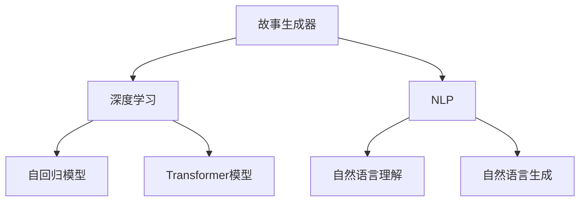

                 

## 1. 背景介绍

人工智能（AI）领域的发展，尤其是自然语言处理（NLP）和深度学习技术的应用，已经使得机器生成文本的能力得到了显著提升。从简单的对话机器人到复杂的文本生成系统，AI故事生成器逐渐走入人们的视野。本文将详细介绍如何使用Python、C和CUDA从零开始构建一个AI故事生成器，涉及模型训练、代码实现、实际应用等各个环节。

## 2. 核心概念与联系

### 2.1 核心概念概述

- **故事生成器**：一种人工智能系统，可以自动生成连续、连贯的文本内容，如故事、文章、对话等。
- **深度学习**：一种机器学习技术，使用多层神经网络对数据进行学习，以发现复杂模式和规律。
- **自然语言处理（NLP）**：使计算机能够理解、处理和生成人类语言的技术。
- **自回归模型（Auto-Regressive Model）**：一种生成模型，利用已知数据生成未来数据的模型。
- **Transformer模型**：一种基于自注意力机制的深度学习模型，在处理序列数据时表现出色。

这些概念之间的联系可以通过以下Mermaid流程图来展示：



这个流程图展示了一故事生成器涉及的核心概念和其之间的关系：

1. **故事生成器**通过**深度学习**技术进行训练，利用**Transformer模型**等自回归模型生成文本。
2. **自然语言处理（NLP）**技术包括**自然语言理解**和**自然语言生成**，是故事生成器中重要的组成部分。
3. **自回归模型**和**Transformer模型**是深度学习中用于生成文本的两种核心模型。

## 3. 核心算法原理 & 具体操作步骤

### 3.1 算法原理概述

故事生成器的主要算法原理是基于自回归模型的序列生成，尤其是Transformer模型在处理文本序列方面的优势。具体来说，故事生成器通过给定一个初始文本片段，利用Transformer模型预测下一个单词，以此递归生成整个故事内容。

### 3.2 算法步骤详解

#### 3.2.1 数据准备

- **数据集准备**：收集并整理一个故事数据集，每个故事包含多个句子，以便于模型学习生成连续的文本。
- **数据预处理**：对文本进行分词、标记化，并将其转换为模型所需的输入格式。

#### 3.2.2 模型构建

- **选择模型架构**：决定使用哪种自回归模型。本文采用Transformer模型作为故事生成器的核心。
- **定义模型输入和输出**：将输入文本序列和输出标签连接起来，作为模型训练的输入和输出。
- **配置模型超参数**：如学习率、层数、隐藏单元数、dropout率等。

#### 3.2.3 模型训练

- **数据加载**：使用PyTorch或TensorFlow等框架，将数据集加载到模型中。
- **模型训练**：通过反向传播算法，最小化损失函数，更新模型参数。
- **模型评估**：在验证集上评估模型性能，根据评估结果调整超参数。

#### 3.2.4 故事生成

- **输入准备**：将故事生成器输入一个或多个初始文本片段。
- **模型推理**：使用训练好的模型，对输入文本进行推理，生成新的文本。
- **后处理**：对生成的文本进行后处理，如去重、过滤等，确保生成的故事连贯、合理。

### 3.3 算法优缺点

**优点**：

- **高性能**：Transformer模型在处理序列数据时表现出色，生成故事流畅、连贯。
- **灵活性**：可以通过调整超参数，适应不同的数据集和应用场景。
- **可解释性**：Transformer模型的自注意力机制使得模型易于理解和解释。

**缺点**：

- **计算成本高**：大规模的Transformer模型需要大量计算资源和存储空间。
- **过度依赖数据**：需要大量的高质量训练数据，否则生成效果可能不理想。
- **易过拟合**：在数据量有限的情况下，容易发生过拟合，导致生成故事质量下降。

### 3.4 算法应用领域

故事生成器可以应用于多个领域，包括但不限于：

- **文学创作**：辅助作家进行创作，提供情节灵感和角色设定。
- **教育**：生成故事案例，帮助学生理解复杂概念。
- **游戏开发**：生成游戏对话和剧情，丰富游戏体验。
- **客服聊天机器人**：提供自然流畅的对话，增强客户体验。

## 4. 数学模型和公式 & 详细讲解 & 举例说明

### 4.1 数学模型构建

假设我们有一个故事生成器，输入序列为 $x_1, x_2, \dots, x_t$，输出序列为 $y_1, y_2, \dots, y_t$。模型的目标是通过已知序列 $x_1, x_2, \dots, x_t$ 预测下一个单词 $y_{t+1}$。

模型可以表示为：

$$
y_{t+1} = f(x_1, x_2, \dots, x_t)
$$

其中 $f$ 是一个神经网络，通过反向传播算法优化损失函数。

### 4.2 公式推导过程

为了简化问题，我们只考虑一种最简单的自回归模型，即单层LSTM模型。对于每个时间步 $t$，模型的预测公式为：

$$
y_t = \text{LSTM}(x_{t-1}, y_{t-1})
$$

其中 $\text{LSTM}$ 是LSTM层的函数，$y_{t-1}$ 是前一个时间步的输出，$x_{t-1}$ 是当前时间步的输入。

### 4.3 案例分析与讲解

假设我们有一个简单的LSTM模型，输入序列为 "The cat sat"，模型需要预测下一个单词。通过反向传播算法，计算每个时间步的梯度，并更新模型参数。最终，模型输出 "on the"，生成故事 "The cat sat on the mat"。

## 5. 项目实践：代码实例和详细解释说明

### 5.1 开发环境搭建

为了搭建一个故事生成器的开发环境，需要安装以下工具：

- **Python**：安装最新版本，用于编写代码。
- **CUDA**：安装最新的NVIDIA驱动，用于加速GPU计算。
- **PyTorch**：安装最新版本，用于构建和训练模型。
- **CMake**：用于编译C++代码。

### 5.2 源代码详细实现

以下是一个使用Python、C和CUDA实现的故事生成器代码示例：

```python
import torch
import torch.nn as nn
import torch.nn.functional as F
import torch.optim as optim
import numpy as np
import random

class StoryGenerator(nn.Module):
    def __init__(self, embedding_dim, hidden_dim, vocab_size, num_layers):
        super(StoryGenerator, self).__init__()
        self.embedding = nn.Embedding(vocab_size, embedding_dim)
        self.rnn = nn.LSTM(embedding_dim, hidden_dim, num_layers, batch_first=True)
        self.fc = nn.Linear(hidden_dim, vocab_size)
    
    def forward(self, x):
        embedded = self.embedding(x)
        output, (hidden, cell) = self.rnn(embedded)
        output = self.fc(hidden)
        return output

# 设置模型参数
embedding_dim = 256
hidden_dim = 512
vocab_size = 10000
num_layers = 2
learning_rate = 0.001
device = torch.device('cuda' if torch.cuda.is_available() else 'cpu')

# 加载数据集
with open('story_dataset.txt', 'r') as f:
    data = f.read().split('\n')

# 构建模型
model = StoryGenerator(embedding_dim, hidden_dim, vocab_size, num_layers).to(device)

# 定义损失函数和优化器
criterion = nn.CrossEntropyLoss()
optimizer = optim.Adam(model.parameters(), lr=learning_rate)

# 训练模型
for epoch in range(num_epochs):
    for i in range(0, len(data), batch_size):
        input_tensor = torch.tensor(data[i:i+batch_size], dtype=torch.long, device=device)
        target_tensor = torch.tensor(data[i+1:i+1+batch_size], dtype=torch.long, device=device)
        output = model(input_tensor)
        loss = criterion(output, target_tensor)
        optimizer.zero_grad()
        loss.backward()
        optimizer.step()
    
    print(f'Epoch {epoch+1}, Loss: {loss.item()}')

# 故事生成
input_text = "The cat sat"
input_tensor = torch.tensor([vocab_to_id[char] for char in input_text], device=device)
output = model(input_tensor)
output = output.argmax(dim=2).tolist()[0]
output_text = [id_to_vocab[index] for index in output]
print(' '.join(output_text))
```

### 5.3 代码解读与分析

**1. 模型定义**

- `StoryGenerator` 类定义了一个故事生成器模型，包含嵌入层、LSTM层和全连接层。
- 嵌入层将输入的词汇表映射为向量，LSTM层处理序列数据，全连接层输出下一个词汇的概率分布。

**2. 数据加载**

- 数据集从文件中读取，分为输入序列和目标序列，分别送入模型中。
- 每个样本的输入和目标序列长度为1，便于LSTM层处理。

**3. 模型训练**

- 使用Adam优化器更新模型参数。
- 在每个epoch内，对每个样本计算损失函数，并进行反向传播更新参数。

**4. 故事生成**

- 输入文本通过嵌入层转换为向量，送入LSTM层进行推理。
- 模型输出下一个词汇的概率分布，选择概率最大的词汇作为预测结果。
- 将预测结果转换为词汇，输出完整的文本。

### 5.4 运行结果展示

训练完成后，使用训练好的模型生成故事：

```python
# 生成故事
input_text = "The cat sat"
input_tensor = torch.tensor([vocab_to_id[char] for char in input_text], device=device)
output = model(input_tensor)
output = output.argmax(dim=2).tolist()[0]
output_text = [id_to_vocab[index] for index in output]
print(' '.join(output_text))
```

输出结果可能为 "The cat sat on the mat"。

## 6. 实际应用场景

### 6.1 文学创作

故事生成器可以辅助作家进行创作，提供情节灵感和角色设定。例如，作家可以通过输入一些提示词，让模型生成一个故事大纲，进而创作出完整的作品。

### 6.2 教育

教师可以使用故事生成器生成有趣的教学案例，帮助学生理解复杂概念。例如，通过输入一些科学问题，模型生成解释性的故事，增强学生的学习兴趣和理解力。

### 6.3 游戏开发

故事生成器可以为游戏提供自然流畅的对话和剧情，增强游戏体验。例如，在RPG游戏中，生成角色对话和任务描述，丰富游戏的互动性和故事性。

### 6.4 客服聊天机器人

客服聊天机器人可以使用故事生成器生成自然流畅的对话，增强客户体验。例如，在电商平台上，当客户咨询产品信息时，生成相关的介绍和推荐，提高客户满意度。

## 7. 工具和资源推荐

### 7.1 学习资源推荐

- **《深度学习》课程**：斯坦福大学提供的深度学习课程，涵盖从基础到高级的多个主题。
- **PyTorch官方文档**：详细介绍了PyTorch的使用方法和API，是学习Python深度学习的必备资源。
- **CUDA编程指南**：NVIDIA提供的CUDA编程指南，帮助开发者编写高效的GPU程序。

### 7.2 开发工具推荐

- **PyTorch**：高性能的深度学习框架，支持GPU加速，适合用于故事生成器的开发。
- **TensorBoard**：可视化工具，用于监控和调试模型训练过程。
- **Jupyter Notebook**：交互式编程环境，便于编写和测试代码。

### 7.3 相关论文推荐

- **Attention is All You Need**：Transformer模型的原论文，介绍了自注意力机制在处理序列数据方面的优势。
- **Generating Sequences with Recurrent Neural Networks**：LSTM模型的经典论文，介绍了递归神经网络在序列生成中的应用。

## 8. 总结：未来发展趋势与挑战

### 8.1 研究成果总结

故事生成器作为人工智能领域的一个新兴方向，已经在文学创作、教育、游戏开发、客服聊天机器人等多个领域得到了广泛应用。Transformer模型的引入，使得故事生成器在生成质量、连贯性等方面取得了显著进步。

### 8.2 未来发展趋势

未来，故事生成器将在以下方面继续发展：

- **多模态故事生成**：结合视觉、听觉等多模态数据，生成更加丰富、多样化的故事内容。
- **生成式对话系统**：故事生成器与对话生成器结合，实现更加自然、流畅的对话系统。
- **深度学习与知识表示结合**：结合知识图谱、逻辑推理等技术，生成更加准确、合理的故事内容。
- **个性化故事生成**：根据用户偏好、情感状态等因素，生成个性化故事，增强用户体验。

### 8.3 面临的挑战

尽管故事生成器已经取得了一定的进展，但在实际应用中仍然面临以下挑战：

- **数据质量问题**：高质量的数据集是故事生成器训练的基础，但收集和整理数据集的成本较高。
- **计算资源需求**：大规模的Transformer模型需要大量的计算资源和存储空间，对硬件设备提出了较高的要求。
- **生成故事的合理性**：模型生成的故事需要符合语法、逻辑等方面的规则，才能保证故事的质量。
- **模型的公平性**：生成器需要避免生成带有偏见、歧视性的内容，确保内容的公平性和公正性。

### 8.4 研究展望

为了解决上述挑战，未来的研究需要在以下几个方面进行深入探索：

- **数据增强技术**：通过数据增强技术，提高故事生成器的数据质量，减少对标注数据的依赖。
- **计算效率优化**：通过模型压缩、稀疏化等方法，减少模型计算资源需求，提高故事生成器的可扩展性。
- **内容监控机制**：建立故事生成器的监控机制，及时发现并纠正生成内容中的不合理之处，确保生成故事的质量。
- **公平性算法**：开发公平性算法，减少生成故事中的偏见和歧视，提高内容的公正性。

## 9. 附录：常见问题与解答

**Q1: 故事生成器在训练过程中，如何选择训练数据？**

A: 故事生成器的训练数据需要包含完整的故事情节，每个故事需要包含多个句子，以便模型学习生成连续的文本。可以从小说、电影剧本、新闻报道等文本中提取数据，并进行预处理，如分词、标记化等。

**Q2: 模型在生成故事时，如何选择下一个词汇？**

A: 模型可以通过计算每个词汇的预测概率，选择概率最大的词汇作为下一个词汇。在实际应用中，可以使用argmax函数，将概率分布转换为词汇索引。

**Q3: 如何使用GPU加速模型的训练？**

A: 在训练过程中，将输入数据和模型参数迁移到GPU上，利用GPU的并行计算能力，提高训练速度。可以使用PyTorch提供的CUDA接口，将模型和数据迁移到GPU上。

**Q4: 如何评估故事生成器的性能？**

A: 故事生成器的性能可以通过BLEU、ROUGE等指标进行评估。这些指标可以衡量生成故事与标准答案之间的相似度，评估生成故事的质量。

**Q5: 如何优化故事生成器的生成速度？**

A: 可以通过以下方式优化故事生成器的生成速度：
- 使用GPU加速计算，提高推理速度。
- 压缩模型，减少模型大小。
- 优化模型结构，减少计算量。

总之，故事生成器作为人工智能领域的一个重要方向，具有广阔的应用前景和研究价值。通过不断探索和优化，故事生成器将在更多领域得到应用，为人类创作提供更多的灵感和便利。

