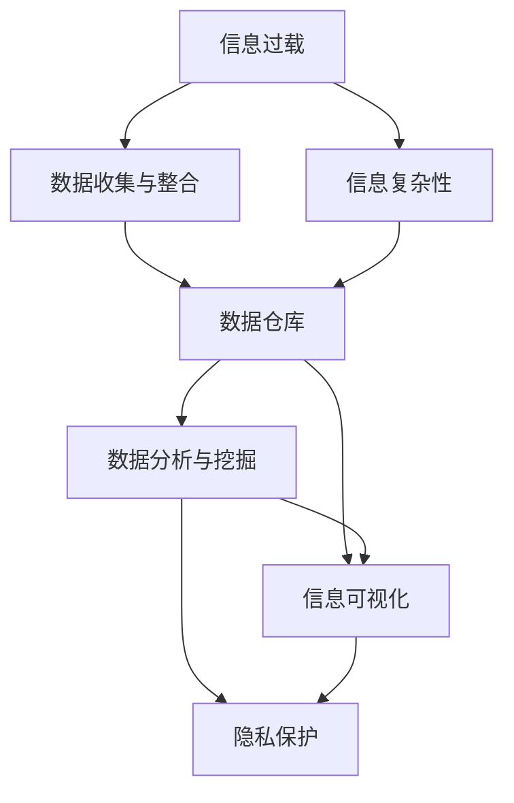

                 

# 信息时代的信息管理策略与实践：管理信息过载和复杂性

## 1. 背景介绍

### 1.1 问题由来

在信息时代，数据爆炸和信息过载成为了普遍现象。海量数据的收集和处理，虽然为社会带来了巨大价值，但也给信息管理带来了前所未有的挑战。信息过载不仅导致企业运营效率低下，决策错误，还使得消费者信息负担加重，无法有效筛选出有价值的内容。如何有效地管理和利用这些信息，使其在各自的应用场景中发挥最大价值，成为了当今社会亟需解决的重要课题。

### 1.2 问题核心关键点

信息过载和复杂性的核心问题在于如何高效地整理、分析和利用海量信息。当前的信息管理策略主要包括以下几个关键点：

- **数据收集与整合**：如何从各个数据源中高效收集和整合信息，构建统一的信息仓库。
- **数据存储与组织**：如何在有限的空间和时间内，有效地存储和组织数据，便于快速检索和处理。
- **数据分析与挖掘**：如何通过先进的数据分析工具和技术，从数据中提取有用的信息和模式。
- **信息可视化**：如何将分析结果以直观的方式呈现，辅助决策和分析。
- **隐私与安全**：如何在数据收集和分析过程中保护用户隐私和数据安全，防止信息泄露和滥用。

这些关键点相互关联，共同构成了信息时代的信息管理框架，旨在帮助企业和个人高效管理海量信息，使其在不同应用场景中发挥最大价值。

### 1.3 问题研究意义

研究高效的信息管理策略，对于提升企业运营效率，优化决策过程，保护用户隐私，具有重要意义：

1. **提升企业运营效率**：通过有效的信息整合与分析，企业能够快速获取有价值的信息，优化生产流程，提升服务质量，降低运营成本。
2. **优化决策过程**：高质量的信息管理策略能够帮助企业做出更为科学合理的决策，避免因信息不足或过载导致的决策失误。
3. **保护用户隐私**：信息管理过程中，如何保护用户隐私成为了越来越重要的话题，也是社会责任和法律要求的体现。
4. **助力信息普惠**：通过有效的信息管理策略，使得更多用户能够便捷地获取和使用有价值的信息，推动社会信息普惠。
5. **驱动技术创新**：信息管理策略的不断进步，促进了大数据、人工智能、物联网等新兴技术的快速发展，驱动了技术的创新和应用。

## 2. 核心概念与联系

### 2.1 核心概念概述

为了更好地理解信息管理的策略与实践，本节将介绍几个密切相关的核心概念：

- **信息过载**：指信息数量过多，超出了个人或系统处理能力的状况。信息过载会导致信息获取效率下降，增加决策难度。
- **信息复杂性**：指信息内容的复杂度，如信息的结构、类型、来源、格式等。信息复杂性越高，处理难度越大。
- **信息管理**：指对信息的收集、存储、组织、分析和利用的全过程。信息管理的目标是高效、准确、安全地管理和利用信息。
- **数据仓库**：指存储和管理企业内部数据的集中式设施，通过统一的数据模型和元数据管理，实现数据的高效整合与利用。
- **数据挖掘**：指通过先进的分析技术，从数据中提取有用信息和模式，为决策提供支持。
- **信息可视化**：指将数据以直观图形的方式展示出来，帮助用户理解和分析信息。
- **隐私保护**：指在信息收集和分析过程中，如何保护用户隐私，防止数据滥用和泄露。

这些核心概念之间的逻辑关系可以通过以下Mermaid流程图来展示：



这个流程图展示了几大核心概念及其之间的联系：

1. 信息过载通过数据收集与整合缓解。
2. 信息复杂性在数据仓库中得到管理和整合。
3. 数据分析与挖掘从数据仓库中提取有价值的信息。
4. 信息可视化将分析结果以直观的方式呈现。
5. 隐私保护贯穿数据收集、存储、分析和展示的各个环节。

## 3. 核心算法原理 & 具体操作步骤

### 3.1 算法原理概述

信息管理的核心在于高效、准确地管理和利用信息。本文将从算法原理的角度，深入探讨信息管理的策略与实践。

信息管理的核心目标是通过先进的数据处理和分析技术，从海量信息中提取有价值的模式和知识，辅助决策，优化运营效率。通常，信息管理的过程可以划分为数据收集、存储、组织、分析和利用的五个阶段，每个阶段都有相应的算法和技术支持。

### 3.2 算法步骤详解

信息管理的算法步骤主要包括以下几个关键环节：

**Step 1: 数据收集与整合**

1. 确定数据来源：包括内部数据、外部数据、用户数据等。
2. 数据采集工具：使用API、ETL工具、爬虫等手段，从各个数据源中收集数据。
3. 数据清洗与预处理：清洗数据中的噪声、缺失值和异常值，标准化数据格式。

**Step 2: 数据存储与组织**

1. 选择合适的存储系统：如关系型数据库、NoSQL数据库、云存储等。
2. 数据模型设计：构建统一的数据模型，实现数据的高效存储和检索。
3. 数据分片和索引：通过分片和索引技术，提高数据查询效率。

**Step 3: 数据分析与挖掘**

1. 数据预处理：包括缺失值填补、数据降维、特征工程等步骤。
2. 数据分析方法：选择适合的统计分析、机器学习、深度学习等算法，从数据中提取有用信息。
3. 模型评估与优化：通过交叉验证、性能指标等方法，评估和优化模型。

**Step 4: 信息可视化**

1. 选择合适的可视化工具：如Tableau、Power BI、ECharts等。
2. 数据可视化设计：设计直观的图表、仪表盘、数据报告等可视化形式。
3. 用户交互设计：通过交互式设计，提升用户体验。

**Step 5: 隐私保护**

1. 数据加密：使用加密技术保护数据隐私。
2. 访问控制：设置严格的访问权限，防止数据滥用和泄露。
3. 隐私政策：制定并遵守数据隐私政策，保护用户隐私。

### 3.3 算法优缺点

信息管理算法具有以下优点：

1. **高效性**：通过先进的数据处理和分析技术，能够快速从海量信息中提取有用信息。
2. **准确性**：通过精确的数据模型和算法，确保信息分析和决策的准确性。
3. **可扩展性**：在云环境和大数据技术的支持下，能够轻松应对数据量的增长。
4. **可视化性**：通过信息可视化技术，直观呈现分析结果，辅助决策和分析。

同时，该算法也存在一些局限性：

1. **数据源多样性**：不同来源的数据格式、质量差异较大，整合和清洗难度高。
2. **数据复杂性**：多源异构数据、非结构化数据处理复杂，需要更高级的数据处理技术。
3. **隐私风险**：数据隐私保护难度大，尤其是大数据环境下的隐私保护。
4. **计算资源需求高**：处理海量数据需要高性能计算资源，成本较高。
5. **可解释性不足**：复杂的数据模型和算法，难以解释其内部工作机制。

尽管存在这些局限性，但总体而言，信息管理算法在提升信息处理效率和准确性方面发挥了重要作用。未来研究的方向是进一步降低数据处理的复杂性，提升数据隐私保护，并增强算法的可解释性。

### 3.4 算法应用领域

信息管理算法在多个领域中得到了广泛应用，以下是一些典型的应用场景：

- **企业运营管理**：通过高效的信息管理，优化生产流程，降低运营成本，提升服务质量。
- **金融风险管理**：利用数据挖掘和分析技术，识别潜在风险，进行风险评估和预测。
- **市场营销**：通过分析用户行为数据，进行精准营销和市场细分，提升销售转化率。
- **医疗健康管理**：通过整合患者数据，进行疾病预测和个性化治疗，提升医疗服务质量。
- **智能城市治理**：通过数据分析和可视化技术，提升城市管理效率，优化资源配置。

这些应用场景展示了信息管理算法在提升业务效率、优化决策过程方面的巨大潜力。

## 4. 数学模型和公式 & 详细讲解 & 举例说明

### 4.1 数学模型构建

信息管理的数学模型主要涉及数据处理、数据挖掘、信息可视化等多个领域。以下将以数据挖掘和信息可视化为例，介绍相关数学模型的构建。

**数据挖掘模型构建**

设数据集为 $D=\{(x_i, y_i)\}_{i=1}^N$，其中 $x_i$ 为输入特征向量，$y_i$ 为输出标签。数据挖掘的目标是从数据集中提取有用模式和知识，通常使用监督学习算法，如回归、分类、聚类等。

假设使用线性回归模型进行数据挖掘，模型为 $y=f(\mathbf{x})=\mathbf{w}^T\mathbf{x}+b$，其中 $\mathbf{w}$ 为权重向量，$b$ 为偏置项。

**信息可视化模型构建**

信息可视化的目标是将数据以直观的方式展示出来，常用的可视化工具包括图表、仪表盘、数据报告等。以下以散点图为例，介绍可视化模型的构建。

设数据集为 $D=\{(x_i, y_i)\}_{i=1}^N$，其中 $x_i$ 为横坐标，$y_i$ 为纵坐标。散点图可视化的模型为：

$$
\text{散点图} = \{(x_i, y_i)\}_{i=1}^N
$$

### 4.2 公式推导过程

**数据挖掘公式推导**

假设数据集 $D=\{(x_i, y_i)\}_{i=1}^N$，其中 $x_i$ 为输入特征向量，$y_i$ 为输出标签。线性回归模型的目标是最小化预测值与真实标签之间的均方误差（MSE）：

$$
\mathcal{L}(\mathbf{w}, b) = \frac{1}{N}\sum_{i=1}^N (y_i - f(\mathbf{x}_i))^2
$$

通过梯度下降算法求解最小值，得到最优的权重向量 $\mathbf{w}$ 和偏置项 $b$：

$$
\mathbf{w}^* = \arg\min_{\mathbf{w}} \mathcal{L}(\mathbf{w}, b)
$$

**信息可视化公式推导**

散点图可视化的模型公式为：

$$
\text{散点图} = \{(x_i, y_i)\}_{i=1}^N
$$

在可视化工具中，通过横坐标 $x$ 和纵坐标 $y$ 映射，将数据点绘制成散点图。可视化模型通常不涉及复杂的数学推导，主要依赖于图形库和用户交互设计。

### 4.3 案例分析与讲解

**案例一：企业销售数据分析**

假设某企业收集了过去一年的销售数据，包括产品类别、销售金额、销售时间等。通过数据清洗和预处理，构建统一的数据模型，使用线性回归模型进行数据分析，得到产品类别与销售金额之间的关系：

$$
\hat{y} = \mathbf{w}^T\mathbf{x}+b
$$

其中 $\mathbf{w}$ 为权重向量，$b$ 为偏置项。通过分析结果，企业可以优化产品结构和销售策略，提升销售业绩。

**案例二：智能推荐系统**

假设某电商平台收集了用户的浏览记录、购买记录、评分数据等。通过数据清洗和特征工程，构建用户-物品关联矩阵，使用协同过滤算法进行推荐，得到用户的个性化推荐结果：

$$
\hat{y} = \mathbf{w}^T\mathbf{x}+b
$$

其中 $\mathbf{w}$ 为权重向量，$b$ 为偏置项。通过推荐系统，平台可以提升用户体验，提高用户留存率。

## 5. 项目实践：代码实例和详细解释说明

### 5.1 开发环境搭建

在进行信息管理实践前，我们需要准备好开发环境。以下是使用Python进行信息管理的开发环境配置流程：

1. 安装Anaconda：从官网下载并安装Anaconda，用于创建独立的Python环境。

2. 创建并激活虚拟环境：
```bash
conda create -n info-management-env python=3.8 
conda activate info-management-env
```

3. 安装Python包：
```bash
pip install pandas numpy scikit-learn matplotlib seaborn jupyter notebook ipython
```

4. 安装可视化工具：
```bash
pip install matplotlib pandas_datareader plotly
```

5. 安装数据分析工具：
```bash
pip install scikit-learn tensorflow
```

完成上述步骤后，即可在`info-management-env`环境中开始信息管理实践。

### 5.2 源代码详细实现

这里我们以销售数据分析为例，给出使用Python进行信息管理的完整代码实现。

首先，定义数据清洗与预处理函数：

```python
import pandas as pd

def data_cleaning(df):
    # 删除缺失值
    df.dropna(inplace=True)
    # 标准化数据格式
    df['日期'] = pd.to_datetime(df['日期'])
    # 转换数据类型
    df['销售额'] = pd.to_numeric(df['销售额'], errors='coerce')
    # 缺失值填补
    df['销售额'].fillna(df['销售额'].mean(), inplace=True)
    return df
```

然后，定义数据可视化函数：

```python
import matplotlib.pyplot as plt

def data_visualization(df):
    # 绘制散点图
    plt.scatter(df['日期'], df['销售额'])
    plt.xlabel('日期')
    plt.ylabel('销售额')
    plt.title('销售额与日期关系')
    plt.show()
```

接着，定义数据分析函数：

```python
from sklearn.linear_model import LinearRegression

def data_analysis(df):
    # 分割训练集和测试集
    train_df = df.sample(frac=0.8, random_state=1)
    test_df = df.drop(train_df.index)
    # 线性回归模型
    X_train = train_df[['日期']]
    y_train = train_df['销售额']
    X_test = test_df[['日期']]
    y_test = test_df['销售额']
    model = LinearRegression()
    model.fit(X_train, y_train)
    y_pred = model.predict(X_test)
    # 评估模型
    print('R^2:', model.score(X_test, y_test))
    # 可视化结果
    data_visualization(df)
```

最后，启动数据分析流程：

```python
# 加载数据
df = pd.read_csv('sales_data.csv')
# 数据清洗
df = data_cleaning(df)
# 数据分析
data_analysis(df)
```

以上就是使用Python进行信息管理的完整代码实现。可以看到，Python的强大库函数和简洁的语法，使得信息管理任务变得高效便捷。

### 5.3 代码解读与分析

让我们再详细解读一下关键代码的实现细节：

**数据清洗函数**：
- `dropna`方法删除缺失值。
- `to_datetime`方法将日期字符串转换为日期格式。
- `to_numeric`方法将销售额字符串转换为数值类型，并处理错误值。
- `fillna`方法填补缺失值，使用均值填补。

**数据可视化函数**：
- `scatter`方法绘制散点图。
- `xlabel`和`ylabel`方法设置坐标轴标签。
- `title`方法设置图表标题。

**数据分析函数**：
- `sample`方法将数据集分割为训练集和测试集。
- `LinearRegression`类建立线性回归模型。
- `fit`方法训练模型。
- `predict`方法进行预测。
- `score`方法评估模型性能。

这些函数和类共同构成了信息管理的核心组件，使得数据清洗、建模、评估和可视化成为可能。通过调用这些函数和类，可以快速实现信息管理的实践需求。

当然，工业级的系统实现还需考虑更多因素，如数据存储、模型部署、用户界面等。但核心的信息管理逻辑基本与此类似。

## 6. 实际应用场景

### 6.1 智能推荐系统

智能推荐系统是信息管理的一个重要应用场景。通过分析用户行为数据，推荐系统能够提供个性化的产品和服务，提升用户体验和满意度。

在技术实现上，可以收集用户的浏览记录、购买记录、评分数据等，构建用户-物品关联矩阵，使用协同过滤、内容推荐等算法进行推荐。推荐系统通过不断学习用户行为数据，提升推荐精度和多样性，满足用户个性化需求。

### 6.2 金融风险管理

金融风险管理是信息管理在金融领域的重要应用。通过分析市场数据和用户行为数据，金融机构能够识别潜在风险，进行风险评估和预测。

在技术实现上，可以收集股票、债券、商品等金融数据，构建金融市场模型，使用机器学习、深度学习等算法进行风险预测。金融机构通过风险管理，降低金融风险，保护投资者利益。

### 6.3 智能城市治理

智能城市治理是信息管理在城市管理中的应用。通过分析城市数据，智能城市能够提升城市管理效率，优化资源配置。

在技术实现上，可以收集城市交通、环境、公共服务等相关数据，构建城市数据模型，使用数据挖掘、机器学习等算法进行城市管理决策。智能城市通过数据分析，提升城市管理水平，改善市民生活质量。

### 6.4 未来应用展望

随着信息管理技术的不断发展，其在各行业的应用场景将会更加广泛。未来，信息管理将深度融合人工智能、物联网等新兴技术，推动各行业数字化转型，构建智慧城市、智慧医疗、智慧教育等智能化应用。

具体而言，信息管理在未来可能呈现以下几个发展趋势：

1. **实时性增强**：随着大数据、云计算等技术的发展，信息管理将能够实现实时数据处理和分析，提升信息获取和决策效率。
2. **数据融合与跨界应用**：信息管理将进一步融合多源异构数据，实现跨行业、跨领域的信息共享和协同，推动各行业的协同创新。
3. **智能化提升**：通过引入机器学习、深度学习等技术，信息管理将具备更高的智能水平，提供更加精准和个性化的服务。
4. **隐私保护加强**：随着数据隐私意识的提升，信息管理将更加注重数据隐私保护，确保数据安全性和用户隐私。
5. **数据可视化提升**：信息可视化技术将进一步提升，通过更加直观、动态的可视化方式，辅助决策和分析。

这些趋势展示了信息管理在未来的广阔前景，将为各行各业带来新的发展机遇。

## 7. 工具和资源推荐

### 7.1 学习资源推荐

为了帮助开发者系统掌握信息管理的理论基础和实践技巧，这里推荐一些优质的学习资源：

1. 《Python数据科学手册》：由数据科学领域的专家撰写，全面介绍了Python在数据处理、分析和可视化方面的应用。
2. 《机器学习实战》：介绍机器学习算法的实现和应用，帮助读者理解信息管理的核心技术。
3. 《信息可视化设计与实现》：讲解信息可视化的基本原理和实现方法，帮助读者掌握数据呈现的技术。
4. 《数据科学与工程》课程：由Coursera等平台开设的在线课程，深入浅出地介绍了数据处理、分析和可视化的技术。
5. Kaggle平台：提供丰富的数据集和竞赛活动，帮助读者通过实践提升信息管理技能。

通过对这些资源的学习实践，相信你一定能够快速掌握信息管理的精髓，并用于解决实际的信息管理问题。

### 7.2 开发工具推荐

高效的信息管理离不开优秀的工具支持。以下是几款用于信息管理的常用工具：

1. Jupyter Notebook：轻量级的开发环境，支持多种语言和库函数，便于快速迭代和共享。
2. Apache Hadoop：大数据处理框架，支持分布式计算和存储，适合处理海量数据。
3. Apache Spark：分布式计算引擎，支持多种数据处理任务，包括数据分析、机器学习等。
4. Tableau：数据可视化工具，支持复杂的数据分析和报表生成，适合企业级信息管理需求。
5. Power BI：微软推出的商业智能工具，支持数据集成、分析、可视化等多种功能。

合理利用这些工具，可以显著提升信息管理的开发效率，加快创新迭代的步伐。

### 7.3 相关论文推荐

信息管理的研究源于学界的持续研究。以下是几篇奠基性的相关论文，推荐阅读：

1. K-Means Clustering：一种经典的聚类算法，广泛应用于数据分组和模式识别。
2. Support Vector Machine：一种广泛应用于分类和回归的机器学习算法，具有较高的准确性和泛化能力。
3. Principal Component Analysis（PCA）：一种常用的降维技术，通过线性变换将高维数据映射到低维空间，降低数据复杂性。
4. Fast Fourier Transform（FFT）：一种高效的信号处理算法，广泛应用于信号分析和图像处理。
5. Linear Regression：一种基础的回归分析方法，广泛应用于数据挖掘和预测建模。

这些论文代表了大数据、机器学习等领域的经典算法，为信息管理提供了坚实的基础。

## 8. 总结：未来发展趋势与挑战

### 8.1 总结

本文对信息管理的策略与实践进行了全面系统的介绍。首先阐述了信息过载和复杂性的核心问题，明确了信息管理在提升企业运营效率、优化决策过程等方面的重要意义。其次，从算法原理的角度，深入讲解了信息管理的核心步骤和关键技术。最后，结合实际应用场景，展示了信息管理在各行业中的广泛应用前景。

通过本文的系统梳理，可以看到，信息管理策略在处理海量信息、提升运营效率和决策质量方面发挥了重要作用。未来，信息管理技术将不断进步，成为各行业数字化转型的重要支撑。

### 8.2 未来发展趋势

展望未来，信息管理技术将呈现以下几个发展趋势：

1. **技术融合与创新**：信息管理将深度融合大数据、人工智能、物联网等新兴技术，推动各行业的数字化转型。
2. **实时性与智能性提升**：随着大数据、云计算等技术的发展，信息管理将实现实时数据处理和智能决策，提升信息获取和决策效率。
3. **数据隐私与安全加强**：随着数据隐私意识的提升，信息管理将更加注重数据隐私保护，确保数据安全性和用户隐私。
4. **多源数据融合**：信息管理将进一步融合多源异构数据，实现跨行业、跨领域的信息共享和协同，推动各行业的协同创新。
5. **跨界应用拓展**：信息管理将在更多领域得到应用，如智慧城市、智慧医疗、智慧教育等，推动各行业智能化转型。

这些趋势展示了信息管理在未来的广阔前景，将为各行各业带来新的发展机遇。

### 8.3 面临的挑战

尽管信息管理技术已经取得了显著进展，但在迈向更加智能化、普适化应用的过程中，仍面临诸多挑战：

1. **数据多样性**：不同来源的数据格式、质量差异较大，整合和清洗难度高。
2. **数据复杂性**：多源异构数据、非结构化数据处理复杂，需要更高级的数据处理技术。
3. **隐私风险**：数据隐私保护难度大，尤其是大数据环境下的隐私保护。
4. **计算资源需求高**：处理海量数据需要高性能计算资源，成本较高。
5. **可解释性不足**：复杂的数据模型和算法，难以解释其内部工作机制。

尽管存在这些挑战，但总体而言，信息管理技术在提升信息处理效率和准确性方面发挥了重要作用。未来研究的方向是进一步降低数据处理的复杂性，提升数据隐私保护，并增强算法的可解释性。

### 8.4 研究展望

面对信息管理面临的种种挑战，未来的研究需要在以下几个方面寻求新的突破：

1. **数据预处理技术**：开发更加高效的数据清洗、数据转换和特征工程技术，降低数据处理难度。
2. **数据可视化工具**：开发更加智能、动态的数据可视化工具，辅助决策和分析。
3. **智能算法**：引入机器学习、深度学习等技术，提升信息管理的智能化水平。
4. **隐私保护技术**：开发更加高效的数据加密、访问控制和隐私保护技术，确保数据安全和用户隐私。
5. **跨界数据融合**：探索多源异构数据的融合与协同，实现跨行业、跨领域的信息共享。

这些研究方向的探索，必将引领信息管理技术迈向更高的台阶，为构建安全、可靠、可解释、可控的智能系统铺平道路。面向未来，信息管理技术还需要与其他人工智能技术进行更深入的融合，如知识表示、因果推理、强化学习等，多路径协同发力，共同推动信息管理技术的发展。只有勇于创新、敢于突破，才能不断拓展信息管理的边界，让信息管理技术更好地服务于社会。

## 9. 附录：常见问题与解答

**Q1：信息管理与传统数据管理有何不同？**

A: 信息管理与传统数据管理在目标和实现方式上有明显区别。传统数据管理主要关注数据的存储、备份和恢复，目标是保证数据的安全性和完整性。而信息管理则更加注重数据的利用和分析，通过数据挖掘、数据分析等手段，从海量数据中提取有价值的信息，支持决策和优化运营。信息管理不仅关注数据存储和安全性，更注重数据的应用价值。

**Q2：信息管理的主要技术手段有哪些？**

A: 信息管理的主要技术手段包括数据清洗与预处理、数据存储与组织、数据分析与挖掘、信息可视化等。这些技术手段共同构成了信息管理的核心流程，使得信息管理能够高效、准确地管理和利用海量信息。

**Q3：如何保证信息管理的隐私与安全？**

A: 信息管理中，隐私与安全是至关重要的环节。保证隐私与安全的主要手段包括数据加密、访问控制、隐私政策等。数据加密可以通过对称加密、非对称加密等技术，保护数据在传输和存储过程中的安全性。访问控制可以通过严格的权限管理，防止数据滥用和泄露。隐私政策制定并遵守数据隐私标准，保护用户隐私。

**Q4：信息管理的未来发展趋势是什么？**

A: 信息管理的未来发展趋势包括实时性增强、数据融合与跨界应用、智能化提升、隐私保护加强、数据可视化提升等。这些趋势展示了信息管理在未来的广阔前景，将为各行各业带来新的发展机遇。

**Q5：信息管理技术对各行业有什么影响？**

A: 信息管理技术对各行业的影响主要体现在提升运营效率、优化决策过程、保护用户隐私等方面。通过信息管理，企业能够更高效地处理海量信息，提升运营效率和决策质量。金融机构通过风险管理，降低金融风险，保护投资者利益。智能城市通过数据分析，提升城市管理水平，改善市民生活质量。

通过本文的系统梳理，可以看到，信息管理策略在处理海量信息、提升运营效率和决策质量方面发挥了重要作用。未来，信息管理技术将不断进步，成为各行业数字化转型的重要支撑。

