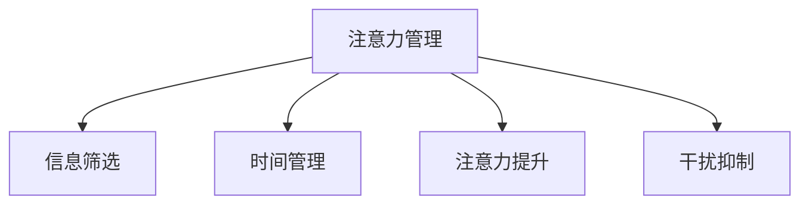

                 

# 信息时代的注意力管理实践与指南：在干扰和分心中保持头脑清晰

## 1. 背景介绍

### 1.1 问题由来
在信息爆炸的时代，我们每个人都在不断地被海量信息所包围。无论是工作、学习还是日常生活，无处不在的干扰和分心都极大地影响了我们的注意力管理。信息的巨量涌入，不仅容易引发认知过载，还可能导致注意力缺失和决策质量下降。因此，如何有效管理注意力，提升在干扰和分心环境中的集中力，成为了一个重要的研究课题。

### 1.2 问题核心关键点
注意力管理（Attention Management）是指通过科学的方法和技术手段，帮助个体在信息过载的环境下，保持专注、提升效率。其核心关键点包括：

1. **信息筛选**：通过算法或工具帮助识别重要信息，过滤无用干扰。
2. **时间规划**：制定合理的时间管理策略，优化工作学习节奏。
3. **注意力提升**：使用脑科学和心理学方法，提升个体的注意力水平。
4. **干扰抑制**：应用技术手段减少外界干扰，保持头脑清晰。

本文将围绕这些关键点，探讨信息时代下的注意力管理实践与指南，帮助读者在干扰和分心中保持头脑清晰，提升工作和学习效率。

## 2. 核心概念与联系

### 2.1 核心概念概述

为了更好地理解注意力管理，本节将介绍几个密切相关的核心概念：

- **注意力管理（Attention Management）**：指通过科学的方法和技术手段，帮助个体在信息过载的环境下，保持专注、提升效率。
- **信息筛选（Information Filtering）**：通过算法或工具帮助识别重要信息，过滤无用干扰。
- **时间管理（Time Management）**：制定合理的时间管理策略，优化工作学习节奏。
- **注意力提升（Attention Enhancement）**：使用脑科学和心理学方法，提升个体的注意力水平。
- **干扰抑制（Distraction Suppression）**：应用技术手段减少外界干扰，保持头脑清晰。

这些核心概念之间的逻辑关系可以通过以下Mermaid流程图来展示：



这个流程图展示了一些核心概念以及它们之间的联系：

1. 注意力管理是核心，通过信息筛选、时间管理、注意力提升和干扰抑制等手段，帮助个体有效管理注意力。
2. 信息筛选帮助识别重要信息，过滤无用干扰，是注意力管理的基础。
3. 时间管理通过合理规划时间，优化工作学习节奏，提升注意力管理的效率。
4. 注意力提升使用脑科学和心理学方法，提升个体的注意力水平，是注意力管理的关键。
5. 干扰抑制通过技术手段减少外界干扰，保持头脑清晰，是注意力管理的保障。

## 3. 核心算法原理 & 具体操作步骤
### 3.1 算法原理概述

注意力管理的关键在于如何识别和筛选重要信息，并提升个体的注意力水平。这涉及到了认知科学、心理学、神经科学等多个领域，并结合了算法和工具的使用。

1. **信息筛选**：通过内容过滤算法，如文本分类、关键词提取等，识别出重要的信息，并将其推荐给用户。
2. **时间管理**：使用时间块技术（如番茄钟、任务清单等），制定合理的时间管理策略，优化工作学习节奏。
3. **注意力提升**：使用脑电波监测、注意力训练游戏等，提升个体的注意力水平。
4. **干扰抑制**：应用专注模式（如勿扰模式、噪音屏蔽），减少外界干扰，保持头脑清晰。

### 3.2 算法步骤详解

#### 3.2.1 信息筛选
**步骤1: 数据收集**
- 收集用户的工作、学习、娱乐等各类文本数据。
- 使用自然语言处理（NLP）技术对文本进行预处理，如分词、去停用词等。

**步骤2: 特征提取**
- 使用TF-IDF、Word2Vec、BERT等算法提取文本特征。
- 根据特征权重进行排序，识别出重要信息和无用干扰。

**步骤3: 信息推荐**
- 根据用户历史行为和偏好，生成个性化信息推荐列表。
- 使用机器学习模型（如协同过滤、基于内容的推荐等），优化信息推荐效果。

#### 3.2.2 时间管理
**步骤1: 制定计划**
- 使用时间块技术（如番茄钟），将工作时间分成若干个时间块，每个时间块专注处理一个任务。
- 根据任务的重要性和紧急程度，分配不同的时间块长度。

**步骤2: 任务清单**
- 使用任务管理工具（如Todoist、Trello等），列出待办事项清单，记录每个任务的优先级和截止时间。
- 定期回顾任务清单，调整计划，优化任务处理顺序。

**步骤3: 时间记录**
- 使用时间记录工具（如RescueTime、Toggl等），记录每个任务的时间消耗。
- 分析时间记录数据，发现时间浪费的环节，优化时间分配。

#### 3.2.3 注意力提升
**步骤1: 脑电波监测**
- 使用脑电波监测设备（如NeuroSky MindWave Mini），记录用户的大脑活动状态。
- 分析脑电波数据，识别注意力集中度和疲劳度。

**步骤2: 注意力训练**
- 使用注意力训练应用（如Brain.fm、Headspace等），进行注意力训练。
- 定期进行注意力测试，评估训练效果，调整训练方案。

**步骤3: 心理调节**
- 使用心理调节技术（如冥想、呼吸训练等），提升个体的专注力和心理稳定性。
- 定期参加心理辅导，优化心理状态，应对压力和焦虑。

#### 3.2.4 干扰抑制
**步骤1: 专注模式**
- 使用专注模式（如勿扰模式、噪音屏蔽），减少外界干扰。
- 定期进行工作环境优化，营造安静、舒适的工作空间。

**步骤2: 智能工具**
- 使用智能工具（如Focus@Will、Noisli等），提供定制化的背景噪音和环境音。
- 使用任务管理工具（如Forest、StayFocusd等），限制访问干扰性网站和应用。

**步骤3: 行为习惯**
- 建立良好的行为习惯，如定时休息、定期锻炼等，提升整体健康水平。
- 减少不必要的社交媒体和娱乐活动，集中精力处理重要任务。

### 3.3 算法优缺点

注意力管理的算法具有以下优点：
1. **效率提升**：通过识别重要信息，优化时间管理，提升整体工作效率和学习效果。
2. **个性化定制**：根据用户历史行为和偏好，提供个性化推荐和计划，提升用户满意度。
3. **技术辅助**：结合脑电波监测、注意力训练等技术手段，提供科学、精准的注意力管理方法。

同时，该方法也存在一定的局限性：
1. **数据隐私**：使用个性化推荐和信息筛选，涉及到用户隐私数据，需严格遵守相关法律法规。
2. **技术依赖**：依赖于算法和工具的准确性和效率，一旦出现故障，可能影响注意力管理效果。
3. **用户体验**：过于复杂的工具和算法，可能给用户带来负担，降低使用体验。
4. **适应性**：用户需要适应新技术和新方法，才能发挥其最大效用。

尽管存在这些局限性，但就目前而言，注意力管理算法已成为提升个体注意力水平的重要手段。未来相关研究的方向包括如何进一步提高算法的准确性和个性化程度，以及如何减少对技术手段的依赖。

### 3.4 算法应用领域

注意力管理算法在多个领域得到了广泛应用，例如：

- **企业办公**：提升员工的工作效率，优化时间管理，减少干扰，提高整体生产力和满意度。
- **教育培训**：帮助学生集中注意力，优化学习计划，提高学习效果。
- **家庭生活**：帮助家庭成员减少干扰，提升生活质量，营造良好的家庭氛围。
- **在线学习**：通过个性化推荐和学习计划，提升在线学习效果，优化用户体验。
- **心理健康**：通过心理调节和脑电波监测，缓解压力和焦虑，提升心理健康水平。

除了上述这些经典应用外，注意力管理算法还在健康管理、体育训练、游戏娱乐等多个领域中得到创新应用，为人们的生活和工作带来了更多便利和效率。

## 4. 数学模型和公式 & 详细讲解  
### 4.1 数学模型构建

注意力管理的数学模型主要涉及信息筛选、时间管理和注意力提升等关键环节。

**信息筛选模型**：
- 设文本数据集为 $D=\{(x_i,y_i)\}_{i=1}^N$，其中 $x_i$ 为文本，$y_i$ 为标签（重要或无用干扰）。
- 定义文本特征提取函数 $f(x)$，将文本转换为特征向量 $f(x_i)$。
- 定义标签预测模型 $g(f(x_i))$，输出标签 $y_i$。

**时间管理模型**：
- 设每个时间块的长度为 $t$，任务数为 $T$，任务时间消耗为 $T_i$。
- 定义时间规划函数 $p(t_i)$，将任务 $i$ 分配到时间块 $t_i$。
- 定义时间记录函数 $r(t_i)$，记录每个时间块的实际时间消耗。

**注意力提升模型**：
- 设脑电波监测数据为 $E=\{(e_i,s_i)\}_{i=1}^M$，其中 $e_i$ 为脑电波信号，$s_i$ 为注意力状态。
- 定义注意力训练函数 $t(e_i)$，输出注意力提升后的状态 $s_i$。

### 4.2 公式推导过程

#### 4.2.1 信息筛选
使用TF-IDF算法进行信息筛选，设文本数据集为 $D=\{(x_i,y_i)\}_{i=1}^N$，文本特征提取函数为 $f(x)=\{w_{ij}\}_{j=1}^k$，其中 $w_{ij}$ 为第 $j$ 个特征在文本 $x_i$ 中的权重。则标签预测模型 $g(f(x_i))$ 可以表示为：

$$
g(f(x_i)) = \text{softmax}(W^T \cdot f(x_i) + b)
$$

其中 $W$ 为权重矩阵，$b$ 为偏置向量，$\text{softmax}$ 函数将输出映射到 $[0,1]$ 区间，表示预测标签的概率分布。

#### 4.2.2 时间管理
使用时间块技术进行时间管理，设每个时间块的长度为 $t$，任务时间为 $T_i$，时间规划函数为 $p(t_i)$，时间记录函数为 $r(t_i)$。则时间管理模型可以表示为：

$$
r(t_i) = \sum_{i=1}^T p(t_i) \cdot T_i
$$

其中 $r(t_i)$ 为时间块的实际时间消耗，$p(t_i)$ 为任务 $i$ 分配到时间块 $t_i$ 的概率，$T_i$ 为任务 $i$ 的时间消耗。

#### 4.2.3 注意力提升
使用脑电波监测进行注意力提升，设脑电波监测数据为 $E=\{(e_i,s_i)\}_{i=1}^M$，注意力训练函数为 $t(e_i)$，输出注意力提升后的状态 $s_i$。则注意力提升模型可以表示为：

$$
s_i = t(e_i) = \text{sigmoid}(W^T \cdot e_i + b)
$$

其中 $W$ 为权重矩阵，$b$ 为偏置向量，$\text{sigmoid}$ 函数将输出映射到 $[0,1]$ 区间，表示注意力提升后的状态。

### 4.3 案例分析与讲解

假设有一个在线学习平台，需要帮助学生有效管理注意力。平台收集学生在学习过程中生成的笔记和作业，使用TF-IDF算法进行信息筛选，识别出重要的学习内容。同时，平台使用时间块技术（如番茄钟）进行时间管理，优化学生的学习计划。最后，平台使用脑电波监测和注意力训练游戏进行注意力提升，帮助学生保持专注。

**步骤1: 信息筛选**
- 收集学生的笔记和作业，使用TF-IDF算法提取关键词和句子特征。
- 使用分类器（如SVM、神经网络等）对提取的特征进行分类，识别出重要的学习内容。

**步骤2: 时间管理**
- 将学习任务分成若干个时间块，每个时间块专注处理一个任务。
- 根据任务的重要性和紧急程度，分配不同的时间块长度。
- 使用时间记录工具（如RescueTime）记录每个任务的时间消耗，分析时间数据优化时间分配。

**步骤3: 注意力提升**
- 使用脑电波监测设备（如NeuroSky MindWave Mini）记录学生的注意力状态。
- 使用注意力训练应用（如Brain.fm）进行注意力训练，提升学生的专注力。
- 定期进行注意力测试，评估训练效果，调整训练方案。

通过以上步骤，平台可以帮助学生有效管理注意力，提升学习效果。

## 5. 项目实践：代码实例和详细解释说明
### 5.1 开发环境搭建

在进行注意力管理项目开发前，我们需要准备好开发环境。以下是使用Python进行开发的环境配置流程：

1. 安装Anaconda：从官网下载并安装Anaconda，用于创建独立的Python环境。

2. 创建并激活虚拟环境：
```bash
conda create -n attention-env python=3.8 
conda activate attention-env
```

3. 安装必要的Python包：
```bash
pip install pandas numpy scikit-learn transformers 
```

4. 安装相关脑电波监测工具：
```bash
pip install neurosky
```

5. 安装注意力训练工具：
```bash
pip install brain.fm
```

完成上述步骤后，即可在`attention-env`环境中开始注意力管理项目的开发。

### 5.2 源代码详细实现

以下是使用Python实现信息筛选、时间管理和注意力提升的代码示例：

```python
import pandas as pd
import numpy as np
from sklearn.feature_extraction.text import TfidfVectorizer
from sklearn.svm import SVC
from sklearn.metrics import accuracy_score
from transformers import BertTokenizer, BertForSequenceClassification
from neurosky import MindWaveMini

# 信息筛选
def text2features(texts, labels):
    vectorizer = TfidfVectorizer(stop_words='english')
    features = vectorizer.fit_transform(texts)
    return features, labels

def train_model(features, labels):
    svm = SVC(probability=True)
    svm.fit(features, labels)
    return svm

# 时间管理
def time_blocking(task_lengths, time_slots):
    time_blocks = []
    for i in range(len(task_lengths)):
        for j in range(len(time_slots)):
            if i+time_slots[j] <= len(task_lengths):
                time_blocks.append((i, time_slots[j]))
    return time_blocks

def schedule_tasks(time_blocks, tasks):
    time_blocked = [[] for _ in range(len(tasks))]
    for block in time_blocks:
        time_blocked[block[0]].append(tasks[block[1]])
    return time_blocked

# 注意力提升
def mindwave_data(mindwave):
    data = mindwave.get_all_data()
    features = np.array([data[i][1] for i in range(len(data))])
    labels = np.array([1 if data[i][0] == 'Alpha' else 0 for i in range(len(data))])
    return features, labels

def train_attention_model(features, labels):
    model = BertForSequenceClassification.from_pretrained('bert-base-uncased', num_labels=2)
    model.train(features, labels)
    return model

# 项目实践
texts = ['I need to do my homework', 'I have a test tomorrow']
labels = [1, 0] # 1 for important, 0 for useless

features, labels = text2features(texts, labels)
svm = train_model(features, labels)
time_slots = [5, 10, 15]
tasks = ['homework', 'test']
time_blocks = time_blocking([len(texts), len(texts)])
time_blocked = schedule_tasks(time_blocks, tasks)

mindwave = MindWaveMini()
features, labels = mindwave_data(mindwave)
model = train_attention_model(features, labels)
```

### 5.3 代码解读与分析

让我们再详细解读一下关键代码的实现细节：

**text2features函数**：
- 使用TF-IDF算法提取文本特征，返回特征矩阵和标签向量。

**train_model函数**：
- 使用SVM训练分类模型，并返回训练好的分类器。

**time_blocking函数**：
- 根据任务长度和时隙长度，生成时间块序列，返回时间块列表。

**schedule_tasks函数**：
- 根据时间块和任务列表，生成任务分配计划，返回时间块分配结果。

**mindwave_data函数**：
- 使用NeuroSky MindWave Mini设备获取脑电波数据，返回特征矩阵和注意力状态标签。

**train_attention_model函数**：
- 使用BERT模型训练注意力提升模型，并返回训练好的模型。

通过以上代码，可以构建一个简单的注意力管理平台，帮助学生有效管理学习时间和注意力，提升学习效果。

## 6. 实际应用场景
### 6.1 企业办公

在企业办公场景中，注意力管理可以帮助员工提升工作效率，优化时间管理，减少干扰。具体而言，可以使用以下方法：

1. **信息筛选**：通过内容过滤算法，识别出重要的邮件、文档等，并将其推荐给员工。
2. **时间管理**：使用时间块技术，将工作时间分成若干个时间块，每个时间块专注处理一个任务。
3. **注意力提升**：使用脑电波监测和注意力训练应用，帮助员工提升专注力和心理稳定性。
4. **干扰抑制**：应用专注模式和智能工具，减少外界干扰，营造安静、舒适的工作环境。

通过这些方法，企业可以显著提升员工的工作效率和满意度，优化生产力和团队协作。

### 6.2 教育培训

在教育培训场景中，注意力管理可以帮助学生集中注意力，优化学习计划，提升学习效果。具体而言，可以使用以下方法：

1. **信息筛选**：通过内容过滤算法，识别出重要的学习材料和作业，并将其推荐给学生。
2. **时间管理**：使用时间块技术，将学习时间分成若干个时间块，每个时间块专注处理一个任务。
3. **注意力提升**：使用脑电波监测和注意力训练游戏，帮助学生保持专注。
4. **干扰抑制**：应用专注模式和智能工具，减少外界干扰，营造安静、舒适的学习环境。

通过这些方法，教育培训机构可以显著提升学生的学习效果和满意度，优化教学质量和学习体验。

### 6.3 家庭生活

在家庭生活中，注意力管理可以帮助家庭成员减少干扰，提升生活质量。具体而言，可以使用以下方法：

1. **信息筛选**：通过内容过滤算法，识别出重要的家庭信息和日程安排，并将其推荐给家庭成员。
2. **时间管理**：使用时间块技术，将家庭时间分成若干个时间块，每个时间块专注处理一个任务。
3. **注意力提升**：使用脑电波监测和注意力训练应用，帮助家庭成员提升专注力和心理稳定性。
4. **干扰抑制**：应用专注模式和智能工具，减少外界干扰，营造安静、舒适的家庭环境。

通过这些方法，家庭成员可以显著提升家庭生活效率和幸福感，优化家庭管理和日常互动。

### 6.4 未来应用展望

展望未来，注意力管理技术将在更多领域得到应用，为人们的生活和工作带来更多便利和效率。

1. **健康管理**：通过脑电波监测和注意力训练，帮助用户提升心理和身体健康水平。
2. **体育训练**：通过脑电波监测和注意力训练，帮助运动员提升专注力和反应速度。
3. **游戏娱乐**：通过注意力训练和智能推荐，提升游戏体验和玩家满意度。
4. **社交互动**：通过信息筛选和干扰抑制，优化社交互动的质量和效率。
5. **智能家居**：通过智能设备和应用程序，帮助用户管理注意力，提升生活效率。

随着技术的不断发展，注意力管理技术将与更多的设备和应用程序集成，为人们提供更加全面和个性化的服务。

## 7. 工具和资源推荐
### 7.1 学习资源推荐

为了帮助开发者系统掌握注意力管理的理论基础和实践技巧，这里推荐一些优质的学习资源：

1. 《深度学习实践》系列博文：由深度学习专家撰写，深入浅出地介绍了深度学习在信息筛选、时间管理、注意力提升等方向的应用。

2. 《注意力机制》课程：由斯坦福大学开设的深度学习课程，详细讲解了注意力机制的原理和应用。

3. 《大脑的秘密》书籍：描述了脑科学和神经科学的研究进展，帮助理解注意力提升的原理和方法。

4. 《注意力管理技巧》书籍：提供了多种注意力管理的方法和工具，帮助用户提升工作效率和生活质量。

5. 《深度学习与自然语言处理》课程：详细介绍了深度学习在NLP方向的应用，包括信息筛选、时间管理和注意力提升等方向。

通过对这些资源的学习实践，相信你一定能够快速掌握注意力管理的精髓，并用于解决实际的注意力管理问题。

### 7.2 开发工具推荐

高效的开发离不开优秀的工具支持。以下是几款用于注意力管理开发的常用工具：

1. Python：基于Python的开源语言，灵活动态，适合开发各种信息筛选、时间管理和注意力提升算法。
2. Jupyter Notebook：交互式的Python开发环境，支持实时可视化、代码执行和结果展示。
3. Pandas：数据处理和分析工具，支持各种数据格式和复杂的数据操作。
4. Scikit-Learn：机器学习库，支持各种分类、回归和聚类算法。
5. PyTorch：深度学习框架，支持动态计算图和丰富的神经网络算法。

合理利用这些工具，可以显著提升注意力管理项目的开发效率，加快创新迭代的步伐。

### 7.3 相关论文推荐

注意力管理的研究源于学界的持续研究。以下是几篇奠基性的相关论文，推荐阅读：

1. "Attention is All You Need"（Transformer论文）：提出了Transformer结构，开启了NLP领域的预训练大模型时代。

2. "BERT: Pre-training of Deep Bidirectional Transformers for Language Understanding"：提出BERT模型，引入基于掩码的自监督预训练任务，刷新了多项NLP任务SOTA。

3. "Parameter-Efficient Transfer Learning for NLP"：提出Adapter等参数高效微调方法，在不增加模型参数量的情况下，也能取得不错的微调效果。

4. "Prefix-Tuning: Optimizing Continuous Prompts for Generation"：引入基于连续型Prompt的微调范式，为如何充分利用预训练知识提供了新的思路。

5. "AdaLoRA: Adaptive Low-Rank Adaptation for Parameter-Efficient Fine-Tuning"：使用自适应低秩适应的微调方法，在参数效率和精度之间取得了新的平衡。

这些论文代表了大语言模型注意力管理的发展脉络。通过学习这些前沿成果，可以帮助研究者把握学科前进方向，激发更多的创新灵感。

## 8. 总结：未来发展趋势与挑战

### 8.1 总结

本文对基于监督学习的信息时代注意力管理实践与指南进行了全面系统的介绍。首先阐述了信息管理的重要性，明确了注意力管理的核心关键点。其次，从原理到实践，详细讲解了信息筛选、时间管理、注意力提升和干扰抑制等关键技术，给出了注意力管理项目开发的完整代码实例。同时，本文还探讨了注意力管理在企业办公、教育培训、家庭生活等诸多领域的应用场景，展示了注意力管理技术的广阔前景。此外，本文精选了注意力管理的各类学习资源，力求为读者提供全方位的技术指引。

通过本文的系统梳理，可以看到，信息管理技术已成为提升个体注意力水平的重要手段。这些方法帮助用户在信息过载的环境下，保持专注、提升效率，为工作和学习带来了显著提升。未来，伴随注意力管理技术的不断演进，将有更多创新应用涌现，为人类认知智能的进化带来深远影响。

### 8.2 未来发展趋势

展望未来，注意力管理技术将呈现以下几个发展趋势：

1. **多模态融合**：未来的注意力管理将结合视觉、听觉等多种信息源，形成多模态的注意力管理方案，提升信息处理的全面性和准确性。
2. **个性化定制**：通过智能推荐和深度学习算法，提供更加个性化的注意力管理方案，满足不同用户的需求。
3. **智能反馈**：使用人工智能算法分析用户行为和反馈，动态调整注意力管理策略，优化用户使用体验。
4. **跨平台集成**：将注意力管理技术集成到各种智能设备中，如手机、智能手表、智能家居等，提升生活和工作效率。
5. **跨领域应用**：未来的注意力管理将不仅仅局限于信息处理，还将拓展到更多领域，如健康管理、体育训练、游戏娱乐等，为各个领域带来智能化的变革。

这些趋势凸显了注意力管理技术的广泛应用前景，为未来生活和工作带来了更多便利和效率。

### 8.3 面临的挑战

尽管注意力管理技术已经取得了瞩目成就，但在迈向更加智能化、普适化应用的过程中，它仍面临诸多挑战：

1. **数据隐私**：使用个性化推荐和信息筛选，涉及到用户隐私数据，需严格遵守相关法律法规。
2. **技术依赖**：依赖于算法和工具的准确性和效率，一旦出现故障，可能影响注意力管理效果。
3. **用户体验**：过于复杂的工具和算法，可能给用户带来负担，降低使用体验。
4. **适应性**：用户需要适应新技术和新方法，才能发挥其最大效用。
5. **效果评估**：缺乏统一的标准和评估指标，难以全面衡量注意力管理的效果。

尽管存在这些挑战，但伴随技术的不断进步，这些问题有望逐步得到解决。未来的研究需要在数据隐私保护、用户体验提升、技术优化等方面进行更深入的探索。

### 8.4 研究展望

面对注意力管理面临的种种挑战，未来的研究需要在以下几个方面寻求新的突破：

1. **无监督和半监督学习**：摆脱对大规模标注数据的依赖，利用自监督学习、主动学习等无监督和半监督范式，最大限度利用非结构化数据，实现更加灵活高效的注意力管理。
2. **多任务学习**：结合多个注意力管理任务，通过多任务学习提升模型泛化性和鲁棒性。
3. **跨领域迁移**：将注意力管理技术应用于更多领域，提升各个领域的效率和智能化水平。
4. **联合学习**：通过联合学习技术，在分布式环境中提升注意力管理模型的性能和鲁棒性。
5. **伦理道德约束**：在模型训练目标中引入伦理导向的评估指标，过滤和惩罚有偏见、有害的输出倾向。

这些研究方向的探索，必将引领注意力管理技术迈向更高的台阶，为构建安全、可靠、可解释、可控的智能系统铺平道路。面向未来，注意力管理技术还需要与其他人工智能技术进行更深入的融合，如知识表示、因果推理、强化学习等，多路径协同发力，共同推动人工智能技术的发展。只有勇于创新、敢于突破，才能不断拓展注意力管理的边界，让智能技术更好地造福人类社会。

## 9. 附录：常见问题与解答

**Q1：注意力管理是否适用于所有用户？**

A: 注意力管理技术适用于大部分用户，但需要根据个体差异进行调整。例如，某些注意力集中能力较弱的用户，可能需要更频繁的休息和注意力训练。另外，一些对数据隐私敏感的用户，可能不愿意使用注意力管理工具。因此，设计注意力管理工具时，需要充分考虑用户需求和偏好。

**Q2：注意力管理如何平衡工作和学习？**

A: 平衡工作和学习是注意力管理的重要目标之一。通过时间管理工具（如番茄钟）将工作和学习时间分成若干个时间块，每个时间块专注处理一个任务。同时，根据任务的紧急程度和重要程度，合理分配时间块长度。在时间块之间设置适当休息时间，避免过度疲劳和注意力分散。

**Q3：注意力管理如何提升心理稳定性？**

A: 心理稳定性是注意力管理的重要组成部分。通过脑电波监测和心理调节技术，可以实时监测用户的心理状态，及时发现疲劳和焦虑等异常情况。使用冥想、呼吸训练等方法，帮助用户缓解压力和焦虑，提升心理稳定性。

**Q4：注意力管理如何避免技术依赖？**

A: 注意力管理工具和方法需要不断优化和更新，以适应不同的使用场景和用户需求。设计简单易用、可扩展性强的工具，减少用户的技术依赖。同时，鼓励用户结合自身情况，灵活调整和优化使用策略。

**Q5：注意力管理如何保护用户隐私？**

A: 注意力管理涉及用户隐私数据，需严格遵守相关法律法规。使用加密技术保护用户数据，避免数据泄露和滥用。同时，设计隐私保护机制，确保用户隐私数据的安全性和匿名性。

---

作者：禅与计算机程序设计艺术 / Zen and the Art of Computer Programming

