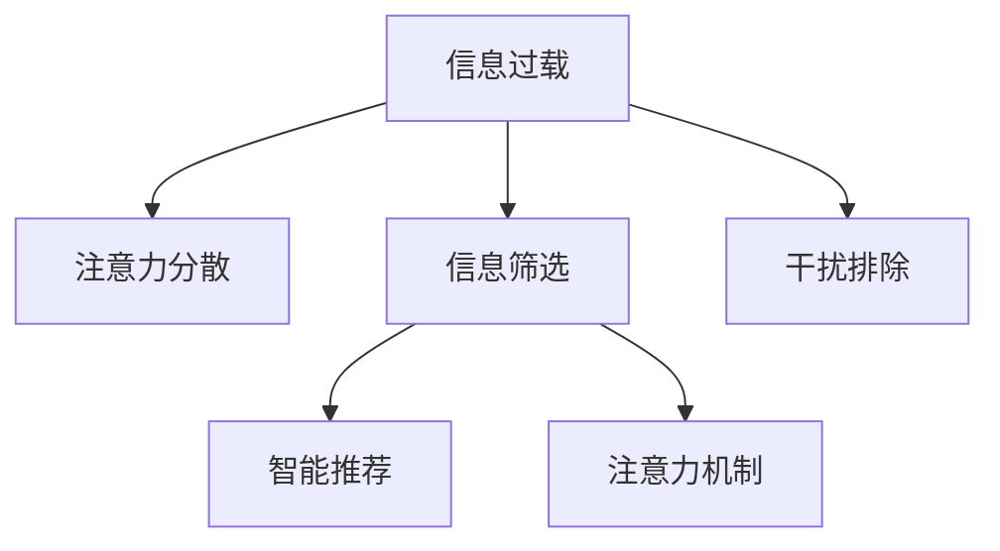

                 

# 信息时代的注意力管理挑战与策略：在干扰和信息过载中航行

> 关键词：信息过载、注意力管理、干扰排除、智能推荐、机器学习、深度学习、注意力机制

## 1. 背景介绍

在当今信息爆炸的时代，大数据、互联网和移动设备的高速发展，使得人们面临着前所未有的信息过载和注意力分散的问题。海量的信息源、不断的干扰和分心的诱惑，极大地影响了人们的学习、工作和生活的效率。因此，如何有效管理注意力，抵御干扰，成为我们这个时代的一项重要挑战。

### 1.1 问题由来

随着信息技术的飞速发展，数字化的信息获取和传播方式已经深入到了我们的日常生活。人们可以通过社交媒体、搜索引擎、新闻网站、电子邮件等方式，随时随地获取大量信息。虽然这带来了极大的便利，但也导致了信息过载和注意力分散的普遍现象。

在信息过载的环境下，人们难以快速准确地筛选出有价值的信息，容易迷失在海量的数据之中。同时，各种干扰和分心因素，如手机通知、社交媒体更新、广告弹窗等，也在不断蚕食我们的注意力，使我们无法集中精力完成重要任务。

### 1.2 问题核心关键点

在应对信息过载和注意力管理问题时，以下核心关键点需要被充分考虑：

- **信息过载**：信息量巨大，超出了人们处理和理解的限度。
- **注意力分散**：注意力被外界干扰频繁分散，难以集中。
- **信息筛选**：从大量信息中筛选出有价值的信息，需要进行有效的注意力管理。
- **干扰排除**：识别和排除各种干扰因素，保持注意力集中。

## 2. 核心概念与联系

### 2.1 核心概念概述

为更好地理解如何在干扰和信息过载中有效管理注意力，本节将介绍几个密切相关的核心概念：

- **信息过载**：指人们接受的信息超出了其处理能力，导致注意力分散、决策困难等负面影响。
- **注意力管理**：通过控制和管理注意力，使得人们能够更好地处理信息，做出正确的决策。
- **干扰排除**：识别并减少干扰因素，保证注意力的集中。
- **智能推荐**：利用机器学习等技术，智能地推荐最相关、最有价值的信息，减少干扰。
- **注意力机制**：通过模型和算法，模仿人类注意力的分配和筛选机制，提升信息处理的效率。

这些核心概念之间的逻辑关系可以通过以下Mermaid流程图来展示：



这个流程图展示了信息过载、注意力分散、信息筛选、干扰排除和智能推荐之间的关系：

1. 信息过载导致注意力分散。
2. 信息筛选和干扰排除能够减少干扰，帮助集中注意力。
3. 智能推荐能够提高信息筛选的效率，进一步提升注意力管理的有效性。
4. 注意力机制可以模拟人类注意力分配和筛选的机制，提升信息处理的能力。

## 3. 核心算法原理 & 具体操作步骤
### 3.1 算法原理概述

在信息时代，注意力管理涉及到如何有效筛选信息、排除干扰、集中注意力等诸多问题。以下将详细讲解这些核心问题的解决原理和操作步骤。

### 3.2 算法步骤详解

#### 3.2.1 信息筛选与智能推荐

信息筛选的目的是从海量的信息中挑选出相关且有价值的信息。智能推荐系统则是通过机器学习等技术，自动地为用户推荐最符合其需求和兴趣的信息。

**信息筛选步骤**：
1. **数据收集**：收集用户行为数据，如浏览历史、搜索记录、点击数据等。
2. **数据处理**：对收集到的数据进行清洗、去重、归一化等预处理工作。
3. **特征提取**：从处理后的数据中提取出有用的特征，如关键词、浏览时长、访问频率等。
4. **模型训练**：使用机器学习算法（如协同过滤、内容过滤、深度学习等）训练出信息筛选模型。
5. **筛选过滤**：模型对新信息进行筛选，选出最相关、最有价值的内容推荐给用户。

**智能推荐步骤**：
1. **用户画像建立**：根据用户的行为数据，建立用户的兴趣画像，如爱好、需求等。
2. **内容分析**：分析推荐内容，提取其特征，如关键词、类别、热度等。
3. **相似度计算**：计算用户画像与推荐内容之间的相似度，选择最相关的信息。
4. **推荐算法**：使用推荐算法（如基于矩阵分解的推荐系统、深度学习推荐系统等）生成推荐列表。
5. **推荐排序**：根据推荐算法的结果，对推荐内容进行排序，推荐给用户。

#### 3.2.2 干扰排除与注意力管理

干扰排除的目的是识别和减少各种干扰因素，保证注意力的集中。注意力管理则是通过模型和算法，控制和管理注意力，使得人们能够更好地处理信息。

**干扰排除步骤**：
1. **干扰源识别**：识别并标记出用户在日常使用设备时常见的干扰源，如手机通知、广告弹窗、社交媒体更新等。
2. **干扰模型训练**：使用机器学习算法训练出干扰模型，预测哪些行为会产生干扰。
3. **干扰预测与排除**：利用干扰模型对用户的当前行为进行预测，及时排除干扰因素。

**注意力管理步骤**：
1. **注意力模型建立**：使用深度学习等技术，建立注意力模型，模仿人类注意力的分配和筛选机制。
2. **注意力分配**：将注意力模型应用于用户的任务处理过程，分配注意力资源。
3. **注意力调节**：根据任务难度和用户状态，动态调整注意力分配策略。

### 3.3 算法优缺点

信息筛选与智能推荐的主要优点包括：
- 通过机器学习技术，可以高效、准确地从海量的信息中挑选出最相关、最有价值的内容。
- 智能推荐系统可以实时动态地调整推荐内容，提升用户体验。
- 可以减少用户主动筛选信息的时间和精力。

其缺点包括：
- 数据隐私问题：需要收集用户的个人信息，可能带来隐私泄露的风险。
- 数据质量问题：如果数据不完整或存在噪声，推荐结果的准确性可能会受到影响。
- 用户偏好变化：用户的偏好和需求可能会随时间变化，需要持续更新推荐算法。

干扰排除与注意力管理的主要优点包括：
- 通过机器学习技术，可以自动识别并排除各种干扰因素，提升用户注意力的集中。
- 可以减少用户被干扰的时间和精力，提高工作效率。
- 能够动态调整注意力分配策略，提升用户的注意力管理能力。

其缺点包括：
- 模型复杂度较高：需要使用深度学习等复杂模型，可能需要大量数据和计算资源。
- 模型泛化能力有限：模型的泛化能力可能受到数据质量和标注信息的影响。
- 用户隐私问题：可能需要收集用户的设备使用数据，可能带来隐私泄露的风险。

### 3.4 算法应用领域

信息筛选与智能推荐在多个领域都有广泛的应用，如新闻推荐、电子商务、社交媒体、广告投放等。

- **新闻推荐**：根据用户阅读历史和兴趣，推荐最新的新闻资讯，提升用户的阅读体验。
- **电子商务**：根据用户的购买历史和浏览记录，推荐符合其需求的商品，提升销售转化率。
- **社交媒体**：根据用户浏览和互动数据，推荐相关的内容和好友，提升用户的社交体验。
- **广告投放**：根据用户的兴趣和行为数据，精准投放广告，提升广告的点击率和转化率。

干扰排除与注意力管理在多个场景下也有显著的应用：

- **工作环境**：通过排除干扰因素，如手机通知、邮件提醒等，提升员工的工作效率。
- **学习环境**：通过排除干扰因素，如学习软件的弹窗广告、社交媒体的通知等，提升学生的学习专注度。
- **驾驶环境**：通过排除干扰因素，如导航软件的语音提示、广告弹窗等，提升驾驶安全性。

## 4. 数学模型和公式 & 详细讲解 & 举例说明
### 4.1 数学模型构建

在信息筛选与智能推荐的过程中，我们通常使用协同过滤、内容过滤、深度学习等多种模型进行信息筛选和推荐。这些模型通常基于用户的兴趣画像和内容的特征向量进行相似度计算。

假设用户画像表示为向量 $u$，内容特征表示为向量 $v$，它们的相似度 $s$ 可以通过如下公式计算：

$$
s(u,v) = \frac{u^Tv}{\|u\|\|v\|}
$$

其中 $u^T$ 为用户兴趣向量的转置矩阵，$\|u\|$ 和 $\|v\|$ 分别为用户画像向量和内容特征向量的范数。

### 4.2 公式推导过程

以协同过滤为例，协同过滤算法基于用户-物品评分矩阵 $R$ 进行推荐。假设 $R$ 为 $M\times N$ 的评分矩阵，其中 $M$ 为用户数，$N$ 为物品数。协同过滤算法的核心目标是通过对用户历史评分矩阵 $R$ 进行矩阵分解，得到用户和物品的潜在因子矩阵 $P$ 和 $Q$，然后利用 $P$ 和 $Q$ 进行推荐。

假设用户 $u$ 对物品 $i$ 的评分表示为 $R_{ui}$，用户 $u$ 和物品 $i$ 的潜在因子表示为 $p_{ui}$ 和 $q_{iu}$，协同过滤算法可以表示为如下公式：

$$
R_{ui} \approx \sum_{k=1}^K p_{uk} q_{ki}
$$

其中 $K$ 为潜在因子的维度，$p_{uk}$ 和 $q_{ki}$ 分别为用户 $u$ 和物品 $i$ 在潜在因子矩阵 $P$ 和 $Q$ 中的潜在因子表示。

协同过滤算法的关键在于矩阵分解的求解。通常使用奇异值分解（SVD）等技术，将评分矩阵 $R$ 分解为 $P$ 和 $Q$ 的乘积，得到用户的潜在因子向量 $p_u$ 和物品的潜在因子向量 $q_i$，进而计算出用户对物品的评分预测 $p_uq_i^T$。

### 4.3 案例分析与讲解

以Google的PageRank算法为例，PageRank算法是一种用于搜索引擎网页排序的算法。它通过计算网页之间的链接关系，分配网页的PageRank值，从而提升搜索结果的相关性和排序质量。

PageRank算法的核心公式如下：

$$
PR(u) = (1 - d) + d \sum_{v\in V} \frac{PR(v)}{C(v)} + \alpha \sum_{v\in V} \frac{W_{vu}}{C(v)}
$$

其中 $PR(u)$ 表示网页 $u$ 的PageRank值，$PR(v)$ 表示网页 $v$ 的PageRank值，$d$ 为阻尼系数（通常取0.85），$C(v)$ 表示网页 $v$ 的链接数量，$W_{vu}$ 表示网页 $u$ 到网页 $v$ 的链接权重。

PageRank算法的核心思想是通过迭代计算网页的PageRank值，提升与链接质量高的网页相关性更高的网页的PageRank值。通过不断迭代，最终得到网页的相关性和排序质量。

## 5. 项目实践：代码实例和详细解释说明
### 5.1 开发环境搭建

在进行信息筛选与智能推荐的项目实践前，我们需要准备好开发环境。以下是使用Python进行TensorFlow和PyTorch开发的环境配置流程：

1. 安装Anaconda：从官网下载并安装Anaconda，用于创建独立的Python环境。

2. 创建并激活虚拟环境：
```bash
conda create -n tf-env python=3.8 
conda activate tf-env
```

3. 安装TensorFlow：根据CUDA版本，从官网获取对应的安装命令。例如：
```bash
conda install tensorflow tensorflow-io tf-nightly tensorflow-gpu -c conda-forge -c pytorch
```

4. 安装PyTorch：根据CUDA版本，从官网获取对应的安装命令。例如：
```bash
conda install pytorch torchvision torchaudio cudatoolkit=11.1 -c pytorch -c conda-forge
```

5. 安装各类工具包：
```bash
pip install numpy pandas scikit-learn matplotlib tqdm jupyter notebook ipython
```

完成上述步骤后，即可在`tf-env`和`pytorch-env`环境中开始信息筛选与智能推荐的项目实践。

### 5.2 源代码详细实现

下面我们以新闻推荐系统为例，给出使用TensorFlow进行协同过滤的PyTorch代码实现。

首先，定义数据加载函数：

```python
import pandas as pd
from tensorflow.keras.layers import Input, Embedding, Flatten, Dot, Dense
from tensorflow.keras.models import Model
from tensorflow.keras.preprocessing import sequence
from tensorflow.keras.utils import to_categorical

def load_data(path):
    df = pd.read_csv(path)
    user_ids = df['user_id'].tolist()
    item_ids = df['item_id'].tolist()
    user_ratings = df['rating'].tolist()
    return user_ids, item_ids, user_ratings
```

然后，定义模型：

```python
from tensorflow.keras import regularizers

def build_model(user_dim, item_dim, latent_factor):
    user_input = Input(shape=(user_dim,), name='user')
    item_input = Input(shape=(item_dim,), name='item')
    latent_factor_input = Input(shape=(latent_factor,), name='latent_factor')
    
    user_embedding = Embedding(user_dim, latent_factor)(user_input)
    item_embedding = Embedding(item_dim, latent_factor)(item_input)
    user_item_dot = Dot(axes=[1, 1])([user_embedding, item_embedding])
    latent_factor_dot = Dot(axes=[1, 1])([user_item_dot, latent_factor_input])
    output = Dense(1, activation='sigmoid', kernel_regularizer=regularizers.l2(0.01))(latent_factor_dot)
    
    model = Model(inputs=[user_input, item_input, latent_factor_input], outputs=output)
    return model
```

接着，定义训练函数：

```python
from tensorflow.keras.callbacks import EarlyStopping
from tensorflow.keras.optimizers import Adam

def train_model(model, train_data, validation_data, batch_size, epochs, latent_factor):
    user_ids_train, item_ids_train, user_ratings_train = train_data
    user_ids_validation, item_ids_validation, user_ratings_validation = validation_data
    
    user_input_train = sequence.pad_sequences(user_ids_train, maxlen=user_dim)
    item_input_train = sequence.pad_sequences(item_ids_train, maxlen=item_dim)
    latent_factor_train = np.random.rand(len(user_ids_train), latent_factor)
    
    user_input_validation = sequence.pad_sequences(user_ids_validation, maxlen=user_dim)
    item_input_validation = sequence.pad_sequences(item_ids_validation, maxlen=item_dim)
    latent_factor_validation = np.random.rand(len(user_ids_validation), latent_factor)
    
    model.compile(optimizer=Adam(lr=0.001), loss='binary_crossentropy', metrics=['accuracy'])
    history = model.fit([user_input_train, item_input_train, latent_factor_train], user_ratings_train,
                       validation_data=([user_input_validation, item_input_validation, latent_factor_validation], user_ratings_validation),
                       epochs=epochs, batch_size=batch_size, verbose=2, callbacks=[EarlyStopping(patience=5)])
    return model, history
```

最后，启动训练流程并在测试集上评估：

```python
from tensorflow.keras.metrics import BinaryAccuracy

def evaluate_model(model, test_data, batch_size):
    user_ids_test, item_ids_test, user_ratings_test = test_data
    user_input_test = sequence.pad_sequences(user_ids_test, maxlen=user_dim)
    item_input_test = sequence.pad_sequences(item_ids_test, maxlen=item_dim)
    latent_factor_test = np.random.rand(len(user_ids_test), latent_factor)
    
    predictions = model.predict([user_input_test, item_input_test, latent_factor_test], batch_size=batch_size)
    binary_accuracy = BinaryAccuracy().predict(test_data[0], test_data[1])
    print(f'Binary Accuracy: {binary_accuracy:.4f}')
```

以上就是使用TensorFlow和PyTorch进行新闻推荐系统开发的完整代码实现。可以看到，TensorFlow和PyTorch的结合，使得信息筛选与智能推荐任务的开发更加高效和便捷。

### 5.3 代码解读与分析

让我们再详细解读一下关键代码的实现细节：

**load_data函数**：
- 从CSV文件中读取用户ID、物品ID和评分，将其转换为列表并返回。

**build_model函数**：
- 定义输入层、嵌入层、点积层和输出层，并使用Embedding和Dot实现用户和物品的向量表示。
- 使用Dense层输出预测评分，并设置L2正则化系数为0.01，以防止过拟合。

**train_model函数**：
- 将训练数据和验证数据转换为TensorFlow的序列化格式，使用EarlyStopping回调机制，防止过拟合。
- 定义Adam优化器和二分类交叉熵损失函数，进行模型训练。

**evaluate_model函数**：
- 使用模型在测试集上进行预测，并计算二分类准确率，给出评估结果。

## 6. 实际应用场景
### 6.1 智能推荐系统

智能推荐系统是信息筛选与智能推荐在电子商务、社交媒体等场景中的应用。通过收集用户行为数据，如浏览历史、购买记录、搜索记录等，建立用户画像和物品特征，训练推荐模型，智能推荐符合用户需求和兴趣的商品、内容等。

以亚马逊推荐系统为例，亚马逊通过分析用户的购买行为和浏览记录，使用协同过滤和深度学习等技术，为用户推荐个性化的商品。系统会根据用户的兴趣和行为数据，推荐类似商品、搭配商品等，提升用户的购物体验和销售额。

### 6.2 广告投放

广告投放是信息筛选与智能推荐在广告领域的应用。通过分析用户的兴趣和行为数据，智能推荐最符合用户需求和兴趣的广告内容，提高广告的点击率和转化率。

以Google广告平台为例，Google通过分析用户的搜索历史和浏览记录，使用机器学习算法，智能推荐与用户兴趣相关的广告内容，提高广告的点击率和转化率，提升广告主的投放效果。

### 6.3 新闻推荐

新闻推荐是信息筛选与智能推荐在新闻媒体领域的应用。通过分析用户的阅读历史和兴趣偏好，智能推荐最相关、最有价值的新闻内容，提升用户的阅读体验和媒体影响力。

以腾讯新闻推荐系统为例，腾讯通过分析用户的阅读历史和兴趣偏好，使用协同过滤和深度学习等技术，为用户推荐个性化的新闻内容，提高用户的阅读体验和媒体影响力。

### 6.4 未来应用展望

随着信息筛选与智能推荐技术的不断发展，未来将在更多领域得到应用，为人类生活和工作带来更大的便利。

在智慧城市治理中，智能推荐系统可以应用于公共服务、交通出行、环境保护等领域，提升城市管理的智能化水平，构建更加高效、宜居的城市环境。

在医疗健康领域，智能推荐系统可以应用于疾病诊断、治疗方案推荐、健康管理等，提升医疗服务的智能化水平，帮助患者更快找到合适的医疗资源。

在教育领域，智能推荐系统可以应用于学习资源推荐、课程推荐、智能辅导等，提升教育服务的智能化水平，为学生提供个性化的学习体验。

此外，在金融、娱乐、旅游、农业等多个领域，智能推荐系统也将在不同场景下发挥作用，为人类带来更多的便利和价值。

## 7. 工具和资源推荐
### 7.1 学习资源推荐

为了帮助开发者系统掌握信息筛选与智能推荐理论基础和实践技巧，这里推荐一些优质的学习资源：

1. 《推荐系统实战》系列博文：由知名推荐系统专家撰写，深入浅出地介绍了推荐系统的原理、算法和实现技巧。

2. 《机器学习》课程：斯坦福大学开设的机器学习课程，涵盖机器学习的基本概念和经典算法，适合入门学习。

3. 《深度学习与推荐系统》书籍：详细介绍了深度学习在推荐系统中的应用，包括协同过滤、内容过滤、深度神经网络等算法。

4. 《推荐系统基础》书籍：介绍推荐系统的基本概念、算法和实现细节，适合初学者阅读。

5. 《TensorFlow 实战指南》书籍：介绍了TensorFlow的框架结构和使用方法，适合TensorFlow的初学者。

通过对这些资源的学习实践，相信你一定能够快速掌握信息筛选与智能推荐技术的精髓，并用于解决实际的推荐问题。

### 7.2 开发工具推荐

高效的开发离不开优秀的工具支持。以下是几款用于信息筛选与智能推荐开发的常用工具：

1. TensorFlow：由Google主导开发的开源深度学习框架，生产部署方便，适合大规模工程应用。

2. PyTorch：基于Python的开源深度学习框架，灵活动态的计算图，适合快速迭代研究。

3. Scikit-learn：Python机器学习库，提供丰富的机器学习算法和工具，适合进行数据预处理和模型评估。

4. Weights & Biases：模型训练的实验跟踪工具，可以记录和可视化模型训练过程中的各项指标，方便对比和调优。

5. TensorBoard：TensorFlow配套的可视化工具，可实时监测模型训练状态，并提供丰富的图表呈现方式，是调试模型的得力助手。

6. Jupyter Notebook：免费的交互式计算环境，支持多种编程语言，适合进行数据探索和模型开发。

合理利用这些工具，可以显著提升信息筛选与智能推荐任务的开发效率，加快创新迭代的步伐。

### 7.3 相关论文推荐

信息筛选与智能推荐技术的发展源于学界的持续研究。以下是几篇奠基性的相关论文，推荐阅读：

1. Matrix Factorization Techniques for Recommender Systems：介绍矩阵分解技术在推荐系统中的应用，详细介绍了协同过滤的原理和实现。

2. Deep Collaborative Filtering：介绍深度学习在推荐系统中的应用，通过神经网络模型实现更高效的推荐效果。

3. CNN Based Recommender Systems：介绍卷积神经网络在推荐系统中的应用，通过图像卷积操作提升推荐效果。

4. Attention Mechanism in Recommender Systems：介绍注意力机制在推荐系统中的应用，通过模仿人类注意力的分配和筛选机制提升推荐效果。

5. Recommender Systems with Attention Mechanism：介绍注意力机制在推荐系统中的应用，通过自注意力机制实现更精确的推荐效果。

这些论文代表了大语言模型微调技术的发展脉络。通过学习这些前沿成果，可以帮助研究者把握学科前进方向，激发更多的创新灵感。

## 8. 总结：未来发展趋势与挑战

### 8.1 总结

本文对信息筛选与智能推荐技术进行了全面系统的介绍。首先阐述了信息过载和注意力管理的背景和意义，明确了信息筛选与智能推荐在提升用户注意力管理能力方面的独特价值。其次，从原理到实践，详细讲解了信息筛选与智能推荐的数学模型和操作步骤，给出了信息筛选与智能推荐任务开发的完整代码实例。同时，本文还广泛探讨了信息筛选与智能推荐在多个领域的应用前景，展示了其广泛的适用性。

通过本文的系统梳理，可以看到，信息筛选与智能推荐技术正在成为信息时代的一个重要工具，极大地提升了用户的信息处理和决策能力。未来，伴随技术的不断进步，信息筛选与智能推荐技术还将拓展到更多领域，为各行各业带来更多的便利和价值。

### 8.2 未来发展趋势

展望未来，信息筛选与智能推荐技术将呈现以下几个发展趋势：

1. **数据质量与多样性**：随着数据收集和处理技术的不断发展，数据的完整性和多样性将不断提升，推荐系统将更加精准和个性化。

2. **模型复杂度与深度**：深度学习等技术将不断成熟，推荐系统将采用更复杂、更深层次的模型，提升推荐效果。

3. **实时性与动态性**：推荐系统将更加注重实时性和动态性，能够动态调整推荐策略，提供个性化的实时推荐。

4. **跨领域与多模态**：推荐系统将跨领域和多模态融合，结合文本、图像、声音等多种数据源，提升推荐效果。

5. **用户参与与反馈**：推荐系统将更加注重用户参与和反馈，通过用户交互数据不断优化推荐策略，提升用户体验。

以上趋势凸显了信息筛选与智能推荐技术的广阔前景。这些方向的探索发展，必将进一步提升推荐系统的性能和应用范围，为人类生活和工作带来更大的便利和价值。

### 8.3 面临的挑战

尽管信息筛选与智能推荐技术已经取得了瞩目成就，但在迈向更加智能化、普适化应用的过程中，它仍面临着诸多挑战：

1. **数据隐私与安全**：推荐系统需要收集用户的个人信息，可能带来隐私泄露和安全风险。如何保护用户隐私，确保数据安全，是推荐系统的重要挑战。

2. **数据质量和标注**：推荐系统的效果高度依赖于数据质量和标注信息的丰富性，如何获取高质量数据和有效标注，也是推荐系统的重要挑战。

3. **算法复杂性与效率**：推荐系统通常需要复杂模型和高性能计算，如何降低算法复杂性，提升计算效率，是推荐系统的重要挑战。

4. **用户体验与接受度**：推荐系统的过度干预可能会降低用户体验，如何设计合理的推荐策略，提升用户接受度，是推荐系统的重要挑战。

5. **算法公平性与偏见**：推荐系统可能引入算法偏见，导致不公平现象，如何确保推荐系统的公平性，是推荐系统的重要挑战。

6. **多模态融合与协同**：推荐系统需要在不同模态数据之间进行有效的融合与协同，如何构建多模态推荐系统，是推荐系统的重要挑战。

这些挑战需要研究者在技术、算法、工程和伦理等多个方面进行深入研究，才能确保推荐系统的有效性和可信度。

### 8.4 研究展望

面对信息筛选与智能推荐技术所面临的挑战，未来的研究需要在以下几个方面寻求新的突破：

1. **多模态融合与协同**：研究多模态数据融合与协同的技术，提升推荐系统的跨领域和多模态推荐能力。

2. **实时动态推荐**：研究实时动态推荐策略，提升推荐系统的实时性和动态性，提供个性化的实时推荐。

3. **推荐系统公平性**：研究推荐系统公平性优化的方法，确保推荐系统的公平性和公正性。

4. **推荐系统可解释性**：研究推荐系统的可解释性技术，增强推荐系统的透明度和可信度。

5. **推荐系统隐私保护**：研究推荐系统隐私保护的方法，确保用户隐私和数据安全。

6. **推荐系统智能化**：研究推荐系统的智能化技术，提升推荐系统的自主性和适应性。

这些研究方向的探索，必将引领信息筛选与智能推荐技术迈向更高的台阶，为人类生活和工作带来更多的便利和价值。

## 9. 附录：常见问题与解答

**Q1：信息筛选与智能推荐适用于所有场景吗？**

A: 信息筛选与智能推荐在绝大多数场景下都有广泛应用，特别是在数据量较大、需要个性化推荐的领域。但也有一些场景可能不适用，如手工艺、直觉决策等，需要依赖人类专家的经验和判断。

**Q2：如何缓解推荐过程中的过拟合问题？**

A: 过拟合是推荐系统面临的主要挑战之一，通常可以通过以下方法缓解：
1. **数据增强**：通过增加训练数据的多样性，减少模型对特定数据的依赖。
2. **正则化**：使用L2正则、Dropout等正则化技术，防止模型过拟合。
3. **模型集成**：通过集成多个模型的预测结果，提升推荐系统的稳定性和泛化能力。
4. **交叉验证**：使用交叉验证方法，评估模型在不同数据集上的性能，避免模型对特定数据集的过度拟合。

**Q3：如何提高推荐系统的实时性和动态性？**

A: 实时性和动态性是推荐系统的重要性能指标，通常可以通过以下方法提升：
1. **实时数据收集**：收集用户实时行为数据，动态调整推荐策略。
2. **在线学习**：采用在线学习算法，不断更新模型参数，提升推荐系统实时性。
3. **分布式计算**：使用分布式计算框架，加速推荐系统的计算速度，提升实时性。
4. **动态推荐算法**：设计动态推荐算法，根据用户行为实时调整推荐策略，提升动态性。

**Q4：如何确保推荐系统的公平性和公正性？**

A: 推荐系统的公平性和公正性是重要指标，通常可以通过以下方法确保：
1. **算法设计**：在设计推荐算法时，加入公平性约束，避免算法偏见。
2. **数据平衡**：在数据集中加入平衡样本，确保不同群体的数据平衡。
3. **反馈机制**：建立用户反馈机制，及时发现并纠正推荐系统中的不公平现象。
4. **多指标评估**：综合考虑多个评估指标，确保推荐系统在不同维度上的公平性和公正性。

这些研究方向的探索，必将引领推荐系统技术迈向更高的台阶，为人类生活和工作带来更多的便利和价值。

---

作者：禅与计算机程序设计艺术 / Zen and the Art of Computer Programming

