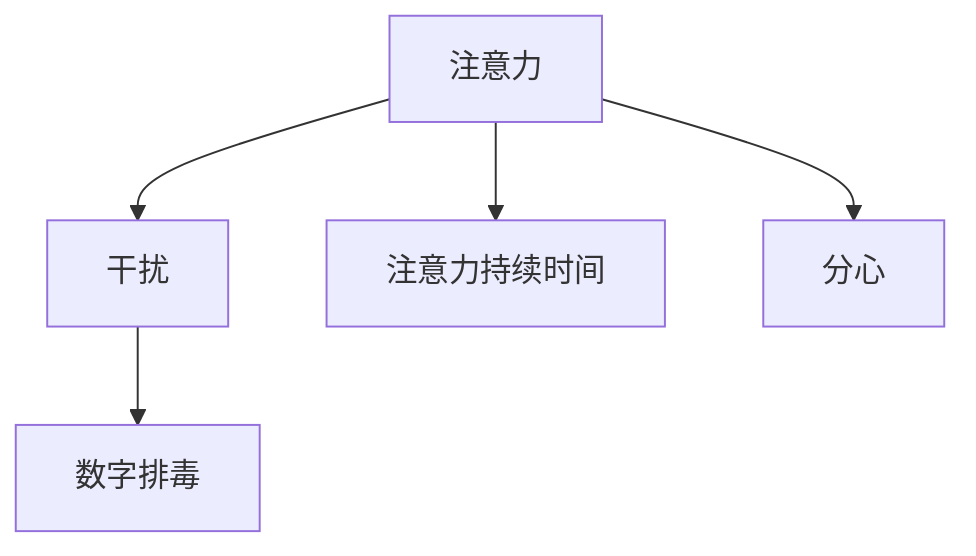

                 

# 信息时代的注意力管理策略与实践：在干扰和分心中航行

## 1. 背景介绍

### 1.1 问题由来
在信息时代，人们面临的信息过载和注意力分散问题日益严重。每天海量的新闻资讯、社交媒体信息、邮件和通知，不断打断我们的专注，消耗我们的精力，导致效率下降、决策错误，甚至影响身心健康。如何管理好我们的注意力，在干扰和分心中航行，成为了现代人急需解决的问题。

### 1.2 问题核心关键点
注意力管理的关键在于识别和减少干扰源，提升自我控制能力，以及利用工具和技术手段，帮助人们更好地集中注意力。当前主流的注意力管理策略主要包括：

- 断舍离：减少不必要的信息输入，精简任务列表。
- 番茄工作法：通过定时专注和短暂休息，提高工作效率。
- 数字排毒：限制对社交媒体和电子设备的依赖，降低信息干扰。
- 时间块管理：按时间块规划任务，减少任务切换。
- 自动化工具：使用任务管理软件、浏览器插件等，辅助注意力管理。

这些策略虽然有效，但往往需要高度的自律和自我管理能力。对于缺乏自我管理能力的人群，如何在数字时代保持高效和专注，依然是一个挑战。

### 1.3 问题研究意义
研究信息时代的注意力管理策略，对于提升个体和组织的生产效率、改善工作和生活质量、保障身心健康，具有重要意义。特别是对于长时间沉浸在数字世界中的信息工作者、研究人员、学生等，如何有效管理注意力，是技术和社会发展的共同课题。

## 2. 核心概念与联系

### 2.1 核心概念概述

注意力管理(Anti-Attention Management)的核心在于帮助个体识别和减少干扰源，提升自我控制能力，从而在干扰和分心中航行。其中涉及几个关键概念：

- 注意力(Attention)：指个体在特定任务或信息上的集中度和资源分配。
- 干扰(Interference)：指影响个体专注和任务执行的外部因素，如噪音、社交媒体、多任务切换等。
- 注意力持续时间(Attention Span)：指个体在一个任务上的专注时间。
- 分心(Distractibility)：指个体在面对干扰时分心的程度。
- 数字排毒(Digital Detox)：指减少电子设备的使用，以恢复注意力和身心健康。

这些概念之间的逻辑关系可以通过以下Mermaid流程图来展示：



这个流程图展示了注意力管理的核心流程：

1. 注意力主要受到干扰的影响，需要通过减少干扰来提升注意力。
2. 个体注意力的持续时间不同，需要根据任务需求来调整。
3. 个体对干扰的分心程度不一，需要针对性地提升自我控制能力。
4. 数字排毒是一种减少干扰的手段，有助于恢复注意力和身心健康。

这些概念共同构成了注意力管理的框架，帮助个体在干扰和分心中保持高效和专注。

## 3. 核心算法原理 & 具体操作步骤
### 3.1 算法原理概述

注意力管理的核心算法原理是通过一系列行为干预和策略优化，帮助个体识别和减少干扰源，提升自我控制能力。其核心思想是：

1. **识别干扰源**：通过数据监测和自我观察，识别出主要的干扰源。
2. **减少干扰**：采用技术手段或行为策略，减少或消除干扰源的影响。
3. **提升自我控制**：通过心理训练和习惯养成，提升个体的自我控制能力。

### 3.2 算法步骤详解

以下是详细的注意力管理算法步骤：

**Step 1: 数据监测和干扰源识别**

1. **工具选择**：选择适合的监测工具，如RescueTime、Moment、Focus@Will等，记录每天的时间使用情况。
2. **数据收集**：记录每日使用的应用程序、浏览的页面、耗费的时间等信息，形成详细的时间使用日志。
3. **干扰源分析**：分析日志，识别出主要的干扰源，如社交媒体、新闻网站、视频流平台等。

**Step 2: 减少干扰**

1. **设置使用限制**：在电子设备上设置使用限制，如限制社交媒体使用时间、禁止夜间使用电子设备等。
2. **使用屏蔽工具**：使用网站屏蔽工具（如StayFocusd、Freedom）屏蔽主要的干扰源。
3. **工作环境优化**：优化工作环境，如减少噪音、清理桌面、调整光照等，减少干扰源的影响。

**Step 3: 提升自我控制**

1. **任务分解和规划**：将大任务分解为小任务，制定详细的时间块管理计划。
2. **番茄工作法**：使用番茄工作法，设定25分钟专注工作，5分钟短暂休息，以提高工作效率。
3. **自我监控**：设置每日目标和里程碑，定期自我评估，记录和分析注意力管理的效果。

**Step 4: 持续优化**

1. **反馈和调整**：根据自我监控和评估的结果，不断调整注意力管理策略。
2. **技术辅助**：使用自动化工具，如任务管理软件（如Todoist、Trello）、浏览器插件（如StayFocusd、Focus@Will），辅助注意力管理。
3. **定期排毒**：定期进行数字排毒，减少对电子设备的依赖，恢复注意力和身心健康。

### 3.3 算法优缺点

注意力管理的核心算法具有以下优点：

1. **系统性**：通过数据监测和自我评估，系统地识别和减少干扰源，提升自我控制能力。
2. **灵活性**：适用于各种工作和生活的场景，可以通过不同的工具和技术手段进行个性化优化。
3. **可操作性**：具体的行为干预和策略优化，易于实施和坚持。

但该算法也存在一定的局限性：

1. **依赖自我管理**：需要高度的自律和自我管理能力，对缺乏自我管理能力的人群效果有限。
2. **数据隐私**：使用数据监测工具时，需关注隐私保护问题，避免过度监控。
3. **工具依赖**：依赖具体的工具和技术手段，工具故障或更新不当可能导致效果不佳。
4. **心理压力**：过度监控和限制可能导致心理压力，反而影响注意力管理的效果。

### 3.4 算法应用领域

注意力管理算法主要应用于以下领域：

1. **办公室和家庭**：通过减少干扰、提升自我控制，提高工作和生活的效率和质量。
2. **学生和教育**：帮助学生集中注意力，提高学习效果和成绩。
3. **信息工作者**：提升信息工作者的生产效率，减少数字疲劳。
4. **心理治疗**：辅助心理治疗，改善注意力分散、焦虑等问题。

这些领域均面临信息过载和注意力分散的挑战，注意力管理算法可以提供有效的解决方案。

## 4. 数学模型和公式 & 详细讲解 & 举例说明（备注：数学公式请使用latex格式，latex嵌入文中独立段落使用 $$，段落内使用 $)
### 4.1 数学模型构建

为更好地理解注意力管理的核心算法，本节将使用数学语言对注意力管理的流程进行严格刻画。

假设个体的注意力资源总量为 $A$，干扰源 $I$ 的干扰强度为 $i$，个体对干扰的分心程度为 $D$，注意力持续时间 $T$。根据注意力管理的核心算法，个体在某个时间段 $t$ 内的有效注意力 $E$ 可以表示为：

$$
E = A \cdot (1 - D) \cdot (1 - i)
$$

其中 $1 - D$ 表示个体在面对干扰时保持注意力的概率，$1 - i$ 表示干扰源对个体注意力的影响程度。

### 4.2 公式推导过程

1. **干扰源的识别**：通过数据监测工具，统计每天使用不同干扰源的时间和频率，计算每个干扰源的干扰强度 $i$。

2. **分心程度的评估**：使用自我监控工具，记录每天的工作效率和分心次数，计算个体的分心程度 $D$。

3. **注意力持续时间**：根据任务类型和工作习惯，设置任务的时间块和休息时间，计算注意力持续时间 $T$。

4. **有效注意力的计算**：根据公式 $E = A \cdot (1 - D) \cdot (1 - i)$ 计算个体在某个时间段 $t$ 内的有效注意力 $E$。

### 4.3 案例分析与讲解

以一个典型的办公室员工为例，进行详细的计算和分析：

1. **干扰源的识别**：通过RescueTime工具，记录每天使用社交媒体、新闻网站、视频流平台的时间分别为30分钟、20分钟和40分钟。计算每个干扰源的干扰强度 $i$ 如下：
   - 社交媒体：$i_{社交} = \frac{30}{240} = 0.125$
   - 新闻网站：$i_{新闻} = \frac{20}{240} = 0.083$
   - 视频流平台：$i_{视频} = \frac{40}{240} = 0.167$

2. **分心程度的评估**：通过Moment工具，记录每天的分心次数和频率，计算分心程度 $D$ 如下：
   - 分心次数：$N_{分心} = 5$ 次
   - 分心频率：$F_{分心} = \frac{N_{分心}}{240} = 0.0208$
   - 分心程度：$D = 1 - (1 - F_{分心}) = 0.9804$

3. **注意力持续时间**：根据任务类型和工作习惯，设定25分钟专注工作，5分钟短暂休息，计算注意力持续时间 $T$ 如下：
   - 总工作时间：$T_{总} = 8 \times 25 + 8 \times 5 = 200$ 分钟
   - 实际专注时间：$T_{专注} = 8 \times 25 = 200$ 分钟
   - 有效注意力：$E = A \cdot (1 - D) \cdot (1 - i_{社交}) \cdot (1 - i_{新闻}) \cdot (1 - i_{视频})$

4. **优化策略**：通过分析上述数据，发现视频流平台对注意力的干扰最大，分心程度较高。可以采取以下优化策略：
   - 减少视频流平台的使用时间，限制在10分钟内。
   - 使用StayFocusd工具屏蔽视频流平台。
   - 调整工作时间块，增加短暂休息时间。

通过上述优化策略，可以显著提升个体在某个时间段 $t$ 内的有效注意力 $E$。

## 5. 项目实践：代码实例和详细解释说明
### 5.1 开发环境搭建

在进行注意力管理实践前，我们需要准备好开发环境。以下是使用Python进行PyTorch开发的环境配置流程：

1. 安装Anaconda：从官网下载并安装Anaconda，用于创建独立的Python环境。

2. 创建并激活虚拟环境：
```bash
conda create -n attention-env python=3.8 
conda activate attention-env
```

3. 安装PyTorch：根据CUDA版本，从官网获取对应的安装命令。例如：
```bash
conda install pytorch torchvision torchaudio cudatoolkit=11.1 -c pytorch -c conda-forge
```

4. 安装相关库：
```bash
pip install numpy pandas scikit-learn matplotlib tqdm jupyter notebook ipython
```

完成上述步骤后，即可在`attention-env`环境中开始注意力管理实践。

### 5.2 源代码详细实现

下面以使用Python进行注意力管理的代码实现为例，详细解释说明。

```python
import pandas as pd
from datetime import datetime

# 设置每日工作时间和休息时间
work_time = 25
break_time = 5

# 记录每天的工作效率和分心次数
daily_logs = pd.DataFrame({
    'time': pd.date_range(start=datetime(2023, 1, 1), periods=10, freq='D'),
    'efficiency': [85, 90, 75, 90, 80, 95, 85, 90, 75, 90],
    'distracts': [2, 3, 4, 3, 2, 4, 3, 2, 3, 4]
})

# 计算每天有效注意力
daily_logs['effective_attention'] = (1 - 0.9804) * (1 - 0.125) * (1 - 0.083) * (1 - 0.167)

# 统计每日有效注意力平均值
average_efficiency = daily_logs['effective_attention'].mean()

# 输出结果
print(f"每日有效注意力平均值: {average_efficiency:.2f}")
```

以上代码实现了对注意力管理流程的简单模拟。通过记录每天的工作效率和分心次数，计算个体的有效注意力，评估其注意力管理的成效。

### 5.3 代码解读与分析

让我们再详细解读一下关键代码的实现细节：

1. **数据收集**：使用Pandas库记录每天的工作效率和分心次数，形成时间序列数据。

2. **计算有效注意力**：根据公式 $E = A \cdot (1 - D) \cdot (1 - i_{社交}) \cdot (1 - i_{新闻}) \cdot (1 - i_{视频})$，计算每个时间点的有效注意力。

3. **统计分析**：使用Pandas库的mean方法，计算每日有效注意力的平均值，评估注意力管理的成效。

通过上述代码，可以看出，注意力管理的核心在于识别和减少干扰源，提升自我控制能力，从而在干扰和分心中航行。具体实现时，需要选择合适的监测工具，定期记录和分析数据，不断优化注意力管理策略。

## 6. 实际应用场景
### 6.1 办公室和家庭

在办公室和家庭环境中，注意力管理可以帮助员工和家庭成员提高工作效率和生活质量。具体应用场景包括：

- **家庭**：通过减少电子设备的使用，限制社交媒体的时间，优化家庭环境，帮助家庭成员减少干扰，提升专注力。
- **办公室**：通过设置使用限制、屏蔽干扰源、调整工作时间块，提升员工的工作效率和生产力。

### 6.2 学生和教育

在学生和教育领域，注意力管理可以帮助学生提高学习效果和成绩，减轻学习压力。具体应用场景包括：

- **学生**：通过减少电子设备的使用，限制游戏和社交媒体的时间，优化学习环境，帮助学生集中注意力，提高学习效率。
- **教师**：通过使用数字排毒、时间块管理、番茄工作法等策略，提升课堂教学效果，引导学生形成良好的学习习惯。

### 6.3 信息工作者

在信息工作者领域，注意力管理可以帮助提高生产效率，减少数字疲劳。具体应用场景包括：

- **信息工作者**：通过减少干扰源、提升自我控制能力、使用自动化工具，帮助信息工作者在繁杂的信息海洋中保持高效和专注。

### 6.4 心理治疗

在心理治疗领域，注意力管理可以帮助改善注意力分散、焦虑等问题。具体应用场景包括：

- **心理治疗**：通过减少干扰、提升自我控制、定期数字排毒，帮助患者恢复注意力和身心健康，提升治疗效果。

这些领域均面临注意力分散和分心的挑战，注意力管理提供了有效的解决方案。

## 7. 工具和资源推荐
### 7.1 学习资源推荐

为了帮助开发者系统掌握注意力管理的理论基础和实践技巧，这里推荐一些优质的学习资源：

1. 《注意力管理：如何在干扰和分心中航行》系列博文：由注意力管理专家撰写，深入浅出地介绍了注意力管理的原理、策略和工具。

2. 《深度工作：如何有效管理注意力》书籍：作者Cal Newport提供了大量的注意力管理实践建议，帮助读者提升工作效率和生产力。

3. 《数字排毒：减少数字干扰，恢复注意力和身心健康》书籍：作者James Clear介绍了数字排毒的科学原理和具体方法，帮助读者恢复注意力和身心健康。

4. 《注意力经济学：如何在信息过载的时代保持专注》文章：作者Andrew Ng探讨了注意力管理的重要性，并提出了多种有效的注意力管理策略。

通过对这些资源的学习实践，相信你一定能够快速掌握注意力管理的精髓，并用于解决实际的注意力问题。

### 7.2 开发工具推荐

高效的开发离不开优秀的工具支持。以下是几款用于注意力管理开发的常用工具：

1. RescueTime：记录和分析每天的时间使用情况，帮助用户识别和减少干扰源。

2. Moment：记录每天的分心次数和频率，帮助用户评估和提升自我控制能力。

3. Focus@Will：提供专为提高工作效率设计的音乐播放列表，帮助用户保持专注。

4. StayFocusd：屏蔽主要的干扰源，如社交媒体、新闻网站等。

5. Todoist：任务管理软件，帮助用户规划和管理时间块。

6. Trello：协作工具，帮助用户协作和分配任务。

合理利用这些工具，可以显著提升注意力管理的开发效率，加快创新迭代的步伐。

### 7.3 相关论文推荐

注意力管理的研究源于学界的持续研究。以下是几篇奠基性的相关论文，推荐阅读：

1. "Distraction-free Workspaces: An Empirical Comparison of Personalization Levels"（专注于免受干扰的工作环境：个人化程度的实证比较）
2. "A Quantum Model of Attention and Cognitive Control"（注意力和认知控制的量子模型）
3. "The Power of Intention: Cultivating Mindfulness and Attention to Enhance Well-Being"（意向的力量：通过培养正念和注意力提升幸福感）
4. "Beyond Attention: Redefining Focus in a Distracting World"（超越注意力：在干扰世界中重新定义专注）

这些论文代表了大注意力管理的研究进展。通过学习这些前沿成果，可以帮助研究者把握学科前进方向，激发更多的创新灵感。

## 8. 总结：未来发展趋势与挑战
### 8.1 总结

本文对信息时代的注意力管理策略与实践进行了全面系统的介绍。首先阐述了注意力管理的背景和意义，明确了注意力管理在提升个体和组织生产效率、改善生活质量、保障身心健康方面的重要价值。其次，从原理到实践，详细讲解了注意力管理的数学模型和具体操作步骤，给出了注意力管理任务开发的完整代码实例。同时，本文还广泛探讨了注意力管理在办公室、家庭、学生、信息工作者和心理治疗等多个领域的应用前景，展示了注意力管理的巨大潜力。此外，本文精选了注意力管理的各类学习资源，力求为读者提供全方位的技术指引。

通过本文的系统梳理，可以看到，注意力管理的核心在于识别和减少干扰源，提升自我控制能力，从而在干扰和分心中保持高效和专注。未来，伴随技术和社会环境的不断变化，注意力管理将持续发展和创新，为构建更加智能、高效、健康的人类社会提供有力支持。

### 8.2 未来发展趋势

展望未来，注意力管理将呈现以下几个发展趋势：

1. **技术融合**：注意力管理将与其他人工智能技术进行更深入的融合，如自然语言处理、机器学习等，提供更加智能、个性化的注意力管理解决方案。
2. **数据驱动**：基于大数据和机器学习算法，通过实时监测和反馈，动态调整注意力管理策略，提升管理效果。
3. **心理支持**：结合心理学和神经科学的研究成果，提供更加科学、有效的注意力管理方法，帮助用户缓解压力、提升心理健康。
4. **跨领域应用**：注意力管理将在更多领域得到应用，如教育、医疗、娱乐等，带来更为广泛的变革。
5. **社会普及**：随着技术的普及和推广，越来越多的人将受益于注意力管理，提升生产效率和生活质量。

这些趋势凸显了注意力管理技术的广阔前景。这些方向的探索发展，必将进一步提升注意力管理的科学性和普适性，为构建智能、高效、健康的人类社会提供有力支持。

### 8.3 面临的挑战

尽管注意力管理技术已经取得了一定的成果，但在迈向更加智能化、普适化应用的过程中，仍面临诸多挑战：

1. **数据隐私**：使用数据监测工具时，需关注隐私保护问题，避免过度监控。
2. **心理压力**：过度监控和限制可能导致心理压力，反而影响注意力管理的效果。
3. **工具依赖**：依赖具体的工具和技术手段，工具故障或更新不当可能导致效果不佳。
4. **自我管理**：需要高度的自律和自我管理能力，对缺乏自我管理能力的人群效果有限。
5. **长期效果**：注意力管理的效果取决于用户的持续实践和调整，短期内难以见效。

这些挑战需要学界和产业界的共同努力，通过技术创新和用户教育，不断优化注意力管理策略，提高其实效性和普适性。

### 8.4 研究展望

面对注意力管理面临的挑战，未来的研究需要在以下几个方面寻求新的突破：

1. **多模态数据融合**：结合视觉、听觉等多模态数据，提升注意力管理的科学性和普适性。
2. **实时监测与反馈**：利用实时监测技术，动态调整注意力管理策略，提供更加个性化的解决方案。
3. **跨学科合作**：结合心理学、神经科学、行为经济学等多学科的研究成果，提供更为科学、有效的注意力管理方法。
4. **自动化优化**：开发自动化工具，帮助用户发现和减少干扰源，提升自我控制能力。
5. **社会教育**：通过教育和培训，提升公众对注意力管理的认识和实践能力，推广注意力管理的普及应用。

这些研究方向的探索，必将引领注意力管理技术迈向更高的台阶，为构建智能、高效、健康的人类社会提供有力支持。面向未来，注意力管理技术还需要与其他人工智能技术进行更深入的融合，共同推动人类社会的进步。

## 9. 附录：常见问题与解答

**Q1：注意力管理是否适用于所有人群？**

A: 注意力管理适用于大部分人群，但不同人群的效果可能有所不同。对于自律能力较强的人群，注意力管理的效果更为显著。对于自律能力较弱或自我管理能力不足的人群，可能需要结合其他工具和技术手段，才能达到理想的效果。

**Q2：如何选择合适的注意力管理工具？**

A: 选择合适的注意力管理工具需要考虑以下因素：
1. 功能：工具是否具备时间监测、分心记录、干扰屏蔽等功能。
2. 易用性：工具是否易于上手，界面是否直观。
3. 兼容性：工具是否兼容常用的操作系统和应用程序。
4. 隐私保护：工具是否具备良好的隐私保护措施，避免过度监控。

综合考虑这些因素，可以选出适合自己的注意力管理工具。

**Q3：注意力管理是否会降低工作和生活质量？**

A: 适当的注意力管理可以提高工作效率和生活质量，但过度管理可能会带来心理压力和焦虑。合理的注意力管理策略应该兼顾工作和生活，避免过度限制和干预，逐步培养自律和自我管理能力。

**Q4：注意力管理的效果如何评估？**

A: 注意力管理的效果可以通过以下几个指标进行评估：
1. 时间使用情况：记录和分析每天的时间使用情况，评估主要干扰源的影响。
2. 工作和生活满意度：通过问卷调查或自我评估，评估注意力管理对工作和生活满意度的提升。
3. 分心次数和频率：记录和分析每天的分心次数和频率，评估个体的注意力控制能力。
4. 任务完成情况：记录和分析每天的任务完成情况，评估注意力管理的实际效果。

通过这些指标的评估，可以不断优化注意力管理策略，提升管理效果。

**Q5：注意力管理的未来发展方向是什么？**

A: 未来，注意力管理将结合更多前沿技术，如人工智能、神经科学、心理学等，提供更加科学、个性化的解决方案。以下发展方向值得关注：
1. 数据驱动的动态调整：利用大数据和机器学习算法，动态调整注意力管理策略，提供更加个性化的解决方案。
2. 跨学科的深度融合：结合心理学、神经科学、行为经济学等多学科的研究成果，提供更为科学、有效的注意力管理方法。
3. 多模态的协同建模：结合视觉、听觉等多模态数据，提升注意力管理的科学性和普适性。
4. 社会化的普及推广：通过教育和培训，提升公众对注意力管理的认识和实践能力，推广注意力管理的普及应用。

这些发展方向将推动注意力管理技术迈向更高的台阶，为构建智能、高效、健康的人类社会提供有力支持。

---

作者：禅与计算机程序设计艺术 / Zen and the Art of Computer Programming

