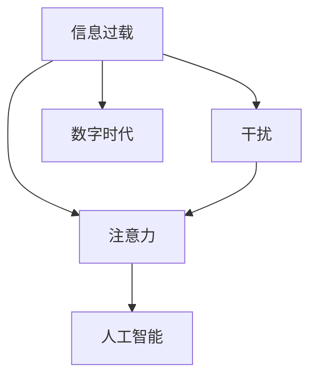

                 

# 信息时代的注意力管理策略：管理干扰和信息过载

> 关键词：注意力管理, 信息过载, 干扰管理, 数字时代, 人工智能

## 1. 背景介绍

### 1.1 问题由来

在信息爆炸的数字时代，我们每天都在被大量信息和干扰所包围。社交媒体、即时通讯工具、广告推送、电子邮件等，都是造成信息过载的源头。这些信息不仅占用了我们的时间，还常常让我们感到疲惫和分心。

在过去，信息过载主要体现在个人层面上。但如今，随着智能手机的普及和互联网技术的不断进步，信息过载已经渗透到家庭、工作乃至社会各个方面。人们的时间被分散到各种零碎的任务中，难以集中精力进行深度工作。

随着人工智能(AI)技术的发展，如何更有效地管理注意力，利用AI技术处理海量信息，成为了当前研究的热点。本文将详细探讨在信息时代，如何通过注意力管理和干扰管理，帮助人们高效应对信息过载和干扰，提升工作效率和生活质量。

### 1.2 问题核心关键点

本文聚焦于以下几个核心问题：

- 信息过载的成因和影响是什么？
- 如何通过AI技术来管理和优化注意力？
- 在信息时代，如何优化工作、学习和生活的方方面面？

## 2. 核心概念与联系

### 2.1 核心概念概述

在探讨注意力管理之前，我们需要理解一些关键概念：

- **信息过载(Information Overload)**：指人们接收到的信息远超其处理能力，导致决策困难、注意力分散、焦虑感增加的现象。
- **干扰(Interference)**：指对注意力分散、转移或干扰的行为，如噪音、视觉干扰等。
- **注意力(Attention)**：指在特定时间内，对某事物或任务的集中注意。
- **人工智能(AI)**：指通过算法和计算能力，使计算机具备人类智能能力，实现自动化决策和任务执行。

这些概念之间的逻辑关系可以通过以下Mermaid流程图来展示：



该流程图展示了信息过载、干扰、注意力和人工智能之间的关系：

1. 信息过载引发干扰，导致注意力分散。
2. 人工智能通过优化注意力管理，帮助人们更好地应对信息过载和干扰。
3. 数字时代背景下，信息过载和干扰愈加严重，需要AI技术的介入。

## 3. 核心算法原理 & 具体操作步骤
### 3.1 算法原理概述

注意力管理主要是通过算法手段，帮助人们更好地分配注意力资源，提升处理信息的能力。具体来说，注意力管理可以分为以下几个步骤：

1. **信息筛选**：使用算法自动筛选出重要信息，排除干扰。
2. **优先级排序**：对筛选后的信息进行优先级排序，帮助人们快速决定哪些任务最重要。
3. **分配时间**：根据优先级，合理分配注意力，确保高优先级任务得到足够处理时间。
4. **干扰阻断**：使用算法识别并屏蔽干扰因素，保持注意力集中。

这些步骤通过一系列算法和模型实现，可以显著提升人们的注意力管理效率。

### 3.2 算法步骤详解

下面详细讲解注意力管理算法的各个步骤：

**Step 1: 信息筛选**

信息筛选的目的是从海量的信息中筛选出重要信息，排除干扰。常见的信息筛选算法包括：

- **关键词过滤**：基于关键词提取和匹配，识别重要信息。
- **情感分析**：使用情感分析模型，筛选出情感积极的信息。
- **相关性评分**：使用机器学习模型，根据内容相关性对信息进行评分。

这些算法通常使用自然语言处理(NLP)技术实现。例如，可以使用BERT模型对文本进行嵌入，并通过余弦相似度计算，筛选出与当前任务最相关的内容。

**Step 2: 优先级排序**

优先级排序的目的是帮助人们快速决定哪些任务最重要。常见的优先级排序算法包括：

- **A/B测试**：使用A/B测试比较不同任务的优先级，选择效果最好的方案。
- **基于时间的方法**：使用时间管理模型，如四象限法、番茄工作法等，评估任务紧急程度和重要性。
- **决策树**：使用决策树模型，根据不同任务的特征，评估优先级。

这些算法通常使用决策支持系统(DSS)技术实现。例如，可以使用贝叶斯分类器构建决策树，根据任务特征和历史数据，自动生成优先级排序结果。

**Step 3: 分配时间**

分配时间的目的是确保高优先级任务得到足够处理时间。常见的分配时间算法包括：

- **基于时间块**：使用时间块管理，将一天分为多个时间块，每个时间块专注于一个任务。
- **基于番茄工作法**：使用番茄工作法，将工作时间分为25分钟的工作块和5分钟的休息块。
- **基于任务优先级**：根据优先级，动态调整每个任务的处理时间。

这些算法通常使用任务管理软件实现。例如，可以使用Todoist等任务管理软件，根据任务优先级自动分配时间。

**Step 4: 干扰阻断**

干扰阻断的目的是使用算法识别并屏蔽干扰因素，保持注意力集中。常见的干扰阻断算法包括：

- **噪音屏蔽**：使用噪音屏蔽算法，如白噪音、降噪算法等，屏蔽外界噪音。
- **视觉干扰过滤**：使用视觉干扰过滤算法，如护眼模式、颜色过滤器等，屏蔽视觉干扰。
- **注意力跟踪**：使用注意力跟踪算法，如眼动追踪、脑电波分析等，实时监测注意力状态，及时调整工作环境。

这些算法通常使用传感器和信号处理技术实现。例如，可以使用眼动追踪摄像头和脑电波传感器，实时监测用户注意力状态，并自动调整工作环境。

### 3.3 算法优缺点

注意力管理算法具有以下优点：

- **自动化决策**：通过算法自动筛选和排序信息，减少了人工干预的复杂度。
- **个性化定制**：根据用户的个性化需求和工作习惯，自动调整任务优先级和时间分配。
- **实时反馈**：通过实时监测和反馈，及时调整工作环境，保持注意力集中。

同时，这些算法也存在一些局限性：

- **数据依赖**：算法的准确性依赖于训练数据的质量和数量，数据偏差可能导致决策错误。
- **适应性差**：算法需要大量的训练数据和优化迭代，难以应对突发变化和复杂场景。
- **隐私风险**：算法需要收集和分析用户的个人信息，存在隐私泄露的风险。

尽管存在这些局限性，但通过不断优化算法和改进数据质量，注意力管理算法仍然在提升工作和生活效率方面展现了巨大的潜力。

### 3.4 算法应用领域

注意力管理算法已经在多个领域得到了广泛应用，例如：

- **企业工作效率提升**：使用任务管理软件，帮助企业员工优化工作时间，提升工作效率。
- **个人时间管理**：使用时间块管理和番茄工作法，帮助个人提高时间利用效率。
- **学习资源推荐**：使用信息筛选和优先级排序算法，帮助学习者快速找到重要的学习资料。
- **心理健康管理**：使用干扰阻断算法，帮助用户缓解压力，改善心理健康状态。

除了上述这些经典应用外，注意力管理算法还被创新性地应用到更多场景中，如智能家居、健康监测、娱乐推荐等，为人们的生活带来了全新的体验。

## 4. 数学模型和公式 & 详细讲解
### 4.1 数学模型构建

为了更好地理解注意力管理算法的数学原理，我们定义以下几个符号：

- $N$：输入信息的数量。
- $x_i$：第 $i$ 个信息的特征向量。
- $w_i$：第 $i$ 个信息的权重，表示其重要性。
- $S$：信息筛选后的结果，包含 $M$ 个重要信息。

注意力管理算法的目标是通过学习 $w_i$，使得 $S$ 中的信息权重最大化，同时保证信息多样性和全面性。

数学模型可以表示为：

$$
\min_{w_i} \sum_{i=1}^N w_i = 1
$$

其中，$w_i$ 是信息权重，满足 $\sum_{i=1}^N w_i = 1$，即所有信息权重之和为1。

### 4.2 公式推导过程

下面详细推导注意力管理算法的数学公式。

**信息筛选**

信息筛选的目标是找出 $N$ 个信息中的 $M$ 个重要信息。可以使用矩阵形式表示为：

$$
S = \arg\min_{w} \sum_{i=1}^N w_i \log w_i
$$

其中，$w$ 是信息权重，$S$ 是筛选后的结果。

根据KL散度公式，可以进一步推导出：

$$
\sum_{i=1}^M w_i = 1
$$

$$
w_i = \frac{e^{z_i}}{\sum_{j=1}^N e^{z_j}}
$$

其中，$z_i$ 是信息 $i$ 的特征向量，$w_i$ 是信息权重。

**优先级排序**

优先级排序的目标是根据信息权重，对 $M$ 个信息进行排序，选择高优先级信息。可以使用排序算法，如冒泡排序、快速排序等，实现信息排序。

**分配时间**

分配时间的目标是根据任务优先级，动态调整每个任务的处理时间。可以使用时间管理算法，如基于时间的块管理、番茄工作法等，实现时间分配。

**干扰阻断**

干扰阻断的目标是使用算法识别并屏蔽干扰因素。可以使用传感器和信号处理技术，如噪音屏蔽、视觉干扰过滤等，实现干扰阻断。

### 4.3 案例分析与讲解

下面以信息筛选算法为例，通过具体案例讲解其原理和实现。

假设我们要从新闻网站中筛选出最重要的新闻。使用BERT模型对新闻内容进行嵌入，得到每个新闻的向量表示。然后，使用余弦相似度计算，对所有新闻向量进行相似度排序。最后，选择相似度最高的新闻，作为重要信息。

具体步骤如下：

1. 使用BERT模型对新闻内容进行嵌入，得到每个新闻的向量表示。
2. 计算每个新闻向量之间的余弦相似度，得到相似度矩阵。
3. 根据相似度矩阵，选择相似度最高的新闻，作为重要信息。

这个过程可以使用以下Python代码实现：

```python
from transformers import BertTokenizer, BertModel
import torch

tokenizer = BertTokenizer.from_pretrained('bert-base-uncased')
model = BertModel.from_pretrained('bert-base-uncased')

news = ['新闻1', '新闻2', '新闻3']
embeddings = []
for news_i in news:
    tokens = tokenizer.encode(news_i, add_special_tokens=True)
    tensor = torch.tensor(tokens, dtype=torch.long).unsqueeze(0)
    embedding = model(tensor).last_hidden_state[:, 0]
    embeddings.append(embedding)

similarity_matrix = torch.dot(embeddings, embeddings.T)
max_index = torch.argmax(similarity_matrix, dim=1)

top_news = [news[i] for i in max_index]
```

通过这个案例，我们可以看到，通过使用BERT模型和余弦相似度计算，可以高效地从大量新闻中筛选出最重要的新闻。这为注意力管理提供了有力的工具。

## 5. 项目实践：代码实例和详细解释说明
### 5.1 开发环境搭建

在进行注意力管理算法的实践前，我们需要准备好开发环境。以下是使用Python进行TensorFlow开发的环境配置流程：

1. 安装Anaconda：从官网下载并安装Anaconda，用于创建独立的Python环境。

2. 创建并激活虚拟环境：
```bash
conda create -n tf-env python=3.8 
conda activate tf-env
```

3. 安装TensorFlow：根据CUDA版本，从官网获取对应的安装命令。例如：
```bash
conda install tensorflow -c conda-forge
```

4. 安装各类工具包：
```bash
pip install numpy pandas scikit-learn matplotlib tqdm jupyter notebook ipython
```

完成上述步骤后，即可在`tf-env`环境中开始注意力管理算法的开发。

### 5.2 源代码详细实现

下面我们以信息筛选算法为例，给出使用TensorFlow实现代码的详细解释。

首先，定义信息筛选函数：

```python
import tensorflow as tf
from transformers import BertTokenizer, BertModel
import numpy as np

def filter_news(news):
    tokenizer = BertTokenizer.from_pretrained('bert-base-uncased')
    model = BertModel.from_pretrained('bert-base-uncased')
    
    embeddings = []
    for news_i in news:
        tokens = tokenizer.encode(news_i, add_special_tokens=True)
        tensor = tf.convert_to_tensor(tokens, dtype=tf.int32).unsqueeze(0)
        embedding = model(tensor)[0]
        embeddings.append(embedding)
    
    similarity_matrix = np.dot(embeddings, embeddings.T)
    max_index = np.argmax(similarity_matrix, axis=1)
    
    top_news = [news[i] for i in max_index]
    return top_news
```

然后，在主函数中调用信息筛选函数：

```python
if __name__ == '__main__':
    news = ['新闻1', '新闻2', '新闻3', '新闻4', '新闻5']
    top_news = filter_news(news)
    print('筛选出的重要新闻：', top_news)
```

以上代码实现了使用BERT模型和余弦相似度计算，对新闻进行信息筛选的过程。可以看到，通过TensorFlow实现信息筛选算法，可以高效地处理大量文本信息。

### 5.3 代码解读与分析

让我们再详细解读一下关键代码的实现细节：

**信息筛选函数**

- `tokenizer`和`model`：定义BERT模型和分词器。
- `embeddings`：存储每个新闻的向量表示。
- `similarity_matrix`：存储相似度矩阵。
- `max_index`：存储相似度最高的新闻索引。
- `top_news`：存储筛选出的重要新闻。

**主函数**

- `if __name__ == '__main__'`：定义主函数，用于执行代码。
- `news`：定义要筛选的新闻列表。
- `top_news`：调用信息筛选函数，获取筛选出的重要新闻。

可以看到，通过TensorFlow实现信息筛选算法，代码简洁高效，可扩展性强。开发者可以根据具体需求，添加更多优化算法和特征工程，进一步提升筛选效果。

## 6. 实际应用场景
### 6.1 智能家居

在智能家居系统中，注意力管理算法可以用于优化用户的生活习惯和日常活动。例如，智能音箱可以自动筛选出当前用户的喜好，自动播放相关的音频或视频。智能照明系统可以根据用户的活动时间，自动调节室内灯光的亮度和颜色，提升用户舒适度。

### 6.2 企业办公

在企业办公环境中，注意力管理算法可以用于提升员工的工作效率。例如，企业管理系统可以根据员工的工作状态和任务优先级，自动调整工作安排，确保高优先级任务得到及时处理。企业培训系统可以根据员工的学习进度和反馈，自动推荐相关的培训课程，提升培训效果。

### 6.3 学习资源推荐

在学习资源推荐系统中，注意力管理算法可以用于筛选和排序大量的学习资料。例如，在线教育平台可以根据用户的学习历史和兴趣爱好，自动推荐相关的视频课程和学习资料，提升学习效果。

### 6.4 心理健康管理

在心理健康管理系统中，注意力管理算法可以用于缓解用户的压力和焦虑。例如，心理健康应用可以根据用户的情绪状态和行为习惯，自动推荐合适的放松和冥想活动，帮助用户缓解压力。

### 6.5 未来应用展望

随着AI技术的发展，注意力管理算法将在更多领域得到应用，为人们的生活和工作带来新的体验。未来，注意力管理算法还将与更多技术融合，如物联网、可穿戴设备等，构建更加智能化、个性化的应用场景。

## 7. 工具和资源推荐
### 7.1 学习资源推荐

为了帮助开发者系统掌握注意力管理算法的理论基础和实践技巧，这里推荐一些优质的学习资源：

1. **《深度学习》（Ian Goodfellow等著）**：深入介绍了深度学习的数学原理和应用场景，涵盖了注意力机制的相关内容。
2. **TensorFlow官方文档**：TensorFlow的官方文档，提供了丰富的教程和样例代码，适合快速上手学习。
3. **HuggingFace官方文档**：Transformers库的官方文档，提供了海量预训练模型和微调样例，适合进一步实践和探索。
4. **Kaggle**：全球知名的数据科学竞赛平台，可以参与各种注意力管理算法的竞赛，提升实战能力。
5. **Coursera**：提供高质量的在线课程，涵盖深度学习、NLP等前沿技术，适合系统学习。

通过对这些资源的学习实践，相信你一定能够快速掌握注意力管理算法的精髓，并用于解决实际的NLP问题。

### 7.2 开发工具推荐

高效的开发离不开优秀的工具支持。以下是几款用于注意力管理算法的开发工具：

1. **PyTorch**：基于Python的开源深度学习框架，灵活动态的计算图，适合快速迭代研究。
2. **TensorFlow**：由Google主导开发的开源深度学习框架，生产部署方便，适合大规模工程应用。
3. **TensorBoard**：TensorFlow配套的可视化工具，可实时监测模型训练状态，提供丰富的图表呈现方式。
4. **Jupyter Notebook**：开源的交互式计算环境，支持Python、TensorFlow等语言和框架，适合研究探索。

合理利用这些工具，可以显著提升注意力管理算法的开发效率，加快创新迭代的步伐。

### 7.3 相关论文推荐

注意力管理算法的研发离不开学界的持续研究。以下是几篇奠基性的相关论文，推荐阅读：

1. **Attention is All You Need**：提出了Transformer结构，开启了NLP领域的预训练大模型时代。
2. **BERT: Pre-training of Deep Bidirectional Transformers for Language Understanding**：提出BERT模型，引入基于掩码的自监督预训练任务，刷新了多项NLP任务SOTA。
3. **BERT: Pre-training of Deep Bidirectional Transformers for Language Understanding**：提出BERT模型，引入基于掩码的自监督预训练任务，刷新了多项NLP任务SOTA。
4. **Transformers in Action**：HuggingFace开发的NLP工具库，集成了众多SOTA语言模型，支持PyTorch和TensorFlow，是进行NLP任务开发的利器。
5. **Transformer-XL: Attentive Language Models**：提出Transformer-XL模型，通过长序列预测任务，提升了模型的记忆能力和表现。

这些论文代表了大语言模型注意力管理的研究脉络。通过学习这些前沿成果，可以帮助研究者把握学科前进方向，激发更多的创新灵感。

## 8. 总结：未来发展趋势与挑战
### 8.1 总结

本文对注意力管理算法进行了全面系统的介绍。首先，阐述了信息过载和干扰管理的重要性，明确了注意力管理在数字时代的独特价值。其次，从原理到实践，详细讲解了注意力管理算法的数学原理和实现步骤，给出了信息筛选算法的代码实现。同时，本文还广泛探讨了注意力管理算法在多个行业领域的应用前景，展示了算法的巨大潜力。此外，本文精选了注意力管理算法的各类学习资源，力求为读者提供全方位的技术指引。

通过本文的系统梳理，可以看到，注意力管理算法在提升信息处理效率、优化工作生活等方面展现了强大的应用价值，是大数据时代不可或缺的工具。未来，伴随AI技术的不断演进，注意力管理算法还将与更多技术融合，推动人工智能技术在垂直行业的规模化落地。

### 8.2 未来发展趋势

展望未来，注意力管理算法将呈现以下几个发展趋势：

1. **模型规模增大**：随着算力成本的下降和数据规模的扩张，注意力管理算法的模型规模将持续增长。超大规模模型能够更好地应对复杂多变的信息过载场景。
2. **算法融合多样**：未来的注意力管理算法将融合更多前沿技术，如因果推理、自监督学习等，提升模型的鲁棒性和泛化能力。
3. **实时性增强**：通过引入流计算、分布式计算等技术，注意力管理算法将实现更快速、实时的信息处理和决策。
4. **个性化定制**：未来的算法将更加注重个性化需求，通过用户画像和行为分析，提供量身定制的解决方案。
5. **跨模态融合**：未来的算法将融合视觉、听觉等多模态信息，提升对复杂场景的识别和处理能力。

这些趋势凸显了注意力管理算法的广阔前景，将进一步提升人们的生活和工作效率。

### 8.3 面临的挑战

尽管注意力管理算法已经取得了一定的进展，但在迈向更加智能化、普适化应用的过程中，它仍面临着诸多挑战：

1. **数据依赖**：算法的准确性依赖于训练数据的质量和数量，数据偏差可能导致决策错误。
2. **复杂度增加**：随着模型规模的增大和算法的融合，注意力管理算法的复杂度将增加，实现难度和计算成本也将提高。
3. **隐私风险**：算法需要收集和分析用户的个人信息，存在隐私泄露的风险。
4. **动态适应性**：算法需要快速适应新的场景和变化，难以应对突发事件和复杂变化。
5. **实时性不足**：当前算法在实时性方面仍存在不足，无法满足部分高实时性需求。

尽管存在这些挑战，但通过不断优化算法和改进数据质量，注意力管理算法仍将在提升工作和生活效率方面展现巨大的潜力。

### 8.4 研究展望

未来的研究需要在以下几个方面寻求新的突破：

1. **无监督学习和半监督学习**：探索使用无监督学习和半监督学习算法，降低对大量标注数据的依赖，提高算法的鲁棒性和泛化能力。
2. **多模态信息融合**：研究多模态信息融合算法，提升对复杂场景的识别和处理能力。
3. **实时性优化**：通过引入流计算、分布式计算等技术，实现更快速、实时的信息处理和决策。
4. **隐私保护技术**：开发隐私保护技术，保护用户的个人信息安全。
5. **动态适应性提升**：研究动态适应性算法，使算法能够快速适应新的场景和变化，提高算法的灵活性和实用性。

这些研究方向将推动注意力管理算法迈向更高的台阶，为构建安全、可靠、可解释、可控的智能系统铺平道路。面向未来，我们需要从数据、算法、工程、业务等多个维度协同发力，才能真正实现人工智能技术在垂直行业的规模化落地。

## 9. 附录：常见问题与解答

**Q1：信息过载和干扰管理有什么区别？**

A: 信息过载指接收到的信息远超处理能力，导致注意力分散、决策困难。干扰管理指识别和屏蔽干扰因素，帮助保持注意力集中。

**Q2：注意力管理算法的核心是什么？**

A: 注意力管理算法的核心是信息筛选、优先级排序、时间分配和干扰阻断。通过这四个步骤，算法能够高效地处理海量信息，提升注意力管理效率。

**Q3：信息筛选算法的优缺点是什么？**

A: 信息筛选算法的优点是能够自动筛选重要信息，减少人工干预。缺点是需要高质量的训练数据，数据偏差可能导致筛选错误。

**Q4：如何提高算法的实时性？**

A: 提高算法的实时性需要引入流计算、分布式计算等技术，实现更快速的信息处理和决策。同时，优化算法的复杂度和计算图，减少计算开销。

**Q5：注意力管理算法在实际应用中需要注意什么？**

A: 在实际应用中，需要注意算法的复杂度、实时性、隐私保护和动态适应性。通过不断优化算法和改进数据质量，可以提升算法的性能和实用性。

---

作者：禅与计算机程序设计艺术 / Zen and the Art of Computer Programming

