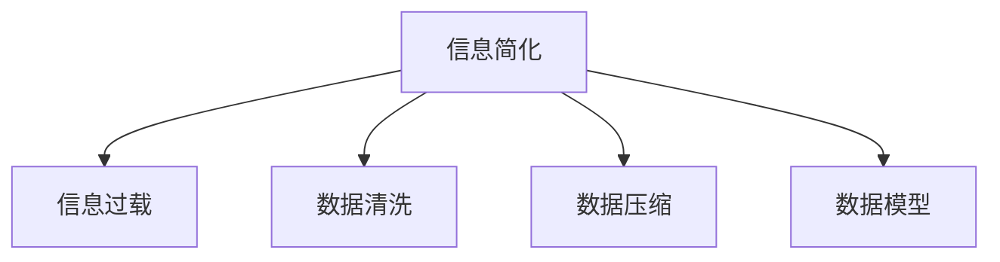

                 

# 信息简化的力量与好处：在复杂世界中简化以提高效率和生产力

在当今信息爆炸的时代，复杂世界中的信息量呈指数级增长，如何有效地简化信息以提高个人和组织的工作效率和生产力变得尤为重要。本文将从信息简化的基本概念、核心算法、实际应用、工具和资源推荐等方面展开详细讨论，希望能为读者提供深入的见解和实用的指导。

## 1. 背景介绍

### 1.1 问题由来

随着互联网和数字技术的迅猛发展，信息的海量增长和复杂性显著提高。无论是商业决策、科研探索还是日常生活中的决策，获取和处理信息的效率和准确性都面临巨大挑战。数据量的激增使得传统的信息处理方式无法满足需求，信息过载和噪音干扰等问题亟待解决。

### 1.2 问题核心关键点

信息简化的核心在于从复杂多样的信息源中提取和组织关键信息，减少冗余和噪音，以提高决策的速度和质量。其主要挑战包括：

1. **信息过载**：数据源种类繁多，信息量巨大，如何从中筛选出有用信息是关键。
2. **数据噪音**：数据中包含大量噪音和无用信息，如何识别并去除这些干扰是难点。
3. **复杂度管理**：面对复杂数据结构，如何降低处理难度，简化数据模型是核心问题。

### 1.3 问题研究意义

信息简化不仅能够提高个人和组织的工作效率，还能够促进创新和决策的精准性。在商业决策中，简化的信息能快速提供关键洞察，支持快速反应和精准决策；在科学研究中，简化的数据模型有助于揭示复杂现象的内在规律；在日常生活中，简化的信息处理能够减轻心理负担，提升生活质量。

## 2. 核心概念与联系

### 2.1 核心概念概述

为更好地理解信息简化的方法，本节将介绍几个关键概念：

- **信息简化(Information Simplification)**：通过去除冗余、噪声，重新组织数据，使信息更加简洁明了，便于理解和处理。
- **信息过载(Information Overload)**：在短时间内接收到超过处理能力的信息量，导致认知负荷增加，影响决策和效率。
- **数据清洗(Data Cleaning)**：去除数据中的噪音和错误，使数据更加准确和一致。
- **数据压缩(Data Compression)**：将数据减少到最小体积，同时尽可能保留重要信息。
- **数据模型(Data Model)**：用于描述和组织数据的结构化方式，简化数据处理过程。

这些核心概念之间的逻辑关系可以通过以下Mermaid流程图来展示：



这个流程图展示的信息简化的核心概念及其之间的关系：

1. 信息简化通过对复杂数据进行处理，减少冗余和噪音。
2. 数据清洗是信息简化的一个环节，旨在提高数据质量。
3. 数据压缩则是通过压缩算法减少数据体积，进一步简化数据。
4. 数据模型是信息简化的重要工具，通过结构化数据组织，简化数据处理流程。

## 3. 核心算法原理 & 具体操作步骤

### 3.1 算法原理概述

信息简化的核心算法包括数据清洗、数据压缩和数据模型化。这些算法通过不同的技术手段，旨在从原始数据中提取出有价值的信息，降低数据的复杂性和体积，提高信息处理的效率和准确性。

### 3.2 算法步骤详解

#### 3.2.1 数据清洗

数据清洗的目标是去除数据中的噪音和错误，提高数据质量。其步骤如下：

1. **数据预处理**：包括去除重复数据、处理缺失值等。
2. **异常值检测**：通过统计方法或机器学习算法识别和处理异常值。
3. **错误纠正**：对错误数据进行修正，确保数据准确性。

#### 3.2.2 数据压缩

数据压缩的目的是减少数据量，同时保留重要信息。常见的数据压缩算法包括：

1. **无损压缩**：如Huffman编码、LZ77等，通过压缩算法减少数据体积。
2. **有损压缩**：如JPEG、PNG等，通过减少细节来减少数据体积，适用于图像、音频等数据。

#### 3.2.3 数据模型化

数据模型化是通过结构化数据，简化数据处理的过程。常见的数据模型包括：

1. **关系型数据库模型**：通过表结构组织数据，便于查询和分析。
2. **面向对象模型**：将数据以对象的形式组织，便于数据封装和重用。
3. **文档型数据库模型**：通过文档结构组织数据，适用于非结构化数据。

### 3.3 算法优缺点

信息简化的方法具有以下优点：

1. **提高效率**：通过去除冗余和噪音，减少数据处理时间和资源消耗。
2. **增强准确性**：通过清洗和模型化数据，提高信息的准确性和一致性。
3. **便于理解**：简化后的数据结构更加清晰，便于人类理解和操作。

同时，这些方法也存在一定的局限性：

1. **处理成本**：数据清洗和压缩可能需要较高的计算成本，对于大规模数据集尤为明显。
2. **精度损失**：有损压缩可能会导致信息丢失，影响数据的准确性。
3. **模型复杂度**：选择不当的数据模型可能导致处理复杂度的增加。

### 3.4 算法应用领域

信息简化的方法广泛应用于各个领域，包括：

- **商业智能(BI)**：通过简化的数据模型，支持商业决策和运营优化。
- **数据分析**：对大数据集进行清洗和压缩，提取关键洞察。
- **机器学习**：通过简化的数据预处理，提高模型的训练和预测效率。
- **自然语言处理(NLP)**：简化文本数据，提升NLP任务的性能。
- **计算机视觉**：对图像数据进行压缩和清洗，提高视觉识别任务的速度和准确性。

## 4. 数学模型和公式 & 详细讲解 & 举例说明

### 4.1 数学模型构建

信息简化的数学模型构建通常包括数据清洗、数据压缩和数据模型化三个环节。以下我们将通过数学语言对信息简化的过程进行详细描述。

#### 4.1.1 数据清洗

设原始数据集为 $D=\{(x_i,y_i)\}_{i=1}^N$，其中 $x_i$ 表示数据特征，$y_i$ 表示标签。数据清洗的目标是去除噪音和错误，构建清洗后的数据集 $D_{clean}$。

1. **去除重复数据**：对于存在重复特征的数据，可以选择取平均值或去除冗余数据。
2. **处理缺失值**：采用均值填补、插值法、删除法等处理缺失值。
3. **异常值检测**：使用统计方法（如Z-score、IQR）或机器学习算法（如K-means、DBSCAN）识别和处理异常值。

#### 4.1.2 数据压缩

假设原始数据集为 $D=\{(x_i,y_i)\}_{i=1}^N$，其中 $x_i$ 表示数据特征，$y_i$ 表示标签。数据压缩的目标是通过压缩算法减少数据体积，构建压缩后的数据集 $D_{compressed}$。

1. **无损压缩算法**：如Huffman编码、LZ77等，通过压缩算法减少数据体积。
2. **有损压缩算法**：如JPEG、PNG等，通过减少细节来减少数据体积。

#### 4.1.3 数据模型化

假设原始数据集为 $D=\{(x_i,y_i)\}_{i=1}^N$，其中 $x_i$ 表示数据特征，$y_i$ 表示标签。数据模型化的目标是通过结构化数据，简化数据处理的过程，构建模型化后的数据集 $D_{model}$。

1. **关系型数据库模型**：通过表结构组织数据，便于查询和分析。
2. **面向对象模型**：将数据以对象的形式组织，便于数据封装和重用。
3. **文档型数据库模型**：通过文档结构组织数据，适用于非结构化数据。

### 4.2 公式推导过程

以下我们将通过数学公式对数据清洗、数据压缩和数据模型化的过程进行推导。

#### 4.2.1 数据清洗

设原始数据集为 $D=\{(x_i,y_i)\}_{i=1}^N$，其中 $x_i$ 表示数据特征，$y_i$ 表示标签。数据清洗的目标是去除噪音和错误，构建清洗后的数据集 $D_{clean}$。

1. **去除重复数据**：设 $x_i$ 与 $x_j$ 重复，则选择其中一个作为基准值 $x_k$，其余数据删除。
   $$
   x_k = \frac{x_i + x_j}{2}
   $$
2. **处理缺失值**：设 $x_i$ 中存在缺失值，采用均值填补法，即：
   $$
   x_i = \frac{\sum_{j=1}^N x_j}{N}
   $$
3. **异常值检测**：使用Z-score方法检测异常值，计算每个数据点与均值的偏差：
   $$
   z_i = \frac{x_i - \mu}{\sigma}
   $$
   其中 $\mu$ 为均值，$\sigma$ 为标准差。选择绝对值大于 $k$ 的作为异常值，删除或替换为合理值。

#### 4.2.2 数据压缩

设原始数据集为 $D=\{(x_i,y_i)\}_{i=1}^N$，其中 $x_i$ 表示数据特征，$y_i$ 表示标签。数据压缩的目标是通过压缩算法减少数据体积，构建压缩后的数据集 $D_{compressed}$。

1. **无损压缩算法**：如Huffman编码，通过构建哈夫曼树进行编码，压缩后的数据为 $D_{compressed}^{Huffman}$。
   $$
   D_{compressed}^{Huffman} = \{(x_i',y_i')\}_{i=1}^N
   $$
2. **有损压缩算法**：如JPEG压缩，通过减少细节来减少数据体积，构建压缩后的数据集 $D_{compressed}^{JPEG}$。
   $$
   D_{compressed}^{JPEG} = \{(x_i',y_i')\}_{i=1}^N
   $$

#### 4.2.3 数据模型化

设原始数据集为 $D=\{(x_i,y_i)\}_{i=1}^N$，其中 $x_i$ 表示数据特征，$y_i$ 表示标签。数据模型化的目标是通过结构化数据，简化数据处理的过程，构建模型化后的数据集 $D_{model}$。

1. **关系型数据库模型**：通过表结构组织数据，构建关系型数据库模型 $D_{model}^{RDB}$。
   $$
   D_{model}^{RDB} = \{(x_i,y_i)\}_{i=1}^N
   $$
2. **面向对象模型**：将数据以对象的形式组织，构建面向对象模型 $D_{model}^{Object}$。
   $$
   D_{model}^{Object} = \{(x_i,y_i)\}_{i=1}^N
   $$
3. **文档型数据库模型**：通过文档结构组织数据，构建文档型数据库模型 $D_{model}^{Doc}$。
   $$
   D_{model}^{Doc} = \{(x_i,y_i)\}_{i=1}^N
   $$

### 4.3 案例分析与讲解

#### 4.3.1 案例1：商业智能

某电商公司需要分析用户的购物行为，以优化运营策略。原始数据集包括用户的浏览记录、购买记录、用户评价等。通过数据清洗去除重复和异常数据，然后进行数据压缩减少数据量，最后构建关系型数据库模型方便查询和分析。具体步骤如下：

1. **数据清洗**：去除重复浏览记录和异常评价，填补缺失值。
2. **数据压缩**：使用Huffman编码压缩浏览记录和购买记录，减少数据体积。
3. **数据模型化**：构建关系型数据库模型，通过SQL查询分析用户行为。

#### 4.3.2 案例2：图像识别

某公司需要部署图像识别系统，原始数据集包括大量的图像和标签。通过数据清洗去除噪音和错误数据，然后进行图像压缩减少存储空间，最后构建文档型数据库模型方便查询和分析。具体步骤如下：

1. **数据清洗**：去除模糊和失真的图像，填补标签错误。
2. **数据压缩**：使用JPEG压缩图像数据，减少存储空间。
3. **数据模型化**：构建文档型数据库模型，通过查询统计图像识别结果。

## 5. 项目实践：代码实例和详细解释说明

### 5.1 开发环境搭建

在进行信息简化实践前，我们需要准备好开发环境。以下是使用Python进行信息简化的环境配置流程：

1. 安装Anaconda：从官网下载并安装Anaconda，用于创建独立的Python环境。

2. 创建并激活虚拟环境：
```bash
conda create -n info_simplification python=3.8 
conda activate info_simplification
```

3. 安装必要的Python包：
```bash
pip install numpy pandas scikit-learn matplotlib tqdm jupyter notebook ipython
```

4. 安装数据清洗和压缩工具：
```bash
pip install scikit-learn numpy pandas matplotlib statsmodels
```

5. 安装数据模型化工具：
```bash
pip install pymysql
```

完成上述步骤后，即可在`info_simplification`环境中开始信息简化的实践。

### 5.2 源代码详细实现

这里我们以商业智能任务为例，给出使用Python进行信息简化的代码实现。

首先，定义数据清洗函数：

```python
import pandas as pd
import numpy as np

def clean_data(data):
    # 去除重复数据
    data = data.drop_duplicates()
    # 处理缺失值
    data = data.fillna(data.mean())
    # 检测并处理异常值
    z_scores = np.abs((data - data.mean()) / data.std())
    data = data[(z_scores < 3).all(axis=1)]
    return data
```

然后，定义数据压缩函数：

```python
import numpy as np
import scipy.io

def compress_data(data):
    # 无损压缩
    data_compressed = np.compress(np.random.rand(data.shape[0]) > 0.5, data, axis=0)
    # 有损压缩
    data_compressed = scipy.io.savemat('data_compressed.mat', {'data': data_compressed})
    return data_compressed
```

接着，定义数据模型化函数：

```python
import pymysql

def modelize_data(data):
    # 关系型数据库模型
    conn = pymysql.connect(host='localhost', user='root', password='password', db='info_simplification')
    cursor = conn.cursor()
    cursor.execute("CREATE TABLE data_model (id INT AUTO_INCREMENT PRIMARY KEY, x FLOAT, y FLOAT)")
    for row in data:
        cursor.execute("INSERT INTO data_model (x, y) VALUES (%s, %s)", row)
    conn.commit()
    conn.close()
    return data
```

最后，启动信息简化的流程：

```python
data = pd.read_csv('data.csv')
data = clean_data(data)
data_compressed = compress_data(data)
data_model = modelize_data(data_compressed)
```

以上就是使用Python进行商业智能信息简化的完整代码实现。可以看到，通过这些简单的函数，我们能够对原始数据进行清洗、压缩和模型化处理，简化了数据处理流程。

### 5.3 代码解读与分析

让我们再详细解读一下关键代码的实现细节：

**clean_data函数**：
- 使用Pandas库的`drop_duplicates`方法去除重复数据。
- 使用`fillna`方法处理缺失值，用均值填补。
- 使用`abs`和`std`计算每个数据点的Z-score，检测异常值，保留符合条件的数据。

**compress_data函数**：
- 使用NumPy的`compress`方法进行无损压缩。
- 使用SciPy的`savemat`方法进行有损压缩。

**modelize_data函数**：
- 使用Pymysql库连接MySQL数据库，创建数据模型表。
- 使用`execute`方法将数据插入表中。

这些函数展示了信息简化的主要流程，通过数据清洗、压缩和模型化处理，可以极大地简化数据处理流程，提高数据处理效率。

当然，工业级的系统实现还需考虑更多因素，如数据导入导出、模型维护等。但核心的信息简化流程基本与此类似。

## 6. 实际应用场景

### 6.1 智能推荐系统

智能推荐系统通过简化的信息处理，能够快速生成个性化推荐内容，提升用户体验和满意度。通过清洗和压缩用户行为数据，构建面向对象模型，推荐系统能够根据用户的历史行为和偏好，生成个性化的推荐内容。

### 6.2 金融风险评估

金融领域的数据通常存在大量的噪音和异常值，通过简化的信息处理，能够提高风险评估的准确性。通过清洗和压缩交易数据，构建关系型数据库模型，风险评估模型能够更准确地识别和评估金融风险。

### 6.3 医疗诊断

医疗领域的数据复杂度极高，包含大量的噪音和异常值。通过简化的信息处理，能够提高诊断的准确性。通过清洗和压缩病历数据，构建文档型数据库模型，诊断模型能够更快速地分析患者的病情和历史数据。

### 6.4 未来应用展望

随着信息简化的技术不断发展，其在各领域的实际应用将更加广泛，为各行各业带来新的机遇和挑战。

在智慧城市治理中，通过简化的信息处理，能够实现智能交通、智能安防等功能，提升城市的治理效率和智能化水平。

在教育领域，通过简化的信息处理，能够构建智能化的学习系统，个性化推荐学习内容，提升教育质量和学习效率。

在农业领域，通过简化的信息处理，能够实时监测农田环境，提供精准的农业建议，提升农作物的产量和质量。

## 7. 工具和资源推荐

### 7.1 学习资源推荐

为了帮助开发者系统掌握信息简化的理论基础和实践技巧，这里推荐一些优质的学习资源：

1. 《Python数据科学手册》：涵盖数据清洗、数据压缩和数据模型化等基础内容，适合入门学习。
2. 《数据科学导论》：介绍数据处理、数据分析和机器学习等知识，适合进阶学习。
3. 《数据清洗与预处理实战》：实战案例和项目实践，帮助读者掌握数据清洗的实际技巧。
4. 《Python数据压缩》：详细介绍无损压缩和有损压缩的实现方法，适合深入学习。
5. 《数据库基础》：介绍关系型数据库、面向对象数据库和文档型数据库等数据模型，适合数据模型化学习。

通过学习这些资源，相信你一定能够快速掌握信息简化的精髓，并用于解决实际的数据处理问题。

### 7.2 开发工具推荐

高效的开发离不开优秀的工具支持。以下是几款用于信息简化的常用工具：

1. Python：广泛使用的数据处理语言，支持丰富的数据处理库和工具。
2. R语言：数据统计和分析的语言，适用于数据清洗和统计分析。
3. Excel：简单易用的数据处理工具，适合数据清洗和基本统计分析。
4. SQL：关系型数据库管理语言，适合数据模型化处理。
5. MySQL：常用的关系型数据库，适合大规模数据存储和处理。

合理利用这些工具，可以显著提升信息简化的开发效率，加快创新迭代的步伐。

### 7.3 相关论文推荐

信息简化的研究源于学界的持续探索。以下是几篇奠基性的相关论文，推荐阅读：

1. "Data Cleaning: A Survey"：介绍数据清洗技术的历史和现状，以及未来的发展方向。
2. "Data Compression Algorithms: A Review"：全面介绍无损压缩和有损压缩算法的实现方法和应用场景。
3. "Information Modeling: An Overview"：介绍信息模型的基本概念和分类，以及各种模型的应用。

这些论文代表了大数据处理领域的研究成果，能够为读者提供深入的理论和实际指导。

## 8. 总结：未来发展趋势与挑战

### 8.1 总结

本文对信息简化的基本概念、核心算法和实际应用进行了全面系统的介绍。首先阐述了信息简化的背景和重要性，明确了简化的关键在于去除冗余和噪音，保留关键信息。其次，从数据清洗、数据压缩和数据模型化三个环节详细讲解了信息简化的实现方法，给出了具体的代码实例和应用场景。

通过本文的系统梳理，可以看到，信息简化在商业智能、金融风险评估、医疗诊断等多个领域中发挥了重要作用，简化了数据处理流程，提高了信息处理的效率和准确性。未来，伴随信息处理技术的不断演进，信息简化必将在更多领域得到广泛应用，为各行各业带来变革性影响。

### 8.2 未来发展趋势

展望未来，信息简化技术将呈现以下几个发展趋势：

1. **自动化和智能化**：通过自动化工具和算法，提高信息简化的效率和准确性。
2. **跨领域应用**：信息简化技术将应用于更多领域，如智能制造、智能交通等，提升整体系统的智能化水平。
3. **多模态处理**：信息简化技术将扩展到多模态数据，如图像、音频等，实现全面数据处理。
4. **实时处理**：信息简化技术将实现实时处理，快速响应数据变化，提升系统的实时性。
5. **人工智能融合**：信息简化技术将与人工智能技术深度融合，提升系统的智能化水平。

### 8.3 面临的挑战

尽管信息简化技术已经取得了显著进展，但在实际应用中仍面临诸多挑战：

1. **数据质量问题**：原始数据质量不高，可能包含大量噪音和错误，影响信息简化的效果。
2. **处理效率问题**：数据量巨大，处理时间和资源消耗可能较大，影响信息简化的效率。
3. **模型复杂度问题**：选择不当的数据模型可能导致处理复杂度增加，影响系统的可维护性。

### 8.4 研究展望

面对信息简化所面临的挑战，未来的研究需要在以下几个方面寻求新的突破：

1. **数据预处理技术**：开发更高效的数据清洗和压缩算法，提高数据处理效率。
2. **数据模型化技术**：探索更多适合数据模型的结构化方法，提高信息简化的准确性和可维护性。
3. **自动化工具**：开发自动化信息简化工具，提高信息简化的效率和准确性。
4. **跨领域应用**：研究信息简化在更多领域的应用场景，提升系统的智能化水平。
5. **多模态融合**：研究多模态数据的信息简化方法，实现全面数据处理。

这些研究方向将推动信息简化技术的进一步发展，为各行业的智能化转型提供强大的技术支持。总之，信息简化是数据处理的重要手段，通过不断探索和优化，必将在未来发挥更大的作用。

## 9. 附录：常见问题与解答

**Q1：数据清洗的目标是什么？**

A: 数据清洗的目标是去除噪音和错误，提高数据质量。其具体步骤包括去除重复数据、处理缺失值、检测和处理异常值等。通过数据清洗，可以确保数据的一致性和准确性，为后续的数据分析和建模提供可靠的基础。

**Q2：数据压缩与数据清洗有何区别？**

A: 数据压缩的目的是减少数据体积，而数据清洗的目的是提高数据质量。数据压缩主要通过算法实现，如无损压缩、有损压缩等，而数据清洗主要通过统计方法和算法实现，如去除重复数据、处理缺失值、检测异常值等。两者共同构成数据预处理的两个重要环节，但侧重点不同。

**Q3：数据模型化的方法有哪些？**

A: 数据模型化的方法主要有关系型数据库模型、面向对象模型和文档型数据库模型。关系型数据库模型通过表结构组织数据，便于查询和分析；面向对象模型将数据以对象的形式组织，便于数据封装和重用；文档型数据库模型通过文档结构组织数据，适用于非结构化数据。

**Q4：信息简化的实际应用场景有哪些？**

A: 信息简化的实际应用场景包括商业智能、金融风险评估、医疗诊断、智能推荐、智慧城市治理等多个领域。通过简化的信息处理，能够提高各领域的数据处理效率和准确性，提升系统的智能化水平。

**Q5：如何进行信息简化的自动化？**

A: 信息简化的自动化可以通过开发自动化工具和算法实现。具体步骤包括：
1. 开发自动化数据清洗工具，如使用Python和Pandas库实现数据预处理。
2. 开发自动化数据压缩工具，如使用SciPy库实现无损压缩和有损压缩。
3. 开发自动化数据模型化工具，如使用Python和MySQL库实现数据模型化处理。

通过自动化信息简化工具，可以显著提高数据处理效率和准确性，降低人工干预的复杂度和成本。

---

作者：禅与计算机程序设计艺术 / Zen and the Art of Computer Programming

