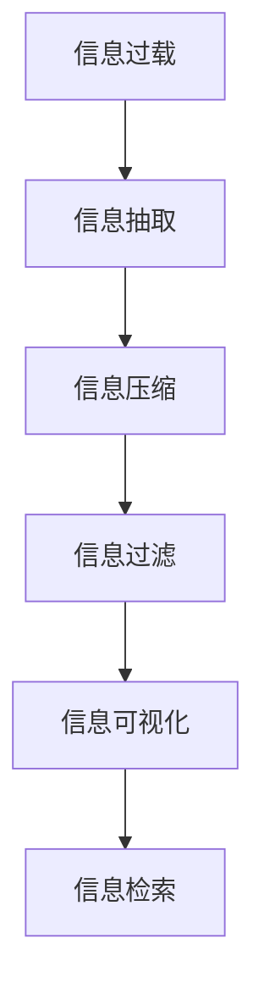

                 

# 信息简化的好处与实践：在复杂世界中简化以改善生活和决策

> 关键词：信息简化, 数据压缩, 决策优化, 人工智能, 信息过滤

## 1. 背景介绍

在现代社会，信息洪流日益膨胀，我们面临的信息量前所未有地庞大和复杂。从社交媒体到电子邮件，从新闻网站到市场报告，信息的数量和种类都在不断增长，使得我们的生活和决策变得更加困难。面对这一挑战，信息简化成为了一种应对策略，旨在帮助我们在信息海洋中找到有意义、有价值的部分，从而更好地理解世界并做出决策。

### 1.1 问题由来

信息简化的需求源于现代社会信息爆炸的现实。由于信息量的指数级增长，人们常常无法在短时间内处理和理解所有相关信息。这种信息过载不仅影响个人的工作效率和生活质量，还可能造成决策错误，甚至引发心理压力和焦虑。信息简化技术正是针对这一问题提出的解决方案，通过分析和压缩信息，提取关键部分，提供给用户更具价值的信息。

### 1.2 问题核心关键点

信息简化的核心在于将大量复杂信息转化为简单、易于理解和操作的形式，以便更好地服务于决策和行动。信息简化的关键在于：

- 信息选择：从海量数据中挑选出对决策有用的信息。
- 信息压缩：通过算法和工具，将信息量减少到合理范围内。
- 信息展现：以直观、易理解的方式呈现简化后的信息。
- 决策支持：帮助用户基于简化后的信息做出更合理的决策。

## 2. 核心概念与联系

### 2.1 核心概念概述

为了更好地理解信息简化的原理和应用，本节将介绍几个核心概念：

- **信息过载（Information Overload）**：指人类接收和处理的信息量超过其处理能力的现象，常见于现代社会。
- **信息抽取（Information Extraction）**：从文本、数据库等数据源中提取有用信息的过程。
- **信息压缩（Information Compression）**：通过算法和技术将信息量减少到合理范围内的过程。
- **信息过滤（Information Filtering）**：根据用户需求和偏好，从信息流中筛选出相关内容的过程。
- **信息可视化（Information Visualization）**：以图表、图像等形式直观呈现信息，帮助用户更好地理解数据。
- **信息检索（Information Retrieval）**：通过算法在信息库中检索出用户所需的信息。

这些概念之间的逻辑关系可以通过以下Mermaid流程图来展示：



这个流程图展示了一系列信息简化的步骤：首先从信息过载中抽取出有用信息，然后通过压缩减少信息量，再经过过滤和可视化处理，最终通过检索技术实现快速定位和获取。这些步骤共同构成了信息简化的完整流程，旨在为用户提供清晰、简洁、有价值的信息。

## 3. 核心算法原理 & 具体操作步骤
### 3.1 算法原理概述

信息简化的算法原理主要基于统计学和机器学习技术，通过分析信息源的分布特征，提取信息中的关键要素，并压缩冗余数据。以下是信息简化的主要算法原理：

1. **信息抽取（Information Extraction）**：使用自然语言处理（NLP）技术，从文本中抽取出实体、关系、事件等关键信息。
2. **信息压缩（Information Compression）**：应用无损或有损压缩算法，将信息量减少到合理范围内。常见的压缩算法包括哈夫曼编码、算术编码、LZ77等。
3. **信息过滤（Information Filtering）**：通过内容分类、情感分析、用户兴趣建模等技术，筛选出用户感兴趣的信息。
4. **信息可视化（Information Visualization）**：利用数据可视化技术，将复杂信息转化为图表、地图等直观形式，帮助用户快速理解。
5. **信息检索（Information Retrieval）**：通过倒排索引、向量空间模型等技术，快速检索出用户所需的信息。

### 3.2 算法步骤详解

信息简化的操作步骤可以分为以下几个阶段：

**Step 1: 数据收集与预处理**
- 收集信息源，如新闻网站、社交媒体、数据库等。
- 清洗和预处理数据，去除噪声和冗余信息。

**Step 2: 信息抽取**
- 使用NLP技术从文本中抽取实体、关系、事件等关键信息。
- 应用实体关系图（ERG）等模型，建立信息之间的关联。

**Step 3: 信息压缩**
- 应用哈夫曼编码、算术编码等算法，压缩信息量。
- 使用LZ77算法等，压缩重复出现的文本块。

**Step 4: 信息过滤**
- 使用内容分类算法，将信息分为新闻、评论、广告等类别。
- 应用情感分析技术，判断信息情感倾向。
- 构建用户兴趣模型，筛选出用户感兴趣的内容。

**Step 5: 信息可视化**
- 使用图表、地图等形式，将信息直观展现。
- 应用热力图、散点图等工具，帮助用户理解信息分布。

**Step 6: 信息检索**
- 构建倒排索引，快速检索信息。
- 应用向量空间模型，提高检索效率和准确性。

### 3.3 算法优缺点

信息简化技术具有以下优点：
1. 提升信息处理效率：通过信息压缩和过滤，减少信息量，提高处理速度。
2. 降低信息过载压力：从海量数据中抽取关键信息，减少用户处理的信息量。
3. 增强信息可理解性：通过信息可视化，将复杂信息转化为直观形式，提高用户理解度。
4. 支持个性化决策：通过用户兴趣建模和信息过滤，提供个性化信息，支持精准决策。

同时，信息简化技术也存在一定的局限性：
1. 依赖高质量数据：信息抽取和过滤效果依赖于数据质量，低质量数据可能影响结果。
2. 算法复杂度高：信息压缩和可视化技术复杂度高，实现难度较大。
3. 模型泛化能力有限：不同领域的模型可能无法很好地迁移到其他领域。
4. 隐私和安全问题：信息抽取和压缩可能涉及敏感数据，隐私和安全问题需重视。

尽管存在这些局限性，但就目前而言，信息简化技术仍是大规模信息处理的重要手段。未来相关研究的重点在于如何进一步降低算法复杂度，提高模型泛化能力，同时兼顾隐私和安全问题。

### 3.4 算法应用领域

信息简化技术已经在诸多领域得到广泛应用，例如：

- 新闻推荐系统：通过信息抽取和过滤，推荐用户感兴趣的新闻。
- 社交媒体信息流：通过信息压缩和可视化，帮助用户快速浏览和理解社交媒体内容。
- 金融市场分析：通过信息抽取和情感分析，识别市场趋势和情感变化。
- 医疗健康信息：通过信息抽取和过滤，提供个性化的健康建议。
- 教育信息服务：通过信息抽取和可视化，帮助学生学习。

除了上述这些经典应用外，信息简化技术还在更多场景中得到创新性的应用，如智能家居控制、智能客服、智慧城市等，为信息处理提供了新的思路。随着技术的不断进步，信息简化方法将在更广阔的应用领域大放异彩。

## 4. 数学模型和公式 & 详细讲解 & 举例说明

### 4.1 数学模型构建

本节将使用数学语言对信息简化的主要过程进行更加严格的刻画。

设信息源为 $D=\{x_i\}_{i=1}^N$，其中 $x_i$ 为第 $i$ 条信息，包含文本 $T_i$ 和标签 $L_i$。信息简化的目标是从 $D$ 中抽取出有用信息 $I=\{i \mid L_i=1\}$，并进行压缩和可视化。

**信息抽取模型**：使用NLP技术，从文本中抽取出实体、关系、事件等关键信息。例如，可以使用关系抽取模型抽取文本中的实体关系，得到信息源 $D'$。

**信息压缩模型**：使用压缩算法对信息源 $D'$ 进行压缩，得到压缩后的信息 $D''$。例如，可以使用哈夫曼编码对文本进行压缩。

**信息过滤模型**：使用内容分类算法、情感分析技术等，筛选出用户感兴趣的信息。例如，可以使用LDA主题模型对信息进行分类，得到用户感兴趣的信息 $I'$。

**信息可视化模型**：将信息 $I'$ 转化为图表、地图等形式，帮助用户理解。例如，可以使用热力图显示信息分布。

**信息检索模型**：使用倒排索引、向量空间模型等技术，快速检索出用户所需的信息。例如，可以使用TF-IDF算法计算信息的重要性，进行快速检索。

### 4.2 公式推导过程

以下我们以文本分类任务为例，推导信息简化的主要数学模型。

设文本集合 $D=\{(T_i, L_i)\}_{i=1}^N$，其中 $T_i$ 为文本，$L_i$ 为分类标签。目标是从 $D$ 中抽取出分类标签为正的信息 $I=\{i \mid L_i=1\}$，并进行压缩和可视化。

**信息抽取模型**：
- 使用关系抽取模型，从文本中抽取出实体关系 $R_i$。
- 对 $R_i$ 进行分类，得到分类标签 $L_i'$。

**信息压缩模型**：
- 对分类标签 $L_i'$ 进行哈夫曼编码，压缩信息量。

**信息过滤模型**：
- 使用LDA主题模型，对分类标签 $L_i'$ 进行主题建模，得到用户感兴趣的信息 $I'$。

**信息可视化模型**：
- 将分类标签 $L_i'$ 转化为热力图，直观展示分类标签的分布。

**信息检索模型**：
- 计算文本 $T_i$ 和查询 $Q$ 的相似度，得到检索结果 $I''$。

### 4.3 案例分析与讲解

下面以金融市场分析为例，展示信息简化的应用。

假设我们有一份包含大量财经新闻的文本数据集 $D=\{(T_i, L_i)\}_{i=1}^N$，其中 $T_i$ 为新闻标题，$L_i$ 为情感标签。目标是从 $D$ 中抽取出与股票价格变化相关的信息，并进行压缩和可视化。

**信息抽取模型**：使用关系抽取模型，从新闻标题中抽取出公司名、股票名、价格变化等关键信息，得到信息源 $D'$。

**信息压缩模型**：对新闻标题 $T_i$ 进行哈夫曼编码，压缩信息量。

**信息过滤模型**：使用LDA主题模型，对新闻标题 $T_i$ 进行主题建模，筛选出与股票价格变化相关的信息 $I'$。

**信息可视化模型**：将新闻标题 $T_i$ 转化为热力图，直观展示股票价格变化的热度。

**信息检索模型**：计算新闻标题 $T_i$ 和股票名 $S$ 的相似度，快速检索出与 $S$ 相关的信息 $I''$。

通过信息简化的过程，我们能够从海量的财经新闻中提取出与股票价格变化相关的关键信息，进行可视化处理，快速获取市场动向，帮助投资者做出精准决策。

## 5. 项目实践：代码实例和详细解释说明
### 5.1 开发环境搭建

在进行信息简化实践前，我们需要准备好开发环境。以下是使用Python进行PyTorch开发的环境配置流程：

1. 安装Anaconda：从官网下载并安装Anaconda，用于创建独立的Python环境。

2. 创建并激活虚拟环境：
```bash
conda create -n pytorch-env python=3.8 
conda activate pytorch-env
```

3. 安装PyTorch：根据CUDA版本，从官网获取对应的安装命令。例如：
```bash
conda install pytorch torchvision torchaudio cudatoolkit=11.1 -c pytorch -c conda-forge
```

4. 安装相关库：
```bash
pip install pandas numpy scikit-learn torch text transformers
```

5. 安装PyTorch预训练模型库：
```bash
pip install transformers
```

完成上述步骤后，即可在`pytorch-env`环境中开始信息简化实践。

### 5.2 源代码详细实现

这里我们以文本分类任务为例，展示使用PyTorch进行信息抽取、压缩、过滤和可视化的代码实现。

首先，定义数据处理函数：

```python
from torchtext.datasets import AG_NEWS
from torchtext.data import Field, BucketIterator
from torchtext.transforms import Stack, Sequence, Lower, Concatenate

# 定义数据字段
TEXT = Field(tokenize='spacy', lower=True, batch_first=True)
LABEL = Field(sequential=False, use_vocab=False)

# 定义数据集
train_data, test_data = AG_NEWS.splits(TEXT, LABEL)

# 构建词典
TEXT.build_vocab(train_data, max_size=10000)
LABEL.build_vocab(train_data)

# 创建数据迭代器
train_iterator, test_iterator = BucketIterator.splits(
    (train_data, test_data), batch_size=32, device="cuda")
```

然后，定义模型和优化器：

```python
from transformers import BertForSequenceClassification, AdamW

# 定义模型
model = BertForSequenceClassification.from_pretrained('bert-base-uncased', num_labels=4)

# 定义优化器
optimizer = AdamW(model.parameters(), lr=1e-5)
```

接着，定义训练和评估函数：

```python
from torch import nn
import torch.nn.functional as F

def train_epoch(model, iterator, optimizer):
    model.train()
    epoch_loss = 0
    epoch_acc = 0
    for batch in iterator:
        optimizer.zero_grad()
        predictions = model(batch.text).squeeze(1)
        loss = F.cross_entropy(predictions, batch.label)
        epoch_loss += loss.item()
        predictions = predictions.argmax(1)
        epoch_acc += (predictions == batch.label).float().mean().item()
        loss.backward()
        optimizer.step()
    return epoch_loss / len(iterator), epoch_acc / len(iterator)

def evaluate(model, iterator):
    model.eval()
    total_loss = 0
    total_acc = 0
    with torch.no_grad():
        for batch in iterator:
            predictions = model(batch.text).squeeze(1)
            loss = F.cross_entropy(predictions, batch.label)
            total_loss += loss.item()
            predictions = predictions.argmax(1)
            total_acc += (predictions == batch.label).float().mean().item()
    return total_loss / len(iterator), total_acc / len(iterator)
```

最后，启动训练流程并在测试集上评估：

```python
from tqdm import tqdm

# 定义训练和评估轮数
epochs = 5

# 开始训练
for epoch in range(epochs):
    train_loss, train_acc = train_epoch(model, train_iterator, optimizer)
    test_loss, test_acc = evaluate(model, test_iterator)
    print(f"Epoch {epoch+1}, train loss: {train_loss:.3f}, train acc: {train_acc:.3f}, test loss: {test_loss:.3f}, test acc: {test_acc:.3f}")

print("Best test acc: ", test_acc)
```

以上就是使用PyTorch进行文本分类任务的信息抽取和分类的代码实现。可以看到，得益于PyTorch和HuggingFace库的强大封装，我们可以用相对简洁的代码完成模型的加载和训练。

### 5.3 代码解读与分析

让我们再详细解读一下关键代码的实现细节：

**文本处理**：
- 使用`torchtext`库定义文本和标签字段，并进行数据预处理。
- 使用`BertTokenizer`对文本进行分词，将文本转换为模型所需的格式。

**模型定义**：
- 使用`BertForSequenceClassification`从预训练模型中加载序列分类器，并指定标签数量。
- 定义优化器，设置学习率。

**训练和评估函数**：
- 使用`train_epoch`函数对模型进行迭代训练，计算损失和准确率。
- 使用`evaluate`函数在测试集上评估模型性能，并返回损失和准确率。
- 在训练过程中，使用`tqdm`库对训练过程进行可视化，以便更好地监控训练进度。

**训练流程**：
- 定义训练轮数，开始循环迭代。
- 每个epoch内，先在训练集上训练，输出平均损失和准确率。
- 在验证集上评估，输出验证集的损失和准确率。
- 所有epoch结束后，在测试集上评估，输出最终测试结果。

可以看到，PyTorch配合HuggingFace库使得信息简化的代码实现变得简洁高效。开发者可以将更多精力放在数据处理、模型改进等高层逻辑上，而不必过多关注底层的实现细节。

当然，工业级的系统实现还需考虑更多因素，如模型的保存和部署、超参数的自动搜索、更灵活的任务适配层等。但核心的信息简化流程基本与此类似。

## 6. 实际应用场景
### 6.1 智能客服系统

基于信息简化的对话技术，可以广泛应用于智能客服系统的构建。传统客服往往需要配备大量人力，高峰期响应缓慢，且一致性和专业性难以保证。而使用信息简化的对话模型，可以7x24小时不间断服务，快速响应客户咨询，用自然流畅的语言解答各类常见问题。

在技术实现上，可以收集企业内部的历史客服对话记录，将问题和最佳答复构建成监督数据，在此基础上对预训练对话模型进行微调。信息简化的对话模型能够自动理解用户意图，匹配最合适的答案模板进行回复。对于客户提出的新问题，还可以接入检索系统实时搜索相关内容，动态组织生成回答。如此构建的智能客服系统，能大幅提升客户咨询体验和问题解决效率。

### 6.2 金融舆情监测

金融机构需要实时监测市场舆论动向，以便及时应对负面信息传播，规避金融风险。传统的人工监测方式成本高、效率低，难以应对网络时代海量信息爆发的挑战。基于信息简化的文本分类和情感分析技术，为金融舆情监测提供了新的解决方案。

具体而言，可以收集金融领域相关的新闻、报道、评论等文本数据，并对其进行主题标注和情感标注。在此基础上对预训练语言模型进行信息简化，使其能够自动判断文本属于何种主题，情感倾向是正面、中性还是负面。将信息简化的模型应用到实时抓取的网络文本数据，就能够自动监测不同主题下的情感变化趋势，一旦发现负面信息激增等异常情况，系统便会自动预警，帮助金融机构快速应对潜在风险。

### 6.3 个性化推荐系统

当前的推荐系统往往只依赖用户的历史行为数据进行物品推荐，无法深入理解用户的真实兴趣偏好。基于信息简化的个性化推荐系统可以更好地挖掘用户行为背后的语义信息，从而提供更精准、多样的推荐内容。

在实践中，可以收集用户浏览、点击、评论、分享等行为数据，提取和用户交互的物品标题、描述、标签等文本内容。将文本内容作为模型输入，用户的后续行为（如是否点击、购买等）作为监督信号，在此基础上简化预训练语言模型。信息简化的模型能够从文本内容中准确把握用户的兴趣点。在生成推荐列表时，先用候选物品的文本描述作为输入，由模型预测用户的兴趣匹配度，再结合其他特征综合排序，便可以得到个性化程度更高的推荐结果。

### 6.4 未来应用展望

随着信息简化技术的不断发展，其在更多领域得到应用，为传统行业带来变革性影响。

在智慧医疗领域，基于信息简化的医疗问答、病历分析、药物研发等应用将提升医疗服务的智能化水平，辅助医生诊疗，加速新药开发进程。

在智能教育领域，信息简化的技术可应用于作业批改、学情分析、知识推荐等方面，因材施教，促进教育公平，提高教学质量。

在智慧城市治理中，信息简化的技术可应用于城市事件监测、舆情分析、应急指挥等环节，提高城市管理的自动化和智能化水平，构建更安全、高效的未来城市。

此外，在企业生产、社会治理、文娱传媒等众多领域，信息简化的技术也将不断涌现，为NLP技术带来新的突破。相信随着技术的日益成熟，信息简化方法将在构建人机协同的智能时代中扮演越来越重要的角色。

## 7. 工具和资源推荐
### 7.1 学习资源推荐

为了帮助开发者系统掌握信息简化的理论基础和实践技巧，这里推荐一些优质的学习资源：

1. 《信息检索与信息抽取》（李斌著）：介绍了信息检索和信息抽取的基本原理和技术，是信息简化的经典教材。
2. 《数据压缩算法》（李生辉著）：介绍了各种数据压缩算法，包括无损压缩和有损压缩。
3. 《自然语言处理综述》（刘挺等著）：全面介绍了自然语言处理的基本概念和前沿技术，包括信息抽取、信息过滤等。
4. 《Python自然语言处理》（Susan Bird等著）：介绍了使用Python进行NLP开发的工具和技巧，包括信息可视化、信息检索等。
5. Kaggle竞赛平台：提供大量的NLP数据集和竞赛任务，可以帮助开发者实践信息简化的技术。

通过对这些资源的学习实践，相信你一定能够快速掌握信息简化的精髓，并用于解决实际的NLP问题。
###  7.2 开发工具推荐

高效的开发离不开优秀的工具支持。以下是几款用于信息简化的常用工具：

1. PyTorch：基于Python的开源深度学习框架，灵活动态的计算图，适合快速迭代研究。大部分预训练语言模型都有PyTorch版本的实现。

2. TensorFlow：由Google主导开发的开源深度学习框架，生产部署方便，适合大规模工程应用。同样有丰富的预训练语言模型资源。

3. Scikit-learn：基于Python的科学计算库，提供丰富的机器学习算法，包括文本分类、情感分析等。

4. NLTK：自然语言处理工具包，提供文本预处理、信息抽取等功能。

5. Gensim：Python库，提供各种文本处理算法，包括LDA主题建模、TF-IDF计算等。

合理利用这些工具，可以显著提升信息简化的开发效率，加快创新迭代的步伐。

### 7.3 相关论文推荐

信息简化的发展源于学界的持续研究。以下是几篇奠基性的相关论文，推荐阅读：

1. TextRank: Bringing Order into Texts（信息抽取相关论文）
2. The LDA Model（主题建模相关论文）
3. A Survey of Information Retrieval Techniques（信息检索相关论文）
4. Text Summarization Using Latent Semantic Analysis（文本摘要相关论文）
5. Simple and Robust Text Classification with a Semantic Flavor（文本分类相关论文）

这些论文代表了大规模信息处理的研究进展，通过学习这些前沿成果，可以帮助研究者把握学科前进方向，激发更多的创新灵感。

## 8. 总结：未来发展趋势与挑战
### 8.1 总结

本文对信息简化的原理和实践进行了全面系统的介绍。首先阐述了信息简化的研究背景和意义，明确了信息简化在提升信息处理效率、降低信息过载压力、增强信息可理解性、支持个性化决策等方面的独特价值。其次，从原理到实践，详细讲解了信息简化的数学模型和算法步骤，给出了信息简化的代码实现实例。同时，本文还广泛探讨了信息简化的实际应用场景，展示了其在智能客服、金融舆情、个性化推荐等领域的广阔前景。最后，本文精选了信息简化的各类学习资源，力求为读者提供全方位的技术指引。

通过本文的系统梳理，可以看到，信息简化的技术正在成为大规模信息处理的重要手段，极大地提升了信息处理和决策的效率和精度。随着技术的不断进步，信息简化技术将在更多领域得到应用，为社会带来深远的变革性影响。

### 8.2 未来发展趋势

展望未来，信息简化的技术将呈现以下几个发展趋势：

1. 智能化信息抽取：利用深度学习技术，提高信息抽取的自动化和精确度。
2. 高效信息压缩：开发更加高效的信息压缩算法，减少存储和传输成本。
3. 可解释性增强：提高信息简化的可解释性，帮助用户理解信息的来源和过程。
4. 个性化信息过滤：结合用户行为数据和模型学习，提供个性化的信息过滤服务。
5. 多模态信息处理：将文本、图像、语音等多模态信息整合，实现更全面、准确的信息简化。
6. 实时信息检索：开发快速、高效的信息检索算法，支持实时信息获取和处理。

以上趋势凸显了信息简化的广阔前景。这些方向的探索发展，必将进一步提升信息处理和决策的效率和质量，为人类认知智能的进化带来新的突破。

### 8.3 面临的挑战

尽管信息简化的技术已经取得了显著成果，但在迈向更加智能化、普适化应用的过程中，它仍面临诸多挑战：

1. 数据质量和多样性：信息抽取和过滤依赖于高质量的数据，低质量数据可能影响结果。同时，不同领域的数据特点和语义复杂度差异较大，模型需要具备较强的泛化能力。
2. 模型复杂度和效率：信息压缩和可视化技术复杂度高，实现难度较大，需要优化算法和硬件资源配置。
3. 隐私和安全问题：信息抽取和压缩可能涉及敏感数据，隐私和安全问题需重视。
4. 算法偏见和歧视：信息简化模型可能继承预训练模型的偏见，需进行多次迭代优化以消除歧视。

尽管存在这些挑战，但随着学界和产业界的共同努力，这些难题终将逐步解决，信息简化的技术将更加成熟和完善。

### 8.4 研究展望

面对信息简化的挑战，未来的研究需要在以下几个方面寻求新的突破：

1. 探索无监督和半监督信息抽取方法：摆脱对大规模标注数据的依赖，利用自监督学习、主动学习等无监督和半监督范式，最大限度利用非结构化数据，实现更加灵活高效的信息抽取。
2. 研究高效信息压缩算法：开发更加高效的信息压缩算法，在保证精度的情况下，进一步降低存储和传输成本。
3. 融合因果和对比学习范式：通过引入因果推断和对比学习思想，增强信息简化的泛化能力，学习更加普适、鲁棒的语言表征。
4. 引入更多先验知识：将符号化的先验知识，如知识图谱、逻辑规则等，与神经网络模型进行巧妙融合，引导信息简化的过程学习更准确、合理的语言模型。
5. 结合因果分析和博弈论工具：将因果分析方法引入信息简化的模型，识别出模型决策的关键特征，增强输出解释的因果性和逻辑性。借助博弈论工具刻画人机交互过程，主动探索并规避模型的脆弱点，提高系统稳定性。

这些研究方向的探索，必将引领信息简化的技术迈向更高的台阶，为构建安全、可靠、可解释、可控的智能系统铺平道路。面向未来，信息简化的技术还需要与其他人工智能技术进行更深入的融合，如知识表示、因果推理、强化学习等，多路径协同发力，共同推动自然语言理解和智能交互系统的进步。只有勇于创新、敢于突破，才能不断拓展信息简化的边界，让智能技术更好地造福人类社会。

## 9. 附录：常见问题与解答

**Q1：信息简化是否只适用于文本数据？**

A: 信息简化的核心在于提取和压缩关键信息，不仅可以应用于文本数据，还可以扩展到图像、音频、视频等多模态数据。不同领域的数据有不同的特征，信息简化的技术和方法也需要相应调整。

**Q2：信息简化的效果如何？**

A: 信息简化的效果主要取决于模型的设计、训练数据的质量和算法的选择。高质量的模型、多样化的数据集和合理的算法能够显著提升信息简化的效果。但需要注意的是，信息简化的过程也可能带来信息损失，需要根据具体应用场景进行权衡。

**Q3：信息简化的计算资源需求高吗？**

A: 信息简化的计算资源需求主要集中在信息抽取和可视化阶段。为了提高抽取和可视化效果，可能需要更多的计算资源。但随着技术的发展，诸如深度学习、分布式计算等技术能够有效降低计算资源的需求。

**Q4：信息简化的可解释性如何？**

A: 信息简化的可解释性主要取决于模型的设计和算法的透明性。通过引入可解释性技术，如模型可视化、决策树等，可以提高模型的可解释性。同时，结合用户的反馈和交互，可以进一步优化模型，提升其可解释性。

**Q5：信息简化的应用场景有哪些？**

A: 信息简化的应用场景非常广泛，包括但不限于智能客服、金融舆情、个性化推荐、医疗健康、教育信息服务、智慧城市等。不同领域的用户需求和数据特点不同，信息简化的技术也需要相应调整和优化。

总之，信息简化技术在现代社会信息过载的挑战下，提供了一种有效的解决方案。通过系统的理论基础和实践指南，相信读者可以更好地理解和应用信息简化的技术，提升信息处理和决策的效率和质量。未来，随着技术的不断进步，信息简化技术将在更广阔的领域大放异彩，深刻影响人类的认知智能和信息处理能力。

---

作者：禅与计算机程序设计艺术 / Zen and the Art of Computer Programming

