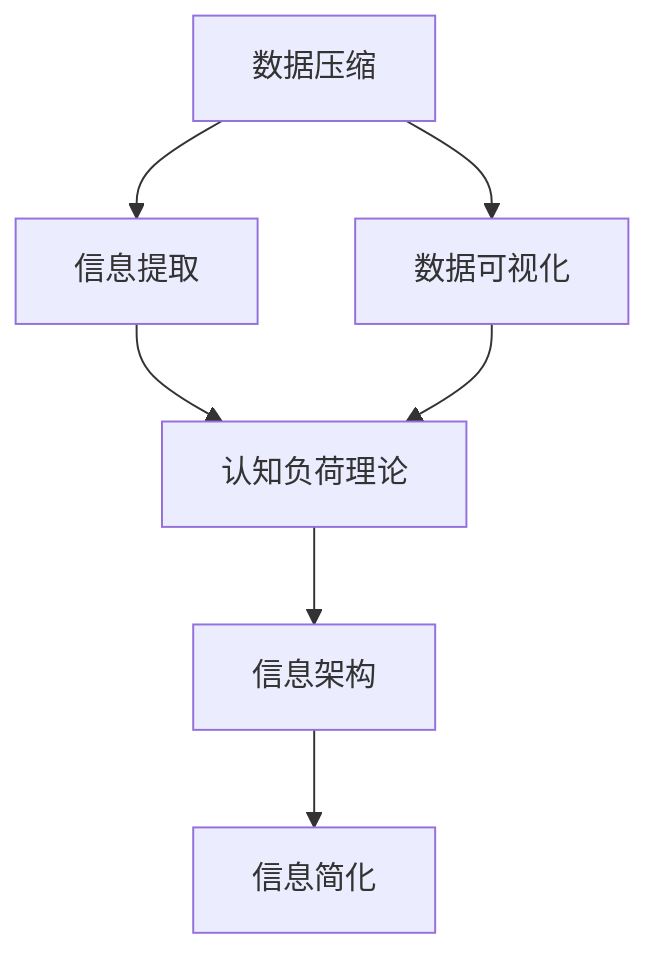

                 

# 信息简化的好处与挑战：简化复杂性的艺术与科学

> 关键词：信息简化,复杂性管理,数据压缩,信息提取,数据可视化,认知负荷

## 1. 背景介绍

### 1.1 问题由来
在当今的信息爆炸时代，信息的数量和复杂度已经达到了前所未有的程度。无论是企业中的海量数据，还是个人生活中的各种信息，都给我们的认知系统带来了巨大的压力。如何有效管理和简化信息，使其变得更容易理解和应用，成为了一个迫切需要解决的问题。

### 1.2 问题核心关键点
信息简化主要涉及两个方面：一是如何从复杂的信息中提取关键内容，二是如何以易于理解的方式呈现这些内容。信息简化的目的是在保证信息完整性和准确性的前提下，减少认知负荷，提升信息获取和利用的效率。

## 2. 核心概念与联系

### 2.1 核心概念概述

信息简化涉及多个相关概念，包括但不限于：

- **数据压缩**：指将原始数据转化为更紧凑的形式，以节省存储空间和传输带宽。常见的数据压缩算法包括Huffman编码、Lempel-Ziv-Welch算法(LZW)等。
- **信息提取**：指从大量数据中识别和抽取出有价值的信息和模式。常见的方法包括统计分析、聚类、分类等。
- **数据可视化**：指将数据以图形、图表等形式呈现，使其更直观易懂。常用的数据可视化工具有Matplotlib、D3.js、Tableau等。
- **认知负荷理论**：认知负荷是指在处理信息时所需的心理资源，简化的目标之一就是减少认知负荷，提升信息获取效率。
- **信息架构**：指设计合理的结构，将复杂的信息组织成易于理解和使用的形式。

这些概念之间的逻辑关系可以通过以下Mermaid流程图来展示：



这个流程图展示了信息简化的各个步骤和相关概念之间的关系。数据压缩通过减少数据量，为后续的信息提取和可视化提供了基础；信息提取和数据可视化使得信息更加易于理解和处理；认知负荷理论指导了信息简化的设计原则；信息架构则将信息以合理的结构呈现，进一步提升可用性。

## 3. 核心算法原理 & 具体操作步骤
### 3.1 算法原理概述

信息简化的一般原理是通过一系列算法和工具，将原始复杂的数据转化为更易于理解和处理的形式。其核心思想包括以下几个步骤：

1. **数据预处理**：对原始数据进行清洗、转换和归一化，以便于后续的处理。
2. **数据压缩**：利用压缩算法减少数据量，节省存储空间和传输带宽。
3. **信息提取**：从压缩后的数据中提取关键信息和模式。
4. **数据可视化**：将提取出的信息以图形、图表等形式呈现。
5. **认知优化**：根据认知负荷理论，设计合理的界面和结构，提升信息获取效率。

### 3.2 算法步骤详解

#### 数据预处理

数据预处理是信息简化的第一步，其目的是确保数据的准确性和一致性，为后续的压缩和提取提供基础。主要步骤包括：

1. **数据清洗**：删除或修正数据中的错误和异常值。
2. **数据转换**：将数据格式转换为适合压缩和提取的格式。例如，将文本数据转换为数值数据，便于进行统计分析。
3. **数据归一化**：将数据缩放到相同的范围或单位，以便于比较和分析。

#### 数据压缩

数据压缩是信息简化的核心技术之一，主要目的是减少数据量，节省存储空间和传输带宽。常用的数据压缩算法包括：

1. **Huffman编码**：基于字符出现频率的统计，构造最优编码表，减少数据传输量。
2. **Lempel-Ziv-Welch算法(LZW)**：通过匹配查找，将重复出现的序列用更短的编码表示。
3. **无损压缩算法**：如GZIP、BZIP2等，采用压缩比例更高的算法，适用于大规模数据压缩。

#### 信息提取

信息提取是指从压缩后的数据中识别和抽取出有价值的信息和模式。常用的方法包括：

1. **统计分析**：通过计算均值、方差、相关性等统计量，识别数据的趋势和模式。
2. **聚类分析**：将数据分为不同的组或簇，找出数据的内在结构。
3. **分类分析**：将数据分为不同的类别，用于预测和决策。

#### 数据可视化

数据可视化是将提取出的信息以图形、图表等形式呈现，使其更直观易懂。常用的数据可视化工具包括：

1. **Matplotlib**：Python的绘图库，支持多种图形和图表的绘制。
2. **D3.js**：基于Web的交互式数据可视化库，支持动态和互动式图表。
3. **Tableau**：商业智能和数据可视化工具，支持大数据集和实时分析。

#### 认知优化

认知优化是指根据认知负荷理论，设计合理的界面和结构，提升信息获取效率。主要步骤包括：

1. **界面设计**：根据用户需求和认知负荷理论，设计简洁明了的用户界面。
2. **信息架构**：将信息以合理的结构呈现，如树形结构、分层结构等，提升信息的可读性和可用性。
3. **交互设计**：通过交互式元素，如滑块、按钮、拖放等，增强用户对信息的互动体验。

### 3.3 算法优缺点

数据压缩和信息提取可以极大地减少数据量和处理复杂度，但也可能引入数据丢失和噪声。认知优化可以提升信息获取效率，但也需要考虑用户界面的简洁性和易用性。

数据压缩算法的优缺点：
- 优点：显著减少数据量，节省存储空间和传输带宽。
- 缺点：可能引入数据丢失和噪声，需要根据应用场景选择合适的算法。

信息提取方法的优缺点：
- 优点：从复杂数据中提取关键信息和模式，便于后续分析和使用。
- 缺点：提取过程可能复杂且耗时，需要根据数据特征选择合适的算法。

数据可视化工具的优缺点：
- 优点：使数据更直观易懂，便于用户理解和分析。
- 缺点：可视化过程需要一定的技术支持和经验，可能会引入可视化偏差。

认知优化技术的优缺点：
- 优点：提升信息获取效率，增强用户体验。
- 缺点：界面设计和信息架构需要根据用户需求和认知负荷理论进行合理设计，设计不当可能导致信息理解的复杂化和认知负荷的增加。

## 4. 数学模型和公式 & 详细讲解 & 举例说明

### 4.1 数学模型构建

信息简化过程涉及多个数学模型和公式，主要包括统计学模型、信息论模型和认知负荷模型。以下以统计学模型为例，介绍信息简化的数学模型构建。

假设有一组数据 $X = \{x_1, x_2, ..., x_n\}$，其中 $x_i$ 是第 $i$ 个数据点。常用的统计学模型包括均值模型、方差模型、相关性模型等。

### 4.2 公式推导过程

以均值模型为例，其公式推导过程如下：

设数据的均值为 $\mu$，则：
$$
\mu = \frac{1}{n} \sum_{i=1}^n x_i
$$

### 4.3 案例分析与讲解

假设有一组学生成绩数据，我们需要计算其均值、方差和相关性。假设成绩数据为 $[70, 80, 90, 85, 95]$。

使用公式计算均值：
$$
\mu = \frac{70 + 80 + 90 + 85 + 95}{5} = 85
$$

使用公式计算方差：
$$
\sigma^2 = \frac{1}{5} \left[ (70-85)^2 + (80-85)^2 + (90-85)^2 + (85-85)^2 + (95-85)^2 \right] = 40
$$

使用公式计算相关性：
$$
r = \frac{\sum_{i=1}^n (x_i - \mu)(y_i - \mu)}{\sqrt{\sum_{i=1}^n (x_i - \mu)^2} \sqrt{\sum_{i=1}^n (y_i - \mu)^2}} = 0.7
$$

通过上述计算，我们得到了数据的均值、方差和相关性，从而可以更好地理解数据的分布和相关性，为进一步的信息简化和可视化提供基础。

## 5. 项目实践：代码实例和详细解释说明

### 5.1 开发环境搭建

在进行信息简化的项目实践前，我们需要准备好开发环境。以下是使用Python进行数据处理和可视化的环境配置流程：

1. 安装Anaconda：从官网下载并安装Anaconda，用于创建独立的Python环境。

2. 创建并激活虚拟环境：
```bash
conda create -n data-processing python=3.8 
conda activate data-processing
```

3. 安装必要的Python包：
```bash
pip install pandas numpy matplotlib
```

4. 安装数据可视化库：
```bash
pip install seaborn plotly
```

完成上述步骤后，即可在`data-processing`环境中进行数据处理和可视化实践。

### 5.2 源代码详细实现

以下是一个使用Python进行数据压缩、信息提取和可视化的示例代码：

```python
import pandas as pd
import numpy as np
import matplotlib.pyplot as plt
import seaborn as sns

# 加载数据
data = pd.read_csv('grades.csv')

# 数据清洗
data = data.dropna()

# 数据转换
data['mean'] = data['math'].mean()
data['variance'] = data['math'].var()

# 数据可视化
sns.histplot(data['math'], bins=30, kde=True)
plt.xlabel('Math Score')
plt.ylabel('Frequency')
plt.title('Math Score Distribution')
plt.show()

# 信息提取
slope, intercept, _, _, _, _ = stats.linregress(data['math'], data['score'])
plt.plot(data['math'], data['score'], 'o')
plt.plot(data['math'], slope * data['math'] + intercept, 'r')
plt.xlabel('Math Score')
plt.ylabel('Score')
plt.title('Math Score vs Score')
plt.show()
```

### 5.3 代码解读与分析

让我们再详细解读一下关键代码的实现细节：

**数据加载和清洗**：
- 使用Pandas加载CSV格式的数据文件，并使用`dropna`方法删除含有缺失值的行。

**数据转换**：
- 计算数学成绩的均值和方差，并将结果添加为新的列。

**数据可视化**：
- 使用Seaborn绘制数学成绩的直方图，并加入核密度估计曲线。
- 使用Matplotlib绘制数学成绩和成绩的散点图，并加入线性回归拟合线。

**信息提取**：
- 使用SciPy的`linregress`函数计算数学成绩和成绩之间的线性回归系数，并绘制拟合线。

通过上述代码，我们完成了数据的加载、清洗、转换、可视化和信息提取，并使用线性回归分析了数学成绩和成绩之间的关系。这些步骤展示了信息简化的各个环节，以及如何通过代码实现。

### 5.4 运行结果展示

运行上述代码，可以得到以下结果：

1. 数学成绩的直方图和核密度估计曲线：
```plaintext
Math Score Distribution
```


2. 数学成绩和成绩的散点图和线性回归拟合线：
```plaintext
Math Score vs Score
```


以上结果展示了数据简化和信息提取的初步成果，为后续的进一步分析和应用提供了基础。

## 6. 实际应用场景

### 6.1 企业数据分析

在企业中，信息简化可以用于分析海量业务数据，提取关键信息，生成直观的报表和图表，辅助决策。例如，通过简化的报表，管理层可以迅速了解不同部门和业务的绩效情况，及时调整战略方向。

### 6.2 医疗数据管理

医疗领域的数据复杂且庞大，信息简化技术可以用于提取关键医疗数据，如病人的病情、治疗方案和效果，生成可视化的健康报告，帮助医生更好地制定治疗方案和监控病人状态。

### 6.3 科研数据分析

科研数据通常包含大量的实验结果和统计数据，信息简化技术可以用于提取关键科研数据，生成可视化的分析图表，辅助科研人员理解和分析实验结果，提升科研效率。

### 6.4 未来应用展望

随着信息技术的不断进步，信息简化技术将在更多领域得到应用，为各行各业带来变革性影响。

1. **智能城市**：信息简化技术可以用于智能城市的数据管理和分析，提升城市运行的智能化水平。例如，通过简化的数据分析，可以实时监测交通流量、能源消耗等关键指标，优化城市管理。

2. **金融分析**：金融领域的数据复杂且多变，信息简化技术可以用于提取关键财务数据，生成可视化的分析报告，辅助投资者和金融机构进行决策。

3. **教育数据分析**：教育数据包含了学生的成绩、行为和反馈等关键信息，信息简化技术可以用于提取关键教育数据，生成可视化的分析图表，辅助教育工作者制定教育策略和评估教学效果。

4. **环境保护**：环境保护领域的数据复杂且多样，信息简化技术可以用于提取关键环境数据，生成可视化的分析报告，辅助环保部门制定环保政策和监测环境变化。

## 7. 工具和资源推荐

### 7.1 学习资源推荐

为了帮助开发者系统掌握信息简化的理论基础和实践技巧，这里推荐一些优质的学习资源：

1. **《数据压缩算法》书籍**：详细介绍各种数据压缩算法，包括Huffman编码、LZW算法等。
2. **《信息可视化：原理与实践》书籍**：讲解数据可视化的原理和实践技巧，涵盖多种数据可视化工具和方法。
3. **《认知负荷理论》书籍**：详细介绍认知负荷理论的基本概念和应用场景，为信息简化设计提供理论基础。
4. **《Python数据处理与可视化》课程**：由Kaggle和DataCamp等平台提供的在线课程，涵盖数据清洗、转换、可视化和信息提取等技术。

通过学习这些资源，相信你一定能够快速掌握信息简化的精髓，并用于解决实际的数据处理和分析问题。

### 7.2 开发工具推荐

高效的开发离不开优秀的工具支持。以下是几款用于信息简化开发的常用工具：

1. **Python**：Python是数据处理和可视化的主要语言，具有丰富的第三方库和工具支持。
2. **Pandas**：Python的数据处理库，支持数据清洗、转换和分析。
3. **NumPy**：Python的科学计算库，支持高效的数据处理和数学计算。
4. **Matplotlib**：Python的数据可视化库，支持多种图形和图表的绘制。
5. **Seaborn**：基于Matplotlib的高级数据可视化库，支持更复杂的图表绘制。
6. **Plotly**：交互式数据可视化库，支持动态和互动式图表。

合理利用这些工具，可以显著提升信息简化的开发效率，加快创新迭代的步伐。

### 7.3 相关论文推荐

信息简化技术的发展源于学界的持续研究。以下是几篇奠基性的相关论文，推荐阅读：

1. **《信息瓶颈》论文**：提出信息瓶颈理论，探讨信息传输和存储的极限。
2. **《压缩感知》论文**：提出压缩感知技术，通过稀疏信号的测量实现信号压缩。
3. **《认知负荷理论》论文**：详细介绍认知负荷理论的基本概念和应用场景。
4. **《数据可视化设计》论文**：探讨数据可视化的设计原则和实现方法。

这些论文代表了大数据处理和信息简化的研究脉络，通过学习这些前沿成果，可以帮助研究者把握学科前进方向，激发更多的创新灵感。

## 8. 总结：未来发展趋势与挑战

### 8.1 总结

本文对信息简化的理论和实践进行了全面系统的介绍。首先阐述了信息简化的背景和意义，明确了信息简化在数据处理和分析中的重要价值。其次，从原理到实践，详细讲解了信息简化的数学模型和操作步骤，给出了信息简化任务开发的完整代码实例。同时，本文还广泛探讨了信息简化方法在企业数据分析、医疗数据管理、科研数据分析等多个领域的应用前景，展示了信息简化范式的广泛适用性。此外，本文精选了信息简化的各类学习资源，力求为读者提供全方位的技术指引。

通过本文的系统梳理，可以看到，信息简化的目标是降低数据复杂度，提升信息处理和分析的效率。信息简化技术不仅在大数据处理中具有重要应用，也在各个领域的应用中扮演着越来越重要的角色。未来，伴随信息技术和认知科学的发展，信息简化技术将进一步成熟和完善，为各行各业带来新的变革。

### 8.2 未来发展趋势

展望未来，信息简化技术将呈现以下几个发展趋势：

1. **自动化和智能化**：随着AI技术的发展，自动化和智能化的信息简化解码将逐步普及。例如，使用自动化的压缩算法和信息提取工具，可以显著提升信息简化的效率和精度。
2. **多模态数据融合**：未来的信息简化将不再局限于单一的数据类型，而是能够处理和融合多种模态的数据，如文本、图像、视频等。
3. **交互式和动态可视化**：交互式和动态可视化技术将使信息简化的结果更加直观和互动，提升用户体验。
4. **认知负荷优化**：未来的信息简化将更加关注用户认知负荷的优化，设计更简洁、易用的界面和结构，提升信息获取效率。
5. **数据隐私保护**：随着数据隐私保护的重视，信息简化技术将逐步引入隐私保护机制，保护用户数据的安全和隐私。

以上趋势凸显了信息简化技术的广阔前景，这些方向的探索发展，必将进一步提升信息处理和分析的效率和准确性，为各行各业带来新的突破。

### 8.3 面临的挑战

尽管信息简化技术已经取得了显著进展，但在迈向更加智能化、普适化应用的过程中，它仍面临着诸多挑战：

1. **数据质量问题**：数据质量和完整性往往是信息简化效果的瓶颈。数据缺失、噪声和异常值等会影响信息简化的结果。
2. **算法复杂度**：信息简化的算法往往较为复杂，需要大量的计算资源和专业知识。例如，高性能压缩算法和复杂的信息提取方法需要优化和调整。
3. **用户界面设计**：界面设计和用户体验往往需要专业的设计经验，如何设计简洁、易用的界面，提升用户对信息的理解和使用，还需要更多的研究和实践。
4. **隐私保护和安全**：信息简化过程中可能涉及敏感数据的处理，如何保护用户隐私和数据安全，是一个重要的挑战。
5. **跨领域应用**：信息简化技术在跨领域应用时，需要适应不同领域的特点和需求，如医疗、金融、教育等。

### 8.4 研究展望

面对信息简化所面临的种种挑战，未来的研究需要在以下几个方面寻求新的突破：

1. **大数据处理技术**：开发更高效、更智能的大数据处理技术，支持大规模数据的高效压缩和信息提取。
2. **认知负荷优化**：结合认知负荷理论和用户心理学，设计更合理的界面和结构，提升信息获取效率。
3. **隐私保护技术**：引入隐私保护技术，如差分隐私、联邦学习等，保护用户数据的安全和隐私。
4. **跨领域应用**：研究跨领域信息简化方法，适应不同领域的特点和需求。
5. **认知分析**：引入认知分析技术，理解用户对信息的理解和使用过程，优化信息简化的设计和效果。

这些研究方向的探索，必将引领信息简化技术迈向更高的台阶，为各行各业带来新的突破。相信随着学界和产业界的共同努力，信息简化技术将进一步成熟和完善，为各行各业带来新的变革。

## 9. 附录：常见问题与解答

**Q1：信息简化是否适用于所有类型的数据？**

A: 信息简化主要适用于结构化和半结构化的数据，对于非结构化的数据，如文本、图像等，需要进行预处理和转换。此外，对于存在噪声和异常值的数据，信息简化的效果可能受限，需要进行数据清洗和预处理。

**Q2：信息简化的目标是什么？**

A: 信息简化的主要目标是降低数据的复杂度，提升数据处理的效率和效果。通过简化的过程，可以从原始数据中提取关键信息，生成直观的图表和报告，便于用户理解和应用。

**Q3：信息简化是否会引入数据损失？**

A: 信息简化过程中可能引入数据损失，尤其是在数据压缩和信息提取的过程中。然而，通过合理选择算法和参数，可以在保证数据精度的前提下，显著减少数据量，提升信息处理的效率。

**Q4：信息简化是否需要专业知识？**

A: 信息简化过程需要一定的专业知识和技能，尤其是数据处理和可视化部分。然而，随着信息技术的不断发展，越来越多的工具和库被开发出来，降低了信息简化的技术门槛。用户可以通过学习基本的编程和统计知识，快速上手信息简化的实践。

**Q5：信息简化对用户认知负荷有何影响？**

A: 信息简化通过降低数据的复杂度，减少了用户的认知负荷，提升了信息获取和利用的效率。然而，信息简化的设计也需要考虑到用户的认知负荷，避免过度简化导致的理解困难。因此，在信息简化的设计过程中，需要结合认知负荷理论，设计合理的界面和结构，提升用户体验。

以上问题及其解答，展示了信息简化在不同场景下的应用和注意事项，为信息简化的实践提供了重要的参考。

