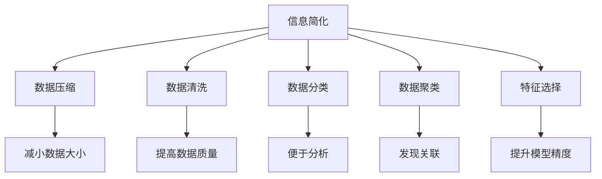

                 

# 信息简化的好处与艺术：在复杂世界中简化以提高生活质量

> 关键词：信息简化, 数据压缩, 人工智能, 大数据, 复杂系统

## 1. 背景介绍

### 1.1 问题由来
随着信息技术的高速发展，人类社会的信息量呈指数级增长。数据无处不在，数据驱动决策成为常态，“大数据”已经成为信息时代的重要特征。然而，数据量的大幅增长并不等同于数据价值的提升。庞大的数据海洋中，含有大量冗余信息和噪音，使得数据的有效利用变得困难。与此同时，复杂系统中隐藏着众多关联和规律，若缺乏有效的简化处理手段，则无法充分利用数据带来的价值。

### 1.2 问题核心关键点
本文聚焦于信息简化的艺术，在复杂世界中，如何通过合理的简化手段提高信息的质量和效率，以提升生活质量。信息简化不仅是数据科学的核心任务，也是复杂系统分析的重要方法。它包括对数据的压缩、清洗、归类、分析和解释，以及通过算法简化模型的过程。通过简化，可以减少数据的冗余，降低系统复杂性，使信息更加易于理解和处理。

### 1.3 问题研究意义
简化信息的方法与技术在许多领域中都有着重要的应用。从医学诊断、金融风险评估、智能推荐系统，到交通优化、供应链管理，信息简化都在发挥着重要作用。通过有效的简化，可以帮助决策者更好地理解和利用数据，提升决策的准确性和效率。同时，在保持信息完整性和准确性的前提下，简化信息也有助于降低计算资源需求，减少系统开发和维护成本，从而提高生活质量。

## 2. 核心概念与联系

### 2.1 核心概念概述

为更好地理解信息简化的艺术，本节将介绍几个密切相关的核心概念：

- **信息简化(Information Simplification)**：指通过删除冗余、过滤噪音、重构表示等手段，将复杂的信息系统转化为更易于理解、处理和应用的形式。
- **数据压缩(Data Compression)**：将数据按照一定的规则进行变换，以达到减小数据大小的目的。常见的数据压缩算法包括霍夫曼编码、LZW、Lempel-Ziv-Welch等。
- **数据清洗(Data Cleaning)**：去除数据中的错误、异常和无用信息，保证数据的质量和完整性。
- **数据分类(Data Classification)**：根据一定的规则将数据划分为不同的类别，便于后续分析和应用。
- **数据聚类(Clustering)**：通过算法将数据分组，寻找数据间的内在关联和相似性。常见的聚类算法包括K-Means、层次聚类、密度聚类等。
- **特征选择(Feature Selection)**：从原始数据中选择最有代表性的特征，去除无关的特征，以提高模型的预测精度和训练速度。

这些核心概念之间的逻辑关系可以通过以下Mermaid流程图来展示：



这个流程图展示了几项关键的信息简化技术及其作用：

1. 数据压缩用于减小数据大小，方便存储和传输。
2. 数据清洗用于提高数据质量，确保数据的真实性和完整性。
3. 数据分类和聚类用于发现数据间的内在关联，便于后续处理。
4. 特征选择用于去除冗余特征，提升模型性能。

## 3. 核心算法原理 & 具体操作步骤

### 3.1 算法原理概述

信息简化技术主要包括以下几个步骤：

1. **数据预处理**：包括数据清洗和转换，去除错误和冗余数据，确保数据的质量和一致性。
2. **特征工程**：从原始数据中提取和选择特征，以提高模型的泛化能力。
3. **模型训练**：使用简化后的数据训练模型，以便进行预测或分类。
4. **结果后处理**：根据模型输出进行后处理，如去噪、解码、分类等，得到最终结果。

这些步骤通常使用多种算法和技术来实现，包括但不限于：

- 统计方法：均值、方差、标准差等用于描述数据分布的统计量。
- 机器学习方法：决策树、支持向量机、随机森林、神经网络等算法。
- 自然语言处理：TF-IDF、LDA、BERT等模型。
- 图像处理：卷积神经网络、特征提取算法等。

### 3.2 算法步骤详解

以下详细解释了信息简化的每个步骤：

**Step 1: 数据预处理**
- 收集原始数据：从数据源中获取数据，包括结构化和非结构化数据。
- 数据清洗：使用Python中的Pandas库进行数据清洗，包括删除缺失值、去重、处理异常值等。
- 数据转换：使用Scikit-Learn中的预处理模块，对数据进行归一化、标准化等操作，保证数据的一致性。

**Step 2: 特征工程**
- 特征选择：使用Python中的Feature工程模块，通过相关系数、卡方检验等方法选择最有代表性的特征。
- 特征提取：使用自然语言处理工具进行词袋模型、TF-IDF等特征提取。
- 特征转换：使用K-means等聚类算法进行特征降维。

**Step 3: 模型训练**
- 模型选择：根据数据类型和任务需求，选择合适的机器学习模型。
- 模型训练：使用简化后的特征数据进行模型训练，如使用Python中的Scikit-Learn库。
- 模型评估：使用交叉验证、混淆矩阵等方法评估模型性能，确保模型的泛化能力。

**Step 4: 结果后处理**
- 结果解码：对模型输出进行解码，如将预测结果转化为标签、文本等形式。
- 结果分类：对预测结果进行分类，得到最终的结果。
- 结果可视化：使用Matplotlib、Seaborn等工具进行结果可视化，便于理解和分析。

### 3.3 算法优缺点

信息简化的优势在于：
1. **提高数据处理效率**：通过简化数据，可以减小数据存储和传输的规模，提高数据处理的效率。
2. **降低复杂度**：减少数据量，降低系统复杂性，使系统更易于理解和维护。
3. **提升决策质量**：通过特征选择和模型训练，可以提高决策的准确性和可靠性。

同时，信息简化也存在一定的局限性：
1. **信息损失**：在简化过程中，可能损失一些重要的信息，影响决策的准确性。
2. **计算开销**：复杂的数据处理和模型训练需要较高的计算资源和时间。
3. **模型依赖**：简化过程依赖于算法和模型，不同算法和模型可能对简化效果产生影响。

### 3.4 算法应用领域

信息简化的技术已经广泛应用于各个领域，具体包括：

- **医疗诊断**：通过数据清洗和特征提取，简化病历数据，提高诊断的准确性和效率。
- **金融风险评估**：通过数据压缩和模型训练，简化金融数据，评估投资风险。
- **智能推荐系统**：通过特征选择和模型训练，简化用户行为数据，提高推荐精度。
- **交通优化**：通过数据分类和模型训练，简化交通数据，优化路线规划。
- **供应链管理**：通过数据聚类和特征选择，简化供应链数据，优化库存和物流管理。

除了上述这些经典应用外，信息简化还在更多领域得到应用，如智慧城市、智能制造、智慧农业等，为各行各业带来了新一轮的技术变革。

## 4. 数学模型和公式 & 详细讲解 & 举例说明

### 4.1 数学模型构建

本节将使用数学语言对信息简化的过程进行更加严格的刻画。

记原始数据集为 $D=\{(x_i,y_i)\}_{i=1}^N$，其中 $x_i \in \mathbb{R}^n$ 表示原始特征向量， $y_i \in \{0,1\}$ 表示标签。简化后的数据集为 $\hat{D}=\{(\hat{x}_i,y_i)\}_{i=1}^N$，其中 $\hat{x}_i$ 表示简化后的特征向量。

定义简化过程的损失函数为 $\ell(\hat{D})$，目标是最小化该损失函数：

$$
\min_{\hat{D}} \ell(\hat{D}) = \min_{\hat{D}} \frac{1}{N} \sum_{i=1}^N \ell(\hat{x}_i,y_i)
$$

其中 $\ell(\hat{x}_i,y_i)$ 表示模型在简化后的数据上的损失函数，如均方误差、交叉熵等。

### 4.2 公式推导过程

以下我们以均方误差为例，推导简化过程的损失函数及其梯度。

假设原始数据 $D$ 经过数据清洗和特征选择后，得到简化数据 $\hat{D}$。原始模型为 $f(x) \in \mathbb{R}$，简化后的模型为 $g(\hat{x}) \in \mathbb{R}$。则简化过程的损失函数为：

$$
\ell(\hat{D}) = \frac{1}{N} \sum_{i=1}^N (y_i - g(\hat{x}_i))^2
$$

将其代入简化目标，得：

$$
\min_{\hat{D}} \ell(\hat{D}) = \min_{\hat{D}} \frac{1}{N} \sum_{i=1}^N (y_i - g(\hat{x}_i))^2
$$

根据梯度下降算法，优化目标的梯度为：

$$
\frac{\partial \ell(\hat{D})}{\partial \hat{x}_i} = -\frac{2}{N} \sum_{i=1}^N (y_i - g(\hat{x}_i)) (y_i - g(\hat{x}_i))' \frac{\partial g(\hat{x}_i)}{\partial \hat{x}_i}
$$

其中 $(y_i - g(\hat{x}_i))'$ 表示预测误差。

在得到损失函数的梯度后，即可带入优化算法，完成简化过程的迭代优化。重复上述过程直至收敛，最终得到简化后的数据集 $\hat{D}$。

### 4.3 案例分析与讲解

考虑一个包含10个特征的房价数据集。原始数据集 $D$ 包含5000个样本，每个样本有10个特征 $x_i \in \mathbb{R}^{10}$。现在需要简化数据集，保留其中的3个特征。具体步骤如下：

1. **数据预处理**：使用Python中的Pandas库对原始数据进行清洗，删除缺失值和异常值。
2. **特征选择**：使用相关性分析方法，选择与房价高度相关的3个特征 $x_1, x_4, x_9$。
3. **数据转换**：将选择的3个特征进行标准化，得到简化后的特征向量 $\hat{x}_i \in \mathbb{R}^{3}$。
4. **模型训练**：使用简化后的特征数据进行线性回归训练，得到简化模型 $g(\hat{x}) = \theta^T\hat{x} + b$。
5. **结果后处理**：将简化模型应用于新的数据，得到预测结果。

## 5. 项目实践：代码实例和详细解释说明

### 5.1 开发环境搭建

在进行信息简化项目开发前，我们需要准备好开发环境。以下是使用Python进行Scikit-Learn开发的环境配置流程：

1. 安装Anaconda：从官网下载并安装Anaconda，用于创建独立的Python环境。

2. 创建并激活虚拟环境：
```bash
conda create -n sklearn-env python=3.8 
conda activate sklearn-env
```

3. 安装Scikit-Learn：
```bash
conda install scikit-learn
```

4. 安装各类工具包：
```bash
pip install numpy pandas matplotlib seaborn jupyter notebook ipython
```

完成上述步骤后，即可在`sklearn-env`环境中开始信息简化的实践。

### 5.2 源代码详细实现

我们以房价数据集为示例，展示信息简化的代码实现。

首先，定义数据处理函数：

```python
import pandas as pd
import numpy as np
from sklearn.preprocessing import StandardScaler
from sklearn.feature_selection import SelectKBest, f_regression

def load_data():
    # 加载数据
    data = pd.read_csv('house_prices.csv')
    features = data.drop('price', axis=1)
    labels = data['price']
    return features, labels

def data_cleaning(features, labels):
    # 数据清洗
    features.fillna(features.mean(), inplace=True)
    features.dropna(inplace=True)
    labels.fillna(labels.mean(), inplace=True)
    return features, labels

def feature_selection(features, labels):
    # 特征选择
    selector = SelectKBest(f_regression, k=3)
    selected_features = selector.fit_transform(features, labels)
    return selected_features

def data_standardization(features):
    # 数据标准化
    scaler = StandardScaler()
    scaled_features = scaler.fit_transform(features)
    return scaled_features

def model_training(scaled_features, labels):
    # 模型训练
    from sklearn.linear_model import LinearRegression
    model = LinearRegression()
    model.fit(scaled_features, labels)
    return model

def result_postprocessing(model, new_data):
    # 结果后处理
    scaled_new_data = data_standardization(new_data)
    predictions = model.predict(scaled_new_data)
    return predictions
```

然后，定义测试函数：

```python
def test():
    # 加载数据
    features, labels = load_data()
    
    # 数据清洗
    features, labels = data_cleaning(features, labels)
    
    # 特征选择
    selected_features = feature_selection(features, labels)
    
    # 数据标准化
    scaled_features = data_standardization(selected_features)
    
    # 模型训练
    model = model_training(scaled_features, labels)
    
    # 结果后处理
    new_data = np.array([[2500, 3000, 2.5]])
    predictions = result_postprocessing(model, new_data)
    
    # 打印预测结果
    print(predictions)
```

最后，启动信息简化流程并在测试数据上评估：

```python
test()
```

以上就是使用Scikit-Learn对房价数据集进行信息简化的完整代码实现。可以看到，通过Python的Scikit-Learn库，信息简化的流程变得简洁高效。

### 5.3 代码解读与分析

让我们再详细解读一下关键代码的实现细节：

**load_data函数**：
- 使用Pandas库加载数据集，并将特征和标签分开。

**data_cleaning函数**：
- 使用Pandas库的fillna方法删除缺失值，使用dropna方法删除包含缺失值的行，确保数据完整性。

**feature_selection函数**：
- 使用Scikit-Learn库的SelectKBest方法和f_regression选择与标签相关性最高的特征，保留其中的前3个特征。

**data_standardization函数**：
- 使用Scikit-Learn库的StandardScaler进行数据标准化，即将数据缩放到均值为0，标准差为1。

**model_training函数**：
- 使用Scikit-Learn库的LinearRegression模型进行训练。

**result_postprocessing函数**：
- 将简化后的特征数据传入训练好的模型，进行预测。

**test函数**：
- 从数据加载开始，依次进行数据清洗、特征选择、数据标准化、模型训练和结果后处理，最后输出预测结果。

## 6. 实际应用场景

### 6.1 智能推荐系统

基于信息简化的智能推荐系统，可以根据用户行为数据和商品属性信息，进行特征选择和模型训练，生成个性化的推荐结果。信息简化技术在此过程中起到了关键作用：

1. **数据清洗**：去除用户的无效行为数据，去除商品的属性噪声，保证数据质量。
2. **特征选择**：选择与推荐结果高度相关的特征，提高模型的预测精度。
3. **模型训练**：使用简化后的数据训练推荐模型，如协同过滤、内容推荐等。
4. **结果后处理**：对模型输出进行去噪和解码，生成最终推荐结果。

通过信息简化，推荐系统能够更高效地处理用户行为数据，提供更加个性化和精准的推荐。

### 6.2 金融风险评估

金融风险评估系统需要处理大量的金融数据，通过信息简化技术，可以提高数据处理效率和模型性能：

1. **数据清洗**：去除异常值和错误数据，确保数据的真实性和完整性。
2. **特征选择**：选择与风险评估高度相关的特征，如股票价格、财务指标等。
3. **数据压缩**：使用数据压缩技术，减小数据存储和传输的规模。
4. **模型训练**：使用简化后的数据训练风险评估模型，如逻辑回归、支持向量机等。
5. **结果后处理**：根据模型输出进行风险分类，生成最终的评估报告。

通过信息简化，金融风险评估系统能够更准确地评估投资风险，保护投资者利益。

### 6.3 智慧医疗

在智慧医疗领域，信息简化技术可以用于病历数据的处理和分析，提高诊断和治疗的效率：

1. **数据清洗**：去除病历数据中的无用信息，确保数据的准确性。
2. **特征选择**：选择与诊断和治疗高度相关的特征，如病史、症状、检查结果等。
3. **数据分类**：使用数据分类技术，对疾病进行分类，便于后续治疗。
4. **模型训练**：使用简化后的数据训练诊断模型，如决策树、随机森林等。
5. **结果后处理**：对模型输出进行解释和分类，生成诊断和治疗方案。

通过信息简化，智慧医疗系统能够更高效地处理病历数据，提供更准确的诊断和治疗方案。

### 6.4 未来应用展望

随着信息简化技术的不断发展，未来在以下方面将有更广泛的应用：

1. **自动驾驶**：通过信息简化，可以处理传感器数据，提高车辆的安全性和驾驶效率。
2. **智慧城市**：通过信息简化，可以处理大量的交通、环境数据，优化城市管理。
3. **农业智能**：通过信息简化，可以处理农业数据，提高农作物产量和质量。
4. **教育智能**：通过信息简化，可以处理教育数据，提高教学质量和个性化教育效果。

总之，信息简化技术在多个领域都有着广阔的应用前景，将成为信息时代的重要支撑。未来，随着技术的不断进步，信息简化将成为提升生活质量的重要手段。

## 7. 工具和资源推荐

### 7.1 学习资源推荐

为了帮助开发者系统掌握信息简化的技术，这里推荐一些优质的学习资源：

1. **《Python数据科学手册》**：吴恩达教授所著，全面介绍了Python在数据科学中的应用，包括数据清洗、特征选择、模型训练等。
2. **《统计学习方法》**：李航教授所著，介绍了机器学习的基础知识和常用算法。
3. **《深度学习》**：Ian Goodfellow等著，介绍了深度学习的基础知识和最新进展。
4. **Coursera《机器学习》课程**：吴恩达教授所开设的机器学习课程，涵盖数据清洗、特征工程、模型训练等。
5. **Kaggle**：数据科学竞赛平台，提供丰富的数据集和竞赛任务，可以用于学习和实践信息简化技术。

通过对这些资源的学习实践，相信你一定能够快速掌握信息简化的精髓，并用于解决实际的数据处理问题。

### 7.2 开发工具推荐

高效的开发离不开优秀的工具支持。以下是几款用于信息简化开发的常用工具：

1. **Pandas**：Python中的数据处理库，提供了丰富的数据清洗和转换功能。
2. **Scikit-Learn**：Python中的机器学习库，提供了常用的数据预处理、特征工程、模型训练等功能。
3. **TensorFlow**：由Google主导的深度学习框架，提供了高效的模型训练和推理功能。
4. **Matplotlib**：Python中的绘图库，用于可视化结果。
5. **Seaborn**：基于Matplotlib的高级绘图库，用于更高级的可视化。

合理利用这些工具，可以显著提升信息简化的开发效率，加快创新迭代的步伐。

### 7.3 相关论文推荐

信息简化的研究源于学界的持续研究。以下是几篇奠基性的相关论文，推荐阅读：

1. **《特征选择》**：Tibshirani等著，介绍了特征选择的基本方法和算法。
2. **《K-means算法》**：MacQueen等著，介绍了聚类算法的原理和实现。
3. **《决策树》**：Breiman等著，介绍了决策树的原理和应用。
4. **《随机森林》**：Breiman等著，介绍了随机森林的原理和应用。
5. **《线性回归》**：Hoerl等著，介绍了线性回归的原理和应用。

这些论文代表了大数据处理领域的研究进展，通过学习这些前沿成果，可以帮助研究者把握学科前进方向，激发更多的创新灵感。

## 8. 总结：未来发展趋势与挑战

### 8.1 总结

本文对信息简化的艺术进行了全面系统的介绍。首先阐述了信息简化的背景和意义，明确了信息简化在复杂系统中简化数据、提升决策质量的重要作用。其次，从原理到实践，详细讲解了信息简化的数学模型和操作步骤，给出了信息简化的完整代码实例。同时，本文还广泛探讨了信息简化技术在多个领域的应用，展示了信息简化的广阔前景。

通过本文的系统梳理，可以看到，信息简化技术已经成为复杂系统中不可或缺的重要手段，显著提升了数据处理的效率和决策的准确性。未来，随着技术的不断进步，信息简化将成为推动各行各业数字化转型的重要技术手段。

### 8.2 未来发展趋势

展望未来，信息简化的技术将呈现以下几个发展趋势：

1. **自动化和智能化**：随着人工智能技术的发展，信息简化的自动化和智能化水平将不断提高，能够自动选择最优的特征和模型。
2. **多模态数据处理**：未来的信息简化技术将处理更多类型的复杂数据，如文本、图像、音频等，实现多模态数据的协同处理。
3. **大数据处理**：未来的信息简化技术将处理更大规模的数据，并能在分布式计算环境中进行高效处理。
4. **实时处理**：未来的信息简化技术将实现实时数据处理，满足实时数据流的处理需求。
5. **边缘计算**：未来的信息简化技术将更多地部署在边缘设备上，实现本地化数据处理，降低延迟和带宽成本。

以上趋势凸显了信息简化的强大潜力，将在各个领域中得到广泛应用，进一步推动人类社会的信息化和智能化进程。

### 8.3 面临的挑战

尽管信息简化技术已经取得了显著成果，但在迈向更加智能化、普适化应用的过程中，仍面临诸多挑战：

1. **数据隐私和安全**：简化过程中涉及大量数据的处理和传输，如何保护用户隐私和安全，防止数据泄露，是一个重要挑战。
2. **数据偏见和公平性**：简化过程中可能会引入数据偏见，影响模型的公平性和公正性。
3. **计算资源消耗**：简化过程中需要大量的计算资源，如何优化算法，降低计算开销，是一个重要挑战。
4. **模型可解释性**：简化过程使用的算法和模型较为复杂，如何提高模型的可解释性，是一个重要挑战。
5. **跨领域应用**：简化过程需要根据不同领域的特点进行优化，如何实现跨领域的通用化处理，是一个重要挑战。

正视信息简化面临的这些挑战，积极应对并寻求突破，将是信息简化技术迈向成熟的必由之路。相信随着学界和产业界的共同努力，这些挑战终将一一被克服，信息简化技术必将在构建智能系统、提升生活质量方面发挥更大的作用。

### 8.4 研究展望

面对信息简化所面临的种种挑战，未来的研究需要在以下几个方面寻求新的突破：

1. **自动化的特征选择算法**：开发更加自动化的特征选择算法，实现特征选择的智能化和自动化。
2. **多模态数据融合技术**：开发能够处理多模态数据的融合算法，实现多模态数据的协同处理和分析。
3. **跨领域的通用化处理**：开发跨领域的通用化处理方法，实现信息简化的跨领域应用。
4. **数据隐私和安全技术**：开发数据隐私和安全技术，保护用户隐私和安全，防止数据泄露。
5. **可解释的机器学习模型**：开发可解释的机器学习模型，提高模型的可解释性和透明性。

这些研究方向将引领信息简化技术迈向更高的台阶，为构建安全、可靠、可解释、可控的智能系统铺平道路。面向未来，信息简化技术还需要与其他人工智能技术进行更深入的融合，如知识表示、因果推理、强化学习等，多路径协同发力，共同推动智能技术的发展。

## 9. 附录：常见问题与解答

**Q1：信息简化是否会导致信息丢失？**

A: 信息简化可能会导致一定量的信息丢失，但通过合理选择简化方法，可以尽量减少信息丢失的影响。例如，使用特征选择算法选择与任务相关的特征，保留重要信息。同时，信息简化也可以通过增加标注数据和改进模型训练来弥补信息损失。

**Q2：信息简化是否会对计算资源产生影响？**

A: 信息简化需要对原始数据进行预处理和特征选择，这些过程可能需要较高的计算资源。但通过优化算法和并行计算，可以有效降低计算开销。例如，使用Scikit-Learn库进行特征选择和模型训练，可以大幅降低计算资源消耗。

**Q3：如何避免数据偏见？**

A: 数据偏见是信息简化过程中常见的问题。可以通过以下方法避免数据偏见：
1. 使用多样化的数据集进行训练，避免单一数据集的偏见影响。
2. 使用正则化技术，如L2正则、Dropout等，避免过拟合和模型复杂度过高导致的偏见。
3. 使用公平性算法，如FPR（Fairness-aware Proximal Regularization）等，确保模型在不同群体上的公平性。

**Q4：如何提高信息简化的效率？**

A: 提高信息简化的效率可以通过以下方法：
1. 优化算法和模型，减少计算开销。例如，使用TensorFlow的分布式训练和GPU加速，提高模型训练速度。
2. 使用数据并行和模型并行技术，在分布式系统中实现高效的数据处理和模型训练。
3. 采用增量学习技术，在已有模型的基础上，使用新数据进行增量更新，提高信息简化的效率。

**Q5：如何保护数据隐私和安全？**

A: 保护数据隐私和安全可以通过以下方法：
1. 使用数据匿名化和脱敏技术，确保数据在传输和存储过程中不被泄露。
2. 使用加密技术，保护数据在传输和存储过程中的安全性。
3. 使用区块链技术，确保数据在处理过程中的透明性和可追溯性。

通过这些方法，可以保护用户隐私和安全，确保信息简化的安全性和可靠性。

---

作者：禅与计算机程序设计艺术 / Zen and the Art of Computer Programming

