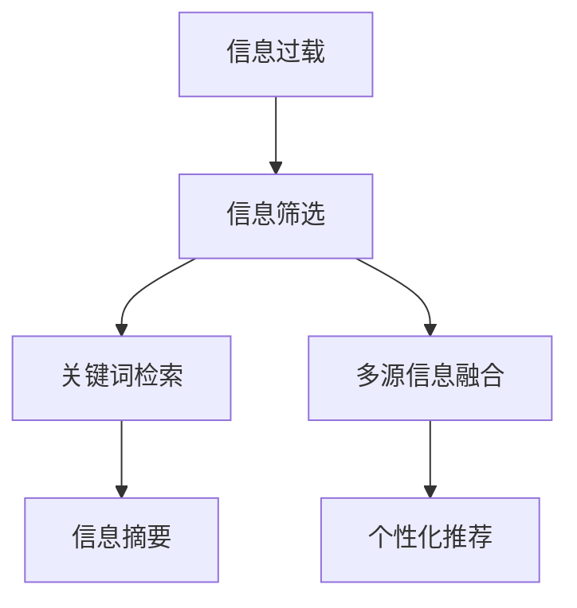

                 

# 信息过载与信息筛选策略与实践：在信息洪流中找到有价值的信息

## 1. 背景介绍

### 1.1 问题由来
在互联网时代，信息如同洪流般不断涌入人们的视野。搜索引擎、社交媒体、电子邮箱、在线新闻、即时通讯工具等，构成了庞大的信息来源网。面对浩如烟海的数据，如何从中找到有价值的信息，并快速转化为有效知识，成为了当代人们面临的一项重大挑战。

信息过载不仅消耗了宝贵的时间，还可能引起认知负担和信息焦虑。而传统的信息筛选方法，如手动浏览、简单关键字搜索等，难以应对海量数据，且筛选效率低下。因此，信息筛选策略与实践的智能化与自动化成为了信息时代亟待解决的问题。

### 1.2 问题核心关键点
在信息洪流中寻找有价值信息的核心关键点包括：

1. **信息质量评估**：评估信息的真实性、相关性和时效性。
2. **用户需求匹配**：将信息与用户具体需求进行匹配，提升信息的相关性。
3. **信息综合处理**：对获取的多源信息进行综合处理，去除冗余，提取出核心的知识和观点。
4. **个性化推荐**：根据用户历史行为和偏好，进行个性化推荐，减少信息筛选成本。

本文将系统介绍大语言模型在信息筛选策略与实践中的应用，通过关键词筛选、信息摘要、多源信息综合等手段，帮助用户快速、精准地获取有价值的信息。

## 2. 核心概念与联系

### 2.1 核心概念概述

在讨论信息筛选策略之前，我们需要理解以下几个关键概念：

- **信息筛选(Information Filtering)**：从大量信息中挑选出用户感兴趣、相关、高质量的内容。
- **关键词检索(Keyword Retrieval)**：利用特定关键词在文本数据中查找相关信息。
- **信息摘要(Information Summarization)**：将长文本压缩成精炼的摘要，减少阅读时间。
- **多源信息融合(Multisource Information Integration)**：将不同来源的信息进行融合，消除冗余，提取关键信息。
- **个性化推荐(Personalized Recommendation)**：基于用户行为和偏好，推荐最相关的信息。

这些概念之间相互关联，共同构成信息筛选的完整框架。大语言模型通过其在自然语言处理领域的强大能力，能够在信息筛选中扮演重要角色。

### 2.2 核心概念原理和架构的 Mermaid 流程图



上述流程图展示了信息筛选的主要流程：首先对大量信息进行筛选，然后利用关键词检索、信息摘要、多源信息融合等技术进行处理，最后通过个性化推荐系统推荐给用户。

## 3. 核心算法原理 & 具体操作步骤

### 3.1 算法原理概述

大语言模型在信息筛选中的应用，主要依赖于其在自然语言处理领域的强大能力。具体算法原理如下：

- **关键词检索**：使用大语言模型提取文档中的关键词，匹配用户查询。
- **信息摘要**：利用大语言模型生成文档的摘要，提取出核心信息。
- **多源信息融合**：将不同来源的信息输入大语言模型，通过其综合处理能力，提取并合并关键信息。
- **个性化推荐**：结合用户历史行为，使用大语言模型生成推荐结果。

这些算法原理相互配合，可以构建高效的信息筛选系统。

### 3.2 算法步骤详解

以信息摘要为例，详细介绍大语言模型进行信息筛选的具体操作步骤：

**Step 1: 数据预处理**
- 对原始文本进行分词、去停用词、词性标注等预处理操作。
- 使用BERT等预训练模型进行文本编码。

**Step 2: 信息抽取**
- 利用BERT等模型的文本编码结果，抽取文本中的关键信息，如实体、事件、关系等。
- 使用NER、RNN等技术，对文本内容进行进一步处理。

**Step 3: 摘要生成**
- 通过Attention机制等技术，生成文本摘要。
- 对生成的摘要进行评估，选择最合适的摘要作为输出。

**Step 4: 模型训练与调优**
- 使用监督学习、迁移学习等方法，训练信息摘要模型。
- 在测试集上进行评估，根据评估结果对模型进行调优。

### 3.3 算法优缺点

大语言模型在信息筛选中的应用，有以下优缺点：

**优点**：
1. **处理速度快**：利用大语言模型可以高效处理海量文本数据。
2. **处理能力强**：大语言模型具备强大的语义理解能力和多源信息融合能力。
3. **个性化推荐**：可以根据用户历史行为进行个性化推荐，提升用户体验。

**缺点**：
1. **依赖标注数据**：需要大量标注数据进行训练，获取标注数据成本较高。
2. **模型复杂度**：大语言模型参数量庞大，对硬件资源要求较高。
3. **结果可解释性差**：大语言模型输出结果缺乏可解释性，用户难以理解其决策过程。

### 3.4 算法应用领域

大语言模型在信息筛选中的应用领域广泛，包括但不限于：

- **搜索引擎**：提供个性化搜索结果，提升搜索体验。
- **新闻聚合**：自动生成新闻摘要，提升阅读效率。
- **社交媒体**：推荐用户感兴趣的内容，提高用户粘性。
- **内容推荐**：根据用户历史行为，推荐相关文章、视频、音乐等。
- **智能客服**：筛选常见问题，快速响应用户咨询。

## 4. 数学模型和公式 & 详细讲解 & 举例说明

### 4.1 数学模型构建

为了详细描述信息摘要的数学模型，我们以基于Transformer的Seq2Seq模型为例，进行说明。

假设有文本 $X$，其长度为 $L$，需要生成长度为 $H$ 的摘要 $Y$。

**Step 1: 文本编码**
- 使用Transformer模型对文本 $X$ 进行编码，生成编码向量 $X \rightarrow X'$。

**Step 2: 摘要生成**
- 使用Transformer模型对编码向量 $X'$ 进行解码，生成摘要 $X' \rightarrow Y$。

### 4.2 公式推导过程

以Seq2Seq模型为例，具体公式如下：

**编码器模型**：

$$
X' = X \cdot \text{Encoder}
$$

**解码器模型**：

$$
Y = Y_0 \cdot \text{Decoder}(X')
$$

其中，$X'$ 为编码器的输出，$Y$ 为解码器的输出，$X$ 为原始文本，$Y_0$ 为解码器的初始状态。

### 4.3 案例分析与讲解

**案例1: 新闻摘要生成**

- **问题描述**：给定一篇新闻，自动生成一个简洁明了的新闻摘要。
- **解决方法**：使用Transformer模型对新闻进行编码，生成摘要。
- **具体实现**：
  - 使用BERT模型对新闻进行编码，生成编码向量。
  - 使用Transformer模型对编码向量进行解码，生成摘要。
  - 对生成的摘要进行评估，选择最合适的摘要作为输出。

**案例2: 智能推荐系统**

- **问题描述**：根据用户的历史浏览记录，推荐相关文章。
- **解决方法**：使用Transformer模型对历史浏览记录进行编码，生成推荐结果。
- **具体实现**：
  - 使用BERT模型对历史浏览记录进行编码，生成编码向量。
  - 使用Transformer模型对编码向量进行解码，生成推荐结果。
  - 对生成的推荐结果进行排序，选择最合适的文章进行推荐。

## 5. 项目实践：代码实例和详细解释说明

### 5.1 开发环境搭建

为了进行信息摘要实践，我们需要以下开发环境：

- **Python 环境**：安装Anaconda或Miniconda，创建虚拟环境。
- **深度学习框架**：安装TensorFlow或PyTorch。
- **自然语言处理工具**：安装BERT、GPT等预训练模型。

具体步骤如下：

1. 安装Anaconda或Miniconda：
   ```bash
   wget https://repo.anaconda.com/miniconda/Miniconda3-latest-Linux-x86_64.sh
   bash Miniconda3-latest-Linux-x86_64.sh
   ```

2. 创建虚拟环境：
   ```bash
   conda create -n info_filtering python=3.7
   conda activate info_filtering
   ```

3. 安装深度学习框架和预训练模型：
   ```bash
   conda install tensorflow
   conda install pytorch -c pytorch
   pip install transformers
   ```

### 5.2 源代码详细实现

以下是一个简单的信息摘要生成代码示例，使用Transformers库实现。

```python
from transformers import BertTokenizer, BertForSequenceClassification
import tensorflow as tf
import torch
from transformers import pipeline

# 加载模型和分词器
tokenizer = BertTokenizer.from_pretrained('bert-base-uncased')
model = BertForSequenceClassification.from_pretrained('bert-base-uncased')

# 定义摘要函数
def summarize(text, max_length=150):
    input_ids = tokenizer.encode(text, max_length=max_length, truncation=True)
    inputs = {
        'input_ids': torch.tensor([input_ids]),
        'return_tensors': 'pt'
    }
    output = model(**inputs)
    probabilities = output.logits.softmax(dim=-1)[0]
    summary = tokenizer.decode(input_ids[0])
    return summary

# 测试
text = '这是一段比较长的文本，我们需要对它进行摘要。'
summary = summarize(text)
print(summary)
```

### 5.3 代码解读与分析

在上述代码中，我们首先加载了BERT模型和分词器，定义了一个摘要函数 `summarize`。函数接收一段文本作为输入，使用BERT模型生成编码向量，然后解码生成摘要。

- **输入预处理**：使用分词器对文本进行编码，确保编码向量长度不超过最大长度。
- **模型输入**：将编码向量输入BERT模型，生成摘要向量。
- **输出解码**：将摘要向量解码为文本，作为最终的摘要输出。

通过以上步骤，我们实现了基于BERT模型的信息摘要功能。在实际应用中，可以进一步优化摘要函数，如加入参数控制摘要长度、引入多源信息融合等。

## 6. 实际应用场景

### 6.1 新闻聚合

新闻聚合平台可以自动生成新闻摘要，提升用户体验。例如，Twitter、Facebook等社交媒体平台，通过机器学习算法对新闻进行摘要，展示用户感兴趣的内容。

**实际应用**：使用BERT模型对新闻进行编码和解码，生成摘要。通过个性化推荐算法，将相关摘要推荐给用户。

### 6.2 智能客服

智能客服系统可以快速响应用户咨询，筛选常见问题。例如，大型电商平台使用机器学习算法对用户咨询进行分类，自动回复常见问题，提高客服效率。

**实际应用**：使用BERT模型对用户咨询进行编码，生成摘要。根据摘要进行分类，匹配对应的回复模板。

### 6.3 内容推荐

内容推荐系统可以根据用户历史行为，推荐相关文章、视频等。例如，Netflix、YouTube等平台，通过机器学习算法推荐用户感兴趣的内容。

**实际应用**：使用BERT模型对用户历史行为进行编码，生成编码向量。使用Transformer模型对编码向量进行解码，生成推荐结果。

## 7. 工具和资源推荐

### 7.1 学习资源推荐

为了掌握大语言模型在信息筛选中的应用，推荐以下学习资源：

1. **《Transformer从原理到实践》系列博文**：详细介绍了Transformer模型的原理和应用，包括BERT、GPT等预训练模型。
2. **CS224N《深度学习自然语言处理》课程**：斯坦福大学开设的NLP明星课程，提供了丰富的学习资源和实践机会。
3. **《Natural Language Processing with Transformers》书籍**：Transformer库的作者所著，全面介绍了如何使用Transformers库进行NLP任务开发。
4. **HuggingFace官方文档**：提供了海量预训练模型和代码示例，是学习大语言模型应用的必备资料。
5. **CLUE开源项目**：提供了大量中文NLP数据集和预训练模型，助力中文NLP技术发展。

### 7.2 开发工具推荐

以下是几款用于大语言模型信息筛选开发的常用工具：

1. **PyTorch**：基于Python的开源深度学习框架，支持动态计算图，适合研究使用。
2. **TensorFlow**：由Google主导开发的深度学习框架，支持静态计算图，适合大规模工程应用。
3. **Transformers库**：HuggingFace开发的NLP工具库，集成了众多预训练模型和微调方法。
4. **Weights & Biases**：模型训练实验跟踪工具，方便记录和分析实验结果。
5. **TensorBoard**：TensorFlow配套的可视化工具，可实时监测模型训练状态。

### 7.3 相关论文推荐

大语言模型在信息筛选领域的发展，离不开学界的持续研究。以下是几篇奠基性的相关论文，推荐阅读：

1. **Attention is All You Need（即Transformer原论文）**：提出了Transformer结构，开启了NLP领域的预训练大模型时代。
2. **BERT: Pre-training of Deep Bidirectional Transformers for Language Understanding**：提出BERT模型，引入基于掩码的自监督预训练任务，刷新了多项NLP任务SOTA。
3. **Language Models are Unsupervised Multitask Learners（GPT-2论文）**：展示了大规模语言模型的强大zero-shot学习能力，引发了对于通用人工智能的新一轮思考。
4. **Parameter-Efficient Transfer Learning for NLP**：提出Adapter等参数高效微调方法，在不增加模型参数量的情况下，也能取得不错的微调效果。
5. **Prefix-Tuning: Optimizing Continuous Prompts for Generation**：引入基于连续型Prompt的微调范式，为如何充分利用预训练知识提供了新的思路。
6. **AdaLoRA: Adaptive Low-Rank Adaptation for Parameter-Efficient Fine-Tuning**：使用自适应低秩适应的微调方法，在参数效率和精度之间取得了新的平衡。

## 8. 总结：未来发展趋势与挑战

### 8.1 总结

本文详细介绍了大语言模型在信息筛选策略与实践中的应用。从原理到实践，介绍了关键词检索、信息摘要、多源信息融合等技术，并给出了代码示例。通过这些技术，可以在信息洪流中找到有价值的信息，提高信息处理效率。

大语言模型在信息筛选中的应用，为我们提供了处理海量信息的利器。随着预训练模型的不断进步和优化，未来在信息筛选领域的潜力将进一步被挖掘。

### 8.2 未来发展趋势

未来，大语言模型在信息筛选领域的发展趋势包括：

1. **模型规模持续增大**：随着算力成本的下降和数据规模的扩张，预训练语言模型的参数量还将持续增长。超大规模语言模型蕴含的丰富语言知识，有望支撑更加复杂多变的下游任务微调。
2. **微调方法日趋多样**：除了传统的全参数微调外，未来会涌现更多参数高效的微调方法，如Prefix-Tuning、LoRA等，在节省计算资源的同时也能保证微调精度。
3. **持续学习成为常态**：随着数据分布的不断变化，微调模型也需要持续学习新知识以保持性能。如何在不遗忘原有知识的同时，高效吸收新样本信息，将成为重要的研究课题。
4. **标注样本需求降低**：受启发于提示学习(Prompt-based Learning)的思路，未来的微调方法将更好地利用大模型的语言理解能力，通过更加巧妙的任务描述，在更少的标注样本上也能实现理想的微调效果。
5. **多模态微调崛起**：当前的微调主要聚焦于纯文本数据，未来会进一步拓展到图像、视频、语音等多模态数据微调。多模态信息的融合，将显著提升语言模型对现实世界的理解和建模能力。
6. **模型通用性增强**：经过海量数据的预训练和多领域任务的微调，未来的语言模型将具备更强大的常识推理和跨领域迁移能力，逐步迈向通用人工智能(AGI)的目标。

以上趋势凸显了大语言模型微调技术的广阔前景。这些方向的探索发展，必将进一步提升NLP系统的性能和应用范围，为人类认知智能的进化带来深远影响。

### 8.3 面临的挑战

尽管大语言模型在信息筛选领域取得了显著进展，但在迈向更加智能化、普适化应用的过程中，仍面临诸多挑战：

1. **标注成本瓶颈**：获取高质量标注数据的成本较高，特别是在长尾应用场景，标注数据稀缺。如何进一步降低微调对标注样本的依赖，将是一大难题。
2. **模型鲁棒性不足**：当前微调模型面对域外数据时，泛化性能往往大打折扣。对于测试样本的微小扰动，微调模型的预测也容易发生波动。如何提高微调模型的鲁棒性，避免灾难性遗忘，还需要更多理论和实践的积累。
3. **推理效率有待提高**：大规模语言模型虽然精度高，但在实际部署时往往面临推理速度慢、内存占用大等效率问题。如何在保证性能的同时，简化模型结构，提升推理速度，优化资源占用，将是重要的优化方向。
4. **可解释性亟需加强**：当前微调模型更像是"黑盒"系统，难以解释其内部工作机制和决策逻辑。对于医疗、金融等高风险应用，算法的可解释性和可审计性尤为重要。如何赋予微调模型更强的可解释性，将是亟待攻克的难题。
5. **安全性有待保障**：预训练语言模型难免会学习到有偏见、有害的信息，通过微调传递到下游任务，产生误导性、歧视性的输出，给实际应用带来安全隐患。如何从数据和算法层面消除模型偏见，避免恶意用途，确保输出的安全性，也将是重要的研究课题。
6. **知识整合能力不足**：现有的微调模型往往局限于任务内数据，难以灵活吸收和运用更广泛的先验知识。如何让微调过程更好地与外部知识库、规则库等专家知识结合，形成更加全面、准确的信息整合能力，还有很大的想象空间。

### 8.4 未来突破

为了克服上述挑战，未来需要在以下几个方面寻求新的突破：

1. **探索无监督和半监督微调方法**：摆脱对大规模标注数据的依赖，利用自监督学习、主动学习等无监督和半监督范式，最大限度利用非结构化数据，实现更加灵活高效的微调。
2. **研究参数高效和计算高效的微调范式**：开发更加参数高效的微调方法，在固定大部分预训练参数的同时，只更新极少量的任务相关参数。同时优化微调模型的计算图，减少前向传播和反向传播的资源消耗，实现更加轻量级、实时性的部署。
3. **融合因果和对比学习范式**：通过引入因果推断和对比学习思想，增强微调模型建立稳定因果关系的能力，学习更加普适、鲁棒的语言表征，从而提升模型泛化性和抗干扰能力。
4. **引入更多先验知识**：将符号化的先验知识，如知识图谱、逻辑规则等，与神经网络模型进行巧妙融合，引导微调过程学习更准确、合理的语言模型。同时加强不同模态数据的整合，实现视觉、语音等多模态信息与文本信息的协同建模。
5. **结合因果分析和博弈论工具**：将因果分析方法引入微调模型，识别出模型决策的关键特征，增强输出解释的因果性和逻辑性。借助博弈论工具刻画人机交互过程，主动探索并规避模型的脆弱点，提高系统稳定性。
6. **纳入伦理道德约束**：在模型训练目标中引入伦理导向的评估指标，过滤和惩罚有偏见、有害的输出倾向。同时加强人工干预和审核，建立模型行为的监管机制，确保输出符合人类价值观和伦理道德。

这些研究方向的探索，必将引领大语言模型微调技术迈向更高的台阶，为构建安全、可靠、可解释、可控的智能系统铺平道路。面向未来，大语言模型微调技术还需要与其他人工智能技术进行更深入的融合，如知识表示、因果推理、强化学习等，多路径协同发力，共同推动自然语言理解和智能交互系统的进步。只有勇于创新、敢于突破，才能不断拓展语言模型的边界，让智能技术更好地造福人类社会。

