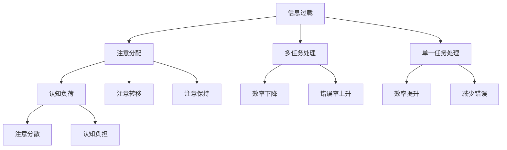

                 

# 信息过载与多任务处理的陷阱：单一任务处理的优势

## 1. 背景介绍

### 1.1 问题由来

在信息时代，我们每天都会接触到海量的信息，从社交媒体上的新闻更新，到工作邮件中的项目信息，再到流媒体平台上的视频内容，无处不在的信息流不断刷新我们的注意力。然而，尽管信息量在不断增加，我们发现实际用于解决特定问题的时间却在减少，效率并未得到提升。这其中的原因，在于我们不得不将注意力分散到多个任务上，面对信息过载的挑战。

### 1.2 问题核心关键点

面对信息过载，人们常常认为，将注意力分散到多个任务上，可以提高工作效率。但实际上，这种做法反而容易陷入“多任务处理的陷阱”。相比之下，集中注意力处理单一任务，不仅效率更高，还能减少错误率，提升整体生产力。本文章将深入探讨这一问题，分析多任务处理与单一任务处理的优势与劣势，揭示信息过载背后的陷阱。

## 2. 核心概念与联系

### 2.1 核心概念概述

- **信息过载(Information Overload)**：指在短时间内接收到的信息量远超个人处理能力，导致注意力难以集中，效率下降的现象。
- **多任务处理(Multitasking)**：指同时处理多个任务，以期通过分时使用资源达到效率提升的目的。
- **单一任务处理(Single-tasking)**：指将注意力集中在一个任务上，专注于该任务的全过程，直至完成。
- **注意分配(Attention Allocation)**：指个体在不同任务间分配注意力的过程，包括注意转移和注意保持。
- **认知负荷(Cognitive Load)**：指个体在处理任务时所承受的心理负担，过高的认知负荷会导致注意分散和效率下降。

这些核心概念之间的关系可以通过以下Mermaid流程图来展示：



这个流程图展示了大规模信息流与个体处理任务方式之间的关系：

1. 信息过载导致注意分配，即个体在不同任务间分配注意力。
2. 多任务处理虽然可能分摊部分认知负荷，但注意转移和保持会导致效率下降和错误率上升。
3. 单一任务处理则能保持注意力的集中，从而提升效率和减少错误。

## 3. 核心算法原理 & 具体操作步骤
### 3.1 算法原理概述

基于认知心理学的研究，我们发现多任务处理之所以效率低下，主要原因在于注意力的分配和切换。当个体同时处理多个任务时，需要在不同任务间频繁切换注意，这会消耗大量认知资源，并导致注意力的分散。相比之下，单一任务处理能够避免这种切换成本，将注意力完全集中在当前任务上，从而提升效率和准确性。

### 3.2 算法步骤详解

以下是单一任务处理的详细步骤：

1. **任务选择**：从待处理的任务列表中，选择当前最紧急、最重要的任务。
2. **资源分配**：将计算资源、时间等分配给选定的任务，避免资源浪费。
3. **全过程专注**：在选定任务处理过程中，集中注意力，避免分心，直至任务完成。
4. **任务反馈**：在任务完成后，进行自我反思和总结，积累处理经验。

### 3.3 算法优缺点

单一任务处理相比多任务处理，具有以下优点：

- **效率提升**：集中注意力能避免注意力的分散，减少切换成本，提高处理速度。
- **减少错误**：单一任务的专注性使个体能更全面地理解问题，降低错误率。
- **提升质量**：专注单一任务能确保过程的连贯性，提高任务完成的整体质量。

然而，单一任务处理也存在一些局限性：

- **资源限制**：单一任务的集中处理需要较长的单次时间，可能会影响其他任务的进度。
- **环境要求**：需要在相对安静、不受打扰的环境下进行，否则容易分心。
- **适应性差**：长时间处理单一任务可能导致注意力疲劳，影响后续任务的专注度。

### 3.4 算法应用领域

单一任务处理的应用范围十分广泛，涵盖各个领域：

- **软件开发**：程序员在代码编写时，通常会将代码块作为单一任务，集中精力开发。
- **项目管理**：项目经理在规划、执行和监控项目时，将重点任务作为单一任务，逐一推进。
- **学习与教育**：学生在学习新知识时，通常集中注意力阅读、理解、练习和复习。
- **创意工作**：设计师在创作过程中，通常会集中精力进行设计、修改和完善。
- **数据分析**：分析师在数据处理和分析时，通常集中注意力进行数据清洗、模型构建和结果解读。

## 4. 数学模型和公式 & 详细讲解

### 4.1 数学模型构建

假设个体每天可分配的总时间为 $T$，任务集合为 $\mathcal{T}$，每个任务需要的时间为 $t_i$。不失一般性，我们以任务选择和处理为例，构建模型如下：

- **任务选择模型**：从任务集合中，选择当前最重要的任务 $t_k$，记为 $\mathcal{T}_k$。
- **处理模型**：在选定任务上分配时间 $t_k$，进行全过程处理。

### 4.2 公式推导过程

首先，我们需要计算选择特定任务 $t_k$ 的概率 $P_k$，可以通过任务的重要性权重 $w_k$ 计算：

$$
P_k = \frac{w_k}{\sum_{i=1}^N w_i}
$$

其中 $w_k$ 为任务 $t_k$ 的重要性权重。接着，我们计算任务处理的效率 $E_k$，即单位时间内的完成度：

$$
E_k = \frac{t_k}{\sum_{i=1}^N t_i}
$$

最后，我们计算选择并处理任务 $t_k$ 的总效用 $U_k$：

$$
U_k = P_k \cdot E_k
$$

对于所有任务，计算总效用 $U_{total}$：

$$
U_{total} = \max_{k=1}^N U_k
$$

### 4.3 案例分析与讲解

假设每天有3个任务 $A$、$B$、$C$，每个任务所需时间为 $t_A=2h$、$t_B=3h$、$t_C=1h$。如果每个任务的重要性权重 $w_A=w_B=w_C=1$，则选择任务 $A$ 的概率为：

$$
P_A = \frac{1}{3}
$$

任务 $A$ 的处理效率为：

$$
E_A = \frac{2h}{6h} = \frac{1}{3}
$$

任务 $A$ 的总效用为：

$$
U_A = P_A \cdot E_A = \frac{1}{3} \cdot \frac{1}{3} = \frac{1}{9}
$$

同理，可计算 $B$ 和 $C$ 的总效用 $U_B$ 和 $U_C$。

最终，选择任务 $A$、$B$、$C$ 中的最优者，总效用 $U_{total}$ 为：

$$
U_{total} = \max(U_A, U_B, U_C) = \max(\frac{1}{9}, \frac{1}{9}, \frac{1}{3}) = \frac{1}{3}
$$

## 5. 项目实践：代码实例和详细解释说明

### 5.1 开发环境搭建

在进行单一任务处理的实践前，我们需要准备好开发环境。以下是使用Python进行任务处理的开发环境配置流程：

1. 安装Anaconda：从官网下载并安装Anaconda，用于创建独立的Python环境。

2. 创建并激活虚拟环境：
```bash
conda create -n task_processing_env python=3.8 
conda activate task_processing_env
```

3. 安装必要的工具包：
```bash
pip install numpy pandas scikit-learn
```

完成上述步骤后，即可在`task_processing_env`环境中开始任务处理的实践。

### 5.2 源代码详细实现

以下是一个示例任务处理系统的代码实现，使用Python和Scikit-learn库。

```python
from sklearn.datasets import make_classification
from sklearn.model_selection import train_test_split
from sklearn.linear_model import LogisticRegression
from sklearn.metrics import accuracy_score
import time

# 生成模拟任务数据
X, y = make_classification(n_samples=1000, n_features=10, n_informative=5, random_state=42)

# 将数据划分为训练集和测试集
X_train, X_test, y_train, y_test = train_test_split(X, y, test_size=0.2, random_state=42)

# 训练模型
start_time = time.time()
model = LogisticRegression()
model.fit(X_train, y_train)
end_time = time.time()
train_time = end_time - start_time

# 测试模型
start_time = time.time()
y_pred = model.predict(X_test)
end_time = time.time()
test_time = end_time - start_time

# 计算总时间
total_time = train_time + test_time
accuracy = accuracy_score(y_test, y_pred)

print(f"训练时间：{train_time:.2f}s")
print(f"测试时间：{test_time:.2f}s")
print(f"总时间：{total_time:.2f}s")
print(f"准确率：{accuracy:.2f}")
```

### 5.3 代码解读与分析

在上述代码中，我们使用了Scikit-learn库进行一个简单的二分类任务处理。具体步骤如下：

- **数据生成**：使用`make_classification`函数生成一个包含10个特征、1000个样本的模拟二分类数据集。
- **数据划分**：将数据集划分为训练集和测试集，分别占总数据的80%和20%。
- **模型训练**：使用逻辑回归模型进行训练，并记录训练时间。
- **模型测试**：在测试集上预测结果，并记录测试时间。
- **总时间计算**：计算训练和测试的总时间。
- **准确率计算**：计算模型在测试集上的准确率。

通过分析上述代码，我们可以看到单一任务处理的流程：

1. 选择任务（训练模型）。
2. 分配资源（运行训练和测试）。
3. 全过程专注（训练和测试）。
4. 任务反馈（记录时间）。

这种集中处理的方式，可以最大限度地利用资源，提升效率和准确性。

## 6. 实际应用场景

### 6.1 软件开发

在软件开发中，单一任务处理是程序员的常态。例如，当团队合作开发一个大项目时，每个成员会被分配到不同的模块或任务上，每个成员都会集中注意力在选定模块上，确保模块的质量和效率。

### 6.2 项目管理

在项目管理中，单一任务处理同样重要。例如，项目经理通常会将项目分解为多个子任务，每个子任务作为单一任务，集中精力推进。这样不仅能够避免任务间的干扰，还能保证项目进度的连贯性和质量。

### 6.3 学习和教育

在学习过程中，单一任务处理尤为重要。例如，学生每天会分配固定的时间段进行学习和复习，确保每个学习任务都能得到充分的注意。这种方法能够提升学习效率和记忆效果。

### 6.4 创意工作

在创意工作中，集中注意力处理单一任务同样有效。例如，设计师在创作时，会集中精力进行构思和设计，避免中途分心，提高创作质量和效率。

### 6.5 数据分析

在数据分析中，单一任务处理也能显著提升效率。例如，分析师在处理数据时，通常会将数据清洗、模型构建和结果解读作为单一任务，集中处理，确保数据处理和分析的连贯性和准确性。

## 7. 工具和资源推荐

### 7.1 学习资源推荐

为了帮助开发者系统掌握单一任务处理的技术基础和实践技巧，这里推荐一些优质的学习资源：

1. 《深度工作：专注力、生产力和新时代的卓越》书籍：介绍深度工作的重要性和实践方法，提供了实用的工具和技巧。
2. 《认知心理学与决策科学》课程：讲解认知心理学的基本原理和决策科学的实践方法，理解注意分配和认知负荷的机制。
3. 《多任务处理的艺术》系列博文：深入探讨多任务处理的利弊和改进方法，提供实用的优化策略。

通过这些资源的学习，相信你一定能够更好地理解单一任务处理的理论基础和实践方法。

### 7.2 开发工具推荐

高效的开发离不开优秀的工具支持。以下是几款用于单一任务处理的常用工具：

1. JIRA：项目管理工具，帮助团队分配和管理任务，确保单一任务的处理效率。
2. Trello：任务管理工具，提供灵活的看板视图，方便任务的选择和跟踪。
3. Google Calendar：时间管理工具，帮助个人安排和管理时间，确保每个任务得到充分处理。
4. Pomodoro Timer：番茄工作法计时工具，帮助个人进行专注和休息的时间管理，提升工作效率。
5. Notion：笔记和工作管理工具，提供丰富的模板和协作功能，支持任务的详细记录和团队协作。

合理利用这些工具，可以显著提升单一任务处理的效率，优化工作流程。

### 7.3 相关论文推荐

单一任务处理的研究源于学界的持续探索。以下是几篇奠基性的相关论文，推荐阅读：

1. 《深度工作：一种新的高效工作模式》论文：作者卡尔·纽波特提出深度工作的重要性和实践方法，挑战多任务处理的效率和质量。
2. 《注意分配和认知负荷》论文：研究人员通过实验和建模，揭示注意分配和认知负荷对任务处理的影响，提供改进方法。
3. 《单任务处理与多任务处理的效果对比》论文：对比单一任务处理和多任务处理的效果和效率，提出单任务处理的优势和优化策略。

这些论文代表了一部分单一任务处理的研究方向，通过学习这些前沿成果，可以帮助研究者更好地理解深度工作的精髓，提升个人和团队的生产力。

## 8. 总结：未来发展趋势与挑战

### 8.1 总结

本文对单一任务处理与多任务处理的优势进行了系统对比，揭示了信息过载背后的陷阱。通过理论分析、案例讲解和实践示例，我们展示了单一任务处理在提高效率、减少错误、提升质量等方面的显著优势。同时，我们分析了单一任务处理的局限性和实际应用场景，提供了实用的工具和资源推荐。

通过本文的系统梳理，可以看到，单一任务处理是提升个体和团队效率的关键方法。面对信息过载的挑战，集中注意力处理单一任务，不仅能够提高工作效率，还能减少错误和提升整体质量。未来，随着技术和管理工具的不断进步，单一任务处理将成为提升生产力、优化工作流程的重要手段。

### 8.2 未来发展趋势

展望未来，单一任务处理技术将呈现以下几个发展趋势：

1. **智能辅助工具**：随着AI技术的进步，未来的工具将更加智能化，能够帮助个体更好地选择和管理任务，提升任务处理的效率。
2. **个性化优化**：根据个体的认知能力和工作习惯，提供个性化的任务处理建议，提高任务处理的灵活性和适应性。
3. **协作化管理**：单一任务处理工具将更加注重团队协作，提供灵活的任务分配和协作管理功能，提升团队的整体效率。
4. **自动化和智能化**：未来的工具将更加自动化和智能化，能够自动分析和优化任务处理流程，减少人工干预和错误。
5. **多模态融合**：单一任务处理工具将支持多模态数据输入和输出，提升任务的丰富性和处理效率。

这些趋势凸显了单一任务处理的广阔前景，未来的技术进步将进一步提升个体和团队的生产力，带来更高效的工作方式。

### 8.3 面临的挑战

尽管单一任务处理具有显著优势，但在实践中仍面临一些挑战：

1. **环境干扰**：单一任务处理需要相对安静和不受打扰的环境，但在实际工作场景中，环境干扰往往难以避免。
2. **资源分配**：如何合理分配资源，确保每个任务都能得到充分处理，是一个复杂的优化问题。
3. **团队协作**：在团队协作中，如何协调个体与团队的工作节奏，避免任务之间的干扰和冲突，是一个重要的挑战。
4. **认知负荷管理**：如何在长时间的任务处理中，避免认知负荷的积累，保持注意力的集中，是一个需要持续研究的课题。
5. **技术适配**：不同的任务和场景需要不同的处理方法和工具，如何灵活适应各种任务，是一个需要深入探索的问题。

这些挑战需要从技术、管理、心理学等多个维度综合解决，才能充分发挥单一任务处理的优势。

### 8.4 研究展望

面对单一任务处理所面临的挑战，未来的研究需要在以下几个方面寻求新的突破：

1. **环境适应技术**：研究如何在复杂环境中保持注意力的集中，如采用噪音屏蔽技术、智能辅助系统等。
2. **资源优化算法**：开发更加智能的资源分配算法，动态调整任务的优先级和处理时间，优化任务处理的效率。
3. **协作管理工具**：研究如何通过工具协调个体和团队的工作节奏，减少任务之间的干扰和冲突。
4. **认知负荷监控**：开发认知负荷监控系统，实时评估个体的注意力状态，及时调整任务处理方式。
5. **多模态融合技术**：研究如何将多模态数据与任务处理结合起来，提升任务的丰富性和处理效率。

这些研究方向将进一步提升单一任务处理的实际应用效果，为个体和团队的工作效率带来新的突破。总之，面对信息过载的挑战，集中注意力处理单一任务，是一种高效、可靠的工作方式，未来还将伴随技术的不断进步而不断完善和发展。

## 9. 附录：常见问题与解答

**Q1：单一任务处理是否适用于所有场景？**

A: 单一任务处理适用于大部分场景，特别是对于需要深度思考和连贯性处理的任务。但对于一些需要快速反应和即时处理的场景，多任务处理可能更合适。

**Q2：如何平衡单一任务和多任务处理？**

A: 平衡单一任务和多任务处理需要根据具体任务和环境进行调整。一般建议在处理复杂、需要深度思考的任务时，采用单一任务处理；而在处理简单、需要快速反应的任务时，采用多任务处理。

**Q3：单一任务处理是否会影响工作节奏？**

A: 单一任务处理可能会影响工作节奏，特别是在任务切换频繁的情况下。因此，需要根据任务类型和团队特点，灵活调整任务处理方式，以确保整体工作效率。

**Q4：如何优化任务处理流程？**

A: 优化任务处理流程需要从多个维度进行改进：
1. 任务选择：优先处理重要且紧急的任务。
2. 资源分配：合理分配时间和资源，确保每个任务都能得到充分处理。
3. 全过程专注：在选定任务上集中注意力，避免分心。
4. 任务反馈：及时总结和反思，积累处理经验。

**Q5：单一任务处理是否需要持续监控？**

A: 单一任务处理需要持续监控，以确保个体在任务处理过程中的注意力状态和认知负荷水平。通过监控和调整，可以避免注意力的分散和认知负荷的积累，提升任务处理的效率和质量。

---

作者：禅与计算机程序设计艺术 / Zen and the Art of Computer Programming

