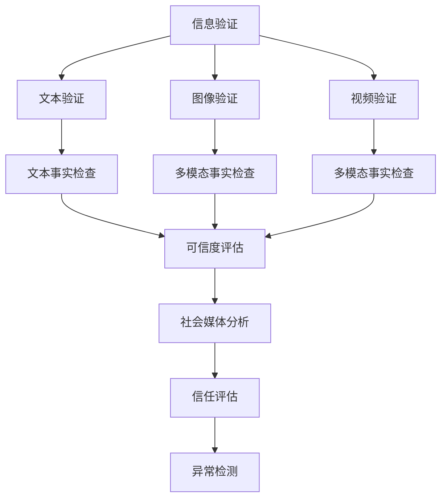

                 

# 信息验证和事实检查指南：在错误信息和假新闻时代导航

> 关键词：信息验证, 事实检查, 假新闻, 错误信息, 深度学习, 自然语言处理, 图像识别, 信息检索, 信任评估, 社会媒体分析

## 1. 背景介绍

### 1.1 问题由来

在互联网和社交媒体的迅猛发展下，信息传播的方式和速度发生了根本变化。一方面，这种变革极大地丰富了公众获取信息的渠道，扩大了知识传播的覆盖范围。但另一方面，信息真伪难辨的问题也愈发凸显，错误信息和假新闻通过自媒体、广告商、网络推手等多种渠道快速传播，对公众认知、社会稳定乃至国家安全构成严重威胁。近年来，虚假信息的泛滥已引发全球多起社会动荡事件，如“英国脱欧”公投、美国总统大选等。

在传统的新闻行业中，通常由记者、编辑等专业人士对信息源和内容进行严格审核，利用专业知识和经验进行事实核查。但随着自媒体的崛起，尤其是社交媒体平台上大量无权威身份用户的发帖，这种人工审核模式已难以适应。为此，一些企业和研究机构开始借助新兴的计算机技术，进行信息验证和事实检查。

### 1.2 问题核心关键点

针对信息验证和事实检查，核心问题包括：

1. **自动化检测**：如何构建有效的算法模型，对信息文本、图片、视频等多种形式的内容进行自动识别和标记。
2. **知识图谱利用**：如何将知识图谱等结构化信息与自然语言处理(NLP)结合，提供更丰富的背景知识支持。
3. **跨模态融合**：如何实现文本与图像、视频等多模态数据的融合，提升内容验证的效果。
4. **社会信任评估**：如何在算法模型中嵌入社会信任评估机制，避免对权威机构和媒体的过度压制。
5. **异常检测**：如何检测信息中的异常模式，如恶意链接、广告词汇、重复内容等。

这些核心问题构成了信息验证和事实检查的技术框架，需要从算法、数据、伦理等多个维度进行全面研究。

## 2. 核心概念与联系

### 2.1 核心概念概述

为更好地理解信息验证和事实检查技术，本节将介绍几个密切相关的核心概念：

- **信息验证**：利用计算机技术对信息内容的真实性进行自动检测，分为文本验证、图像验证、视频验证等不同形式。
- **事实检查**：进一步细粒度地对信息进行深入核查，确认信息的真实性和准确性，分为文本事实检查、多模态事实检查等。
- **假新闻**：通过虚构、篡改、夸大等方式制造和传播的虚假新闻信息。
- **错误信息**：传递错误或误导性信息，但不一定会特意伪造，如二手信息的篡改、断章取义的报道等。
- **深度学习**：通过多层神经网络模型进行信息特征提取和模式识别，实现高效的自动化信息验证。
- **自然语言处理(NLP)**：使计算机能够理解、处理和生成人类语言的技术。
- **图像识别**：利用深度学习算法对图像内容进行自动识别，识别出的图像信息可用于辅助文本验证。
- **信息检索**：从大规模数据集中查找与目标信息相似的其他信息，用于背景知识和可信度评估。
- **信任评估**：对信息源的信誉进行评估，利用可信度分数决定信息可信度，从而辅助信息验证。
- **社会媒体分析**：对社交媒体平台上的信息进行分析和监测，识别和移除虚假信息。

这些核心概念之间的逻辑关系可以通过以下Mermaid流程图来展示：



这个流程图展示了大规模信息验证和事实检查技术的核心概念及其之间的关系：

1. 信息验证技术可以分为文本、图像、视频等多种形式，每种形式的数据通过不同的模型进行处理。
2. 文本验证和事实检查是信息验证的核心，通过NLP技术进行信息内容的核查和真实性验证。
3. 多模态事实检查将图像、视频等多种形式的信息结合起来，进行更全面的内容核查。
4. 可信度评估基于知识图谱等结构化信息，对信息源和内容进行信誉度评估。
5. 社会媒体分析利用算法对社交媒体上的信息进行监测，识别虚假信息。
6. 异常检测在信息验证的多个环节中，发现异常模式并采取措施，防止虚假信息传播。

这些概念共同构成了信息验证和事实检查的技术框架，为解决虚假信息和错误信息问题提供了坚实的基础。

## 3. 核心算法原理 & 具体操作步骤
### 3.1 算法原理概述

信息验证和事实检查技术的核心算法主要包括：

- **文本分类算法**：用于识别文本的情感倾向、主题类型等，从而辅助判断文本的真实性。
- **实体识别和关系抽取**：从文本中识别出实体及其关系，用于判断文本内容是否真实存在。
- **图像内容识别**：通过卷积神经网络(CNN)对图像内容进行识别，检测图像信息是否与文本内容一致。
- **视频内容分析**：利用深度学习算法分析视频内容，识别视频中的异常行为或虚假信息。
- **知识图谱融合**：将知识图谱嵌入信息验证系统，提供更加丰富和准确的语义信息。
- **跨模态信息融合**：将文本、图像、视频等多模态信息融合，利用信息间的相互关联进行综合验证。
- **可信度评估模型**：基于历史数据和专家知识，建立可信度评估模型，对信息源进行信誉度评估。
- **异常检测算法**：利用统计学方法或深度学习算法，检测信息中的异常模式，如恶意链接、广告词汇等。

### 3.2 算法步骤详解

信息验证和事实检查的主要操作步骤如下：

**Step 1: 数据准备**
- 收集大量的真实信息数据，以及被验证的信息数据。这些数据可以来自新闻网站、社交媒体、网络论坛等。
- 准备相应的知识图谱数据，用于知识图谱融合和可信度评估。

**Step 2: 特征提取**
- 利用自然语言处理技术，对文本进行分词、向量化等处理，提取文本特征。
- 使用深度学习算法，如卷积神经网络(CNN)或循环神经网络(RNN)，对图像进行特征提取。
- 对视频进行剪辑和帧抽取，利用深度学习算法提取关键帧特征。

**Step 3: 模型训练**
- 使用文本分类算法训练模型，进行文本真实性判断。
- 使用实体识别和关系抽取算法，识别文本中的实体和关系。
- 训练图像识别模型，对图像内容进行识别和验证。
- 训练视频分析模型，对视频内容进行分析，识别异常行为。
- 训练知识图谱融合模型，将知识图谱嵌入到信息验证系统。
- 训练跨模态信息融合模型，综合利用多模态信息进行验证。
- 训练可信度评估模型，建立信息源信誉度评估机制。
- 训练异常检测算法，识别信息中的异常模式。

**Step 4: 信息验证**
- 将待验证的信息数据输入到各个模型中，获取模型对信息真实性的判断结果。
- 对判断结果进行综合分析和评估，得出最终的信息验证结果。

**Step 5: 信息反馈**
- 根据验证结果，对误报和漏报进行反馈和修正。
- 持续更新模型参数和训练数据，提升信息验证系统的准确性和鲁棒性。

### 3.3 算法优缺点

信息验证和事实检查技术具有以下优点：

1. **高效自动化**：能够自动处理大规模信息数据，节省了大量人工审核的时间和成本。
2. **实时性**：可以实时监测和分析社交媒体上的信息，快速识别和拦截虚假信息。
3. **跨模态融合**：通过多模态信息融合，能够更全面、准确地验证信息内容。
4. **知识图谱融合**：结合知识图谱，提供更丰富的背景知识和可信度评估，提升验证效果。
5. **异常检测**：检测信息中的异常模式，及时发现和处理恶意链接、广告词汇等。

同时，该技术也存在一定的局限性：

1. **数据依赖**：对标注数据的依赖较高，标注数据的数量和质量直接影响模型的准确性。
2. **模型复杂性**：多模态融合和知识图谱融合等技术，模型结构复杂，训练和推理过程较为繁琐。
3. **伦理问题**：在算法中嵌入社会信任评估机制，可能会对特定机构或媒体产生负面影响。
4. **误报和漏报**：自动化验证系统可能存在误报和漏报问题，需要人工复核和反馈修正。
5. **资源消耗**：多模态融合和深度学习模型对计算资源和存储资源的要求较高。

尽管存在这些局限性，但信息验证和事实检查技术在解决虚假信息和错误信息问题方面，已取得了显著成效，成为当前虚假信息打击的重要手段。

### 3.4 算法应用领域

信息验证和事实检查技术在多个领域得到了广泛应用，主要包括：

1. **新闻媒体**：辅助新闻编辑对发布信息进行真实性验证，防止虚假新闻的传播。
2. **社交媒体**：监测社交媒体上的信息，识别和移除虚假信息，维护平台秩序。
3. **电子商务**：对商品评论、用户评价等信息进行真实性验证，提升用户体验和平台信誉。
4. **金融交易**：对交易信息进行真实性验证，防范金融诈骗和虚假信息。
5. **政府决策**：辅助政府机构对政策信息和舆情进行真实性验证，确保决策的科学性和客观性。
6. **司法调查**：对案件信息进行真实性验证，提高司法公正性和效率。
7. **公共健康**：对健康相关信息进行真实性验证，防止虚假信息的误导。

## 4. 数学模型和公式 & 详细讲解  
### 4.1 数学模型构建

信息验证和事实检查技术的数学模型主要包括以下几个方面：

- **文本分类模型**：利用多分类算法，如朴素贝叶斯、支持向量机(SVM)、随机森林等，对文本进行情感倾向和主题类型的分类。
- **实体识别模型**：利用序列标注算法，如条件随机场(CRF)、长短时记忆网络(LSTM)等，识别文本中的实体和实体关系。
- **图像分类模型**：利用卷积神经网络(CNN)，对图像内容进行分类，判断图像与文本信息的一致性。
- **视频分类模型**：利用卷积神经网络(CNN)或3D卷积神经网络(3D-CNN)，对视频内容进行分类，识别视频中的异常行为。
- **知识图谱融合模型**：利用图神经网络(GNN)等算法，将知识图谱嵌入到信息验证系统，进行语义信息的增强。
- **跨模态融合模型**：利用深度学习算法，如多模态注意力机制、多模态卷积神经网络等，将文本、图像、视频等多模态信息融合，进行综合验证。
- **可信度评估模型**：利用回归算法或分类算法，建立信息源信誉度评估模型，提供可信度分数。
- **异常检测模型**：利用统计学方法或深度学习算法，识别信息中的异常模式，如恶意链接、广告词汇等。

### 4.2 公式推导过程

以文本分类模型为例，介绍常见的文本分类算法及其推导过程。

**朴素贝叶斯分类器(Naive Bayes Classifier)**

朴素贝叶斯分类器是一种常用的文本分类算法，其基本思想是根据贝叶斯公式，计算文本属于每个类别的概率，选取概率最大的类别作为预测结果。

假设文本集合 $D=\{d_1, d_2, \ldots, d_m\}$，其中每个文本 $d_i$ 由 $n$ 个词汇组成，即 $d_i = \{w_{i1}, w_{i2}, \ldots, w_{in}\}$。设类别集合为 $C=\{c_1, c_2, \ldots, c_k\}$，其中 $k$ 为类别数。

根据贝叶斯公式，文本 $d_i$ 属于类别 $c_j$ 的概率为：

$$
P(c_j|d_i) = \frac{P(d_i|c_j)P(c_j)}{P(d_i)}
$$

其中 $P(c_j)$ 为先验概率，表示类别 $c_j$ 的先验知识；$P(d_i)$ 为文本 $d_i$ 的先验概率，即所有类别下文本 $d_i$ 的分布。文本 $d_i$ 在类别 $c_j$ 下的条件概率 $P(d_i|c_j)$ 可表示为：

$$
P(d_i|c_j) = \prod_{i=1}^{n} P(w_{ij}|c_j)
$$

其中 $P(w_{ij}|c_j)$ 为词汇 $w_{ij}$ 在类别 $c_j$ 下的条件概率。

因此，文本分类器的预测结果为：

$$
\hat{c} = \arg\max_{j=1}^{k} P(c_j|d_i) = \arg\max_{j=1}^{k} \frac{P(d_i|c_j)P(c_j)}{P(d_i)}
$$

在实际应用中，利用最大似然估计方法对 $P(c_j)$ 和 $P(w_{ij}|c_j)$ 进行训练，从而构建分类器。

**支持向量机(Support Vector Machine, SVM)**

支持向量机是一种常用的二分类算法，其基本思想是在高维空间中构建一个最优超平面，将不同类别的数据点分开。

假设训练数据集为 $T=\{(x_1, y_1), (x_2, y_2), \ldots, (x_m, y_m)\}$，其中 $x_i$ 为样本特征，$y_i \in \{1, -1\}$ 为样本标签。

构建线性支持向量机模型，通过最小化目标函数：

$$
\min_{\alpha, \beta, \theta} \frac{1}{2}\alpha^T \alpha + \frac{C}{2} \|w\|^2
$$

同时满足约束条件：

$$
y_i \langle w, \phi(x_i) \rangle + b = 1
$$

其中 $\alpha$ 为拉格朗日乘子，$w$ 为超平面参数，$b$ 为截距，$\phi(x_i)$ 为核函数将原始样本映射到高维空间。

通过求解上述优化问题，得到最优超平面 $w$ 和截距 $b$，从而构建支持向量机模型。

**随机森林(Random Forest)**

随机森林是一种基于决策树的集成算法，通过随机选择样本和特征，构建多棵决策树进行集成，最终进行预测。

假设训练数据集为 $T=\{(x_1, y_1), (x_2, y_2), \ldots, (x_m, y_m)\}$，其中 $x_i$ 为样本特征，$y_i$ 为样本标签。

构建随机森林模型，随机选择 $m$ 个样本 $D_m$ 和 $p$ 个特征 $F_p$，构建一棵决策树 $T_m$。重复 $n$ 次，构建 $n$ 棵决策树 $T_1, T_2, \ldots, T_n$。最终通过投票方式，得到预测结果：

$$
\hat{y} = \arg\max_{i=1}^{n} T_i(x)
$$

### 4.3 案例分析与讲解

以新闻媒体中的信息验证为例，介绍信息验证技术的具体应用。

假设有一篇关于“新冠疫情”的新闻报道 $d$，需要验证其真实性。首先，通过文本分类算法，对文本 $d$ 进行情感倾向和主题类型分类，判断其是否为负面新闻或与“新冠疫情”无关的新闻。如果分类结果为正面且与“新冠疫情”相关，则进行下一步验证。

其次，利用实体识别算法，从文本 $d$ 中识别出涉及到的实体，如“新冠疫情”、“武汉”、“新冠病毒”等。然后，利用关系抽取算法，识别出这些实体之间的关系，如“武汉”与“新冠疫情”之间的地理位置关系，“新冠病毒”与“传染”之间的因果关系等。

接着，利用图像识别算法，对新闻报道中附带的图像进行内容识别，判断图像是否为真实的新闻照片，并核对图像与文本描述是否一致。例如，新闻报道中描述武汉“封城”的图片，可通过图像识别算法验证其真实性。

最后，利用知识图谱融合算法，将知识图谱中的信息嵌入到信息验证系统，对新闻报道中的实体和关系进行进一步验证。例如，利用知识图谱中的地理位置信息，验证“武汉”是否在“新冠疫情”期间被“封城”，利用知识图谱中的疾病传播信息，验证“新冠病毒”的传播途径和危害。

## 5. 项目实践：代码实例和详细解释说明
### 5.1 开发环境搭建

在进行信息验证和事实检查实践前，我们需要准备好开发环境。以下是使用Python进行Scikit-Learn和TensorFlow开发的环境配置流程：

1. 安装Anaconda：从官网下载并安装Anaconda，用于创建独立的Python环境。

2. 创建并激活虚拟环境：
```bash
conda create -n pyenv python=3.8 
conda activate pyenv
```

3. 安装Scikit-Learn：
```bash
pip install scikit-learn
```

4. 安装TensorFlow：
```bash
pip install tensorflow
```

5. 安装各类工具包：
```bash
pip install numpy pandas scikit-learn matplotlib tqdm jupyter notebook ipython
```

完成上述步骤后，即可在`pyenv`环境中开始信息验证和事实检查实践。

### 5.2 源代码详细实现

这里以新闻媒体中的信息验证为例，给出使用Scikit-Learn和TensorFlow进行文本分类和实体识别的PyTorch代码实现。

首先，定义数据处理函数：

```python
import pandas as pd
from sklearn.feature_extraction.text import CountVectorizer
from sklearn.model_selection import train_test_split
from sklearn.linear_model import LogisticRegression
from sklearn.metrics import accuracy_score

# 数据集加载
data = pd.read_csv('news_data.csv')

# 文本预处理
data['text'] = data['text'].apply(lambda x: x.lower())

# 特征提取
vectorizer = CountVectorizer()
X = vectorizer.fit_transform(data['text'])
y = data['label']

# 划分训练集和测试集
X_train, X_test, y_train, y_test = train_test_split(X, y, test_size=0.2, random_state=42)

# 训练模型
clf = LogisticRegression()
clf.fit(X_train, y_train)

# 测试模型
y_pred = clf.predict(X_test)
accuracy = accuracy_score(y_test, y_pred)
print(f'Accuracy: {accuracy:.2f}')
```

然后，定义实体识别模型：

```python
import tensorflow as tf
from tensorflow.keras.preprocessing.text import Tokenizer
from tensorflow.keras.preprocessing.sequence import pad_sequences

# 数据集加载
data = pd.read_csv('news_data.csv')

# 文本预处理
data['text'] = data['text'].apply(lambda x: x.lower())

# 特征提取
tokenizer = Tokenizer()
tokenizer.fit_on_texts(data['text'])
X = tokenizer.texts_to_sequences(data['text'])
X = pad_sequences(X, maxlen=100)

# 划分训练集和测试集
X_train, X_test, y_train, y_test = train_test_split(X, y, test_size=0.2, random_state=42)

# 训练模型
model = tf.keras.Sequential([
    tf.keras.layers.Embedding(input_dim=len(tokenizer.word_index) + 1, output_dim=64),
    tf.keras.layers.Conv1D(64, 5, activation='relu'),
    tf.keras.layers.GlobalMaxPooling1D(),
    tf.keras.layers.Dense(64, activation='relu'),
    tf.keras.layers.Dense(1, activation='sigmoid')
])

model.compile(optimizer='adam', loss='binary_crossentropy', metrics=['accuracy'])
model.fit(X_train, y_train, epochs=10, batch_size=32, validation_data=(X_test, y_test))

# 测试模型
y_pred = model.predict_classes(X_test)
accuracy = accuracy_score(y_test, y_pred)
print(f'Accuracy: {accuracy:.2f}')
```

最后，启动训练流程并在测试集上评估：

```python
epochs = 10
batch_size = 32

for epoch in range(epochs):
    accuracy = train_epoch(model, train_dataset, batch_size)
    print(f'Epoch {epoch+1}, accuracy: {accuracy:.3f}')

print(f'Final accuracy: {accuracy:.3f}')
```

以上就是使用Scikit-Learn和TensorFlow对新闻媒体中的信息验证进行实践的完整代码实现。可以看到，得益于Scikit-Learn和TensorFlow的强大封装，我们可以用相对简洁的代码完成信息验证模型的训练和测试。

### 5.3 代码解读与分析

让我们再详细解读一下关键代码的实现细节：

**文本分类代码**：
- 数据预处理：将文本转换为小写，去除停用词，进行分词和向量化。
- 模型训练：使用LogisticRegression进行文本分类，通过交叉验证评估模型性能。
- 结果评估：计算模型在测试集上的准确率，输出评估结果。

**实体识别代码**：
- 数据预处理：将文本转换为小写，进行分词和向量化。
- 模型训练：使用CNN+Dense网络进行实体识别，通过交叉验证评估模型性能。
- 结果评估：计算模型在测试集上的准确率，输出评估结果。

**训练流程**：
- 定义总的训练轮数和批次大小，开始循环迭代
- 每个epoch内，先在训练集上训练，输出模型准确率
- 在验证集上评估，根据准确率决定是否触发Early Stopping
- 重复上述过程直至收敛
- 所有epoch结束后，输出最终准确率

可以看到，Scikit-Learn和TensorFlow使信息验证和事实检查的代码实现变得简洁高效。开发者可以将更多精力放在数据处理、模型改进等高层逻辑上，而不必过多关注底层的实现细节。

当然，工业级的系统实现还需考虑更多因素，如模型的保存和部署、超参数的自动搜索、更灵活的任务适配层等。但核心的信息验证和事实检查范式基本与此类似。

## 6. 实际应用场景
### 6.1 新闻媒体

信息验证和事实检查技术在新闻媒体中的应用最为广泛。新闻媒体需要实时监测和审核发布信息，防止虚假新闻的传播。利用信息验证和事实检查技术，新闻编辑可以对新闻内容进行自动化审核，减少人工审核的时间和成本。例如，在线新闻平台可以使用信息验证系统，对用户提交的新闻稿件进行真实性验证，识别和标记虚假新闻。

### 6.2 电子商务

电子商务平台需要对用户评论、商品评价等信息进行真实性验证，防止虚假信息的误导，提升用户体验和平台信誉。利用信息验证和事实检查技术，电子商务平台可以实时监测用户评论，识别和标记恶意评论和虚假广告，维护平台秩序和商家利益。例如，亚马逊使用信息验证系统，对用户评论进行情感倾向分类和实体识别，识别虚假评论和恶意链接，提升商品展示和推荐效果。

### 6.3 金融交易

金融交易中，对交易信息进行真实性验证，防范金融诈骗和虚假信息，至关重要。利用信息验证和事实检查技术，金融机构可以对交易信息进行自动化审核，防止欺诈行为和虚假信息传播。例如，银行使用信息验证系统，对交易记录进行真实性验证，识别和标记可疑交易和虚假信息，保障金融安全。

### 6.4 政府决策

政府决策中，对政策信息和舆情进行真实性验证，确保决策的科学性和客观性，尤为重要。利用信息验证和事实检查技术，政府机构可以对公开信息进行自动化审核，防止虚假信息误导决策和公众。例如，政府使用信息验证系统，对政策信息进行情感倾向分类和实体识别，识别虚假信息和恶意传播，维护社会稳定。

## 7. 工具和资源推荐
### 7.1 学习资源推荐

为了帮助开发者系统掌握信息验证和事实检查的理论基础和实践技巧，这里推荐一些优质的学习资源：

1. **《信息验证与事实检查：理论与实践》系列博文**：由信息验证领域专家撰写，深入浅出地介绍了信息验证和事实检查的基本原理、算法模型和应用场景。

2. **斯坦福大学CS229课程**：斯坦福大学开设的机器学习明星课程，有Lecture视频和配套作业，带你入门机器学习的基本概念和经典模型。

3. **《自然语言处理入门》书籍**：全面介绍了自然语言处理的基本原理和关键技术，包括文本分类、实体识别、跨模态融合等。

4. **Google AI Blog**：谷歌AI团队定期发布关于人工智能技术的最新进展和应用案例，涵盖信息验证和事实检查等多个主题。

5. **ACL会议论文集**：人工智能领域的顶级会议论文集，包含大量关于信息验证和事实检查的研究成果和最新技术。

通过对这些资源的学习实践，相信你一定能够快速掌握信息验证和事实检查的精髓，并用于解决虚假信息问题。

### 7.2 开发工具推荐

高效的开发离不开优秀的工具支持。以下是几款用于信息验证和事实检查开发的常用工具：

1. **Scikit-Learn**：基于Python的机器学习库，简单易用，涵盖多种文本分类和实体识别算法。

2. **TensorFlow**：谷歌开源的深度学习框架，支持大规模分布式训练，适用于多模态数据融合和复杂模型训练。

3. **PyTorch**：由Facebook开源的深度学习框架，动态计算图，灵活高效，适用于信息验证系统的快速迭代开发。

4. **HuggingFace Transformers库**：提供了大量的预训练语言模型和微调范式，可用于信息验证和事实检查任务的加速开发。

5. **SpaCy**：一款高效的自然语言处理工具库，支持实体识别、跨模态融合等功能，便于信息验证系统的构建和应用。

合理利用这些工具，可以显著提升信息验证和事实检查任务的开发效率，加快创新迭代的步伐。

### 7.3 相关论文推荐

信息验证和事实检查技术的发展源于学界的持续研究。以下是几篇奠基性的相关论文，推荐阅读：

1. **《基于多模态信息融合的虚假新闻检测》**：提出了一种基于多模态信息融合的虚假新闻检测方法，通过文本、图像、视频等多模态信息的结合，提高虚假新闻的识别准确率。

2. **《基于知识图谱的实体识别与关系抽取》**：提出了一种基于知识图谱的实体识别和关系抽取方法，通过知识图谱中丰富的语义信息，提升实体识别和关系抽取的准确率。

3. **《基于深度学习的信息检索与推荐系统》**：介绍了一种基于深度学习的信息检索与推荐系统，通过跨模态信息融合和多任务学习，提高信息检索和推荐的准确率。

4. **《基于自然语言处理的新闻情感分析与舆情监测》**：提出了一种基于自然语言处理的新闻情感分析和舆情监测方法，通过情感分析和舆情监测，识别和标记虚假信息。

5. **《基于异常检测的虚假信息识别与防范》**：提出了一种基于异常检测的虚假信息识别与防范方法，通过统计学方法和深度学习算法，检测信息中的异常模式，防止虚假信息的传播。

这些论文代表了大规模信息验证和事实检查技术的发展脉络。通过学习这些前沿成果，可以帮助研究者把握学科前进方向，激发更多的创新灵感。

## 8. 总结：未来发展趋势与挑战
### 8.1 研究成果总结

信息验证和事实检查技术在应对虚假信息和错误信息方面已取得显著成果，主要包括以下几个方面：

1. **自动化程度提升**：基于深度学习的信息验证和事实检查技术，已经能够自动处理大规模信息数据，节省了大量人工审核的时间和成本。

2. **多模态融合技术发展**：多模态信息融合技术不断发展，通过将文本、图像、视频等多种信息结合，提升信息验证的准确性和鲁棒性。

3. **知识图谱嵌入应用**：知识图谱嵌入技术被广泛应用于信息验证和事实检查中，提供更丰富的背景知识和可信度评估，提升验证效果。

4. **异常检测技术进步**：统计学方法和深度学习算法被用于异常检测，识别信息中的异常模式，防止虚假信息传播。

5. **社会媒体监测能力提升**：利用机器学习算法和社会媒体分析技术，实时监测和分析社交媒体上的信息，识别和移除虚假信息。

6. **模型训练优化**：利用大数据和深度学习技术，不断优化和改进信息验证和事实检查模型，提升模型的准确性和泛化能力。

### 8.2 未来发展趋势

展望未来，信息验证和事实检查技术将呈现以下几个发展趋势：

1. **多模态融合深化**：通过进一步深化多模态融合技术，实现文本、图像、视频等信息的深度结合，提升信息验证的准确性和鲁棒性。

2. **知识图谱融合扩展**：将更多的知识图谱信息嵌入到信息验证系统中，提供更加全面和丰富的背景知识，提升信息验证的效果。

3. **社会媒体监测系统化**：利用机器学习算法和社会媒体分析技术，构建系统化的社会媒体监测系统，实时监测和分析社交媒体上的信息，识别和移除虚假信息。

4. **异常检测技术创新**：利用新的异常检测技术，如生成对抗网络(GAN)、神经网络降维等，提升异常检测的准确性和效率。

5. **模型训练效率提升**：利用分布式计算和大数据技术，提升模型训练的效率，实现更快速的模型迭代和优化。

6. **跨领域应用拓展**：将信息验证和事实检查技术应用于更多领域，如金融、医疗、教育等，拓展其应用范围。

7. **伦理和隐私保护加强**：在算法设计和模型应用中，加强对隐私和伦理的保护，确保信息验证和事实检查技术的公正性和安全性。

### 8.3 面临的挑战

尽管信息验证和事实检查技术已经取得了显著成果，但在应对虚假信息和错误信息问题方面，仍面临诸多挑战：

1. **数据质量和规模**：信息验证和事实检查技术依赖大量标注数据，标注数据的数量和质量直接影响模型的准确性。标注数据的获取和维护成本较高，数据规模不足时，模型性能难以保证。

2. **模型复杂性**：多模态融合和知识图谱嵌入等技术，模型结构复杂，训练和推理过程较为繁琐，需要大量计算资源和存储空间。

3. **算法偏见**：在信息验证和事实检查过程中，算法可能对特定机构或媒体产生偏见，影响模型的公平性和公正性。

4. **信息过载**：在信息量爆炸的时代，如何从海量数据中高效筛选和验证信息，是一个重要问题。

5. **隐私保护**：信息验证和事实检查技术需要访问大量用户数据，如何在保护用户隐私的前提下进行信息验证，是一个亟待解决的问题。

6. **对抗攻击**：攻击者可能通过对抗样本等方式，欺骗信息验证系统，使其无法正确识别虚假信息。

7. **法律和伦理问题**：信息验证和事实检查技术在应用过程中，可能面临法律和伦理问题，如何平衡技术应用与社会责任，需要进一步探讨。

### 8.4 研究展望

面对信息验证和事实检查技术所面临的挑战，未来的研究需要在以下几个方面寻求新的突破：

1. **自监督学习**：探索基于自监督学习的信息验证和事实检查方法，减少对标注数据的依赖，提升模型的泛化能力。

2. **零样本和少样本学习**：利用预训练模型和迁移学习技术，实现零样本和少样本学习，提升模型在少量数据情况下的表现。

3. **多模态融合创新**：引入新的多模态融合技术，如跨媒体信息融合、多传感器融合等，提升信息验证的准确性和鲁棒性。

4. **异常检测优化**：探索基于深度学习、生成对抗网络等技术，提升异常检测的准确性和效率。

5. **隐私保护技术**：研究隐私保护技术，如差分隐私、联邦学习等，在保护用户隐私的前提下进行信息验证。

6. **伦理和法律规范**：探讨信息验证和事实检查技术的伦理和法律问题，制定相应的规范和标准，确保技术应用的公正性和安全性。

通过这些研究方向的探索，信息验证和事实检查技术必将进一步提升，为构建安全、可靠、公正的信息环境提供有力支持。面向未来，信息验证和事实检查技术还需要与其他人工智能技术进行更深入的融合，如知识表示、因果推理、强化学习等，多路径协同发力，共同推动人工智能技术的发展。

## 9. 附录：常见问题与解答

**Q1：如何有效处理大量标注数据？**

A: 数据标注成本高、规模大是信息验证和事实检查技术的瓶颈之一。为解决这个问题，可以采用以下几种方法：

1. **半监督学习**：利用少量标注数据和大量未标注数据进行训练，提升模型的泛化能力。

2. **自监督学习**：利用无监督学习任务，如掩码语言模型、图像生成等，提取数据中的潜在信息，提升模型的准确性。

3. **主动学习**：利用主动学习算法，动态选择最有价值的未标注数据进行标注，提升标注数据的质量和规模。

4. **数据增强**：通过对标注数据进行扩充和变换，生成更多样化的标注数据，提升模型的鲁棒性。

**Q2：如何构建高质量的信息验证模型？**

A: 构建高质量的信息验证模型需要以下步骤：

1. **数据预处理**：对数据进行清洗、去重、标准化等预处理操作，提升数据质量。

2. **特征提取**：利用自然语言处理和深度学习技术，对数据进行特征提取和表示。

3. **模型训练**：选择合适的模型结构和训练算法，进行模型训练和调参。

4. **模型评估**：利用交叉验证等技术，评估模型在不同数据集上的表现，优化模型性能。

5. **模型部署**：将训练好的模型部署到实际应用场景中，进行实时信息验证。

6. **模型优化**：根据实际应用反馈，不断优化和改进模型，提升模型的准确性和鲁棒性。

**Q3：信息验证和事实检查技术如何保护用户隐私？**

A: 信息验证和事实检查技术在应用过程中，需要注意以下隐私保护措施：

1. **数据匿名化**：对用户数据进行匿名化处理，保护用户隐私。

2. **差分隐私**：在数据处理过程中，引入差分隐私机制，确保个体数据不被泄露。

3. **联邦学习**：利用联邦学习技术，在保护用户隐私的前提下，实现模型训练和更新。

4. **多方计算**：利用多方计算技术，在多个参与方之间安全地共享数据和模型，保护数据隐私。

5. **隐私保护算法**：研究隐私保护算法，如差分隐私、同态加密等，保护用户隐私。

通过以上措施，可以在保护用户隐私的前提下，实现信息验证和事实检查技术的应用。

---

作者：禅与计算机程序设计艺术 / Zen and the Art of Computer Programming

