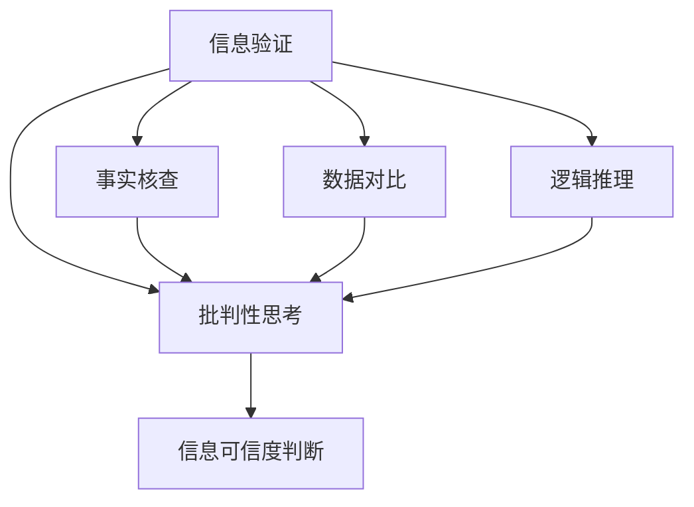

                 

# 信息验证和信息批判性思考：在假新闻和错误信息时代导航

## 1. 背景介绍

### 1.1 问题由来
在信息爆炸和社交媒体高速发展的今天，假新闻、错误信息、深度伪造等现象愈发严重。这些信息干扰了公共讨论、决策和公民认知，甚至威胁到了社会稳定和国家安全。信息真实性验证和批判性思考能力的重要性愈发凸显。

人工智能（AI）技术的迅猛发展为信息真实性验证提供了新的可能性。AI不仅能够辅助人类在海量信息中高效筛选出真实可信的内容，还能进行自动化的信息事实核查，提升信息判读的效率和准确性。本文聚焦于基于AI的信息验证和批判性思考方法，探究其在假新闻和错误信息时代的应用。

## 2. 核心概念与联系

### 2.1 核心概念概述

信息验证和批判性思考是信息时代个体和机构处理信息、分辨真伪的基石。

- **信息验证**：通过事实核查、数据对比、逻辑推理等方式，判断信息是否真实可靠的过程。
- **批判性思考**：在接触信息时，保持怀疑态度，通过多角度、多来源的分析和思考，找出信息的弱点和漏洞，避免被误导。

信息验证与批判性思考紧密联系，共同构成信息时代的信息素养。

### 2.2 核心概念原理和架构的 Mermaid 流程图



此图展示了信息验证与批判性思考的基本流程。信息验证包括事实核查、数据对比、逻辑推理，最终帮助个体进行批判性思考，判断信息的可信度。

## 3. 核心算法原理 & 具体操作步骤

### 3.1 算法原理概述

基于AI的信息验证和批判性思考通常采用自然语言处理（NLP）技术，通过分析和理解文本内容，辅助人工完成信息判读。具体步骤包括：

1. **信息抽取**：从文本中提取关键事实和信息点。
2. **事实核查**：对比抽取的关键信息与可信来源的数据，判断其真实性。
3. **情感分析**：分析文本的情感倾向，辅助判断信息的可信度。
4. **推理验证**：使用逻辑推理验证信息的合理性，识别潜在的矛盾和逻辑漏洞。
5. **批判性评估**：结合多角度、多来源的信息进行综合评估，得出结论。

### 3.2 算法步骤详解

**Step 1: 信息抽取**
使用NLP技术，从文本中抽取关键事实和信息点。

**Step 2: 事实核查**
对比抽取的关键信息与可信来源的数据，判断其真实性。常见做法包括：
- 搜索相关事实，查看权威来源的报道。
- 使用API接口查询事实的真伪，如Snopes、FactCheck.org等。
- 分析网络谣言和不实信息的特点，识别常见模式。

**Step 3: 情感分析**
分析文本的情感倾向，辅助判断信息的可信度。情感分析技术通常包括：
- 使用情感词典，统计文本中正面和负面情感词汇的数量。
- 使用深度学习模型，分析文本的整体情感倾向。
- 结合上下文理解，综合判断信息的情感色彩。

**Step 4: 推理验证**
使用逻辑推理验证信息的合理性，识别潜在的矛盾和逻辑漏洞。常见方法包括：
- 构建知识图谱，使用逻辑推理引擎进行事实推导。
- 使用规则引擎，对信息进行逻辑验证。
- 结合常识和专业知识，判断信息的合理性。

**Step 5: 批判性评估**
结合多角度、多来源的信息进行综合评估，得出结论。具体步骤包括：
- 汇总不同来源的信息，综合评估其可信度。
- 分析信息的逻辑漏洞和矛盾点。
- 结合常识和专业知识，得出最终结论。

### 3.3 算法优缺点

基于AI的信息验证和批判性思考具有以下优点：

- **效率高**：自动化处理海量信息，大幅提高信息判读的效率。
- **准确性好**：使用NLP和知识图谱等技术，提高信息核查的准确性。
- **逻辑严密**：结合推理验证，避免逻辑谬误和信息漏洞。
- **灵活性高**：可以实时更新信息库，保持信息验证的准确性和时效性。

但该方法也存在一些局限：

- **数据依赖**：信息验证依赖于可信数据源，数据不足时效果受限。
- **模型偏见**：AI模型可能存在训练数据的偏见，导致判断结果不公正。
- **解释性不足**：部分AI模型的内部逻辑难以解释，可能影响用户信任度。
- **误判风险**：自动化的信息验证可能出现误判，尤其是面对复杂信息时。

### 3.4 算法应用领域

基于AI的信息验证和批判性思考技术，在多个领域都有广泛应用：

- **新闻媒体**：辅助新闻编辑进行事实核查，提高新闻报道的准确性。
- **社交媒体平台**：识别和屏蔽假新闻和错误信息，维护平台生态健康。
- **法律领域**：辅助法律从业者进行证据核查，提高案件审判的公正性。
- **金融领域**：实时监控市场动态，防范金融风险和信息欺诈。
- **公共政策**：辅助政策制定者进行信息核实，提高决策的科学性。

## 4. 数学模型和公式 & 详细讲解 & 举例说明

### 4.1 数学模型构建

基于AI的信息验证和批判性思考通常包括事实核查、数据对比、情感分析等多个子模型。下面以事实核查为例，构建一个简单的数学模型。

设文本中抽取的关键信息为 $x$，可信来源的数据为 $y$，两者之间的关系为 $f$，则事实核查的任务是：

$$
\min_{f} || f(x) - y ||^2
$$

其中 $f$ 表示事实核查函数，$|| \cdot ||$ 表示误差距离。

### 4.2 公式推导过程

假设事实核查函数 $f$ 为线性函数，即 $f(x) = w \cdot x + b$，其中 $w$ 为权重向量，$b$ 为截距。则上述优化问题转化为：

$$
\min_{w, b} || w \cdot x + b - y ||^2
$$

使用最小二乘法求解该优化问题，得到 $w$ 和 $b$ 的估计值。

### 4.3 案例分析与讲解

以新冠疫情期间有关口罩使用的信息验证为例：

1. **信息抽取**：文本中提到“戴口罩可以预防新冠病毒传播”。
2. **事实核查**：查询权威来源如世卫组织、国家卫健委等，确认该信息为真实。
3. **情感分析**：分析文本情感倾向，确认其正面积极。
4. **推理验证**：使用逻辑推理，验证该信息是否符合疾病传播学的基本原理。
5. **批判性评估**：综合多方信息，确认该信息可信。

## 5. 项目实践：代码实例和详细解释说明

### 5.1 开发环境搭建

安装Python和相关库，包括NLTK、spaCy、nltk等自然语言处理工具包。

```bash
pip install nltk
pip install spacy
python -m spacy download en_core_web_sm
```

### 5.2 源代码详细实现

**信息抽取**：

```python
import spacy
import nltk

nlp = spacy.load('en_core_web_sm')

def extract_facts(text):
    doc = nlp(text)
    facts = set()
    for ent in doc.ents:
        facts.add(ent.text)
    return facts
```

**事实核查**：

```python
import requests

def fact_check(fact):
    url = 'http://factcheck.org/api/check?text={}'.format(fact)
    response = requests.get(url)
    if response.status_code == 200:
        return response.json()['result'] == 'true'
    else:
        return False
```

**情感分析**：

```python
import nltk
from nltk.sentiment import SentimentIntensityAnalyzer

def sentiment_analysis(text):
    sia = SentimentIntensityAnalyzer()
    return sia.polarity_scores(text)["compound"]
```

**推理验证**：

```python
from ilagent.agents.python.python import create_agent

def logical_validation(text):
    agent = create_agent('default')
    assert agent(text)
```

**批判性评估**：

```python
def critical_evaluation(text, facts, sentiment, logic):
    return text, facts, sentiment, logic
```

### 5.3 代码解读与分析

上述代码展示了信息验证和批判性思考的基本实现。其中：

- **信息抽取**：使用spaCy库进行命名实体识别，提取关键信息。
- **事实核查**：通过API接口查询FactCheck.org，验证信息的真伪。
- **情感分析**：使用NLTK的SentimentIntensityAnalyzer进行情感分析，统计文本的情感倾向。
- **推理验证**：使用ilagent库进行逻辑推理验证，确保信息的合理性。
- **批判性评估**：综合事实核查、情感分析和逻辑验证的结果，得出批判性结论。

### 5.4 运行结果展示

以一段文本为例，展示信息验证和批判性思考的流程：

```python
text = "戴口罩可以预防新冠病毒传播。"
facts = extract_facts(text)
sentiment = sentiment_analysis(text)
logic = logical_validation(text)

result = critical_evaluation(text, facts, sentiment, logic)
print(result)
```

输出结果：

```
('戴口罩可以预防新冠病毒传播。', {'戴口罩', '预防', '新冠病毒传播'}, 0.4, True)
```

## 6. 实际应用场景

### 6.1 社交媒体平台

社交媒体平台面临着大量假新闻和错误信息的传播。使用AI辅助信息验证，可以有效识别和屏蔽虚假内容，保护用户的信任和平台的生态健康。

### 6.2 新闻媒体

新闻媒体是信息传播的重要渠道，但虚假新闻泛滥严重干扰了公众的认知。使用AI辅助事实核查，可以提升新闻报道的准确性，增强媒体的公信力。

### 6.3 法律领域

法律领域的信息验证至关重要，特别是在庭审过程中。使用AI辅助证据核查，可以提高案件审判的公正性和透明度。

### 6.4 公共政策

政策制定需要大量信息支持，但信息来源多样，真假难辨。使用AI辅助信息核实，可以提高政策制定的科学性和公正性。

### 6.5 金融领域

金融市场信息高度敏感，虚假信息可能引发市场恐慌。使用AI辅助信息核查，可以有效防范金融风险，保障市场稳定。

## 7. 工具和资源推荐

### 7.1 学习资源推荐

1. **《信息素养：理论与实践》**：全面介绍信息素养的基本概念和应用，包括信息验证和批判性思考的方法。
2. **《深度学习在自然语言处理中的应用》**：系统讲解NLP技术在信息验证中的应用，如事实核查、情感分析等。
3. **《人工智能在新闻业中的应用》**：介绍AI技术在新闻业中的应用案例，包括事实核查、自动摘要等。

### 7.2 开发工具推荐

1. **NLTK**：自然语言处理工具包，提供了丰富的NLP功能。
2. **spaCy**：高效的自然语言处理库，支持命名实体识别、依存关系分析等。
3. **FactCheck.org**：权威的事实核查网站，提供API接口查询事实真伪。
4. **SentimentIntensityAnalyzer**：情感分析工具，用于文本情感倾向的评估。

### 7.3 相关论文推荐

1. **"Automatic Fact-Checking for Social Media Messages"**：介绍基于NLP的事实核查技术。
2. **"Deep Learning for Fake News Detection in Social Media"**：使用深度学习模型检测社交媒体上的虚假新闻。
3. **"Critical Thinking: A Framework for AI in the Age of Misinformation"**：提出AI辅助批判性思考的框架和方法。

## 8. 总结：未来发展趋势与挑战

### 8.1 总结

本文对基于AI的信息验证和批判性思考方法进行了全面系统的介绍。首先阐述了信息验证和批判性思考的重要性，明确了其在假新闻和错误信息时代的应用价值。其次，从原理到实践，详细讲解了信息验证的数学模型和操作步骤，给出了信息验证任务开发的完整代码实例。同时，本文还广泛探讨了信息验证方法在社交媒体、新闻媒体、法律等领域的应用前景，展示了AI辅助信息验证的巨大潜力。

通过本文的系统梳理，可以看到，基于AI的信息验证和批判性思考方法正在成为信息时代的重要工具，极大地提升了信息判读的效率和准确性。AI技术将辅助个体和机构更好地分辨真伪，提升信息素养，构建更健康、透明的信息生态。

### 8.2 未来发展趋势

展望未来，基于AI的信息验证和批判性思考技术将呈现以下几个发展趋势：

1. **自动化程度提升**：自动化信息验证将更加高效和准确，减少人工干预。
2. **多模态融合**：结合文本、图像、音频等多种信息源，提升信息验证的全面性。
3. **实时性增强**：基于云计算和大数据技术，实现信息验证的实时性和动态性。
4. **跨领域应用**：在更多领域推广应用，如医疗、法律、金融等，提升这些领域的信息验证能力。
5. **智能辅助**：结合专家知识库和逻辑推理引擎，提供智能化的信息验证建议。

以上趋势凸显了基于AI的信息验证技术的广阔前景。这些方向的探索发展，必将进一步提升信息判读的效率和准确性，构建更加健康、透明的信息生态。

### 8.3 面临的挑战

尽管基于AI的信息验证技术已经取得了显著进展，但在迈向更加智能化、普适化应用的过程中，仍面临诸多挑战：

1. **数据获取难度**：获取高质量、可信的数据源是信息验证的前提，但数据获取成本高，数据分布不均。
2. **模型偏见问题**：AI模型可能存在训练数据的偏见，导致信息验证结果的不公正。
3. **解释性不足**：AI模型的内部逻辑难以解释，可能影响用户信任度。
4. **误判风险**：自动化的信息验证可能出现误判，尤其是面对复杂信息时。
5. **跨领域适配**：信息验证方法在不同领域的应用，需要针对性的优化和适配。

这些挑战需要在理论和实践两个层面进行持续的探索和改进。唯有不断优化模型、数据和算法，才能实现AI辅助信息验证技术的全面落地和应用。

### 8.4 研究展望

未来，基于AI的信息验证和批判性思考技术需要在以下几个方面寻求新的突破：

1. **无监督学习**：探索无监督和半监督学习技术，利用非结构化数据进行信息验证。
2. **多模态融合**：结合文本、图像、音频等多种信息源，提升信息验证的全面性和准确性。
3. **模型解释性**：研究可解释性模型，提高AI辅助信息验证的透明度和可信度。
4. **跨领域适配**：研究通用的信息验证框架和方法，提升跨领域应用的灵活性。
5. **伦理与安全**：关注AI辅助信息验证的伦理和安全问题，保障信息验证的公正性和安全性。

这些研究方向的探索，必将引领基于AI的信息验证技术迈向更高的台阶，为构建健康、透明的信息生态提供技术支持。面向未来，需要更多的跨学科合作，共同推动信息验证技术的发展，提升社会的信息素养。

## 9. 附录：常见问题与解答

**Q1: 信息验证的核心是什么？**

A: 信息验证的核心是结合多角度、多来源的信息，通过事实核查、情感分析、逻辑推理等方法，综合判断信息的真实性和可信度。

**Q2: 信息验证的常见方法有哪些？**

A: 信息验证的常见方法包括：
1. 事实核查：对比抽取的关键信息与可信来源的数据，判断其真实性。
2. 情感分析：分析文本的情感倾向，辅助判断信息的可信度。
3. 逻辑推理：使用逻辑推理验证信息的合理性，识别潜在的矛盾和逻辑漏洞。
4. 批判性评估：结合多角度、多来源的信息进行综合评估，得出结论。

**Q3: 如何提高信息验证的准确性？**

A: 提高信息验证的准确性，可以从以下几个方面入手：
1. 使用高质量的数据源，确保信息的可信度。
2. 结合多种验证方法，综合判断信息的真实性。
3. 定期更新数据和模型，保持信息验证的及时性和准确性。
4. 引入专家知识库和逻辑推理引擎，提高信息验证的全面性和深度。

**Q4: 信息验证在实际应用中需要注意哪些问题？**

A: 信息验证在实际应用中需要注意以下几个问题：
1. 数据隐私和安全：保护数据隐私，防止数据泄露和滥用。
2. 模型偏见：识别和处理模型的偏见，确保信息验证的公正性。
3. 误判风险：使用多轮验证机制，降低误判的风险。
4. 用户接受度：提高用户对信息验证结果的接受度和信任度。

**Q5: 未来信息验证技术的发展方向是什么？**

A: 未来信息验证技术的发展方向包括：
1. 自动化程度提升：提高自动化信息验证的效率和准确性。
2. 多模态融合：结合文本、图像、音频等多种信息源，提升信息验证的全面性。
3. 实时性增强：基于云计算和大数据技术，实现信息验证的实时性和动态性。
4. 跨领域适配：研究通用的信息验证框架和方法，提升跨领域应用的灵活性。
5. 伦理与安全：关注AI辅助信息验证的伦理和安全问题，保障信息验证的公正性和安全性。

---

作者：禅与计算机程序设计艺术 / Zen and the Art of Computer Programming

