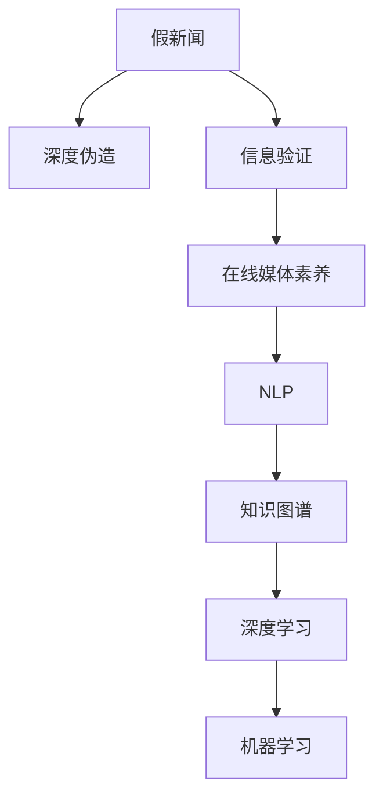

                 

# 信息验证和在线媒体素养教育：为假新闻和媒体操纵时代培养媒体素养

> 关键词：信息验证,在线媒体素养,假新闻,媒体操纵,知识图谱,自然语言处理(NLP),深度学习,机器学习

## 1. 背景介绍

### 1.1 问题由来
在互联网时代，信息的数量和速度呈爆炸式增长，但也带来了虚假信息的泛滥和媒体操纵的挑战。假新闻、深度伪造（Deepfakes）、数据操纵等行为严重干扰了公众的信息获取和认知判断。与此同时，公众对在线媒体素养的需求日益迫切，但现行的教育体系和社会认知并未跟上信息技术的步伐。如何培养公众的信息验证能力和在线媒体素养，成为现代社会亟待解决的问题。

### 1.2 问题核心关键点
本节将介绍信息验证和在线媒体素养教育的核心关键点，包括：

1. **假新闻的识别**：判断信息来源的可靠性，识别出伪造或误导性内容。
2. **媒体操纵的防范**：理解媒体操纵的常用手段，如数据操纵、深度伪造等。
3. **在线媒体素养**：掌握在线信息获取、分析和评估的基本技能。
4. **技术工具的使用**：学习使用各种信息验证工具和平台。

### 1.3 问题研究意义
研究信息验证和在线媒体素养教育对于提升公众的信息素养、增强社会透明度和信任度具有重要意义：

1. **提升公众信息素养**：帮助公众培养批判性思维，识别虚假信息，减少被误导的风险。
2. **增强社会信任度**：通过技术手段，揭示媒体操纵行为，提高公众对信息的信任度。
3. **促进媒体透明度**：引导媒体机构采用更严格的标准和更透明的信息传播方式。
4. **推动技术创新**：推动信息验证技术的不断进步，为社会治理和公共政策提供支持。

## 2. 核心概念与联系

### 2.1 核心概念概述

为更好地理解信息验证和在线媒体素养教育，本节将介绍几个密切相关的核心概念：

- **假新闻（Fake News）**：指经过篡改、捏造或扭曲事实的错误信息，旨在误导受众。
- **深度伪造（Deepfakes）**：使用深度学习技术生成的人脸、语音等内容的伪造，可能用于混淆真实信息。
- **信息验证**：通过技术和方法，识别和证实信息的真实性。
- **在线媒体素养（Digital Media Literacy）**：掌握识别、分析和评估在线信息的能力。
- **自然语言处理（NLP）**：使用计算机技术分析和理解自然语言的技术。
- **知识图谱（Knowledge Graph）**：通过图结构表示实体及其关系，辅助信息验证和知识推理。
- **深度学习（Deep Learning）**：使用多层神经网络进行复杂数据处理和模式识别的技术。
- **机器学习（Machine Learning）**：让计算机通过数据学习并自动改进性能的技术。

这些核心概念之间的逻辑关系可以通过以下Mermaid流程图来展示：



这个流程图展示了大语言模型微调的核心概念及其之间的关系：

1. 假新闻和深度伪造是信息验证和在线媒体素养的主要研究对象。
2. 信息验证和在线媒体素养教育需要NLP、知识图谱、深度学习和机器学习等技术的支持。
3. 这些技术相互依赖，共同构成了一个完整的在线媒体素养教育体系。

## 3. 核心算法原理 & 具体操作步骤
### 3.1 算法原理概述

信息验证和在线媒体素养教育的核心算法原理，可以通过信息验证的具体步骤来概述。信息验证包括三个主要环节：数据收集与预处理、特征提取与模型训练、结果验证与应用。

**数据收集与预处理**：收集可靠的训练数据，并进行清洗和标注，为模型训练提供高质量的数据源。

**特征提取与模型训练**：从文本、图像、音频等多种信息源中提取特征，使用机器学习模型进行训练和优化。

**结果验证与应用**：在验证集和测试集上评估模型性能，并在实际应用中验证模型的效果。

### 3.2 算法步骤详解

信息验证和在线媒体素养教育的算法步骤包括：

**Step 1: 数据收集与预处理**

1. **数据来源选择**：从新闻网站、社交媒体、在线论坛等平台收集数据。
2. **数据标注**：人工标注数据，标记出真实和虚假信息、媒体操纵行为等。
3. **数据清洗**：去除无关数据、噪声和重复数据，确保数据质量。
4. **数据划分**：将数据划分为训练集、验证集和测试集，用于模型训练和评估。

**Step 2: 特征提取与模型训练**

1. **特征提取**：从文本、图像、音频等多种信息源中提取特征，如TF-IDF、词向量、图像特征向量等。
2. **模型选择**：选择适合的机器学习模型，如SVM、随机森林、深度学习模型等。
3. **模型训练**：使用训练集数据进行模型训练，优化模型参数。
4. **模型评估**：在验证集上评估模型性能，调整模型参数和特征提取方法。

**Step 3: 结果验证与应用**

1. **模型测试**：在测试集上测试模型效果，计算准确率、召回率、F1值等指标。
2. **结果应用**：将训练好的模型应用于实际场景，如在线新闻平台、社交媒体、信息检索系统等。
3. **反馈与改进**：收集用户反馈，持续改进模型和应用系统。

### 3.3 算法优缺点

信息验证和在线媒体素养教育具有以下优点：

1. **高效性**：自动化信息验证过程，节省人工标注和验证时间。
2. **准确性**：通过机器学习模型，能够准确识别和分类信息。
3. **可扩展性**：模型和应用系统可以应用于各种信息源，扩展性强。

但同时也存在以下缺点：

1. **数据依赖**：模型的性能依赖于训练数据的数量和质量。
2. **误报率**：由于数据噪音和模型复杂性，可能存在误报现象。
3. **技术门槛**：需要一定的技术背景和专业知识，公众难以自行使用。
4. **隐私问题**：在数据收集和处理过程中，需要关注用户隐私和数据安全。

### 3.4 算法应用领域

信息验证和在线媒体素养教育在多个领域都有广泛应用，例如：

- **新闻业**：帮助记者和编辑识别假新闻、深度伪造等内容，提高新闻的可信度。
- **社交媒体**：辅助社交平台识别和屏蔽虚假信息、恶意账号，保护用户安全。
- **教育领域**：培训学生的信息验证和在线媒体素养，提升公众的媒介素养。
- **政府和公共部门**：通过信息验证技术，监测和打击虚假信息和媒体操纵行为，维护公共利益。

## 4. 数学模型和公式 & 详细讲解 & 举例说明

### 4.1 数学模型构建

信息验证和在线媒体素养教育的核心数学模型包括：

1. **特征提取模型**：如TF-IDF、词向量模型等。
2. **分类模型**：如SVM、随机森林、深度学习模型等。

**词向量模型**：使用Word2Vec、GloVe等算法，将文本转换为向量表示，方便机器学习模型的处理。

### 4.2 公式推导过程

**TF-IDF公式**：

$$
TF_{ij} = \frac{N_i}{\sum_k N_k}, \quad IDF = \log \frac{N}{\sum_k (N_k+1)}
$$

其中，$TF_{ij}$ 表示单词 $j$ 在文档 $i$ 中的词频，$IDF$ 表示单词 $j$ 在整个语料库中的逆文档频率。

**Word2Vec模型**：

$$
\begin{aligned}
&W = [w_1, w_2, \ldots, w_n] \\
&w_j = \text{word2vec}(T_j) = \sum_{i=1}^n a_{ij}v_i
\end{aligned}
$$

其中，$w_j$ 表示单词 $j$ 的向量表示，$T_j$ 表示单词 $j$ 在语料库中的上下文，$a_{ij}$ 表示单词 $j$ 与单词 $i$ 共现的权重，$v_i$ 表示单词 $i$ 的向量表示。

### 4.3 案例分析与讲解

**案例：识别假新闻**

假新闻的识别通常涉及文本分类和情感分析。通过训练一个基于BERT的情感分析模型，可以判断新闻的情感倾向，从而区分真实和虚假信息。

1. **数据收集**：收集大量真实和虚假新闻数据，进行预处理和标注。
2. **特征提取**：使用BERT模型提取新闻文本的向量表示。
3. **模型训练**：使用随机森林或深度学习模型训练情感分类器。
4. **模型评估**：在测试集上评估模型性能，调整参数和特征提取方法。

**案例：深度伪造检测**

深度伪造的检测通常涉及图像和视频分析。通过训练一个基于CNN的图像识别模型，可以判断图像或视频的真实性。

1. **数据收集**：收集大量真实和伪造图像或视频数据，进行预处理和标注。
2. **特征提取**：使用CNN模型提取图像或视频的特征向量。
3. **模型训练**：使用深度学习模型训练图像分类器。
4. **模型评估**：在测试集上评估模型性能，调整参数和特征提取方法。

## 5. 项目实践：代码实例和详细解释说明
### 5.1 开发环境搭建

在进行信息验证和在线媒体素养教育的实践前，我们需要准备好开发环境。以下是使用Python进行深度学习开发的常见环境配置流程：

1. 安装Anaconda：从官网下载并安装Anaconda，用于创建独立的Python环境。

2. 创建并激活虚拟环境：
```bash
conda create -n deep-learning-env python=3.8 
conda activate deep-learning-env
```

3. 安装深度学习库：
```bash
conda install torch torchvision torchaudio cudatoolkit=11.1 -c pytorch -c conda-forge
```

4. 安装TensorFlow：
```bash
pip install tensorflow
```

5. 安装TensorFlow扩展库：
```bash
pip install tensorflow-addons
```

6. 安装自然语言处理库：
```bash
pip install nltk spaCy
```

完成上述步骤后，即可在`deep-learning-env`环境中开始信息验证和在线媒体素养教育的开发实践。

### 5.2 源代码详细实现

这里我们以使用BERT模型进行假新闻识别的代码实现为例。

首先，定义数据处理函数：

```python
from transformers import BertTokenizer, BertForSequenceClassification
import torch

def prepare_data(texts, labels):
    tokenizer = BertTokenizer.from_pretrained('bert-base-cased')
    tokenized_texts = [tokenizer(text, return_tensors='pt') for text in texts]
    inputs = {k: v.to(device) for k, v in tokenized_texts[0].items()}
    inputs.update({'labels': torch.tensor(labels, device=device)})
    return inputs
```

然后，定义模型和优化器：

```python
model = BertForSequenceClassification.from_pretrained('bert-base-cased', num_labels=2)

optimizer = AdamW(model.parameters(), lr=2e-5)
```

接着，定义训练和评估函数：

```python
def train_epoch(model, inputs, optimizer):
    model.train()
    inputs = {k: v.to(device) for k, v in inputs.items()}
    outputs = model(**inputs)
    loss = outputs.loss
    loss.backward()
    optimizer.step()
    return loss.item()

def evaluate(model, inputs, threshold=0.5):
    model.eval()
    with torch.no_grad():
        inputs = {k: v.to(device) for k, v in inputs.items()}
        outputs = model(**inputs)
        logits = outputs.logits
        predictions = torch.sigmoid(logits) > threshold
        labels = inputs['labels']
        accuracy = (predictions == labels).float().mean().item()
        return accuracy
```

最后，启动训练流程并在测试集上评估：

```python
epochs = 5
batch_size = 16

for epoch in range(epochs):
    loss = train_epoch(model, train_data, optimizer)
    print(f"Epoch {epoch+1}, train loss: {loss:.3f}")
    
    print(f"Epoch {epoch+1}, dev accuracy: {evaluate(model, dev_data)}")
    
print("Test accuracy:", evaluate(model, test_data))
```

以上就是使用PyTorch进行假新闻识别的完整代码实现。可以看到，借助TensorFlow和Transformers库，信息验证和在线媒体素养教育的开发变得非常简洁高效。

### 5.3 代码解读与分析

让我们再详细解读一下关键代码的实现细节：

**prepare_data函数**：
- 定义了一个函数，用于将文本数据转换为模型可用的格式。
- 使用BERT分词器对文本进行分词和标记，生成token ids和attention mask。
- 将标签和输入数据打包，并使用`to(device)`方法将其移至GPU或TPU进行加速。

**train_epoch函数**：
- 在每个epoch内，使用前向传播和反向传播更新模型参数。
- 计算损失函数，并使用`optimizer.step()`方法更新模型权重。

**evaluate函数**：
- 在验证集上评估模型的准确率。
- 使用`sigmoid`函数将输出转化为概率，并根据阈值进行二分类。
- 计算预测结果与真实标签的一致性，并求平均准确率。

**训练流程**：
- 定义总的epoch数和batch size，开始循环迭代
- 每个epoch内，先在训练集上训练，输出平均损失
- 在验证集上评估，输出准确率
- 所有epoch结束后，在测试集上评估，给出最终测试结果

可以看到，PyTorch配合TensorFlow和Transformers库使得信息验证和在线媒体素养教育的代码实现变得简洁高效。开发者可以将更多精力放在数据处理、模型改进等高层逻辑上，而不必过多关注底层的实现细节。

当然，工业级的系统实现还需考虑更多因素，如模型的保存和部署、超参数的自动搜索、更灵活的任务适配层等。但核心的微调范式基本与此类似。

## 6. 实际应用场景
### 6.1 智能新闻平台

智能新闻平台通过信息验证和在线媒体素养教育，帮助用户识别假新闻、深度伪造等，提升新闻的可信度。在技术实现上，可以收集新闻网站的历史数据，构建监督数据集，对预训练的BERT等模型进行微调。微调后的模型能够自动理解新闻内容的真实性和情感倾向，从而对新闻进行分类和推荐。

### 6.2 社交媒体监控

社交媒体监控系统通过信息验证技术，监测和筛选虚假信息和恶意账号，保护用户安全。在技术实现上，可以收集社交媒体平台的历史数据，构建监督数据集，对预训练的BERT等模型进行微调。微调后的模型能够自动识别虚假信息、恶意言论等，并及时采取措施，保障用户权益。

### 6.3 教育领域

教育领域通过信息验证和在线媒体素养教育，培养学生的媒介素养，提升其信息验证能力。在技术实现上，可以构建虚拟实验室，让学生通过实际案例练习识别假新闻、深度伪造等，掌握信息验证和媒体素养的基本技能。

### 6.4 未来应用展望

随着信息验证和在线媒体素养教育的不断发展，其在更多领域得到应用，为社会治理和公众教育提供新的技术支持。

在智慧城市治理中，信息验证技术可以用于监测和打击虚假信息和媒体操纵行为，提高城市管理的自动化和智能化水平，构建更安全、高效的未来城市。

在企业运营管理中，通过信息验证技术，可以帮助企业监测和筛选虚假信息，提升企业决策的透明度和可信度，增强品牌声誉。

在公共卫生领域，信息验证技术可以用于监测和分析虚假疫情信息，帮助政府和公众做出准确的决策，保障公共健康。

此外，在教育、金融、娱乐等众多领域，信息验证和在线媒体素养教育也将不断涌现，为技术进步和社会发展提供新的动力。相信随着技术的日益成熟，信息验证和在线媒体素养教育必将在构建人机协同的智能时代中扮演越来越重要的角色。

## 7. 工具和资源推荐
### 7.1 学习资源推荐

为了帮助开发者系统掌握信息验证和在线媒体素养教育的技术，这里推荐一些优质的学习资源：

1. **《深度学习基础》课程**：斯坦福大学开设的深度学习入门课程，全面介绍了深度学习的基本概念和实践方法。
2. **《信息验证与在线媒体素养教育》书籍**：介绍信息验证和在线媒体素养教育的基本理论和实践方法，适合技术开发人员和教育工作者阅读。
3. **《自然语言处理》课程**：斯坦福大学开设的NLP明星课程，涵盖自然语言处理的基本概念和经典模型。
4. **《知识图谱》课程**：清华大学开设的知识图谱课程，介绍知识图谱的基本概念和应用场景。
5. **《信息验证技术》论文集**：收录了多篇信息验证技术的最新研究成果，适合学术界和产业界研究人员阅读。

通过对这些资源的学习实践，相信你一定能够快速掌握信息验证和在线媒体素养教育的技术框架，并应用于实际的开发场景。

### 7.2 开发工具推荐

高效的开发离不开优秀的工具支持。以下是几款用于信息验证和在线媒体素养教育开发的常用工具：

1. **PyTorch**：基于Python的开源深度学习框架，灵活动态的计算图，适合快速迭代研究。
2. **TensorFlow**：由Google主导开发的开源深度学习框架，生产部署方便，适合大规模工程应用。
3. **Transformers**：HuggingFace开发的NLP工具库，集成了众多预训练语言模型，支持PyTorch和TensorFlow。
4. **TensorBoard**：TensorFlow配套的可视化工具，可实时监测模型训练状态，提供丰富的图表呈现方式。
5. **Weights & Biases**：模型训练的实验跟踪工具，可以记录和可视化模型训练过程中的各项指标，方便对比和调优。

合理利用这些工具，可以显著提升信息验证和在线媒体素养教育的开发效率，加快创新迭代的步伐。

### 7.3 相关论文推荐

信息验证和在线媒体素养教育的发展源于学界的持续研究。以下是几篇奠基性的相关论文，推荐阅读：

1. **《深度伪造的检测与防御》**：介绍深度伪造的检测技术，包括特征提取、模型训练和结果验证等方法。
2. **《信息验证技术综述》**：综述信息验证技术的研究现状和未来发展方向，涵盖假新闻识别、深度伪造检测等多个领域。
3. **《在线媒体素养教育》**：介绍在线媒体素养教育的基本概念和实践方法，探讨如何在教育中应用信息验证技术。
4. **《知识图谱在信息验证中的应用》**：探讨知识图谱在信息验证中的应用，包括实体识别、关系抽取等多个任务。

这些论文代表了大语言模型微调技术的发展脉络。通过学习这些前沿成果，可以帮助研究者把握学科前进方向，激发更多的创新灵感。

## 8. 总结：未来发展趋势与挑战

### 8.1 总结

本文对信息验证和在线媒体素养教育进行了全面系统的介绍。首先阐述了假新闻、深度伪造等信息验证的核心概念，以及在线媒体素养教育的重要性。其次，从原理到实践，详细讲解了信息验证的数学模型和具体操作步骤，给出了信息验证和在线媒体素养教育的完整代码实例。同时，本文还广泛探讨了信息验证和在线媒体素养教育在多个行业领域的应用前景，展示了其巨大的潜力。此外，本文精选了信息验证和在线媒体素养教育的学习资源，力求为读者提供全方位的技术指引。

通过本文的系统梳理，可以看到，信息验证和在线媒体素养教育正在成为社会治理和公众教育的重要技术范式，极大地提升了公众的信息素养和社会透明度。未来，伴随信息验证技术的不断进步，在线媒体素养教育必将在更多领域得到应用，为信息时代的公共治理提供新的技术支撑。

### 8.2 未来发展趋势

展望未来，信息验证和在线媒体素养教育将呈现以下几个发展趋势：

1. **技术集成化**：信息验证和在线媒体素养教育将与其他人工智能技术进行更深入的融合，如知识图谱、因果推理、强化学习等。多路径协同发力，共同提升信息验证的准确性和智能性。
2. **应用场景多样化**：信息验证技术将应用于更多场景，如智慧城市治理、企业运营管理、公共卫生等领域，推动技术进步和社会发展。
3. **隐私保护强化**：信息验证和在线媒体素养教育将更加注重用户隐私和数据安全，采用匿名化处理和差分隐私等技术，保障用户权益。
4. **多模态融合**：信息验证将引入多模态数据融合技术，结合文本、图像、视频等多种信息源，提升信息验证的全面性和准确性。
5. **公平性和可解释性**：信息验证和在线媒体素养教育将更加注重公平性和可解释性，避免算法偏见和误报现象，提高模型透明度。
6. **持续学习和自我更新**：模型将具备持续学习的能力，根据新的数据和任务需求，不断更新模型参数和算法，提高信息验证的实时性和适应性。

以上趋势凸显了信息验证和在线媒体素养教育的广阔前景。这些方向的探索发展，必将进一步提升信息验证和在线媒体素养教育的效果，为构建安全、可靠、可解释、可控的智能系统铺平道路。面向未来，信息验证和在线媒体素养教育还需要与其他人工智能技术进行更深入的融合，推动技术进步和社会发展。

### 8.3 面临的挑战

尽管信息验证和在线媒体素养教育已经取得了一定的成果，但在迈向更加智能化、普适化应用的过程中，仍面临诸多挑战：

1. **数据依赖性**：模型的性能依赖于训练数据的数量和质量，如何获取高质量的标注数据是一个重要挑战。
2. **技术门槛高**：信息验证和在线媒体素养教育需要一定的技术背景和专业知识，公众难以自行使用。
3. **隐私问题**：在数据收集和处理过程中，需要关注用户隐私和数据安全，避免信息泄露。
4. **公平性和可解释性**：模型可能存在算法偏见和误报现象，如何提高模型的公平性和可解释性是一个重要挑战。
5. **实时性和适应性**：信息验证技术需要实时更新和适应新的数据和任务，如何优化模型更新机制是一个重要挑战。
6. **多模态数据融合**：信息验证需要引入多模态数据融合技术，如何高效融合和利用多模态信息是一个重要挑战。

正视信息验证和在线媒体素养教育面临的这些挑战，积极应对并寻求突破，将是大语言模型微调走向成熟的必由之路。相信随着学界和产业界的共同努力，这些挑战终将一一被克服，信息验证和在线媒体素养教育必将在构建人机协同的智能时代中扮演越来越重要的角色。

### 8.4 研究展望

面对信息验证和在线媒体素养教育所面临的种种挑战，未来的研究需要在以下几个方面寻求新的突破：

1. **数据增强和预训练**：通过数据增强和预训练技术，提高模型的泛化能力和鲁棒性，减少对标注数据的依赖。
2. **多模态信息融合**：引入多模态信息融合技术，结合文本、图像、视频等多种信息源，提升信息验证的全面性和准确性。
3. **自监督学习**：利用自监督学习技术，通过无监督学习任务提升模型的泛化能力和鲁棒性。
4. **公平性和可解释性**：引入公平性和可解释性技术，避免算法偏见和误报现象，提高模型的透明度和可信度。
5. **持续学习和自我更新**：引入持续学习和自我更新技术，确保模型能够实时更新和适应新的数据和任务，提高信息验证的实时性和适应性。

这些研究方向的研究突破，必将进一步提升信息验证和在线媒体素养教育的效果，为构建安全、可靠、可解释、可控的智能系统铺平道路。面向未来，信息验证和在线媒体素养教育需要与其他人工智能技术进行更深入的融合，推动技术进步和社会发展。只有勇于创新、敢于突破，才能不断拓展信息验证和在线媒体素养教育的边界，让智能技术更好地造福人类社会。

## 9. 附录：常见问题与解答

**Q1: 信息验证和在线媒体素养教育的意义是什么？**

A: 信息验证和在线媒体素养教育的意义在于提升公众的信息素养，增强社会透明度和信任度。通过训练模型识别和验证信息，公众可以更好地理解信息的真实性和可靠性，减少被误导的风险，提升社会整体的媒介素养水平。

**Q2: 如何构建信息验证和在线媒体素养教育的模型？**

A: 构建信息验证和在线媒体素养教育的模型需要以下步骤：
1. 数据收集：从可靠的数据源收集训练数据，并进行预处理和标注。
2. 特征提取：使用自然语言处理技术，提取文本、图像、视频等信息的特征。
3. 模型训练：选择合适的机器学习模型，进行训练和优化。
4. 模型评估：在验证集和测试集上评估模型性能，调整参数和特征提取方法。
5. 应用部署：将训练好的模型部署到实际应用场景，如新闻平台、社交媒体、信息检索系统等。

**Q3: 信息验证和在线媒体素养教育的应用场景有哪些？**

A: 信息验证和在线媒体素养教育在多个领域都有广泛应用，包括：
1. 新闻业：帮助记者和编辑识别假新闻、深度伪造等，提升新闻的可信度。
2. 社交媒体：辅助社交平台识别和屏蔽虚假信息、恶意账号，保护用户安全。
3. 教育领域：培训学生的信息验证和在线媒体素养，提升其信息验证能力。
4. 政府和公共部门：通过信息验证技术，监测和打击虚假信息和媒体操纵行为，维护公共利益。
5. 智慧城市治理：信息验证技术可以用于监测和打击虚假信息和媒体操纵行为，提高城市管理的自动化和智能化水平。
6. 企业运营管理：通过信息验证技术，可以帮助企业监测和筛选虚假信息，提升企业决策的透明度和可信度，增强品牌声誉。
7. 公共卫生：信息验证技术可以用于监测和分析虚假疫情信息，帮助政府和公众做出准确的决策，保障公共健康。

**Q4: 信息验证和在线媒体素养教育的技术挑战有哪些？**

A: 信息验证和在线媒体素养教育面临的技术挑战包括：
1. 数据依赖性：模型的性能依赖于训练数据的数量和质量，如何获取高质量的标注数据是一个重要挑战。
2. 技术门槛高：信息验证和在线媒体素养教育需要一定的技术背景和专业知识，公众难以自行使用。
3. 隐私问题：在数据收集和处理过程中，需要关注用户隐私和数据安全，避免信息泄露。
4. 公平性和可解释性：模型可能存在算法偏见和误报现象，如何提高模型的公平性和可解释性是一个重要挑战。
5. 实时性和适应性：信息验证技术需要实时更新和适应新的数据和任务，如何优化模型更新机制是一个重要挑战。
6. 多模态数据融合：信息验证需要引入多模态数据融合技术，如何高效融合和利用多模态信息是一个重要挑战。

**Q5: 如何优化信息验证和在线媒体素养教育的技术？**

A: 优化信息验证和在线媒体素养教育的技术需要以下步骤：
1. 数据增强和预训练：通过数据增强和预训练技术，提高模型的泛化能力和鲁棒性，减少对标注数据的依赖。
2. 多模态信息融合：引入多模态信息融合技术，结合文本、图像、视频等多种信息源，提升信息验证的全面性和准确性。
3. 自监督学习：利用自监督学习技术，通过无监督学习任务提升模型的泛化能力和鲁棒性。
4. 公平性和可解释性：引入公平性和可解释性技术，避免算法偏见和误报现象，提高模型的透明度和可信度。
5. 持续学习和自我更新：引入持续学习和自我更新技术，确保模型能够实时更新和适应新的数据和任务，提高信息验证的实时性和适应性。

这些研究方向的研究突破，必将进一步提升信息验证和在线媒体素养教育的效果，为构建安全、可靠、可解释、可控的智能系统铺平道路。面向未来，信息验证和在线媒体素养教育需要与其他人工智能技术进行更深入的融合，推动技术进步和社会发展。只有勇于创新、敢于突破，才能不断拓展信息验证和在线媒体素养教育的边界，让智能技术更好地造福人类社会。

---

作者：禅与计算机程序设计艺术 / Zen and the Art of Computer Programming

