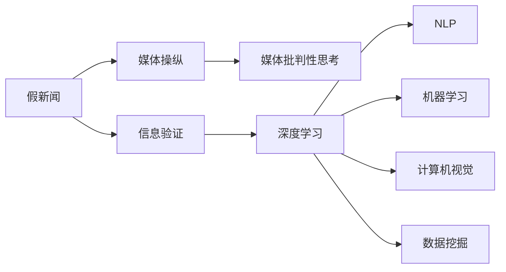

                 

# 信息验证和媒体批判性思考：在假新闻和媒体操纵时代导航

## 1. 背景介绍

在假新闻和媒体操纵日益严重的今天，信息验证和媒体批判性思考显得尤为重要。假新闻不仅混淆公众视听，干扰社会秩序，还可能给个人生活带来不良影响。媒体操纵则可能通过选择性报道、误导性标题等方式误导公众，影响政治决策和社会情绪。因此，如何识别假新闻、批判性思考媒体报道、保护用户免受信息误导，成为信息时代技术发展的迫切需求。

## 2. 核心概念与联系

### 2.1 核心概念概述

为更好地理解如何通过技术手段进行信息验证和媒体批判性思考，本节将介绍几个关键概念：

- 假新闻(Fake News)：指故意捏造、歪曲或误导性报道的新闻内容，旨在通过不实信息误导公众，达到某种政治、经济或其他目的。
- 媒体操纵(Media Manipulation)：指媒体通过有选择性地报道、误导性标题、视觉欺骗等手段，引导公众舆论，影响社会情绪和决策。
- 信息验证(Information Verification)：指通过技术手段确认新闻或信息的真实性和准确性，确保用户不会受到虚假信息的误导。
- 媒体批判性思考(Critical Thinking in Media)：指培养用户对媒体报道的质疑精神，能够独立思考、辨别真伪，不被媒体操纵左右。
- 深度学习(Deep Learning)：通过多层神经网络结构，处理大规模非结构化数据，实现模式识别和预测。
- 自然语言处理(Natural Language Processing, NLP)：使计算机能够理解、分析和生成人类语言，实现信息自动化处理。
- 机器学习(Machine Learning)：通过算法和模型训练，使计算机系统具备自主学习、自我优化的能力。
- 计算机视觉(Computer Vision)：使计算机能够识别、分析和理解图像、视频等视觉数据。
- 数据挖掘(Data Mining)：从大量数据中挖掘出有价值的信息，辅助决策支持。

这些核心概念之间的关系可以通过以下Mermaid流程图来展示：



这个流程图展示了信息验证和媒体批判性思考的核心概念及其之间的关系：

1. 假新闻通过信息验证和媒体批判性思考被识别和揭露。
2. 媒体操纵需要通过媒体批判性思考加以识别和抵制。
3. 深度学习、自然语言处理、机器学习、计算机视觉和数据挖掘技术为信息验证和媒体批判性思考提供了技术支持。

## 3. 核心算法原理 & 具体操作步骤

### 3.1 算法原理概述

基于深度学习和计算机视觉的信息验证和媒体批判性思考方法，本质上是一种利用机器学习模型对新闻和媒体报道进行自动化处理和分析的过程。其核心思想是：通过训练有监督或无监督的机器学习模型，识别新闻中的异常模式、偏见和误导信息，并自动标注和报告。

具体步骤如下：

1. **数据收集与预处理**：收集大量的新闻文章、社交媒体帖子、图像和视频等数据，清洗和标注数据集，去除噪声和无关数据。
2. **特征提取与表示**：使用NLP技术提取文本特征，如TF-IDF、Word2Vec、BERT等，或使用计算机视觉技术提取图像和视频特征，如卷积神经网络(CNN)、Inception、ResNet等。
3. **模型训练与优化**：在标注数据上训练深度学习模型，如循环神经网络(RNN)、长短期记忆网络(LSTM)、卷积神经网络(CNN)等，优化模型的预测能力和泛化能力。
4. **模型验证与评估**：使用验证集对模型进行验证和评估，调整模型参数和结构，提升模型的准确率和召回率。
5. **模型部署与应用**：将训练好的模型部署到实际应用中，实现自动化信息验证和媒体批判性思考，帮助用户识别假新闻和媒体操纵。

### 3.2 算法步骤详解

以下以图像和视频内容的信息验证为例，详细讲解算法步骤：

**Step 1: 数据收集与预处理**

1. **数据收集**：收集包含假新闻的图片和视频，并进行人工标注，标识出图像中的误导信息、错误事实、虚假信息等。
2. **数据清洗**：去除低质量、不相关的数据，保留高质量的标注数据。
3. **数据增强**：通过旋转、缩放、裁剪等操作增加数据多样性，避免模型过拟合。

**Step 2: 特征提取与表示**

1. **文本特征提取**：使用NLP技术提取文本特征，如TF-IDF、Word2Vec、BERT等。
2. **图像和视频特征提取**：使用计算机视觉技术提取图像和视频特征，如卷积神经网络(CNN)、Inception、ResNet等。

**Step 3: 模型训练与优化**

1. **模型选择**：选择合适的深度学习模型，如循环神经网络(RNN)、长短期记忆网络(LSTM)、卷积神经网络(CNN)等。
2. **模型训练**：在标注数据上训练模型，优化模型参数和结构，提升模型的预测能力和泛化能力。
3. **模型验证**：在验证集上验证模型性能，调整模型参数和结构，提升模型的准确率和召回率。

**Step 4: 模型验证与评估**

1. **性能评估**：使用测试集评估模型性能，计算准确率、召回率、F1分数等指标。
2. **误差分析**：分析模型误判的原因，调整模型参数和结构，提升模型的性能。

**Step 5: 模型部署与应用**

1. **模型部署**：将训练好的模型部署到实际应用中，如新闻网站、社交媒体平台等。
2. **自动化验证**：对用户提交的新闻和媒体内容进行自动化验证，自动识别误导信息、虚假信息等。
3. **结果反馈**：将验证结果反馈给用户，帮助用户识别和防范假新闻和媒体操纵。

### 3.3 算法优缺点

基于深度学习和计算机视觉的信息验证和媒体批判性思考方法具有以下优点：

1. **高效性**：自动化处理大量数据，快速识别和报告假新闻和媒体操纵。
2. **准确性**：使用深度学习模型进行特征提取和模式识别，提高了识别准确率。
3. **可扩展性**：适用于多种媒体形式，如文本、图片、视频等，具有广泛的应用场景。

同时，该方法也存在一定的局限性：

1. **数据依赖性**：模型的训练效果依赖于标注数据的质量和数量，获取高质量标注数据成本较高。
2. **模型鲁棒性**：深度学习模型可能存在过拟合现象，对新出现的误导信息可能识别能力不足。
3. **隐私问题**：自动化的信息验证和媒体批判性思考可能涉及用户隐私，需要设计隐私保护机制。
4. **用户依赖性**：用户对模型结果的信任度可能影响信息验证的效果，需要引导用户合理使用。

尽管存在这些局限性，但就目前而言，基于深度学习和计算机视觉的方法是识别假新闻和媒体操纵的最有效手段。未来相关研究的方向在于如何进一步提高模型的泛化能力、减少对标注数据的依赖，同时兼顾隐私保护和用户参与度。

### 3.4 算法应用领域

基于深度学习和计算机视觉的信息验证和媒体批判性思考方法，已经在多个领域得到了广泛应用，例如：

- 社交媒体平台：如Facebook、Twitter等，对用户上传的图片和视频进行自动化验证，防止假新闻和媒体操纵的传播。
- 新闻网站：如BBC、CNN等，对新闻文章进行自动化审核，防止虚假信息和误导性报道的发布。
- 视频平台：如YouTube、Netflix等，对上传的视频内容进行自动化审查，防止虚假信息和有害内容的传播。
- 智能客服系统：如Amazon、Google等，对用户咨询的文本进行自动化审核，防止假新闻和误导性信息的传播。

除了上述这些经典应用外，该技术也被创新性地应用于更多场景中，如公共安全监控、金融欺诈检测、公共卫生舆情监测等，为信息时代的安全和秩序提供了新的技术支持。

## 4. 数学模型和公式 & 详细讲解 & 举例说明

### 4.1 数学模型构建

本节将使用数学语言对基于深度学习和计算机视觉的信息验证和媒体批判性思考方法进行更加严格的刻画。

记假新闻数据集为 $D=\{(x_i, y_i)\}_{i=1}^N$，其中 $x_i$ 为输入数据（如文本、图像、视频）， $y_i$ 为标注（如误导信息、虚假信息等）。

定义信息验证模型的损失函数为：

$$
\mathcal{L}(\theta) = -\frac{1}{N}\sum_{i=1}^N \log p(y_i|x_i)
$$

其中 $p(y_i|x_i)$ 为模型在给定输入 $x_i$ 下预测 $y_i$ 的概率。

模型的训练目标是最小化损失函数，即找到最优参数：

$$
\theta^* = \mathop{\arg\min}_{\theta} \mathcal{L}(\theta)
$$

在实践中，我们通常使用基于梯度的优化算法（如SGD、Adam等）来近似求解上述最优化问题。设 $\eta$ 为学习率，则参数的更新公式为：

$$
\theta \leftarrow \theta - \eta \nabla_{\theta}\mathcal{L}(\theta)
$$

其中 $\nabla_{\theta}\mathcal{L}(\theta)$ 为损失函数对参数 $\theta$ 的梯度，可通过反向传播算法高效计算。

### 4.2 公式推导过程

以下我们以文本分类任务为例，推导基于深度学习的模型损失函数及其梯度的计算公式。

假设模型 $M_{\theta}$ 在输入 $x$ 上的输出为 $\hat{y}=M_{\theta}(x) \in [0,1]$，表示样本属于正类的概率。真实标签 $y \in \{0,1\}$。则二分类交叉熵损失函数定义为：

$$
\ell(M_{\theta}(x),y) = -[y\log \hat{y} + (1-y)\log (1-\hat{y})]
$$

将其代入经验风险公式，得：

$$
\mathcal{L}(\theta) = -\frac{1}{N}\sum_{i=1}^N [y_i\log M_{\theta}(x_i)+(1-y_i)\log(1-M_{\theta}(x_i))]
$$

根据链式法则，损失函数对参数 $\theta_k$ 的梯度为：

$$
\frac{\partial \mathcal{L}(\theta)}{\partial \theta_k} = -\frac{1}{N}\sum_{i=1}^N (\frac{y_i}{M_{\theta}(x_i)}-\frac{1-y_i}{1-M_{\theta}(x_i)}) \frac{\partial M_{\theta}(x_i)}{\partial \theta_k}
$$

其中 $\frac{\partial M_{\theta}(x_i)}{\partial \theta_k}$ 可进一步递归展开，利用自动微分技术完成计算。

在得到损失函数的梯度后，即可带入参数更新公式，完成模型的迭代优化。重复上述过程直至收敛，最终得到适应特定任务的最优模型参数 $\theta^*$。

## 5. 项目实践：代码实例和详细解释说明

### 5.1 开发环境搭建

在进行信息验证和媒体批判性思考的开发实践前，我们需要准备好开发环境。以下是使用Python进行TensorFlow开发的环境配置流程：

1. 安装Anaconda：从官网下载并安装Anaconda，用于创建独立的Python环境。

2. 创建并激活虚拟环境：
```bash
conda create -n tf-env python=3.8 
conda activate tf-env
```

3. 安装TensorFlow：根据CUDA版本，从官网获取对应的安装命令。例如：
```bash
conda install tensorflow -c tensorflow -c conda-forge
```

4. 安装各类工具包：
```bash
pip install numpy pandas scikit-learn matplotlib tqdm jupyter notebook ipython
```

完成上述步骤后，即可在`tf-env`环境中开始开发实践。

### 5.2 源代码详细实现

下面我们以图像内容的信息验证为例，给出使用TensorFlow对卷积神经网络模型进行信息验证的Python代码实现。

首先，定义模型和损失函数：

```python
import tensorflow as tf
from tensorflow.keras import layers

model = tf.keras.Sequential([
    layers.Conv2D(32, (3, 3), activation='relu', input_shape=(224, 224, 3)),
    layers.MaxPooling2D((2, 2)),
    layers.Conv2D(64, (3, 3), activation='relu'),
    layers.MaxPooling2D((2, 2)),
    layers.Conv2D(128, (3, 3), activation='relu'),
    layers.MaxPooling2D((2, 2)),
    layers.Flatten(),
    layers.Dense(128, activation='relu'),
    layers.Dense(1, activation='sigmoid')
])

loss_fn = tf.keras.losses.BinaryCrossentropy(from_logits=True)

model.compile(optimizer='adam', loss=loss_fn, metrics=['accuracy'])
```

然后，定义训练和评估函数：

```python
import numpy as np
from sklearn.metrics import classification_report

def train_epoch(model, dataset, batch_size, optimizer):
    dataloader = tf.data.Dataset.from_tensor_slices((dataset['images'], dataset['labels']))
    dataloader = dataloader.shuffle(buffer_size=10000).batch(batch_size)

    model.train()
    epoch_loss = 0
    for batch in dataloader:
        x, y = batch
        with tf.GradientTape() as tape:
            logits = model(x)
            loss = loss_fn(y, logits)
        grads = tape.gradient(loss, model.trainable_variables)
        optimizer.apply_gradients(zip(grads, model.trainable_variables))
        epoch_loss += loss
    return epoch_loss / len(dataset)

def evaluate(model, dataset, batch_size):
    dataloader = tf.data.Dataset.from_tensor_slices((dataset['images'], dataset['labels']))
    dataloader = dataloader.shuffle(buffer_size=10000).batch(batch_size)

    model.eval()
    preds = []
    labels = []
    for batch in dataloader:
        x, y = batch
        logits = model(x)
        preds.append(np.round(logits.numpy()))
        labels.append(y.numpy())

    print(classification_report(labels, preds))
```

最后，启动训练流程并在测试集上评估：

```python
epochs = 10
batch_size = 16

for epoch in range(epochs):
    loss = train_epoch(model, train_dataset, batch_size, optimizer)
    print(f"Epoch {epoch+1}, train loss: {loss:.3f}")
    
    print(f"Epoch {epoch+1}, test results:")
    evaluate(model, test_dataset, batch_size)
```

以上就是使用TensorFlow对图像内容进行信息验证的完整代码实现。可以看到，TensorFlow提供了强大的计算图机制，使模型的构建和训练变得简单高效。

### 5.3 代码解读与分析

让我们再详细解读一下关键代码的实现细节：

**Sequential模型定义**：
- `model`：定义了一个顺序的神经网络模型，包含多个卷积层、池化层、全连接层等。
- `Conv2D`：定义了卷积层，使用3x3的卷积核，激活函数为ReLU。
- `MaxPooling2D`：定义了池化层，使用2x2的最大池化操作。
- `Flatten`：将池化后的特征图展开成一维向量。
- `Dense`：定义了全连接层，输出维度为128，激活函数为ReLU。
- `BinaryCrossentropy`：定义了二分类交叉熵损失函数。

**训练和评估函数**：
- `train_epoch`：对数据集进行批处理，计算每个批次上的损失函数和梯度，更新模型参数。
- `evaluate`：对测试集进行评估，计算模型的准确率和其他评价指标。
- `classification_report`：使用sklearn库计算模型的分类报告，显示准确率、召回率、F1分数等。

**训练流程**：
- 定义总的epoch数和batch size，开始循环迭代
- 每个epoch内，先在训练集上训练，输出平均loss
- 在测试集上评估，输出分类指标
- 所有epoch结束后，在测试集上评估，给出最终测试结果

可以看到，TensorFlow提供了灵活高效的计算图机制，使得模型的构建和训练变得简单高效。开发者可以将更多精力放在数据处理、模型改进等高层逻辑上，而不必过多关注底层的实现细节。

当然，工业级的系统实现还需考虑更多因素，如模型的保存和部署、超参数的自动搜索、更灵活的任务适配层等。但核心的信息验证过程基本与此类似。

## 6. 实际应用场景

### 6.1 社交媒体平台

在社交媒体平台上，自动化信息验证和媒体批判性思考可以防止假新闻和媒体操纵的传播。通过训练深度学习模型，自动识别和标记含有误导信息、虚假事实的帖子，减少用户受到误导的风险。

在技术实现上，可以收集社交媒体平台上的历史帖子和用户举报信息，构建监督数据集。在此基础上对预训练模型进行微调，使其能够自动识别和标记假新闻和媒体操纵内容。微调后的模型可以实时监控社交媒体上的新内容，自动标记出含有误导信息和虚假事实的帖子，并提醒用户，确保信息传播的真实性和准确性。

### 6.2 新闻网站

在新闻网站上，自动化信息验证和媒体批判性思考可以防止虚假信息和误导性报道的发布。通过训练深度学习模型，自动识别和标记含有误导信息和虚假事实的新闻文章，确保新闻报道的真实性和准确性。

在技术实现上，可以收集新闻网站上的历史新闻文章，构建监督数据集。在此基础上对预训练模型进行微调，使其能够自动识别和标记假新闻和媒体操纵内容。微调后的模型可以实时监控新闻网站上的新内容，自动标记出含有误导信息和虚假事实的文章，并提醒编辑和读者，确保新闻报道的真实性和准确性。

### 6.3 视频平台

在视频平台上，自动化信息验证和媒体批判性思考可以防止虚假信息和有害内容的传播。通过训练深度学习模型，自动识别和标记含有误导信息和虚假事实的视频内容，确保视频内容的真实性和准确性。

在技术实现上，可以收集视频平台上的历史视频内容，构建监督数据集。在此基础上对预训练模型进行微调，使其能够自动识别和标记假新闻和媒体操纵内容。微调后的模型可以实时监控视频平台上的新内容，自动标记出含有误导信息和虚假事实的视频，并提醒用户，确保视频内容的真实性和准确性。

### 6.4 未来应用展望

随着深度学习技术的发展，基于深度学习和计算机视觉的信息验证和媒体批判性思考方法将在更多领域得到应用，为信息时代的安全和秩序提供新的技术支持。

在智慧医疗领域，自动化信息验证和媒体批判性思考可以帮助医生和患者识别假新闻和误导性信息，确保医疗信息的真实性和准确性，减少医疗纠纷。

在智能教育领域，自动化信息验证和媒体批判性思考可以帮助学生和教师识别假新闻和误导性信息，确保教育信息的真实性和准确性，提升教育质量。

在智慧城市治理中，自动化信息验证和媒体批判性思考可以帮助政府和市民识别假新闻和误导性信息，确保政策信息的真实性和准确性，提升政府治理能力和市民满意度。

此外，在企业生产、社会治理、文娱传媒等众多领域，基于深度学习和计算机视觉的信息验证和媒体批判性思考技术也将不断涌现，为信息时代的安全和秩序带来新的技术突破。相信随着技术的日益成熟，信息验证和媒体批判性思考必将成为信息时代的重要技术手段，保障信息传播的真实性和准确性，促进社会的健康发展和进步。

## 7. 工具和资源推荐

### 7.1 学习资源推荐

为了帮助开发者系统掌握基于深度学习和计算机视觉的信息验证和媒体批判性思考技术，这里推荐一些优质的学习资源：

1. 《Deep Learning》系列博文：由深度学习专家撰写，深入浅出地介绍了深度学习的基本概念和应用场景。

2. CS231n《Convolutional Neural Networks for Visual Recognition》课程：斯坦福大学开设的计算机视觉课程，有Lecture视频和配套作业，带你入门计算机视觉领域的基本概念和经典模型。

3. 《Natural Language Processing with Python》书籍：使用Python实现NLP任务的经典书籍，详细介绍了NLP技术在信息验证和媒体批判性思考中的应用。

4. HuggingFace官方文档：深度学习框架TensorFlow和PyTorch的官方文档，提供了海量预训练模型和完整的微调样例代码，是上手实践的必备资料。

5. TensorFlow官方文档：Google开发的深度学习框架，提供了灵活高效的计算图机制，适合复杂模型和大规模数据处理。

6. Kaggle竞赛平台：提供了丰富的数据集和竞赛任务，是实践深度学习技术和信息验证算法的理想平台。

通过对这些资源的学习实践，相信你一定能够快速掌握基于深度学习和计算机视觉的信息验证和媒体批判性思考技术，并用于解决实际的信息问题。

### 7.2 开发工具推荐

高效的开发离不开优秀的工具支持。以下是几款用于信息验证和媒体批判性思考开发的常用工具：

1. TensorFlow：由Google主导开发的深度学习框架，生产部署方便，适合大规模工程应用。提供了灵活高效的计算图机制，适合构建复杂模型。

2. PyTorch：基于Python的开源深度学习框架，灵活动态的计算图，适合快速迭代研究。提供了丰富的深度学习模型和优化器，适合小规模实验。

3. Keras：基于TensorFlow和Theano等深度学习框架的高层API，适合快速原型设计和实验。提供了简单易用的接口，易于上手。

4. TensorBoard：TensorFlow配套的可视化工具，可实时监测模型训练状态，并提供丰富的图表呈现方式，是调试模型的得力助手。

5. Weights & Biases：模型训练的实验跟踪工具，可以记录和可视化模型训练过程中的各项指标，方便对比和调优。与主流深度学习框架无缝集成。

6. Jupyter Notebook：基于Python的交互式编程环境，支持代码、文档和数据的混合编辑和展示，是数据科学和深度学习研究的重要工具。

合理利用这些工具，可以显著提升信息验证和媒体批判性思考的开发效率，加快创新迭代的步伐。

### 7.3 相关论文推荐

信息验证和媒体批判性思考技术的发展源于学界的持续研究。以下是几篇奠基性的相关论文，推荐阅读：

1. ImageNet Classification with Deep Convolutional Neural Networks（ImageNet大规模视觉识别挑战赛的胜利者）：介绍了卷积神经网络在图像分类任务中的成功应用，奠定了计算机视觉领域的基调。

2. Text Understanding via Sequence to Sequence Learning：介绍了序列到序列模型在自然语言处理中的应用，包括机器翻译、文本摘要等任务。

3. Deepfake Detection with a Confidence Boundary and Wasserstein Distance（基于置信边界和Wasserstein距离的深度伪造检测）：介绍了深度伪造检测的最新研究成果，使用Wasserstein距离和置信边界等方法，提升了深度伪造检测的精度。

4. BERT: Pre-training of Deep Bidirectional Transformers for Language Understanding：介绍了BERT模型在自然语言处理中的应用，特别是信息验证和媒体批判性思考中的作用。

5. Label-efficient Deepfake Detection by Domain-invariant Feature Suppression（基于领域无关特征抑制的低标注深度伪造检测）：介绍了低标注深度伪造检测的方法，通过领域无关特征抑制，提升了深度伪造检测的效率和精度。

这些论文代表了大语言模型微调技术的发展脉络。通过学习这些前沿成果，可以帮助研究者把握学科前进方向，激发更多的创新灵感。

## 8. 总结：未来发展趋势与挑战

### 8.1 总结

本文对基于深度学习和计算机视觉的信息验证和媒体批判性思考方法进行了全面系统的介绍。首先阐述了假新闻和媒体操纵的危害，明确了信息验证和媒体批判性思考的重要性。其次，从原理到实践，详细讲解了深度学习模型的构建和训练过程，给出了信息验证和媒体批判性思考的完整代码实现。同时，本文还广泛探讨了该技术在多个行业领域的应用前景，展示了其在信息时代的重要价值。

通过本文的系统梳理，可以看到，基于深度学习和计算机视觉的信息验证和媒体批判性思考技术正在成为信息时代的重要技术手段，极大地提升了我们识别和防范假新闻和媒体操纵的能力。得益于深度学习技术的发展，该技术已经在社交媒体、新闻网站、视频平台等多个领域得到了广泛应用，为信息传播的真实性和准确性提供了新的技术支持。未来，随着深度学习技术的发展和算力的提升，该技术还将进一步成熟和完善，为信息时代的安全和秩序提供更强大的技术保障。

### 8.2 未来发展趋势

展望未来，基于深度学习和计算机视觉的信息验证和媒体批判性思考技术将呈现以下几个发展趋势：

1. 模型规模持续增大。随着算力成本的下降和数据规模的扩张，深度学习模型的参数量还将持续增长。超大规模模型蕴含的丰富知识，有望支撑更加复杂多变的信息验证和媒体批判性思考任务。

2. 模型鲁棒性提升。通过引入对抗训练、自适应学习等技术，提升模型的泛化能力和鲁棒性，减少对标注数据的依赖，提高模型的适应性。

3. 多模态融合。结合文本、图像、视频等多模态信息，提升信息验证和媒体批判性思考的准确性和全面性。

4. 个性化定制。根据不同领域和应用场景的特点，定制化的深度学习模型，提升模型的针对性。

5. 实时性增强。优化模型的计算图和推理流程，减少推理时间和资源消耗，实现实时信息验证和媒体批判性思考。

6. 用户参与度提升。通过交互式界面和用户反馈，提升用户对信息验证和媒体批判性思考的参与度和满意度。

以上趋势凸显了基于深度学习和计算机视觉的信息验证和媒体批判性思考技术的广阔前景。这些方向的探索发展，必将进一步提升信息验证和媒体批判性思考的精度和效率，为信息时代的安全和秩序提供更强大的技术保障。

### 8.3 面临的挑战

尽管基于深度学习和计算机视觉的信息验证和媒体批判性思考技术已经取得了一定的进展，但在迈向更加智能化、普适化应用的过程中，它仍面临诸多挑战：

1. 标注成本瓶颈。虽然深度学习模型的训练效果依赖于标注数据，但标注数据的获取和处理成本较高，尤其是在低资源环境下，获取高质量标注数据成为一大难题。

2. 模型泛化能力不足。深度学习模型可能存在过拟合现象，对新出现的假新闻和媒体操纵现象识别能力不足，需要进一步提升模型的泛化能力。

3. 隐私保护问题。信息验证和媒体批判性思考技术可能涉及用户隐私，如何设计隐私保护机制，保障用户隐私安全，仍需进一步研究。

4. 用户接受度不高。用户对自动化信息验证和媒体批判性思考技术的信任度较低，如何引导用户合理使用，提升用户接受度，仍需进一步研究。

5. 实时性不足。信息验证和媒体批判性思考技术在实时性上仍有一定欠缺，需要优化模型的推理流程，提升实时性。

6. 安全性问题。信息验证和媒体批判性思考技术可能被恶意利用，如生成假新闻，误导用户，如何保障系统的安全性，仍需进一步研究。

尽管存在这些挑战，但随着深度学习技术的持续发展和算力的提升，这些问题有望逐步得到解决。未来，基于深度学习和计算机视觉的信息验证和媒体批判性思考技术将进一步成熟和完善，为信息时代的安全和秩序提供更强大的技术保障。

### 8.4 研究展望

面对基于深度学习和计算机视觉的信息验证和媒体批判性思考技术所面临的诸多挑战，未来的研究需要在以下几个方面寻求新的突破：

1. 探索低标注深度学习模型。摆脱对大规模标注数据的依赖，利用自监督学习、主动学习等无监督和半监督范式，最大限度利用非结构化数据，实现更加灵活高效的信息验证和媒体批判性思考。

2. 研究多模态融合技术。结合文本、图像、视频等多模态信息，提升信息验证和媒体批判性思考的准确性和全面性，实现跨模态的深度学习模型。

3. 引入对抗训练和自适应学习。通过对抗训练和自适应学习，提升模型的泛化能力和鲁棒性，减少对标注数据的依赖，提高模型的适应性。

4. 设计隐私保护机制。引入差分隐私、联邦学习等技术，设计隐私保护机制，保障用户隐私安全。

5. 优化实时推理流程。优化模型的计算图和推理流程，减少推理时间和资源消耗，实现实时信息验证和媒体批判性思考。

6. 提升用户接受度。通过交互式界面和用户反馈，提升用户对信息验证和媒体批判性思考技术的参与度和满意度，实现人机协同的信息验证和媒体批判性思考。

以上研究方向的探索，必将引领基于深度学习和计算机视觉的信息验证和媒体批判性思考技术迈向更高的台阶，为信息时代的安全和秩序提供更强大的技术保障。

## 9. 附录：常见问题与解答

**Q1：信息验证和媒体批判性思考技术是否适用于所有信息源？**

A: 信息验证和媒体批判性思考技术适用于大部分文本、图像和视频信息源，但对于一些特定领域的文本信息源，如医学、法律等，仍然需要结合领域知识进行深度学习模型的训练和优化。此外，对于视频信息源，还可能需要结合音视频信息进行综合验证。

**Q2：如何提高深度学习模型的泛化能力？**

A: 提高深度学习模型的泛化能力，可以采用以下方法：
1. 数据增强：通过旋转、缩放、裁剪等操作增加数据多样性，避免模型过拟合。
2. 正则化：使用L2正则、Dropout等技术防止模型过拟合。
3. 对抗训练：引入对抗样本，提升模型的鲁棒性。
4. 自适应学习：引入自适应学习技术，提升模型对新数据的学习能力。
5. 模型融合：将多个深度学习模型进行融合，提升模型的泛化能力和鲁棒性。

**Q3：信息验证和媒体批判性思考技术如何保障用户隐私？**

A: 保障用户隐私是信息验证和媒体批判性思考技术的重要问题。以下是几种保障用户隐私的方法：
1. 差分隐私：在数据采集和处理过程中，加入噪声，保护用户隐私。
2. 联邦学习：在分布式环境下，将模型训练数据保留在本地，只在参数更新时进行通信，保护用户隐私。
3. 加密技术：使用加密技术对用户数据进行保护，防止数据泄露。
4. 匿名化技术：对用户数据进行匿名化处理，保护用户隐私。

**Q4：信息验证和媒体批判性思考技术如何提升用户接受度？**

A: 提升用户接受度是信息验证和媒体批判性思考技术的另一个重要问题。以下是几种提升用户接受度的方法：
1. 交互式界面：设计简洁易用的交互式界面，让用户能够方便地使用信息验证和媒体批判性思考技术。
2. 用户反馈：收集用户反馈，优化模型性能，提升用户体验。
3. 透明性：向用户解释信息验证和媒体批判性思考技术的工作原理和结果，增强用户信任。
4. 教育宣传：通过教育宣传，让用户了解信息验证和媒体批判性思考技术的重要性和使用方法，提升用户接受度。

通过这些方法，可以提升用户对信息验证和媒体批判性思考技术的接受度，使其更好地服务于信息时代的安全和秩序。

---

作者：禅与计算机程序设计艺术 / Zen and the Art of Computer Programming

