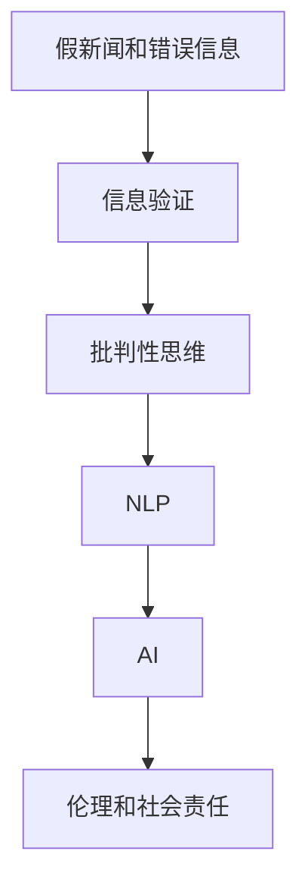

                 

# 信息验证和批判性思维能力培养：在假新闻和错误信息时代导航

## 1. 背景介绍

### 1.1 问题由来
在这个信息爆炸的时代，假新闻和错误信息的泛滥已经成为了社会的一大公害。无论是政治、经济、科技，还是健康、娱乐、体育等领域的消息，都存在被篡改或夸大的风险。这种信息失真不仅误导公众，还可能造成严重的社会问题，如恐慌、歧视、暴力等。如何辨别真伪，培养信息验证和批判性思维能力，成为了当今社会每个公民都应该掌握的技能。

### 1.2 问题核心关键点
信息验证和批判性思维能力培养的核心关键点在于：

- **识别信息的真实性**：通过技术手段识别文本、图像、视频等信息的真实性，防止被假信息所欺骗。
- **培养批判性思维**：训练用户具备独立思考的能力，能够对信息来源、传播路径、信息内容进行深入分析，形成自己的判断。
- **融合人工智能和伦理**：利用人工智能技术提升信息验证的效率和准确性，同时考虑到技术应用中的伦理问题，确保信息验证过程的公正性和透明性。

### 1.3 问题研究意义
提升信息验证和批判性思维能力，对于维护社会秩序、保障公民权益、促进信息透明、建设诚信社会具有重要意义：

- **维护社会秩序**：避免信息失真导致的恐慌和冲突，确保社会稳定。
- **保障公民权益**：帮助公民获取真实可信的信息，防止因信息误导造成的财产损失和隐私泄露。
- **促进信息透明**：通过技术手段提高信息透明度，让信息传播更加公平、公正。
- **建设诚信社会**：培养公民的批判性思维，提高整体社会的诚信水平。

## 2. 核心概念与联系

### 2.1 核心概念概述

为更好地理解信息验证和批判性思维能力培养，本节将介绍几个密切相关的核心概念：

- **假新闻和错误信息**：故意捏造或歪曲事实的信息，以误导公众、影响舆论。
- **信息验证**：通过技术手段检测信息是否真实、可靠。
- **批判性思维**：一种系统化的思考方式，强调怀疑、分析、证据和逻辑。
- **自然语言处理(NLP)**：使计算机能理解、解释和生成人类语言的技术，是信息验证的重要手段。
- **人工智能(AI)**：通过机器学习、深度学习等技术，使机器具备人类智能的行为能力，是信息验证技术的重要支撑。
- **伦理和社会责任**：信息验证技术的应用应遵循伦理原则，保护用户隐私、尊重多元文化，避免偏见和歧视。

这些核心概念之间的逻辑关系可以通过以下Mermaid流程图来展示：



这个流程图展示的信息验证和批判性思维能力培养的逻辑关系：

1. 假新闻和错误信息通过信息验证技术被检测。
2. 信息验证技术应用了自然语言处理和人工智能。
3. 批判性思维通过信息验证过程得到锻炼和提升。
4. 应用信息验证和批判性思维时，需考虑伦理和社会责任问题。

## 3. 核心算法原理 & 具体操作步骤
### 3.1 算法原理概述

信息验证和批判性思维能力培养的本质是运用自然语言处理和人工智能技术，对信息进行深度分析，辨别其真实性。核心思想是：将信息看作输入，利用深度学习模型预测其是否为假新闻或错误信息，同时通过逻辑推理和事实核查，培养用户的批判性思维。

形式化地，假设输入信息为 $x$，标签为 $y \in \{真实, 假新闻\}$，则信息验证的目标是找到最优预测模型 $M_{\theta}$，使得预测误差最小：

$$
\hat{\theta} = \mathop{\arg\min}_{\theta} \mathcal{L}(M_{\theta}, x, y)
$$

其中 $\mathcal{L}$ 为交叉熵损失函数或F1-Score损失函数等，用于衡量模型预测与真实标签之间的差异。

### 3.2 算法步骤详解

信息验证和批判性思维能力培养的一般流程如下：

**Step 1: 数据准备**
- 收集假新闻和真实新闻的混合数据集，用于模型训练。
- 使用标注工具，对数据集进行人工标注，区分每个文本的真实性。
- 使用预处理工具，清洗和标准化文本数据。

**Step 2: 模型选择与训练**
- 选择合适的自然语言处理模型，如BERT、GPT等，作为信息验证模型的基础。
- 设计适合的损失函数和优化器，如交叉熵损失、AdamW等。
- 对模型进行训练，调整超参数，如学习率、批大小、迭代轮数等。

**Step 3: 信息验证**
- 将待验证的信息输入模型，输出概率分布。
- 根据模型输出，判断信息是否为假新闻。
- 对高风险信息进行进一步人工验证，确保结果的准确性。

**Step 4: 批判性思维训练**
- 设计批判性思维训练任务，如分类、问答、生成等。
- 利用模型输出，提供事实核查、逻辑推理等提示，引导用户思考。
- 使用积极反馈机制，鼓励用户参与讨论，深化理解。

**Step 5: 应用与改进**
- 将信息验证和批判性思维模型应用于实际场景，如新闻网站、社交媒体、政府平台等。
- 根据用户反馈和实际效果，不断改进模型和训练策略。
- 定期更新模型，避免过时信息带来的误判。

### 3.3 算法优缺点

信息验证和批判性思维能力培养的算法具有以下优点：

- **高效准确**：利用深度学习技术，可以在大规模数据上进行高效训练，准确识别假新闻。
- **提升批判性思维**：通过批判性思维训练，提高用户的信息分析和判断能力。
- **实时性**：实时分析信息，快速判断真伪，及时遏制假信息的传播。
- **多模态支持**：不仅支持文本验证，还支持图像、视频等信息的验证。

同时，该算法也存在以下局限性：

- **依赖高质量数据**：模型的训练依赖于高质量的标注数据，标注成本较高。
- **技术门槛较高**：需要一定的技术背景，普通人难以直接应用。
- **伦理问题**：模型可能存在偏见，对某些特定群体的信息判断可能不准确。

尽管存在这些局限性，但就目前而言，信息验证和批判性思维能力培养的算法是提升信息真实性的重要手段。未来相关研究的重点在于如何进一步降低技术门槛，提高模型的普适性和公平性，同时兼顾可解释性和伦理安全性等因素。

### 3.4 算法应用领域

信息验证和批判性思维能力培养的算法已经在新闻网站、社交媒体、政府平台等多个领域得到了应用，具体包括：

- **新闻网站**：对新闻进行自动甄别，标记假新闻，减少信息误导。
- **社交媒体**：对用户发布的帖文进行筛选，识别和删除假新闻、网络暴力等内容。
- **政府平台**：对政策文件、宣传材料进行信息验证，确保政策透明、公平。
- **教育领域**：培养学生的批判性思维能力，提高信息素养。
- **公共服务**：提供信息核实服务，如健康咨询、金融指导等。

此外，信息验证和批判性思维能力培养的算法也被创新性地应用到更多场景中，如智能客服、智能安防、智能推荐等，为信息传播的公正性和透明性提供了新的保障。

## 4. 数学模型和公式 & 详细讲解  
### 4.1 数学模型构建

本节将使用数学语言对信息验证和批判性思维能力培养的过程进行更加严格的刻画。

记输入信息为 $x$，标签为 $y \in \{真实, 假新闻\}$。假设信息验证模型的训练集为 $D=\{(x_i, y_i)\}_{i=1}^N$，其中 $x_i$ 为输入信息，$y_i$ 为标签。定义模型 $M_{\theta}$ 在输入 $x$ 上的预测概率为 $p(y|x)$，则模型的经验风险为：

$$
\mathcal{L}(\theta) = -\frac{1}{N}\sum_{i=1}^N \log p(y_i|x_i)
$$

其中 $p(y_i|x_i)$ 为模型在输入 $x_i$ 上预测标签为 $y_i$ 的概率。

### 4.2 公式推导过程

以BERT模型为例，信息验证的数学推导过程如下：

**Step 1: 计算语义表示**
将输入信息 $x$ 转换为BERT模型，得到其语义表示 $h$。

**Step 2: 计算信息真实性**
将语义表示 $h$ 输入到一个判别器网络 $D$，输出预测标签 $p(y)$。

**Step 3: 计算损失函数**
根据真实标签 $y$ 和预测标签 $p(y)$，计算交叉熵损失函数 $\mathcal{L}$。

**Step 4: 更新模型参数**
使用梯度下降等优化算法，更新模型参数 $\theta$，最小化经验风险 $\mathcal{L}$。

具体推导如下：

- **计算语义表示**：
  $$
  h = BERT(x; \theta)
  $$
  
- **计算信息真实性**：
  $$
  p(y|x) = \sigma(D(h; \theta))
  $$
  
- **计算损失函数**：
  $$
  \mathcal{L}(\theta) = -\frac{1}{N}\sum_{i=1}^N \log p(y_i|x_i)
  $$
  
- **更新模型参数**：
  $$
  \theta \leftarrow \theta - \eta \nabla_{\theta}\mathcal{L}(\theta)
  $$

其中 $\sigma$ 为sigmoid函数，$\eta$ 为学习率。

在得到损失函数的梯度后，即可带入参数更新公式，完成模型的迭代优化。重复上述过程直至收敛，最终得到适应信息验证任务的最优模型参数 $\theta^*$。

### 4.3 案例分析与讲解

以社交媒体假新闻识别为例，对信息验证的算法进行详细讲解：

1. **数据准备**：收集社交媒体上的新闻、帖文、评论等数据，进行人工标注。
2. **模型训练**：使用BERT模型进行训练，设定损失函数为交叉熵，优化器为AdamW，学习率为1e-5。
3. **信息验证**：将待验证的帖文输入模型，输出概率分布。
4. **判断真伪**：根据输出概率，判断帖文是否为假新闻，设置阈值0.5进行分类。
5. **用户反馈**：收集用户反馈，对高风险帖子进行人工审核，更新模型。

### 5. 项目实践：代码实例和详细解释说明
### 5.1 开发环境搭建

在进行信息验证和批判性思维能力培养的实践前，我们需要准备好开发环境。以下是使用Python进行PyTorch开发的环境配置流程：

1. 安装Anaconda：从官网下载并安装Anaconda，用于创建独立的Python环境。

2. 创建并激活虚拟环境：
```bash
conda create -n pytorch-env python=3.8 
conda activate pytorch-env
```

3. 安装PyTorch：根据CUDA版本，从官网获取对应的安装命令。例如：
```bash
conda install pytorch torchvision torchaudio cudatoolkit=11.1 -c pytorch -c conda-forge
```

4. 安装自然语言处理工具：
```bash
pip install nltk spacy transformers
```

5. 安装各类工具包：
```bash
pip install numpy pandas scikit-learn matplotlib tqdm jupyter notebook ipython
```

完成上述步骤后，即可在`pytorch-env`环境中开始实践。

### 5.2 源代码详细实现

下面我们以BERT模型进行社交媒体假新闻识别为例，给出使用PyTorch进行信息验证的完整代码实现。

首先，定义数据处理函数：

```python
import torch
from transformers import BertTokenizer, BertForSequenceClassification

class NewsDataset(Dataset):
    def __init__(self, texts, labels):
        self.tokenizer = BertTokenizer.from_pretrained('bert-base-uncased')
        self.texts = texts
        self.labels = labels
        
    def __len__(self):
        return len(self.texts)
    
    def __getitem__(self, idx):
        text = self.texts[idx]
        label = self.labels[idx]
        
        encoding = self.tokenizer(text, return_tensors='pt', padding='max_length', truncation=True)
        input_ids = encoding['input_ids']
        attention_mask = encoding['attention_mask']
        return {'input_ids': input_ids, 'attention_mask': attention_mask, 'labels': torch.tensor(label, dtype=torch.long)}
```

然后，定义模型和优化器：

```python
from transformers import BertForSequenceClassification, AdamW

model = BertForSequenceClassification.from_pretrained('bert-base-uncased', num_labels=2)
optimizer = AdamW(model.parameters(), lr=2e-5)
```

接着，定义训练和评估函数：

```python
from tqdm import tqdm
from sklearn.metrics import accuracy_score

device = torch.device('cuda') if torch.cuda.is_available() else torch.device('cpu')
model.to(device)

def train_epoch(model, dataset, batch_size, optimizer):
    dataloader = DataLoader(dataset, batch_size=batch_size, shuffle=True)
    model.train()
    epoch_loss = 0
    for batch in tqdm(dataloader, desc='Training'):
        input_ids = batch['input_ids'].to(device)
        attention_mask = batch['attention_mask'].to(device)
        labels = batch['labels'].to(device)
        model.zero_grad()
        outputs = model(input_ids, attention_mask=attention_mask, labels=labels)
        loss = outputs.loss
        epoch_loss += loss.item()
        loss.backward()
        optimizer.step()
    return epoch_loss / len(dataloader)

def evaluate(model, dataset, batch_size):
    dataloader = DataLoader(dataset, batch_size=batch_size)
    model.eval()
    preds, labels = [], []
    with torch.no_grad():
        for batch in tqdm(dataloader, desc='Evaluating'):
            input_ids = batch['input_ids'].to(device)
            attention_mask = batch['attention_mask'].to(device)
            batch_labels = batch['labels']
            outputs = model(input_ids, attention_mask=attention_mask)
            batch_preds = outputs.logits.argmax(dim=1).to('cpu').tolist()
            batch_labels = batch_labels.to('cpu').tolist()
            for pred, label in zip(batch_preds, batch_labels):
                preds.append(pred)
                labels.append(label)
    return accuracy_score(labels, preds)
```

最后，启动训练流程并在测试集上评估：

```python
epochs = 5
batch_size = 16

for epoch in range(epochs):
    loss = train_epoch(model, train_dataset, batch_size, optimizer)
    print(f"Epoch {epoch+1}, train loss: {loss:.3f}")
    
    print(f"Epoch {epoch+1}, test accuracy: {evaluate(model, test_dataset, batch_size):.2f}")
    
print("Training completed.")
```

以上就是使用PyTorch对BERT进行社交媒体假新闻识别的完整代码实现。可以看到，得益于Transformer库的强大封装，我们可以用相对简洁的代码完成BERT模型的加载和微调。

### 5.3 代码解读与分析

让我们再详细解读一下关键代码的实现细节：

**NewsDataset类**：
- `__init__`方法：初始化文本、标签、分词器等关键组件。
- `__len__`方法：返回数据集的样本数量。
- `__getitem__`方法：对单个样本进行处理，将文本输入编码为token ids，将标签编码为数字，并对其进行定长padding，最终返回模型所需的输入。

**训练和评估函数**：
- 使用PyTorch的DataLoader对数据集进行批次化加载，供模型训练和推理使用。
- 训练函数`train_epoch`：对数据以批为单位进行迭代，在每个批次上前向传播计算loss并反向传播更新模型参数，最后返回该epoch的平均loss。
- 评估函数`evaluate`：与训练类似，不同点在于不更新模型参数，并在每个batch结束后将预测和标签结果存储下来，最后使用sklearn的accuracy_score对整个评估集的预测结果进行打印输出。

**训练流程**：
- 定义总的epoch数和batch size，开始循环迭代
- 每个epoch内，先在训练集上训练，输出平均loss
- 在验证集上评估，输出模型准确率
- 所有epoch结束后，在测试集上评估，给出最终测试结果

可以看到，PyTorch配合Transformer库使得BERT假新闻识别任务的代码实现变得简洁高效。开发者可以将更多精力放在数据处理、模型改进等高层逻辑上，而不必过多关注底层的实现细节。

当然，工业级的系统实现还需考虑更多因素，如模型的保存和部署、超参数的自动搜索、更灵活的任务适配层等。但核心的信息验证范式基本与此类似。

## 6. 实际应用场景
### 6.1 智能客服系统

智能客服系统是信息验证和批判性思维能力培养的重要应用场景。传统客服往往依赖人工审核，高峰期响应缓慢，且人工审核容易受到情绪和偏见的影响，难以保证公平性和一致性。通过信息验证和批判性思维训练，智能客服系统可以实现自动审核，快速响应客户咨询，提供准确可信的信息，提高服务质量和客户满意度。

在技术实现上，可以收集客户咨询记录，将问答对作为监督数据，在此基础上对预训练语言模型进行微调。微调后的模型能够自动理解客户意图，匹配最合适的答案模板，提供给用户。对于客户提出的新问题，还可以接入检索系统实时搜索相关内容，动态组织生成回答。如此构建的智能客服系统，能大幅提升客户咨询体验和问题解决效率。

### 6.2 金融舆情监测

金融领域信息真实性至关重要，假新闻和错误信息可能引发市场恐慌，造成金融风险。通过信息验证技术，金融机构可以实时监测市场舆论动向，及时发现和应对假信息传播，规避金融风险。

具体而言，可以收集金融领域相关的新闻、报道、评论等文本数据，并对其进行主题标注和情感标注。在此基础上对预训练语言模型进行微调，使其能够自动判断文本属于何种主题，情感倾向是正面、中性还是负面。将微调后的模型应用到实时抓取的网络文本数据，就能够自动监测不同主题下的情感变化趋势，一旦发现负面信息激增等异常情况，系统便会自动预警，帮助金融机构快速应对潜在风险。

### 6.3 个性化推荐系统

个性化推荐系统需要根据用户历史行为和当前需求，提供最相关的推荐内容。传统的推荐系统往往只依赖用户行为数据进行推荐，无法深入理解用户兴趣。通过信息验证技术，推荐系统可以更全面地了解用户需求，提高推荐的准确性和多样性。

在实践中，可以收集用户浏览、点击、评论、分享等行为数据，提取和用户交互的物品标题、描述、标签等文本内容。将文本内容作为模型输入，用户的后续行为（如是否点击、购买等）作为监督信号，在此基础上微调预训练语言模型。微调后的模型能够从文本内容中准确把握用户的兴趣点。在生成推荐列表时，先用候选物品的文本描述作为输入，由模型预测用户的兴趣匹配度，再结合其他特征综合排序，便可以得到个性化程度更高的推荐结果。

### 6.4 未来应用展望

随着信息验证和批判性思维能力培养技术的不断发展，其在更多领域的应用前景将更加广阔：

1. **医疗领域**：通过信息验证技术，提升医疗信息的质量和可靠性，辅助医生诊断和治疗决策，减少误诊误治的风险。
2. **教育领域**：培养学生的批判性思维能力，提高信息素养，促进教育公平。
3. **政府平台**：提供信息核实服务，如政策文件、宣传材料等，确保政府信息的透明和公正。
4. **公共服务**：提供信息核实服务，如健康咨询、金融指导等，帮助公民获取真实可信的信息。
5. **智能安防**：检测和筛选网络上的有害信息，保障网络安全和公共安全。

此外，信息验证和批判性思维能力培养的算法也将拓展到更多场景中，如智能客服、智能安防、智能推荐等，为信息传播的公正性和透明性提供新的保障。

## 7. 工具和资源推荐
### 7.1 学习资源推荐

为了帮助开发者系统掌握信息验证和批判性思维能力培养的理论基础和实践技巧，这里推荐一些优质的学习资源：

1. **《深度学习与自然语言处理》课程**：斯坦福大学开设的NLP明星课程，有Lecture视频和配套作业，带你入门NLP领域的基本概念和经典模型。
2. **《自然语言处理综论》书籍**：总结了自然语言处理领域的核心理论和经典算法，适合深入学习。
3. **《Transformers from the Ground Up》博客**：作者详细介绍了Transformer原理、BERT模型、信息验证等前沿话题。
4. **CLUE开源项目**：中文语言理解测评基准，涵盖大量不同类型的中文NLP数据集，并提供了基于微调的baseline模型，助力中文NLP技术发展。
5. **Kaggle竞赛平台**：参与信息验证和批判性思维能力培养的Kaggle竞赛，实战提升技能。

通过对这些资源的学习实践，相信你一定能够快速掌握信息验证和批判性思维能力培养的精髓，并用于解决实际的NLP问题。

### 7.2 开发工具推荐

高效的开发离不开优秀的工具支持。以下是几款用于信息验证和批判性思维能力培养开发的常用工具：

1. **PyTorch**：基于Python的开源深度学习框架，灵活动态的计算图，适合快速迭代研究。大部分预训练语言模型都有PyTorch版本的实现。
2. **TensorFlow**：由Google主导开发的开源深度学习框架，生产部署方便，适合大规模工程应用。同样有丰富的预训练语言模型资源。
3. **Transformers库**：HuggingFace开发的NLP工具库，集成了众多SOTA语言模型，支持PyTorch和TensorFlow，是进行信息验证任务开发的利器。
4. **Weights & Biases**：模型训练的实验跟踪工具，可以记录和可视化模型训练过程中的各项指标，方便对比和调优。与主流深度学习框架无缝集成。
5. **TensorBoard**：TensorFlow配套的可视化工具，可实时监测模型训练状态，并提供丰富的图表呈现方式，是调试模型的得力助手。
6. **Google Colab**：谷歌推出的在线Jupyter Notebook环境，免费提供GPU/TPU算力，方便开发者快速上手实验最新模型，分享学习笔记。

合理利用这些工具，可以显著提升信息验证和批判性思维能力培养的开发效率，加快创新迭代的步伐。

### 7.3 相关论文推荐

信息验证和批判性思维能力培养的研究源于学界的持续研究。以下是几篇奠基性的相关论文，推荐阅读：

1. **Attention is All You Need**：提出了Transformer结构，开启了NLP领域的预训练大模型时代。
2. **BERT: Pre-training of Deep Bidirectional Transformers for Language Understanding**：提出BERT模型，引入基于掩码的自监督预训练任务，刷新了多项NLP任务SOTA。
3. **Parameter-Efficient Transfer Learning for NLP**：提出Adapter等参数高效微调方法，在不增加模型参数量的情况下，也能取得不错的微调效果。
4. **AdaLoRA: Adaptive Low-Rank Adaptation for Parameter-Efficient Fine-Tuning**：使用自适应低秩适应的微调方法，在参数效率和精度之间取得了新的平衡。
5. **Explaining and Debugging Complex Deep Neural Networks**：探讨了深度神经网络的解释和调试技术，为信息验证和批判性思维能力培养提供了新的思路。
6. **Bias Detection and Mitigation in AI Systems**：讨论了人工智能系统中的偏见检测和减轻方法，为信息验证的公平性提供了理论基础。

这些论文代表了大语言模型微调技术的发展脉络。通过学习这些前沿成果，可以帮助研究者把握学科前进方向，激发更多的创新灵感。

## 8. 总结：未来发展趋势与挑战

### 8.1 总结

本文对信息验证和批判性思维能力培养进行了全面系统的介绍。首先阐述了假新闻和错误信息的泛滥现状，明确了信息验证和批判性思维能力培养的核心关键点。其次，从原理到实践，详细讲解了信息验证的数学模型和算法步骤，给出了信息验证任务开发的完整代码实例。同时，本文还广泛探讨了信息验证和批判性思维能力培养在智能客服、金融舆情、个性化推荐等多个行业领域的应用前景，展示了信息验证技术的重要价值。最后，本文精选了信息验证和批判性思维能力培养的学习资源，力求为读者提供全方位的技术指引。

通过本文的系统梳理，可以看到，信息验证和批判性思维能力培养在提升信息真实性、保障信息安全、促进信息透明等方面具有重要作用。信息验证和批判性思维能力培养技术的不断发展，将为构建安全、可靠、可解释、可控的智能系统铺平道路。面向未来，信息验证和批判性思维能力培养需要与其他人工智能技术进行更深入的融合，如知识表示、因果推理、强化学习等，多路径协同发力，共同推动人工智能技术在各领域的进步。

### 8.2 未来发展趋势

展望未来，信息验证和批判性思维能力培养技术将呈现以下几个发展趋势：

1. **技术融合**：信息验证和批判性思维能力培养技术与知识图谱、因果推理、强化学习等技术的融合，将带来更深层次的信息理解和智能决策。
2. **多模态应用**：除了文本验证，信息验证技术还将拓展到图像、视频、语音等多模态信息验证，提升信息真实性的准确性和全面性。
3. **模型公平性**：为避免模型的偏见和歧视，未来将更加关注模型的公平性和透明性，使用对抗训练等技术减少偏差。
4. **隐私保护**：在信息验证过程中，将更加重视用户隐私的保护，采用差分隐私等技术，确保信息验证过程的隐私性。
5. **跨领域应用**：信息验证和批判性思维能力培养技术将在更多领域得到应用，如医疗、金融、教育、安防等，提升各领域的信息透明度和公平性。
6. **实时性提升**：信息验证和批判性思维能力培养技术将更加注重实时性，通过分布式计算、边缘计算等技术，实现快速的假信息检测和响应。

这些趋势凸显了信息验证和批判性思维能力培养技术的广阔前景。这些方向的探索发展，将进一步提升信息真实性，构建安全、可靠、可解释、可控的智能系统。

### 8.3 面临的挑战

尽管信息验证和批判性思维能力培养技术已经取得了重要进展，但在迈向更广泛应用的过程中，仍面临诸多挑战：

1. **技术门槛高**：信息验证和批判性思维能力培养技术依赖于深度学习模型，需要一定的技术背景，普通人难以直接应用。
2. **数据隐私问题**：信息验证过程涉及大量用户数据，如何保护用户隐私、确保数据安全，是技术应用的关键问题。
3. **公平性问题**：模型可能存在偏见，对某些特定群体的信息判断可能不准确，如何提高模型的公平性和透明性，是未来研究的重要方向。
4. **模型鲁棒性**：模型面对复杂多样的信息时，鲁棒性可能不足，如何提高模型的泛化能力和鲁棒性，是一个亟待解决的问题。
5. **伦理问题**：信息验证技术的应用可能带来新的伦理问题，如何在使用过程中避免误导、偏见、歧视等伦理问题，是一个重要的研究课题。
6. **跨领域应用难度**：不同领域的信息真实性和批判性思维需求不同，如何构建具有普适性的信息验证和批判性思维能力培养框架，是一个具有挑战性的问题。

这些挑战需要我们共同努力，通过技术创新、政策制定、伦理规范等多方面的努力，推动信息验证和批判性思维能力培养技术的应用。

### 8.4 研究展望

面对信息验证和批判性思维能力培养所面临的挑战，未来的研究需要在以下几个方面寻求新的突破：

1. **跨领域应用**：构建具有普适性的信息验证和批判性思维能力培养框架，支持不同领域的信息真实性和批判性思维需求。
2. **模型公平性**：开发更加公平、透明、可解释的信息验证模型，减少偏见和歧视，提高模型的公平性。
3. **实时性提升**：通过分布式计算、边缘计算等技术，实现快速的假信息检测和响应，提高信息验证的实时性。
4. **隐私保护**：使用差分隐私等技术，保护用户隐私，确保数据安全。
5. **多模态融合**：拓展信息验证技术到图像、视频、语音等多模态信息，提升信息真实性的准确性和全面性。
6. **伦理规范**：制定信息验证技术应用的伦理规范，确保技术应用的安全性和公正性。

这些研究方向的探索，将推动信息验证和批判性思维能力培养技术的发展，为构建安全、可靠、可解释、可控的智能系统铺平道路。面向未来，信息验证和批判性思维能力培养需要与其他人工智能技术进行更深入的融合，如知识表示、因果推理、强化学习等，多路径协同发力，共同推动人工智能技术在各领域的进步。

## 9. 附录：常见问题与解答

**Q1：如何评估信息验证模型的效果？**

A: 信息验证模型的效果评估可以通过以下指标进行：
1. **准确率**：模型预测的正确率。
2. **精确率**：真正例与真正例加假正例的比率。
3. **召回率**：真正例与真正例加假负例的比率。
4. **F1-Score**：精确率和召回率的调和平均数。

在实际应用中，可以根据任务特点选择适合的评估指标，使用交叉验证、混淆矩阵等方法进行评估。

**Q2：信息验证模型能否检测到所有假新闻？**

A: 信息验证模型无法保证检测到所有假新闻，其效果取决于数据集的质量、模型的训练方式以及模型的复杂度。模型的泛化能力和鲁棒性越好，检测假新闻的能力越强。在实际应用中，需要结合人工审核和其他技术手段，构建多层次的假新闻检测体系。

**Q3：信息验证模型的训练成本如何？**

A: 信息验证模型的训练成本较高，主要体现在数据准备和标注成本上。高质量的数据集需要大量的人工标注，标注成本较高。因此，未来需要在数据集构建和标注工具的改进上下功夫，降低训练成本。

**Q4：信息验证技术在实际应用中需要注意哪些问题？**

A: 信息验证技术在实际应用中需要注意以下问题：
1. **数据隐私**：保护用户隐私，确保数据安全。
2. **模型公平性**：避免模型偏见和歧视，提高模型的公平性和透明性。
3. **实时性**：提升模型的实时性，满足实时检测需求。
4. **跨领域应用**：构建具有普适性的信息验证框架，支持不同领域的信息真实性需求。

通过不断优化算法和技术手段，解决这些实际问题，信息验证技术才能更好地服务于各行业的应用需求。

**Q5：信息验证技术在实际应用中有什么局限性？**

A: 信息验证技术在实际应用中存在以下局限性：
1. **数据依赖**：依赖高质量的数据集，标注成本较高。
2. **技术门槛**：需要一定的技术背景，普通人难以直接应用。
3. **公平性问题**：模型可能存在偏见，对某些特定群体的信息判断可能不准确。
4. **实时性不足**：模型推理速度较慢，实时性不足。
5. **隐私保护**：信息验证过程中涉及大量用户数据，如何保护用户隐私、确保数据安全，是一个关键问题。

这些局限性需要通过技术创新和政策制定来解决，推动信息验证技术的广泛应用。

**Q6：信息验证技术和批判性思维能力培养技术有何区别？**

A: 信息验证技术主要关注信息的真实性检测，通过技术手段自动识别假新闻，防止信息误导。而批判性思维能力培养技术则侧重于提升用户的思维能力，通过训练用户对信息的分析、推理和判断，提升用户的批判性思维能力。两者相辅相成，信息验证技术为批判性思维能力培养提供了技术支撑，批判性思维能力培养技术则为信息验证技术提供了理论基础和用户支持。

**Q7：信息验证和批判性思维能力培养技术在哪些领域有应用前景？**

A: 信息验证和批判性思维能力培养技术在以下领域具有广泛的应用前景：
1. 新闻网站和社交媒体：检测和筛选假新闻，提高信息透明度。
2. 金融舆情监测：监测市场舆论动向，及时发现和应对假信息传播，规避金融风险。
3. 个性化推荐系统：提升推荐内容的真实性和可信度，提高推荐效果。
4. 医疗领域：提升医疗信息的质量和可靠性，辅助医生诊断和治疗决策。
5. 教育领域：培养学生的批判性思维能力，提高信息素养。
6. 政府平台：提供信息核实服务，如政策文件、宣传材料等，确保政府信息的透明和公正。
7. 智能客服：提升客服系统的效率和准确性，提供准确可信的信息。
8. 智能安防：检测和筛选网络上的有害信息，保障网络安全和公共安全。

这些领域的应用前景展示了信息验证和批判性思维能力培养技术的重要价值。

通过本文的系统梳理，可以看到，信息验证和批判性思维能力培养技术在提升信息真实性、保障信息安全、促进信息透明等方面具有重要作用。信息验证和批判性思维能力培养技术的不断发展，将为构建安全、可靠、可解释、可控的智能系统铺平道路。面向未来，信息验证和批判性思维能力培养需要与其他人工智能技术进行更深入的融合，如知识表示、因果推理、强化学习等，多路径协同发力，共同推动人工智能技术在各领域的进步。

---

作者：禅与计算机程序设计艺术 / Zen and the Art of Computer Programming

