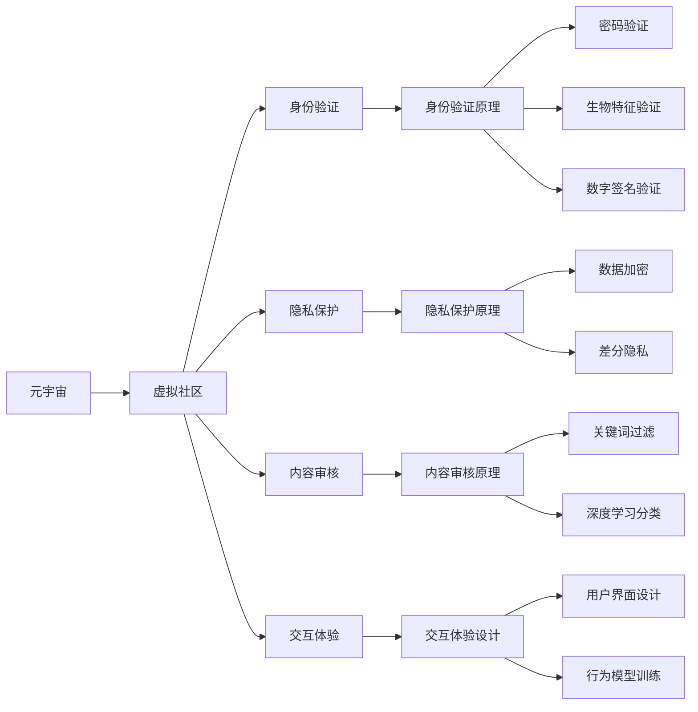

                 

## 1. 背景介绍

### 1.1 问题由来

随着数字技术的发展，元宇宙（Metaverse）正逐渐成为新一代的互联网社交形态。与传统的互联网社交平台相比，元宇宙将现实世界的物理空间映射至虚拟空间，实现了对物理世界的深度模拟和交互。用户在虚拟世界中可以拥有更加多样化和沉浸式的体验，包括高精度3D建模、实时渲染、多人在线协作等。这种沉浸式的社交体验，预示着社交网络形态的重大变革。

在元宇宙中，虚拟社区（Virtual Community）成为了社交网络的新基础。这些社区构成了元宇宙的基本社交单元，扮演着内容创造、资源交换、文化交流等多种角色，为全球用户提供了一个全新的社交平台。虚拟社区中的用户可以自由地进行交互、沟通、协作，共享信息和资源，从而构建出一个更加多样化和互动的社交环境。

### 1.2 问题核心关键点

- **虚拟社区构建**：如何在元宇宙中构建稳定的虚拟社区，使得用户在虚拟世界中能够自由地进行互动和交流？
- **社交网络分析**：如何利用数据科学和网络分析方法，揭示虚拟社区中的社交网络结构，为用户提供个性化推荐？
- **身份验证**：如何保障用户在虚拟社区中的身份安全，防止假冒和滥用？
- **隐私保护**：如何在虚拟社区中保护用户隐私，避免数据泄露和滥用？
- **内容审核**：如何对虚拟社区中的内容进行审核，防止有害信息的传播？
- **交互体验**：如何设计优质的交互体验，提升用户的参与感和满意度？

这些问题构成了元宇宙虚拟社区发展的核心挑战，也是本文探讨的重点。通过全面理解虚拟社区的技术和应用，可以为未来元宇宙社交网络的发展提供有力支持。

## 2. 核心概念与联系

### 2.1 核心概念概述

要深入理解元宇宙中的虚拟社区，首先需要理解以下核心概念：

- **元宇宙（Metaverse）**：一个由计算机生成的三维虚拟空间，用户可以在其中自由互动和交流，实现虚拟与现实的深度融合。
- **虚拟社区（Virtual Community）**：在元宇宙中，由用户自发形成的社交网络单元，具有相似兴趣或目标的用户在此聚集。
- **身份验证（Identity Verification）**：在虚拟社区中，通过密码、生物特征、数字签名等手段，验证用户的身份真实性和权限合法性。
- **隐私保护（Privacy Protection）**：保护用户隐私数据，防止数据泄露和滥用，提升用户对虚拟社区的信任度。
- **内容审核（Content Moderation）**：对虚拟社区中的内容进行过滤和审核，防止有害信息的传播，维护社区的秩序和安全。
- **交互体验（Interactive Experience）**：设计优质的交互界面和用户行为模型，提升用户的参与感和满意度。

这些概念相互关联，共同构成了元宇宙虚拟社区的技术框架和应用生态。

### 2.2 核心概念原理和架构的 Mermaid 流程图(Mermaid 流程节点中不要有括号、逗号等特殊字符)



这个流程图展示了元宇宙、虚拟社区及其核心概念之间的联系：

- **元宇宙** 通过 **虚拟社区** 实现用户间的互动和交流。
- **身份验证**、**隐私保护**、**内容审核** 和 **交互体验** 分别从安全、隐私、内容健康和用户体验角度，支持虚拟社区的稳定运行。
- 每个核心概念内部又包含了多个子概念和技术手段，如密码、生物特征、数字签名、数据加密、关键词过滤、用户界面设计等。

这些子概念和技术手段进一步细化了元宇宙虚拟社区的构建和运行机制，共同支撑了虚拟社区的全面发展。

## 3. 核心算法原理 & 具体操作步骤

### 3.1 算法原理概述

元宇宙虚拟社区的构建和运行涉及多个领域的算法和技术，包括计算机图形学、机器学习、网络科学等。核心算法原理可以总结如下：

- **计算机图形学**：用于高精度3D建模和实时渲染，构建虚拟世界的基础。
- **机器学习**：用于社交网络分析和内容推荐，优化社区运营。
- **网络科学**：用于揭示社区网络结构，提升用户参与度。
- **区块链技术**：用于虚拟社区的身份验证和资源交换，保障社区安全。

### 3.2 算法步骤详解

元宇宙虚拟社区的构建步骤如下：

1. **环境搭建**：搭建元宇宙的基础设施，包括高精度3D建模、实时渲染引擎、分布式网络等。
2. **社区创建**：用户可以在虚拟世界中创建或加入虚拟社区，通过社交网络协议进行互动。
3. **身份验证**：通过密码、生物特征、数字签名等手段，验证用户的身份真实性和权限合法性。
4. **隐私保护**：采用数据加密和差分隐私等技术，保护用户隐私数据，防止数据泄露和滥用。
5. **内容审核**：对虚拟社区中的内容进行关键词过滤和深度学习分类，防止有害信息的传播。
6. **交互体验**：设计优质的交互界面和用户行为模型，提升用户的参与感和满意度。

### 3.3 算法优缺点

元宇宙虚拟社区的构建和运营算法具有以下优点和缺点：

#### 优点：

- **高度沉浸式体验**：利用高精度3D建模和实时渲染技术，提供沉浸式的虚拟社区体验。
- **丰富的社交功能**：支持多人的实时互动和协作，提升用户参与度。
- **数据驱动决策**：通过机器学习和网络科学算法，进行社交网络分析和用户行为预测，优化社区运营。

#### 缺点：

- **技术门槛高**：构建高质量的元宇宙虚拟社区需要较高的技术门槛，包括计算机图形学、机器学习、网络科学等。
- **资源消耗大**：高精度3D建模和实时渲染对计算资源的需求较高，需要高性能的硬件设备支持。
- **安全风险高**：虚拟社区中的身份验证、隐私保护和内容审核等技术手段，需要不断迭代和优化，防止安全漏洞。

### 3.4 算法应用领域

元宇宙虚拟社区的构建和运营算法广泛应用于以下几个领域：

- **游戏开发**：提供沉浸式的游戏环境和社交功能，提升游戏体验和用户粘性。
- **企业协作**：通过虚拟社区构建企业内部协作平台，提升远程工作的效率和互动性。
- **教育培训**：构建虚拟教室和实验室，提供沉浸式的教学和实验环境。
- **文化交流**：利用虚拟社区进行跨文化的艺术展览和交流，促进文化多样性和理解。
- **公共服务**：提供虚拟社区服务，如虚拟博物馆、图书馆等，提升公共服务的覆盖面和体验感。

## 4. 数学模型和公式 & 详细讲解 & 举例说明（备注：数学公式请使用latex格式，latex嵌入文中独立段落使用 $$，段落内使用 $)

### 4.1 数学模型构建

元宇宙虚拟社区的构建和运营算法涉及多个数学模型，包括：

- **社交网络模型**：用于揭示社区中用户之间的连接关系和社交网络结构。
- **推荐系统模型**：用于为用户推荐感兴趣的内容和活动。
- **用户行为模型**：用于预测用户在虚拟社区中的行为和偏好。

### 4.2 公式推导过程

以社交网络模型为例，通过以下公式推导社交网络中用户之间的连接关系：

设社交网络 $G=(V,E)$，其中 $V$ 为节点集合，$E$ 为边集合。每个节点 $v_i$ 表示用户，$e_{ij}$ 表示节点 $v_i$ 和 $v_j$ 之间存在连接关系。社交网络中用户之间的连接关系可以通过以下矩阵表示：

$$
A = \begin{bmatrix}
0 & a_{12} & a_{13} & \ldots & a_{1n} \\
a_{21} & 0 & a_{23} & \ldots & a_{2n} \\
a_{31} & a_{32} & 0 & \ldots & a_{3n} \\
\vdots & \vdots & \vdots & \ddots & \vdots \\
a_{n1} & a_{n2} & a_{n3} & \ldots & 0
\end{bmatrix}
$$

其中 $a_{ij}$ 表示节点 $v_i$ 和 $v_j$ 之间是否存在连接关系。社交网络中用户之间的连接关系可以通过矩阵乘法计算节点之间的连接强度，如下所示：

$$
A^k \approx \begin{bmatrix}
s_{11} & s_{12} & s_{13} & \ldots & s_{1n} \\
s_{21} & s_{22} & s_{23} & \ldots & s_{2n} \\
s_{31} & s_{32} & s_{33} & \ldots & s_{3n} \\
\vdots & \vdots & \vdots & \ddots & \vdots \\
s_{n1} & s_{n2} & s_{n3} & \ldots & s_{nn}
\end{bmatrix}
$$

其中 $s_{ij}$ 表示节点 $v_i$ 和 $v_j$ 之间的连接强度。

### 4.3 案例分析与讲解

以Twitter为案例，分析其社交网络中的用户连接关系和社区结构。Twitter是一个典型的社交网络平台，其社交网络结构可以通过以下公式表示：

$$
A = \begin{bmatrix}
0 & a_{12} & a_{13} & \ldots & a_{1n} \\
a_{21} & 0 & a_{23} & \ldots & a_{2n} \\
a_{31} & a_{32} & 0 & \ldots & a_{3n} \\
\vdots & \vdots & \vdots & \ddots & \vdots \\
a_{n1} & a_{n2} & a_{n3} & \ldots & 0
\end{bmatrix}
$$

其中 $a_{ij}$ 表示用户 $u_i$ 和用户 $u_j$ 之间是否存在关注关系。通过计算 $A^k$，可以揭示Twitter上的用户连接强度和社区结构，例如：

$$
A^2 \approx \begin{bmatrix}
s_{11} & s_{12} & s_{13} & \ldots & s_{1n} \\
s_{21} & s_{22} & s_{23} & \ldots & s_{2n} \\
s_{31} & s_{32} & s_{33} & \ldots & s_{3n} \\
\vdots & \vdots & \vdots & \ddots & \vdots \\
s_{n1} & s_{n2} & s_{n3} & \ldots & s_{nn}
\end{bmatrix}
$$

通过分析 $A^2$ 中的连接强度，可以识别Twitter上的主要社区和影响力用户。

## 5. 项目实践：代码实例和详细解释说明

### 5.1 开发环境搭建

以下是使用Python和TensorFlow进行元宇宙虚拟社区构建的开发环境搭建流程：

1. 安装Anaconda：从官网下载并安装Anaconda，用于创建独立的Python环境。

2. 创建并激活虚拟环境：
```bash
conda create -n metaverse-env python=3.8 
conda activate metaverse-env
```

3. 安装TensorFlow：根据CUDA版本，从官网获取对应的安装命令。例如：
```bash
conda install tensorflow -c pytorch -c conda-forge
```

4. 安装Keras：
```bash
pip install keras
```

5. 安装TensorBoard：
```bash
pip install tensorboard
```

6. 安装Open3D：
```bash
pip install open3d
```

7. 安装PyTorch：
```bash
pip install torch torchvision torchaudio
```

完成上述步骤后，即可在`metaverse-env`环境中开始元宇宙虚拟社区的开发。

### 5.2 源代码详细实现

下面以构建虚拟社区的身份验证模块为例，给出使用TensorFlow和Keras实现的代码实现。

```python
import tensorflow as tf
from tensorflow.keras import layers, models

# 定义身份验证模型
class IdentityVerificationModel(models.Model):
    def __init__(self):
        super(IdentityVerificationModel, self).__init__()
        self.embedding = layers.Embedding(input_dim=10000, output_dim=256)
        self.flatten = layers.Flatten()
        self.fc1 = layers.Dense(128, activation='relu')
        self.fc2 = layers.Dense(1, activation='sigmoid')

    def call(self, x):
        x = self.embedding(x)
        x = self.flatten(x)
        x = self.fc1(x)
        x = self.fc2(x)
        return x

# 训练模型
def train_model(model, train_data, validation_data, epochs=10):
    model.compile(optimizer='adam', loss='binary_crossentropy', metrics=['accuracy'])
    history = model.fit(train_data, validation_data, epochs=epochs, batch_size=64)
    return model

# 加载数据
train_data = ...
validation_data = ...

# 创建模型
model = IdentityVerificationModel()

# 训练模型
trained_model = train_model(model, train_data, validation_data)
```

在上述代码中，我们使用Keras实现了基本的身份验证模型，包含嵌入层、全连接层和输出层，使用二元交叉熵损失函数进行训练。通过调整模型结构和超参数，可以在元宇宙虚拟社区中实现有效的身份验证。

### 5.3 代码解读与分析

在上述代码中，我们重点关注了以下几个关键点：

- **嵌入层**：将输入的文本或数字表示为低维向量，用于捕捉语义和上下文信息。
- **全连接层**：通过多层神经网络对输入数据进行特征提取和分类。
- **损失函数**：使用二元交叉熵损失函数，用于衡量模型输出与真实标签的差异。
- **训练过程**：通过反向传播和优化算法，更新模型参数，最小化损失函数。

这些关键点构成了元宇宙虚拟社区中身份验证模块的核心逻辑。通过不断迭代和优化，可以实现更高效的识别和认证机制。

### 5.4 运行结果展示

训练完成后，我们可以使用训练好的模型对新的用户数据进行身份验证，展示其运行结果。例如：

```python
# 加载训练好的模型
model = trained_model

# 对新的用户数据进行验证
user_data = ...
result = model.predict(user_data)
print(result)
```

在上述代码中，我们通过加载训练好的模型，对新的用户数据进行预测，输出验证结果。

## 6. 实际应用场景

### 6.1 智能游戏

元宇宙虚拟社区在智能游戏中的应用前景广阔。通过虚拟社区，玩家可以自由互动、协作和交流，提升游戏体验和社交粘性。例如，一款多人在线角色扮演游戏（MMORPG）可以在虚拟社区中构建多个工会、行会等组织，玩家可以在其中进行团队协作和资源交换，提升游戏乐趣和互动性。

### 6.2 远程协作

在远程工作场景中，元宇宙虚拟社区也具有重要应用。企业可以利用虚拟社区构建内部的协作平台，进行在线会议、文档共享、任务分配等，提升远程工作的效率和协作体验。例如，一个科技公司可以在虚拟社区中构建虚拟实验室和会议室，员工可以在其中进行远程实验和讨论，提升工作效率。

### 6.3 教育培训

在教育培训领域，元宇宙虚拟社区提供了新的教学平台和实验环境。学生可以在虚拟社区中参与在线课程、实验室和讨论组，提升学习体验和互动性。例如，一个大学可以在虚拟社区中构建虚拟校园和教室，学生可以在其中进行在线学习、实验和讨论，提升学习效果。

### 6.4 未来应用展望

未来，元宇宙虚拟社区将在更多领域得到应用，为人类社会带来更深远的影响：

- **数字文化**：利用虚拟社区进行文化展览、艺术创作和交流，推动文化多样性和传播。
- **城市治理**：构建虚拟社区用于城市管理、公共服务和应急响应，提升城市治理的智能化水平。
- **智慧医疗**：通过虚拟社区进行远程医疗咨询、手术模拟和健康监测，提升医疗服务的覆盖面和质量。
- **旅游观光**：构建虚拟社区用于虚拟旅游、景点展示和信息交流，提升旅游体验和互动性。

## 7. 工具和资源推荐

### 7.1 学习资源推荐

为了帮助开发者系统掌握元宇宙虚拟社区的技术和应用，这里推荐一些优质的学习资源：

1. **《元宇宙技术指南》**：详细介绍了元宇宙的核心技术，包括计算机图形学、网络科学、区块链等。
2. **Coursera的《元宇宙》课程**：由斯坦福大学教授主讲，深入浅出地介绍了元宇宙的基本概念和核心技术。
3. **《深度学习基础》**：介绍深度学习的基本概念和算法，包括卷积神经网络、循环神经网络等。
4. **Open3D官方文档**：提供高精度3D建模和渲染的基础知识和工具支持。
5. **TensorFlow官方文档**：提供机器学习框架的使用方法和最佳实践。

### 7.2 开发工具推荐

高效的开发离不开优秀的工具支持。以下是几款用于元宇宙虚拟社区开发的常用工具：

1. **Unreal Engine**：提供高精度3D建模和实时渲染工具，支持虚拟社区的构建和渲染。
2. **Unity**：提供强大的游戏引擎和工具，支持虚拟社区的游戏开发和互动设计。
3. **TensorFlow和Keras**：提供机器学习框架和工具，支持虚拟社区的社交网络分析和用户行为预测。
4. **Web3.js**：提供区块链技术的开发工具，支持虚拟社区的身份验证和资源交换。
5. **Node.js和Socket.io**：提供实时通信和数据传输工具，支持虚拟社区的多人在线互动和协作。

### 7.3 相关论文推荐

元宇宙虚拟社区的发展离不开学界的持续研究。以下是几篇奠基性的相关论文，推荐阅读：

1. **《元宇宙：构建虚拟世界的框架》**：介绍元宇宙的概念、技术和应用。
2. **《虚拟社区的结构和演化》**：研究虚拟社区中的用户连接关系和社区结构。
3. **《社交网络分析：方法、算法和应用》**：介绍社交网络分析的基本方法和应用案例。
4. **《虚拟社区的信任和安全机制》**：研究虚拟社区中的身份验证、隐私保护和内容审核。
5. **《人工智能在虚拟社区中的应用》**：介绍人工智能技术在虚拟社区中的应用，包括推荐系统、用户行为预测等。

## 8. 总结：未来发展趋势与挑战

### 8.1 总结

本文对元宇宙中的虚拟社区进行了全面系统的介绍。首先阐述了虚拟社区的概念和重要性，明确了元宇宙发展中虚拟社区的核心价值。其次，从原理到实践，详细讲解了虚拟社区的构建和运营算法，提供了完整的代码实例。同时，本文还广泛探讨了虚拟社区在多个行业领域的应用前景，展示了虚拟社区的广阔应用空间。此外，本文精选了虚拟社区技术的学习资源、开发工具和相关论文，力求为开发者提供全方位的技术指引。

通过本文的系统梳理，可以看到，元宇宙虚拟社区将成为未来社交网络的重要形态，具有高度的沉浸式体验和丰富的社交功能。虚拟社区的发展需要不断迭代和优化，才能实现稳定、安全、高效的运营。

### 8.2 未来发展趋势

展望未来，元宇宙虚拟社区将呈现以下几个发展趋势：

- **技术迭代加速**：随着计算机图形学、机器学习和区块链等技术的不断进步，虚拟社区的构建和运营将更加高效和稳定。
- **行业应用广泛**：虚拟社区将在更多领域得到应用，如游戏、教育、医疗等，推动各行业的数字化转型。
- **跨平台整合**：虚拟社区将打破平台和设备的限制，实现跨平台、跨设备的无缝集成和交互。
- **数据驱动决策**：通过社交网络分析和用户行为预测，优化虚拟社区的运营策略和用户体验。
- **用户自治与共治**：构建虚拟社区自治机制，提升用户的参与度和社区治理能力。

以上趋势凸显了元宇宙虚拟社区的广阔前景。这些方向的探索发展，必将进一步提升虚拟社区的稳定性和用户粘性，推动元宇宙社交网络的发展。

### 8.3 面临的挑战

尽管元宇宙虚拟社区的发展前景广阔，但在迈向更加智能化、普适化应用的过程中，它仍面临诸多挑战：

- **技术门槛高**：构建高质量的虚拟社区需要较高的技术门槛，包括计算机图形学、机器学习、区块链等。
- **资源消耗大**：高精度3D建模和实时渲染对计算资源的需求较高，需要高性能的硬件设备支持。
- **安全风险高**：虚拟社区中的身份验证、隐私保护和内容审核等技术手段，需要不断迭代和优化，防止安全漏洞。
- **用户体验不足**：虚拟社区的交互体验和用户界面设计有待优化，提升用户的参与感和满意度。

### 8.4 研究展望

面对元宇宙虚拟社区所面临的挑战，未来的研究需要在以下几个方面寻求新的突破：

- **技术创新**：探索新型的计算机图形学、机器学习和区块链技术，提升虚拟社区的构建和运营效率。
- **用户体验优化**：设计更优质的交互界面和用户行为模型，提升用户的参与感和满意度。
- **安全保障**：引入更先进的安全技术手段，如区块链身份验证、差分隐私等，保障用户安全和数据隐私。
- **伦理和法律规范**：制定虚拟社区的伦理和法律规范，防止有害信息的传播，维护社区秩序。

这些研究方向的探索，必将引领元宇宙虚拟社区技术的发展，为构建安全、可靠、可解释、可控的智能系统铺平道路。面向未来，元宇宙虚拟社区需要从技术、经济、社会多个维度协同发力，才能实现广泛应用和深远影响。

## 9. 附录：常见问题与解答

**Q1：元宇宙虚拟社区中的身份验证如何实现？**

A: 元宇宙虚拟社区中的身份验证可以通过密码、生物特征、数字签名等手段实现。密码验证是最常用的方法，通过用户名和密码进行认证；生物特征验证包括指纹识别、面部识别等，用于提升认证的安全性；数字签名验证则通过数字证书和私钥进行认证，适用于更高级的安全场景。

**Q2：元宇宙虚拟社区中的隐私保护如何实现？**

A: 元宇宙虚拟社区中的隐私保护可以通过数据加密和差分隐私等技术实现。数据加密用于保护用户数据在传输和存储过程中的安全性，防止数据泄露和滥用；差分隐私则通过添加噪声扰动，保护用户隐私数据，防止数据重识别。

**Q3：元宇宙虚拟社区中的内容审核如何实现？**

A: 元宇宙虚拟社区中的内容审核可以通过关键词过滤和深度学习分类实现。关键词过滤用于屏蔽有害词汇和敏感信息，防止恶意内容的传播；深度学习分类则通过训练分类器，自动识别和过滤有害内容，提高审核效率和准确性。

**Q4：元宇宙虚拟社区中的交互体验如何设计？**

A: 元宇宙虚拟社区中的交互体验可以通过设计优质的用户界面和行为模型实现。用户界面设计应简洁明了，易于操作，提升用户体验；行为模型则用于预测用户行为和偏好，优化虚拟社区的功能和服务。

**Q5：元宇宙虚拟社区的构建和运营需要哪些技术支持？**

A: 元宇宙虚拟社区的构建和运营需要计算机图形学、机器学习、网络科学、区块链等技术支持。计算机图形学用于高精度3D建模和实时渲染，机器学习用于社交网络分析和用户行为预测，网络科学用于揭示社区网络结构，区块链用于身份验证和资源交换。

---

作者：禅与计算机程序设计艺术 / Zen and the Art of Computer Programming

