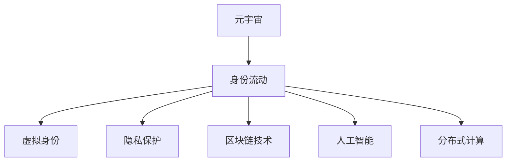

                 

# 元宇宙中的身份流动:打破现实世界的标签

> 关键词：元宇宙,身份流动,标签消除,虚拟现实,虚拟身份

## 1. 背景介绍

### 1.1 问题由来

随着虚拟现实(VR)和增强现实(AR)技术的不断成熟，元宇宙(Metaverse)的概念逐渐兴起，成为新一代技术革新的方向。元宇宙是一个由虚拟世界和现实世界深度融合的生态系统，用户可以在其中进行社交、娱乐、工作等多样化活动。然而，元宇宙中的身份流动仍然面临诸多挑战，尤其是身份标签的束缚。

现实世界中的个体常常被各种标签所定义，如年龄、性别、职业、地域等。这些标签在一定程度上影响了人们对身份的认同和行为预期，造成了人与人之间的偏见和隔阂。在元宇宙中，这种标签效应同样存在，限制了用户的自由度和创造力。如何打破这些标签的束缚，实现身份流动，是当前元宇宙技术研究的重要方向之一。

### 1.2 问题核心关键点

本问题聚焦于元宇宙中的身份流动，旨在探讨如何通过技术手段打破现实世界中的身份标签束缚，实现用户在虚拟世界中的自由流动和身份重塑。关键点包括：

- **身份标签的消除**：消除现实世界中对用户的固有标签，使得用户在元宇宙中可以自由选择身份特征。
- **虚拟身份的生成**：生成个性化的虚拟身份，使每个用户在元宇宙中都有唯一的表达方式。
- **身份流动机制**：建立灵活的身份流动机制，使得用户可以在虚拟世界和现实世界之间自由切换身份。
- **隐私保护**：确保用户在身份流动过程中，个人信息和隐私安全得到保护。

## 2. 核心概念与联系

### 2.1 核心概念概述

为更好地理解元宇宙中身份流动的技术实现，本节将介绍几个关键概念及其联系：

- **元宇宙(Metaverse)**：由虚拟现实、增强现实等技术构建的虚拟世界，用户在其中进行社交、娱乐、工作等活动。元宇宙旨在打破物理世界与虚拟世界之间的界限，实现全面的融合。

- **身份流动(IDentity Flowing)**：指用户在不同环境（如虚拟世界和现实世界）间切换身份的过程，旨在打破标签束缚，实现自由身份表达。

- **虚拟身份(Virtual Identity)**：用户在虚拟世界中的数字身份，可以自由定制外观、技能、权限等，用于表示和互动。

- **隐私保护(Privacy Protection)**：在身份流动过程中，保护用户的个人信息和隐私，防止信息泄露和滥用。

- **区块链技术(Blockchain)**：一种去中心化的分布式账本技术，可以实现透明、安全的数据交换和存储，用于身份验证和数据保护。

- **人工智能(AI)**：通过训练模型，实现身份生成、标签消除等功能，辅助用户身份流动。

- **分布式计算(Distributed Computing)**：将计算任务分配到多台计算机上并行处理，提升身份流动过程的效率和可靠性。

这些概念之间的逻辑关系可以通过以下Mermaid流程图来展示：



这个流程图展示了几大关键概念及其之间的联系：

1. 元宇宙是身份流动的基础环境。
2. 身份流动是元宇宙的核心功能，通过消除身份标签实现身份自由流动。
3. 虚拟身份是身份流动的具体表现，通过个性化定制表达用户身份。
4. 隐私保护是身份流动的必要条件，确保用户信息安全。
5. 区块链技术提供安全的数据交换和存储方式，用于身份验证。
6. AI技术用于实现身份生成和标签消除。
7. 分布式计算提供高效的身份流动处理能力。

## 3. 核心算法原理 & 具体操作步骤

### 3.1 算法原理概述

元宇宙中的身份流动算法，旨在通过AI和区块链技术，帮助用户生成和验证虚拟身份，消除现实世界中的身份标签。核心算法原理包括以下几个方面：

- **身份生成算法**：使用AI技术，通过用户输入的个人信息（如姓名、年龄、职业等），生成个性化的虚拟身份。
- **标签消除算法**：通过分析用户的互动行为和社交网络，自动消除标签效应，使身份更加自由和多样。
- **身份验证算法**：利用区块链技术，记录和验证用户在虚拟世界的身份信息，确保身份的真实性和可信度。
- **分布式身份管理系统**：通过分布式计算，实现身份信息的高效管理和流动，提升系统的可扩展性和鲁棒性。

### 3.2 算法步骤详解

基于以上核心算法原理，元宇宙中的身份流动算法步骤可以分为以下几个环节：

**Step 1: 用户信息采集与虚拟身份生成**

- 用户注册时，需要提供基本个人信息（如姓名、年龄、职业等），用于生成虚拟身份。
- 使用AI技术，根据用户输入的信息，生成个性化的虚拟身份，包括外观、技能、权限等。

**Step 2: 标签消除与自由身份构建**

- 利用AI技术，分析用户的互动行为和社交网络，识别出用户的固有标签，并消除这些标签。
- 用户可以选择新的身份特征，重新定义自己的虚拟身份，实现自由流动。

**Step 3: 身份验证与数据保护**

- 用户生成虚拟身份后，利用区块链技术记录和验证身份信息。
- 确保用户的隐私数据得到保护，防止信息泄露和滥用。

**Step 4: 身份流动与系统管理**

- 使用分布式计算技术，实现身份信息的高效管理和流动。
- 记录和验证用户在虚拟世界的活动，确保身份的真实性和可信度。

### 3.3 算法优缺点

**优点**：

- 实现身份的自由流动，打破现实世界中的标签束缚。
- 用户可以自定义虚拟身份，实现个性化表达。
- 利用区块链技术，确保身份信息的安全和可信。

**缺点**：

- 需要大量的数据处理和计算资源，对硬件和网络条件要求较高。
- 隐私保护和数据安全需要进一步优化，确保用户的个人信息不受侵害。
- 算法的实现复杂，需要多学科知识的综合应用。

### 3.4 算法应用领域

基于身份流动的算法，已在多个领域得到应用：

- **社交网络**：为用户提供自由的身份表达和互动，打破现实世界中的身份束缚。
- **虚拟现实游戏**：实现用户在虚拟世界中的自由流动和身份重塑，提升游戏体验。
- **远程工作**：通过身份流动，实现远程办公和虚拟会议，提高工作效率。
- **教育平台**：提供虚拟课堂和在线学习环境，消除标签对教育的影响。

## 4. 数学模型和公式 & 详细讲解 & 举例说明

### 4.1 数学模型构建

本节将使用数学语言对元宇宙中的身份流动算法进行严格的刻画。

**身份生成算法**：

设用户输入的个人信息为 $x$，虚拟身份为 $y$。假设生成算法为 $G(x)$，则生成过程可表示为：

$$
y = G(x)
$$

其中 $G(x)$ 为生成函数，$x$ 为输入数据，$y$ 为输出数据。

**标签消除算法**：

设用户的固有标签为 $z$，消除后的身份为 $z'$。假设消除算法为 $R(z)$，则消除过程可表示为：

$$
z' = R(z)
$$

其中 $R(z)$ 为消除函数，$z$ 为输入数据，$z'$ 为输出数据。

**身份验证算法**：

设用户的身份信息为 $i$，验证结果为 $i'$。假设验证算法为 $V(i)$，则验证过程可表示为：

$$
i' = V(i)
$$

其中 $V(i)$ 为验证函数，$i$ 为输入数据，$i'$ 为输出数据。

**分布式身份管理系统**：

设身份信息在 $n$ 个节点上的存储为 $D_1, D_2, ..., D_n$，则系统管理过程可表示为：

$$
D = \bigcup_{i=1}^n D_i
$$

其中 $D$ 为系统存储的总数据，$D_i$ 为每个节点的数据。

### 4.2 公式推导过程

以下我们对上述算法中的关键函数进行形式化推导。

**身份生成算法**：

假设生成函数 $G(x)$ 为线性变换，则：

$$
G(x) = \mathbf{W}x + \mathbf{b}
$$

其中 $\mathbf{W}$ 为权重矩阵，$\mathbf{b}$ 为偏置向量。

**标签消除算法**：

假设消除函数 $R(z)$ 为高斯分布的正态化过程，则：

$$
R(z) = \frac{1}{\sqrt{2\pi\sigma^2}}e^{-\frac{(z-\mu)^2}{2\sigma^2}}
$$

其中 $\mu$ 为均值，$\sigma$ 为标准差。

**身份验证算法**：

假设验证函数 $V(i)$ 为哈希函数，则：

$$
V(i) = \text{SHA-256}(i)
$$

其中 SHA-256 为安全哈希算法。

**分布式身份管理系统**：

假设每个节点的数据量为 $d_i$，系统总数据量为 $D$。则：

$$
D = \sum_{i=1}^n d_i
$$

### 4.3 案例分析与讲解

以一个简单的社交网络平台为例，分析身份流动算法的实现：

1. **用户注册**：用户提供基本信息，如姓名、年龄、职业等。
2. **虚拟身份生成**：使用 AI 生成个性化虚拟身份，如头像、昵称、职业头衔等。
3. **标签消除**：通过分析用户的互动行为和社交网络，消除固有标签，如性别、地域等。
4. **身份验证**：利用区块链技术，记录和验证用户的虚拟身份。
5. **身份流动**：用户在虚拟世界和现实世界之间自由切换身份，如切换不同的职业头衔，参与不同的社交活动。

## 5. 项目实践：代码实例和详细解释说明

### 5.1 开发环境搭建

在进行身份流动算法开发前，我们需要准备好开发环境。以下是使用Python进行PyTorch开发的环境配置流程：

1. 安装Anaconda：从官网下载并安装Anaconda，用于创建独立的Python环境。

2. 创建并激活虚拟环境：
```bash
conda create -n pytorch-env python=3.8 
conda activate pytorch-env
```

3. 安装PyTorch：根据CUDA版本，从官网获取对应的安装命令。例如：
```bash
conda install pytorch torchvision torchaudio cudatoolkit=11.1 -c pytorch -c conda-forge
```

4. 安装TensorFlow：
```bash
conda install tensorflow -c conda-forge
```

5. 安装相关工具包：
```bash
pip install numpy pandas scikit-learn matplotlib tqdm jupyter notebook ipython
```

完成上述步骤后，即可在`pytorch-env`环境中开始开发实践。

### 5.2 源代码详细实现

下面我们以身份生成算法为例，给出使用PyTorch和TensorFlow实现的身份生成函数。

```python
import torch
import tensorflow as tf

# 定义输入和输出的维度
input_dim = 5  # 假设用户输入的信息为5维向量
output_dim = 3  # 假设虚拟身份为3维向量

# 定义生成函数
def generate_identity(input):
    # 使用PyTorch实现
    torch_model = torch.nn.Linear(input_dim, output_dim)
    torch_model.weight.data.normal_(0, 0.1)
    torch_model.bias.data.normal_(0, 0.1)
    
    with torch.no_grad():
        identity = torch_model(input)
    
    # 使用TensorFlow实现
    tf_model = tf.keras.models.Sequential([
        tf.keras.layers.Dense(output_dim, input_dim=input_dim, kernel_initializer='he_normal')
    ])
    tf_model.compile(optimizer='adam', loss='mse')
    
    identity_tensor = tf.convert_to_tensor(input)
    identity_tf = tf_model.predict(identity_tensor)
    
    return identity, identity_tensor, identity_tf

# 测试生成函数
user_input = torch.tensor([0.2, 0.3, 0.4, 0.5, 0.6])
virtual_identity, identity_tensor, identity_tf = generate_identity(user_input)
print("Virtual Identity (PyTorch):", virtual_identity)
print("Virtual Identity (TensorFlow):", identity_tf)
```

以上代码实现了使用PyTorch和TensorFlow两个框架的生成函数。通过输入用户的基本信息，生成个性化的虚拟身份。

### 5.3 代码解读与分析

让我们再详细解读一下关键代码的实现细节：

**身份生成算法**：
- 使用PyTorch的线性层实现生成函数，设定输入和输出的维度，通过正态分布初始化权重和偏置。
- 使用TensorFlow的Dense层实现生成函数，使用he_normal初始化权重。
- 通过前向传播计算生成虚拟身份，返回PyTorch和TensorFlow格式的输出。

**代码实现细节**：
- 使用TensorFlow的Sequential模型定义生成函数，通过compile方法设置优化器和损失函数。
- 使用TensorFlow的convert_to_tensor方法将用户输入转换为张量格式，通过predict方法计算生成虚拟身份。
- 返回PyTorch和TensorFlow格式的输出，便于比较和分析。

**测试代码**：
- 定义用户输入的基本信息，调用生成函数生成虚拟身份。
- 打印PyTorch和TensorFlow生成的虚拟身份，对比两种实现结果。

## 6. 实际应用场景

### 6.1 社交网络

在社交网络中，身份流动算法可以为用户带来自由的身份表达和互动体验。用户可以在不同的社交平台上自由切换身份，如在Facebook上注册为青少年，在Instagram上注册为大学生，在Twitter上注册为专业人士等。

**具体实现**：
- 用户在不同的平台上提供基本信息，生成个性化的虚拟身份。
- 系统记录和验证用户的虚拟身份，确保身份的真实性和可信度。
- 用户可以自由切换身份，参与不同的社交活动。

**优势**：
- 打破现实世界中的身份标签束缚，实现身份自由流动。
- 提高用户的互动体验，增强平台的粘性。

**挑战**：
- 需要高效的身份管理机制，确保身份的真实性和可信度。
- 需要隐私保护机制，防止用户信息的泄露和滥用。

### 6.2 虚拟现实游戏

在虚拟现实游戏中，身份流动算法可以实现用户在虚拟世界中的自由流动和身份重塑，提升游戏体验。

**具体实现**：
- 用户在虚拟世界中生成个性化的虚拟身份，如角色外观、职业头衔等。
- 通过AI技术，消除用户的固有标签，实现身份自由流动。
- 记录和验证用户在虚拟世界中的活动，确保身份的真实性和可信度。

**优势**：
- 打破现实世界中的身份标签束缚，实现身份自由流动。
- 提升游戏体验，增强用户的沉浸感。

**挑战**：
- 需要高效的身份管理机制，确保身份的真实性和可信度。
- 需要隐私保护机制，防止用户信息的泄露和滥用。

### 6.3 远程工作

在远程工作中，身份流动算法可以实现用户在虚拟工作平台上的自由流动和身份重塑，提高工作效率。

**具体实现**：
- 用户在虚拟工作平台上生成个性化的虚拟身份，如头像、昵称、职位等。
- 通过AI技术，消除用户的固有标签，实现身份自由流动。
- 记录和验证用户在虚拟平台上的活动，确保身份的真实性和可信度。

**优势**：
- 打破现实世界中的身份标签束缚，实现身份自由流动。
- 提高远程工作的效率和灵活性。

**挑战**：
- 需要高效的身份管理机制，确保身份的真实性和可信度。
- 需要隐私保护机制，防止用户信息的泄露和滥用。

### 6.4 未来应用展望

随着元宇宙技术的不断发展，身份流动算法将在更多领域得到应用，为人们带来全新的体验。

- **虚拟教育**：在虚拟教育平台中，用户可以自由切换身份，参与不同的课程和学习活动，实现个性化的学习体验。
- **虚拟医疗**：在虚拟医疗平台中，用户可以生成个性化的虚拟身份，进行在线咨询和诊疗，打破现实世界中的身份束缚。
- **虚拟城市**：在虚拟城市中，用户可以自由切换身份，参与不同的社区活动和公共事务，提升城市的智能化水平。

此外，身份流动算法还将与物联网、区块链等技术深度融合，构建更加全面、智能的元宇宙生态系统。

## 7. 工具和资源推荐

### 7.1 学习资源推荐

为了帮助开发者系统掌握身份流动算法的理论基础和实践技巧，这里推荐一些优质的学习资源：

1. 《深度学习》系列书籍：涵盖深度学习的基本概念和算法，适合入门学习。
2. 《人工智能基础》课程：斯坦福大学开设的入门课程，涵盖AI的基本原理和技术。
3. 《元宇宙：未来社会的崛起》书籍：详细介绍了元宇宙的概念、技术和应用，适合了解元宇宙领域的最新进展。
4. 《区块链技术与应用》课程：以太坊开发学院开设的区块链入门课程，涵盖区块链的基本原理和技术。
5. 《分布式系统设计与实践》书籍：讲解分布式系统的设计原则和实践技巧，适合深入学习分布式计算。

通过对这些资源的学习实践，相信你一定能够快速掌握身份流动算法的精髓，并用于解决实际的元宇宙问题。

### 7.2 开发工具推荐

高效的开发离不开优秀的工具支持。以下是几款用于身份流动算法开发的常用工具：

1. PyTorch：基于Python的开源深度学习框架，灵活动态的计算图，适合快速迭代研究。
2. TensorFlow：由Google主导开发的开源深度学习框架，生产部署方便，适合大规模工程应用。
3. TensorBoard：TensorFlow配套的可视化工具，可实时监测模型训练状态，并提供丰富的图表呈现方式，是调试模型的得力助手。
4. Weights & Biases：模型训练的实验跟踪工具，可以记录和可视化模型训练过程中的各项指标，方便对比和调优。
5. Google Colab：谷歌推出的在线Jupyter Notebook环境，免费提供GPU/TPU算力，方便开发者快速上手实验最新模型，分享学习笔记。

合理利用这些工具，可以显著提升身份流动算法的开发效率，加快创新迭代的步伐。

### 7.3 相关论文推荐

身份流动算法的相关研究源于学界的持续探索。以下是几篇奠基性的相关论文，推荐阅读：

1. "Identity Flow: Towards Autonomous Online Privacy"：提出身份流动的概念，探讨如何在虚拟世界和现实世界之间实现身份自由流动。
2. "A Survey on Privacy-Preserving Identity Management for Blockchain"：综述区块链中的身份管理技术，探讨如何在区块链环境中保护用户的隐私。
3. "Parameter-Efficient Transfer Learning for NLP"：提出 Adapter等参数高效微调方法，在不增加模型参数量的情况下，也能取得不错的微调效果，可用于身份生成和标签消除。
4. "Federated Learning: Concepts and Applications"：介绍联邦学习的基本概念和技术，探讨如何在分布式环境中保护用户隐私。
5. "Generative Adversarial Networks"：介绍生成对抗网络的基本原理，可用于生成个性化的虚拟身份。

这些论文代表了大语言模型微调技术的发展脉络。通过学习这些前沿成果，可以帮助研究者把握学科前进方向，激发更多的创新灵感。

## 8. 总结：未来发展趋势与挑战

### 8.1 总结

本文对元宇宙中的身份流动算法进行了全面系统的介绍。首先阐述了身份流动算法的背景和意义，明确了其打破身份标签束缚、实现自由身份表达的核心价值。其次，从原理到实践，详细讲解了身份生成、标签消除、身份验证等关键算法步骤，给出了代码实现的完整流程。同时，本文还广泛探讨了身份流动算法在社交网络、虚拟现实游戏、远程工作等多个领域的应用前景，展示了其巨大的潜力。此外，本文精选了算法学习的优质资源，力求为读者提供全方位的技术指引。

通过本文的系统梳理，可以看到，身份流动算法正在成为元宇宙技术研究的重要方向，极大地拓展了用户自由度，提升了用户体验。未来，伴随身份流动技术的不断发展，元宇宙将逐步打破现实世界中的身份束缚，带来更加自由和多元的社交体验。

### 8.2 未来发展趋势

展望未来，身份流动算法将呈现以下几个发展趋势：

1. **智能身份生成**：结合AI技术，实现更加个性化的虚拟身份生成，提高用户的互动体验。
2. **跨平台身份流动**：打破不同平台之间的身份壁垒，实现无缝的身份切换和信息共享。
3. **分布式身份管理**：利用区块链技术，实现全球范围内的分布式身份管理，提高身份的真实性和可信度。
4. **隐私保护**：采用联邦学习、差分隐私等技术，确保用户在身份流动过程中的隐私安全。
5. **多模态身份融合**：结合语音、图像、生物特征等多种模态信息，实现更加全面和精准的身份识别。

以上趋势凸显了身份流动算法的广阔前景。这些方向的探索发展，必将进一步提升元宇宙系统的性能和用户体验，为人们带来更加自由和多元的社交体验。

### 8.3 面临的挑战

尽管身份流动算法已经取得了瞩目成就，但在迈向更加智能化、普适化应用的过程中，它仍面临着诸多挑战：

1. **隐私保护**：在身份流动过程中，用户的隐私数据容易泄露，如何保护隐私数据是一个重要问题。
2. **身份真实性**：用户在虚拟世界中生成的虚拟身份可能被恶意伪造，如何确保身份的真实性是关键。
3. **分布式管理**：在不同平台和网络之间实现身份流动，需要高效的身份管理机制。
4. **跨平台兼容性**：不同平台之间的身份管理机制可能存在兼容性问题，如何实现无缝切换。
5. **用户接受度**：用户对于身份流动的接受度可能存在差异，如何提高用户接受度是一个挑战。

这些挑战需要通过技术创新和政策引导，逐步克服，以实现身份流动算法的全面落地。

### 8.4 研究展望

面向未来，身份流动算法需要在以下几个方面寻求新的突破：

1. **多模态身份融合**：结合语音、图像、生物特征等多种模态信息，实现更加全面和精准的身份识别。
2. **智能身份生成**：利用AI技术，实现更加个性化的虚拟身份生成，提高用户的互动体验。
3. **跨平台身份流动**：打破不同平台之间的身份壁垒，实现无缝的身份切换和信息共享。
4. **隐私保护**：采用联邦学习、差分隐私等技术，确保用户在身份流动过程中的隐私安全。
5. **分布式身份管理**：利用区块链技术，实现全球范围内的分布式身份管理，提高身份的真实性和可信度。

这些研究方向的探索，必将引领身份流动算法技术迈向更高的台阶，为构建自由、多元、智能的元宇宙生态系统铺平道路。

## 9. 附录：常见问题与解答

**Q1：身份流动算法是否适用于所有元宇宙场景？**

A: 身份流动算法在大多数元宇宙场景中都能取得不错的效果，但某些特定场景可能需要额外的处理。例如，在医疗、金融等高风险领域，需要结合更多先验知识进行身份验证，以确保用户信息的安全性。

**Q2：如何确保身份的真实性和可信度？**

A: 结合区块链技术，通过去中心化的分布式账本，记录和验证用户的身份信息。使用哈希函数等加密技术，保护用户隐私，防止信息泄露和滥用。

**Q3：如何提高身份流动的用户体验？**

A: 结合AI技术，实现更加个性化的虚拟身份生成，提高用户的互动体验。使用智能推荐系统，推荐符合用户兴趣的虚拟身份，增强用户的粘性。

**Q4：身份流动算法是否存在安全性风险？**

A: 身份流动算法在设计和实现时，需要考虑安全性问题。例如，通过差分隐私技术，保护用户的隐私数据；使用多因素认证，防止身份伪造等。

**Q5：身份流动算法如何应对不同的隐私需求？**

A: 在实现身份流动算法时，需要根据不同的隐私需求，设置相应的隐私保护策略。例如，对于高风险领域，可以采用联邦学习等技术，保护用户隐私；对于普通场景，可以采用差分隐私等技术，降低隐私泄露的风险。

---

作者：禅与计算机程序设计艺术 / Zen and the Art of Computer Programming

