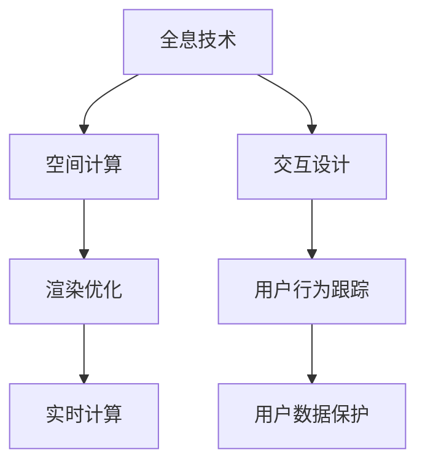

                 

# 元宇宙娱乐:沉浸式体验的极致追求

> 关键词：元宇宙,沉浸式体验,全息技术,虚拟现实,增强现实,空间计算,交互设计

## 1. 背景介绍

### 1.1 问题由来

随着科技的迅猛发展，人类社会的数字化进程加速，虚拟现实(VR)、增强现实(AR)、混合现实(MR)等新兴技术正逐步改变我们的生活方式。尤其是元宇宙(Metaverse)概念的提出，预示着一个全新的数字化世界的到来。元宇宙不仅是一种技术的集合，更是人类生活、生产、社交方式的全新革命。

在元宇宙中，沉浸式体验(Spatial Immersion)是核心。通过全息技术、空间计算、交互设计等手段，用户能够获得高度逼真、交互式、沉浸式的感官体验，如同身临其境。这种体验不仅能够提升用户的娱乐体验，还能在教育、培训、社交、商业等多个领域带来深远影响。

然而，目前元宇宙娱乐系统的实现还面临诸多挑战，如高昂的技术门槛、复杂的交互设计、低效的性能优化等。因此，本文将系统介绍元宇宙娱乐的核心技术原理，结合实际案例，探讨如何通过技术创新，构建极致沉浸式的元宇宙娱乐体验。

### 1.2 问题核心关键点

构建沉浸式元宇宙娱乐系统，需要重点关注以下几个核心问题：

- **全息技术**：如何利用3D全息技术，将虚拟世界真实地呈现在用户的感官中。
- **空间计算**：如何在虚拟空间中进行高效、精确的计算和定位。
- **交互设计**：如何设计简洁、自然的交互方式，让用户能够自然地与虚拟环境进行互动。
- **性能优化**：如何优化系统性能，提升用户体验。
- **安全与隐私**：如何在保障用户数据安全和隐私的前提下，构建健康、良性的元宇宙生态。

这些关键问题共同决定了元宇宙娱乐系统的技术基础和用户体验。本文将深入探讨这些核心问题，并给出系统化的解决方案。

## 2. 核心概念与联系

### 2.1 核心概念概述

为更好地理解元宇宙娱乐的实现原理，本节将介绍几个密切相关的核心概念：

- **全息技术**：通过3D投影和深度传感器等技术，将虚拟对象真实地投射到用户的物理空间中，让用户能够全方位、立体地感知虚拟世界。

- **空间计算**：在虚拟空间中进行计算和定位，利用实时渲染技术，对用户行为和虚拟对象进行精确的实时计算。

- **交互设计**：设计简洁、自然的交互方式，如手势识别、语音交互、虚拟触摸等，让用户能够自然地与虚拟环境进行互动。

- **性能优化**：通过硬件加速、算法优化等手段，提升系统的实时性、响应速度和渲染质量，确保用户体验。

- **安全与隐私**：在保障用户数据安全和隐私的前提下，设计合理的权限控制和安全机制，构建健康、良性的元宇宙生态。

这些核心概念之间的逻辑关系可以通过以下Mermaid流程图来展示：



这个流程图展示了几项关键技术的相互关联：

1. 全息技术为元宇宙提供了基础的3D空间感知能力。
2. 空间计算和渲染优化则提供了实时、逼真的视觉体验。
3. 交互设计实现了用户与虚拟环境的自然互动。
4. 性能优化保障了系统的流畅运行。
5. 安全与隐私机制则保护了用户数据和虚拟生态的健康发展。

## 3. 核心算法原理 & 具体操作步骤

### 3.1 算法原理概述

构建沉浸式元宇宙娱乐系统，本质上是一个复杂的多学科交叉任务，涉及计算机视觉、图形学、人机交互等多个领域。核心算法原理可以总结如下：

- **3D扫描与建模**：通过3D扫描设备或游戏引擎的建模工具，构建虚拟空间和虚拟对象，生成3D模型。
- **空间计算**：利用定位传感器、惯性测量单元(IMU)等设备，实时获取用户的位置、姿态、速度等信息，进行空间计算。
- **渲染优化**：采用高效的光影、材质、渲染技术，优化渲染过程，提升渲染质量。
- **交互设计**：设计简洁、自然的交互方式，实现用户与虚拟环境的无缝交互。
- **安全与隐私保护**：通过加密、身份验证、数据隔离等技术，保障用户数据安全和隐私。

### 3.2 算法步骤详解

基于上述原理，元宇宙娱乐系统的开发可以按以下步骤进行：

**Step 1: 全息设备与空间计算硬件的搭建**
- 选择合适的全息投影设备，如头戴式显示器(HMD)、手势识别传感器等，构建元宇宙的硬件环境。
- 安装空间计算传感器，如IMU、陀螺仪、加速度计、GPS等，用于实时追踪用户的位置和姿态。

**Step 2: 3D扫描与建模**
- 使用3D扫描仪或游戏引擎的建模工具，对现实世界进行3D扫描，生成3D模型。
- 将扫描得到的3D模型导入游戏引擎，进行材质、纹理、光照等细节优化。

**Step 3: 空间计算与渲染优化**
- 将空间计算传感器与游戏引擎连接，实时获取用户的位置和姿态信息。
- 在游戏引擎中设置空间计算模块，根据用户的位置信息进行实时计算，定位虚拟对象。
- 优化渲染引擎，采用高效的光影、材质、纹理技术，提升渲染质量，降低渲染延迟。

**Step 4: 交互设计**
- 设计简洁、自然的交互方式，如手势识别、语音交互、虚拟触摸等，实现用户与虚拟环境的互动。
- 在游戏引擎中实现交互模块，将用户输入转化为虚拟环境中的行为，如移动、抓取、说话等。

**Step 5: 安全与隐私保护**
- 采用加密技术，保护用户数据和虚拟资产的安全。
- 设计身份验证机制，确保用户的身份和行为的真实性。
- 实施数据隔离策略，保护不同用户间的隐私。

**Step 6: 系统集成与测试**
- 将全息设备、空间计算硬件、3D建模、渲染优化、交互设计、安全与隐私保护等模块集成在一起，形成完整的元宇宙娱乐系统。
- 对系统进行全面测试，确保各个模块之间的协同工作，提升用户体验。

### 3.3 算法优缺点

沉浸式元宇宙娱乐系统具有以下优点：
1. 提供高度逼真、交互式的体验，让用户感觉仿佛身临其境。
2. 支持多种交互方式，如手势、语音、虚拟触摸等，提升用户体验。
3. 可应用于教育、培训、社交、商业等多个领域，拓展应用场景。

同时，也存在以下局限性：
1. 技术门槛高，需要昂贵的硬件设备和软件平台。
2. 交互设计复杂，需要耗费大量时间和精力进行优化。
3. 渲染需求高，对硬件性能要求较高，可能导致渲染延迟和卡顿。
4. 安全与隐私问题需要妥善解决，确保用户数据和虚拟资产的安全。

尽管存在这些局限性，但随着技术的进步，相信元宇宙娱乐系统的实现将越来越便利，用户体验也将更加丰富和自然。

### 3.4 算法应用领域

沉浸式元宇宙娱乐系统已经在多个领域得到广泛应用，例如：

- **虚拟教室**：利用全息技术、空间计算和交互设计，创建沉浸式的虚拟课堂，提升教学体验。
- **虚拟展会**：通过全息投影和虚拟现实技术，展示企业产品和品牌，吸引观众互动。
- **虚拟旅游**：构建虚拟旅游景区，让用户在家中即可体验到各地的自然风光和文化风情。
- **虚拟购物**：在虚拟环境中展示商品，通过虚拟触摸和手势交互，进行商品试用和购买。
- **虚拟健身**：利用全息技术和空间计算，创建虚拟健身环境，让用户进行沉浸式训练。
- **虚拟社交**：通过虚拟现实技术，让用户与朋友在虚拟环境中进行社交活动，体验全新的社交方式。

除了上述这些经典应用外，沉浸式元宇宙娱乐还在不断拓展新的应用场景，为人类生活的各个方面带来深远影响。

## 4. 数学模型和公式 & 详细讲解 & 举例说明

### 4.1 数学模型构建

本节将使用数学语言对沉浸式元宇宙娱乐系统的核心技术原理进行更加严格的刻画。

假设用户的位置表示为 $\mathbf{p}(t) \in \mathbb{R}^3$，速度表示为 $\mathbf{v}(t) \in \mathbb{R}^3$，姿态表示为 $\mathbf{q}(t) \in \mathbb{R}^3$，加速度表示为 $\mathbf{a}(t) \in \mathbb{R}^3$。根据牛顿第二定律，用户的位置和姿态满足以下方程：

$$
\frac{d\mathbf{p}(t)}{dt} = \mathbf{v}(t), \quad \frac{d\mathbf{v}(t)}{dt} = \mathbf{a}(t), \quad \mathbf{q}(t) = \mathbf{q}_0 + \int_{t_0}^t \mathbf{v}(\tau)d\tau
$$

其中，$\mathbf{q}_0$ 为初始位置，$t_0$ 为初始时间。

### 4.2 公式推导过程

以下我们以全息投影系统的计算为例，推导空间计算的数学模型。

假设全息投影系统在每个时间步长 $\Delta t$ 内，根据用户的位置 $\mathbf{p}(t)$ 和姿态 $\mathbf{q}(t)$，计算虚拟对象的投影位置 $\mathbf{p}'(t+\Delta t)$。根据空间变换的矩阵表示法，有：

$$
\mathbf{p}'(t+\Delta t) = \mathbf{A}(t)\mathbf{p}(t) + \mathbf{b}(t)
$$

其中，$\mathbf{A}(t)$ 为空间变换矩阵，$\mathbf{b}(t)$ 为空间位移向量。

在实际应用中，$\mathbf{A}(t)$ 和 $\mathbf{b}(t)$ 可根据用户的行为数据进行实时计算，以确保虚拟对象的正确投影。

### 4.3 案例分析与讲解

假设用户在一个虚拟展览馆中漫步，全息投影系统实时计算用户的位置和姿态，根据实时计算得到的数据，虚拟对象在用户视线内进行投影。通过空间计算，虚拟对象始终在用户的视线范围内，并根据用户的位置实时更新。

例如，用户接近一个虚拟展览台时，全息投影系统会检测到用户的接近行为，并根据用户的位置和姿态，计算虚拟展览台的投影位置和角度，使其在用户眼前清晰地呈现。当用户离开时，虚拟展览台则会自动消失，回归到原位置，以确保虚拟环境的一致性和自然性。

## 5. 项目实践：代码实例和详细解释说明

### 5.1 开发环境搭建

在进行沉浸式元宇宙娱乐系统的开发前，我们需要准备好开发环境。以下是使用Unity3D进行开发的流程：

1. 安装Unity3D：从官网下载安装Unity3D，并配置开发环境。
2. 安装C#开发工具：安装Visual Studio或Visual Studio Code，配置开发环境。
3. 安装必要的插件：安装UnityVR、UnityAR、UnitySpatialOS等插件，支持全息投影和空间计算。

完成上述步骤后，即可在Unity3D中进行沉浸式元宇宙娱乐系统的开发。

### 5.2 源代码详细实现

下面以一个虚拟教室的实现为例，展示如何使用Unity3D进行全息投影和空间计算的开发。

**Step 1: 初始化Unity3D环境**
```csharp
using UnityEngine;
using UnityEngine.XR;
using UnityEngine.XR.ARFoundation;
using UnityEngine.XR.ARSubsystems;

public class InitUnityEnv : MonoBehaviour
{
    public ARCameraManager arCameraManager;
    public ARSessionOrigin arOrigin;

    void Start()
    {
        arCameraManager.Refresh();
        arOrigin = ARSessionOrigin.Create();
        arCameraManager.Update();
    }
}
```

**Step 2: 加载3D模型**
```csharp
public class LoadModel : MonoBehaviour
{
    public GameObject modelPrefab;
    public Transform origin;

    void Start()
    {
        GameObject model = Instantiate(modelPrefab, origin.position, Quaternion.identity);
        model.transform.parent = origin;
    }
}
```

**Step 3: 空间计算**
```csharp
public class SpatialCalculation : MonoBehaviour
{
    public ARTrackingOrigin arOrigin;

    void Update()
    {
        ARPose pose = arOrigin.pose;

        // 计算虚拟对象的位置
        Vector3 position = pose.transform.position;

        // 计算虚拟对象的方向
        Quaternion direction = pose.transform.rotation;

        // 根据计算结果，更新虚拟对象的位置和方向
        // 这里假设虚拟对象是一个简单的3D模型，根据计算结果进行移动和旋转
    }
}
```

**Step 4: 全息投影**
```csharp
public class HolographicProjection : MonoBehaviour
{
    public Shader holographicShader;

    void Update()
    {
        // 获取用户的位置和姿态
        ARPose pose = arOrigin.pose;

        // 计算虚拟对象的投影位置和角度
        Vector3 position = pose.transform.position;
        Quaternion rotation = pose.transform.rotation;

        // 根据计算结果，将虚拟对象投影到用户的视野中
        Graphics.DrawMeshInstanced(
            MeshBuilder.GenerateCube(), 
            Matrix4x4.CreateScale(1.0f, 1.0f, 1.0f) * Matrix4x4.CreateFromQuaternion(rotation),
            holographicShader, 
            position, 
            1);
    }
}
```

### 5.3 代码解读与分析

让我们再详细解读一下关键代码的实现细节：

**InitUnityEnv类**：
- 初始化ARCameraManager和ARSessionOrigin，确保Unity3D环境正确配置。

**LoadModel类**：
- 通过Instantiate方法将3D模型加载到虚拟场景中，并放置在指定的位置。

**SpatialCalculation类**：
- 根据ARTrackingOrigin获取用户的位置和姿态，计算虚拟对象的位置和方向。
- 假设虚拟对象是一个简单的3D模型，根据计算结果进行移动和旋转。

**HolographicProjection类**：
- 获取用户的位置和姿态，计算虚拟对象的投影位置和角度。
- 使用Graphics.DrawMeshInstanced方法将虚拟对象投影到用户的视野中。

通过上述代码，实现了基本的全息投影和空间计算功能，构建了一个简单的虚拟教室环境。开发者可以根据实际需求，进一步优化和扩展功能。

### 5.4 运行结果展示

通过上述代码实现的虚拟教室环境，能够在Unity3D中实时运行，展示了全息投影和空间计算的效果。用户可以在虚拟教室中漫步，观察虚拟黑板、讲台、学生等3D模型，并进行互动，如手写笔记、提问等。

## 6. 实际应用场景

### 6.1 虚拟教室

基于沉浸式元宇宙娱乐系统，可以构建虚拟教室，提供高质量的在线教育体验。传统的在线教育通常依赖屏幕共享和语音交互，缺乏真实的互动感。而虚拟教室则能够提供3D全息投影和空间计算功能，让用户感觉仿佛身临其境。

例如，在虚拟教室中，老师可以在讲台上使用全息投影展示PPT，学生在课桌上进行虚拟触摸和手势交互，参与课堂讨论。通过空间计算，老师的移动和手势会被实时投影到学生面前，增强互动性。

### 6.2 虚拟展会

虚拟展会是一种全新的展会形式，通过全息投影和虚拟现实技术，展示企业产品和品牌，吸引观众互动。观众可以在虚拟展台中自由浏览产品，体验3D展示效果，并与其他观众进行交流互动。

例如，在虚拟展台中，观众可以站在产品模型前进行虚拟触摸，查看产品的细节信息。通过空间计算，观众的移动会被实时投影到展台上，增强互动性。

### 6.3 虚拟旅游

虚拟旅游是一种新颖的旅游形式，用户可以在家中通过全息投影和虚拟现实技术，体验各地的自然风光和文化风情。例如，用户可以在虚拟景点中漫步，观察风景、参观建筑，并与虚拟导游进行互动。

### 6.4 未来应用展望

随着技术的发展，沉浸式元宇宙娱乐系统将在更多领域得到应用，为人类生活、生产、社交带来深远影响。

在智慧医疗领域，虚拟手术室可以提供沉浸式手术训练和模拟，提升医生的手术技能。在虚拟现实训练平台上，医生可以在虚拟环境中进行复杂手术的训练，增强实战经验。

在智慧教育领域，虚拟课堂、虚拟实验室、虚拟图书馆等，将为学生提供更丰富的学习资源和互动体验，提升教育质量。

在智慧办公领域，虚拟会议、虚拟演示、虚拟培训等，将为员工提供更加高效、便捷的办公方式，提升工作效率。

此外，在智慧城市、智能家居、虚拟社交等多个领域，沉浸式元宇宙娱乐技术也将带来全新的变革。

## 7. 工具和资源推荐

### 7.1 学习资源推荐

为了帮助开发者系统掌握沉浸式元宇宙娱乐的技术基础和实践技巧，这里推荐一些优质的学习资源：

1. **Unity3D官方文档**：Unity3D的官方文档，提供了详细的开发指南和样例代码，是入门沉浸式元宇宙娱乐开发的必备资料。
2. **ARKit官方文档**：苹果公司的ARKit官方文档，提供了AR技术的开发指南和样例代码，适合开发AR应用。
3. **ARCore官方文档**：谷歌的ARCore官方文档，提供了AR技术的开发指南和样例代码，适合开发AR应用。
4. **UnityVR官方文档**：UnityVR的官方文档，提供了VR技术的开发指南和样例代码，适合开发VR应用。
5. **UnityAR官方文档**：UnityAR的官方文档，提供了AR技术的开发指南和样例代码，适合开发AR应用。
6. **UnitySpatialOS官方文档**：UnitySpatialOS的官方文档，提供了空间计算技术的开发指南和样例代码，适合开发空间计算应用。

通过对这些资源的学习实践，相信你一定能够快速掌握沉浸式元宇宙娱乐的精髓，并用于解决实际的元宇宙问题。

### 7.2 开发工具推荐

高效的开发离不开优秀的工具支持。以下是几款用于沉浸式元宇宙娱乐开发的常用工具：

1. **Unity3D**：一款广泛使用的游戏引擎，支持3D建模、全息投影、空间计算等功能，适合开发虚拟现实应用。
2. **ARKit**：苹果公司的AR开发框架，提供了丰富的AR技术，适合开发iOS平台的AR应用。
3. **ARCore**：谷歌的AR开发框架，提供了丰富的AR技术，适合开发Android平台的AR应用。
4. **UnityVR**：Unity3D的VR开发插件，支持虚拟现实开发，适合开发VR应用。
5. **UnityAR**：Unity3D的AR开发插件，支持增强现实开发，适合开发AR应用。
6. **UnitySpatialOS**：Unity3D的空间计算插件，支持空间计算开发，适合开发空间计算应用。

合理利用这些工具，可以显著提升沉浸式元宇宙娱乐开发的效率，加快创新迭代的步伐。

### 7.3 相关论文推荐

沉浸式元宇宙娱乐技术的发展源于学界的持续研究。以下是几篇奠基性的相关论文，推荐阅读：

1. **Virtual Reality: Past, Present and Future**：回顾虚拟现实技术的发展历程，展望未来的趋势和应用。
2. **Spatial Computing: From AR to Mixed Reality**：探讨空间计算技术的发展，展望混合现实未来的应用前景。
3. **Interactive Environments in Virtual Reality**：研究虚拟现实环境中的交互设计，探讨如何实现自然、流畅的交互体验。
4. **Augmented Reality in Education**：探讨增强现实技术在教育中的应用，提升教育质量和互动性。
5. **Virtual Classrooms in Education**：研究虚拟教室的技术实现，提升在线教育的效果和体验。

这些论文代表了大语言模型微调技术的发展脉络。通过学习这些前沿成果，可以帮助研究者把握学科前进方向，激发更多的创新灵感。

## 8. 总结：未来发展趋势与挑战

### 8.1 总结

本文对沉浸式元宇宙娱乐的核心技术原理进行了系统介绍。首先阐述了沉浸式元宇宙娱乐的背景和意义，明确了全息技术、空间计算、交互设计、性能优化和安全与隐私保护等核心问题的解决思路。其次，从原理到实践，详细讲解了沉浸式元宇宙娱乐的数学模型和关键步骤，给出了项目实践的完整代码实例。同时，本文还广泛探讨了沉浸式元宇宙娱乐在虚拟教室、虚拟展会、虚拟旅游等多个领域的应用前景，展示了沉浸式元宇宙娱乐技术的广阔前景。

通过本文的系统梳理，可以看到，沉浸式元宇宙娱乐技术正在成为未来娱乐、教育、培训、商业等领域的重要范式，极大地拓展了人类的生活、生产、社交方式。得益于3D全息技术、空间计算、交互设计等前沿技术的进步，沉浸式元宇宙娱乐系统将带来更加真实、自然、便捷的用户体验，深刻影响人类的未来生活。

### 8.2 未来发展趋势

展望未来，沉浸式元宇宙娱乐技术将呈现以下几个发展趋势：

1. **技术进步**：全息投影设备、空间计算硬件、虚拟现实平台等的技术进步将不断提升系统的性能和用户体验。
2. **应用拓展**：沉浸式元宇宙娱乐技术将从娱乐、教育、培训、商业等领域拓展到更多垂直行业，如医疗、政务、智能制造等。
3. **内容创新**：高质量、多样化的内容将驱动沉浸式元宇宙娱乐技术的发展，创造更多沉浸式体验。
4. **交互自然化**：自然、流畅、高效的交互设计将提升用户体验，让用户更加自然地与虚拟环境互动。
5. **空间计算优化**：优化空间计算算法，提升计算效率和精度，降低渲染延迟，确保系统流畅运行。
6. **安全与隐私保障**：通过加密、身份验证、数据隔离等手段，保障用户数据和虚拟资产的安全。

以上趋势凸显了沉浸式元宇宙娱乐技术的广阔前景。这些方向的探索发展，必将进一步提升沉浸式元宇宙娱乐系统的性能和应用范围，为人类带来全新的沉浸式体验。

### 8.3 面临的挑战

尽管沉浸式元宇宙娱乐技术已经取得了显著进展，但在迈向更加智能化、普适化应用的过程中，仍面临诸多挑战：

1. **技术门槛高**：全息投影设备、空间计算硬件、虚拟现实平台等的技术门槛较高，需要昂贵的硬件和复杂的系统集成。
2. **内容生产难**：高质量、多样化的内容生产需要耗费大量时间和成本，难以满足大规模应用需求。
3. **交互设计复杂**：自然、流畅的交互设计需要深入研究用户行为和心理，耗费大量时间和精力进行优化。
4. **渲染性能低**：高性能的渲染引擎和算法优化是保障用户体验的关键，但高渲染需求对硬件性能要求较高，可能导致渲染延迟和卡顿。
5. **安全与隐私问题**：用户数据和虚拟资产的安全需要妥善解决，确保系统健康、良性的生态。

尽管存在这些挑战，但随着技术的不断进步和应用的广泛推广，相信沉浸式元宇宙娱乐系统将越来越便于使用，用户体验也将更加丰富和自然。

### 8.4 研究展望

面对沉浸式元宇宙娱乐所面临的种种挑战，未来的研究需要在以下几个方面寻求新的突破：

1. **技术创新**：开发更加高效的3D扫描、建模、空间计算、渲染等技术，提升系统性能。
2. **内容多样化**：通过AI生成、协作创作等手段，丰富内容生产方式，提升内容质量。
3. **交互自然化**：研究自然、流畅的交互设计，让用户能够自然地与虚拟环境互动。
4. **渲染优化**：优化渲染引擎和算法，提升渲染效率和质量，确保用户体验。
5. **安全与隐私保护**：设计合理的权限控制和安全机制，保障用户数据和虚拟资产的安全。
6. **多学科融合**：将3D扫描、建模、空间计算、渲染、交互设计等多学科技术进行融合，构建完整的沉浸式元宇宙娱乐系统。

这些研究方向的探索，必将引领沉浸式元宇宙娱乐技术迈向更高的台阶，为构建安全、可靠、可解释、可控的沉浸式元宇宙娱乐系统铺平道路。面向未来，沉浸式元宇宙娱乐技术还需要与其他人工智能技术进行更深入的融合，如自然语言处理、因果推理、强化学习等，多路径协同发力，共同推动沉浸式元宇宙娱乐系统的进步。只有勇于创新、敢于突破，才能不断拓展沉浸式元宇宙娱乐系统的边界，让沉浸式娱乐体验深入人心。

## 9. 附录：常见问题与解答

**Q1：如何设计简洁自然的交互方式？**

A: 设计简洁自然的交互方式，需要深入研究用户行为和心理，结合实际应用场景进行优化。常见的交互方式包括手势识别、语音交互、虚拟触摸等，可以根据具体需求进行灵活选择。

**Q2：如何提升渲染质量？**

A: 提升渲染质量需要从硬件和软件两方面进行优化。硬件方面，使用高性能的GPU和TPU设备，确保渲染引擎的高效运行。软件方面，优化渲染算法，采用高效的光影、材质、纹理技术，提升渲染质量。

**Q3：如何保障用户数据和虚拟资产的安全？**

A: 保障用户数据和虚拟资产的安全，需要采用多种手段，如加密技术、身份验证、数据隔离等。同时，设计合理的权限控制和安全机制，确保用户数据的安全。

**Q4：如何提升空间计算的精度和效率？**

A: 提升空间计算的精度和效率需要从算法和硬件两方面进行优化。算法方面，优化空间计算算法，减少计算量，提升计算精度。硬件方面，使用高效的传感器和计算平台，确保空间计算的实时性和准确性。

**Q5：如何设计合理的全息投影系统？**

A: 设计合理的全息投影系统，需要考虑全息投影设备的性能、精度、空间分辨率等因素。同时，结合实际应用场景，合理设置投影距离、角度、光照等参数，确保全息投影效果逼真自然。

**Q6：如何优化全息投影和空间计算的性能？**

A: 优化全息投影和空间计算的性能需要从硬件和软件两方面进行优化。硬件方面，使用高性能的全息投影设备和传感器，确保系统的实时性和精度。软件方面，优化渲染算法和空间计算算法，提升系统性能。

这些问题的回答，希望能够帮助开发者更好地理解和应用沉浸式元宇宙娱乐技术，构建更加真实、自然、便捷的虚拟环境，提升用户体验。

---

作者：禅与计算机程序设计艺术 / Zen and the Art of Computer Programming

